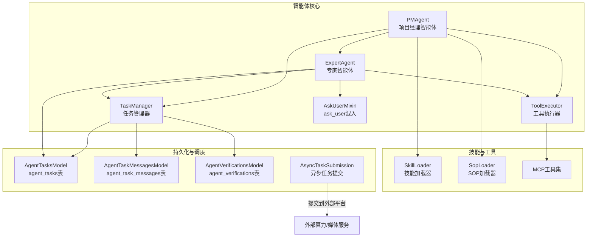
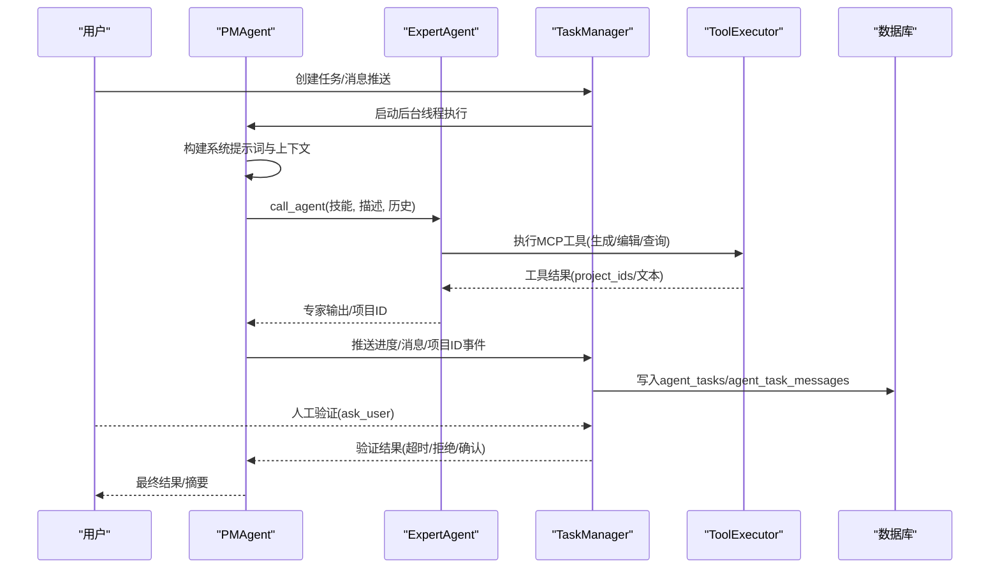
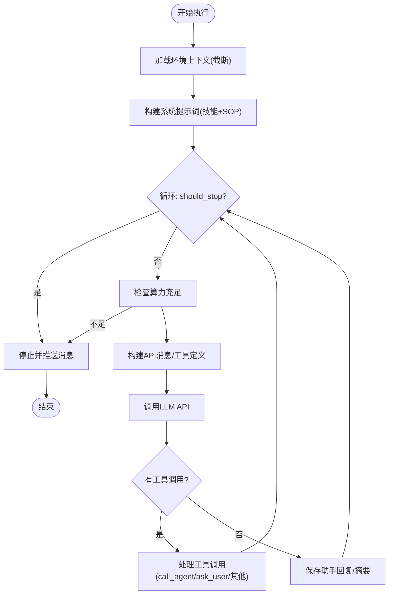
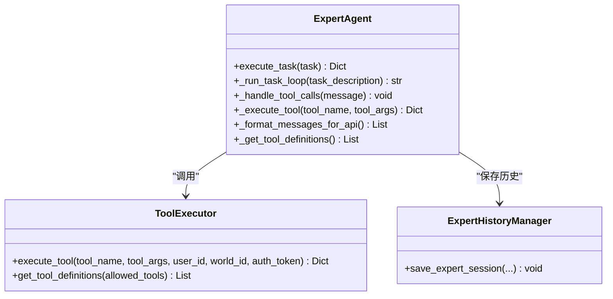
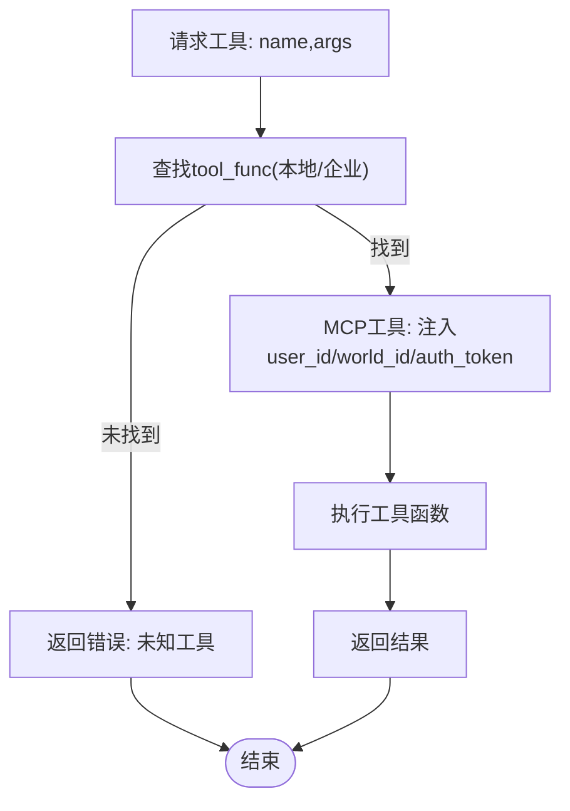
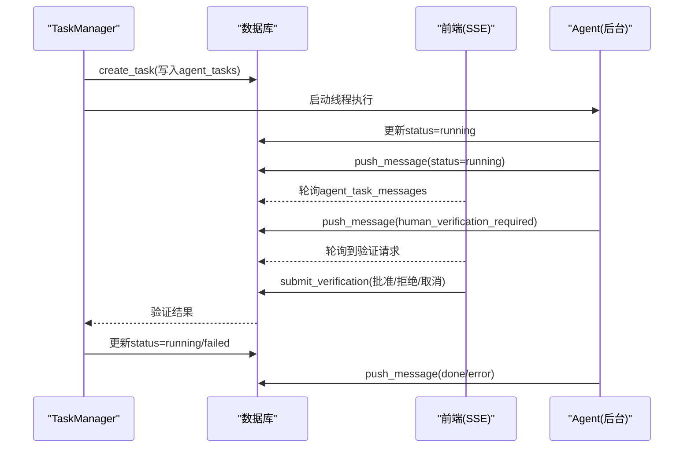
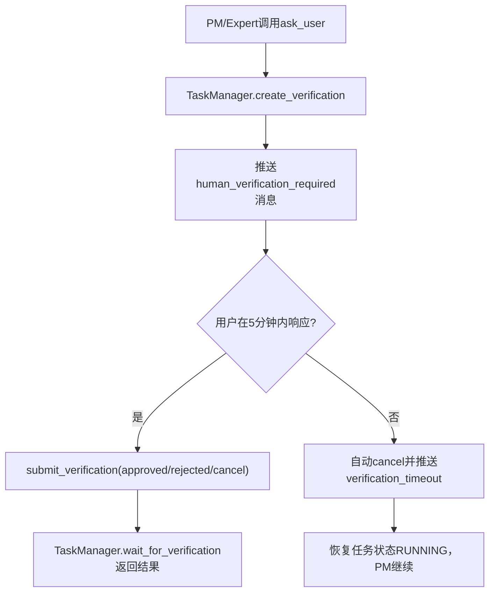
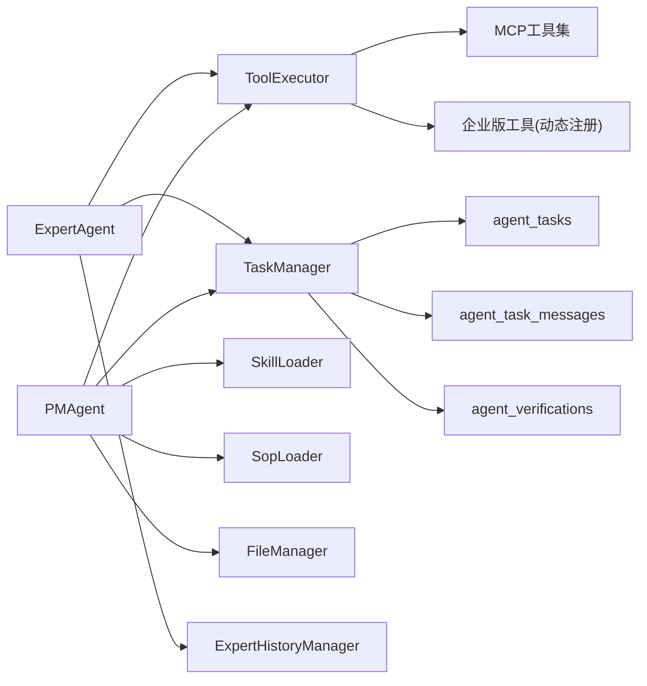

# AI智能体系统

<cite>
**本文引用的文件**
- [script_writer_core/agents/__init__.py](file://script_writer_core/agents/__init__.py)
- [script_writer_core/agents/pm_agent.py](file://script_writer_core/agents/pm_agent.py)
- [script_writer_core/agents/expert_agent.py](file://script_writer_core/agents/expert_agent.py)
- [script_writer_core/agents/tool_executor.py](file://script_writer_core/agents/tool_executor.py)
- [script_writer_core/agents/task_manager.py](file://script_writer_core/agents/task_manager.py)
- [script_writer_core/agents/ask_user_mixin.py](file://script_writer_core/agents/ask_user_mixin.py)
- [script_writer_core/agents/base_agent.py](file://script_writer_core/agents/base_agent.py)
- [script_writer_core/agents/history_manager.py](file://script_writer_core/agents/history_manager.py)
- [script_writer_core/agents/tool_definitions.py](file://script_writer_core/agents/tool_definitions.py)
- [script_writer_core/skill_loader.py](file://script_writer_core/skill_loader.py)
- [agents/skill_loader.py](file://agents/skill_loader.py)
- [script_writer_core/mcp_tool.py](file://script_writer_core/mcp_tool.py)
- [model/agent_tasks.py](file://model/agent_tasks.py)
- [model/agent_task_messages.py](file://model/agent_task_messages.py)
- [model/agent_verifications.py](file://model/agent_verifications.py)
- [task/async_task_submission.py](file://task/async_task_submission.py)
- [docs/backend/runninghub_concurrency_control.md](file://docs/backend/runninghub_concurrency_control.md)
- [alembic/versions/20260406_create_agent_tasks.py](file://alembic/versions/20260406_create_agent_tasks.py)
</cite>

## 目录
1. [简介](#简介)
2. [项目结构](#项目结构)
3. [核心组件](#核心组件)
4. [架构总览](#架构总览)
5. [详细组件分析](#详细组件分析)
6. [依赖关系分析](#依赖关系分析)
7. [性能考量](#性能考量)
8. [故障排查指南](#故障排查指南)
9. [结论](#结论)
10. [附录](#附录)

## 简介
本文件面向ZhiJuTong AI智能体系统，聚焦“多智能体协作架构”。系统以项目经理智能体（PMAgent）为核心，协调8个专家智能体完成复杂创作任务；通过统一的工具执行器（ToolExecutor）承载各类外部能力；借助任务管理器（TaskManager）实现跨进程、跨线程的任务生命周期管理与消息推送；并以ask_user工具实现可控的人机交互与状态管理。本文将深入解释技能加载机制、工具执行器工作原理、任务协调器调度策略、ask_user工具实现与交互模式、智能体间通信协议、状态管理与冲突解决机制，并提供扩展开发指南、性能优化建议与容错重试策略。

## 项目结构
围绕脚本创作与多媒体生成的智能体体系，核心位于script_writer_core/agents目录，配合agents/skills与agents技能加载模块，以及model层的任务与消息持久化、task层的异步任务提交与并发控制等支撑模块。

**图表来源**
- [script_writer_core/agents/pm_agent.py:20-128](file://script_writer_core/agents/pm_agent.py#L20-L128)
- [script_writer_core/agents/expert_agent.py:17-82](file://script_writer_core/agents/expert_agent.py#L17-L82)
- [script_writer_core/agents/tool_executor.py:53-98](file://script_writer_core/agents/tool_executor.py#L53-L98)
- [script_writer_core/agents/task_manager.py:198-290](file://script_writer_core/agents/task_manager.py#L198-L290)
- [script_writer_core/agents/ask_user_mixin.py:52-137](file://script_writer_core/agents/ask_user_mixin.py#L52-L137)
- [script_writer_core/skill_loader.py](file://script_writer_core/skill_loader.py)
- [agents/skill_loader.py](file://agents/skill_loader.py)
- [script_writer_core/mcp_tool.py](file://script_writer_core/mcp_tool.py)
- [model/agent_tasks.py](file://model/agent_tasks.py)
- [model/agent_task_messages.py](file://model/agent_task_messages.py)
- [model/agent_verifications.py](file://model/agent_verifications.py)
- [task/async_task_submission.py:113-146](file://task/async_task_submission.py#L113-L146)

**章节来源**
- [script_writer_core/agents/__init__.py:1-28](file://script_writer_core/agents/__init__.py#L1-L28)

## 核心组件
- 项目经理智能体（PMAgent）：负责任务拆解、串行派发、专家协调、进度推进与终止条件判断，内置上下文压缩与算力检查。
- 专家智能体（ExpertAgent）：执行具体技能任务，支持多模态输入、工具调用、历史管理与会话持久化。
- 工具执行器（ToolExecutor）：统一注册与转发MCP工具，按需注入用户上下文，兼容企业版动态工具。
- 任务管理器（TaskManager）：跨进程共享的状态机，负责任务创建、执行线程、消息推送（SSE）、人工验证请求与轮询。
- ask_user混入（AskUserMixin）：封装ask_user工具的创建、等待与超时处理，保障交互顺序与幂等。
- 技能加载器（SkillLoader/SopLoader）：从用户/系统技能目录加载技能与SOP内容，注入到系统提示词中。
- MCP工具集：封装读写剧本/角色/场景/道具、图像/视频生成、状态查询、参考音频等原子能力。

**章节来源**
- [script_writer_core/agents/pm_agent.py:20-128](file://script_writer_core/agents/pm_agent.py#L20-L128)
- [script_writer_core/agents/expert_agent.py:17-82](file://script_writer_core/agents/expert_agent.py#L17-L82)
- [script_writer_core/agents/tool_executor.py:53-98](file://script_writer_core/agents/tool_executor.py#L53-L98)
- [script_writer_core/agents/task_manager.py:198-290](file://script_writer_core/agents/task_manager.py#L198-L290)
- [script_writer_core/agents/ask_user_mixin.py:52-137](file://script_writer_core/agents/ask_user_mixin.py#L52-L137)
- [script_writer_core/skill_loader.py](file://script_writer_core/skill_loader.py)
- [agents/skill_loader.py](file://agents/skill_loader.py)
- [script_writer_core/mcp_tool.py](file://script_writer_core/mcp_tool.py)

## 架构总览
系统采用“中心化协调 + 分布式执行”的多智能体协作模式：
- PMAgent作为中央调度，依据LLM决策串行调用专家智能体，必要时通过ask_user与用户交互。
- ExpertAgent专注单一技能域，通过ToolExecutor访问MCP工具，产出结果或生成外部任务（如图片/视频生成）。
- TaskManager提供跨进程共享的数据库状态与消息通道（SSE），支持人工验证与超时处理。
- 异步任务提交与并发控制由task层驱动，结合RunningHub槽位管理实现资源节流与重试。

**图表来源**
- [script_writer_core/agents/pm_agent.py:168-352](file://script_writer_core/agents/pm_agent.py#L168-L352)
- [script_writer_core/agents/expert_agent.py:126-262](file://script_writer_core/agents/expert_agent.py#L126-L262)
- [script_writer_core/agents/tool_executor.py:99-147](file://script_writer_core/agents/tool_executor.py#L99-L147)
- [script_writer_core/agents/task_manager.py:355-444](file://script_writer_core/agents/task_manager.py#L355-L444)
- [model/agent_tasks.py](file://model/agent_tasks.py)
- [model/agent_task_messages.py](file://model/agent_task_messages.py)

## 详细组件分析

### 项目经理智能体（PMAgent）
- 职责与边界
  - 串行派发专家任务，避免并行冲突。
  - 维护全局对话历史，必要时进行上下文压缩。
  - 监控算力与最大失败次数，触发安全停止。
  - 通过ask_user与TaskManager协作，实现可控的人机交互。
- 技能加载机制
  - 通过SkillLoader加载用户级/系统级技能内容，拼接到系统提示词。
  - 支持SOP加载器注入SOP完整流程内容。
- 工具执行
  - call_agent：构建专家上下文，注入图片URL，合并PM已有的ask_user问答，调用ExpertAgent.execute_task。
  - ask_user：委托AskUserMixin创建验证请求，阻塞等待（最多5分钟），超时/失败计数保护。
  - 其他工具：委托ToolExecutor统一执行。
- 上下文与压缩
  - 初始化时加载环境上下文并截断至5000字符，避免初始化开销过大。
  - 运行中根据上下文窗口阈值（默认90%）触发历史压缩，向前端推送压缩事件。
- 状态与消息
  - 通过TaskManager.push_message推送进度、消息、项目提交事件，前端SSE轮询消费。

**图表来源**
- [script_writer_core/agents/pm_agent.py:168-352](file://script_writer_core/agents/pm_agent.py#L168-L352)
- [script_writer_core/agents/ask_user_mixin.py:52-137](file://script_writer_core/agents/ask_user_mixin.py#L52-L137)

**章节来源**
- [script_writer_core/agents/pm_agent.py:20-128](file://script_writer_core/agents/pm_agent.py#L20-L128)
- [script_writer_core/agents/pm_agent.py:168-352](file://script_writer_core/agents/pm_agent.py#L168-L352)
- [script_writer_core/agents/pm_agent.py:486-627](file://script_writer_core/agents/pm_agent.py#L486-L627)

### 专家智能体（ExpertAgent）
- 职责与边界
  - 严格遵循PM提供的上下文与技能指导，执行具体任务。
  - 支持多模态输入（图片/视频/音频URL），必要时通过fetch_image_as_base64按需拉取。
  - 通过ToolExecutor执行MCP工具，收集project_ids（图片/视频生成任务）。
- 历史管理
  - ExpertHistoryManager负责会话历史保存，支持任务成功/失败的归档。
- 工具执行
  - ask_user：在allowed_tools范围内才允许提问，避免越权。
  - 其他工具：统一经ToolExecutor转发，注入user_id/world_id/auth_token。
- 模型适配
  - DeepSeek模型需回传reasoning_content，系统自动补齐空串以满足API要求。

**图表来源**
- [script_writer_core/agents/expert_agent.py:17-82](file://script_writer_core/agents/expert_agent.py#L17-L82)
- [script_writer_core/agents/expert_agent.py:126-262](file://script_writer_core/agents/expert_agent.py#L126-L262)
- [script_writer_core/agents/expert_agent.py:361-389](file://script_writer_core/agents/expert_agent.py#L361-L389)

**章节来源**
- [script_writer_core/agents/expert_agent.py:17-82](file://script_writer_core/agents/expert_agent.py#L17-L82)
- [script_writer_core/agents/expert_agent.py:126-262](file://script_writer_core/agents/expert_agent.py#L126-L262)
- [script_writer_core/agents/expert_agent.py:361-389](file://script_writer_core/agents/expert_agent.py#L361-L389)

### 工具执行器（ToolExecutor）
- 统一入口
  - 维护tool_map映射，注册MCP工具与企业版动态工具。
  - execute_tool按名称查找函数，MCP工具自动注入user_id/world_id/auth_token。
- 工具定义
  - 从MCP_TOOLS转换为Gemini API函数工具定义，按allowed_tools过滤下发。
- 企业版扩展
  - register_enterprise_tool支持运行时注入企业专属工具，实现插件化扩展。

**图表来源**
- [script_writer_core/agents/tool_executor.py:99-147](file://script_writer_core/agents/tool_executor.py#L99-L147)
- [script_writer_core/agents/tool_executor.py:148-172](file://script_writer_core/agents/tool_executor.py#L148-L172)

**章节来源**
- [script_writer_core/agents/tool_executor.py:53-98](file://script_writer_core/agents/tool_executor.py#L53-L98)
- [script_writer_core/agents/tool_executor.py:99-147](file://script_writer_core/agents/tool_executor.py#L99-L147)
- [script_writer_core/agents/tool_executor.py:148-172](file://script_writer_core/agents/tool_executor.py#L148-L172)

### 任务管理器（TaskManager）
- 生命周期
  - create_task：处理长文本、落库、内存缓存（仅用于线程通信）。
  - start_task：后台线程执行，更新状态为RUNNING，推送“开始”消息。
  - 完成/失败：更新数据库状态，推送done/error消息。
- 消息通道
  - push_message：写入agent_task_messages，SSE轮询消费，实现跨进程实时通知。
- 人工验证
  - create_verification：持久化验证请求，wait_for_verification轮询数据库，支持超时/拒绝/确认。
  - submit_verification：提交结果并更新状态。
- 清理策略
  - cleanup_old_tasks：定时清理内存与数据库中的旧任务、消息与验证。

**图表来源**
- [script_writer_core/agents/task_manager.py:355-444](file://script_writer_core/agents/task_manager.py#L355-L444)
- [script_writer_core/agents/task_manager.py:446-588](file://script_writer_core/agents/task_manager.py#L446-L588)

**章节来源**
- [script_writer_core/agents/task_manager.py:198-290](file://script_writer_core/agents/task_manager.py#L198-L290)
- [script_writer_core/agents/task_manager.py:355-444](file://script_writer_core/agents/task_manager.py#L355-L444)
- [script_writer_core/agents/task_manager.py:446-588](file://script_writer_core/agents/task_manager.py#L446-L588)

### ask_user工具与用户交互
- 实现要点
  - AskUserMixin._handle_ask_user：校验依赖、构造验证请求、阻塞等待（最多5分钟）、失败计数保护、返回用户输入与元数据。
  - TaskManager.wait_for_verification：将任务状态置为WAITING_HUMAN，轮询数据库直到超时/审批/拒绝。
- 交互顺序
  - PM在assistant(tool_calls)与tool消息之间插入verification记录，确保历史顺序正确。
  - Expert在ask_user后同样插入verification记录，避免重复提问。
- 超时与重试
  - 超时自动取消验证并恢复任务状态为RUNNING，PM继续执行；PM侧也有限制连续失败次数，避免无效轮询。

**图表来源**
- [script_writer_core/agents/ask_user_mixin.py:52-137](file://script_writer_core/agents/ask_user_mixin.py#L52-L137)
- [script_writer_core/agents/task_manager.py:493-588](file://script_writer_core/agents/task_manager.py#L493-L588)

**章节来源**
- [script_writer_core/agents/ask_user_mixin.py:52-137](file://script_writer_core/agents/ask_user_mixin.py#L52-L137)
- [script_writer_core/agents/task_manager.py:493-588](file://script_writer_core/agents/task_manager.py#L493-L588)

### 技能加载机制与SOP
- SkillLoader
  - 支持用户级自定义技能，按技能名加载提示词内容，拼接至系统提示词。
- SopLoader
  - 加载SOP完整流程内容，供PM在需要时注入到对话中。
- 环境上下文
  - PM/Expert均可从FileManager获取环境上下文，PM在初始化时截断，Expert按配置决定摘要模式。

**章节来源**
- [script_writer_core/agents/pm_agent.py:45-53](file://script_writer_core/agents/pm_agent.py#L45-L53)
- [script_writer_core/agents/pm_agent.py:649-675](file://script_writer_core/agents/pm_agent.py#L649-L675)
- [agents/skill_loader.py](file://agents/skill_loader.py)
- [script_writer_core/skill_loader.py](file://script_writer_core/skill_loader.py)

### 任务协调器调度策略
- 串行派发
  - call_agent串行执行，避免资源争用与状态混乱。
- 进度与事件
  - PM推送progress/message/done等事件，前端SSE消费；图片/视频生成任务额外推送project_ids事件，前端轮询。
- 并发与重试
  - 外部任务提交由task层驱动，结合RunningHub槽位管理实现节流与延迟重试，避免队列拥堵。

**章节来源**
- [script_writer_core/agents/pm_agent.py:503-599](file://script_writer_core/agents/pm_agent.py#L503-L599)
- [task/async_task_submission.py:113-146](file://task/async_task_submission.py#L113-L146)
- [docs/backend/runninghub_concurrency_control.md:128-158](file://docs/backend/runninghub_concurrency_control.md#L128-L158)

## 依赖关系分析
- 组件耦合
  - PMAgent强依赖TaskManager（消息/验证）、ToolExecutor（工具执行）、SkillLoader/SopLoader（技能/SOP）、FileManager（环境上下文）。
  - ExpertAgent依赖ToolExecutor与ExpertHistoryManager，间接依赖TaskManager（ask_user）。
  - ToolExecutor依赖MCP工具集与企业版动态注册。
- 数据持久化
  - agent_tasks、agent_task_messages、agent_verifications三表构成跨进程共享状态与消息通道。
- 外部集成
  - 异步任务提交对接外部算力/媒体服务，受RunningHub槽位与重试策略影响。

**图表来源**
- [script_writer_core/agents/pm_agent.py:45-65](file://script_writer_core/agents/pm_agent.py#L45-L65)
- [script_writer_core/agents/expert_agent.py:45-77](file://script_writer_core/agents/expert_agent.py#L45-L77)
- [script_writer_core/agents/tool_executor.py:56-98](file://script_writer_core/agents/tool_executor.py#L56-L98)
- [script_writer_core/agents/task_manager.py:12-14](file://script_writer_core/agents/task_manager.py#L12-L14)
- [alembic/versions/20260406_create_agent_tasks.py:34-56](file://alembic/versions/20260406_create_agent_tasks.py#L34-L56)

**章节来源**
- [alembic/versions/20260406_create_agent_tasks.py:34-56](file://alembic/versions/20260406_create_agent_tasks.py#L34-L56)

## 性能考量
- 上下文压缩
  - PM在上下文使用率超过90%时触发压缩，减少token占用，提升响应稳定性。
- 初始化优化
  - PM初始化时对环境上下文截断至5000字符，避免大体量加载。
- 模型适配
  - DeepSeek模型强制回传reasoning_content，避免API报错；其他模型按需补充。
- 并发与节流
  - 外部任务提交采用RunningHub槽位与延迟重试，避免队列堆积与资源争用。
- 工具执行
  - ToolExecutor统一注入用户上下文，减少重复鉴权与参数传递成本。

**章节来源**
- [script_writer_core/agents/pm_agent.py:772-779](file://script_writer_core/agents/pm_agent.py#L772-L779)
- [script_writer_core/agents/expert_agent.py:391-394](file://script_writer_core/agents/expert_agent.py#L391-L394)
- [docs/backend/runninghub_concurrency_control.md:128-158](file://docs/backend/runninghub_concurrency_control.md#L128-L158)

## 故障排查指南
- 算力不足
  - PM/Expert均在关键步骤检查算力，不足时截断历史并停止执行；检查auth_token与账户余额。
- ask_user超时
  - 等待超时自动取消验证并恢复任务状态；检查TaskManager轮询与前端SSE连接。
- 工具执行失败
  - ToolExecutor捕获异常并返回错误；检查工具名称是否在allowed_tools中，以及MCP工具参数。
- 任务状态异常
  - 使用TaskManager.get_task核对数据库状态；关注agent_tasks与agent_task_messages是否同步。
- 外部任务未完成
  - 查看project_ids事件与RunningHub槽位状态，确认提交成功与轮询逻辑。

**章节来源**
- [script_writer_core/agents/pm_agent.py:327-344](file://script_writer_core/agents/pm_agent.py#L327-L344)
- [script_writer_core/agents/expert_agent.py:252-259](file://script_writer_core/agents/expert_agent.py#L252-L259)
- [script_writer_core/agents/task_manager.py:493-588](file://script_writer_core/agents/task_manager.py#L493-L588)
- [script_writer_core/agents/tool_executor.py:144-146](file://script_writer_core/agents/tool_executor.py#L144-L146)

## 结论
ZhiJuTong AI智能体系统通过清晰的职责划分与严格的协作协议，实现了从任务规划到执行落地的全链路自动化。PMAgent承担中枢协调，ExpertAgent专注领域执行，ToolExecutor提供统一能力接入，TaskManager保障跨进程一致性与人机交互闭环。系统在上下文压缩、算力检查、ask_user超时处理、外部任务节流等方面具备完善的容错与优化机制，适合在复杂创作与多媒体生成场景中稳定运行。

## 附录

### 智能体扩展开发指南
- 新增专家技能
  - 在agents/skills目录下创建技能目录与SKILL.md，使用SkillLoader加载提示词。
  - 在agents_config中配置expert_agents项，指定allowed_tools与max_iterations。
- 新增MCP工具
  - 在script_writer_core/mcp_tool.py中定义工具函数，加入MCP_TOOLS输入schema。
  - 在ToolExecutor的tool_map中注册，或通过register_enterprise_tool动态注入。
- 新增SOP流程
  - 在agents/skills/marketing-pm/sops中新增SOP文件，使用SopLoader加载并在PM中调用load_sop工具。

**章节来源**
- [agents/skill_loader.py](file://agents/skill_loader.py)
- [script_writer_core/skill_loader.py](file://script_writer_core/skill_loader.py)
- [script_writer_core/mcp_tool.py](file://script_writer_core/mcp_tool.py)
- [script_writer_core/agents/tool_executor.py:56-98](file://script_writer_core/agents/tool_executor.py#L56-L98)

### 自定义技能实现方法
- 技能提示词
  - 在SKILL.md中明确技能边界、输入输出、约束条件与最佳实践。
- 系统提示词拼接
  - PM/Expert在构建系统提示词时自动加载技能内容，确保上下文一致。
- 专家上下文
  - PM为专家构建包含环境上下文的完整上下文，必要时启用摘要模式。

**章节来源**
- [script_writer_core/agents/pm_agent.py:130-167](file://script_writer_core/agents/pm_agent.py#L130-L167)
- [script_writer_core/agents/expert_agent.py:83-125](file://script_writer_core/agents/expert_agent.py#L83-L125)

### 性能优化技巧
- 控制上下文长度：PM初始化截断、运行中压缩；Expert按需摘要。
- 合理设置max_iterations：平衡完成度与成本。
- 使用SSE事件：前端轮询project_ids事件，减少无效请求。
- 动态模型参数：根据model_id读取max_output_tokens，避免超限。

**章节来源**
- [script_writer_core/agents/pm_agent.py:747-779](file://script_writer_core/agents/pm_agent.py#L747-L779)
- [script_writer_core/agents/expert_agent.py:210-235](file://script_writer_core/agents/expert_agent.py#L210-L235)

### 容错机制与重试策略
- 算力检查与历史截断：在异常前后截断历史，避免重试污染。
- ask_user超时：自动取消验证并恢复任务状态，PM侧限制连续失败次数。
- 外部任务重试：RunningHub延迟重试与槽位释放，避免队列拥堵。
- 数据一致性：TaskManager统一从数据库读取状态，避免多worker数据不一致。

**章节来源**
- [script_writer_core/agents/pm_agent.py:327-344](file://script_writer_core/agents/pm_agent.py#L327-L344)
- [script_writer_core/agents/ask_user_mixin.py:63-69](file://script_writer_core/agents/ask_user_mixin.py#L63-L69)
- [task/async_task_submission.py:113-146](file://task/async_task_submission.py#L113-L146)
- [docs/backend/runninghub_concurrency_control.md:128-158](file://docs/backend/runninghub_concurrency_control.md#L128-L158)
- [script_writer_core/agents/task_manager.py:292-333](file://script_writer_core/agents/task_manager.py#L292-L333)