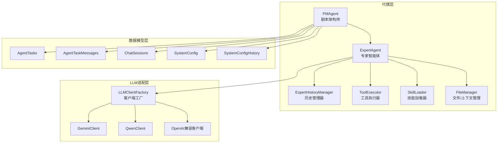
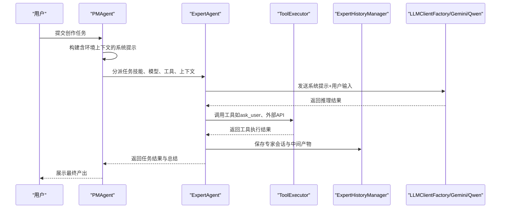
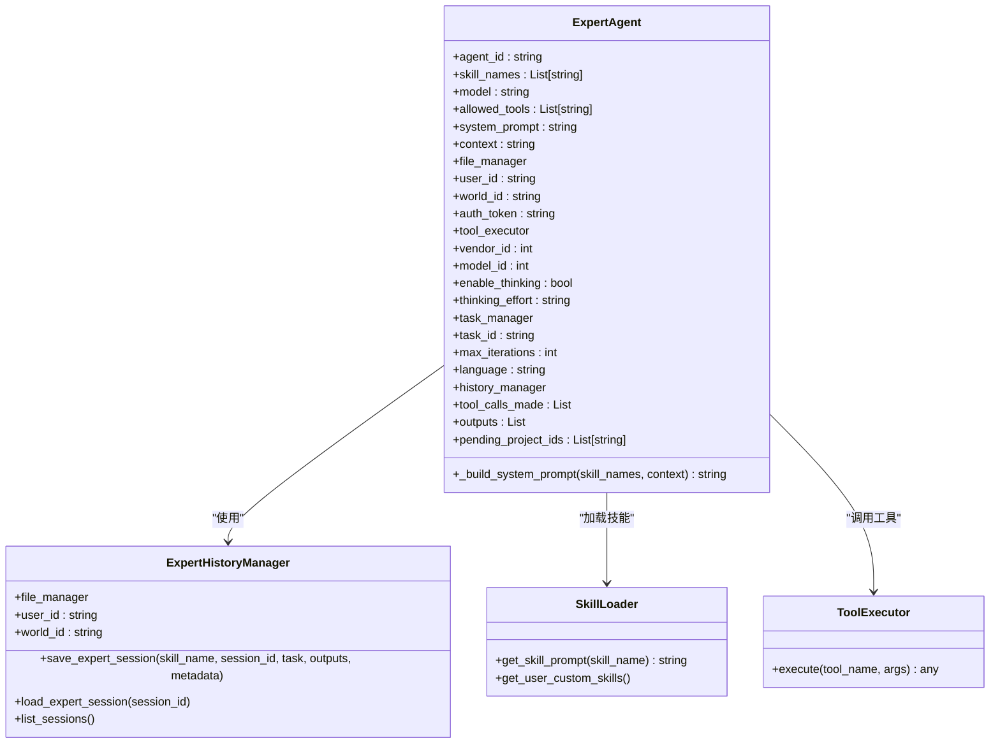
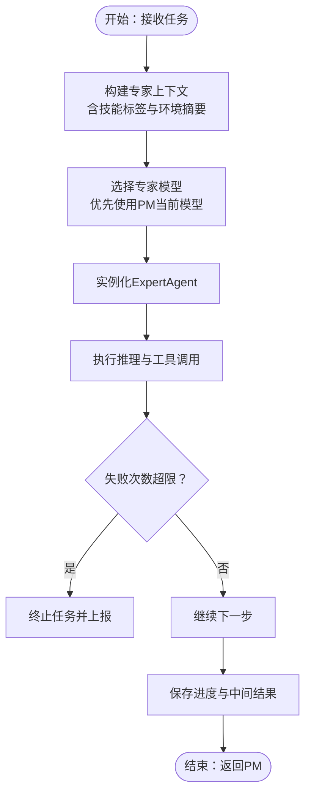
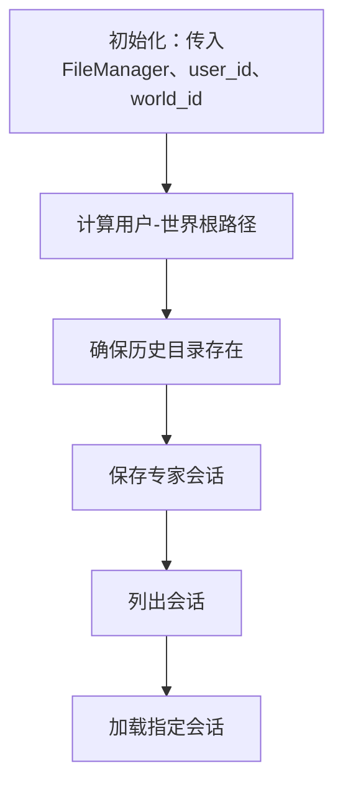
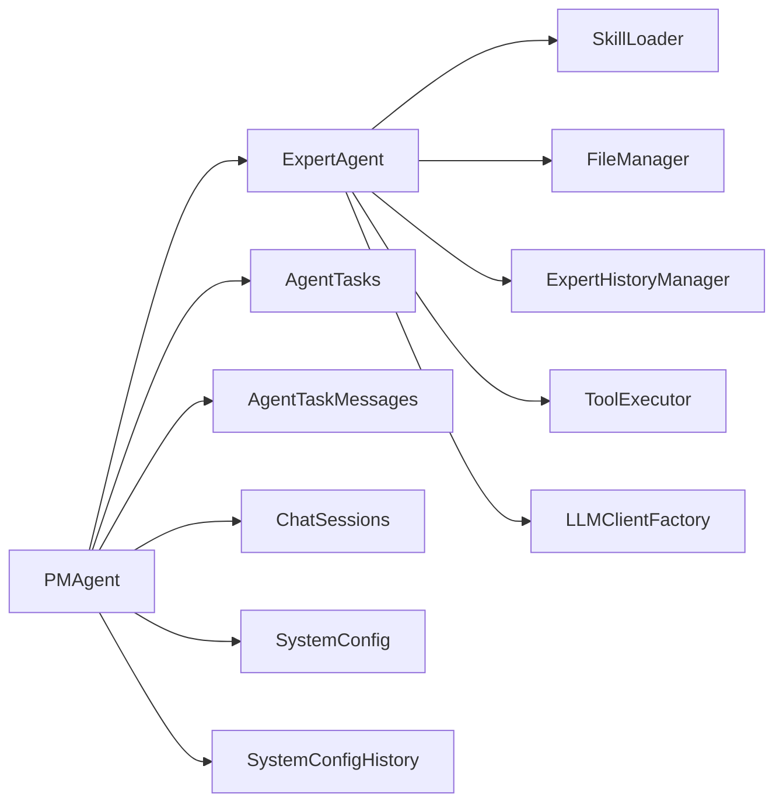

# 专家智能体系统

<cite>
**本文引用的文件**   
- [expert_agent.py](file://script_writer_core/agents/expert_agent.py)
- [pm_agent.py](file://script_writer_core/agents/pm_agent.py)
- [history_manager.py](file://script_writer_core/agents/history_manager.py)
- [base_agent.py](file://script_writer_core/agents/base_agent.py)
- [tool_executor.py](file://script_writer_core/agents/tool_executor.py)
- [tool_definitions.py](file://script_writer_core/agents/tool_definitions.py)
- [ask_user_mixin.py](file://script_writer_core/agents/ask_user_mixin.py)
- [skill_loader.py](file://script_writer_core/skill_loader.py)
- [file_manager.py](file://script_writer_core/file_manager.py)
- [llm_client_factory.py](file://llm/llm_client_factory.py)
- [gemini_client.py](file://llm/gemini_client.py)
- [qwen.py](file://llm/qwen.py)
- [openai_base_client.py](file://llm/openai_base_client.py)
- [model.py](file://model/model.py)
- [agent_tasks.py](file://model/agent_tasks.py)
- [agent_task_messages.py](file://model/agent_task_messages.py)
- [chat_sessions.py](file://model/chat_sessions.py)
- [system_config.py](file://model/system_config.py)
- [system_config_history.py](file://model/system_config_history.py)
- [agents_config.json](file://script_writer_core/config/agents_config.json)
</cite>

## 目录
1. [引言](#引言)
2. [项目结构](#项目结构)
3. [核心组件](#核心组件)
4. [架构总览](#架构总览)
5. [详细组件分析](#详细组件分析)
6. [依赖关系分析](#依赖关系分析)
7. [性能考虑](#性能考虑)
8. [故障排查指南](#故障排查指南)
9. [结论](#结论)
10. [附录](#附录)

## 引言
本文件面向“专家智能体系统”的使用者与维护者，系统性阐述8个专家智能体的角色定位、专业技能、协作方式与工作流；深入解析其决策机制、知识库管理与工具调用策略；阐明历史管理器的作用与实现原理，以及专家智能体之间的信息共享与状态同步机制；并提供配置参数、性能指标与故障处理方案，辅以调试技巧、监控方法与优化建议。

## 项目结构
专家智能体系统位于脚本创作子系统中，围绕“剧本架构师（PM）-专家智能体”两级代理协作展开，核心模块包括：
- 代理层：PM代理、专家代理、历史管理器、工具执行器、AskUser混入、技能加载器
- LLM适配层：LLM客户端工厂、各厂商客户端（如Gemini、Qwen等）
- 数据模型层：任务、会话、系统配置与历史记录
- 文件与上下文：FileManager负责世界/用户上下文与历史文件路径管理

图表来源
- [pm_agent.py:130-143](file://script_writer_core/agents/pm_agent.py#L130-L143)
- [expert_agent.py:17-82](file://script_writer_core/agents/expert_agent.py#L17-L82)
- [history_manager.py:11-32](file://script_writer_core/agents/history_manager.py#L11-L32)
- [tool_executor.py](file://script_writer_core/agents/tool_executor.py)
- [llm_client_factory.py](file://llm/llm_client_factory.py)
- [gemini_client.py](file://llm/gemini_client.py)
- [qwen.py](file://llm/qwen.py)
- [openai_base_client.py](file://llm/openai_base_client.py)
- [agent_tasks.py](file://model/agent_tasks.py)
- [agent_task_messages.py](file://model/agent_task_messages.py)
- [chat_sessions.py](file://model/chat_sessions.py)
- [system_config.py](file://model/system_config.py)
- [system_config_history.py](file://model/system_config_history.py)

章节来源
- [pm_agent.py:130-143](file://script_writer_core/agents/pm_agent.py#L130-L143)
- [expert_agent.py:17-82](file://script_writer_core/agents/expert_agent.py#L17-L82)
- [history_manager.py:11-32](file://script_writer_core/agents/history_manager.py#L11-L32)
- [llm_client_factory.py](file://llm/llm_client_factory.py)

## 核心组件
- 专家智能体（ExpertAgent）：执行具体任务，承载技能、工具调用、历史记录与上下文整合能力
- 剧本架构师（PMAgent）：协调专家智能体，负责任务分派、上下文构建与进度反馈
- 历史管理器（ExpertHistoryManager）：基于FileManager路径体系持久化专家会话与PM摘要
- 工具执行器（ToolExecutor）：封装工具调用与结果处理
- 技能加载器（SkillLoader）：按用户级定制加载技能提示与SOP
- LLM客户端工厂（LLMClientFactory）：统一调度不同供应商的LLM客户端
- 数据模型：AgentTasks、AgentTaskMessages、ChatSessions、SystemConfig、SystemConfigHistory

章节来源
- [expert_agent.py:17-82](file://script_writer_core/agents/expert_agent.py#L17-L82)
- [pm_agent.py:486-533](file://script_writer_core/agents/pm_agent.py#L486-L533)
- [history_manager.py:11-32](file://script_writer_core/agents/history_manager.py#L11-L32)
- [tool_executor.py](file://script_writer_core/agents/tool_executor.py)
- [skill_loader.py](file://script_writer_core/skill_loader.py)
- [llm_client_factory.py](file://llm/llm_client_factory.py)

## 架构总览
专家智能体系统采用“PM-专家”两级代理协作架构：
- PM负责任务编排与专家分派，构建包含环境上下文的完整提示
- 专家接收PM提供的上下文与技能提示，结合工具执行器完成具体任务
- 历史管理器在FileManager路径下生成专家会话与PM摘要文件，便于回溯与审计
- LLM客户端工厂根据配置选择合适的供应商与模型，保证推理一致性

图表来源
- [pm_agent.py:486-533](file://script_writer_core/agents/pm_agent.py#L486-L533)
- [expert_agent.py:83-108](file://script_writer_core/agents/expert_agent.py#L83-L108)
- [history_manager.py:34-70](file://script_writer_core/agents/history_manager.py#L34-L70)
- [llm_client_factory.py](file://llm/llm_client_factory.py)

## 详细组件分析

### 专家智能体（ExpertAgent）
- 角色定位：执行具体任务，严格遵循PM提供的上下文与技能指导
- 专业技能：通过SkillLoader加载技能提示，支持用户级自定义技能
- 工具调用：允许工具集合由PM配置，结合ToolExecutor执行
- 上下文管理：接收PM构建的完整环境上下文，避免信息缺失
- 历史记录：使用ExpertHistoryManager持久化专家会话与中间产物
- 决策机制：基于系统提示与工具调用结果迭代，受最大迭代次数限制

图表来源
- [expert_agent.py:17-82](file://script_writer_core/agents/expert_agent.py#L17-L82)
- [history_manager.py:11-32](file://script_writer_core/agents/history_manager.py#L11-L32)
- [skill_loader.py](file://script_writer_core/skill_loader.py)
- [tool_executor.py](file://script_writer_core/agents/tool_executor.py)

章节来源
- [expert_agent.py:17-82](file://script_writer_core/agents/expert_agent.py#L17-L82)
- [expert_agent.py:83-108](file://script_writer_core/agents/expert_agent.py#L83-L108)

### 剧本架构师（PMAgent）
- 角色定位：任务编排者，不直接创作内容，通过工具调用专家智能体完成工作
- 协作方式：call_agent分派任务，ask_user向用户提问并等待回答
- 决策机制：根据任务状态与错误统计调整后续动作，支持连续失败阈值控制
- 上下文构建：为专家构建包含技能标签与环境摘要的完整上下文
- 进度反馈：通过任务管理器推送进度消息至前端或日志

图表来源
- [pm_agent.py:486-533](file://script_writer_core/agents/pm_agent.py#L486-L533)
- [pm_agent.py:639-668](file://script_writer_core/agents/pm_agent.py#L639-L668)

章节来源
- [pm_agent.py:130-143](file://script_writer_core/agents/pm_agent.py#L130-L143)
- [pm_agent.py:486-533](file://script_writer_core/agents/pm_agent.py#L486-L533)
- [pm_agent.py:639-668](file://script_writer_core/agents/pm_agent.py#L639-L668)

### 历史管理器（ExpertHistoryManager）
- 作用：在FileManager路径体系下，为每个用户-世界组合建立专家会话与PM摘要目录
- 实现原理：基于用户ID与世界ID生成唯一路径，自动创建目录，提供会话保存/加载与列表查询
- 数据持久化：保存专家会话、输出产物与元数据，便于复盘与审计

图表来源
- [history_manager.py:11-32](file://script_writer_core/agents/history_manager.py#L11-L32)
- [history_manager.py:34-70](file://script_writer_core/agents/history_manager.py#L34-L70)

章节来源
- [history_manager.py:11-32](file://script_writer_core/agents/history_manager.py#L11-L32)
- [history_manager.py:34-70](file://script_writer_core/agents/history_manager.py#L34-L70)

### 工具执行器（ToolExecutor）与AskUser混入
- 工具执行器：封装工具调用逻辑，统一返回格式，便于专家智能体安全地扩展能力
- AskUser混入：提供ask_user工具定义与交互流程，支持选项式问答与上下文注入

章节来源
- [tool_executor.py](file://script_writer_core/agents/tool_executor.py)
- [ask_user_mixin.py](file://script_writer_core/agents/ask_user_mixin.py)
- [tool_definitions.py](file://script_writer_core/agents/tool_definitions.py)

### LLM客户端工厂与多供应商适配
- 客户端工厂：根据配置选择Gemini、Qwen或其他OpenAI兼容客户端
- 适配策略：统一接口、参数映射与错误处理，保证专家智能体无需感知底层差异

章节来源
- [llm_client_factory.py](file://llm/llm_client_factory.py)
- [gemini_client.py](file://llm/gemini_client.py)
- [qwen.py](file://llm/qwen.py)
- [openai_base_client.py](file://llm/openai_base_client.py)

### 数据模型与状态同步
- AgentTasks/AgentTaskMessages：记录任务生命周期、消息与状态
- ChatSessions：维护会话历史，支持PM将待办标记写回会话
- SystemConfig/SystemConfigHistory：系统配置与变更历史，影响专家模型与工具行为

章节来源
- [agent_tasks.py](file://model/agent_tasks.py)
- [agent_task_messages.py](file://model/agent_task_messages.py)
- [chat_sessions.py](file://model/chat_sessions.py)
- [system_config.py](file://model/system_config.py)
- [system_config_history.py](file://model/system_config_history.py)

## 依赖关系分析
- 专家智能体依赖：SkillLoader（技能）、FileManager（上下文/路径）、ExpertHistoryManager（历史）、ToolExecutor（工具）、LLMClientFactory（推理）
- PM代理依赖：ExpertAgent实例化、任务管理、会话持久化、系统配置
- 数据层：AgentTasks/AgentTaskMessages/ChatSessions/Config支撑状态与历史

图表来源
- [expert_agent.py:17-82](file://script_writer_core/agents/expert_agent.py#L17-L82)
- [pm_agent.py:486-533](file://script_writer_core/agents/pm_agent.py#L486-L533)
- [agent_tasks.py](file://model/agent_tasks.py)
- [agent_task_messages.py](file://model/agent_task_messages.py)
- [chat_sessions.py](file://model/chat_sessions.py)
- [system_config.py](file://model/system_config.py)
- [system_config_history.py](file://model/system_config_history.py)

## 性能考虑
- 推理成本控制：通过系统配置与模型选择降低Token消耗；启用思考开关与思考强度可权衡质量与速度
- 工具调用优化：合并工具调用、减少往返次数；对高频工具设置缓存或批处理
- 历史持久化：批量写入与异步落盘，避免阻塞主流程
- 并发与重试：合理设置最大迭代次数与失败阈值，防止无限循环
- 监控指标：记录输入/输出Token、工具调用耗时、会话保存耗时、错误率与成功率

## 故障排查指南
- 专家无响应或卡死
  - 检查最大迭代次数与工具调用是否阻塞
  - 查看历史目录是否存在异常文件
- 工具调用失败
  - 核对allowed_tools与工具定义是否匹配
  - 检查ToolExecutor返回格式与异常处理
- 上下文缺失
  - 确认PM构建上下文时是否启用摘要模式与环境内容
  - 检查FileManager路径与权限
- LLM调用异常
  - 切换供应商或模型，检查客户端工厂配置
  - 关注Token限额与速率限制
- 会话历史异常
  - 检查ExpertHistoryManager目录创建与写入权限
  - 对比AgentTaskMessages与ChatSessions状态一致性

章节来源
- [expert_agent.py:73-82](file://script_writer_core/agents/expert_agent.py#L73-L82)
- [pm_agent.py:486-533](file://script_writer_core/agents/pm_agent.py#L486-L533)
- [history_manager.py:34-70](file://script_writer_core/agents/history_manager.py#L34-L70)

## 结论
专家智能体系统通过清晰的两级协作架构、完善的上下文与历史管理、以及可扩展的工具与LLM适配层，实现了高效、可控且可审计的创作流程。建议在生产环境中强化监控与告警、优化工具调用与模型选择策略，并持续完善技能库与SOP，以提升整体稳定性与产出质量。

## 附录

### 专家智能体职责与协作要点
- 专家智能体职责：严格依据PM上下文与技能提示执行任务，通过工具调用解决复杂问题，记录历史以便复盘
- 协作方式：PM负责任务编排与上下文构建，专家专注执行与输出，二者通过工具与消息队列保持状态同步
- 决策机制：基于系统提示与工具结果迭代，受最大迭代次数与失败阈值约束
- 知识库管理：SkillLoader按用户级定制加载技能与SOP，PM可选择摘要模式以控制上下文长度
- 工具调用策略：统一通过ToolExecutor执行，支持ask_user等交互式工具

章节来源
- [expert_agent.py:17-82](file://script_writer_core/agents/expert_agent.py#L17-L82)
- [pm_agent.py:130-143](file://script_writer_core/agents/pm_agent.py#L130-L143)
- [pm_agent.py:486-533](file://script_writer_core/agents/pm_agent.py#L486-L533)
- [tool_executor.py](file://script_writer_core/agents/tool_executor.py)
- [ask_user_mixin.py](file://script_writer_core/agents/ask_user_mixin.py)

### 历史管理器实现原理
- 路径体系：基于FileManager的用户-世界路径生成专家历史目录
- 功能：保存专家会话、输出产物与元数据；提供会话列表与加载能力
- 与PM协作：PM可将待办标记写回会话历史，便于恢复与追踪

章节来源
- [history_manager.py:11-32](file://script_writer_core/agents/history_manager.py#L11-L32)
- [history_manager.py:34-70](file://script_writer_core/agents/history_manager.py#L34-L70)
- [pm_agent.py:639-668](file://script_writer_core/agents/pm_agent.py#L639-L668)

### 配置参数与最佳实践
- 专家配置（agents_config.json）：定义专家技能、允许工具、模型与摘要模式
- 模型选择：PM当前模型优先传递给专家，便于动态切换
- 思考开关：enable_thinking与thinking_effort平衡质量与成本
- 最大迭代：max_iterations限制推理深度，避免资源浪费
- 监控与日志：开启详细日志，记录Token用量、工具调用耗时与错误统计

章节来源
- [agents_config.json](file://script_writer_core/config/agents_config.json)
- [pm_agent.py:515-533](file://script_writer_core/agents/pm_agent.py#L515-L533)
- [expert_agent.py:67-71](file://script_writer_core/agents/expert_agent.py#L67-L71)

### 调试技巧与优化建议
- 调试技巧
  - 使用最小化技能集快速验证流程
  - 开启详细日志，关注工具调用与LLM返回
  - 通过历史目录对比前后版本差异
- 优化建议
  - 合理设置摘要模式与上下文长度
  - 批量化工具调用，减少往返
  - 引入缓存与重试策略，提升鲁棒性
  - 定期清理历史目录，避免磁盘压力