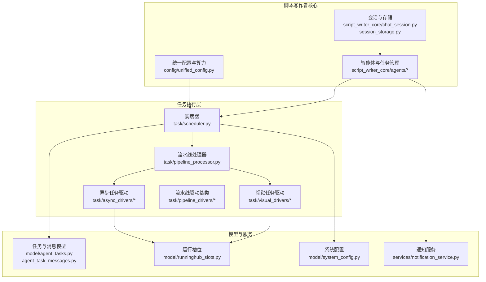
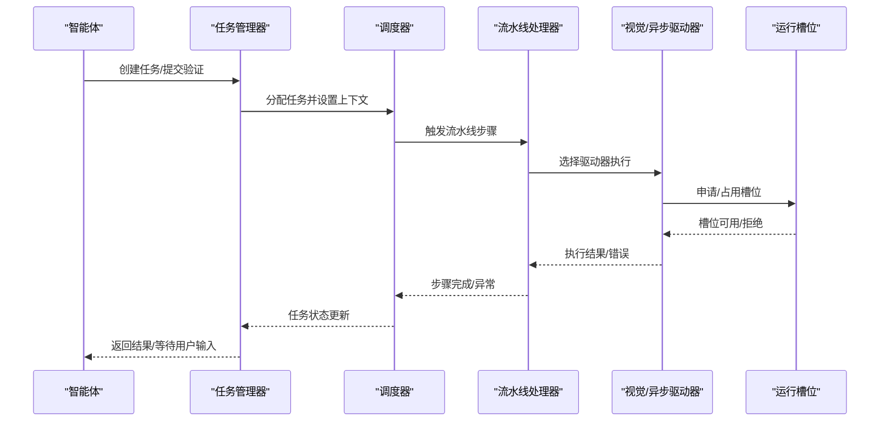
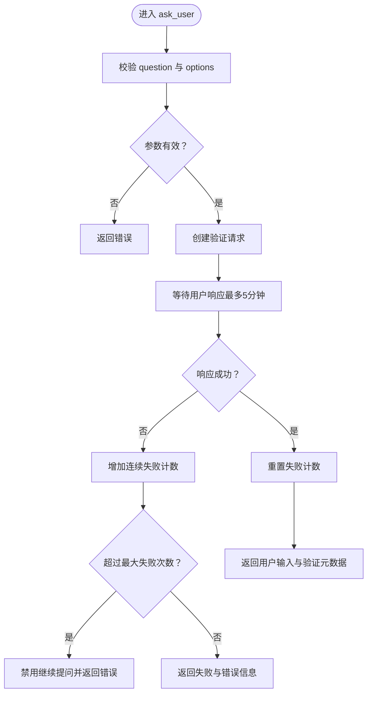
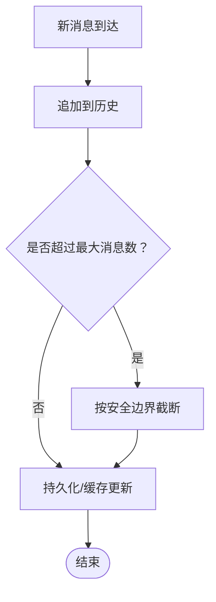
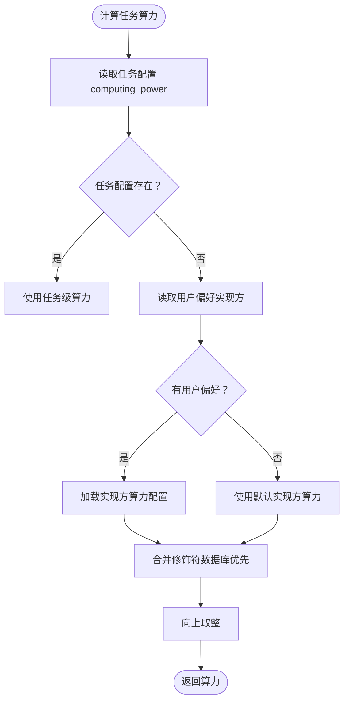
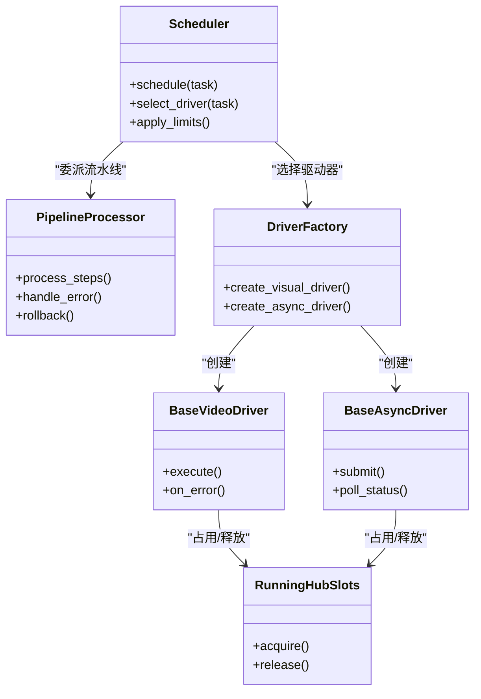
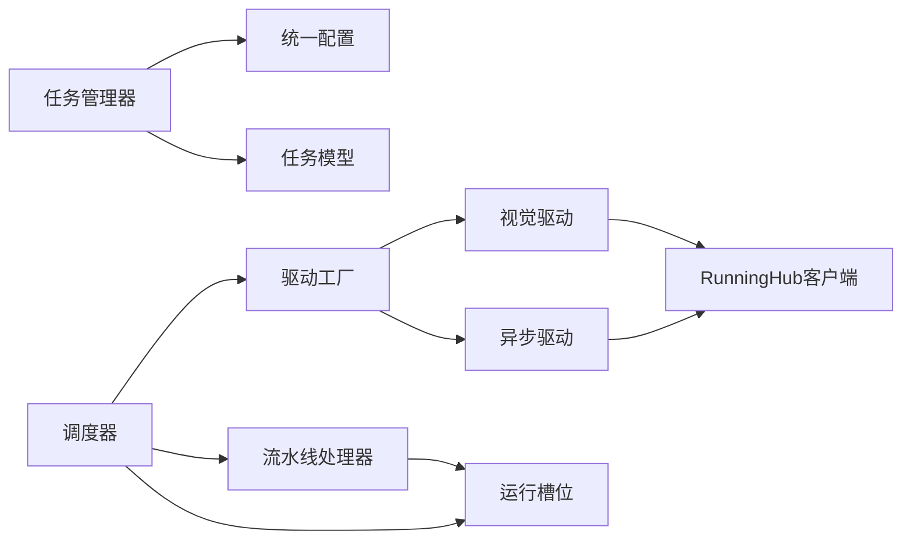

# 任务协调管理

<cite>
**本文引用的文件**
- [ask_user_mixin.py](file://script_writer_core/agents/ask_user_mixin.py)
- [task_manager.py](file://script_writer_core/agents/task_manager.py)
- [chat_session.py](file://script_writer_core/chat_session.py)
- [session_storage.py](file://script_writer_core/session_storage.py)
- [unified_config.py](file://config/unified_config.py)
- [算力多维度计算方案.md](file://docs/backend/算力多维度计算方案.md)
- [test_ask_user.py](file://api/test_ask_user.py)
- [test_computing_power.py](file://tests/utils/test_computing_power.py)
- [test_unified_config_frontend.py](file://tests/config/test_unified_config_frontend.py)
- [test_chat_sessions_crud.py](file://tests/crud/test_chat_sessions_crud.py)
- [runninghub_concurrency_control.md](file://docs/backend/runninghub_concurrency_control.md)
- [scheduler.py](file://task/scheduler.py)
- [runninghub_async_task.py](file://task/runninghub_async_task.py)
- [async_task_submission.py](file://task/async_task_submission.py)
- [pipeline_processor.py](file://task/pipeline_processor.py)
- [grid_image_task.py](file://task/grid_image_task.py)
- [audio_task.py](file://task/audio_task.py)
- [visual_task.py](file://task/visual_task.py)
- [stats_cache_task.py](file://task/stats_cache_task.py)
- [runninghub_slots_cleanup.py](file://task/runninghub_slots_cleanup.py)
- [session_cleanup.py](file://task/session_cleanup.py)
- [agent_task_cleanup.py](file://task/agent_task_cleanup.py)
- [runninghub_client.py](file://api/clients/runninghub_client.py)
- [driver_factory.py](file://task/visual_drivers/driver_factory.py)
- [exceptions.py](file://task/visual_drivers/exceptions.py)
- [base_async_driver.py](file://task/async_drivers/base_async_driver.py)
- [base_pipeline_driver.py](file://task/pipeline_drivers/base_pipeline_driver.py)
- [base_video_driver.py](file://task/visual_drivers/base_video_driver.py)
- [notification_service.py](file://services/notification_service.py)
- [chat_sessions.py](file://model/chat_sessions.py)
- [agent_tasks.py](file://model/agent_tasks.py)
- [agent_task_messages.py](file://model/agent_task_messages.py)
- [runninghub_slots.py](file://model/runninghub_slots.py)
- [implementation_power.py](file://model/implementation_power.py)
- [system_config.py](file://model/system_config.py)
- [user_preferences.py](file://model/user_preferences.py)
- [computing_power_log.py](file://model/computing_power_log.py)
- [token_log.py](file://model/token_log.py)
- [notifications.py](file://model/notifications.py)
- [log_utils.py](file://script_writer_core/log_utils.py)
</cite>

## 目录
1. [引言](#引言)
2. [项目结构](#项目结构)
3. [核心组件](#核心组件)
4. [架构总览](#架构总览)
5. [详细组件分析](#详细组件分析)
6. [依赖关系分析](#依赖关系分析)
7. [性能考虑](#性能考虑)
8. [故障排查指南](#故障排查指南)
9. [结论](#结论)
10. [附录](#附录)

## 引言
本文件围绕“任务协调管理”主题，系统梳理并深入解析以下方面：
- 任务管理器的调度策略、任务分配机制与执行监控流程
- AskUser混合器的实现原理与用户交互处理机制
- 聊天会话的状态管理、消息队列与并发控制策略
- 任务优先级管理、资源分配与负载均衡机制
- 任务协调的性能优化、故障恢复与监控告警方案
- 任务执行的可视化展示与进度跟踪功能

文档以仓库实际代码为依据，通过图示与路径引用的方式呈现系统架构与关键流程，帮助读者快速理解并高效运维。

## 项目结构
该工程围绕“脚本写作者核心能力”（script_writer_core）组织任务编排与执行；同时在“task”目录下提供各类异步/同步任务驱动器与处理器，在“model”层定义持久化模型，在“config”层提供统一配置与算力策略，在“docs/backend”中沉淀运行时策略文档。

图表来源
- [task_manager.py](file://script_writer_core/agents/task_manager.py)
- [chat_session.py](file://script_writer_core/chat_session.py)
- [session_storage.py](file://script_writer_core/session_storage.py)
- [unified_config.py](file://config/unified_config.py)
- [scheduler.py](file://task/scheduler.py)
- [pipeline_processor.py](file://task/pipeline_processor.py)
- [driver_factory.py](file://task/visual_drivers/driver_factory.py)
- [base_async_driver.py](file://task/async_drivers/base_async_driver.py)
- [base_pipeline_driver.py](file://task/pipeline_drivers/base_pipeline_driver.py)
- [agent_tasks.py](file://model/agent_tasks.py)
- [runninghub_slots.py](file://model/runninghub_slots.py)
- [system_config.py](file://model/system_config.py)
- [notification_service.py](file://services/notification_service.py)

章节来源
- [task_manager.py](file://script_writer_core/agents/task_manager.py)
- [chat_session.py](file://script_writer_core/chat_session.py)
- [session_storage.py](file://script_writer_core/session_storage.py)
- [unified_config.py](file://config/unified_config.py)
- [scheduler.py](file://task/scheduler.py)
- [pipeline_processor.py](file://task/pipeline_processor.py)
- [driver_factory.py](file://task/visual_drivers/driver_factory.py)
- [base_async_driver.py](file://task/async_drivers/base_async_driver.py)
- [base_pipeline_driver.py](file://task/pipeline_drivers/base_pipeline_driver.py)
- [agent_tasks.py](file://model/agent_tasks.py)
- [runninghub_slots.py](file://model/runninghub_slots.py)
- [system_config.py](file://model/system_config.py)
- [notification_service.py](file://services/notification_service.py)

## 核心组件
- 任务管理器与AskUser混合器：负责任务生命周期管理、阻塞等待用户验证、失败计数与保护性停问等。
- 聊天会话与消息队列：维护会话状态、历史消息截断与缓存、并发安全访问。
- 统一配置与算力策略：根据任务类型、实现方、用户偏好与修饰符动态计算算力。
- 任务执行与驱动：调度器、流水线处理器、视觉/异步驱动器、运行槽位与清理任务。
- 监控与通知：统计缓存、日志与通知服务支撑可观测性。

章节来源
- [ask_user_mixin.py](file://script_writer_core/agents/ask_user_mixin.py)
- [task_manager.py](file://script_writer_core/agents/task_manager.py)
- [chat_session.py](file://script_writer_core/chat_session.py)
- [session_storage.py](file://script_writer_core/session_storage.py)
- [unified_config.py](file://config/unified_config.py)
- [算力多维度计算方案.md](file://docs/backend/算力多维度计算方案.md)

## 架构总览
系统采用“智能体-任务-驱动器-槽位”的分层架构。智能体通过任务管理器创建与等待验证，任务管理器将任务委派给调度器，调度器根据统一配置选择合适的驱动器执行，并通过运行槽位进行并发控制与资源隔离。

图表来源
- [task_manager.py](file://script_writer_core/agents/task_manager.py)
- [scheduler.py](file://task/scheduler.py)
- [pipeline_processor.py](file://task/pipeline_processor.py)
- [driver_factory.py](file://task/visual_drivers/driver_factory.py)
- [runninghub_slots.py](file://model/runninghub_slots.py)

## 详细组件分析

### 任务管理器与AskUser混合器
- 作用：封装任务创建、验证请求创建、阻塞等待用户响应、失败计数与保护性停问、返回用户输入与元数据。
- 关键流程：
  - 参数校验：question必填、options非空且为列表
  - 创建验证请求：通过任务管理器创建ask_user验证记录
  - 阻塞等待：在指定超时时间内等待用户确认
  - 失败保护：超过最大连续失败次数后禁止继续提问
  - 结果返回：成功时返回用户输入与验证元数据，失败时返回错误信息

图表来源
- [ask_user_mixin.py](file://script_writer_core/agents/ask_user_mixin.py)

章节来源
- [ask_user_mixin.py](file://script_writer_core/agents/ask_user_mixin.py)
- [test_ask_user.py](file://api/test_ask_user.py)

### 聊天会话与消息队列
- 会话状态管理：支持创建、软删除、过期清理、按用户查询等操作。
- 消息队列与截断策略：根据最大消息数与安全边界进行截断，确保上下文长度可控。
- 并发控制：使用可重入锁保证多线程环境下的读写一致性；可选内存缓存提升读取性能。

图表来源
- [session_storage.py](file://script_writer_core/session_storage.py)
- [chat_sessions.py](file://model/chat_sessions.py)
- [test_chat_sessions_crud.py](file://tests/crud/test_chat_sessions_crud.py)

章节来源
- [session_storage.py](file://script_writer_core/session_storage.py)
- [chat_sessions.py](file://model/chat_sessions.py)
- [test_chat_sessions_crud.py](file://tests/crud/test_chat_sessions_crud.py)

### 统一配置与算力策略
- 任务级算力覆盖优先于实现方配置，用户偏好实现方优先于默认实现。
- 修饰符（modifiers）与数据库配置合并，数据库优先覆盖默认值；最终结果向上取整。
- 前端配置接口扩展：返回任务算力映射与修饰符信息，便于前端展示与选择。

图表来源
- [unified_config.py](file://config/unified_config.py)
- [算力多维度计算方案.md](file://docs/backend/算力多维度计算方案.md)
- [test_computing_power.py](file://tests/utils/test_computing_power.py)
- [test_unified_config_frontend.py](file://tests/config/test_unified_config_frontend.py)

章节来源
- [unified_config.py](file://config/unified_config.py)
- [算力多维度计算方案.md](file://docs/backend/算力多维度计算方案.md)
- [test_computing_power.py](file://tests/utils/test_computing_power.py)
- [test_unified_config_frontend.py](file://tests/config/test_unified_config_frontend.py)

### 任务调度与执行监控
- 调度器：接收任务，解析配置，选择驱动器，触发流水线步骤。
- 流水线处理器：按顺序执行各阶段，处理异常与回滚。
- 视觉/异步驱动器：封装具体实现（如RunningHub、Duomi等），统一接口与错误处理。
- 运行槽位：并发控制与资源隔离，防止超卖与拥塞。
- 清理任务：定期清理过期会话、任务与槽位，保障系统健康。

图表来源
- [scheduler.py](file://task/scheduler.py)
- [pipeline_processor.py](file://task/pipeline_processor.py)
- [driver_factory.py](file://task/visual_drivers/driver_factory.py)
- [base_video_driver.py](file://task/visual_drivers/base_video_driver.py)
- [base_async_driver.py](file://task/async_drivers/base_async_driver.py)
- [runninghub_slots.py](file://model/runninghub_slots.py)

章节来源
- [scheduler.py](file://task/scheduler.py)
- [pipeline_processor.py](file://task/pipeline_processor.py)
- [driver_factory.py](file://task/visual_drivers/driver_factory.py)
- [base_video_driver.py](file://task/visual_drivers/base_video_driver.py)
- [base_async_driver.py](file://task/async_drivers/base_async_driver.py)
- [runninghub_slots.py](file://model/runninghub_slots.py)

### 任务类型与资源分配
- 图像网格生成、音频任务、视频任务分别由对应任务模块处理，统一接入调度器与驱动器。
- 资源分配：通过运行槽位与实现方算力配置共同决定并发度与资源上限。
- 负载均衡：结合实现方权重、当前槽位占用率与任务优先级进行动态调整。

章节来源
- [grid_image_task.py](file://task/grid_image_task.py)
- [audio_task.py](file://task/audio_task.py)
- [visual_task.py](file://task/visual_task.py)

### 监控告警与统计缓存
- 统计缓存任务：周期性聚合统计数据，降低查询压力。
- 日志与通知：统一日志工具与通知服务，支持告警推送与状态变更通知。
- 计费与令牌：计算功率日志与令牌日志模型支撑成本追踪与审计。

章节来源
- [stats_cache_task.py](file://task/stats_cache_task.py)
- [log_utils.py](file://script_writer_core/log_utils.py)
- [notification_service.py](file://services/notification_service.py)
- [computing_power_log.py](file://model/computing_power_log.py)
- [token_log.py](file://model/token_log.py)

## 依赖关系分析
- 组件耦合：任务管理器依赖统一配置与模型层；调度器依赖驱动工厂与运行槽位；驱动器依赖客户端与运行槽位。
- 外部依赖：RunningHub客户端、各视觉/异步驱动器实现。
- 循环依赖：未见明显循环依赖，模块间通过接口与工厂解耦。

图表来源
- [task_manager.py](file://script_writer_core/agents/task_manager.py)
- [unified_config.py](file://config/unified_config.py)
- [scheduler.py](file://task/scheduler.py)
- [driver_factory.py](file://task/visual_drivers/driver_factory.py)
- [runninghub_client.py](file://api/clients/runninghub_client.py)
- [runninghub_slots.py](file://model/runninghub_slots.py)

章节来源
- [task_manager.py](file://script_writer_core/agents/task_manager.py)
- [unified_config.py](file://config/unified_config.py)
- [scheduler.py](file://task/scheduler.py)
- [driver_factory.py](file://task/visual_drivers/driver_factory.py)
- [runninghub_client.py](file://api/clients/runninghub_client.py)
- [runninghub_slots.py](file://model/runninghub_slots.py)

## 性能考虑
- 缓存与截断：会话存储支持内存缓存与消息截断，减少数据库压力与上下文膨胀。
- 并发控制：运行槽位限制并发，避免资源争用；驱动器统一错误处理与重试策略。
- 算力计算：修饰符合并与向上取整避免浮点误差；任务级覆盖优先减少误判。
- 统计缓存：定时聚合统计，降低高频查询对数据库的影响。
- 文档参考：并发控制与资源配额策略详见运行时文档。

章节来源
- [session_storage.py](file://script_writer_core/session_storage.py)
- [算力多维度计算方案.md](file://docs/backend/算力多维度计算方案.md)
- [stats_cache_task.py](file://task/stats_cache_task.py)
- [runninghub_concurrency_control.md](file://docs/backend/runninghub_concurrency_control.md)

## 故障排查指南
- AskUser混合器常见问题：
  - 未配置task_manager或task_id：检查智能体初始化与任务绑定。
  - 连续失败超过阈值：系统自动禁用继续提问，需等待用户主动消息。
  - 超时未响应：确认等待超时时间与网络状况。
- 会话清理与过期：
  - 过期会话会被标记为不活跃，检查清理任务与时间阈值。
  - 查询活跃会话时排除不活跃状态。
- 算力计算异常：
  - 任务级覆盖优先：若任务配置存在，实现方配置被忽略。
  - 用户偏好实现方：优先使用用户偏好的实现方算力。
  - 修饰符合并：数据库修饰符优先覆盖默认值。
- 驱动器与槽位：
  - 槽位不足：检查当前占用与实现方并发限制。
  - 错误处理：查看驱动器异常定义与日志输出。

章节来源
- [ask_user_mixin.py](file://script_writer_core/agents/ask_user_mixin.py)
- [test_ask_user.py](file://api/test_ask_user.py)
- [test_chat_sessions_crud.py](file://tests/crud/test_chat_sessions_crud.py)
- [test_computing_power.py](file://tests/utils/test_computing_power.py)
- [exceptions.py](file://task/visual_drivers/exceptions.py)

## 结论
本系统通过“智能体-任务-驱动器-槽位”的清晰分层，实现了任务的可靠调度、严格的并发控制与灵活的算力策略。AskUser混合器提供了稳健的用户交互机制，会话存储与清理任务保障了状态一致性与系统健康。配合统计缓存与通知服务，整体具备良好的可观测性与可维护性。建议在生产环境中持续关注槽位利用率、算力修饰符配置与用户偏好覆盖策略，以实现更优的资源利用与用户体验。

## 附录
- 相关文档与规范：
  - 并发控制与资源配额策略：参见运行时文档
  - 算力多维度计算方案：参见技术文档
- 关键流程参考：
  - 任务创建与AskUser等待：参见测试用例与混合器实现
  - 会话生命周期与清理：参见CRUD测试与模型定义
  - 算力计算与修饰符合并：参见统一配置与测试用例