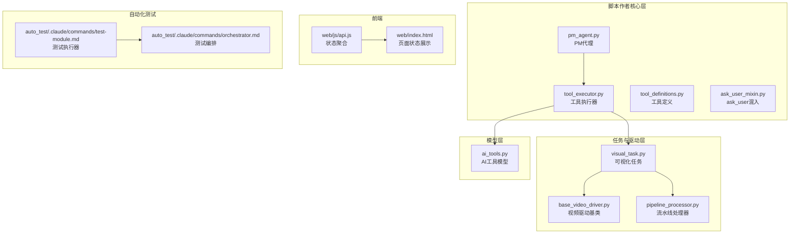
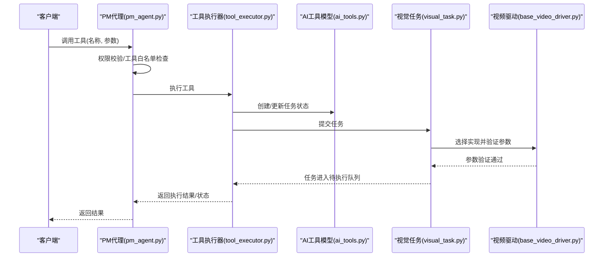
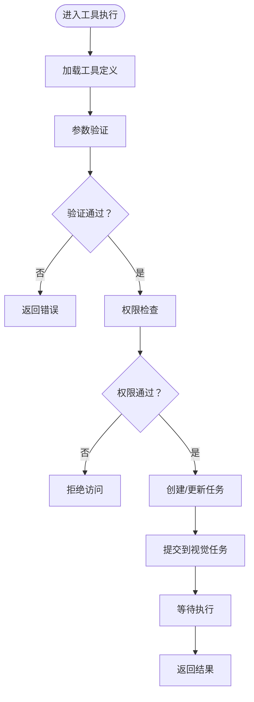
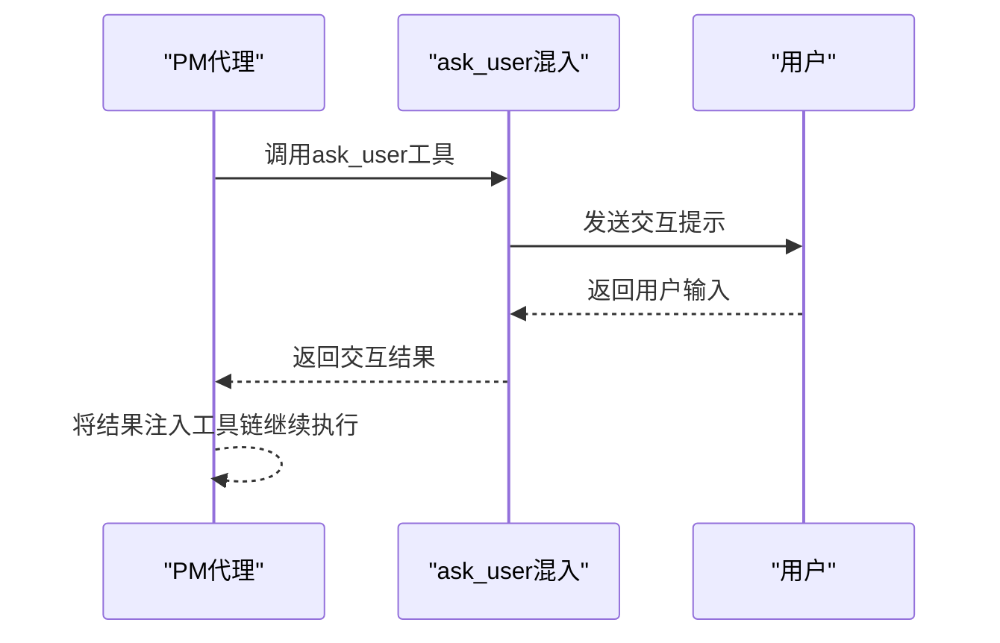
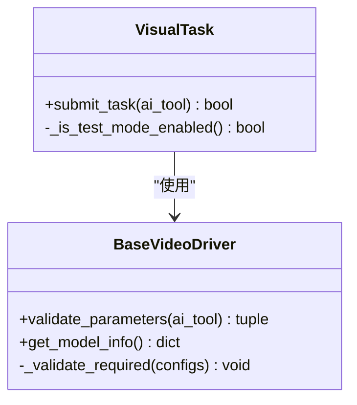
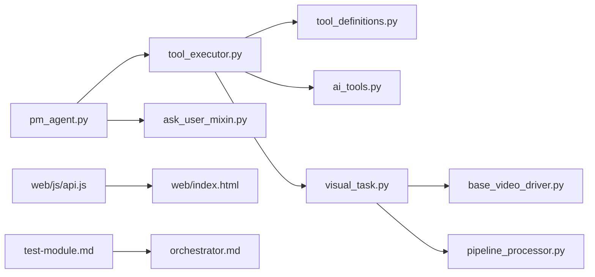

# 工具执行引擎

<cite>
**本文引用的文件**
- [tool_executor.py](file://script_writer_core/agents/tool_executor.py)
- [tool_definitions.py](file://script_writer_core/agents/tool_definitions.py)
- [ask_user_mixin.py](file://script_writer_core/agents/ask_user_mixin.py)
- [pm_agent.py](file://script_writer_core/agents/pm_agent.py)
- [ai_tools.py](file://model/ai_tools.py)
- [visual_task.py](file://task/visual_task.py)
- [base_video_driver.py](file://task/visual_drivers/base_video_driver.py)
- [pipeline_processor.py](file://task/pipeline_processor.py)
- [api.js](file://web/js/api.js)
- [index.html](file://web/index.html)
- [test_module.md](file://auto_test/.claude/commands/test-module.md)
- [orchestrator.md](file://auto_test/.claude/commands/orchestrator.md)
- [test_gemini_image_preview_common_driver.py](file://tests/driver_integration/test_gemini_image_preview_common_driver.py)
</cite>

## 目录
1. [简介](#简介)
2. [项目结构](#项目结构)
3. [核心组件](#核心组件)
4. [架构总览](#架构总览)
5. [详细组件分析](#详细组件分析)
6. [依赖关系分析](#依赖关系分析)
7. [性能考虑](#性能考虑)
8. [故障排查指南](#故障排查指南)
9. [结论](#结论)
10. [附录](#附录)

## 简介
本文件系统性梳理工具执行引擎的设计与实现，覆盖工具定义解析、参数验证、执行流程控制、工具分类体系、权限与安全检查、上下文管理与状态跟踪、结果处理、扩展开发指南、工具链组合策略、错误处理与重试机制以及性能监控方案。特别针对 ask_user 工具的交互模式进行深入说明，并结合前端状态展示与自动化测试编排，帮助读者全面掌握该引擎的工作原理与最佳实践。

## 项目结构
工具执行引擎主要分布在以下模块：
- 脚本作者核心层（script_writer_core/agents）：工具执行器、工具定义、ask_user混入、PM代理等
- 任务与驱动层（task/*）：可视化任务调度、视频驱动基类、流水线处理器
- 模型层（model/ai_tools.py）：工具与任务的数据模型
- 前端（web/*）：状态展示与结果聚合
- 自动化测试（auto_test/*）：测试编排与执行器
- 测试用例（tests/*）：参数验证与驱动集成测试

**图表来源**
- [tool_executor.py](file://script_writer_core/agents/tool_executor.py)
- [tool_definitions.py](file://script_writer_core/agents/tool_definitions.py)
- [ask_user_mixin.py](file://script_writer_core/agents/ask_user_mixin.py)
- [pm_agent.py](file://script_writer_core/agents/pm_agent.py)
- [ai_tools.py](file://model/ai_tools.py)
- [visual_task.py](file://task/visual_task.py)
- [base_video_driver.py](file://task/visual_drivers/base_video_driver.py)
- [pipeline_processor.py](file://task/pipeline_processor.py)
- [api.js](file://web/js/api.js)
- [index.html](file://web/index.html)
- [test_module.md](file://auto_test/.claude/commands/test-module.md)
- [orchestrator.md](file://auto_test/.claude/commands/orchestrator.md)

**章节来源**
- [tool_executor.py](file://script_writer_core/agents/tool_executor.py)
- [tool_definitions.py](file://script_writer_core/agents/tool_definitions.py)
- [ask_user_mixin.py](file://script_writer_core/agents/ask_user_mixin.py)
- [pm_agent.py](file://script_writer_core/agents/pm_agent.py)
- [ai_tools.py](file://model/ai_tools.py)
- [visual_task.py](file://task/visual_task.py)
- [base_video_driver.py](file://task/visual_drivers/base_video_driver.py)
- [pipeline_processor.py](file://task/pipeline_processor.py)
- [api.js](file://web/js/api.js)
- [index.html](file://web/index.html)
- [test_module.md](file://auto_test/.claude/commands/test-module.md)
- [orchestrator.md](file://auto_test/.claude/commands/orchestrator.md)

## 核心组件
- 工具执行器（tool_executor.py）：负责工具解析、参数校验、权限检查、执行调度与结果聚合
- 工具定义（tool_definitions.py）：集中管理工具元数据、参数约束与分类
- ask_user混入（ask_user_mixin.py）：封装ask_user工具的交互协议与状态管理
- PM代理（pm_agent.py）：作为工具调用入口，路由到具体工具执行器或内置工具
- AI工具模型（ai_tools.py）：持久化工具任务状态、参数与结果
- 视觉任务（visual_task.py）：将工具任务提交到对应驱动，处理参数准备阶段与实现选择
- 视频驱动基类（base_video_driver.py）：统一参数验证与配置校验
- 流水线处理器（pipeline_processor.py）：处理参数准备阶段的子步骤状态推进
- 前端API（web/js/api.js、web/index.html）：聚合任务状态与结果，驱动UI展示

**章节来源**
- [tool_executor.py](file://script_writer_core/agents/tool_executor.py)
- [tool_definitions.py](file://script_writer_core/agents/tool_definitions.py)
- [ask_user_mixin.py](file://script_writer_core/agents/ask_user_mixin.py)
- [pm_agent.py](file://script_writer_core/agents/pm_agent.py)
- [ai_tools.py](file://model/ai_tools.py)
- [visual_task.py](file://task/visual_task.py)
- [base_video_driver.py](file://task/visual_drivers/base_video_driver.py)
- [pipeline_processor.py](file://task/pipeline_processor.py)
- [api.js](file://web/js/api.js)
- [index.html](file://web/index.html)

## 架构总览
工具执行引擎采用“代理-执行器-驱动-模型-前端”的分层架构：
- PM代理接收工具调用请求，进行权限与工具白名单校验
- 工具执行器解析工具定义、执行参数验证、选择实现与驱动
- 视觉任务负责将任务提交到具体驱动，并处理参数准备阶段
- 模型层持久化任务状态与结果
- 前端聚合状态并展示最终结果

**图表来源**
- [pm_agent.py](file://script_writer_core/agents/pm_agent.py)
- [tool_executor.py](file://script_writer_core/agents/tool_executor.py)
- [ai_tools.py](file://model/ai_tools.py)
- [visual_task.py](file://task/visual_task.py)
- [base_video_driver.py](file://task/visual_drivers/base_video_driver.py)

## 详细组件分析

### 工具执行器（tool_executor.py）
- 工具定义解析：从工具定义模块加载工具元数据，包括参数约束、分类标签、权限要求
- 参数验证：根据工具定义执行严格参数校验，确保必填参数、类型与范围符合预期
- 权限控制：结合用户身份、工作区与认证令牌进行权限检查，拒绝越权调用
- 执行流程控制：协调任务创建、状态推进、实现选择与驱动调用
- 结果处理：聚合驱动返回的结果，封装统一的响应格式

**图表来源**
- [tool_executor.py](file://script_writer_core/agents/tool_executor.py)
- [tool_definitions.py](file://script_writer_core/agents/tool_definitions.py)

**章节来源**
- [tool_executor.py](file://script_writer_core/agents/tool_executor.py)
- [tool_definitions.py](file://script_writer_core/agents/tool_definitions.py)

### 工具定义与分类体系（tool_definitions.py）
- 工具元数据：包含工具名称、描述、参数Schema、分类标签、权限码、实现偏好等
- 分类体系：按任务类型（图像生成、视频合成、音频处理等）与供应商实现进行分类
- 参数约束：定义必填项、可选项、默认值、取值范围与类型校验规则
- 权限映射：将工具与功能权限码关联，确保调用前的权限校验

**章节来源**
- [tool_definitions.py](file://script_writer_core/agents/tool_definitions.py)

### ask_user工具的特殊实现（ask_user_mixin.py）
- 交互协议：定义ask_user工具的参数结构与返回约定，支持多轮对话与条件分支
- 状态管理：维护ask_user会话状态，确保在工具链中正确传递用户输入
- 与PM代理协作：PM代理在识别到ask_user工具时，调用ask_user混入进行交互式处理
- 安全边界：限制ask_user工具的触发条件与输入范围，防止滥用

**图表来源**
- [pm_agent.py](file://script_writer_core/agents/pm_agent.py)
- [ask_user_mixin.py](file://script_writer_core/agents/ask_user_mixin.py)

**章节来源**
- [ask_user_mixin.py](file://script_writer_core/agents/ask_user_mixin.py)
- [pm_agent.py](file://script_writer_core/agents/pm_agent.py)

### 视觉任务与驱动（visual_task.py、base_video_driver.py）
- 任务提交：将工具任务提交到对应实现，处理参数准备阶段（param_prepare）
- 实现选择：根据工具类型与实现偏好选择具体驱动
- 参数验证：驱动基类提供通用参数验证逻辑，子类可扩展特定验证规则
- 配置校验：确保驱动所需配置完整，避免运行时错误

**图表来源**
- [visual_task.py](file://task/visual_task.py)
- [base_video_driver.py](file://task/visual_drivers/base_video_driver.py)

**章节来源**
- [visual_task.py](file://task/visual_task.py)
- [base_video_driver.py](file://task/visual_drivers/base_video_driver.py)

### 流水线处理器（pipeline_processor.py）
- 参数准备阶段：处理param_prepare子步骤，推进到PENDING或标记失败
- 状态推进：当全部完成时推进主任务状态，出现失败时标记整体失败

**章节来源**
- [pipeline_processor.py](file://task/pipeline_processor.py)

### 数据模型（ai_tools.py）
- 任务状态：包含待处理、参数准备中、执行中、成功、失败等状态
- 结果存储：统一存储工具执行结果，供前端聚合展示
- 关联关系：与用户、工作区、实现配置等建立关联

**章节来源**
- [ai_tools.py](file://model/ai_tools.py)

### 前端状态展示（web/js/api.js、web/index.html）
- 状态聚合：将多个任务的状态与结果进行聚合，输出全局状态
- 错误处理：识别失败任务并汇总错误信息
- UI联动：根据全局状态更新页面展示与交互

**章节来源**
- [api.js](file://web/js/api.js)
- [index.html](file://web/index.html)

### 自动化测试编排（auto_test/.claude/commands/test-module.md、auto_test/.claude/commands/orchestrator.md）
- 测试执行器：按功能ID执行单个功能的所有步骤，实时更新会话文件
- 编排策略：支持会话清理、自动重启、状态保持与无缝切换
- 停止条件：基于处理完成率、连续失败阈值、配置错误与用户指令

**章节来源**
- [test_module.md](file://auto_test/.claude/commands/test-module.md)
- [orchestrator.md](file://auto_test/.claude/commands/orchestrator.md)

## 依赖关系分析
- PM代理依赖工具执行器与ask_user混入，负责入口路由与权限校验
- 工具执行器依赖工具定义、AI工具模型与视觉任务
- 视觉任务依赖视频驱动基类与流水线处理器
- 前端依赖API接口聚合任务状态
- 自动化测试依赖测试模块与编排器

**图表来源**
- [pm_agent.py](file://script_writer_core/agents/pm_agent.py)
- [tool_executor.py](file://script_writer_core/agents/tool_executor.py)
- [ask_user_mixin.py](file://script_writer_core/agents/ask_user_mixin.py)
- [tool_definitions.py](file://script_writer_core/agents/tool_definitions.py)
- [ai_tools.py](file://model/ai_tools.py)
- [visual_task.py](file://task/visual_task.py)
- [base_video_driver.py](file://task/visual_drivers/base_video_driver.py)
- [pipeline_processor.py](file://task/pipeline_processor.py)
- [api.js](file://web/js/api.js)
- [index.html](file://web/index.html)
- [test_module.md](file://auto_test/.claude/commands/test-module.md)
- [orchestrator.md](file://auto_test/.claude/commands/orchestrator.md)

**章节来源**
- [pm_agent.py](file://script_writer_core/agents/pm_agent.py)
- [tool_executor.py](file://script_writer_core/agents/tool_executor.py)
- [ask_user_mixin.py](file://script_writer_core/agents/ask_user_mixin.py)
- [tool_definitions.py](file://script_writer_core/agents/tool_definitions.py)
- [ai_tools.py](file://model/ai_tools.py)
- [visual_task.py](file://task/visual_task.py)
- [base_video_driver.py](file://task/visual_drivers/base_video_driver.py)
- [pipeline_processor.py](file://task/pipeline_processor.py)
- [api.js](file://web/js/api.js)
- [index.html](file://web/index.html)
- [test_module.md](file://auto_test/.claude/commands/test-module.md)
- [orchestrator.md](file://auto_test/.claude/commands/orchestrator.md)

## 性能考虑
- 参数准备阶段异步化：利用param_prepare子步骤并行推进，减少主流程阻塞
- 驱动配置缓存：复用已验证的驱动配置，避免重复校验开销
- 结果聚合优化：前端按需聚合，避免大对象传输与渲染压力
- 任务批量化：对相似任务进行批处理，提升吞吐量
- 监控指标：记录执行耗时、成功率与失败原因，用于性能分析与优化

## 故障排查指南
- 参数验证失败：检查工具定义中的参数Schema与实际传入值，参考驱动基类的验证规则
- 权限不足：确认用户权限码与工具权限映射，核对工作区与认证令牌
- 驱动配置缺失：根据驱动报错提示补齐必要配置项
- 任务状态异常：查看AI工具模型状态流转，定位卡住的步骤
- 前端状态不一致：检查API聚合逻辑与UI刷新策略

**章节来源**
- [base_video_driver.py](file://task/visual_drivers/base_video_driver.py)
- [ai_tools.py](file://model/ai_tools.py)
- [api.js](file://web/js/api.js)

## 结论
工具执行引擎通过清晰的分层设计与严格的参数验证、权限控制与状态管理，实现了稳定高效的工具链执行能力。ask_user工具的特殊实现增强了人机交互能力，而前端状态聚合与自动化测试编排进一步提升了系统的可观测性与可靠性。建议在扩展新工具时遵循现有工具定义与驱动基类规范，确保一致性与安全性。

## 附录

### 工具扩展开发指南
- 定义工具元数据：在工具定义模块中新增工具条目，包含参数Schema、分类与权限码
- 实现参数验证：在驱动基类基础上扩展validate_parameters，确保输入合法性
- 选择实现与驱动：在视觉任务中注册新的实现与驱动映射
- 集成权限控制：将工具与功能权限码关联，确保调用前校验
- 编写测试用例：补充单元测试与集成测试，覆盖参数验证与执行路径

**章节来源**
- [tool_definitions.py](file://script_writer_core/agents/tool_definitions.py)
- [base_video_driver.py](file://task/visual_drivers/base_video_driver.py)
- [visual_task.py](file://task/visual_task.py)
- [test_gemini_image_preview_common_driver.py](file://tests/driver_integration/test_gemini_image_preview_common_driver.py)

### 自定义工具实现方法
- 继承驱动基类：实现validate_parameters与执行逻辑
- 注册工具定义：完善参数Schema与分类标签
- 集成PM代理：确保工具在代理层可被调用与授权
- 前端适配：在API与页面中适配新工具的参数与结果展示

**章节来源**
- [base_video_driver.py](file://task/visual_drivers/base_video_driver.py)
- [tool_definitions.py](file://script_writer_core/agents/tool_definitions.py)
- [pm_agent.py](file://script_writer_core/agents/pm_agent.py)
- [api.js](file://web/js/api.js)

### 工具链组合策略
- 串行组合：前一工具的输出作为下一工具的输入，通过PM代理串联
- 并行组合：多个工具在同一上下文中并行执行，注意资源竞争与结果合并
- 条件分支：根据上一步结果动态选择工具路径，结合ask_user工具进行人工决策
- 错误回退：为关键工具配置回退策略，确保整体流程的鲁棒性

**章节来源**
- [pm_agent.py](file://script_writer_core/agents/pm_agent.py)
- [ask_user_mixin.py](file://script_writer_core/agents/ask_user_mixin.py)

### 错误处理与重试机制
- 参数错误：立即返回错误，避免无效执行
- 运行时异常：捕获异常并记录日志，返回标准化错误信息
- 重试策略：对临时性错误（网络抖动、限流）实施指数退避重试
- 失败告警：达到重试上限仍未成功时，触发告警并通知运维

**章节来源**
- [tool_executor.py](file://script_writer_core/agents/tool_executor.py)
- [visual_task.py](file://task/visual_task.py)

### 性能监控方案
- 指标采集：记录任务执行时间、成功率、失败原因分布
- 前端监控：在API层聚合状态并上报异常
- 后端埋点：在关键节点打点，分析瓶颈与热点
- 报表输出：定期生成性能报表，指导容量规划与优化

**章节来源**
- [api.js](file://web/js/api.js)
- [index.html](file://web/index.html)