# 技能加载系统

<cite>
**本文档引用的文件**
- [agents/skill_loader.py](file://agents/skill_loader.py)
- [script_writer_core/skill_loader.py](file://script_writer_core/skill_loader.py)
- [agents/skills/marketing-pm/sops/sops_config.json](file://agents/skills/marketing-pm/sops/sops_config.json)
- [agents/skills/marketing-pm/sops/sop-video-generation.md](file://agents/skills/marketing-pm/sops/sop-video-generation.md)
- [agents/skills/marketing-pm/SKILL.md](file://agents/skills/marketing-pm/SKILL.md)
- [script_writer_core/skills/character-creator/SKILL.md](file://script_writer_core/skills/character-creator/SKILL.md)
- [tests/agents/test_skill_loader.py](file://tests/agents/test_skill_loader.py)
- [enterprise/__init__.py](file://enterprise/__init__.py)
</cite>

## 目录
1. [简介](#简介)
2. [项目结构](#项目结构)
3. [核心组件](#核心组件)
4. [架构概览](#架构概览)
5. [详细组件分析](#详细组件分析)
6. [依赖关系分析](#依赖关系分析)
7. [性能考量](#性能考量)
8. [故障排除指南](#故障排除指南)
9. [结论](#结论)
10. [附录](#附录)

## 简介
本文件详细阐述技能加载系统的设计与实现，重点解释SOP加载器的工作原理，包括文件扫描机制、front matter解析和元数据管理。文档涵盖技能文件的组织结构、配置文件格式和加载流程，解释额外SOP目录的注册机制和优先级规则，以及技能内容的动态替换机制、{{SOP_INDEX}}占位符的处理和索引构建过程。此外，还提供技能系统的扩展方法、自定义技能的开发指南和性能优化策略。

## 项目结构
技能加载系统主要由两部分组成：
- SOP加载器：负责扫描和解析营销PM技能中的SOP文件，构建索引并提供按需加载能力。
- 技能加载器：负责扫描和解析脚本写作者核心模块中的技能文件，支持用户级自定义覆盖和缓存机制。

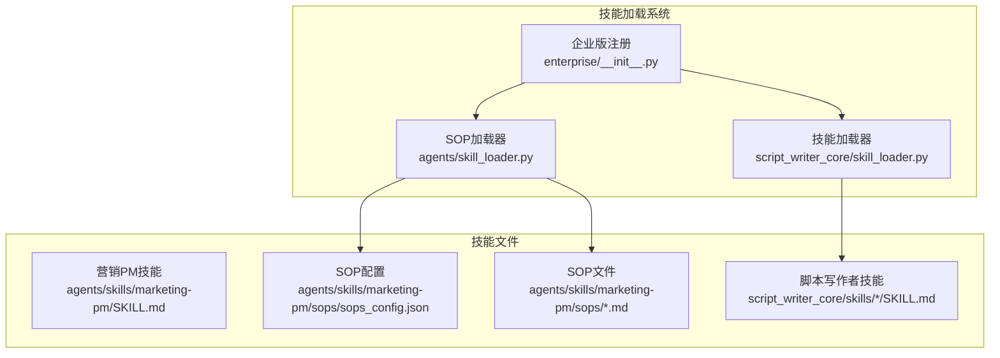

**图表来源**
- [agents/skill_loader.py:1-196](file://agents/skill_loader.py#L1-L196)
- [script_writer_core/skill_loader.py:1-406](file://script_writer_core/skill_loader.py#L1-L406)
- [enterprise/__init__.py:1-39](file://enterprise/__init__.py#L1-L39)

**章节来源**
- [agents/skill_loader.py:1-196](file://agents/skill_loader.py#L1-L196)
- [script_writer_core/skill_loader.py:1-406](file://script_writer_core/skill_loader.py#L1-L406)
- [enterprise/__init__.py:1-39](file://enterprise/__init__.py#L1-L39)

## 核心组件
技能加载系统包含两个核心类：SopLoader和SkillLoader。它们分别负责不同层次的技能加载和管理。

### SOP加载器（SopLoader）
SopLoader专门处理营销PM技能中的SOP文件，提供以下功能：
- 扫描和解析SOP文件的front matter元数据
- 构建SOP索引并支持动态替换
- 管理额外SOP目录的注册和优先级
- 提供按需加载SOP完整内容的能力

### 技能加载器（SkillLoader）
SkillLoader负责管理脚本写作者核心模块中的技能，具备以下特性：
- 支持用户级自定义技能覆盖默认技能
- 实现按需加载和缓存机制
- 提供技能元数据和完整内容的分离管理
- 支持额外技能目录的注册和覆盖

**章节来源**
- [agents/skill_loader.py:20-196](file://agents/skill_loader.py#L20-L196)
- [script_writer_core/skill_loader.py:15-406](file://script_writer_core/skill_loader.py#L15-L406)

## 架构概览
技能加载系统采用分层架构设计，实现了清晰的关注点分离：

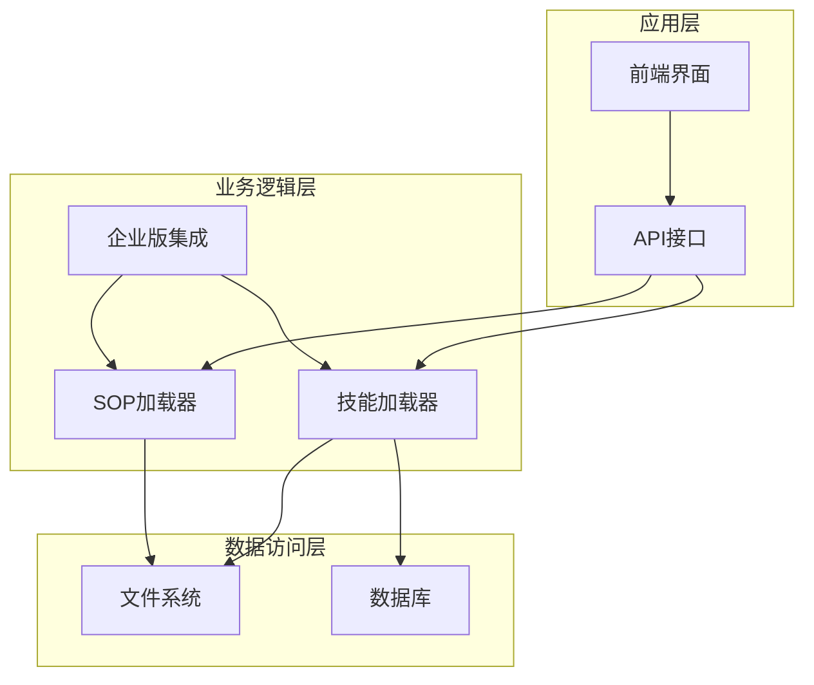

**图表来源**
- [script_writer_core/skill_loader.py:32-46](file://script_writer_core/skill_loader.py#L32-L46)
- [agents/skill_loader.py:37-44](file://agents/skill_loader.py#L37-L44)
- [enterprise/__init__.py:17-27](file://enterprise/__init__.py#L17-L27)

系统的核心工作流程包括：
1. 初始化阶段：注册额外目录并加载元数据
2. 请求阶段：按需加载完整内容
3. 缓存阶段：内存缓存提升性能
4. 覆盖阶段：企业版技能优先级高于默认技能

## 详细组件分析

### SOP加载器详细分析

#### 文件扫描机制
SOP加载器采用递归扫描策略，支持主目录和额外目录的并行处理：

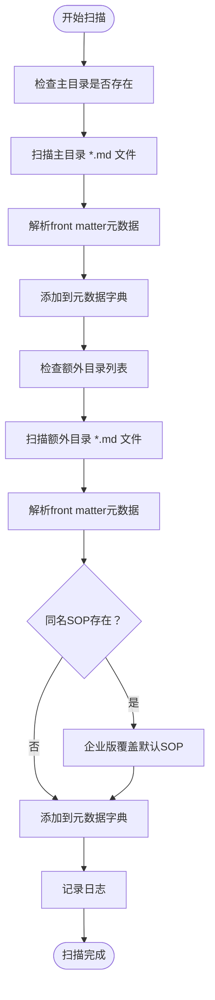

**图表来源**
- [agents/skill_loader.py:59-96](file://agents/skill_loader.py#L59-L96)

#### Front Matter解析机制
SOP加载器使用正则表达式解析YAML front matter，支持多行描述和特殊字符处理：

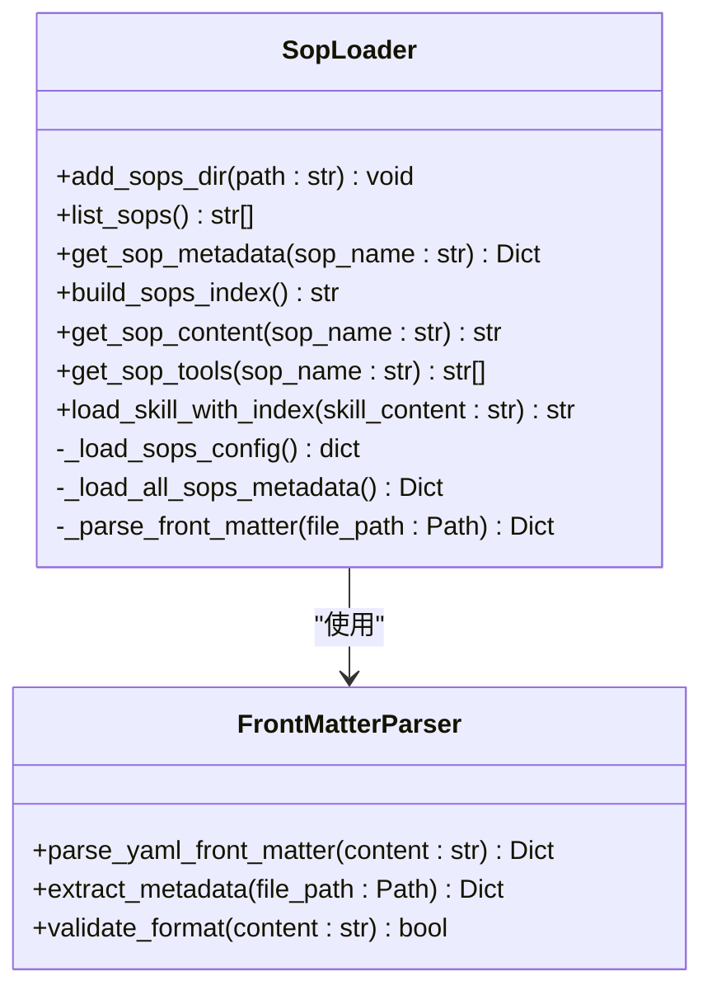

**图表来源**
- [agents/skill_loader.py:98-115](file://agents/skill_loader.py#L98-L115)

#### 索引构建和动态替换
SOP加载器提供完整的索引构建功能，支持在技能内容中动态替换占位符：

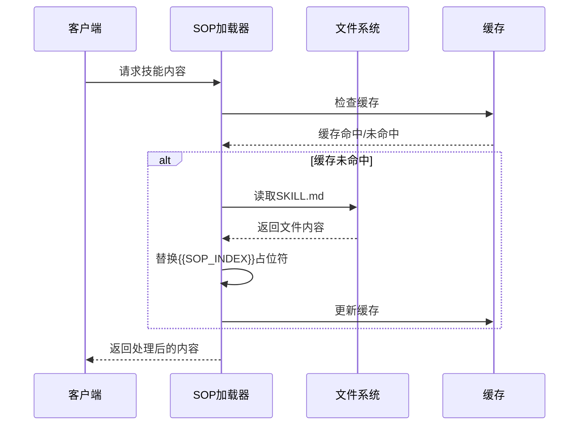

**图表来源**
- [agents/skill_loader.py:185-195](file://agents/skill_loader.py#L185-L195)

**章节来源**
- [agents/skill_loader.py:26-96](file://agents/skill_loader.py#L26-L96)
- [agents/skill_loader.py:98-195](file://agents/skill_loader.py#L98-L195)

### 技能加载器详细分析

#### 用户级自定义机制
技能加载器实现了强大的用户级自定义功能，支持优先级覆盖：

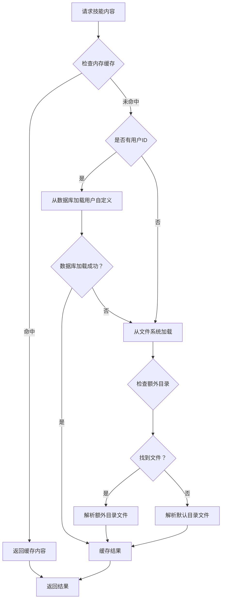

**图表来源**
- [script_writer_core/skill_loader.py:206-237](file://script_writer_core/skill_loader.py#L206-L237)

#### 技能文件组织结构
技能文件采用标准化的目录结构，每个技能包含独立的目录和SKILL.md文件：

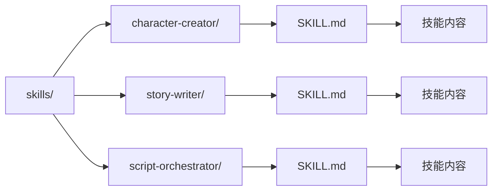

**图表来源**
- [script_writer_core/skills/character-creator/SKILL.md:1-289](file://script_writer_core/skills/character-creator/SKILL.md#L1-L289)

**章节来源**
- [script_writer_core/skill_loader.py:48-75](file://script_writer_core/skill_loader.py#L48-L75)
- [script_writer_core/skill_loader.py:160-183](file://script_writer_core/skill_loader.py#L160-L183)

### 企业版集成机制

#### 额外目录注册
企业版通过统一的注册机制管理额外技能和SOP目录：

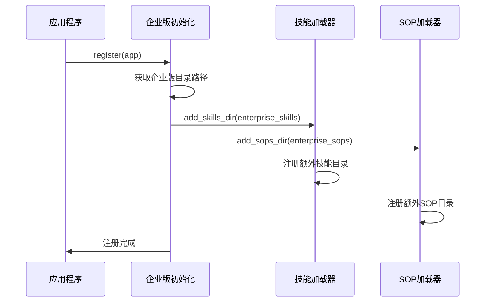

**图表来源**
- [enterprise/__init__.py:17-27](file://enterprise/__init__.py#L17-L27)

#### 优先级规则
企业版内容具有最高优先级，会覆盖默认内容：

| 目录类型 | 优先级 | 覆盖规则 |
|---------|--------|----------|
| 企业版目录 | 最高 | 覆盖默认内容 |
| 主目录 | 中等 | 被企业版覆盖 |
| 额外目录 | 最低 | 被主目录覆盖 |

**章节来源**
- [enterprise/__init__.py:17-27](file://enterprise/__init__.py#L17-L27)
- [agents/skill_loader.py:78-93](file://agents/skill_loader.py#L78-L93)
- [script_writer_core/skill_loader.py:61-73](file://script_writer_core/skill_loader.py#L61-L73)

## 依赖关系分析

### 组件依赖图
技能加载系统各组件之间的依赖关系清晰明确：

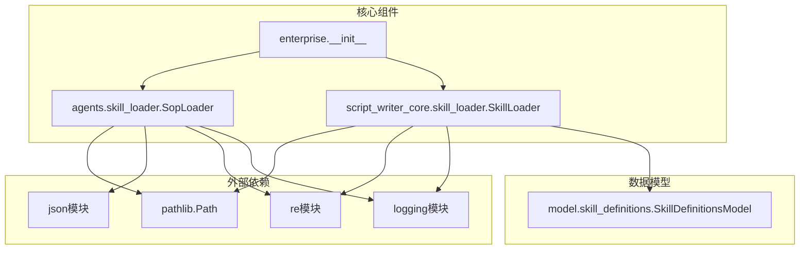

**图表来源**
- [agents/skill_loader.py:10-17](file://agents/skill_loader.py#L10-L17)
- [script_writer_core/skill_loader.py:6-12](file://script_writer_core/skill_loader.py#L6-L12)
- [script_writer_core/skill_loader.py:171](file://script_writer_core/skill_loader.py#L171)

### 数据流分析
系统采用分层的数据流设计，确保数据的一致性和可维护性：

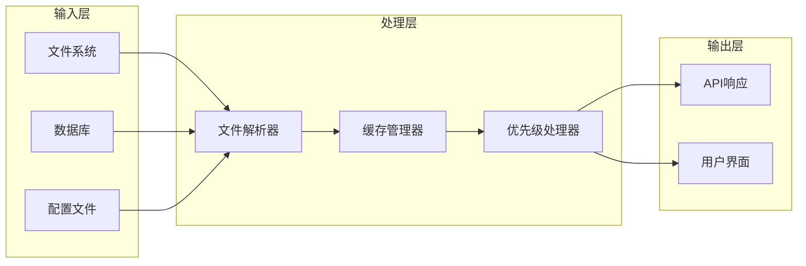

**图表来源**
- [script_writer_core/skill_loader.py:206-237](file://script_writer_core/skill_loader.py#L206-L237)
- [agents/skill_loader.py:59-96](file://agents/skill_loader.py#L59-L96)

**章节来源**
- [agents/skill_loader.py:10-17](file://agents/skill_loader.py#L10-L17)
- [script_writer_core/skill_loader.py:6-12](file://script_writer_core/skill_loader.py#L6-L12)

## 性能考量
技能加载系统在设计时充分考虑了性能优化，采用了多种策略来提升系统响应速度和资源利用率：

### 缓存策略
- **内存缓存**：完整技能内容和SOP内容采用内存缓存，避免重复I/O操作
- **按需加载**：只在需要时才加载完整内容，减少内存占用
- **缓存失效**：提供API级别的缓存清理功能，支持用户编辑后的刷新

### I/O优化
- **批量扫描**：初始化时一次性扫描所有目录，减少多次文件系统访问
- **正则表达式优化**：使用高效的正则表达式进行front matter解析
- **编码处理**：统一使用UTF-8编码，避免编码转换开销

### 内存管理
- **元数据分离**：技能元数据和完整内容分离存储，降低内存峰值
- **垃圾回收**：合理使用Python的垃圾回收机制，及时释放不再使用的对象

## 故障排除指南

### 常见问题诊断
系统提供了完善的日志记录和错误处理机制：

#### 文件解析错误
- **症状**：front matter解析失败，返回None
- **原因**：文件格式不符合YAML规范
- **解决方案**：检查文件头部的分隔符和缩进格式

#### 目录不存在
- **症状**：注册额外目录时出现警告
- **原因**：指定的目录路径不存在
- **解决方案**：确认目录路径正确性和权限设置

#### 缓存一致性问题
- **症状**：用户编辑后内容未更新
- **原因**：缓存未及时失效
- **解决方案**：调用invalidate_cache方法清理缓存

**章节来源**
- [agents/skill_loader.py:113-115](file://agents/skill_loader.py#L113-L115)
- [agents/skill_loader.py:34-35](file://agents/skill_loader.py#L34-L35)
- [script_writer_core/skill_loader.py:279-288](file://script_writer_core/skill_loader.py#L279-L288)

### 单元测试覆盖
系统包含完整的单元测试，确保核心功能的稳定性：

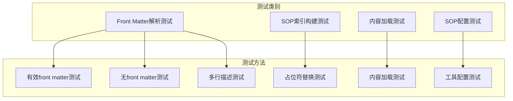

**图表来源**
- [tests/agents/test_skill_loader.py:20-289](file://tests/agents/test_skill_loader.py#L20-L289)

**章节来源**
- [tests/agents/test_skill_loader.py:20-289](file://tests/agents/test_skill_loader.py#L20-L289)

## 结论
技能加载系统通过精心设计的架构和实现，成功实现了以下目标：
- **模块化设计**：SOP加载器和技能加载器职责清晰，便于维护和扩展
- **企业级支持**：完整的额外目录注册机制，支持企业版功能扩展
- **性能优化**：多层缓存和按需加载策略，确保系统高效运行
- **用户友好**：支持用户级自定义，提供灵活的配置选项

系统的设计充分考虑了可扩展性和可维护性，为未来的功能扩展奠定了坚实基础。

## 附录

### 开发指南

#### 自定义技能开发步骤
1. **创建技能目录**：在skills目录下创建新的技能子目录
2. **编写SKILL.md**：包含YAML front matter和技能内容
3. **注册技能目录**：通过SkillLoader.add_skills_dir方法注册
4. **测试验证**：运行单元测试确保功能正常

#### SOP开发最佳实践
- 使用标准的YAML front matter格式
- 保持描述简洁明了
- 提供清晰的使用示例
- 定期更新工具权限配置

#### 性能优化建议
- 合理使用缓存机制
- 避免不必要的文件扫描
- 优化正则表达式的复杂度
- 监控内存使用情况