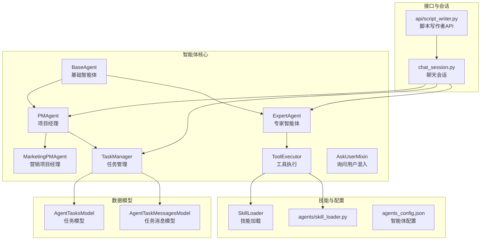
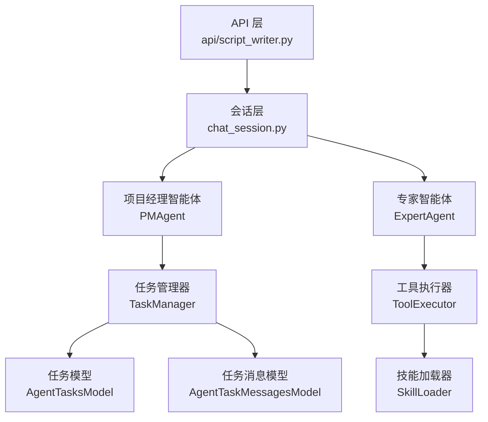
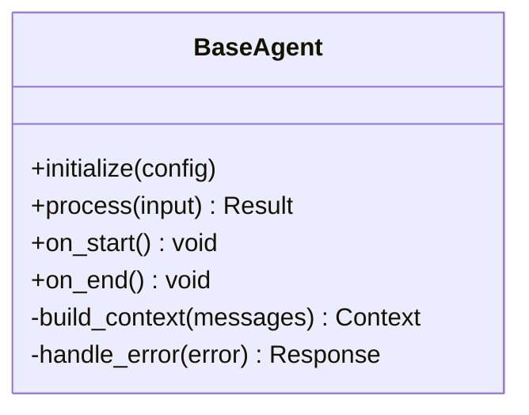
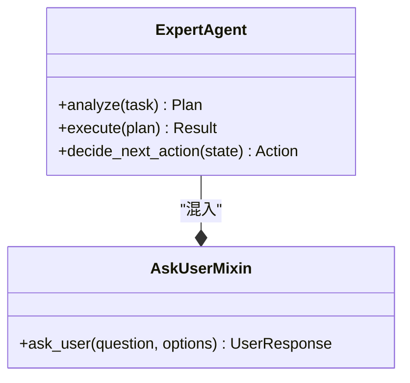
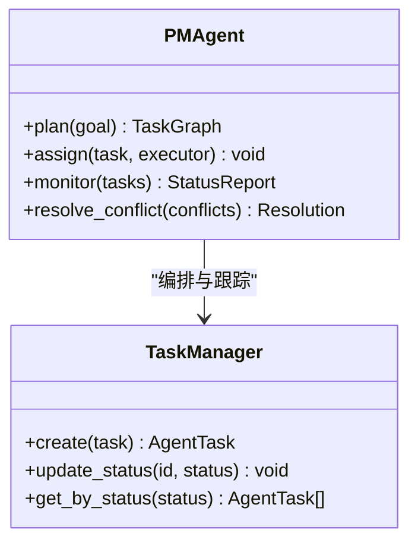
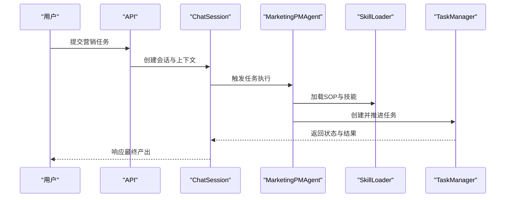
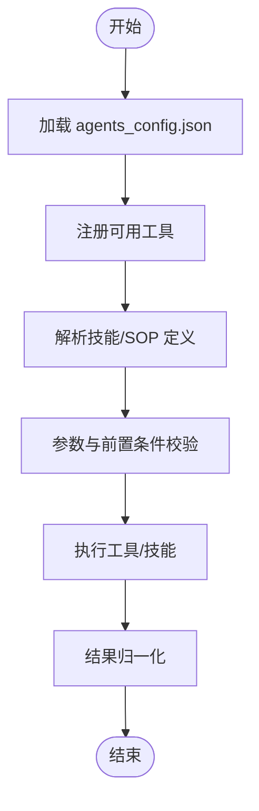
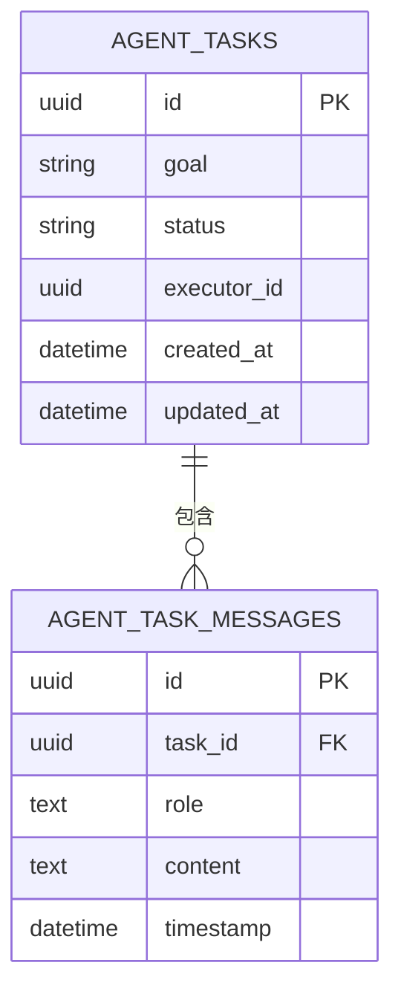
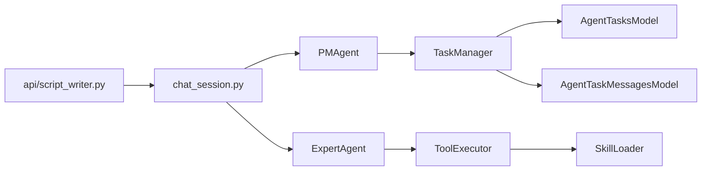

# 智能体架构设计

<cite>
**本文引用的文件**
- [script_writer_core/agents/base_agent.py](file://script_writer_core/agents/base_agent.py)
- [script_writer_core/agents/expert_agent.py](file://script_writer_core/agents/expert_agent.py)
- [script_writer_core/agents/pm_agent.py](file://script_writer_core/agents/pm_agent.py)
- [script_writer_core/agents/marketing_pm_agent.py](file://script_writer_core/agents/marketing_pm_agent.py)
- [script_writer_core/agents/task_manager.py](file://script_writer_core/agents/task_manager.py)
- [script_writer_core/agents/tool_executor.py](file://script_writer_core/agents/tool_executor.py)
- [script_writer_core/agents/ask_user_mixin.py](file://script_writer_core/agents/ask_user_mixin.py)
- [agents/skill_loader.py](file://agents/skill_loader.py)
- [model/agent_tasks.py](file://model/agent_tasks.py)
- [model/agent_task_messages.py](file://model/agent_task_messages.py)
- [script_writer_core/chat_session.py](file://script_writer_core/chat_session.py)
- [api/script_writer.py](file://api/script_writer.py)
- [script_writer_core/config/agents_config.json](file://script_writer_core/config/agents_config.json)
- [script_writer_core/skill_loader.py](file://script_writer_core/skill_loader.py)
- [tests/script_writer_core/test_base_agent.py](file://tests/script_writer_core/test_base_agent.py)
- [tests/script_writer_core/test_expert_agent.py](file://tests/script_writer_core/test_expert_agent.py)
- [tests/script_writer_core/test_marketing_pm_agent.py](file://tests/script_writer_core/test_marketing_pm_agent.py)
- [tests/utils/test_pm_agent_message_queue.py](file://tests/utils/test_pm_agent_message_queue.py)
</cite>

## 目录
1. [引言](#引言)
2. [项目结构](#项目结构)
3. [核心组件](#核心组件)
4. [架构总览](#架构总览)
5. [详细组件分析](#详细组件分析)
6. [依赖关系分析](#依赖关系分析)
7. [性能考虑](#性能考虑)
8. [故障排查指南](#故障排查指南)
9. [结论](#结论)
10. [附录](#附录)

## 引言
本文件面向“智能体架构设计”的目标，系统化梳理多智能体系统的整体设计与实现要点，覆盖基础智能体类的设计模式、专家智能体的职责分工、项目经理智能体的协调机制；阐述智能体间通信协议、状态管理模式与冲突解决策略；解释生命周期管理、消息传递机制与协作模式；并提供扩展开发指南、自定义智能体实现方法、性能优化技巧以及容错机制、重试策略与监控告警方案。

## 项目结构
该仓库围绕“脚本写作者”场景构建了完整的多智能体体系，核心位于 script_writer_core/agents 目录，配套模型层用于持久化任务与消息，API 层负责对外交互，技能加载模块负责 SOP 与技能的动态装配。

图表来源
- [script_writer_core/agents/base_agent.py:1-200](file://script_writer_core/agents/base_agent.py#L1-L200)
- [script_writer_core/agents/expert_agent.py:1-200](file://script_writer_core/agents/expert_agent.py#L1-L200)
- [script_writer_core/agents/pm_agent.py:1-200](file://script_writer_core/agents/pm_agent.py#L1-L200)
- [script_writer_core/agents/marketing_pm_agent.py:1-200](file://script_writer_core/agents/marketing_pm_agent.py#L1-L200)
- [script_writer_core/agents/task_manager.py:1-200](file://script_writer_core/agents/task_manager.py#L1-L200)
- [script_writer_core/agents/tool_executor.py:1-200](file://script_writer_core/agents/tool_executor.py#L1-L200)
- [agents/skill_loader.py:1-200](file://agents/skill_loader.py#L1-L200)
- [model/agent_tasks.py:1-200](file://model/agent_tasks.py#L1-L200)
- [model/agent_task_messages.py:1-200](file://model/agent_task_messages.py#L1-L200)
- [api/script_writer.py:1-300](file://api/script_writer.py#L1-L300)
- [script_writer_core/chat_session.py:1-200](file://script_writer_core/chat_session.py#L1-L200)

章节来源
- [script_writer_core/agents/base_agent.py:1-200](file://script_writer_core/agents/base_agent.py#L1-L200)
- [script_writer_core/agents/expert_agent.py:1-200](file://script_writer_core/agents/expert_agent.py#L1-L200)
- [script_writer_core/agents/pm_agent.py:1-200](file://script_writer_core/agents/pm_agent.py#L1-L200)
- [script_writer_core/agents/marketing_pm_agent.py:1-200](file://script_writer_core/agents/marketing_pm_agent.py#L1-L200)
- [script_writer_core/agents/task_manager.py:1-200](file://script_writer_core/agents/task_manager.py#L1-L200)
- [script_writer_core/agents/tool_executor.py:1-200](file://script_writer_core/agents/tool_executor.py#L1-L200)
- [agents/skill_loader.py:1-200](file://agents/skill_loader.py#L1-L200)
- [model/agent_tasks.py:1-200](file://model/agent_tasks.py#L1-L200)
- [model/agent_task_messages.py:1-200](file://model/agent_task_messages.py#L1-L200)
- [api/script_writer.py:1-300](file://api/script_writer.py#L1-L300)
- [script_writer_core/chat_session.py:1-200](file://script_writer_core/chat_session.py#L1-L200)

## 核心组件
- 基础智能体 BaseAgent：定义统一的消息处理、上下文管理、LLM 调用入口与错误处理框架。
- 专家智能体 ExpertAgent：在基础能力上注入领域知识与推理链路，支持复杂任务分解与执行。
- 项目经理智能体 PMAgent：负责任务编排、进度跟踪、资源协调与跨智能体通信。
- 营销项目经理智能体 MarketingPMAgent：面向营销场景的任务规划与 SOP 执行。
- 任务管理 TaskManager：维护任务生命周期、状态机与持久化。
- 工具执行 ToolExecutor：封装外部工具调用、参数校验与结果归一化。
- 技能加载 SkillLoader：动态加载 SOP 与技能定义，支持配置驱动的可插拔扩展。
- 数据模型 AgentTasksModel/AgentTaskMessagesModel：持久化任务与消息，支撑可观测性与回放。

章节来源
- [script_writer_core/agents/base_agent.py:1-200](file://script_writer_core/agents/base_agent.py#L1-L200)
- [script_writer_core/agents/expert_agent.py:1-200](file://script_writer_core/agents/expert_agent.py#L1-L200)
- [script_writer_core/agents/pm_agent.py:1-200](file://script_writer_core/agents/pm_agent.py#L1-L200)
- [script_writer_core/agents/marketing_pm_agent.py:1-200](file://script_writer_core/agents/marketing_pm_agent.py#L1-L200)
- [script_writer_core/agents/task_manager.py:1-200](file://script_writer_core/agents/task_manager.py#L1-L200)
- [script_writer_core/agents/tool_executor.py:1-200](file://script_writer_core/agents/tool_executor.py#L1-L200)
- [agents/skill_loader.py:1-200](file://agents/skill_loader.py#L1-L200)
- [model/agent_tasks.py:1-200](file://model/agent_tasks.py#L1-L200)
- [model/agent_task_messages.py:1-200](file://model/agent_task_messages.py#L1-L200)

## 架构总览
多智能体系统采用“分层+插件化”的架构：
- 表层：API 与聊天会话负责请求接入与上下文组织。
- 中层：智能体与任务管理器协同，完成任务编排与执行。
- 底层：工具执行器与技能加载器提供能力扩展点。
- 数据层：任务与消息模型提供持久化与可观测性。

图表来源
- [api/script_writer.py:1-300](file://api/script_writer.py#L1-L300)
- [script_writer_core/chat_session.py:1-200](file://script_writer_core/chat_session.py#L1-L200)
- [script_writer_core/agents/pm_agent.py:1-200](file://script_writer_core/agents/pm_agent.py#L1-L200)
- [script_writer_core/agents/expert_agent.py:1-200](file://script_writer_core/agents/expert_agent.py#L1-L200)
- [script_writer_core/agents/task_manager.py:1-200](file://script_writer_core/agents/task_manager.py#L1-L200)
- [script_writer_core/agents/tool_executor.py:1-200](file://script_writer_core/agents/tool_executor.py#L1-L200)
- [agents/skill_loader.py:1-200](file://agents/skill_loader.py#L1-L200)
- [model/agent_tasks.py:1-200](file://model/agent_tasks.py#L1-L200)
- [model/agent_task_messages.py:1-200](file://model/agent_task_messages.py#L1-L200)

## 详细组件分析

### 基础智能体 BaseAgent 设计模式
- 统一的消息处理流程：接收输入 -> 构造上下文 -> 调用 LLM -> 解析输出 -> 更新状态。
- 上下文管理：支持历史消息、角色指令、工具描述等上下文拼装。
- 错误处理：捕获异常、记录日志、返回标准化错误响应。
- 生命周期钩子：初始化、开始、结束阶段的可扩展回调。

图表来源
- [script_writer_core/agents/base_agent.py:1-200](file://script_writer_core/agents/base_agent.py#L1-L200)

章节来源
- [script_writer_core/agents/base_agent.py:1-200](file://script_writer_core/agents/base_agent.py#L1-L200)

### 专家智能体 ExpertAgent 职责与实现
- 领域推理：针对复杂任务进行拆解、规划与优先级排序。
- 工具编排：通过 ToolExecutor 调用外部能力，整合多源输出。
- 与 AskUserMixin 协作：在必要时向用户发起询问以补充上下文或决策依据。
- 模型选择与提示工程：根据任务类型选择合适模型与提示模板。

图表来源
- [script_writer_core/agents/expert_agent.py:1-200](file://script_writer_core/agents/expert_agent.py#L1-L200)
- [script_writer_core/agents/ask_user_mixin.py:1-200](file://script_writer_core/agents/ask_user_mixin.py#L1-L200)

章节来源
- [script_writer_core/agents/expert_agent.py:1-200](file://script_writer_core/agents/expert_agent.py#L1-L200)
- [script_writer_core/agents/ask_user_mixin.py:1-200](file://script_writer_core/agents/ask_user_mixin.py#L1-L200)

### 项目经理智能体 PMAgent 协调机制
- 任务编排：将高层目标拆解为子任务，分配给合适的智能体或工具。
- 进度跟踪：维护任务状态机（待处理/进行中/已完成/失败），并上报进度。
- 冲突解决：当多个子任务存在资源或时序冲突时，进行优先级调整与回滚策略。
- 与营销项目经理协作：在营销场景下结合 SOP 流程，确保合规与效率。

图表来源
- [script_writer_core/agents/pm_agent.py:1-200](file://script_writer_core/agents/pm_agent.py#L1-L200)
- [script_writer_core/agents/task_manager.py:1-200](file://script_writer_core/agents/task_manager.py#L1-L200)

章节来源
- [script_writer_core/agents/pm_agent.py:1-200](file://script_writer_core/agents/pm_agent.py#L1-L200)
- [script_writer_core/agents/task_manager.py:1-200](file://script_writer_core/agents/task_manager.py#L1-L200)

### 营销项目经理智能体 MarketingPMAgent
- SOP 驱动：基于 agents/skill_loader 的配置加载营销 SOP，按步骤执行。
- 场景适配：针对视频生成、图片营销等场景定制流程与检查点。
- 与 PMAgent 协同：在通用编排之上增加行业规范与质量门禁。

图表来源
- [script_writer_core/agents/marketing_pm_agent.py:1-200](file://script_writer_core/agents/marketing_pm_agent.py#L1-L200)
- [agents/skill_loader.py:1-200](file://agents/skill_loader.py#L1-L200)
- [script_writer_core/agents/task_manager.py:1-200](file://script_writer_core/agents/task_manager.py#L1-L200)
- [script_writer_core/chat_session.py:1-200](file://script_writer_core/chat_session.py#L1-L200)
- [api/script_writer.py:1-300](file://api/script_writer.py#L1-L300)

章节来源
- [script_writer_core/agents/marketing_pm_agent.py:1-200](file://script_writer_core/agents/marketing_pm_agent.py#L1-L200)
- [agents/skill_loader.py:1-200](file://agents/skill_loader.py#L1-L200)
- [script_writer_core/agents/task_manager.py:1-200](file://script_writer_core/agents/task_manager.py#L1-L200)
- [script_writer_core/chat_session.py:1-200](file://script_writer_core/chat_session.py#L1-L200)
- [api/script_writer.py:1-300](file://api/script_writer.py#L1-L300)

### 工具执行器 ToolExecutor 与技能加载
- ToolExecutor：封装工具注册、参数校验、并发控制与结果归一化。
- SkillLoader：从 agents/skill_loader.py 与 script_writer_core/skill_loader.py 加载技能与 SOP，支持 JSON/Markdown 等格式。
- 配置驱动：agents_config.json 定义智能体能力边界与工具映射。

图表来源
- [script_writer_core/agents/tool_executor.py:1-200](file://script_writer_core/agents/tool_executor.py#L1-L200)
- [agents/skill_loader.py:1-200](file://agents/skill_loader.py#L1-L200)
- [script_writer_core/config/agents_config.json:1-200](file://script_writer_core/config/agents_config.json#L1-L200)

章节来源
- [script_writer_core/agents/tool_executor.py:1-200](file://script_writer_core/agents/tool_executor.py#L1-L200)
- [agents/skill_loader.py:1-200](file://agents/skill_loader.py#L1-L200)
- [script_writer_core/config/agents_config.json:1-200](file://script_writer_core/config/agents_config.json#L1-L200)

### 任务与消息模型
- AgentTasksModel：持久化任务元信息、状态、执行者与时间戳。
- AgentTaskMessagesModel：持久化任务过程中的消息流，支持回放与审计。
- 与 TaskManager 协同：在任务生命周期内写入/更新状态与消息。

图表来源
- [model/agent_tasks.py:1-200](file://model/agent_tasks.py#L1-L200)
- [model/agent_task_messages.py:1-200](file://model/agent_task_messages.py#L1-L200)

章节来源
- [model/agent_tasks.py:1-200](file://model/agent_tasks.py#L1-L200)
- [model/agent_task_messages.py:1-200](file://model/agent_task_messages.py#L1-L200)

## 依赖关系分析
- 组件耦合：PMAgent 依赖 TaskManager；ExpertAgent 依赖 ToolExecutor；MarketingPMAgent 依赖 SkillLoader。
- 外部依赖：API 与 ChatSession 作为入口，向上游智能体与下游工具/模型提供统一接口。
- 可能的循环依赖：当前结构以 TaskManager 为核心枢纽，避免直接循环；若新增双向通信需谨慎设计。

图表来源
- [api/script_writer.py:1-300](file://api/script_writer.py#L1-L300)
- [script_writer_core/chat_session.py:1-200](file://script_writer_core/chat_session.py#L1-L200)
- [script_writer_core/agents/pm_agent.py:1-200](file://script_writer_core/agents/pm_agent.py#L1-L200)
- [script_writer_core/agents/expert_agent.py:1-200](file://script_writer_core/agents/expert_agent.py#L1-L200)
- [script_writer_core/agents/task_manager.py:1-200](file://script_writer_core/agents/task_manager.py#L1-L200)
- [script_writer_core/agents/tool_executor.py:1-200](file://script_writer_core/agents/tool_executor.py#L1-L200)
- [agents/skill_loader.py:1-200](file://agents/skill_loader.py#L1-L200)
- [model/agent_tasks.py:1-200](file://model/agent_tasks.py#L1-L200)
- [model/agent_task_messages.py:1-200](file://model/agent_task_messages.py#L1-L200)

章节来源
- [api/script_writer.py:1-300](file://api/script_writer.py#L1-L300)
- [script_writer_core/chat_session.py:1-200](file://script_writer_core/chat_session.py#L1-L200)
- [script_writer_core/agents/pm_agent.py:1-200](file://script_writer_core/agents/pm_agent.py#L1-L200)
- [script_writer_core/agents/expert_agent.py:1-200](file://script_writer_core/agents/expert_agent.py#L1-L200)
- [script_writer_core/agents/task_manager.py:1-200](file://script_writer_core/agents/task_manager.py#L1-L200)
- [script_writer_core/agents/tool_executor.py:1-200](file://script_writer_core/agents/tool_executor.py#L1-L200)
- [agents/skill_loader.py:1-200](file://agents/skill_loader.py#L1-L200)
- [model/agent_tasks.py:1-200](file://model/agent_tasks.py#L1-L200)
- [model/agent_task_messages.py:1-200](file://model/agent_task_messages.py#L1-L200)

## 性能考虑
- 并发与限流：ToolExecutor 应对并发调用进行限流与排队，避免下游能力过载。
- 缓存与复用：对重复任务与相似消息进行去重与缓存，减少重复计算。
- 分片与流水线：将长任务拆分为子任务，利用 TaskManager 的状态机实现流水线式推进。
- 日志与指标：在关键节点埋点，采集延迟、成功率与错误分布，支撑容量规划与优化。

## 故障排查指南
- 任务卡死：检查 TaskManager 的状态更新是否正常，是否存在阻塞式等待。
- 工具执行失败：查看 ToolExecutor 的参数校验与异常捕获逻辑，确认工具可用性与权限。
- SOP 加载异常：核对 agents/skill_loader 与 script_writer_core/skill_loader 的路径与格式。
- 会话中断：检查 ChatSession 的上下文拼装与消息持久化是否一致。
- 单元测试参考：通过测试用例定位问题范围，如基础智能体、专家智能体与营销项目经理的断言。

章节来源
- [tests/script_writer_core/test_base_agent.py:1-200](file://tests/script_writer_core/test_base_agent.py#L1-L200)
- [tests/script_writer_core/test_expert_agent.py:1-200](file://tests/script_writer_core/test_expert_agent.py#L1-L200)
- [tests/script_writer_core/test_marketing_pm_agent.py:1-200](file://tests/script_writer_core/test_marketing_pm_agent.py#L1-L200)
- [tests/utils/test_pm_agent_message_queue.py:1-200](file://tests/utils/test_pm_agent_message_queue.py#L1-L200)

## 结论
该智能体架构以“可插拔技能 + 任务驱动 + 工具编排”为核心，通过清晰的职责划分与状态管理实现了高扩展性与稳定性。建议在生产环境中进一步完善监控告警、重试与熔断策略，并持续沉淀 SOP 与工具库以提升自动化水平。

## 附录

### 智能体生命周期管理
- 初始化：加载配置与上下文，注册工具与技能。
- 执行：接收输入，进入消息处理循环，按状态推进任务。
- 结束：清理资源，持久化最终状态与消息。

章节来源
- [script_writer_core/agents/base_agent.py:1-200](file://script_writer_core/agents/base_agent.py#L1-L200)
- [script_writer_core/agents/task_manager.py:1-200](file://script_writer_core/agents/task_manager.py#L1-L200)

### 消息传递机制
- 请求入口：API/ChatSession 将用户意图转化为任务与消息。
- 智能体内聚：BaseAgent/ExpertAgent/PMAgent 内部维护消息队列与上下文。
- 结果回传：通过 TaskManager 与消息模型持久化，再由 API 返回。

章节来源
- [api/script_writer.py:1-300](file://api/script_writer.py#L1-L300)
- [script_writer_core/chat_session.py:1-200](file://script_writer_core/chat_session.py#L1-L200)
- [model/agent_task_messages.py:1-200](file://model/agent_task_messages.py#L1-L200)

### 协作模式与冲突解决
- 协作：PMAgent 作为协调者，ExpertAgent 作为执行者，ToolExecutor 作为能力提供者。
- 冲突：优先级调整、资源回收与回滚策略，确保整体一致性。

章节来源
- [script_writer_core/agents/pm_agent.py:1-200](file://script_writer_core/agents/pm_agent.py#L1-L200)
- [script_writer_core/agents/expert_agent.py:1-200](file://script_writer_core/agents/expert_agent.py#L1-L200)

### 扩展开发指南
- 新增智能体：继承 BaseAgent 或混入 AskUserMixin，实现 process/decide 等方法。
- 新增工具：在 ToolExecutor 注册新工具，完善参数校验与错误处理。
- 新增技能/SOP：在 SkillLoader 中新增定义文件，更新 agents_config.json。

章节来源
- [script_writer_core/agents/base_agent.py:1-200](file://script_writer_core/agents/base_agent.py#L1-L200)
- [script_writer_core/agents/tool_executor.py:1-200](file://script_writer_core/agents/tool_executor.py#L1-L200)
- [agents/skill_loader.py:1-200](file://agents/skill_loader.py#L1-L200)
- [script_writer_core/config/agents_config.json:1-200](file://script_writer_core/config/agents_config.json#L1-L200)

### 自定义智能体实现方法
- 明确职责：区分专家智能体与项目经理智能体的边界。
- 设计状态机：为任务设计清晰的状态转换与检查点。
- 编写测试：基于现有测试用例编写单元测试，覆盖关键分支。

章节来源
- [tests/script_writer_core/test_expert_agent.py:1-200](file://tests/script_writer_core/test_expert_agent.py#L1-L200)
- [tests/script_writer_core/test_marketing_pm_agent.py:1-200](file://tests/script_writer_core/test_marketing_pm_agent.py#L1-L200)

### 性能优化技巧
- 减少重复计算：缓存中间结果与工具调用。
- 合理拆分任务：避免单次执行时间过长。
- 异步化：对耗时操作异步化，提高吞吐。

### 容错机制、重试策略与监控告警
- 容错：在 ToolExecutor 与 ExpertAgent 中捕获异常并降级处理。
- 重试：对临时性错误（网络/限流）设置指数退避重试。
- 监控：采集关键指标（成功率、P95 延迟、错误码分布），对接告警系统。