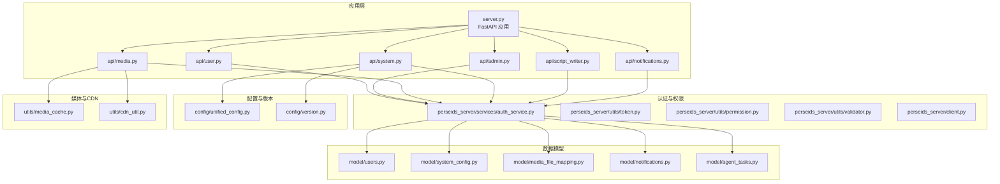
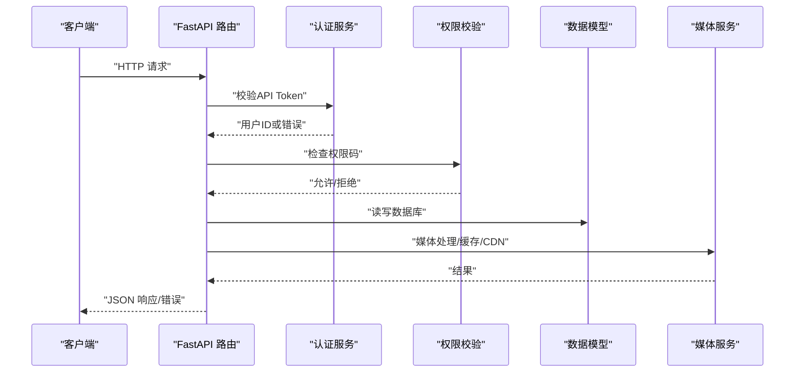
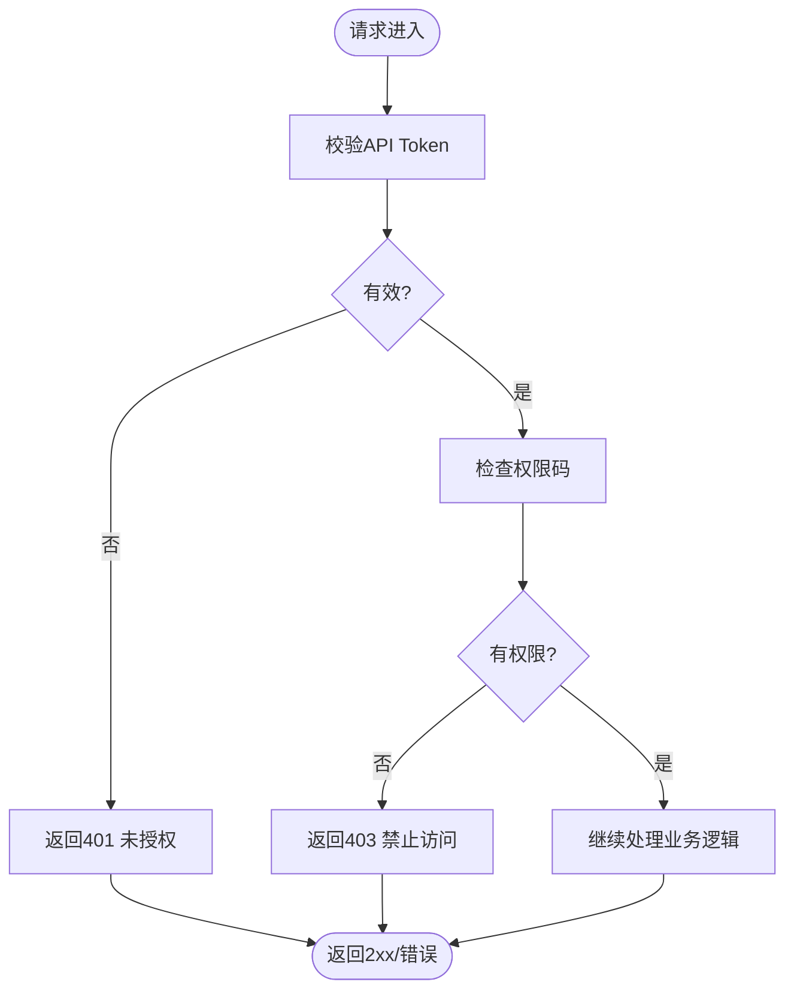
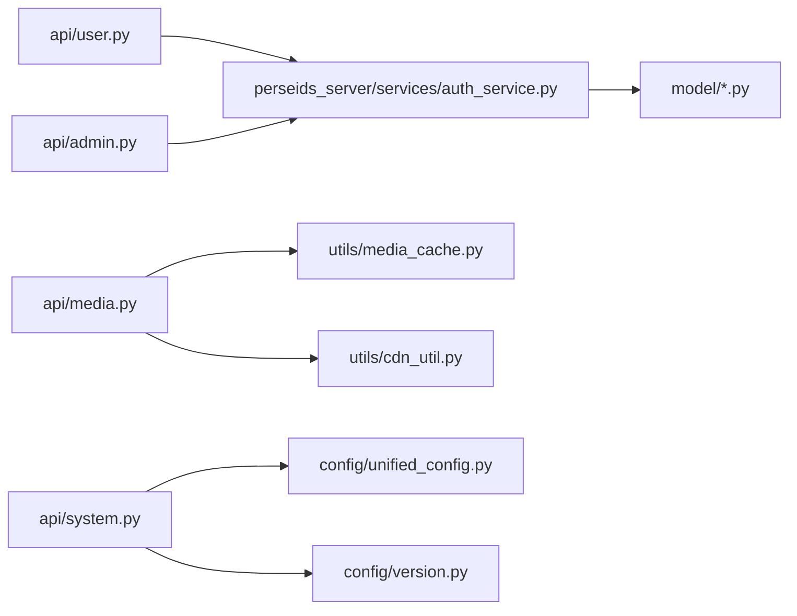

# API接口文档

<cite>
**本文引用的文件**
- [server.py](file://server.py)
- [api/admin.py](file://api/admin.py)
- [api/user.py](file://api/user.py)
- [api/media.py](file://api/media.py)
- [api/system.py](file://api/system.py)
- [api/script_writer.py](file://api/script_writer.py)
- [api/notifications.py](file://api/notifications.py)
- [perseids_server/client.py](file://perseids_server/client.py)
- [perseids_server/services/auth_service.py](file://perseids_server/services/auth_service.py)
- [perseids_server/utils/token.py](file://perseids_server/utils/token.py)
- [perseids_server/utils/permission.py](file://perseids_server/utils/permission.py)
- [perseids_server/utils/validator.py](file://perseids_server/utils/validator.py)
- [model/users.py](file://model/users.py)
- [model/system_config.py](file://model/system_config.py)
- [model/media_file_mapping.py](file://model/media_file_mapping.py)
- [model/notifications.py](file://model/notifications.py)
- [model/agent_tasks.py](file://model/agent_tasks.py)
- [config/version.py](file://config/version.py)
- [config/unified_config.py](file://config/unified_config.py)
- [utils/media_cache.py](file://utils/media_cache.py)
- [utils/cdn_util.py](file://utils/cdn_util.py)
- [alembic/versions/20260401_add_api_token_idx.py](file://alembic/versions/20260401_add_api_token_idx.py)
</cite>

## 目录
1. [简介](#简介)
2. [项目结构](#项目结构)
3. [核心组件](#核心组件)
4. [架构总览](#架构总览)
5. [详细组件分析](#详细组件分析)
6. [依赖关系分析](#依赖关系分析)
7. [性能与扩展性](#性能与扩展性)
8. [故障排查指南](#故障排查指南)
9. [结论](#结论)
10. [附录](#附录)

## 简介
本文件为ZhiJuTong平台的API接口文档，覆盖用户认证、管理员管理、媒体文件处理、系统配置、脚本写作、通知等核心功能模块。文档提供RESTful API端点定义、认证授权机制、权限控制策略、错误处理与版本管理策略，并给出SSE实时通信的连接与事件模型说明。同时包含SDK使用建议、集成最佳实践、调试与监控方法。

## 项目结构
后端基于FastAPI构建，采用模块化路由组织方式：
- 核心入口：server.py
- 功能模块：api/admin.py、api/user.py、api/media.py、api/system.py、api/script_writer.py、api/notifications.py
- 认证与权限：perseids_server/services/auth_service.py、perseids_server/utils/token.py、perseids_server/utils/permission.py、perseids_server/utils/validator.py
- 数据模型：model/users.py、model/system_config.py、model/media_file_mapping.py、model/notifications.py、model/agent_tasks.py
- 配置与版本：config/unified_config.py、config/version.py
- 媒体与CDN：utils/media_cache.py、utils/cdn_util.py
- 数据库索引：alembic/versions/20260401_add_api_token_idx.py

图表来源
- [server.py](file://server.py)
- [api/user.py](file://api/user.py)
- [api/admin.py](file://api/admin.py)
- [api/media.py](file://api/media.py)
- [api/system.py](file://api/system.py)
- [api/script_writer.py](file://api/script_writer.py)
- [api/notifications.py](file://api/notifications.py)
- [perseids_server/services/auth_service.py](file://perseids_server/services/auth_service.py)
- [perseids_server/utils/token.py](file://perseids_server/utils/token.py)
- [perseids_server/utils/permission.py](file://perseids_server/utils/permission.py)
- [perseids_server/utils/validator.py](file://perseids_server/utils/validator.py)
- [perseids_server/client.py](file://perseids_server/client.py)
- [model/users.py](file://model/users.py)
- [model/system_config.py](file://model/system_config.py)
- [model/media_file_mapping.py](file://model/media_file_mapping.py)
- [model/notifications.py](file://model/notifications.py)
- [model/agent_tasks.py](file://model/agent_tasks.py)
- [config/unified_config.py](file://config/unified_config.py)
- [config/version.py](file://config/version.py)
- [utils/media_cache.py](file://utils/media_cache.py)
- [utils/cdn_util.py](file://utils/cdn_util.py)

章节来源
- [server.py](file://server.py)
- [api/admin.py](file://api/admin.py)
- [api/user.py](file://api/user.py)
- [api/media.py](file://api/media.py)
- [api/system.py](file://api/system.py)
- [api/script_writer.py](file://api/script_writer.py)
- [api/notifications.py](file://api/notifications.py)

## 核心组件
- 认证与令牌：通过API Token进行认证，支持令牌校验、日志记录与权限验证。
- 管理员管理：用户状态与角色变更、算力充值、ZJT令牌管理、系统配置管理。
- 媒体文件：上传、映射、缓存与CDN分发，支持标签与本地路径哈希。
- 系统配置：统一配置中心、快速配置、配置历史、第三方服务连通性测试。
- 脚本写作：脚本生成相关任务与会话管理。
- 通知：系统通知与消息推送。
- SSE：实时事件流（SSE）用于异步任务状态推送与事件通知。

章节来源
- [perseids_server/client.py](file://perseids_server/client.py)
- [perseids_server/services/auth_service.py](file://perseids_server/services/auth_service.py)
- [perseids_server/utils/token.py](file://perseids_server/utils/token.py)
- [perseids_server/utils/permission.py](file://perseids_server/utils/permission.py)
- [perseids_server/utils/validator.py](file://perseids_server/utils/validator.py)
- [api/admin.py](file://api/admin.py)
- [api/user.py](file://api/user.py)
- [api/media.py](file://api/media.py)
- [api/system.py](file://api/system.py)
- [api/script_writer.py](file://api/script_writer.py)
- [api/notifications.py](file://api/notifications.py)
- [model/media_file_mapping.py](file://model/media_file_mapping.py)
- [model/system_config.py](file://model/system_config.py)
- [model/notifications.py](file://model/notifications.py)
- [model/agent_tasks.py](file://model/agent_tasks.py)
- [utils/media_cache.py](file://utils/media_cache.py)
- [utils/cdn_util.py](file://utils/cdn_util.py)

## 架构总览
系统采用分层架构：Web层（FastAPI路由）、业务层（各模块API）、服务层（认证与权限、配置、媒体处理）、数据层（数据库模型与迁移）。认证通过API Token在服务层统一校验，权限通过装饰器与权限码控制访问。

图表来源
- [server.py](file://server.py)
- [perseids_server/services/auth_service.py](file://perseids_server/services/auth_service.py)
- [perseids_server/utils/permission.py](file://perseids_server/utils/permission.py)
- [perseids_server/utils/token.py](file://perseids_server/utils/token.py)
- [model/users.py](file://model/users.py)
- [utils/media_cache.py](file://utils/media_cache.py)
- [utils/cdn_util.py](file://utils/cdn_util.py)

## 详细组件分析

### 认证与授权机制
- 认证方式：API Token（用户表包含api_token字段并建立唯一索引）。
- 校验流程：服务端校验Token有效性，返回用户ID；未通过则返回401。
- 权限控制：基于权限码的装饰器与校验工具，确保端点访问受控。
- 安全考虑：Token存储于数据库索引字段，避免泄露；建议HTTPS传输与定期轮换。

图表来源
- [perseids_server/utils/token.py](file://perseids_server/utils/token.py)
- [perseids_server/utils/permission.py](file://perseids_server/utils/permission.py)
- [perseids_server/utils/validator.py](file://perseids_server/utils/validator.py)
- [alembic/versions/20260401_add_api_token_idx.py](file://alembic/versions/20260401_add_api_token_idx.py)

章节来源
- [perseids_server/client.py](file://perseids_server/client.py)
- [perseids_server/services/auth_service.py](file://perseids_server/services/auth_service.py)
- [perseids_server/utils/token.py](file://perseids_server/utils/token.py)
- [perseids_server/utils/permission.py](file://perseids_server/utils/permission.py)
- [perseids_server/utils/validator.py](file://perseids_server/utils/validator.py)
- [alembic/versions/20260401_add_api_token_idx.py](file://alembic/versions/20260401_add_api_token_idx.py)

### 用户认证与令牌日志
- 端点概览
  - 获取认证令牌：POST /api/v1/auth/get_auth_token_by_user_id
  - 登出：POST /api/v1/auth/logout
  - 创建令牌使用日志：POST /api/v1/user/token_log
  - 查询可用模型：GET /api/v1/user/models
- 请求参数
  - get_auth_token_by_user_id：user_id
  - logout：无
  - token_log：input_token、output_token、cache_read、cache_creation、raw_input_token、vendor_id、model_id、note
  - models：无
- 响应格式
  - 统一返回结构：success、message、data
- 错误代码
  - 400：参数错误
  - 401：无效的认证信息
  - 500：内部错误

章节来源
- [perseids_server/client.py](file://perseids_server/client.py)
- [perseids_server/services/auth_service.py](file://perseids_server/services/auth_service.py)

### 管理员管理
- 用户管理
  - 列表：GET /api/v1/admin/users
  - 详情：GET /api/v1/admin/users/{user_id}
  - 状态变更：PUT /api/v1/admin/users/{user_id}/status
  - 角色变更：PUT /api/v1/admin/users/{user_id}/role
  - 充值算力：POST /api/v1/admin/users/{user_id}/power
  - ZJT令牌管理：PUT /api/v1/admin/users/{user_id}/zjt-token，GET /api/v1/admin/users/{user_id}/zjt-token，PUT /api/v1/admin/users/{user_id}/zjt-token-expire
- 系统配置
  - 获取配置：GET /api/v1/admin/config
  - 获取原始配置：GET /api/v1/admin/config/raw
  - 快速配置：GET /api/v1/admin/config/quick-configs
  - 指定键：GET /api/v1/admin/config/{config_key:path}，PUT /api/v1/admin/config/{config_key:path}
  - 批量更新：PUT /api/v1/admin/config/batch
  - 重载配置：POST /api/v1/admin/config/reload
  - 初始化配置：POST /api/v1/admin/config/init
  - 配置历史：GET /api/v1/admin/config-history
  - 第三方服务连通性测试：POST /api/v1/admin/config/test-google，POST /api/v1/admin/config/test-qwen
- 实施算力
  - 列表：GET /api/v1/admin/implementation-powers
  - 新增：POST /api/v1/admin/implementation-power
  - 删除：DELETE /api/v1/admin/implementation-power/{id}

章节来源
- [api/admin.py](file://api/admin.py)

### 媒体文件处理
- 上传与映射
  - 上传文件：POST /api/v1/media/upload
  - 文件映射：GET /api/v1/media/mapping/{media_id}
  - 标签与本地路径哈希：PUT /api/v1/media/mapping/{media_id}（支持label、local_path_hash）
- 缓存与CDN
  - 媒体缓存：GET /api/v1/media/cache/{media_id}
  - CDN同步：POST /api/v1/media/cdn/sync
- 响应格式
  - 成功：{"success": true, "message": "...", "data": {...}}
  - 失败：{"success": false, "message": "..."}
- 错误代码
  - 400：参数错误/文件不合法
  - 404：资源不存在
  - 500：内部错误

章节来源
- [api/media.py](file://api/media.py)
- [model/media_file_mapping.py](file://model/media_file_mapping.py)
- [utils/media_cache.py](file://utils/media_cache.py)
- [utils/cdn_util.py](file://utils/cdn_util.py)

### 系统配置
- 统一配置中心
  - 获取配置：GET /api/v1/system/config
  - 更新配置：PUT /api/v1/system/config
  - 配置历史：GET /api/v1/system/config-history
- 版本管理
  - 版本信息：GET /api/v1/system/version
- 响应格式与错误代码同上

章节来源
- [api/system.py](file://api/system.py)
- [config/unified_config.py](file://config/unified_config.py)
- [config/version.py](file://config/version.py)
- [model/system_config.py](file://model/system_config.py)

### 脚本写作
- 任务与会话
  - 创建任务：POST /api/v1/script-writer/tasks
  - 任务详情：GET /api/v1/script-writer/tasks/{task_id}
  - 任务列表：GET /api/v1/script-writer/tasks
  - 任务状态：GET /api/v1/script-writer/tasks/{task_id}/status
- SSE事件
  - 事件类型：task.status.update、task.completed、task.error
  - 字段：event、data（包含任务状态与结果）

章节来源
- [api/script_writer.py](file://api/script_writer.py)
- [model/agent_tasks.py](file://model/agent_tasks.py)

### 通知
- 通知列表：GET /api/v1/notifications
- 通知详情：GET /api/v1/notifications/{id}
- 标记已读：PUT /api/v1/notifications/{id}/read
- 响应格式与错误代码同上

章节来源
- [api/notifications.py](file://api/notifications.py)
- [model/notifications.py](file://model/notifications.py)

### 实时通信（SSE）
- 连接地址：/api/v1/events/stream
- 事件类型
  - task.status.update：任务状态更新
  - task.completed：任务完成
  - task.error：任务异常
- 消息格式
  - event: 事件类型
  - data: JSON字符串，包含任务ID与状态
- 连接策略
  - 客户端需携带有效的API Token
  - 服务端保持长连接，按事件推送

章节来源
- [api/script_writer.py](file://api/script_writer.py)
- [model/agent_tasks.py](file://model/agent_tasks.py)

## 依赖关系分析
- 组件耦合
  - 各API模块依赖认证服务进行Token校验与权限检查。
  - 媒体模块依赖缓存与CDN工具，降低存储与带宽压力。
  - 系统配置模块依赖统一配置与版本管理。
- 外部依赖
  - 第三方模型供应商（Google、Qwen等）通过配置中心与测试端点进行连通性验证。
- 循环依赖
  - 通过服务层抽象避免直接循环依赖。

图表来源
- [api/user.py](file://api/user.py)
- [api/admin.py](file://api/admin.py)
- [api/media.py](file://api/media.py)
- [api/system.py](file://api/system.py)
- [perseids_server/services/auth_service.py](file://perseids_server/services/auth_service.py)
- [utils/media_cache.py](file://utils/media_cache.py)
- [utils/cdn_util.py](file://utils/cdn_util.py)
- [config/unified_config.py](file://config/unified_config.py)
- [config/version.py](file://config/version.py)
- [model/users.py](file://model/users.py)

## 性能与扩展性
- 速率限制
  - 建议在网关层或中间件实现基于API Token的限流，防止滥用。
- 并发与异步
  - 使用SSE推送异步任务状态，减少轮询开销。
- 存储与CDN
  - 媒体文件优先走CDN，本地缓存加速访问。
- 配置热更新
  - 支持配置重载与历史回滚，保障线上变更可控。

[本节为通用指导，无需列出章节来源]

## 故障排查指南
- 常见错误
  - 401 未授权：检查API Token是否正确且未过期。
  - 403 禁止访问：确认权限码与角色是否满足端点要求。
  - 404 资源不存在：核对ID与路径。
  - 500 内部错误：查看服务端日志定位具体异常。
- 调试工具
  - 使用curl或Postman发送请求，观察响应结构。
  - 对SSE事件流，使用浏览器开发者工具Network面板查看EventStream。
- 监控方法
  - 结合Sentry或日志系统记录错误堆栈。
  - 对关键端点埋点统计请求量、耗时与错误率。

章节来源
- [perseids_server/client.py](file://perseids_server/client.py)
- [perseids_server/services/auth_service.py](file://perseids_server/services/auth_service.py)

## 结论
本文档提供了ZhiJuTong平台的完整API接口说明，涵盖认证授权、管理员管理、媒体处理、系统配置、脚本写作与通知等模块。通过统一的认证与权限体系、SSE事件流与CDN优化，平台能够稳定支撑高并发场景。建议在生产环境中配合限流、监控与灰度发布策略，确保系统可靠性与可维护性。

[本节为总结内容，无需列出章节来源]

## 附录

### API版本管理
- 版本前缀：/api/v1
- 升级策略：向后兼容优先，破坏性变更通过新版本端点提供。

章节来源
- [config/version.py](file://config/version.py)

### SDK使用建议
- 基础库封装
  - 统一封装HTTP客户端，内置API Token注入与重试机制。
  - 提供SSE客户端，自动处理事件解析与断线重连。
- 最佳实践
  - 所有请求均携带API Token。
  - 对大文件上传使用分片与断点续传。
  - 对异步任务使用SSE监听状态变化。

[本节为通用指导，无需列出章节来源]