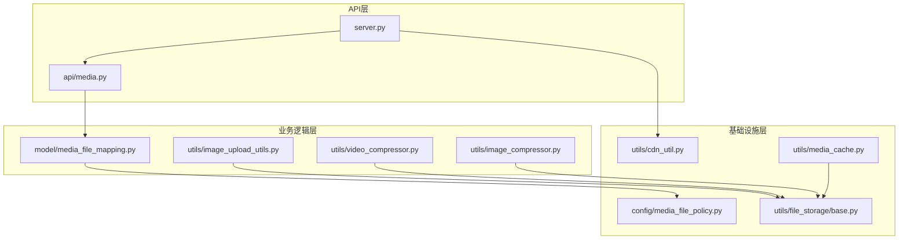
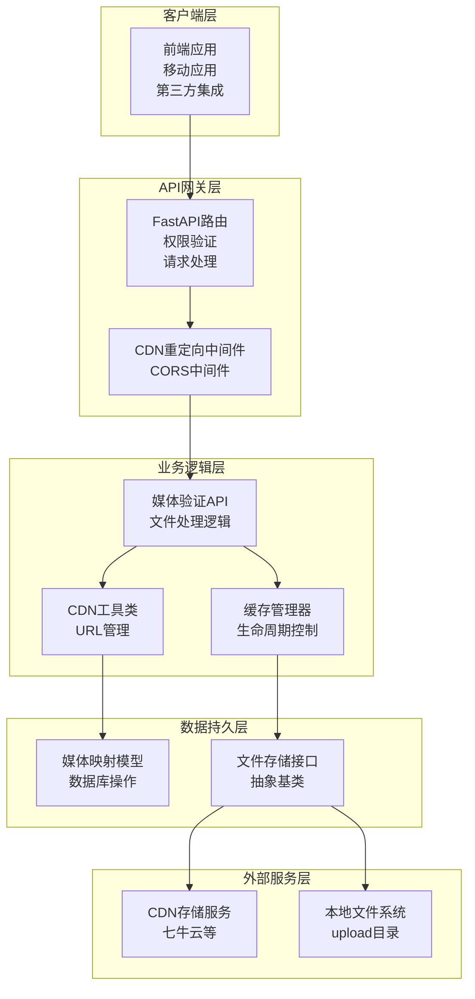
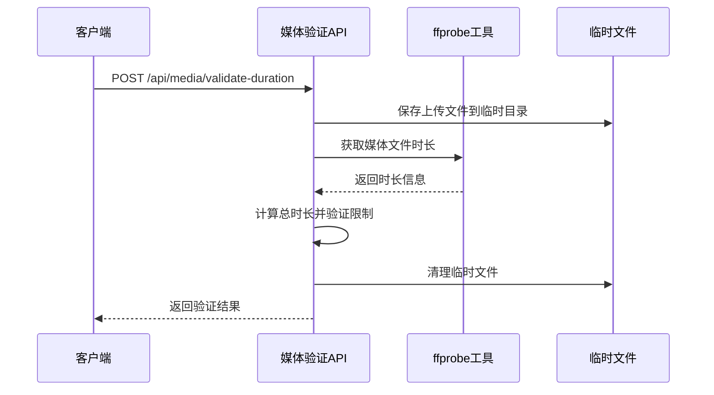
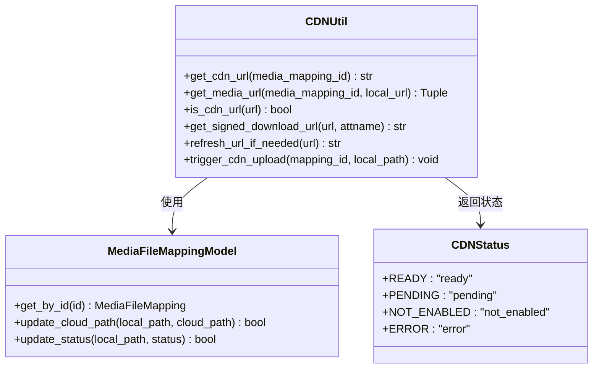
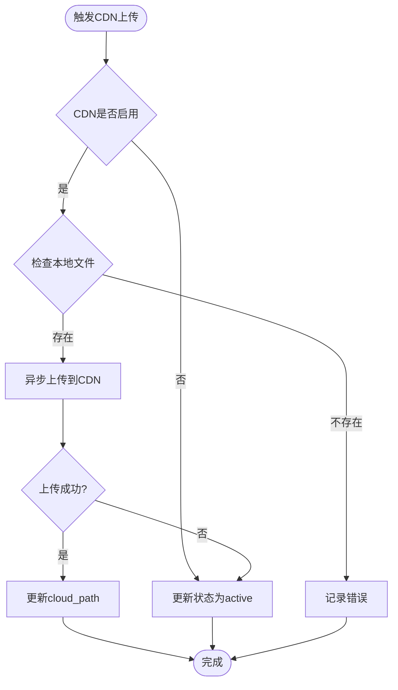
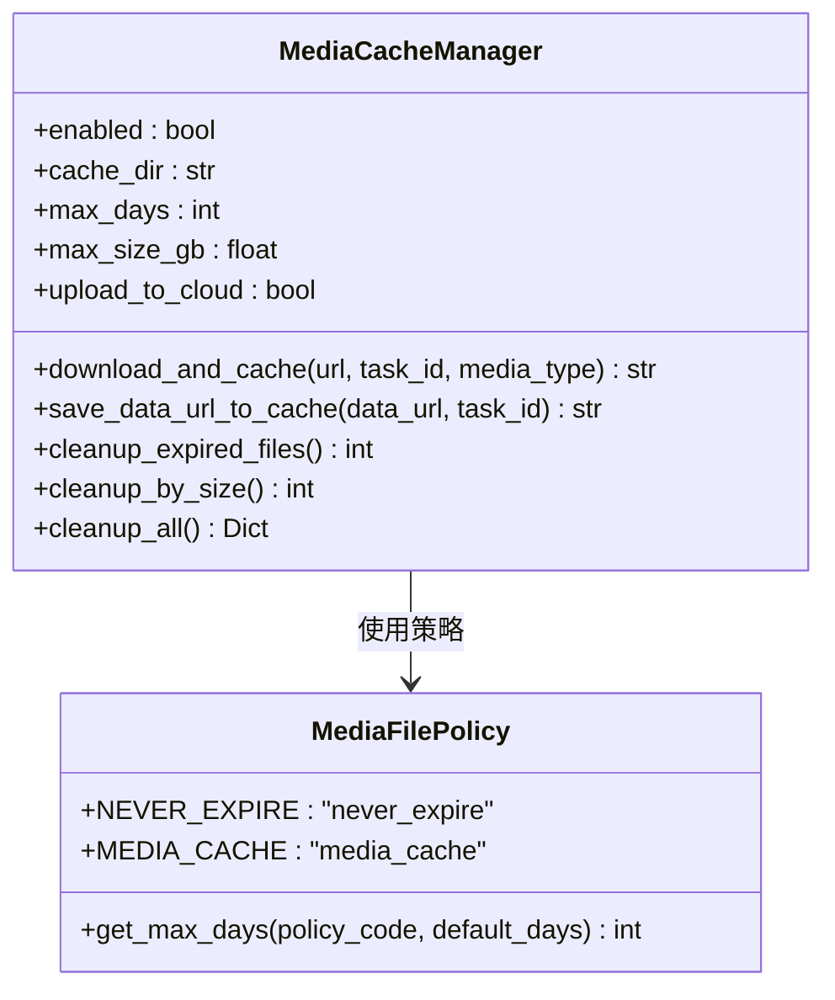
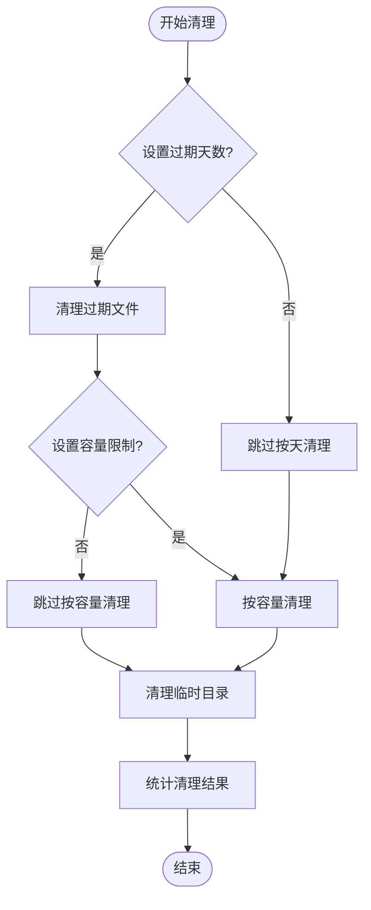
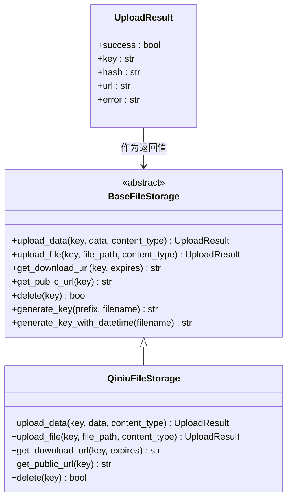
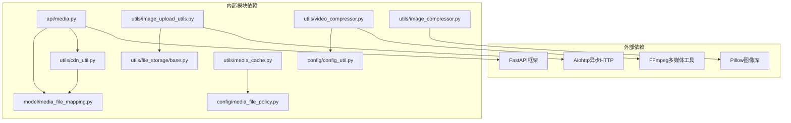

# 媒体API接口

<cite>
**本文档引用的文件**
- [api/media.py](file://api/media.py)
- [model/media_file_mapping.py](file://model/media_file_mapping.py)
- [utils/image_upload_utils.py](file://utils/image_upload_utils.py)
- [utils/video_compressor.py](file://utils/video_compressor.py)
- [utils/image_compressor.py](file://utils/image_compressor.py)
- [utils/cdn_util.py](file://utils/cdn_util.py)
- [utils/media_cache.py](file://utils/media_cache.py)
- [utils/file_storage/base.py](file://utils/file_storage/base.py)
- [server.py](file://server.py)
- [config/media_file_policy.py](file://config/media_file_policy.py)
</cite>

## 目录
1. [简介](#简介)
2. [项目结构](#项目结构)
3. [核心组件](#核心组件)
4. [架构概览](#架构概览)
5. [详细组件分析](#详细组件分析)
6. [依赖分析](#依赖分析)
7. [性能考虑](#性能考虑)
8. [故障排除指南](#故障排除指南)
9. [结论](#结论)

## 简介

本文档详细描述了ComfyUI服务器的媒体API接口系统，涵盖了文件上传、下载、CDN同步、媒体处理等完整的媒体相关功能。该系统提供了安全的文件上传机制、高效的CDN集成策略以及完善的媒体文件生命周期管理。

系统采用模块化设计，支持图片压缩、视频转码、文件分片上传等多种处理接口，具备灵活的存储策略、缓存机制和访问权限控制。同时提供了详细的错误处理策略和并发上传处理方案。

## 项目结构

媒体API系统主要分布在以下几个核心模块中：



**图表来源**
- [api/media.py:1-246](file://api/media.py#L1-L246)
- [model/media_file_mapping.py:1-518](file://model/media_file_mapping.py#L1-L518)

**章节来源**
- [api/media.py:1-246](file://api/media.py#L1-L246)
- [server.py:392-756](file://server.py#L392-L756)

## 核心组件

### 媒体验证API
提供媒体文件时长验证功能，支持音频和视频文件的批量验证。

### CDN工具类
统一处理CDN配置和URL获取逻辑，支持多种CDN状态管理和URL刷新机制。

### 媒体缓存管理
实现生成完成的图片/视频自动缓存到本地，按日期目录组织，并支持超时/容量限制自动清理。

### 文件存储抽象
定义了统一的文件存储接口，支持多种存储后端的抽象化处理。

**章节来源**
- [api/media.py:154-246](file://api/media.py#L154-L246)
- [utils/cdn_util.py:18-303](file://utils/cdn_util.py#L18-L303)
- [utils/media_cache.py:20-656](file://utils/media_cache.py#L20-L656)
- [utils/file_storage/base.py:20-162](file://utils/file_storage/base.py#L20-L162)

## 架构概览

媒体API系统采用分层架构设计，确保各层职责清晰分离：



**图表来源**
- [server.py:392-450](file://server.py#L392-L450)
- [utils/cdn_util.py:18-113](file://utils/cdn_util.py#L18-L113)
- [utils/media_cache.py:20-148](file://utils/media_cache.py#L20-L148)

## 详细组件分析

### 媒体验证API组件

#### 接口定义
媒体验证API提供了一个专门的路由来验证媒体文件的时长限制：



**图表来源**
- [api/media.py:154-246](file://api/media.py#L154-L246)

#### 请求参数
- `audio_files`: 音频文件列表（可选）
- `video_files`: 视频文件列表（可选）  
- `audio_urls`: 逗号分隔的音频URL列表（可选）
- `video_urls`: 逗号分隔的视频URL列表（可选）
- `max_duration_seconds`: 最大允许时长（默认15秒）

#### 响应格式
```json
{
  "code": 0,
  "data": {
    "audio_duration": 5.0,
    "video_duration": 8.0,
    "total_duration": 13.0,
    "max_duration": 15,
    "valid": true,
    "message": "时长验证通过：音频 5.00秒，视频 8.00秒"
  }
}
```

**章节来源**
- [api/media.py:154-246](file://api/media.py#L154-L246)

### CDN工具类组件

#### CDN状态管理
CDN工具类提供了完整的CDN状态管理机制：



**图表来源**
- [utils/cdn_util.py:10-113](file://utils/cdn_util.py#L10-L113)
- [model/media_file_mapping.py:148-168](file://model/media_file_mapping.py#L148-L168)

#### CDN上传流程


**图表来源**
- [utils/cdn_util.py:244-303](file://utils/cdn_util.py#L244-L303)

**章节来源**
- [utils/cdn_util.py:18-303](file://utils/cdn_util.py#L18-L303)

### 媒体缓存管理组件

#### 缓存策略
媒体缓存管理器实现了智能的缓存策略，支持按时间和容量的双重清理机制：



**图表来源**
- [utils/media_cache.py:20-148](file://utils/media_cache.py#L20-L148)
- [config/media_file_policy.py:9-49](file://config/media_file_policy.py#L9-L49)

#### 缓存清理机制


**图表来源**
- [utils/media_cache.py:366-521](file://utils/media_cache.py#L366-L521)

**章节来源**
- [utils/media_cache.py:20-656](file://utils/media_cache.py#L20-L656)
- [config/media_file_policy.py:18-49](file://config/media_file_policy.py#L18-L49)

### 文件存储抽象组件

#### 存储接口设计
文件存储抽象基类定义了统一的存储接口：



**图表来源**
- [utils/file_storage/base.py:10-162](file://utils/file_storage/base.py#L10-L162)

**章节来源**
- [utils/file_storage/base.py:20-162](file://utils/file_storage/base.py#L20-L162)

## 依赖分析

媒体API系统的依赖关系呈现清晰的层次化结构：



**图表来源**
- [api/media.py:5-17](file://api/media.py#L5-L17)
- [utils/video_compressor.py:13-14](file://utils/video_compressor.py#L13-L14)

### 关键依赖关系

1. **API层依赖**: 媒体验证API依赖于媒体映射模型和CDN工具类
2. **工具层依赖**: 图片上传工具依赖于文件存储抽象和网络工具
3. **配置层依赖**: 各组件依赖于配置工具类获取运行时配置
4. **外部工具依赖**: 视频压缩依赖FFmpeg，图片处理依赖Pillow

**章节来源**
- [api/media.py:1-246](file://api/media.py#L1-L246)
- [utils/image_upload_utils.py:16-22](file://utils/image_upload_utils.py#L16-L22)

## 性能考虑

### 并发处理优化

系统采用了多种并发处理策略来提升性能：

1. **异步I/O处理**: 使用aiohttp进行异步HTTP请求，避免阻塞主线程
2. **线程池管理**: CDN上传使用线程池避免阻塞主事件循环
3. **异步文件操作**: 媒体缓存使用异步文件写入减少I/O等待
4. **内存管理**: 图片压缩使用内存缓冲区避免多次磁盘I/O

### 缓存策略优化

1. **智能缓存清理**: 支持按时间和容量双重清理策略
2. **CDN集成优化**: 自动CDN重定向中间件减少服务器带宽占用
3. **文件哈希索引**: 使用local_path_hash快速查找CDN映射

### 资源管理

1. **临时文件清理**: 所有临时文件在使用后自动清理
2. **连接池管理**: HTTP请求使用连接池复用TCP连接
3. **内存使用监控**: 图片处理过程中的内存使用得到有效控制

## 故障排除指南

### 常见问题及解决方案

#### CDN上传失败
- **症状**: CDN上传返回失败状态
- **原因**: CDN配置不完整或网络连接问题
- **解决方案**: 检查CDN配置项，确认网络连通性

#### 媒体文件处理超时
- **症状**: 视频压缩或图片处理超时
- **原因**: 文件过大或系统资源不足
- **解决方案**: 增加超时时间配置，优化系统资源配置

#### 文件存储异常
- **症状**: 文件上传后无法访问
- **原因**: 存储权限问题或路径配置错误
- **解决方案**: 检查存储权限和路径配置

### 错误处理策略

系统实现了多层次的错误处理机制：

1. **HTTP异常处理**: 统一的HTTP异常转换和错误响应
2. **文件操作异常**: 文件读写异常的捕获和处理
3. **外部服务异常**: CDN和存储服务异常的降级处理
4. **配置异常**: 配置错误的验证和提示

**章节来源**
- [api/media.py:74-83](file://api/media.py#L74-L83)
- [utils/cdn_util.py:293-299](file://utils/cdn_util.py#L293-L299)

## 结论

ComfyUI媒体API系统提供了完整的媒体文件处理解决方案，具有以下特点：

1. **模块化设计**: 清晰的分层架构便于维护和扩展
2. **高性能处理**: 异步I/O和并发处理提升系统性能
3. **安全可靠**: 完善的权限控制和错误处理机制
4. **灵活配置**: 支持多种存储策略和CDN集成
5. **智能缓存**: 自动化的缓存管理和清理机制

该系统能够满足各种媒体处理需求，从简单的文件上传下载到复杂的媒体转换和CDN集成，为用户提供了一站式的媒体处理解决方案。