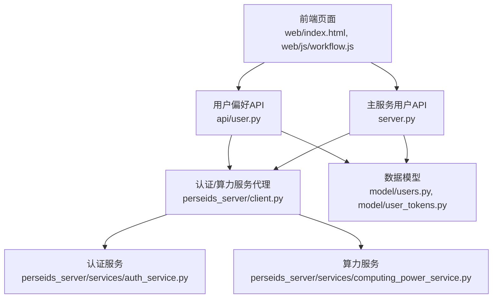
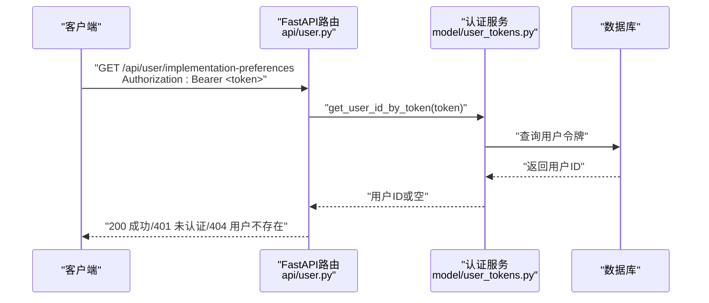
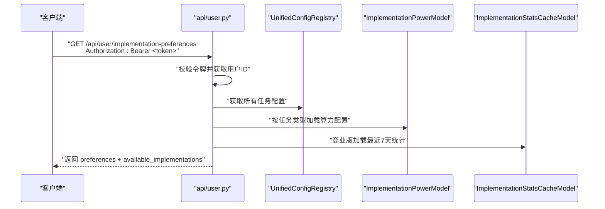
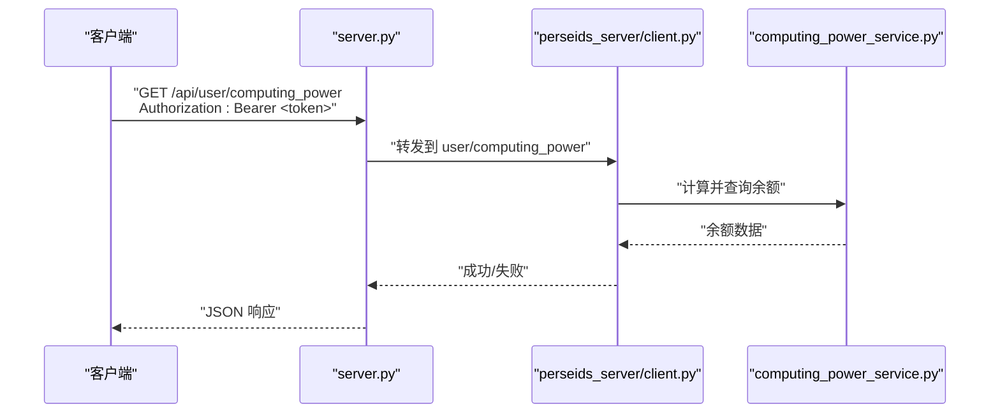
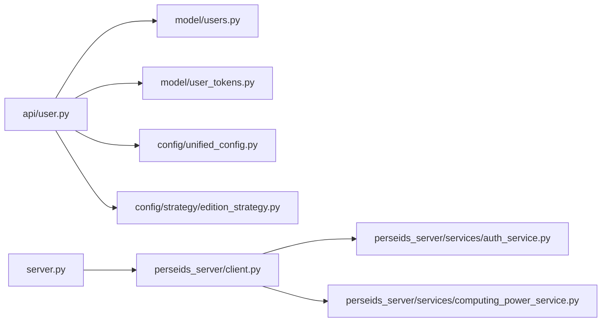

# 用户API接口

<cite>
**本文档引用的文件**
- [api/user.py](file://api/user.py)
- [server.py](file://server.py)
- [perseids_server/client.py](file://perseids_server/client.py)
- [web/index.html](file://web/index.html)
- [web/js/workflow.js](file://web/js/workflow.js)
- [model/users.py](file://model/users.py)
- [model/user_tokens.py](file://model/user_tokens.py)
- [model/computing_power.py](file://model/computing_power.py)
- [model/computing_power_log.py](file://model/computing_power_log.py)
- [alembic/versions/20260323_add_implementation_preferences.py](file://alembic/versions/20260323_add_implementation_preferences.py)
- [alembic/versions/20260401_add_api_token_to_users.py](file://alembic/versions/20260401_add_api_token_to_users.py)
- [alembic/versions/20260401_add_api_token_idx.py](file://alembic/versions/20260401_add_api_token_idx.py)
- [config/strategy/edition_strategy.py](file://config/strategy/edition_strategy.py)
- [config/unified_config.py](file://config/unified_config.py)
- [utils/config_checker.py](file://utils/config_checker.py)
- [perseids_server/services/auth_service.py](file://perseids_server/services/auth_service.py)
- [perseids_server/services/computing_power_service.py](file://perseids_server/services/computing_power_service.py)
</cite>

## 目录
1. [简介](#简介)
2. [项目结构](#项目结构)
3. [核心组件](#核心组件)
4. [架构总览](#架构总览)
5. [详细组件分析](#详细组件分析)
6. [依赖分析](#依赖分析)
7. [性能考虑](#性能考虑)
8. [故障排除指南](#故障排除指南)
9. [结论](#结论)
10. [附录](#附录)

## 简介
本文件面向前端与集成开发者，系统化梳理用户相关API接口，覆盖以下主题：
- 认证机制与权限验证（Bearer Token）
- 用户个人信息与状态管理
- 算力账户与日志查询
- 实现方偏好设置（含演示模式行为）
- 社区版限制与演示数据

文档严格基于仓库现有实现，对每个API端点提供HTTP方法、URL模式、请求参数、响应格式与错误码说明，并给出典型请求/响应示例路径，帮助快速集成。

## 项目结构
用户API主要分布在以下模块：
- 后端FastAPI路由：api/user.py 提供实现方偏好设置相关接口
- 主服务路由：server.py 提供角色、签到、算力余额与日志等接口
- 前端调用：web/index.html、web/js/workflow.js 展示如何携带认证头访问用户接口
- 认证与算力服务：perseids_server 提供统一认证与算力服务代理
- 数据模型：model 下的 users、user_tokens、computing_power、computing_power_log 等
- 配置与策略：config 下的统一配置与版本化迁移脚本

图表来源
- [api/user.py:1-283](file://api/user.py#L1-L283)
- [server.py:2036-2200](file://server.py#L2036-L2200)
- [perseids_server/client.py:40-67](file://perseids_server/client.py#L40-L67)

章节来源
- [api/user.py:1-283](file://api/user.py#L1-L283)
- [server.py:2036-2200](file://server.py#L2036-L2200)
- [perseids_server/client.py:40-67](file://perseids_server/client.py#L40-L67)

## 核心组件
- 认证与权限
  - Bearer Token：所有用户相关接口均要求 Authorization: Bearer <token> 头
  - 令牌校验：通过 UserTokensModel.get_user_id_by_token 校验有效性
  - 权限装饰器：部分主服务端点使用 require_permission 装饰器进行功能权限控制
- 用户偏好设置
  - 获取偏好：/api/user/implementation-preferences
  - 设置偏好：/api/user/implementation-preference（PUT）
  - 清除偏好：/api/user/implementation-preference（DELETE）
  - 演示模式：社区版下不写入数据库，返回演示提示
- 算力账户
  - 查询余额：/api/user/computing_power
  - 查询日志：/api/user/computing_power_logs
  - 前端刷新：web/js/workflow.js 展示了带认证头的调用方式
- 角色与签到
  - 获取角色：/api/user/role
  - 签到：/api/user/checkin
  - 签到状态：/api/user/checkin/status

章节来源
- [api/user.py:30-283](file://api/user.py#L30-L283)
- [server.py:2036-2200](file://server.py#L2036-L2200)
- [web/js/workflow.js:18-40](file://web/js/workflow.js#L18-L40)

## 架构总览
用户API采用“前端直连后端路由 + 服务代理”的架构：
- 前端在请求头中携带 Bearer Token
- FastAPI 路由层进行认证校验与业务处理
- 对于需要跨服务的场景，通过 perseids_server/client.py 将请求转发至认证/算力服务
- 数据持久化依赖 model 层的数据表与迁移脚本

图表来源
- [api/user.py:30-70](file://api/user.py#L30-L70)
- [model/user_tokens.py:140-157](file://model/user_tokens.py#L140-L157)

## 详细组件分析

### 认证与权限验证
- 认证机制
  - 请求头：Authorization: Bearer <token>
  - 校验流程：移除前缀后调用 UserTokensModel.get_user_id_by_token 校验
  - 未提供或无效令牌：返回 401
  - 令牌过期或不存在：返回 401
  - 用户不存在：返回 404
- 权限验证
  - 主服务部分端点使用 require_permission 装饰器进行功能权限控制
  - 登出接口需具备 user:logout 权限

章节来源
- [api/user.py:54-68](file://api/user.py#L54-L68)
- [server.py:2812-2857](file://server.py#L2812-L2857)

### 实现方偏好设置（用户偏好API）
- 接口概览
  - 获取偏好：GET /api/user/implementation-preferences
  - 设置偏好：PUT /api/user/implementation-preference
  - 清除偏好：DELETE /api/user/implementation-preference
- 认证与权限
  - 均需 Authorization: Bearer <token>
  - 令牌无效或过期：401
- 获取偏好（GET /api/user/implementation-preferences）
  - 响应字段
    - code: 0 表示成功
    - data.preferences: 当前激活组的偏好映射（如 task_key -> implementation_name）
    - data.available_implementations: 可选实现方集合（按任务类型分组）
    - data.is_community_edition: 是否为社区版
  - 社区版演示行为
    - 若无可用实现方，返回示例数据（演示模式）
- 设置偏好（PUT /api/user/implementation-preference）
  - 请求体：{ task_key, implementation_name }
  - 商业版：实际保存到数据库
  - 社区版：返回演示提示（is_demo: true），不写入数据库
- 清除偏好（DELETE /api/user/implementation-preference）
  - 查询参数：task_key
  - 商业版：删除对应任务类型的偏好
  - 社区版：返回演示提示（is_demo: true），不写入数据库

图表来源
- [api/user.py:30-220](file://api/user.py#L30-L220)
- [config/unified_config.py](file://config/unified_config.py)
- [model/implementation_power.py](file://model/implementation_power.py)
- [model/implementation_stats_cache.py](file://model/implementation_stats_cache.py)

章节来源
- [api/user.py:30-283](file://api/user.py#L30-L283)
- [config/strategy/edition_strategy.py](file://config/strategy/edition_strategy.py)
- [utils/config_checker.py](file://utils/config_checker.py)

### 算力账户与日志（主服务API）
- 查询余额（GET /api/user/computing_power）
  - 功能：返回当前用户算力余额
  - 认证：Bearer Token
  - 前端调用：web/js/workflow.js 展示了带认证头的调用方式
- 查询日志（GET /api/user/computing_power_logs）
  - 功能：返回算力变动日志
  - 认证：Bearer Token
- 前端交互
  - web/index.html 在用户区域展示“刷新”按钮，点击后调用 /api/user/computing_power
  - 失败时自动跳转到登录页

图表来源
- [server.py:2067-2126](file://server.py#L2067-L2126)
- [perseids_server/client.py:49-61](file://perseids_server/client.py#L49-L61)
- [perseids_server/services/computing_power_service.py](file://perseids_server/services/computing_power_service.py)

章节来源
- [server.py:2067-2126](file://server.py#L2067-L2126)
- [perseids_server/client.py:49-61](file://perseids_server/client.py#L49-L61)
- [web/js/workflow.js:18-40](file://web/js/workflow.js#L18-L40)
- [web/index.html:47-66](file://web/index.html#L47-L66)

### 角色与签到
- 获取角色（GET /api/user/role）
  - 功能：返回当前用户的角色信息
  - 认证：Bearer Token
- 签到（POST /api/user/checkin）
  - 功能：执行签到操作
  - 认证：Bearer Token
- 签到状态（GET /api/user/checkin/status）
  - 功能：查询今日签到状态
  - 认证：Bearer Token

章节来源
- [server.py:2036-2165](file://server.py#L2036-L2165)

### 登出接口
- 登出（POST /api/auth/logout）
  - 功能：调用认证服务执行登出
  - 请求体：{ auth_token }
  - 权限：需要 user:logout 权限
  - 返回：success、message、data

章节来源
- [server.py:2812-2857](file://server.py#L2812-L2857)
- [perseids_server/client.py:115-118](file://perseids_server/client.py#L115-L118)

## 依赖分析
- 组件耦合
  - api/user.py 依赖 model 层（users、user_tokens、implementation_power、implementation_stats_cache）
  - server.py 通过 perseids_server/client.py 代理认证与算力服务
- 外部依赖
  - 统一配置注册中心（UnifiedConfigRegistry）用于枚举任务与实现方
  - 版本化迁移脚本确保数据库结构（用户偏好、API Token索引等）

图表来源
- [api/user.py:12-18](file://api/user.py#L12-L18)
- [server.py:2036-2200](file://server.py#L2036-L2200)
- [perseids_server/client.py:40-67](file://perseids_server/client.py#L40-L67)

章节来源
- [api/user.py:12-18](file://api/user.py#L12-L18)
- [server.py:2036-2200](file://server.py#L2036-L2200)
- [perseids_server/client.py:40-67](file://perseids_server/client.py#L40-L67)

## 性能考虑
- 社区版统计信息加载
  - 商业版会一次性加载最近7天的实现方统计（成功率、平均耗时、总量），以减少前端多次请求
  - 社区版不加载统计，直接返回示例数据
- 算力配置回退策略
  - 优先从数据库读取固定算力；若无则选择最小持续时间的算力；最后回退到代码默认值
- 前端刷新
  - 前端在点击“刷新”按钮时才发起 /api/user/computing_power 请求，避免频繁轮询

章节来源
- [api/user.py:77-87](file://api/user.py#L77-L87)
- [api/user.py:128-148](file://api/user.py#L128-L148)
- [web/js/workflow.js:18-40](file://web/js/workflow.js#L18-L40)

## 故障排除指南
- 401 未认证
  - 检查请求头 Authorization: Bearer <token> 是否正确传递
  - 确认 token 未过期，且在 model/user_tokens.py 中存在有效记录
- 404 用户不存在
  - 用户ID通过令牌解析成功，但 users 表中无对应记录
- 400/403 权限不足
  - 主服务端点可能需要特定功能权限（如 user:logout）
- 社区版演示行为
  - 设置/清除偏好返回 is_demo: true，表示不写入数据库
- 前端跳转登录
  - 前端在收到 401/403 时会自动跳转到登录页

章节来源
- [api/user.py:54-68](file://api/user.py#L54-L68)
- [server.py:2812-2857](file://server.py#L2812-L2857)
- [web/js/workflow.js:37-40](file://web/js/workflow.js#L37-L40)

## 结论
- 用户API围绕“Bearer Token 认证 + FastAPI 路由 + 服务代理”的架构设计，清晰分离了用户偏好、算力账户与通用认证/算力服务
- 社区版通过演示数据与 is_demo 标识明确区分了真实持久化与演示行为
- 前端通过统一的认证头与错误处理流程，提供了良好的用户体验

## 附录

### API 端点一览与规范

- 获取实现方偏好
  - 方法：GET
  - URL：/api/user/implementation-preferences
  - 认证：Bearer Token
  - 响应：code、data.preferences、data.available_implementations、data.is_community_edition
  - 示例：[响应示例路径:34-51](file://api/user.py#L34-L51)

- 设置实现方偏好
  - 方法：PUT
  - URL：/api/user/implementation-preference
  - 认证：Bearer Token
  - 请求体：{ task_key, implementation_name }
  - 响应：code、message、is_demo（社区版）
  - 示例：[请求示例路径:224-227](file://api/user.py#L224-L227)

- 清除实现方偏好
  - 方法：DELETE
  - URL：/api/user/implementation-preference
  - 认证：Bearer Token
  - 查询参数：task_key
  - 响应：code、message、is_demo（社区版）
  - 示例：[请求示例路径:255-257](file://api/user.py#L255-L257)

- 查询算力余额
  - 方法：GET
  - URL：/api/user/computing_power
  - 认证：Bearer Token
  - 响应：success、data.computing_power
  - 示例：[前端调用示例路径:30-35](file://web/js/workflow.js#L30-L35)

- 查询算力日志
  - 方法：GET
  - URL：/api/user/computing_power_logs
  - 认证：Bearer Token
  - 响应：success、data.logs

- 获取角色
  - 方法：GET
  - URL：/api/user/role
  - 认证：Bearer Token
  - 响应：success、data.role

- 签到
  - 方法：POST
  - URL：/api/user/checkin
  - 认证：Bearer Token
  - 响应：success、data.reward

- 签到状态
  - 方法：GET
  - URL：/api/user/checkin/status
  - 认证：Bearer Token
  - 响应：success、data.checked_in_today

- 登出
  - 方法：POST
  - URL：/api/auth/logout
  - 权限：user:logout
  - 请求体：{ auth_token }
  - 响应：success、message

### 数据模型与迁移要点
- 用户偏好与激活组
  - users 表新增列：implementation_preferences（JSON）、active_preference_group（整数）
  - 迁移脚本：[迁移脚本:19-37](file://alembic/versions/20260323_add_implementation_preferences.py#L19-L37)
- API Token
  - users 表新增列：api_token（字符串），并建立唯一索引 idx_api_token
  - 迁移脚本：[迁移脚本:19-26](file://alembic/versions/20260401_add_api_token_to_users.py#L19-L26)，[索引:21-31](file://alembic/versions/20260401_add_api_token_idx.py#L21-L31)

章节来源
- [alembic/versions/20260323_add_implementation_preferences.py:19-37](file://alembic/versions/20260323_add_implementation_preferences.py#L19-L37)
- [alembic/versions/20260401_add_api_token_to_users.py:19-26](file://alembic/versions/20260401_add_api_token_to_users.py#L19-L26)
- [alembic/versions/20260401_add_api_token_idx.py:21-31](file://alembic/versions/20260401_add_api_token_idx.py#L21-L31)