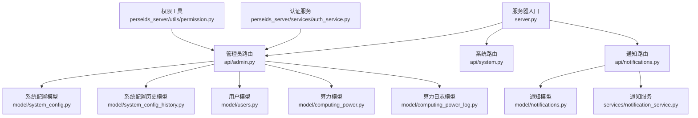
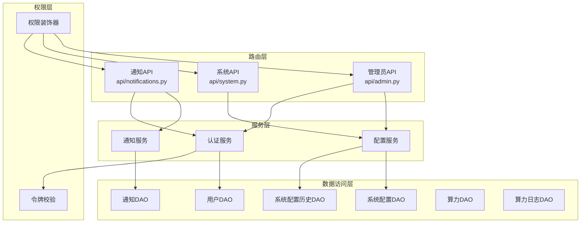
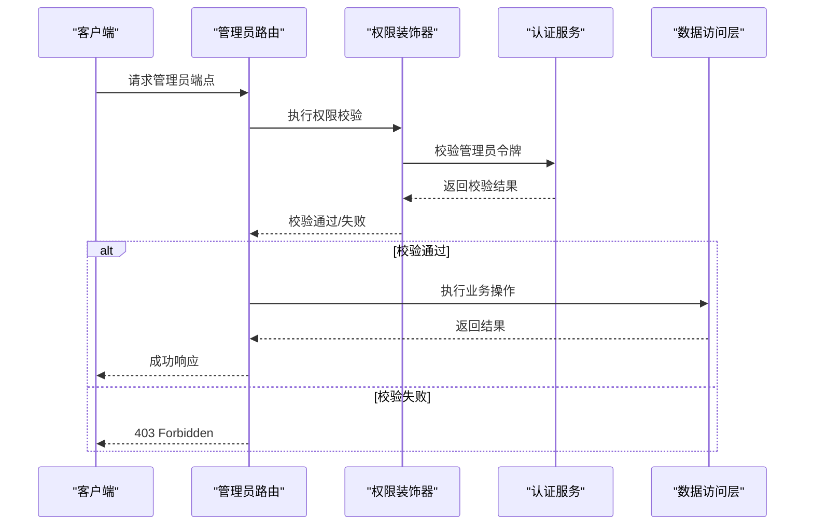
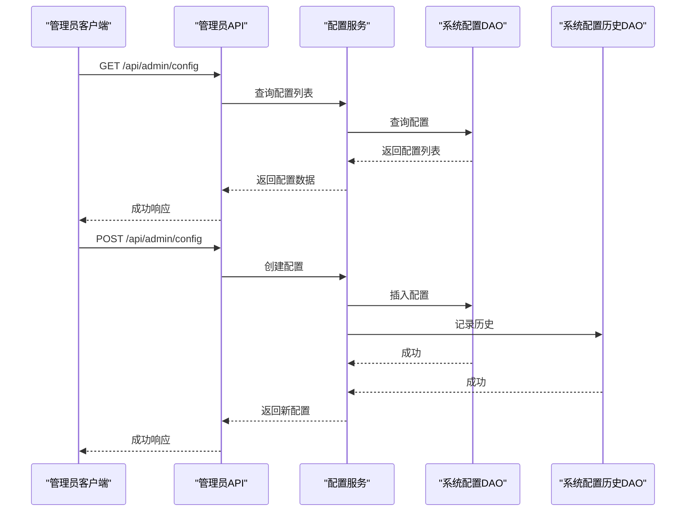
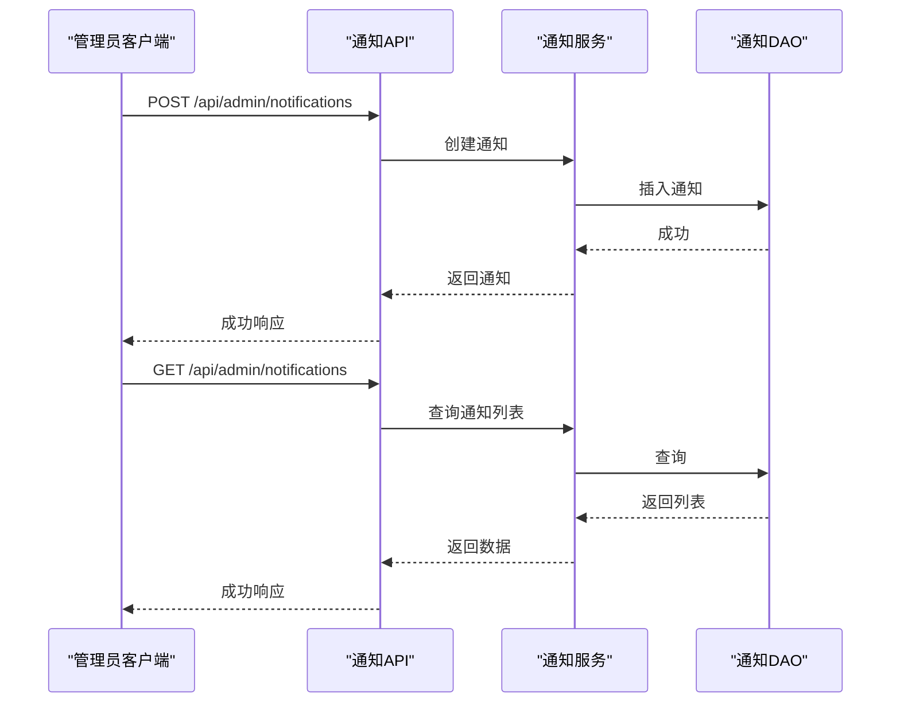
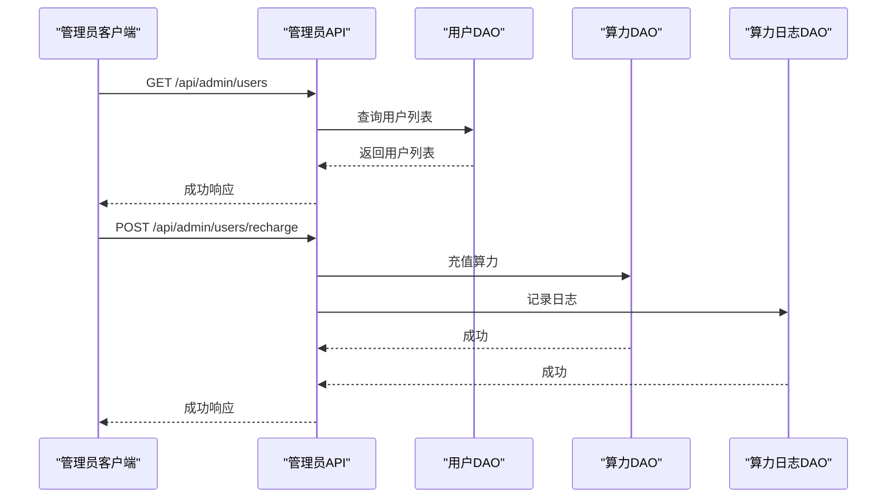
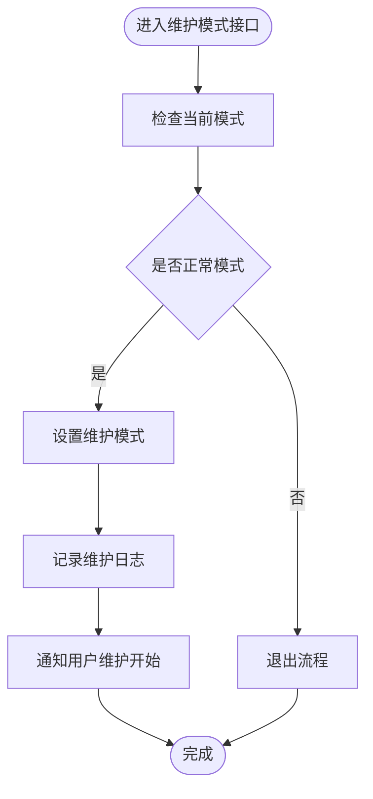
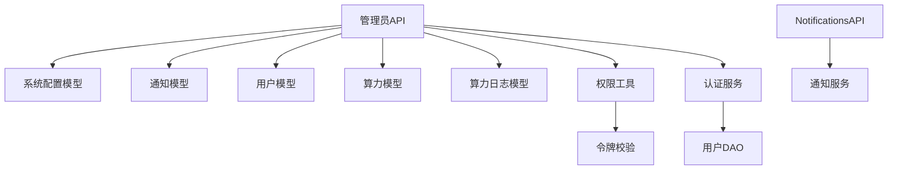

# 管理员API接口

<cite>
**本文档引用的文件**
- [server.py](file://server.py)
- [admin.py](file://api/admin.py)
- [system.py](file://api/system.py)
- [notifications.py](file://api/notifications.py)
- [system_config.py](file://model/system_config.py)
- [system_config_history.py](file://model/system_config_history.py)
- [notifications.py](file://model/notifications.py)
- [computing_power.py](file://model/computing_power.py)
- [computing_power_log.py](file://model/computing_power_log.py)
- [users.py](file://model/users.py)
- [permission.py](file://perseids_server/utils/permission.py)
- [auth_service.py](file://perseids_server/services/auth_service.py)
- [notification_service.py](file://services/notification_service.py)
</cite>

## 目录
1. [简介](#简介)
2. [项目结构](#项目结构)
3. [核心组件](#核心组件)
4. [架构总览](#架构总览)
5. [详细组件分析](#详细组件分析)
6. [依赖关系分析](#依赖关系分析)
7. [性能考虑](#性能考虑)
8. [故障排除指南](#故障排除指南)
9. [结论](#结论)
10. [附录](#附录)

## 简介
本文件为管理员API接口的权威文档，覆盖系统配置管理、用户管理、算力统计、通知管理等管理员功能。文档提供每个API端点的HTTP方法、URL模式、请求参数、响应格式与权限要求，并重点说明管理员权限验证机制、批量操作接口以及系统监控功能。同时给出最佳实践与安全注意事项，并涵盖系统维护模式下的特殊接口与紧急处理功能。

## 项目结构
管理员API通过独立路由模块集中管理，由服务器入口统一注册。核心模块包括：
- 系统配置管理：提供系统配置的增删改查与历史版本管理
- 通知管理：提供通知的创建、查询、更新与删除
- 用户管理与算力统计：提供用户信息查询、算力充值与统计分析
- 权限控制：基于装饰器与服务层实现管理员权限校验

**图表来源**
- [server.py:70-90](file://server.py#L70-L90)
- [admin.py:1-50](file://api/admin.py#L1-L50)
- [system.py:1-50](file://api/system.py#L1-L50)
- [notifications.py:1-50](file://api/notifications.py#L1-L50)

**章节来源**
- [server.py:70-90](file://server.py#L70-L90)
- [admin.py:1-50](file://api/admin.py#L1-L50)
- [system.py:1-50](file://api/system.py#L1-L50)
- [notifications.py:1-50](file://api/notifications.py#L1-L50)

## 核心组件
- 管理员路由模块：集中定义管理员相关API端点，负责参数解析、权限校验与业务调用分发
- 系统配置模块：提供系统配置的CRUD与历史版本管理，支持批量导入导出与版本回滚
- 通知模块：提供通知的全生命周期管理，支持模板化通知与批量发送
- 用户与算力模块：提供用户信息查询、算力充值与统计分析接口
- 权限与认证：通过装饰器与服务层实现管理员权限验证与会话管理

**章节来源**
- [admin.py:1-120](file://api/admin.py#L1-L120)
- [system_config.py:1-120](file://model/system_config.py#L1-L120)
- [system_config_history.py:1-120](file://model/system_config_history.py#L1-L120)
- [notifications.py:1-120](file://model/notifications.py#L1-L120)
- [computing_power.py:1-120](file://model/computing_power.py#L1-L120)
- [computing_power_log.py:1-120](file://model/computing_power_log.py#L1-L120)
- [users.py:1-120](file://model/users.py#L1-L120)
- [permission.py:1-120](file://perseids_server/utils/permission.py#L1-L120)
- [auth_service.py:1-120](file://perseids_server/services/auth_service.py#L1-L120)

## 架构总览
管理员API采用分层架构：路由层负责HTTP协议与参数解析；服务层封装业务逻辑；数据访问层通过ORM模型与数据库交互；权限层在路由与服务层之间进行统一校验。

**图表来源**
- [admin.py:1-120](file://api/admin.py#L1-L120)
- [system.py:1-120](file://api/system.py#L1-L120)
- [notifications.py:1-120](file://api/notifications.py#L1-L120)
- [permission.py:1-120](file://perseids_server/utils/permission.py#L1-L120)
- [auth_service.py:1-120](file://perseids_server/services/auth_service.py#L1-L120)

## 详细组件分析

### 管理员权限验证机制
- 装饰器校验：通过权限装饰器对管理员端点进行统一校验，确保仅具备管理员权限的用户可访问
- 令牌校验：结合认证服务与令牌校验工具，验证管理员会话有效性
- 最小权限原则：每个端点明确声明所需权限码，避免过度授权

**图表来源**
- [permission.py:1-120](file://perseids_server/utils/permission.py#L1-L120)
- [auth_service.py:1-120](file://perseids_server/services/auth_service.py#L1-L120)
- [admin.py:1-120](file://api/admin.py#L1-L120)

**章节来源**
- [permission.py:1-120](file://perseids_server/utils/permission.py#L1-L120)
- [auth_service.py:1-120](file://perseids_server/services/auth_service.py#L1-L120)
- [admin.py:1-120](file://api/admin.py#L1-L120)

### 系统配置管理接口
- 端点：/api/admin/config
- 方法：GET（查询）、POST（新增）、PUT（修改）、DELETE（删除）
- 权限：管理员
- 功能：提供系统配置的增删改查与历史版本管理，支持批量导入导出与版本回滚

**图表来源**
- [admin.py:1-120](file://api/admin.py#L1-L120)
- [system_config.py:1-120](file://model/system_config.py#L1-L120)
- [system_config_history.py:1-120](file://model/system_config_history.py#L1-L120)

**章节来源**
- [admin.py:1-120](file://api/admin.py#L1-L120)
- [system_config.py:1-120](file://model/system_config.py#L1-L120)
- [system_config_history.py:1-120](file://model/system_config_history.py#L1-L120)

### 通知管理系统接口
- 端点：/api/admin/notifications
- 方法：GET（查询）、POST（创建）、PUT（更新）、DELETE（删除）
- 权限：管理员
- 功能：提供通知的创建、查询、更新与删除，支持批量操作与模板化通知

**图表来源**
- [notifications.py:1-120](file://api/notifications.py#L1-L120)
- [notification_service.py:1-120](file://services/notification_service.py#L1-L120)
- [notifications.py:1-120](file://model/notifications.py#L1-L120)

**章节来源**
- [notifications.py:1-120](file://api/notifications.py#L1-L120)
- [notification_service.py:1-120](file://services/notification_service.py#L1-L120)
- [notifications.py:1-120](file://model/notifications.py#L1-L120)

### 用户管理与算力统计接口
- 端点：/api/admin/users
- 方法：GET（查询用户列表）、GET（查询用户详情）、PUT（更新用户信息）、POST（充值算力）
- 权限：管理员
- 功能：提供用户信息查询、算力充值与统计分析接口

**图表来源**
- [admin.py:1-120](file://api/admin.py#L1-L120)
- [users.py:1-120](file://model/users.py#L1-L120)
- [computing_power.py:1-120](file://model/computing_power.py#L1-L120)
- [computing_power_log.py:1-120](file://model/computing_power_log.py#L1-L120)

**章节来源**
- [admin.py:1-120](file://api/admin.py#L1-L120)
- [users.py:1-120](file://model/users.py#L1-L120)
- [computing_power.py:1-120](file://model/computing_power.py#L1-L120)
- [computing_power_log.py:1-120](file://model/computing_power_log.py#L1-L120)

### 系统监控与维护模式接口
- 端点：/api/admin/system/monitoring
- 方法：GET（获取系统监控指标）、POST（设置维护模式）
- 权限：管理员
- 功能：提供系统运行状态监控与维护模式开关，支持紧急停机与恢复

**图表来源**
- [system.py:1-120](file://api/system.py#L1-L120)

**章节来源**
- [system.py:1-120](file://api/system.py#L1-L120)

## 依赖关系分析
管理员API依赖于多个核心模块与服务，形成清晰的依赖层次：

**图表来源**
- [admin.py:1-120](file://api/admin.py#L1-L120)
- [notifications.py:1-120](file://api/notifications.py#L1-L120)
- [permission.py:1-120](file://perseids_server/utils/permission.py#L1-L120)
- [auth_service.py:1-120](file://perseids_server/services/auth_service.py#L1-L120)

**章节来源**
- [admin.py:1-120](file://api/admin.py#L1-L120)
- [notifications.py:1-120](file://api/notifications.py#L1-L120)
- [permission.py:1-120](file://perseids_server/utils/permission.py#L1-L120)
- [auth_service.py:1-120](file://perseids_server/services/auth_service.py#L1-L120)

## 性能考虑
- 批量操作优化：系统配置与通知管理支持批量导入导出，减少网络往返与数据库压力
- 分页查询：用户列表与算力日志查询支持分页，避免一次性加载大量数据
- 缓存策略：系统监控指标采用缓存机制，降低频繁查询的数据库开销
- 异步处理：通知发送与算力充值采用异步队列，提升用户体验与系统吞吐量

## 故障排除指南
- 权限错误：若返回403，请确认管理员令牌有效且具备相应权限码
- 参数校验失败：检查请求参数格式与必填字段，确保符合接口规范
- 数据库异常：查看系统日志中的数据库连接与事务异常信息
- 通知发送失败：检查通知服务配置与第三方平台状态

**章节来源**
- [permission.py:1-120](file://perseids_server/utils/permission.py#L1-L120)
- [auth_service.py:1-120](file://perseids_server/services/auth_service.py#L1-L120)
- [notification_service.py:1-120](file://services/notification_service.py#L1-L120)

## 结论
管理员API提供了完善的系统配置管理、用户管理、算力统计与通知管理能力，通过严格的权限控制与服务化架构确保了系统的安全性与可维护性。建议在生产环境中启用最小权限原则与审计日志，定期审查权限配置与接口使用情况。

## 附录
- 最佳实践：使用批量操作减少API调用次数；为敏感操作添加二次确认；定期备份系统配置与通知模板
- 安全注意事项：严格管理管理员令牌；限制API访问频率；对敏感字段进行脱敏处理
- 紧急处理：维护模式下暂停非必要服务；通过通知系统及时告知用户；保留完整的操作日志便于追溯