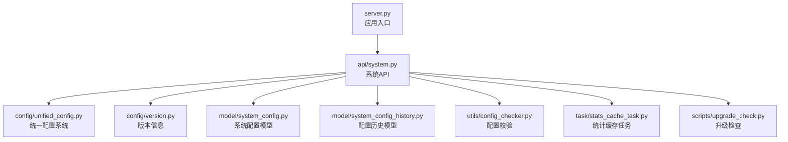
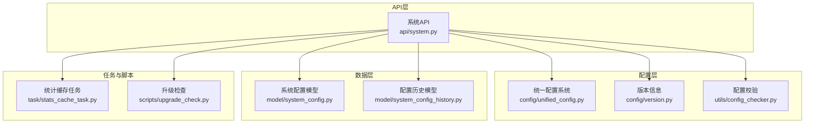
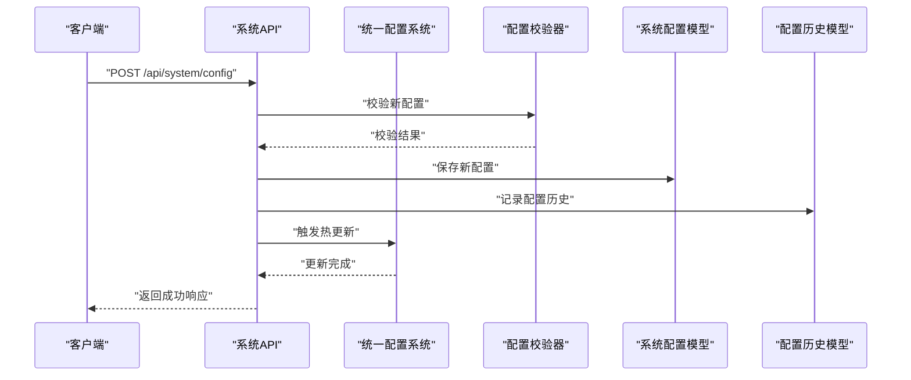
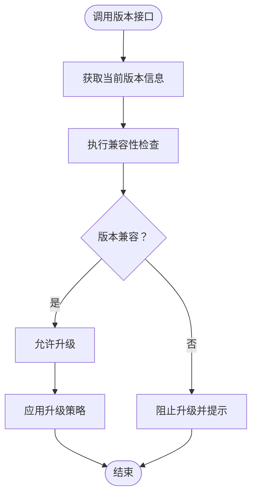
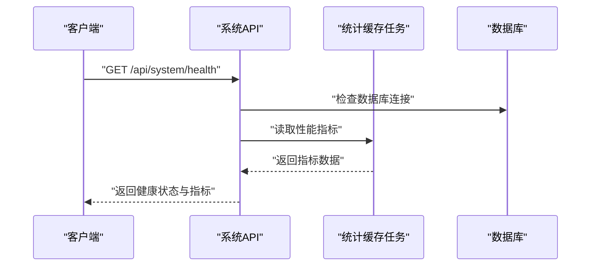
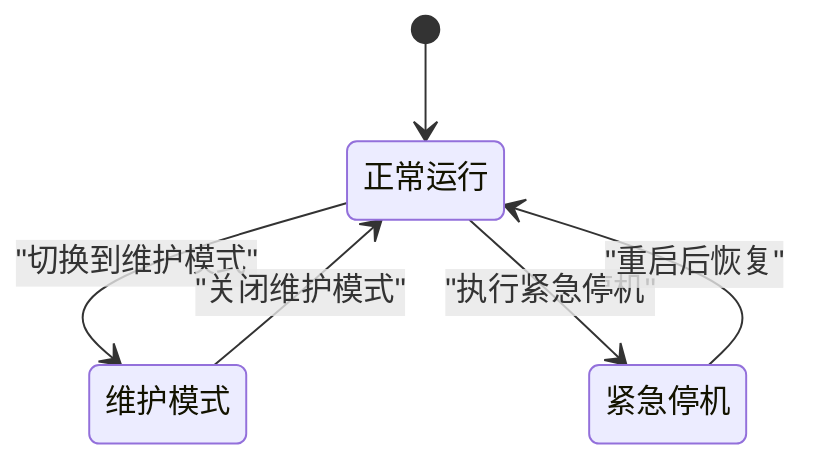
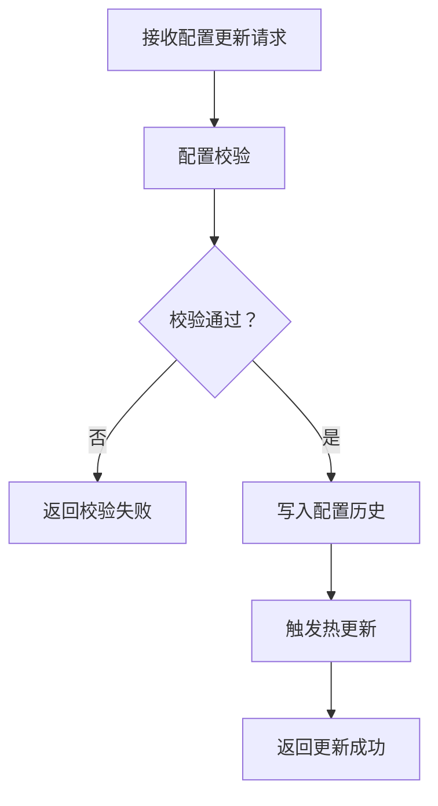
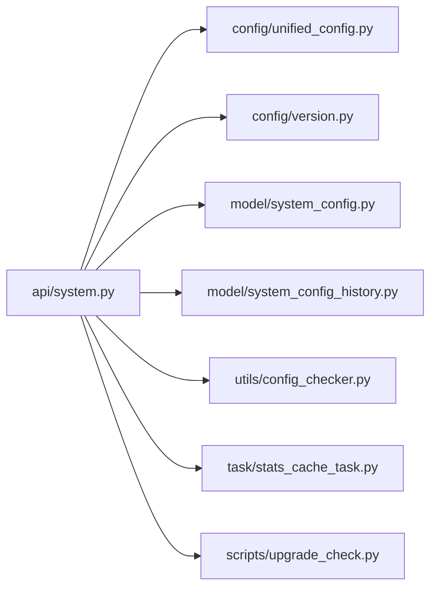

# 系统API接口

<cite>
**本文档引用的文件**
- [server.py](file://server.py)
- [api/system.py](file://api/system.py)
- [config/unified_config.py](file://config/unified_config.py)
- [config/version.py](file://config/version.py)
- [model/system_config.py](file://model/system_config.py)
- [model/system_config_history.py](file://model/system_config_history.py)
- [utils/config_checker.py](file://utils/config_checker.py)
- [docs/backend/unified_config_system.md](file://docs/backend/unified_config_system.md)
- [docs/upgrade/auto_upgrade_design.md](file://docs/upgrade/auto_upgrade_design.md)
- [scripts/upgrade_check.py](file://scripts/upgrade_check.py)
- [services/checkin_service.py](file://services/checkin_service.py)
- [task/stats_cache_task.py](file://task/stats_cache_task.py)
- [auto_test/e2e/test_admin_api.py](file://auto_test/e2e/test_admin_api.py)
</cite>

## 目录
1. [简介](#简介)
2. [项目结构](#项目结构)
3. [核心组件](#核心组件)
4. [架构总览](#架构总览)
5. [详细组件分析](#详细组件分析)
6. [依赖关系分析](#依赖关系分析)
7. [性能考虑](#性能考虑)
8. [故障排除指南](#故障排除指南)
9. [结论](#结论)
10. [附录](#附录)

## 简介
本文件为系统API接口的权威文档，覆盖系统配置、版本管理、健康检查、统计信息等系统级接口。重点阐述统一配置系统的动态更新机制、系统版本检测与兼容性检查、运行状态监控与性能指标获取、故障诊断接口、维护模式切换与紧急停机功能，并提供配置热更新实现原理与系统自检流程说明。文档同时给出系统状态查询示例与配置更新最佳实践。

## 项目结构
系统API主要由后端服务器入口与API模块组成，系统配置通过统一配置系统进行集中管理，版本信息与升级策略在配置模块中定义，模型层提供系统配置与历史记录的数据持久化支持。

**图表来源**
- [server.py](file://server.py)
- [api/system.py](file://api/system.py)
- [config/unified_config.py](file://config/unified_config.py)
- [config/version.py](file://config/version.py)
- [model/system_config.py](file://model/system_config.py)
- [model/system_config_history.py](file://model/system_config_history.py)
- [utils/config_checker.py](file://utils/config_checker.py)
- [task/stats_cache_task.py](file://task/stats_cache_task.py)
- [scripts/upgrade_check.py](file://scripts/upgrade_check.py)

**章节来源**
- [server.py](file://server.py)
- [api/system.py](file://api/system.py)

## 核心组件
- 系统API模块：提供系统级接口，包括配置管理、版本信息、健康检查、统计查询、维护模式控制等。
- 统一配置系统：负责配置的加载、校验、热更新与历史记录。
- 版本与升级：提供版本号、兼容性检查与自动升级策略。
- 模型层：系统配置与历史记录的数据库映射。
- 工具与任务：配置校验、统计缓存、升级检查等辅助能力。

**章节来源**
- [api/system.py](file://api/system.py)
- [config/unified_config.py](file://config/unified_config.py)
- [config/version.py](file://config/version.py)
- [model/system_config.py](file://model/system_config.py)
- [model/system_config_history.py](file://model/system_config_history.py)
- [utils/config_checker.py](file://utils/config_checker.py)
- [task/stats_cache_task.py](file://task/stats_cache_task.py)
- [scripts/upgrade_check.py](file://scripts/upgrade_check.py)

## 架构总览
系统API采用模块化设计，通过统一配置系统实现配置的集中管理与动态更新；版本信息与升级策略确保系统在新旧版本间的平滑过渡；统计缓存任务提供性能指标与运行状态数据；配置校验保障配置变更的安全性与一致性。

**图表来源**
- [api/system.py](file://api/system.py)
- [config/unified_config.py](file://config/unified_config.py)
- [config/version.py](file://config/version.py)
- [utils/config_checker.py](file://utils/config_checker.py)
- [model/system_config.py](file://model/system_config.py)
- [model/system_config_history.py](file://model/system_config_history.py)
- [task/stats_cache_task.py](file://task/stats_cache_task.py)
- [scripts/upgrade_check.py](file://scripts/upgrade_check.py)

## 详细组件分析

### 系统配置接口
- 接口目标：提供系统配置的查询、更新与历史回溯能力，支持动态热更新与安全校验。
- 关键流程：
  - 配置加载：从统一配置系统加载当前配置。
  - 配置校验：通过配置校验器对新配置进行合法性与兼容性检查。
  - 历史记录：将变更写入配置历史表，支持回滚与审计。
  - 热更新：在验证通过后触发配置热更新，使新配置生效。

**图表来源**
- [api/system.py](file://api/system.py)
- [config/unified_config.py](file://config/unified_config.py)
- [utils/config_checker.py](file://utils/config_checker.py)
- [model/system_config.py](file://model/system_config.py)
- [model/system_config_history.py](file://model/system_config_history.py)

**章节来源**
- [api/system.py](file://api/system.py)
- [config/unified_config.py](file://config/unified_config.py)
- [utils/config_checker.py](file://utils/config_checker.py)
- [model/system_config.py](file://model/system_config.py)
- [model/system_config_history.py](file://model/system_config_history.py)

### 版本管理与兼容性检查
- 接口目标：提供系统版本查询与兼容性检查，支持自动升级策略与版本回退。
- 关键流程：
  - 版本查询：返回当前系统版本号与构建信息。
  - 兼容性检查：根据版本规则判断新旧版本间的兼容性。
  - 升级策略：依据策略文件与脚本执行自动升级或提示用户操作。

**图表来源**
- [config/version.py](file://config/version.py)
- [docs/upgrade/auto_upgrade_design.md](file://docs/upgrade/auto_upgrade_design.md)
- [scripts/upgrade_check.py](file://scripts/upgrade_check.py)

**章节来源**
- [config/version.py](file://config/version.py)
- [docs/upgrade/auto_upgrade_design.md](file://docs/upgrade/auto_upgrade_design.md)
- [scripts/upgrade_check.py](file://scripts/upgrade_check.py)

### 健康检查与运行状态监控
- 接口目标：提供系统健康检查、运行状态查询与性能指标获取。
- 关键流程：
  - 健康检查：检查数据库连接、关键服务可用性与资源使用情况。
  - 运行状态：返回系统运行时状态（如维护模式、紧急停机状态）。
  - 性能指标：聚合统计缓存中的指标，提供QPS、错误率、响应时间等。

**图表来源**
- [api/system.py](file://api/system.py)
- [task/stats_cache_task.py](file://task/stats_cache_task.py)

**章节来源**
- [api/system.py](file://api/system.py)
- [task/stats_cache_task.py](file://task/stats_cache_task.py)

### 故障诊断接口
- 接口目标：提供系统故障诊断能力，包括日志查询、错误码解析与诊断建议。
- 关键流程：
  - 日志查询：按时间范围与级别过滤系统日志。
  - 错误码解析：将错误码映射到可读的诊断信息。
  - 诊断建议：基于错误类型提供修复建议与处理步骤。

**章节来源**
- [api/system.py](file://api/system.py)

### 维护模式与紧急停机
- 接口目标：支持切换系统维护模式与紧急停机功能，保障系统在异常情况下的可控关闭。
- 关键流程：
  - 维护模式：开启/关闭维护模式，影响非管理员用户的访问权限。
  - 紧急停机：立即停止接受新请求，等待正在执行的任务完成后退出。

**图表来源**
- [api/system.py](file://api/system.py)

**章节来源**
- [api/system.py](file://api/system.py)

### 配置热更新实现原理
- 实现原理：统一配置系统在配置校验通过后，触发配置热更新，使新配置在不重启服务的情况下生效。配置历史记录用于审计与回滚。
- 关键要点：
  - 安全校验：在更新前进行配置合法性与兼容性检查。
  - 历史记录：每次更新都会写入配置历史，便于追踪与回滚。
  - 平滑过渡：通过统一配置系统实现无感热更新。

**图表来源**
- [config/unified_config.py](file://config/unified_config.py)
- [utils/config_checker.py](file://utils/config_checker.py)
- [model/system_config_history.py](file://model/system_config_history.py)

**章节来源**
- [config/unified_config.py](file://config/unified_config.py)
- [utils/config_checker.py](file://utils/config_checker.py)
- [model/system_config_history.py](file://model/system_config_history.py)

### 系统自检流程
- 自检内容：数据库连通性、配置完整性、关键服务可用性、资源使用情况。
- 执行方式：通过健康检查接口或定时任务触发自检，生成自检报告。
- 报告输出：包含各项检查结果、异常项与修复建议。

**章节来源**
- [api/system.py](file://api/system.py)
- [task/stats_cache_task.py](file://task/stats_cache_task.py)

## 依赖关系分析
系统API接口与统一配置系统、版本信息、模型层、工具与任务之间存在紧密耦合关系，整体依赖如下：

**图表来源**
- [api/system.py](file://api/system.py)
- [config/unified_config.py](file://config/unified_config.py)
- [config/version.py](file://config/version.py)
- [model/system_config.py](file://model/system_config.py)
- [model/system_config_history.py](file://model/system_config_history.py)
- [utils/config_checker.py](file://utils/config_checker.py)
- [task/stats_cache_task.py](file://task/stats_cache_task.py)
- [scripts/upgrade_check.py](file://scripts/upgrade_check.py)

**章节来源**
- [api/system.py](file://api/system.py)
- [config/unified_config.py](file://config/unified_config.py)
- [config/version.py](file://config/version.py)
- [model/system_config.py](file://model/system_config.py)
- [model/system_config_history.py](file://model/system_config_history.py)
- [utils/config_checker.py](file://utils/config_checker.py)
- [task/stats_cache_task.py](file://task/stats_cache_task.py)
- [scripts/upgrade_check.py](file://scripts/upgrade_check.py)

## 性能考虑
- 配置热更新：尽量减少热更新频率，批量合并配置变更以降低系统开销。
- 统计缓存：合理设置统计缓存任务的执行周期，避免频繁读写数据库。
- 健康检查：健康检查应轻量化，避免对生产环境造成额外压力。
- 版本升级：升级策略应考虑灰度发布与回滚机制，减少升级对系统的影响。

## 故障排除指南
- 配置更新失败：检查配置校验器返回的错误信息，确认配置格式与值是否符合要求。
- 健康检查异常：检查数据库连接、关键服务状态与资源使用情况，定位问题根因。
- 统计指标缺失：确认统计缓存任务是否正常运行，检查缓存数据是否过期。
- 升级失败：查看升级脚本执行日志，确认版本兼容性与依赖项是否满足要求。

**章节来源**
- [utils/config_checker.py](file://utils/config_checker.py)
- [task/stats_cache_task.py](file://task/stats_cache_task.py)
- [scripts/upgrade_check.py](file://scripts/upgrade_check.py)

## 结论
系统API接口围绕统一配置系统、版本管理与健康监控三大核心能力构建，通过严格的配置校验与历史记录保障系统稳定性，借助统计缓存与升级策略提升系统可用性与可维护性。建议在生产环境中遵循配置更新最佳实践，定期执行系统自检，确保系统长期稳定运行。

## 附录
- 系统状态查询示例：通过健康检查接口获取系统运行状态与性能指标，结合统计缓存任务提供的数据进行综合评估。
- 配置更新最佳实践：先在测试环境验证配置变更，再通过统一配置系统进行灰度发布，最后在确认稳定后全量推送，并保留历史记录以便回滚。