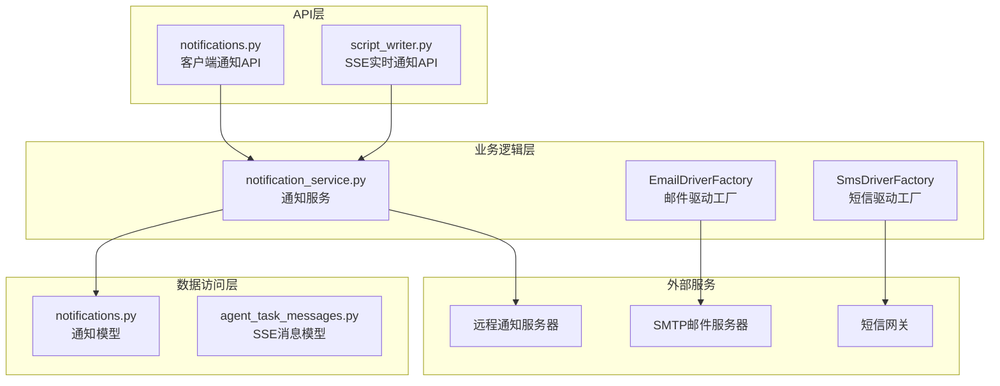
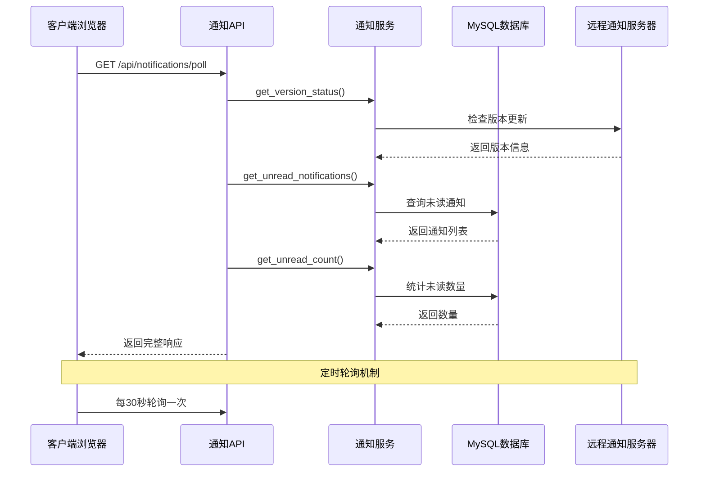
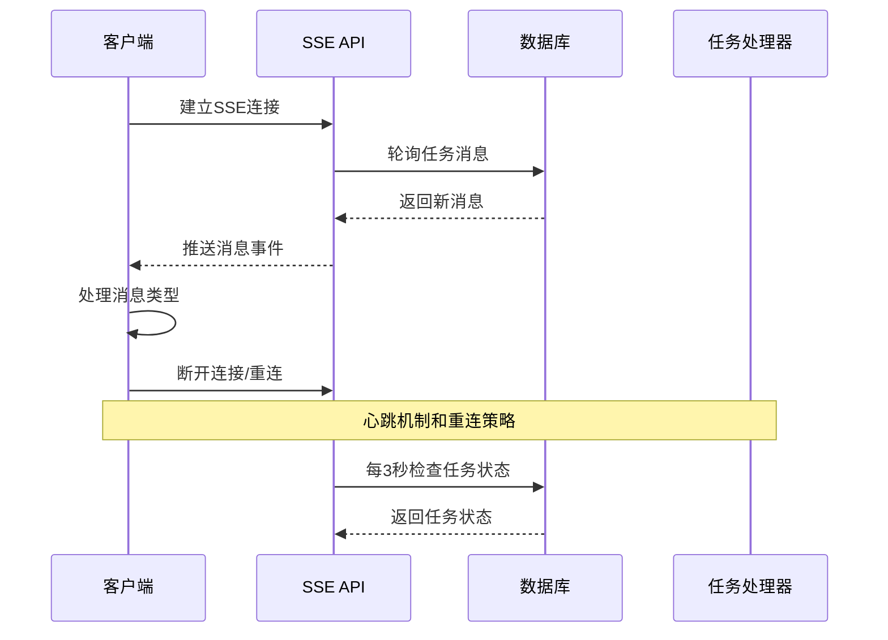
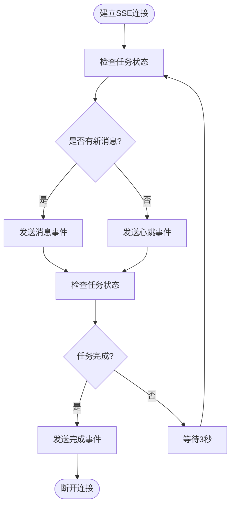
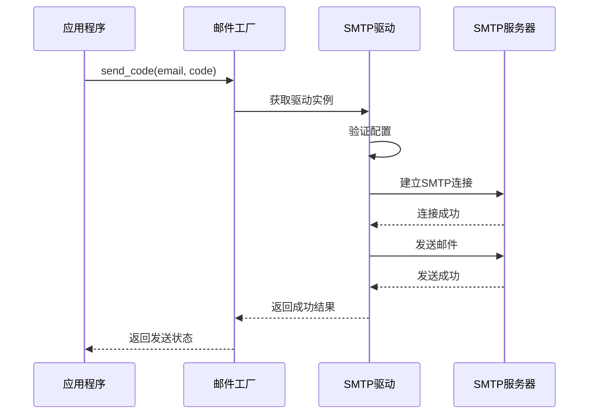
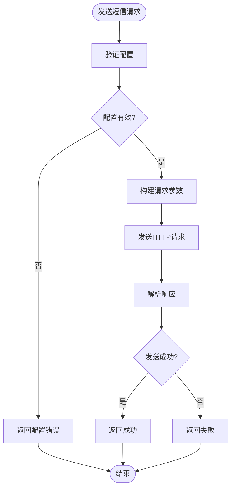
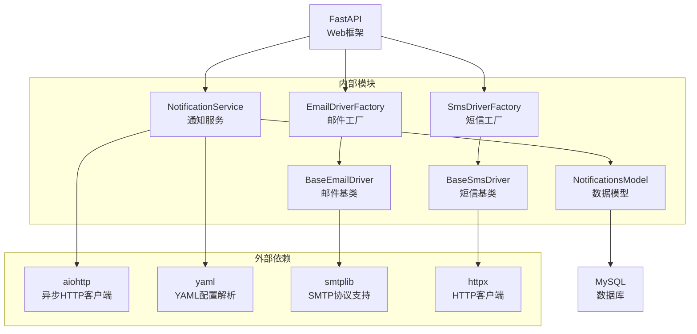

# 通知API接口

<cite>
**本文档引用的文件**
- [api/notifications.py](file://api/notifications.py)
- [model/notifications.py](file://model/notifications.py)
- [services/notification_service.py](file://services/notification_service.py)
- [docs/notification_system.md](file://docs/notification_system.md)
- [perseids_server/utils/email_drivers/__init__.py](file://perseids_server/utils/email_drivers/__init__.py)
- [perseids_server/utils/email_drivers/base_email_driver.py](file://perseids_server/utils/email_drivers/base_email_driver.py)
- [perseids_server/utils/email_drivers/email_driver_factory.py](file://perseids_server/utils/email_drivers/email_driver_factory.py)
- [perseids_server/utils/email_drivers/smtp_email_driver.py](file://perseids_server/utils/email_drivers/smtp_email_driver.py)
- [perseids_server/utils/sms_drivers/__init__.py](file://perseids_server/utils/sms_drivers/__init__.py)
- [perseids_server/utils/sms_drivers/base_sms_driver.py](file://perseids_server/utils/sms_drivers/base_sms_driver.py)
- [perseids_server/utils/sms_drivers/sms_driver_factory.py](file://perseids_server/utils/sms_drivers/sms_driver_factory.py)
- [perseids_server/utils/sms_drivers/api_sms_driver.py](file://perseids_server/utils/sms_drivers/api_sms_driver.py)
- [tests/services/test_notification_service.py](file://tests/services/test_notification_service.py)
- [tests/crud/test_notifications_crud.py](file://tests/crud/test_notifications_crud.py)
- [api/script_writer.py](file://api/script_writer.py)
- [model/agent_task_messages.py](file://model/agent_task_messages.py)
</cite>

## 目录
1. [简介](#简介)
2. [项目结构](#项目结构)
3. [核心组件](#核心组件)
4. [架构概览](#架构概览)
5. [详细组件分析](#详细组件分析)
6. [依赖分析](#依赖分析)
7. [性能考虑](#性能考虑)
8. [故障排除指南](#故障排除指南)
9. [结论](#结论)
10. [附录](#附录)

## 简介

本文档为通知API接口的详细技术文档，涵盖实时通知、邮件发送、短信推送等所有通知相关接口。文档重点说明SSE（服务器推送事件）的实现机制、连接管理和消息格式规范，包含邮件和短信服务的集成接口、通知模板管理和发送队列处理。

通知系统采用客户端-服务器架构，客户端定期从远程服务器拉取通知信息（版本更新、系统公告等），并在管理后台展示给管理员。系统支持多种通知渠道，包括实时通知、邮件通知和短信通知，并提供完整的状态查询、重试机制和失败处理流程。

## 项目结构

通知系统主要由以下模块组成：



**图表来源**
- [api/notifications.py:1-150](file://api/notifications.py#L1-L150)
- [services/notification_service.py:1-319](file://services/notification_service.py#L1-L319)
- [model/notifications.py:1-234](file://model/notifications.py#L1-L234)

**章节来源**
- [api/notifications.py:1-150](file://api/notifications.py#L1-L150)
- [services/notification_service.py:1-319](file://services/notification_service.py#L1-L319)
- [model/notifications.py:1-234](file://model/notifications.py#L1-L234)

## 核心组件

### 通知API路由器

通知API提供四个核心接口，分为客户端接口和管理员接口两组：

#### 客户端接口
- **轮询接口**: `/api/notifications/poll` - 获取版本更新状态、未读通知列表、未读数量和缺失的二进制依赖
- **标记已读接口**: `/api/notifications/{notification_id}/read` - 标记单条通知为已读
- **全部标记已读接口**: `/api/notifications/read-all` - 标记所有通知为已读

#### 管理员接口
- **通知列表接口**: `/api/notifications/admin/list` - 分页查看所有通知
- **删除通知接口**: `/api/notifications/admin/{notification_id}` - 删除指定通知

### 通知服务

NotificationService负责从远程服务器拉取通知信息，处理版本更新，并将通知存储到本地数据库。服务具有以下特性：

- **定时轮询**: 默认每小时检查一次远程服务器
- **客户端标识**: 生成唯一的客户端ID用于区分不同的服务器实例
- **版本管理**: 跟踪本地版本与远程版本的差异
- **去重机制**: 基于remote_id确保通知不会重复存储

### 数据模型

通知系统使用NotificationEntity和NotificationsModel来管理通知数据：

- **NotificationEntity**: 封装通知实体的所有属性和转换方法
- **NotificationsModel**: 提供数据库操作方法，包括创建、查询、更新和删除

**章节来源**
- [api/notifications.py:48-150](file://api/notifications.py#L48-L150)
- [services/notification_service.py:24-319](file://services/notification_service.py#L24-L319)
- [model/notifications.py:15-234](file://model/notifications.py#L15-L234)

## 架构概览

通知系统采用分层架构设计，确保各层职责清晰分离：



**图表来源**
- [api/notifications.py:48-79](file://api/notifications.py#L48-L79)
- [services/notification_service.py:199-307](file://services/notification_service.py#L199-L307)

系统还支持SSE（服务器推送事件）用于实时通知传输：



**图表来源**
- [api/script_writer.py:2586-2638](file://api/script_writer.py#L2586-L2638)
- [model/agent_task_messages.py:198-206](file://model/agent_task_messages.py#L198-L206)

## 详细组件分析

### 通知API接口规范

#### 轮询接口
- **HTTP方法**: GET
- **URL模式**: `/api/notifications/poll`
- **认证方式**: 无需认证
- **响应格式**: 
  ```json
  {
    "code": 0,
    "data": {
      "version_update": {
        "has_update": true,
        "current_version": "1.5.0",
        "latest_version": "1.6.1",
        "release_notes": "更新日志",
        "changelog_url": "更新链接",
        "required_binaries": []
      },
      "notifications": [],
      "unread_count": 0,
      "missing_binaries": []
    }
  }
  ```

#### 标记已读接口
- **HTTP方法**: POST
- **URL模式**: `/api/notifications/{notification_id}/read`
- **路径参数**: notification_id (通知ID)
- **认证方式**: 无需认证
- **响应格式**: `{"code": 0, "data": {"updated": true}}`

#### 全部标记已读接口
- **HTTP方法**: POST
- **URL模式**: `/api/notifications/read-all`
- **认证方式**: 无需认证
- **响应格式**: `{"code": 0, "data": {"updated_count": 5}}`

#### 管理员通知列表接口
- **HTTP方法**: GET
- **URL模式**: `/api/notifications/admin/list`
- **查询参数**: 
  - page (页码，默认1，最小1)
  - page_size (每页数量，默认20，最大100)
- **认证方式**: 需要管理员权限
- **响应格式**: 
  ```json
  {
    "code": 0,
    "data": {
      "items": [],
      "total": 0,
      "page": 1,
      "page_size": 20
    }
  }
  ```

#### 删除通知接口
- **HTTP方法**: DELETE
- **URL模式**: `/api/notifications/admin/{notification_id}`
- **路径参数**: notification_id (通知ID)
- **认证方式**: 需要管理员权限
- **响应格式**: `{"code": 0, "data": {"deleted": true}}`

**章节来源**
- [api/notifications.py:48-150](file://api/notifications.py#L48-L150)
- [docs/notification_system.md:185-194](file://docs/notification_system.md#L185-L194)

### SSE实时通知实现

SSE（服务器推送事件）用于实现实时通知传输，特别适用于长连接场景：

#### 连接建立
- 客户端通过HTTP长连接与服务器建立SSE连接
- 服务器端使用事件源（EventSource）机制推送消息
- 支持自动重连和心跳检测

#### 消息格式规范
SSE消息采用JSON格式，包含以下标准字段：
- `type`: 消息类型（message、done、error、status、heartbeat等）
- `content`: 消息内容（JSON格式）
- `timestamp`: 时间戳

#### 连接管理策略


**图表来源**
- [api/script_writer.py:2586-2638](file://api/script_writer.py#L2586-L2638)

#### 重连机制
- 连接断开时自动重连
- 最多重连3次，每次间隔2秒
- 重连失败时显示错误信息并提示刷新页面

**章节来源**
- [api/script_writer.py:2586-2638](file://api/script_writer.py#L2586-L2638)
- [model/agent_task_messages.py:198-206](file://model/agent_task_messages.py#L198-L206)

### 邮件通知服务

邮件通知服务通过SMTP协议实现，支持多种配置选项：

#### 配置结构
```yaml
email:
  active_driver: smtp
  agents:
    smtp_agent:
      driver: smtp
      smtp_host: smtp.gmail.com
      smtp_port: 587
      smtp_user: your-email@gmail.com
      smtp_password: your-app-password
      smtp_from: your-email@gmail.com
      smtp_from_name: 智剧通
      use_tls: true
```

#### 发送流程


**图表来源**
- [perseids_server/utils/email_drivers/email_driver_factory.py:24-100](file://perseids_server/utils/email_drivers/email_driver_factory.py#L24-L100)

#### 验证码邮件模板
邮件采用HTML格式，包含验证码和安全提示：
- 验证码以大字体显示，便于识别
- 包含5分钟有效期提示
- 提供安全免责声明

**章节来源**
- [perseids_server/utils/email_drivers/smtp_email_driver.py:45-116](file://perseids_server/utils/email_drivers/smtp_email_driver.py#L45-L116)
- [perseids_server/utils/email_drivers/email_driver_factory.py:24-100](file://perseids_server/utils/email_drivers/email_driver_factory.py#L24-L100)

### 短信通知服务

短信通知服务支持多种驱动类型，目前主要支持HTTP API驱动：

#### 配置结构
```yaml
sms:
  active_driver: perseids
  agents:
    perseids_agent:
      driver: perseids
      api_url: https://api.sms-provider.com/send
      method: POST
```

#### 发送流程


**图表来源**
- [perseids_server/utils/sms_drivers/api_sms_driver.py:32-79](file://perseids_server/utils/sms_drivers/api_sms_driver.py#L32-L79)

#### 错误处理
- HTTP状态码验证：根据状态码判断发送结果
- 响应格式检查：确保API返回JSON格式
- 超时处理：设置10秒超时防止阻塞
- 异常捕获：捕获网络异常和解析异常

**章节来源**
- [perseids_server/utils/sms_drivers/api_sms_driver.py:32-79](file://perseids_server/utils/sms_drivers/api_sms_driver.py#L32-L79)
- [perseids_server/utils/sms_drivers/sms_driver_factory.py:86-101](file://perseids_server/utils/sms_drivers/sms_driver_factory.py#L86-L101)

### 通知模板管理

通知系统支持多种通知类型和模板：

#### 通知类型
- **announcement**: 系统公告
- **maintenance**: 系统维护
- **feature**: 功能发布
- **security**: 安全通知

#### 通知级别
- **info**: 信息通知
- **warning**: 警告通知
- **error**: 错误通知
- **success**: 成功通知

#### 模板字段
- `id`: 通知唯一标识（用于去重）
- `title`: 通知标题
- `content`: 通知内容
- `level`: 通知级别
- `start_time`: 生效时间
- `end_time`: 结束时间
- `extra_data`: 额外数据（包含链接信息）

**章节来源**
- [model/notifications.py:15-58](file://model/notifications.py#L15-L58)
- [services/notification_service.py:162-197](file://services/notification_service.py#L162-L197)

## 依赖分析

通知系统的主要依赖关系如下：



**图表来源**
- [services/notification_service.py:5-21](file://services/notification_service.py#L5-L21)
- [perseids_server/utils/email_drivers/smtp_email_driver.py:4-12](file://perseids_server/utils/email_drivers/smtp_email_driver.py#L4-L12)
- [perseids_server/utils/sms_drivers/api_sms_driver.py:5-7](file://perseids_server/utils/sms_drivers/api_sms_driver.py#L5-L7)

系统采用松耦合设计，各组件通过接口和工厂模式实现解耦：

**章节来源**
- [services/notification_service.py:1-319](file://services/notification_service.py#L1-L319)
- [perseids_server/utils/email_drivers/__init__.py:1-14](file://perseids_server/utils/email_drivers/__init__.py#L1-L14)
- [perseids_server/utils/sms_drivers/__init__.py:1-14](file://perseids_server/utils/sms_drivers/__init__.py#L1-L14)

## 性能考虑

### 异步处理
通知服务采用异步编程模型，使用`asyncio`和`aiohttp`提高并发性能：

- **数据库操作**: 使用`asyncio.to_thread()`在独立线程中执行阻塞操作
- **HTTP请求**: 使用异步HTTP客户端减少等待时间
- **定时任务**: 使用`asyncio.create_task()`创建后台任务

### 缓存策略
- **版本状态缓存**: 在内存中缓存版本更新信息，避免频繁网络请求
- **客户端ID缓存**: 生成一次性的客户端ID，减少计算开销
- **配置缓存**: 邮件和短信配置在进程内缓存

### 数据库优化
- **索引设计**: 为`is_read`和`created_at`字段建立索引
- **查询优化**: 使用LIMIT限制未读通知数量
- **事务处理**: 在批量操作中使用事务确保数据一致性

## 故障排除指南

### 常见问题及解决方案

#### 通知无法拉取
1. **检查网络连接**: 确认服务器能够访问远程通知服务器
2. **验证认证配置**: 检查`NotificationConstants.REMOTE_API_BASE`配置
3. **查看日志**: 检查`NotificationService`的日志输出

#### SSE连接失败
1. **检查防火墙设置**: 确认SSE端口未被防火墙阻止
2. **验证客户端支持**: 确认浏览器支持EventSource API
3. **查看重连日志**: 检查自动重连机制是否正常工作

#### 邮件发送失败
1. **验证SMTP配置**: 检查SMTP服务器地址、端口、用户名和密码
2. **测试网络连接**: 确认能够连接到SMTP服务器
3. **检查TLS设置**: 验证TLS配置是否正确

#### 短信发送失败
1. **验证API配置**: 检查短信网关的API URL和认证信息
2. **测试HTTP连接**: 确认能够访问短信网关API
3. **查看响应格式**: 确认API返回JSON格式

**章节来源**
- [tests/services/test_notification_service.py:1-229](file://tests/services/test_notification_service.py#L1-L229)
- [tests/crud/test_notifications_crud.py:1-319](file://tests/crud/test_notifications_crud.py#L1-L319)

## 结论

通知API接口提供了完整的多渠道通知解决方案，包括：

1. **实时通知**: 通过SSE实现低延迟的消息推送
2. **邮件通知**: 基于SMTP协议的可靠邮件发送
3. **短信通知**: 支持HTTP API的短信发送服务
4. **管理功能**: 完整的通知管理界面和API

系统采用模块化设计，具有良好的扩展性和维护性。通过异步处理和缓存策略，确保了高性能的用户体验。完善的错误处理和重连机制保证了系统的稳定性。

## 附录

### 配置文件示例

#### 通知系统配置
```yaml
# config/constant.py
class NotificationConstants:
    REMOTE_API_BASE = "https://ailive.perseids.cn:11443/api/v1"
    CHECK_INTERVAL = 3600  # 1小时
```

#### 二进制依赖配置
```yaml
# config/required_binaries.yml
binaries:
  ffmpeg:
    description: "音视频处理工具"
    download_url: "https://cdn.zjt.com/bin/ffmpeg-6.0-win64.zip"
    check_paths:
      windows: "bin/ffmpeg/ffmpeg.exe"
      linux: "bin/ffmpeg/ffmpeg"
      macos: "bin/ffmpeg/ffmpeg"
    required_since: "2.0.0"
```

### API使用示例

#### 获取未读通知
```javascript
// 客户端JavaScript示例
function pollNotifications() {
    fetch('/api/notifications/poll')
        .then(response => response.json())
        .then(data => {
            if (data.code === 0) {
                updateUI(data.data);
            }
        })
        .catch(error => console.error('轮询失败:', error));
}

// 每30秒轮询一次
setInterval(pollNotifications, 30000);
```

#### 建立SSE连接
```javascript
// SSE连接示例
const eventSource = new EventSource('/api/script_writer/stream/' + taskId);

eventSource.onmessage = function(event) {
    const data = JSON.parse(event.data);
    switch(data.type) {
        case 'message':
            displayAssistantMessage(data.content);
            break;
        case 'done':
            eventSource.close();
            break;
        case 'error':
            showError(data.error);
            eventSource.close();
            break;
    }
};

eventSource.onerror = function(error) {
    console.log('SSE连接错误，准备重连...');
    // 实现重连逻辑
};
```