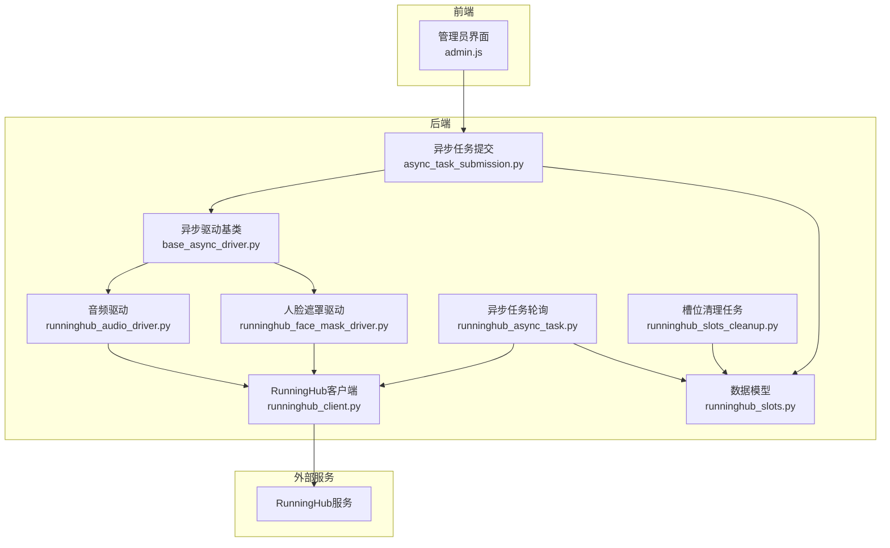
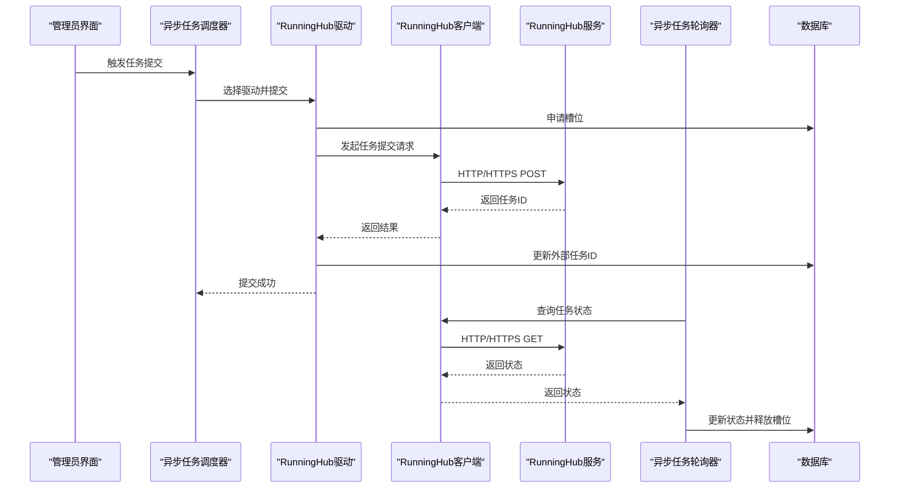
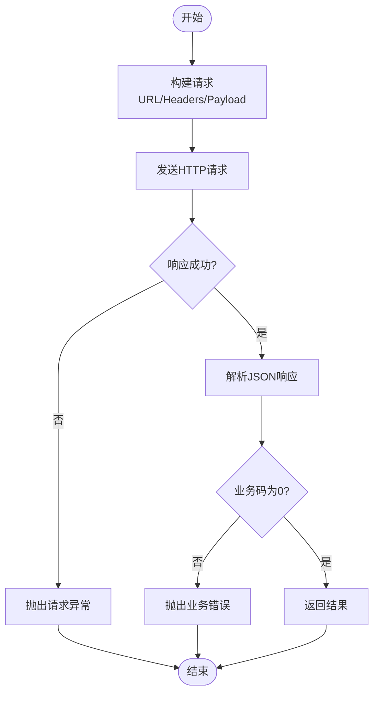
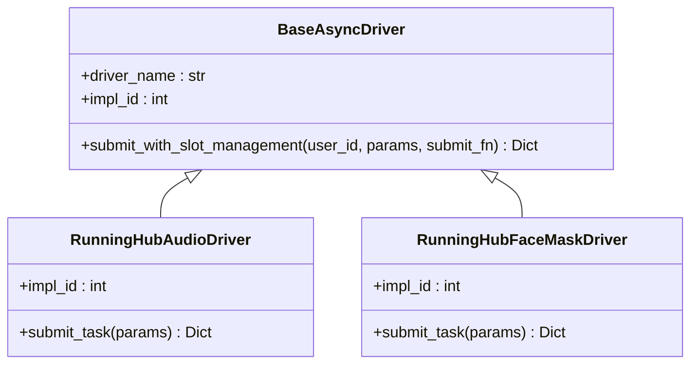
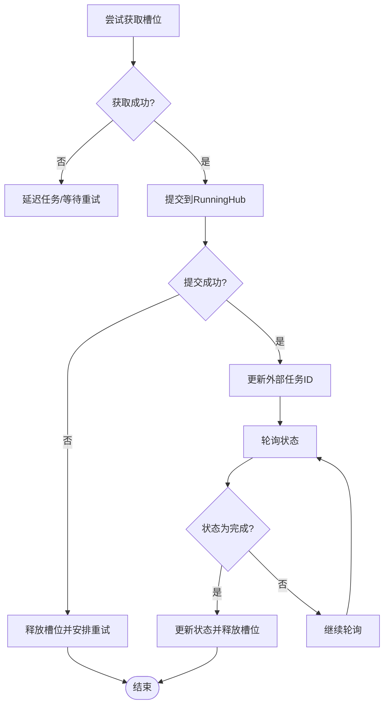
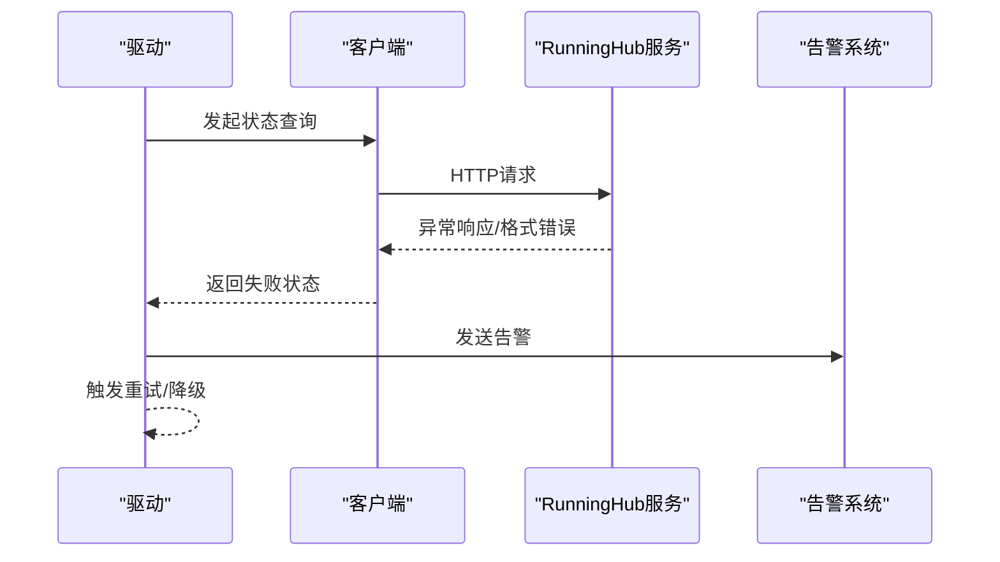
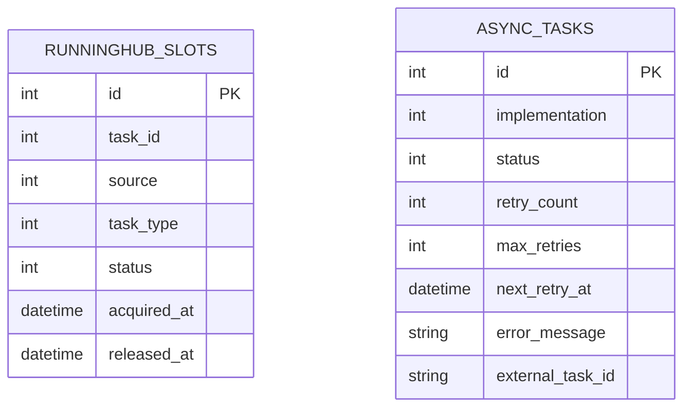
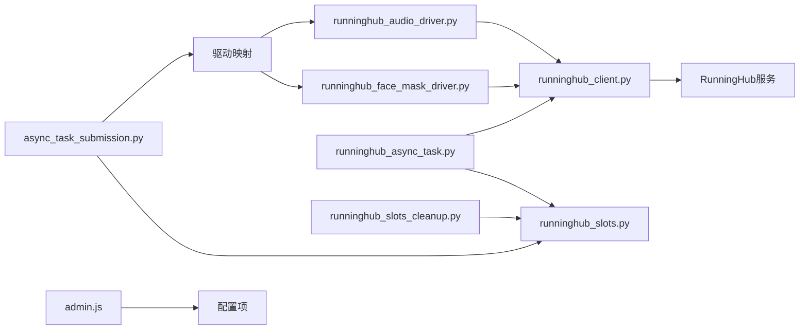

# RunningHub集成

<cite>
**本文档引用的文件**
- [runninghub_client.py](file://api/clients/runninghub_client.py)
- [runninghub_concurrency_control.md](file://docs/backend/runninghub_concurrency_control.md)
- [runninghub_slots.py](file://model/runninghub_slots.py)
- [runninghub_async_task.py](file://task/runninghub_async_task.py)
- [async_drivers/base_async_driver.py](file://task/async_drivers/base_async_driver.py)
- [async_drivers/runninghub_audio_driver.py](file://task/async_drivers/runninghub_audio_driver.py)
- [async_drivers/runninghub_face_mask_driver.py](file://task/async_drivers/runninghub_face_mask_driver.py)
- [async_task_submission.py](file://task/async_task_submission.py)
- [runninghub_slots_cleanup.py](file://task/runninghub_slots_cleanup.py)
- [admin.js](file://web/js/admin.js)
- [20260521_create_runninghub_async_tasks.py](file://alembic/versions/20260521_create_runninghub_async_tasks.py)
- [20260528_simplify_runninghub_slots.py](file://alembic/versions/20260528_simplify_runninghub_slots.py)
- [20260109-15-17_create_runninghub_slots.sql](file://model/sql/migrations/2026-01-09-15-17_create_runninghub_slots.sql)
</cite>

## 目录
1. [简介](#简介)
2. [项目结构](#项目结构)
3. [核心组件](#核心组件)
4. [架构总览](#架构总览)
5. [详细组件分析](#详细组件分析)
6. [依赖关系分析](#依赖关系分析)
7. [性能考虑](#性能考虑)
8. [故障排除指南](#故障排除指南)
9. [结论](#结论)
10. [附录](#附录)

## 简介
本文件面向RunningHub集成系统的开发者与运维人员，系统性阐述该集成的架构设计、API调用与认证机制、异步任务适配器实现、运行槽位管理系统、状态监控与故障转移策略，并提供性能优化与错误处理实践指南及扩展开发建议。

## 项目结构
RunningHub集成涉及以下关键模块：
- API客户端层：封装RunningHub服务的HTTP/HTTPS请求与OpenAPI v2认证
- 任务调度与适配层：异步任务提交、重试、状态轮询与槽位管理
- 数据模型层：运行槽位表与异步任务表的定义与迁移
- 文档与配置：并发控制策略、槽位清理与监控建议
- 前端配置：管理员界面中RunningHub配置项的展示与校验

**图表来源**
- [runninghub_client.py:56-123](file://api/clients/runninghub_client.py#L56-L123)
- [base_async_driver.py:60-120](file://task/async_drivers/base_async_driver.py#L60-L120)
- [runninghub_audio_driver.py](file://task/async_drivers/runninghub_audio_driver.py)
- [runninghub_face_mask_driver.py](file://task/async_drivers/runninghub_face_mask_driver.py)
- [async_task_submission.py:60-120](file://task/async_task_submission.py#L60-L120)
- [runninghub_async_task.py:300-342](file://task/runninghub_async_task.py#L300-L342)
- [runninghub_slots_cleanup.py](file://task/runninghub_slots_cleanup.py)
- [runninghub_slots.py](file://model/runninghub_slots.py)

**章节来源**
- [runninghub_client.py:56-123](file://api/clients/runninghub_client.py#L56-L123)
- [runninghub_concurrency_control.md:74-126](file://docs/backend/runninghub_concurrency_control.md#L74-L126)
- [async_task_submission.py:1-85](file://task/async_task_submission.py#L1-L85)

## 核心组件
- RunningHub客户端：负责HTTP/HTTPS请求与OpenAPI v2认证头注入，支持同步与异步请求封装
- 异步驱动基类：提供统一的提交入口，自动处理槽位申请/释放、异常回滚与任务记录
- 具体驱动：音频与人脸遮罩等实现，按需扩展
- 异步任务调度：定时扫描待重试任务，按实现类型选择驱动，占用槽位后提交
- 异步任务轮询：持续查询RunningHub任务状态，更新本地状态并释放槽位
- 槽位管理：统一的获取、释放、清理接口，支持按来源与项目ID操作
- 数据模型与迁移：运行槽位表与异步任务表的结构定义与版本化管理

**章节来源**
- [runninghub_client.py:56-123](file://api/clients/runninghub_client.py#L56-L123)
- [base_async_driver.py:60-120](file://task/async_drivers/base_async_driver.py#L60-L120)
- [async_task_submission.py:60-120](file://task/async_task_submission.py#L60-L120)
- [runninghub_async_task.py:300-342](file://task/runninghub_async_task.py#L300-L342)
- [runninghub_slots.py](file://model/runninghub_slots.py)

## 架构总览
下图展示了从任务提交到状态轮询的完整流程，以及与RunningHub服务的交互路径。

**图表来源**
- [async_task_submission.py:60-120](file://task/async_task_submission.py#L60-L120)
- [runninghub_audio_driver.py](file://task/async_drivers/runninghub_audio_driver.py)
- [runninghub_face_mask_driver.py](file://task/async_drivers/runninghub_face_mask_driver.py)
- [runninghub_client.py:56-123](file://api/clients/runninghub_client.py#L56-L123)
- [runninghub_async_task.py:300-342](file://task/runninghub_async_task.py#L300-L342)

## 详细组件分析

### API调用与认证机制
- HTTP请求封装：统一构造URL、设置Content-Type与Accept头，支持超时控制
- OpenAPI v2认证：通过Authorization头携带Bearer Token进行认证
- 错误处理：对非2xx响应抛出请求异常；对业务错误码不为0抛出值错误；对响应格式异常进行捕获与转换
- 异步请求：基于httpx.AsyncClient发起异步POST请求，保持与同步接口一致的错误语义

**图表来源**
- [runninghub_client.py:56-123](file://api/clients/runninghub_client.py#L56-L123)

**章节来源**
- [runninghub_client.py:56-123](file://api/clients/runninghub_client.py#L56-L123)

### 异步任务适配器实现
- 统一提交入口：submit_with_slot_management负责申请槽位、创建异步任务记录、调用业务提交函数、异常时释放槽位
- 驱动映射：根据实现ID映射到具体驱动类，支持音频与人脸遮罩等
- 重试策略：指数退避延迟（30s、60s、120s、300s、300s），避免抖动
- 状态轮询：轮询RunningHub任务状态，映射为统一状态并更新本地记录，完成后释放槽位

**图表来源**
- [base_async_driver.py:60-120](file://task/async_drivers/base_async_driver.py#L60-L120)
- [async_drivers/runninghub_audio_driver.py](file://task/async_drivers/runninghub_audio_driver.py)
- [async_drivers/runninghub_face_mask_driver.py](file://task/async_drivers/runninghub_face_mask_driver.py)

**章节来源**
- [base_async_driver.py:60-120](file://task/async_drivers/base_async_driver.py#L60-L120)
- [async_drivers/runninghub_audio_driver.py](file://task/async_drivers/runninghub_audio_driver.py)
- [async_drivers/runninghub_face_mask_driver.py](file://task/async_drivers/runninghub_face_mask_driver.py)
- [async_task_submission.py:60-120](file://task/async_task_submission.py#L60-L120)
- [runninghub_async_task.py:300-342](file://task/runninghub_async_task.py#L300-L342)

### 运行槽位管理系统
- 设计原则：统一的槽位生命周期管理，支持按来源区分（任务/异步任务），提供按任务ID与项目ID释放能力
- 资源分配：提交前尝试获取槽位，失败则延迟任务或安排重试
- 占用控制：通过数据库状态字段标记占用，避免超并发
- 清理机制：定时任务定期清理超时槽位，默认超时阈值可配置

**图表来源**
- [runninghub_concurrency_control.md:105-126](file://docs/backend/runninghub_concurrency_control.md#L105-L126)
- [runninghub_slots.py](file://model/runninghub_slots.py)
- [runninghub_slots_cleanup.py](file://task/runninghub_slots_cleanup.py)

**章节来源**
- [runninghub_concurrency_control.md:258-287](file://docs/backend/runninghub_concurrency_control.md#L258-L287)
- [runninghub_slots.py](file://model/runninghub_slots.py)
- [runninghub_slots_cleanup.py](file://task/runninghub_slots_cleanup.py)

### 状态监控与故障转移策略
- 监控指标：活跃槽位数量、按来源与任务类型统计、异步任务状态分布
- 故障转移：当RunningHub服务不可用或响应异常时，驱动返回统一失败状态并触发重试；必要时切换备用节点或降级处理
- 告警机制：对异常响应格式、未预期异常等场景发送告警，便于快速定位问题

**图表来源**
- [runninghub_client.py:56-123](file://api/clients/runninghub_client.py#L56-L123)
- [ltx2_runninghub_v1_driver.py:414-447](file://task/visual_drivers/ltx2_runninghub_v1_driver.py#L414-L447)
- [wan22_runninghub_v1_driver.py:495-527](file://task/visual_drivers/wan22_runninghub_v1_driver.py#L495-L527)

**章节来源**
- [runninghub_concurrency_control.md:288-419](file://docs/backend/runninghub_concurrency_control.md#L288-L419)
- [ltx2_runninghub_v1_driver.py:414-447](file://task/visual_drivers/ltx2_runninghub_v1_driver.py#L414-L447)
- [wan22_runninghub_v1_driver.py:495-527](file://task/visual_drivers/wan22_runninghub_v1_driver.py#L495-L527)

### 数据模型与迁移
- 运行槽位表：记录任务ID、来源、任务类型、状态、获取/释放时间等
- 异步任务表：记录实现类型、状态、重试次数、下次重试时间、错误信息等
- 迁移脚本：版本化管理数据库结构变更，确保部署一致性

**图表来源**
- [20260109-15-17_create_runninghub_slots.sql](file://model/sql/migrations/2026-01-09-15-17_create_runninghub_slots.sql)
- [20260521_create_runninghub_async_tasks.py](file://alembic/versions/20260521_create_runninghub_async_tasks.py)
- [20260528_simplify_runninghub_slots.py](file://alembic/versions/20260528_simplify_runninghub_slots.py)

**章节来源**
- [20260109-15-17_create_runninghub_slots.sql](file://model/sql/migrations/2026-01-09-15-17_create_runninghub_slots.sql)
- [20260521_create_runninghub_async_tasks.py](file://alembic/versions/20260521_create_runninghub_async_tasks.py)
- [20260528_simplify_runninghub_slots.py](file://alembic/versions/20260528_simplify_runninghub_slots.py)

## 依赖关系分析
- 组件耦合：调度器依赖驱动映射与槽位模型；驱动依赖客户端；轮询器依赖客户端与模型；清理任务依赖模型
- 外部依赖：RunningHub服务的可用性直接影响提交与状态查询的成功率
- 配置依赖：API主机地址、认证密钥、超时时间、槽位超时阈值等通过统一配置系统注入

**图表来源**
- [async_task_submission.py:27-42](file://task/async_task_submission.py#L27-L42)
- [runninghub_client.py:56-123](file://api/clients/runninghub_client.py#L56-L123)
- [runninghub_async_task.py:300-342](file://task/runninghub_async_task.py#L300-L342)
- [runninghub_slots.py](file://model/runninghub_slots.py)
- [runninghub_slots_cleanup.py](file://task/runninghub_slots_cleanup.py)
- [admin.js:331-348](file://web/js/admin.js#L331-L348)

**章节来源**
- [async_task_submission.py:27-42](file://task/async_task_submission.py#L27-L42)
- [runninghub_client.py:56-123](file://api/clients/runninghub_client.py#L56-L123)
- [runninghub_async_task.py:300-342](file://task/runninghub_async_task.py#L300-L342)
- [runninghub_slots.py](file://model/runninghub_slots.py)
- [runninghub_slots_cleanup.py](file://task/runninghub_slots_cleanup.py)
- [admin.js:331-348](file://web/js/admin.js#L331-L348)

## 性能考虑
- 并发控制：通过槽位上限避免服务端过载，结合延迟机制缓解队列堆积
- 重试退避：指数退避减少对RunningHub的瞬时压力，提高整体成功率
- 异步I/O：客户端采用异步HTTP请求，提升高并发下的吞吐
- 监控与告警：通过数据库查询与日志关键词快速定位瓶颈与异常

**章节来源**
- [runninghub_concurrency_control.md:74-126](file://docs/backend/runninghub_concurrency_control.md#L74-L126)
- [runninghub_client.py:101-123](file://api/clients/runninghub_client.py#L101-L123)
- [async_task_submission.py:44-58](file://task/async_task_submission.py#L44-L58)

## 故障排除指南
- 请求失败：检查API主机地址、认证令牌、网络连通性与超时设置
- 业务错误：关注返回码与消息，核对输入参数与配额限制
- 响应格式异常：确认RunningHub服务端返回结构是否符合预期
- 槽位泄漏：检查清理任务是否正常执行，必要时手动清理超时槽位
- 日志定位：搜索包含“RunningHub slot”等关键词的日志条目

**章节来源**
- [runninghub_client.py:56-123](file://api/clients/runninghub_client.py#L56-L123)
- [runninghub_concurrency_control.md:343-354](file://docs/backend/runninghub_concurrency_control.md#L343-L354)
- [runninghub_slots_cleanup.py](file://task/runninghub_slots_cleanup.py)

## 结论
RunningHub集成通过统一的客户端、驱动与槽位管理体系，实现了稳定可靠的异步任务处理。配合完善的监控、告警与清理机制，能够在高并发场景下保持系统稳定性与可维护性。建议在生产环境中持续优化重试策略与监控阈值，并根据业务增长动态调整槽位上限与清理周期。

## 附录
- 扩展开发指南：新增驱动时遵循统一提交入口与状态映射规范，确保与现有流程兼容
- 配置参考：在管理员界面中配置RunningHub的API密钥与相关参数

**章节来源**
- [admin.js:331-348](file://web/js/admin.js#L331-L348)
- [base_async_driver.py:60-120](file://task/async_drivers/base_async_driver.py#L60-L120)