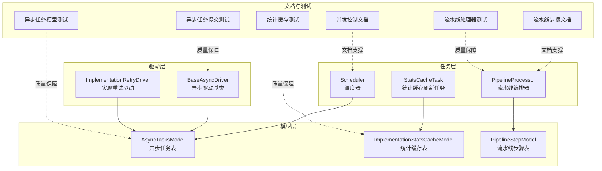
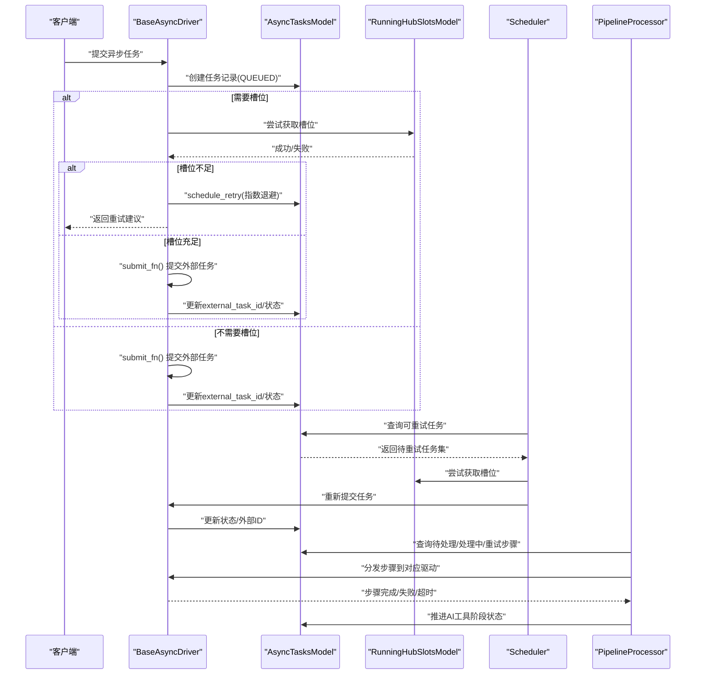
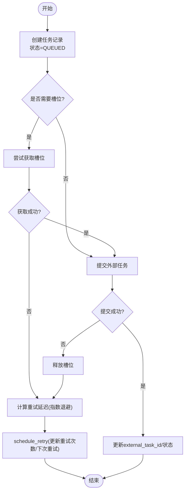
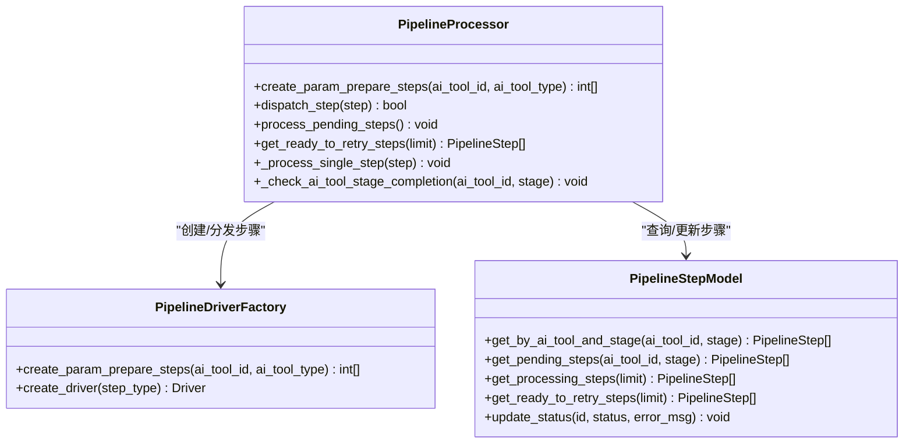
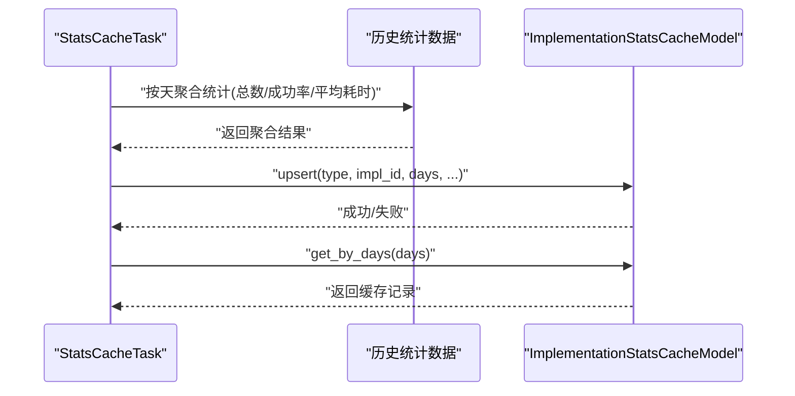
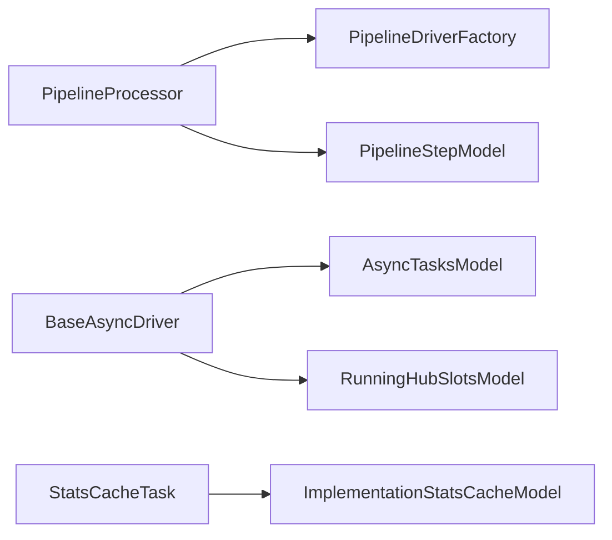

# 任务调度系统

<cite>
**本文引用的文件**
- [task/scheduler.py](file://task/scheduler.py)
- [task/pipeline_processor.py](file://task/pipeline_processor.py)
- [task/pipeline_drivers/implementation_retry_driver.py](file://task/pipeline_drivers/implementation_retry_driver.py)
- [task/stats_cache_task.py](file://task/stats_cache_task.py)
- [model/async_tasks.py](file://model/async_tasks.py)
- [model/implementation_stats_cache.py](file://model/implementation_stats_cache.py)
- [task/async_drivers/base_async_driver.py](file://task/async_drivers/base_async_driver.py)
- [docs/backend/runninghub_concurrency_control.md](file://docs/backend/runninghub_concurrency_control.md)
- [docs/backend/pipeline_steps.md](file://docs/backend/pipeline_steps.md)
- [tests/task/test_pipeline_processor.py](file://tests/task/test_pipeline_processor.py)
- [tests/model/test_async_task_new_methods.py](file://tests/model/test_async_task_new_methods.py)
- [tests/stats/test_implementation_stats.py](file://tests/stats/test_implementation_stats.py)
- [tests/task/test_async_task_submission.py](file://tests/task/test_async_task_submission.py)
</cite>

## 目录
1. [简介](#简介)
2. [项目结构](#项目结构)
3. [核心组件](#核心组件)
4. [架构总览](#架构总览)
5. [详细组件分析](#详细组件分析)
6. [依赖分析](#依赖分析)
7. [性能考虑](#性能考虑)
8. [故障排查指南](#故障排查指南)
9. [结论](#结论)
10. [附录](#附录)

## 简介
本文件面向ZhiJuTong任务调度系统，围绕异步任务管理、管道处理器、重试与超时、失败恢复、统计缓存、监控与性能分析、扩展开发与分布式策略等主题，提供从架构到实现细节的系统性文档。目标读者包括后端工程师、运维人员与产品/技术管理者。

## 项目结构
系统采用“模型-任务-驱动-处理器”的分层组织方式：
- 模型层：负责数据库表抽象与CRUD，如异步任务表、统计缓存表、流水线步骤表等。
- 任务层：负责任务生命周期编排，包括提交、调度、轮询、重试、清理等。
- 驱动层：针对不同实现（如RunningHub、视觉/音频等）封装具体提交与状态轮询逻辑。
- 处理器层：编排流水线步骤，管理步骤状态机与依赖关系，推进AI工具整体状态。

图表来源
- [task/scheduler.py](file://task/scheduler.py)
- [task/pipeline_processor.py](file://task/pipeline_processor.py)
- [task/stats_cache_task.py](file://task/stats_cache_task.py)
- [model/async_tasks.py](file://model/async_tasks.py)
- [model/implementation_stats_cache.py](file://model/implementation_stats_cache.py)
- [task/async_drivers/base_async_driver.py](file://task/async_drivers/base_async_driver.py)
- [task/pipeline_drivers/implementation_retry_driver.py](file://task/pipeline_drivers/implementation_retry_driver.py)
- [docs/backend/runninghub_concurrency_control.md](file://docs/backend/runninghub_concurrency_control.md)
- [docs/backend/pipeline_steps.md](file://docs/backend/pipeline_steps.md)
- [tests/task/test_pipeline_processor.py](file://tests/task/test_pipeline_processor.py)
- [tests/model/test_async_task_new_methods.py](file://tests/model/test_async_task_new_methods.py)
- [tests/stats/test_implementation_stats.py](file://tests/stats/test_implementation_stats.py)
- [tests/task/test_async_task_submission.py](file://tests/task/test_async_task_submission.py)

章节来源
- [task/scheduler.py](file://task/scheduler.py)
- [task/pipeline_processor.py](file://task/pipeline_processor.py)
- [task/stats_cache_task.py](file://task/stats_cache_task.py)
- [model/async_tasks.py](file://model/async_tasks.py)
- [model/implementation_stats_cache.py](file://model/implementation_stats_cache.py)
- [task/async_drivers/base_async_driver.py](file://task/async_drivers/base_async_driver.py)
- [task/pipeline_drivers/implementation_retry_driver.py](file://task/pipeline_drivers/implementation_retry_driver.py)
- [docs/backend/runninghub_concurrency_control.md](file://docs/backend/runninghub_concurrency_control.md)
- [docs/backend/pipeline_steps.md](file://docs/backend/pipeline_steps.md)
- [tests/task/test_pipeline_processor.py](file://tests/task/test_pipeline_processor.py)
- [tests/model/test_async_task_new_methods.py](file://tests/model/test_async_task_new_methods.py)
- [tests/stats/test_implementation_stats.py](file://tests/stats/test_implementation_stats.py)
- [tests/task/test_async_task_submission.py](file://tests/task/test_async_task_submission.py)

## 核心组件
- 异步任务模型与驱动
  - 异步任务表：记录任务状态、重试次数、下次重试时间、最大重试次数等，支持基于索引的高效查询与重试调度。
  - 异步驱动基类：封装任务创建、槽位获取、提交、重试延迟计算与调度等通用流程。
- 流水线处理器
  - 负责创建、分发、轮询与推进流水线步骤，管理步骤状态机与阶段推进（参数准备、结束前处理等）。
- 统计缓存
  - 基于implementation_stats_cache表的统计缓存，提供按天聚合的成功率、平均耗时等指标，支持upsert、查询与清理。
- 调度器与后台任务
  - 调度器定时扫描可重试任务与流水线步骤，驱动提交与状态轮询；统计缓存任务周期性刷新缓存。

章节来源
- [model/async_tasks.py](file://model/async_tasks.py)
- [task/async_drivers/base_async_driver.py](file://task/async_drivers/base_async_driver.py)
- [task/pipeline_processor.py](file://task/pipeline_processor.py)
- [model/implementation_stats_cache.py](file://model/implementation_stats_cache.py)
- [task/stats_cache_task.py](file://task/stats_cache_task.py)

## 架构总览
系统通过“模型-任务-驱动-处理器”四层协同，实现从任务创建、提交、轮询到完成/失败的全生命周期管理。并发控制与动态延迟机制确保在资源受限场景下稳定运行；统计缓存为上层决策提供高效指标。

图表来源
- [task/async_drivers/base_async_driver.py](file://task/async_drivers/base_async_driver.py)
- [model/async_tasks.py](file://model/async_tasks.py)
- [task/scheduler.py](file://task/scheduler.py)
- [task/pipeline_processor.py](file://task/pipeline_processor.py)

## 详细组件分析

### 异步任务管理机制
- 任务队列与优先级
  - 通过状态字段与重试时间戳索引实现“就绪队列”，支持按优先级（如next_retry_at越早越优先）出队。
  - 动态延迟：当资源（槽位）不可用时，通过延后next_trigger或next_retry_at，避免队列阻塞并保证最终可达。
- 状态跟踪
  - 支持QUEUED、PROCESSING、COMPLETED、FAILED等多种状态；失败时记录失败时间与重试次数，达到上限后标记FAILED。
- 重试机制
  - 指数退避：根据重试次数计算延迟，超过阈值进行截断，防止风暴效应。
  - 最大重试次数可配置，默认值与自定义值均有单元测试覆盖。
- 超时与失败恢复
  - 步骤层面：超时或失败时进入FAILED或TIMEOUT，支持在流水线阶段（如before_finish）进行供应商切换与重试。
  - 任务层面：槽位释放后自动重试提交，避免永久阻塞。

图表来源
- [task/async_drivers/base_async_driver.py](file://task/async_drivers/base_async_driver.py)
- [model/async_tasks.py](file://model/async_tasks.py)
- [tests/model/test_async_task_new_methods.py](file://tests/model/test_async_task_new_methods.py)
- [tests/task/test_async_task_submission.py](file://tests/task/test_async_task_submission.py)

章节来源
- [model/async_tasks.py](file://model/async_tasks.py)
- [task/async_drivers/base_async_driver.py](file://task/async_drivers/base_async_driver.py)
- [tests/model/test_async_task_new_methods.py](file://tests/model/test_async_task_new_methods.py)
- [tests/task/test_async_task_submission.py](file://tests/task/test_async_task_submission.py)

### 管道处理器架构设计
- 步骤解析与依赖管理
  - 支持param_prepare与before_finish两个阶段，分别在提交前与失败后插入异步子步骤。
  - 通过PipelineStepModel维护步骤状态与依赖，确保按顺序推进。
- 执行流程控制
  - 分发：将PENDING步骤分发给对应驱动，驱动负责实际执行与状态更新。
  - 轮询：对PROCESSING步骤进行轮询，推进至COMPLETED或进入重试队列。
  - 阶段推进：当一个阶段全部完成后，推进AI工具整体状态至下一阶段。
- 重试与失败恢复
  - 步骤级重试：基于指数退避与最大重试次数，失败后进入重试队列。
  - 供应商切换：在before_finish阶段可选择新实现（implementation）重新提交。

图表来源
- [task/pipeline_processor.py](file://task/pipeline_processor.py)
- [tests/task/test_pipeline_processor.py](file://tests/task/test_pipeline_processor.py)
- [docs/backend/pipeline_steps.md](file://docs/backend/pipeline_steps.md)

章节来源
- [task/pipeline_processor.py](file://task/pipeline_processor.py)
- [tests/task/test_pipeline_processor.py](file://tests/task/test_pipeline_processor.py)
- [docs/backend/pipeline_steps.md](file://docs/backend/pipeline_steps.md)

### 统计缓存系统
- 实现原理
  - 周期性任务从历史任务统计中聚合生成缓存，按任务类型、实现ID与统计天数进行唯一约束。
  - 提供upsert、按天查询、最新更新时间查询与按天清理等接口。
- 性能优化
  - 使用唯一索引避免重复写入，ON DUPLICATE KEY UPDATE减少写放大。
  - 按天聚合降低查询复杂度，适合高频读取场景。
- 使用建议
  - 定期清理过期缓存，避免数据膨胀。
  - 结合业务需求设置合理的统计天数与刷新频率。

图表来源
- [task/stats_cache_task.py](file://task/stats_cache_task.py)
- [model/implementation_stats_cache.py](file://model/implementation_stats_cache.py)
- [tests/stats/test_implementation_stats.py](file://tests/stats/test_implementation_stats.py)

章节来源
- [task/stats_cache_task.py](file://task/stats_cache_task.py)
- [model/implementation_stats_cache.py](file://model/implementation_stats_cache.py)
- [tests/stats/test_implementation_stats.py](file://tests/stats/test_implementation_stats.py)

### 并发控制与动态延迟
- 槽位管理
  - 在需要外部资源（如RunningHub）时，先尝试获取槽位，失败则延迟任务触发时间，避免队列阻塞。
- 动态延迟机制
  - 通过next_trigger或next_retry_at实现任务延迟，保证最终可达性。
- 后台任务流程
  - 定时扫描可重试任务与流水线步骤，统一进行分发与推进。

章节来源
- [docs/backend/runninghub_concurrency_control.md](file://docs/backend/runninghub_concurrency_control.md)
- [task/async_drivers/base_async_driver.py](file://task/async_drivers/base_async_driver.py)

## 依赖分析
- 组件耦合
  - PipelineProcessor依赖PipelineDriverFactory与PipelineStepModel，形成清晰的编排-驱动-数据分离。
  - BaseAsyncDriver依赖AsyncTasksModel与槽位模型，统一异步任务提交流程。
  - StatsCacheTask依赖ImplementationStatsCacheModel与历史统计数据。
- 外部依赖
  - 数据库：InnoDB表结构与索引设计支持高并发查询与更新。
  - 外部服务：RunningHub等第三方API，通过驱动层解耦。

图表来源
- [task/pipeline_processor.py](file://task/pipeline_processor.py)
- [task/async_drivers/base_async_driver.py](file://task/async_drivers/base_async_driver.py)
- [task/stats_cache_task.py](file://task/stats_cache_task.py)
- [model/async_tasks.py](file://model/async_tasks.py)
- [model/implementation_stats_cache.py](file://model/implementation_stats_cache.py)

章节来源
- [task/pipeline_processor.py](file://task/pipeline_processor.py)
- [task/async_drivers/base_async_driver.py](file://task/async_drivers/base_async_driver.py)
- [task/stats_cache_task.py](file://task/stats_cache_task.py)
- [model/async_tasks.py](file://model/async_tasks.py)
- [model/implementation_stats_cache.py](file://model/implementation_stats_cache.py)

## 性能考虑
- 查询优化
  - 异步任务表与统计缓存表均建立复合索引，支持按状态、重试时间、实现ID等条件快速筛选。
- 写入优化
  - 统计缓存使用upsert+ON DUPLICATE KEY UPDATE，减少重复写入。
- 并发控制
  - 动态延迟与槽位机制避免资源争用导致的队列拥堵。
- 监控与告警
  - 建议采集任务队列长度、重试率、失败率、平均耗时等指标，结合日志定位瓶颈。

## 故障排查指南
- 常见问题
  - 槽位不足：查看动态延迟与重试调度是否生效，确认资源释放路径。
  - 步骤卡死：检查PROCESSING步骤是否被轮询推进，关注错误消息与重试队列。
  - 统计缓存异常：核对upsert执行与清理逻辑，确认唯一键冲突与事务一致性。
- 排查步骤
  - 查看异步任务与流水线步骤状态变化日志。
  - 核对重试延迟计算与最大重试次数配置。
  - 检查数据库索引与查询计划，定位慢查询。

章节来源
- [tests/model/test_async_task_new_methods.py](file://tests/model/test_async_task_new_methods.py)
- [tests/task/test_pipeline_processor.py](file://tests/task/test_pipeline_processor.py)
- [tests/stats/test_implementation_stats.py](file://tests/stats/test_implementation_stats.py)

## 结论
本系统通过明确的分层架构、完善的重试与并发控制机制、以及高效的统计缓存，实现了高可靠、可扩展的任务调度能力。建议在生产环境中持续完善监控指标、优化数据库索引与查询计划，并结合业务场景调整重试策略与缓存策略。

## 附录
- 扩展开发指南
  - 自定义异步驱动：继承BaseAsyncDriver，实现提交与状态轮询逻辑，注册到驱动工厂。
  - 自定义流水线驱动：实现步骤执行逻辑，确保状态推进与错误处理。
  - 集成最佳实践：统一错误码与日志规范，使用指数退避与最大重试次数，避免风暴效应。
- 分布式任务处理与负载均衡
  - 多实例部署：通过数据库状态与索引实现天然的分布式一致性；建议使用独立的调度实例或消息队列进一步削峰。
  - 资源隔离：按任务类型与实现ID划分槽位池，避免相互影响。
  - 动态扩容：根据队列长度与资源利用率动态增减实例数量。