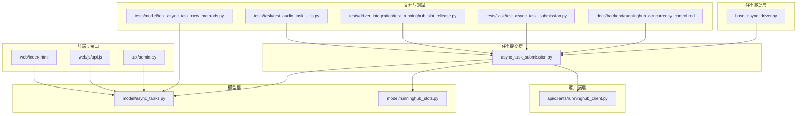
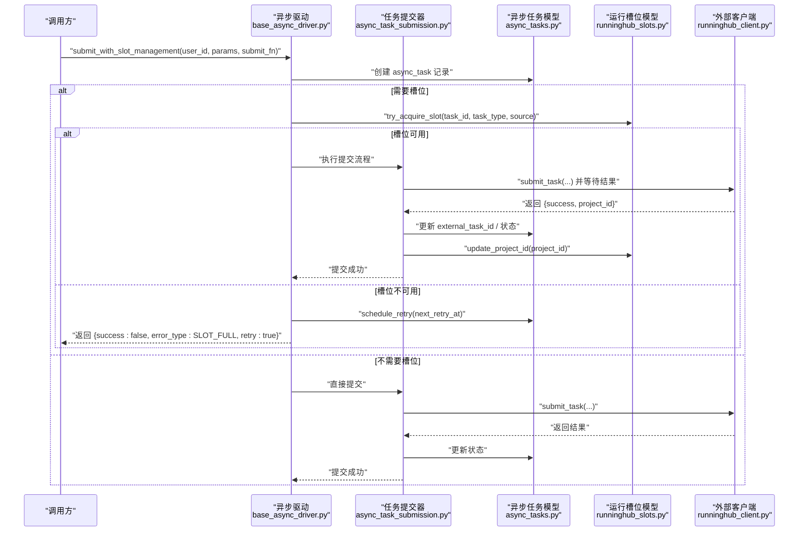
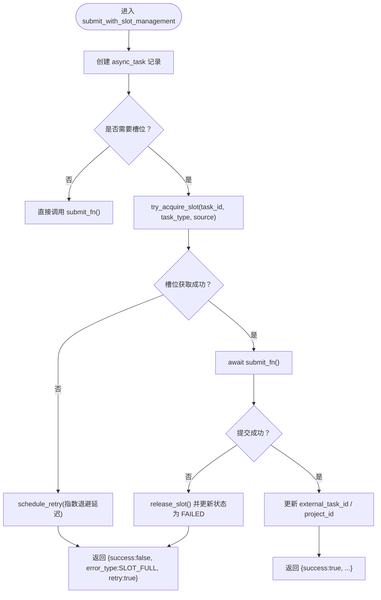
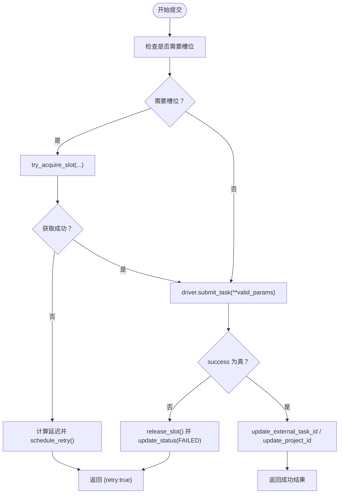
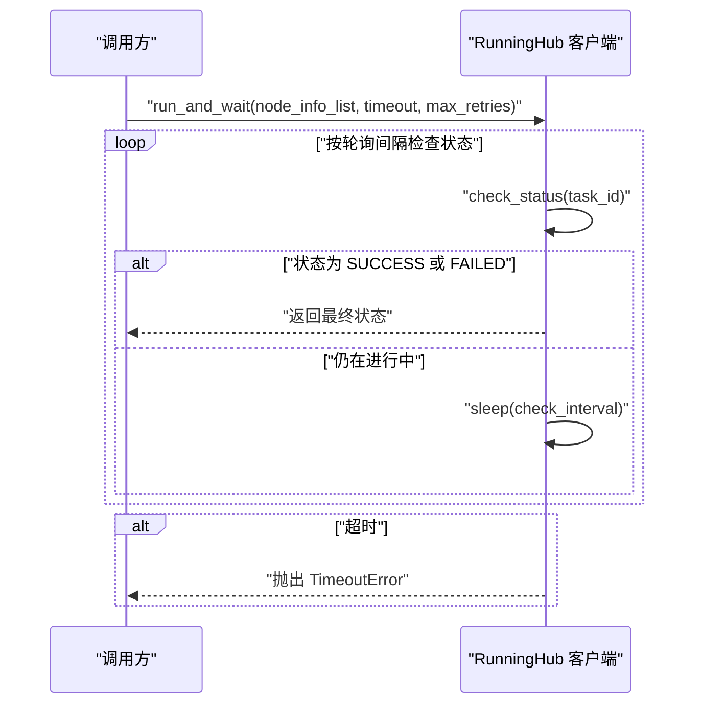
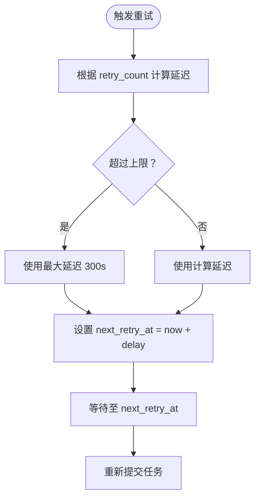
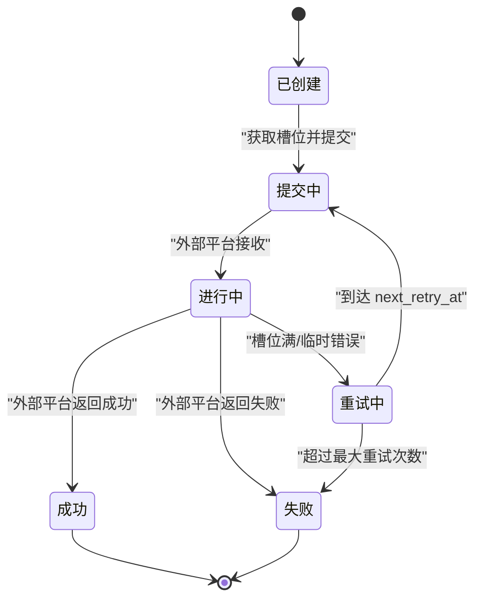
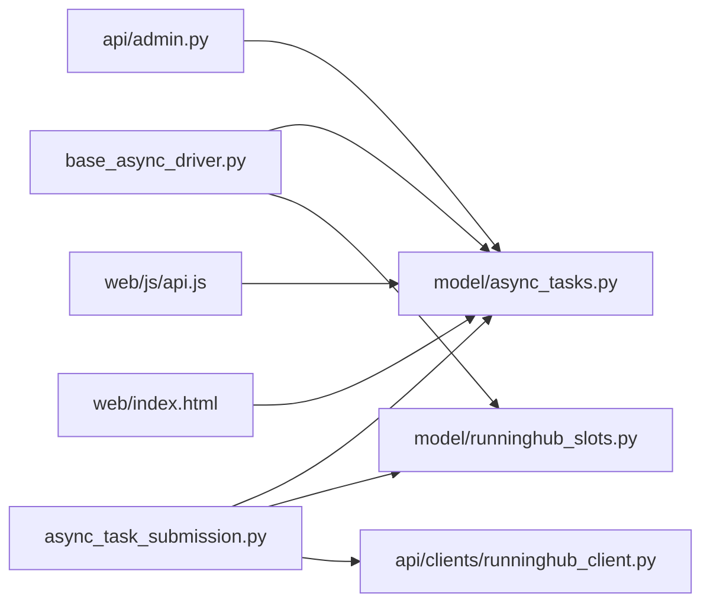

# 异步任务管理

<cite>
**本文引用的文件**
- [base_async_driver.py](file://task/async_drivers/base_async_driver.py)
- [async_task_submission.py](file://task/async_task_submission.py)
- [runninghub_client.py](file://api/clients/runninghub_client.py)
- [runninghub_concurrency_control.md](file://docs/backend/runninghub_concurrency_control.md)
- [async_tasks.py](file://model/async_tasks.py)
- [runninghub_slots.py](file://model/runninghub_slots.py)
- [test_async_task_submission.py](file://tests/task/test_async_task_submission.py)
- [test_async_task_new_methods.py](file://tests/model/test_async_task_new_methods.py)
- [test_runninghub_slot_release.py](file://tests/driver_integration/test_runninghub_slot_release.py)
- [test_audio_task_utils.py](file://tests/task/test_audio_task_utils.py)
- [admin.py](file://api/admin.py)
- [api.js](file://web/js/api.js)
- [index.html](file://web/index.html)
</cite>

## 目录
1. [简介](#简介)
2. [项目结构](#项目结构)
3. [核心组件](#核心组件)
4. [架构总览](#架构总览)
5. [详细组件分析](#详细组件分析)
6. [依赖关系分析](#依赖关系分析)
7. [性能考量](#性能考量)
8. [故障排查指南](#故障排查指南)
9. [结论](#结论)
10. [附录](#附录)

## 简介
本文件系统性阐述异步任务管理的设计与实现，覆盖任务生命周期（创建、状态转换、重试与超时）、提交流程（驱动选择、槽位管理、外部API调用）、指数退避重试策略、监控指标与错误处理、故障恢复机制，以及扩展开发指南（自定义驱动实现与集成最佳实践）。目标是帮助开发者快速理解并安全地扩展异步任务能力。

## 项目结构
围绕异步任务的关键模块分布如下：
- 任务驱动层：统一抽象与具体驱动实现，负责任务提交与状态检查
- 任务提交层：封装槽位获取、提交调用、异常释放与重试调度
- 模型层：异步任务记录与运行槽位管理
- 客户端层：对外部平台（如 RunningHub）的API封装与轮询
- 文档与测试：并发控制策略、重试算法验证与槽位释放验证
- 前端与接口：任务状态聚合与展示

**图表来源**
- [base_async_driver.py:41-114](file://task/async_drivers/base_async_driver.py#L41-L114)
- [async_task_submission.py:83-146](file://task/async_task_submission.py#L83-L146)
- [runninghub_client.py:297-333](file://api/clients/runninghub_client.py#L297-L333)
- [runninghub_concurrency_control.md:37-126](file://docs/backend/runninghub_concurrency_control.md#L37-L126)
- [async_tasks.py](file://model/async_tasks.py)
- [runninghub_slots.py](file://model/runninghub_slots.py)
- [test_async_task_submission.py:40-74](file://tests/task/test_async_task_submission.py#L40-L74)
- [test_async_task_new_methods.py:69-132](file://tests/model/test_async_task_new_methods.py#L69-L132)
- [test_runninghub_slot_release.py:112-143](file://tests/driver_integration/test_runninghub_slot_release.py#L112-L143)
- [test_audio_task_utils.py:179-204](file://tests/task/test_audio_task_utils.py#L179-L204)
- [admin.py:145-173](file://api/admin.py#L145-L173)
- [api.js:221-259](file://web/js/api.js#L221-L259)
- [index.html:5484-5519](file://web/index.html#L5484-L5519)

**章节来源**
- [base_async_driver.py:41-114](file://task/async_drivers/base_async_driver.py#L41-L114)
- [async_task_submission.py:83-146](file://task/async_task_submission.py#L83-L146)
- [runninghub_client.py:297-333](file://api/clients/runninghub_client.py#L297-L333)
- [runninghub_concurrency_control.md:37-126](file://docs/backend/runninghub_concurrency_control.md#L37-L126)

## 核心组件
- 异步驱动基类：提供统一的提交入口，自动处理 async_task 记录创建、槽位申请、异常释放与重试决策
- 任务提交器：负责根据配置决定是否需要槽位；若需要则尝试获取槽位；提交成功后更新外部任务ID与项目ID；异常时释放槽位并更新状态
- 异步任务模型：维护任务状态、重试计数、下次重试时间、最大重试次数等元数据
- 运行槽位模型：管理 RunningHub 并发槽位的获取、占用与释放
- 外部客户端：封装外部平台的提交与轮询，支持超时控制与重试
- 监控与统计：通过管理端聚合实现维度的成功率、耗时等指标

**章节来源**
- [base_async_driver.py:60-114](file://task/async_drivers/base_async_driver.py#L60-L114)
- [async_task_submission.py:83-146](file://task/async_task_submission.py#L83-L146)
- [async_tasks.py](file://model/async_tasks.py)
- [runninghub_slots.py](file://model/runninghub_slots.py)
- [runninghub_client.py:297-333](file://api/clients/runninghub_client.py#L297-L333)
- [admin.py:145-173](file://api/admin.py#L145-L173)

## 架构总览
异步任务从“驱动提交”到“外部平台轮询”的整体流程如下：

**图表来源**
- [base_async_driver.py:60-114](file://task/async_drivers/base_async_driver.py#L60-L114)
- [async_task_submission.py:83-146](file://task/async_task_submission.py#L83-L146)
- [runninghub_client.py:297-333](file://api/clients/runninghub_client.py#L297-L333)
- [async_tasks.py](file://model/async_tasks.py)
- [runninghub_slots.py](file://model/runninghub_slots.py)

## 详细组件分析

### 异步驱动基类（统一提交入口）
- 职责：封装 async_task 记录创建、槽位申请、异常释放与重试决策
- 关键点：
  - 通过统一配置获取实现ID与槽位需求
  - 若需槽位且获取失败，计算指数退避延迟并安排后台重试
  - 提交成功后返回外部任务ID与内部 async_task_id

**图表来源**
- [base_async_driver.py:60-114](file://task/async_drivers/base_async_driver.py#L60-L114)

**章节来源**
- [base_async_driver.py:60-114](file://task/async_drivers/base_async_driver.py#L60-L114)

### 任务提交流程（含槽位管理与异常释放）
- 流程要点：
  - 判断是否需要槽位；若需要则尝试获取
  - 获取失败：释放槽位（此处为异常释放场景的补充说明）
  - 提交异常：释放槽位并更新状态为 FAILED
  - 提交成功：更新外部任务ID与项目ID

**图表来源**
- [async_task_submission.py:83-146](file://task/async_task_submission.py#L83-L146)

**章节来源**
- [async_task_submission.py:83-146](file://task/async_task_submission.py#L83-L146)

### 外部API调用与超时处理
- 外部客户端提供“提交并等待”方法，内置超时与轮询间隔控制
- 超时阈值与轮询间隔来自配置，超出时限抛出超时异常

**图表来源**
- [runninghub_client.py:297-333](file://api/clients/runninghub_client.py#L297-L333)

**章节来源**
- [runninghub_client.py:297-333](file://api/clients/runninghub_client.py#L297-L333)

### 指数退避重试策略
- 策略说明：
  - 采用 30s → 60s → 120s → 300s → 300s（上限）的指数退避序列
  - 最大重试次数默认为 5 次，超过后标记为 FAILED
  - 后台定时任务每 30 秒扫描可重试任务并重新提交
- 测试验证：
  - 重试延迟计算与上限截断通过单元测试覆盖

**图表来源**
- [runninghub_concurrency_control.md:57-95](file://docs/backend/runninghub_concurrency_control.md#L57-L95)
- [test_async_task_submission.py:40-74](file://tests/task/test_async_task_submission.py#L40-L74)
- [test_audio_task_utils.py:179-204](file://tests/task/test_audio_task_utils.py#L179-L204)
- [test_async_task_new_methods.py:69-132](file://tests/model/test_async_task_new_methods.py#L69-L132)

**章节来源**
- [runninghub_concurrency_control.md:57-95](file://docs/backend/runninghub_concurrency_control.md#L57-L95)
- [test_async_task_submission.py:40-74](file://tests/task/test_async_task_submission.py#L40-L74)
- [test_audio_task_utils.py:179-204](file://tests/task/test_audio_task_utils.py#L179-L204)
- [test_async_task_new_methods.py:69-132](file://tests/model/test_async_task_new_methods.py#L69-L132)

### 任务状态转换与生命周期
- 生命周期阶段：
  - 创建：生成 async_task 记录
  - 提交：获取槽位并调用驱动提交
  - 进行中：外部平台轮询状态
  - 完成/失败：根据外部结果更新状态
  - 超时/重试：达到最大重试次数或超时后标记失败
- 并发控制：
  - 槽位与 async_tasks 表生命周期绑定
  - 槽位满时自动安排重试，避免阻塞队列

**图表来源**
- [runninghub_concurrency_control.md:37-95](file://docs/backend/runninghub_concurrency_control.md#L37-L95)
- [async_tasks.py](file://model/async_tasks.py)

**章节来源**
- [runninghub_concurrency_control.md:37-95](file://docs/backend/runninghub_concurrency_control.md#L37-L95)

### 错误处理与故障恢复
- 提交失败：释放槽位并更新状态为 FAILED
- 轮询失败/超时：根据策略标记失败并可选退款（视具体实现）
- 槽位释放验证：通过集成测试确保提交失败时槽位被正确释放

**章节来源**
- [async_task_submission.py:125-133](file://task/async_task_submission.py#L125-L133)
- [test_runninghub_slot_release.py:112-143](file://tests/driver_integration/test_runninghub_slot_release.py#L112-L143)

### 监控指标与前端展示
- 管理端指标：按实现维度聚合总数、成功数、失败数、成功率、平均耗时
- 前端聚合：将多个任务的结果与错误信息汇总为全局状态（全部成功/部分失败/仍在运行）

**章节来源**
- [admin.py:145-173](file://api/admin.py#L145-L173)
- [api.js:221-259](file://web/js/api.js#L221-L259)
- [index.html:5484-5519](file://web/index.html#L5484-L5519)

## 依赖关系分析
- 组件耦合：
  - 异步驱动依赖统一配置与模型层
  - 任务提交器依赖模型层与外部客户端
  - 外部客户端依赖配置与平台API
- 外部依赖：
  - RunningHub 平台的提交与轮询接口
  - 数据库中的 async_tasks 与 runninghub_slots 表

**图表来源**
- [base_async_driver.py:79-114](file://task/async_drivers/base_async_driver.py#L79-L114)
- [async_task_submission.py:83-146](file://task/async_task_submission.py#L83-L146)
- [runninghub_client.py:297-333](file://api/clients/runninghub_client.py#L297-L333)
- [async_tasks.py](file://model/async_tasks.py)
- [runninghub_slots.py](file://model/runninghub_slots.py)
- [admin.py:145-173](file://api/admin.py#L145-L173)
- [api.js:221-259](file://web/js/api.js#L221-L259)
- [index.html:5484-5519](file://web/index.html#L5484-L5519)

**章节来源**
- [base_async_driver.py:79-114](file://task/async_drivers/base_async_driver.py#L79-L114)
- [async_task_submission.py:83-146](file://task/async_task_submission.py#L83-L146)
- [runninghub_client.py:297-333](file://api/clients/runninghub_client.py#L297-L333)

## 性能考量
- 并发控制：通过共享槽位配额限制 RunningHub 总并发，避免过载
- 动态延迟：槽位满时采用固定延迟将任务移出队列，防止重复扫描相同任务
- 指数退避：降低外部平台压力，提高整体成功率
- 后台扫描：定时任务批量处理重试，减少主线程负担

**章节来源**
- [runninghub_concurrency_control.md:97-126](file://docs/backend/runninghub_concurrency_control.md#L97-L126)

## 故障排查指南
- 提交失败但槽位未释放：检查任务提交器的异常分支是否正确释放槽位
- 重试未生效：确认 async_tasks 表的 retry_count 与 next_retry_at 是否正确更新
- 超时频繁：调整外部客户端的轮询间隔与超时阈值
- 并发不足：检查 runninghub_slots 的配额与实际占用情况

**章节来源**
- [async_task_submission.py:125-133](file://task/async_task_submission.py#L125-L133)
- [test_runninghub_slot_release.py:112-143](file://tests/driver_integration/test_runninghub_slot_release.py#L112-L143)
- [runninghub_client.py:297-333](file://api/clients/runninghub_client.py#L297-L333)

## 结论
该异步任务管理系统以“驱动 + 提交器 + 模型 + 客户端”的分层架构实现了高可靠的任务提交与监控。通过统一的槽位管理、指数退避重试与后台扫描机制，系统在保证外部平台稳定性的同时，提供了良好的扩展性与可观测性。建议在扩展新驱动时严格遵循现有模式，确保异常释放与重试逻辑一致。

## 附录

### 扩展开发指南（自定义驱动）
- 实现步骤：
  - 在驱动工厂中注册新驱动类
  - 在统一配置中为新实现分配实现ID与槽位需求
  - 在异步驱动基类中复用 submit_with_slot_management，无需重复实现槽位与重试逻辑
- 集成最佳实践：
  - 明确外部平台的提交参数签名，确保参数过滤与校验
  - 在提交失败时返回明确的错误类型，便于上层区分与处理
  - 为新实现提供单元测试与集成测试，覆盖重试与槽位释放场景

**章节来源**
- [base_async_driver.py:60-114](file://task/async_drivers/base_async_driver.py#L60-L114)
- [async_task_submission.py:83-146](file://task/async_task_submission.py#L83-L146)

### 任务并发控制与资源限制
- 槽位配额：通过 runninghub_slots 表限制并发
- 生命周期绑定：async_tasks 记录与槽位生命周期强关联
- 动态延迟：槽位满时延迟任务，避免队列堆积
- 后台扫描：定时任务批量处理重试，保障吞吐

**章节来源**
- [runninghub_concurrency_control.md:37-95](file://docs/backend/runninghub_concurrency_control.md#L37-L95)