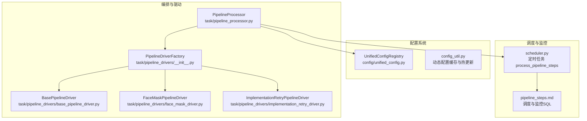
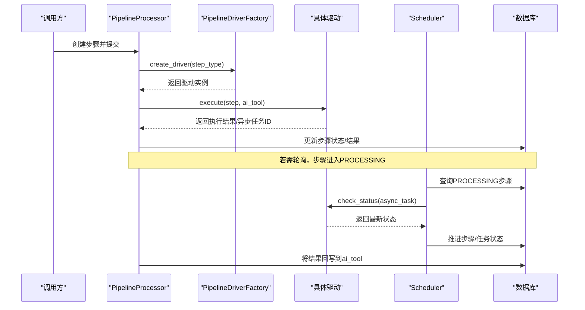
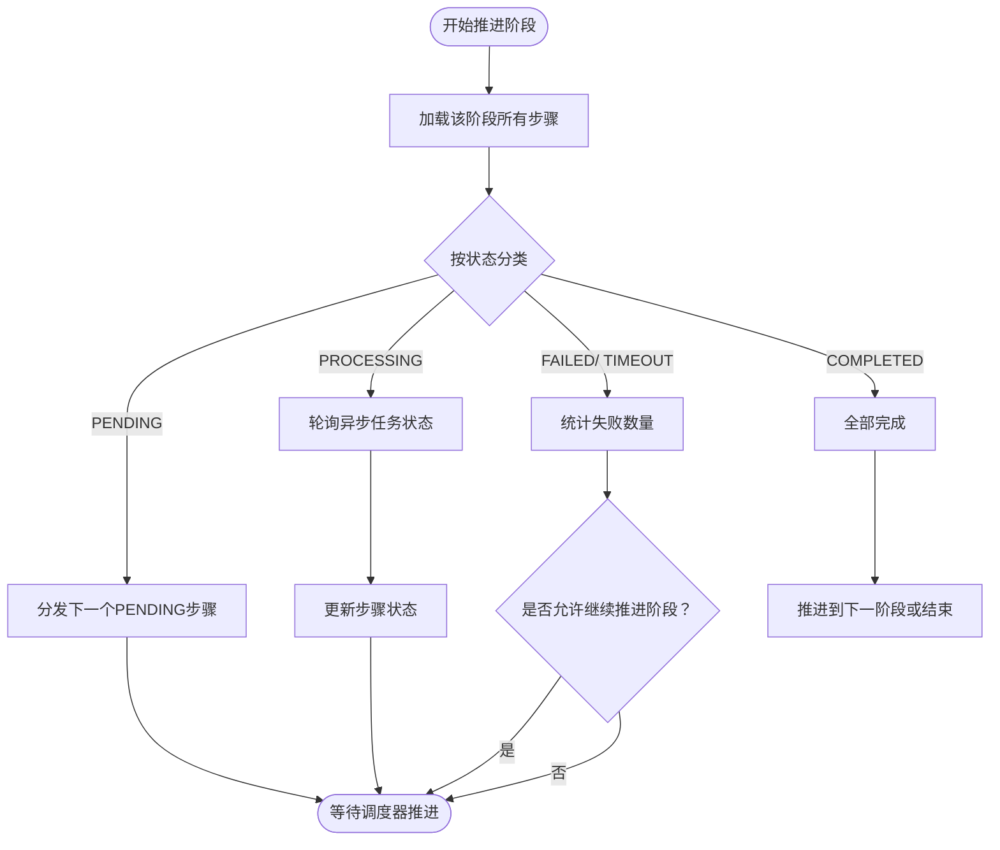
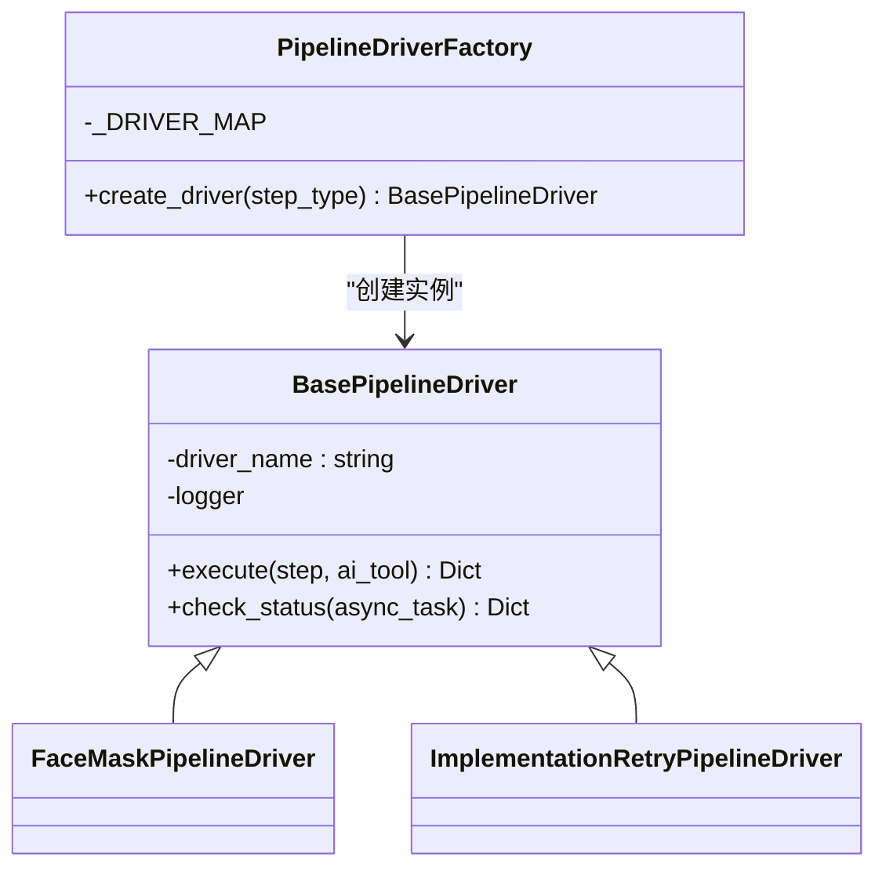
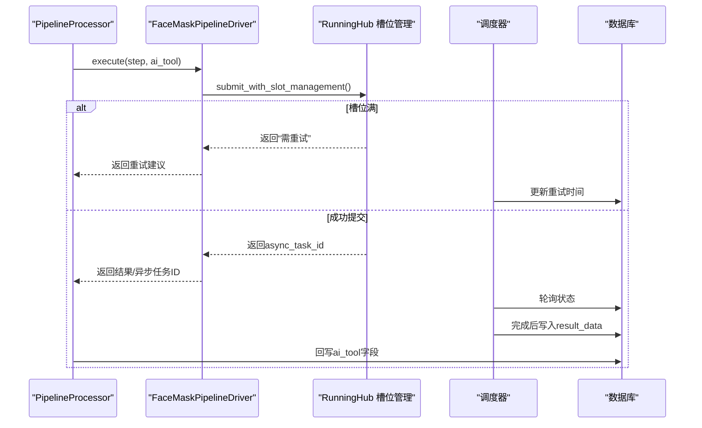
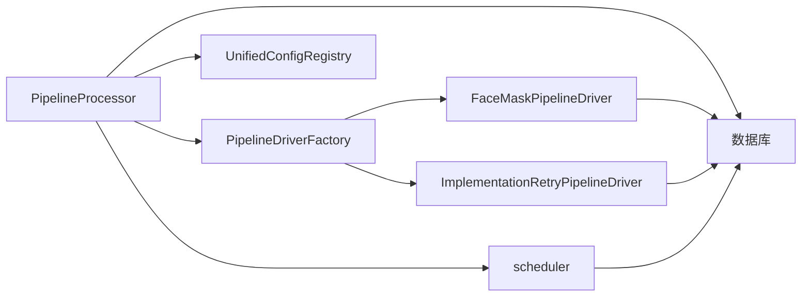

# 管道处理器

<cite>
**本文引用的文件**
- [pipeline_steps.md](file://docs/backend/pipeline_steps.md)
- [pipeline_processor.py](file://task/pipeline_processor.py)
- [base_pipeline_driver.py](file://task/pipeline_drivers/base_pipeline_driver.py)
- [face_mask_driver.py](file://task/pipeline_drivers/face_mask_driver.py)
- [implementation_retry_driver.py](file://task/pipeline_drivers/implementation_retry_driver.py)
- [__init__.py（驱动工厂）](file://task/pipeline_drivers/__init__.py)
- [scheduler.py](file://task/scheduler.py)
- [unified_config.py](file://config/unified_config.py)
- [config_util.py](file://config/config_util.py)
- [test_pipeline_processor.py](file://tests/task/test_pipeline_processor.py)
- [test_pipeline_drivers.py](file://tests/drivers/test_pipeline_drivers.py)
- [test_pipeline_step_model.py](file://tests/model/test_pipeline_step_model.py)
</cite>

## 目录
1. [简介](#简介)
2. [项目结构](#项目结构)
3. [核心组件](#核心组件)
4. [架构总览](#架构总览)
5. [详细组件分析](#详细组件分析)
6. [依赖分析](#依赖分析)
7. [性能考虑](#性能考虑)
8. [故障排查指南](#故障排查指南)
9. [结论](#结论)
10. [附录](#附录)

## 简介
本文件系统化梳理“管道处理器”架构，围绕以下目标展开：步骤解析与执行机制（含依赖与顺序控制）、驱动程序设计模式（抽象基类与具体实现）、状态管理与进度跟踪、错误传播与重试、动态配置的加载与热更新、性能优化与并发控制、以及扩展开发指南（自定义步骤的实现与集成）。文档基于仓库中现有实现进行归纳总结，并通过图示与来源标注帮助读者快速定位到实际代码位置。

## 项目结构
与管道处理器相关的关键目录与文件如下：
- 文档：docs/backend/pipeline_steps.md（步骤说明、调度与监控 SQL）
- 编排器：task/pipeline_processor.py（核心编排逻辑）
- 驱动层：task/pipeline_drivers/*（工厂、抽象基类、具体驱动）
- 调度器：task/scheduler.py（定时轮询与状态推进）
- 配置系统：config/unified_config.py、config/config_util.py（动态配置与热更新）
- 测试：tests/task/test_pipeline_processor.py、tests/drivers/test_pipeline_drivers.py、tests/model/test_pipeline_step_model.py（行为验证）



**图表来源**
- [pipeline_processor.py:1-120](file://task/pipeline_processor.py#L1-L120)
- [__init__.py（驱动工厂）:1-47](file://task/pipeline_drivers/__init__.py#L1-L47)
- [base_pipeline_driver.py:1-46](file://task/pipeline_drivers/base_pipeline_driver.py#L1-L46)
- [face_mask_driver.py](file://task/pipeline_drivers/face_mask_driver.py)
- [implementation_retry_driver.py](file://task/pipeline_drivers/implementation_retry_driver.py)
- [unified_config.py](file://config/unified_config.py)
- [config_util.py:397-432](file://config/config_util.py#L397-L432)
- [scheduler.py](file://task/scheduler.py)
- [pipeline_steps.md:134-180](file://docs/backend/pipeline_steps.md#L134-L180)

**章节来源**
- [pipeline_steps.md:97-180](file://docs/backend/pipeline_steps.md#L97-L180)
- [pipeline_processor.py:1-120](file://task/pipeline_processor.py#L1-L120)
- [__init__.py（驱动工厂）:1-47](file://task/pipeline_drivers/__init__.py#L1-L47)

## 核心组件
- PipelineProcessor：编排器，负责步骤创建、分发、状态轮询与结果回写；支持槽位满时自动重试安排。
- PipelineDriverFactory：驱动工厂，按步骤类型映射到具体驱动实现。
- BasePipelineDriver：驱动抽象基类，定义 execute/check_status 等接口契约。
- 具体驱动：如 FaceMaskPipelineDriver（人脸遮盖）、ImplementationRetryPipelineDriver（实现方重试）。
- 调度器 scheduler：定时扫描 PROCESSING 步骤，推进状态并处理异步任务。
- 配置系统：UnifiedConfigRegistry 提供统一配置与实现方信息；config_util 支持动态配置缓存与热更新。

**章节来源**
- [pipeline_processor.py:24-120](file://task/pipeline_processor.py#L24-L120)
- [__init__.py（驱动工厂）:29-47](file://task/pipeline_drivers/__init__.py#L29-L47)
- [base_pipeline_driver.py:15-46](file://task/pipeline_drivers/base_pipeline_driver.py#L15-L46)
- [scheduler.py](file://task/scheduler.py)
- [unified_config.py](file://config/unified_config.py)
- [config_util.py:397-432](file://config/config_util.py#L397-L432)

## 架构总览
管道处理器采用“编排器 + 工厂 + 抽象驱动 + 具体驱动 + 调度器 + 配置系统”的分层架构。编排器统一调度步骤生命周期，工厂负责驱动实例化，抽象基类约束驱动行为，具体驱动封装外部服务交互，调度器周期性推进状态，配置系统提供动态参数与实现方信息。



**图表来源**
- [pipeline_processor.py:92-120](file://task/pipeline_processor.py#L92-L120)
- [__init__.py（驱动工厂）:32-47](file://task/pipeline_drivers/__init__.py#L32-L47)
- [scheduler.py](file://task/scheduler.py)
- [pipeline_steps.md:134-180](file://docs/backend/pipeline_steps.md#L134-L180)

## 详细组件分析

### 编排器 PipelineProcessor
- 职责
  - 创建 param_prepare/before_finish 步骤（委托工厂）
  - 分发步骤给对应驱动执行
  - 处理 PROCESSING 步骤，推进状态
  - 将步骤结果应用回 ai_tool
- 关键机制
  - 步骤状态推进：统计 PENDING/PROCESSING/CHECKING/COMPLETED/FAILED/TIMEOUT，决定是否继续分发或推进阶段
  - 槽位满自动重试：当驱动提示槽位满时，编排器记录重试时间并等待调度器推进
  - 结果回写：将步骤 result_data 应用到 ai_tool 字段，驱动完成后再由上层流程继续
- 错误处理
  - 未知步骤类型：直接标记 FAILED 并记录错误消息
  - 超时与失败：纳入统计并参与阶段推进决策



**图表来源**
- [pipeline_processor.py:361-388](file://task/pipeline_processor.py#L361-L388)
- [pipeline_steps.md:134-180](file://docs/backend/pipeline_steps.md#L134-L180)

**章节来源**
- [pipeline_processor.py:24-120](file://task/pipeline_processor.py#L24-L120)
- [pipeline_processor.py:361-388](file://task/pipeline_processor.py#L361-L388)
- [test_pipeline_processor.py:68-98](file://tests/task/test_pipeline_processor.py#L68-L98)

### 驱动工厂与抽象基类
- PipelineDriverFactory
  - 通过映射表将 step_type 映射到具体驱动类
  - 未知类型返回 None 并记录告警
- BasePipelineDriver
  - 定义 execute(step, ai_tool) 与可选 check_status
  - 统一日志命名空间，便于追踪



**图表来源**
- [base_pipeline_driver.py:15-46](file://task/pipeline_drivers/base_pipeline_driver.py#L15-L46)
- [__init__.py（驱动工厂）:29-47](file://task/pipeline_drivers/__init__.py#L29-L47)
- [face_mask_driver.py](file://task/pipeline_drivers/face_mask_driver.py)
- [implementation_retry_driver.py](file://task/pipeline_drivers/implementation_retry_driver.py)

**章节来源**
- [__init__.py（驱动工厂）:22-47](file://task/pipeline_drivers/__init__.py#L22-L47)
- [base_pipeline_driver.py:15-46](file://task/pipeline_drivers/base_pipeline_driver.py#L15-L46)
- [test_pipeline_drivers.py:55-65](file://tests/drivers/test_pipeline_drivers.py#L55-L65)

### 具体驱动实现

#### 人脸遮盖驱动（FaceMaskPipelineDriver）
- 触发条件：AI 工具完成参数准备后进入执行阶段
- 处理流程要点
  - 通过 RunningHub 槽位管理提交任务
  - 槽位满时自动安排指数退避重试（30s → 60s → 120s → 300s）
  - 后台任务 process_pending_async_task_submissions 负责重试提交
  - process_runninghub_async_tasks 轮询 async_task 状态
  - 完成后将遮盖后的视频 URL 写入 step.result_data，并回写 ai_tool.video_path



**图表来源**
- [pipeline_steps.md:97-118](file://docs/backend/pipeline_steps.md#L97-L118)
- [scheduler.py](file://task/scheduler.py)
- [pipeline_processor.py:92-120](file://task/pipeline_processor.py#L92-L120)

**章节来源**
- [pipeline_steps.md:97-118](file://docs/backend/pipeline_steps.md#L97-L118)

#### 实现方重试驱动（ImplementationRetryPipelineDriver）
- 触发条件：主任务失败且存在替代实现方
- 处理流程要点
  - 从 UnifiedConfigRegistry 获取同任务类型的可用实现方列表
  - 排除已失败实现方，最多选择 3 个替代实现方
  - 为每个替代实现方创建 implementation_retry 步骤
  - 执行时更新 ai_tool.implementation 为目标实现方
  - 将 ai_tool 状态设回 PENDING，主流程自动重新提交
  - 若槽位满，步骤会自动安排重试（由 PipelineProcessor 调度）

```mermaid
flowchart TD
Start(["主任务失败"]) --> GetImpls["从配置系统获取可用实现方"]
GetImpls --> Filter["排除已失败实现方"]
Filter --> Select["最多选择3个替代实现方"]
Select --> CreateSteps["为每个实现方创建implementation_retry步骤"]
CreateSteps --> Exec["执行步骤：更新implementation并设为PENDING"]
Exec --> Retry["由调度器推进重试"]
Retry --> End(["主流程自动重新提交")]
```

**图表来源**
- [pipeline_steps.md:106-118](file://docs/backend/pipeline_steps.md#L106-L118)
- [unified_config.py](file://config/unified_config.py)

**章节来源**
- [pipeline_steps.md:106-118](file://docs/backend/pipeline_steps.md#L106-L118)

### 步骤依赖关系与执行顺序
- 阶段顺序：param_prepare → processing → before_finish
- 同阶段内按 step_order 升序执行
- 统计逻辑：对 PENDING/PROCESSING/CHECKING/COMPLETED/FAILED/TIMEOUT 进行分类，决定是否继续分发或推进阶段
- 依赖体现：param_prepare 阶段完成后才进入 processing；processing 全部完成后才进入 before_finish

**章节来源**
- [test_pipeline_step_model.py:176-204](file://tests/model/test_pipeline_step_model.py#L176-L204)
- [pipeline_processor.py:361-388](file://task/pipeline_processor.py#L361-L388)

### 状态管理、进度跟踪与错误传播
- 状态枚举：PENDING、PROCESSING、CHECKING、COMPLETED、FAILED、TIMEOUT
- 进度跟踪：编排器统计各状态数量，决定下一步动作
- 错误传播：未知步骤类型直接标记 FAILED；失败/超时纳入统计并影响阶段推进
- 重启恢复：服务重启时，将 WAITING_PARAM_PREPARE/WAITING_BEFORE_FINISH 重置为 PENDING，交由调度器恢复

**章节来源**
- [pipeline_steps.md:134-180](file://docs/backend/pipeline_steps.md#L134-L180)
- [pipeline_processor.py:92-120](file://task/pipeline_processor.py#L92-L120)

### 动态配置的加载与热更新
- UnifiedConfigRegistry：提供统一配置注册与查询能力，驱动实现方选择与参数下发
- config_util：提供动态配置缓存与热更新接口
  - invalidate_dynamic_cache：按环境+键清理缓存
  - reload_all_dynamic_configs：清空缓存并重新加载
- 管道侧使用：驱动在执行前从配置系统读取实现方列表与参数，确保热更新生效

**章节来源**
- [unified_config.py](file://config/unified_config.py)
- [config_util.py:397-432](file://config/config_util.py#L397-L432)

## 依赖分析
- 编排器依赖驱动工厂与具体驱动；驱动依赖配置系统与外部服务；调度器依赖数据库与驱动状态查询；测试覆盖编排器、驱动工厂与步骤模型的行为。



**图表来源**
- [pipeline_processor.py:1-120](file://task/pipeline_processor.py#L1-L120)
- [__init__.py（驱动工厂）:1-47](file://task/pipeline_drivers/__init__.py#L1-L47)
- [scheduler.py](file://task/scheduler.py)

**章节来源**
- [test_pipeline_processor.py:75-98](file://tests/task/test_pipeline_processor.py#L75-L98)
- [test_pipeline_drivers.py:55-65](file://tests/drivers/test_pipeline_drivers.py#L55-L65)
- [test_pipeline_step_model.py:176-204](file://tests/model/test_pipeline_step_model.py#L176-L204)

## 性能考虑
- 并发与槽位控制：人脸遮盖驱动通过 RunningHub 槽位管理限制并发，避免资源争用；槽位满时采用指数退避重试，降低抖动。
- 轮询频率：调度器每 10 秒扫描一次 PROCESSING 步骤，平衡实时性与系统负载。
- 批量推进：编排器按阶段统计与分发，减少无效调用。
- 动态配置缓存：通过缓存与热更新机制降低频繁查询成本，同时保证配置变更生效。

[本节为通用性能讨论，不直接分析具体文件]

## 故障排查指南
- 常见问题
  - 未知步骤类型：编排器会直接标记 FAILED 并记录错误消息，检查驱动工厂映射与步骤类型
  - 步骤长时间处于 PROCESSING：查看调度器轮询与异步任务状态，确认外部服务响应
  - 重试堆积：检查 next_retry_at 与 max_retries，确认指数退避是否正确
  - 重启后任务停滞：确认服务重启恢复逻辑是否将 WAITING_* 状态重置为 PENDING
- 监控 SQL
  - 当前流水线步骤状态分布
  - 卡住的步骤（PROCESSING 超过 10 分钟）
  - 待重试的步骤

**章节来源**
- [pipeline_steps.md:145-173](file://docs/backend/pipeline_steps.md#L145-L173)
- [pipeline_processor.py:92-120](file://task/pipeline_processor.py#L92-L120)

## 结论
管道处理器通过“编排器 + 工厂 + 抽象驱动 + 具体驱动 + 调度器 + 配置系统”的协同，实现了步骤的有序执行、状态推进、错误处理与动态配置热更新。人脸遮盖与实现方重试两个具体驱动展示了槽位管理、指数退避与替代实现的工程实践。整体架构具备良好的扩展性，便于新增自定义步骤与驱动。

[本节为总结性内容，不直接分析具体文件]

## 附录

### 扩展开发指南：自定义步骤与驱动
- 设计步骤
  - 在数据库中定义步骤类型与阶段（param_prepare/before_finish），设置 step_order 控制顺序
  - 使用 PipelineDriverFactory 注册新步骤类型到具体驱动类
- 实现驱动
  - 继承 BasePipelineDriver，实现 execute 与可选 check_status
  - 在 execute 中处理参数准备、外部服务调用与结果回写
  - 如涉及异步任务，确保返回 async_task_id 并由调度器轮询
- 集成与测试
  - 在编排器中委托工厂创建步骤
  - 编写单元测试与集成测试，覆盖正常路径、异常与重试场景

**章节来源**
- [base_pipeline_driver.py:15-46](file://task/pipeline_drivers/base_pipeline_driver.py#L15-L46)
- [__init__.py（驱动工厂）:22-47](file://task/pipeline_drivers/__init__.py#L22-L47)
- [test_pipeline_drivers.py:55-65](file://tests/drivers/test_pipeline_drivers.py#L55-L65)