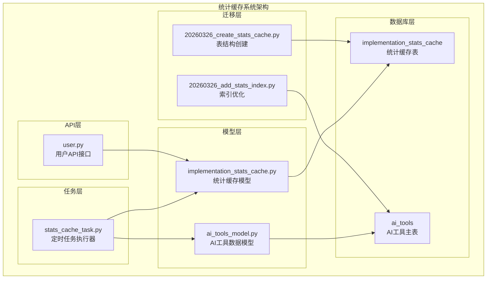
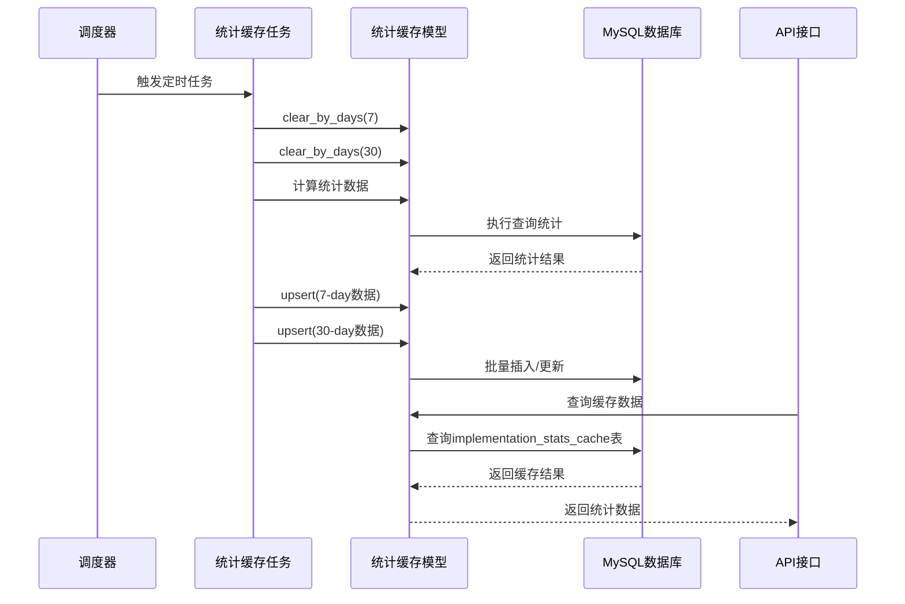
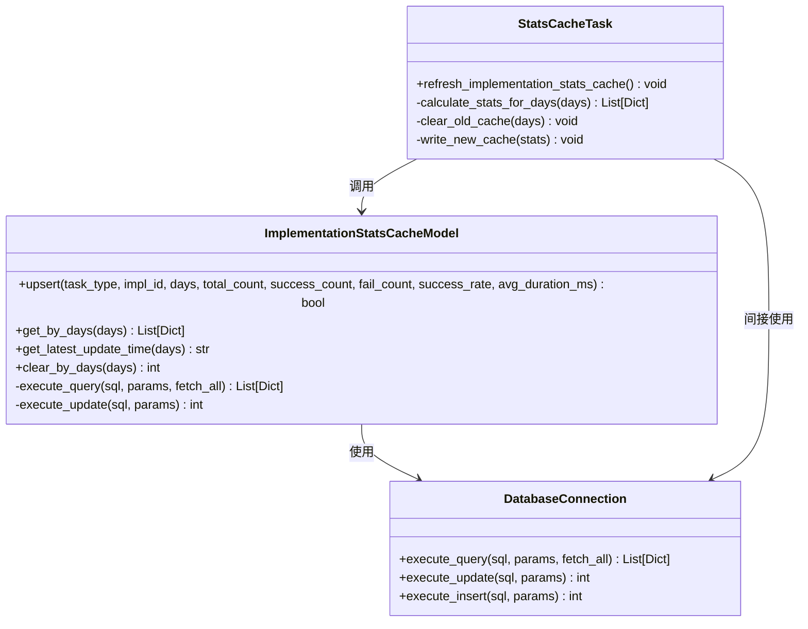
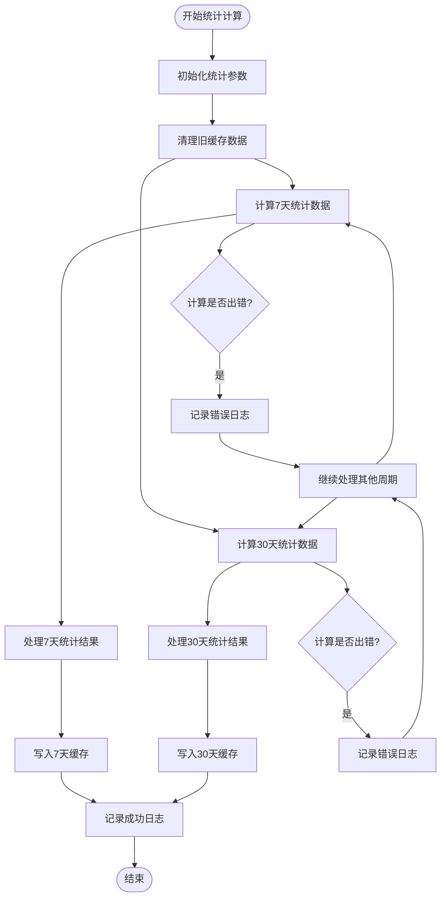
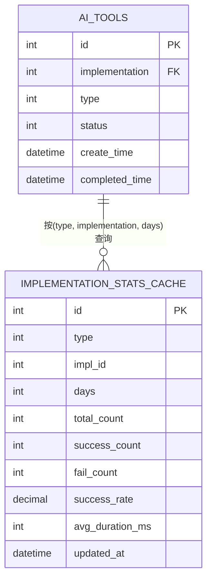
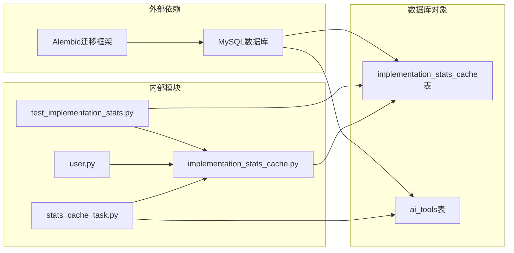
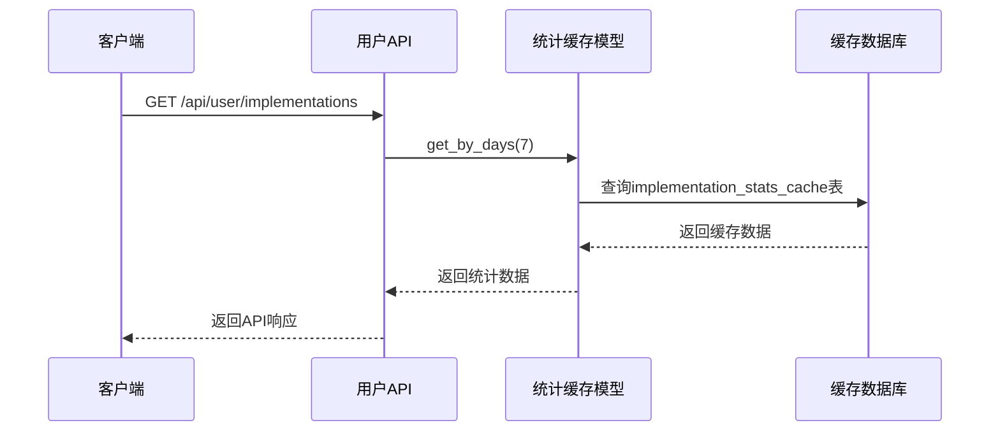

# 统计缓存系统

<cite>
**本文档引用的文件**
- [stats_cache_task.py](file://task/stats_cache_task.py)
- [implementation_stats_cache.py](file://model/implementation_stats_cache.py)
- [20260326_create_stats_cache.py](file://alembic/versions/20260326_create_stats_cache.py)
- [20260326_add_stats_index.py](file://alembic/versions/20260326_add_stats_index.py)
- [test_implementation_stats.py](file://tests/stats/test_implementation_stats.py)
- [user.py](file://api/user.py)
</cite>

## 目录
1. [简介](#简介)
2. [项目结构](#项目结构)
3. [核心组件](#核心组件)
4. [架构概览](#架构概览)
5. [详细组件分析](#详细组件分析)
6. [依赖关系分析](#依赖关系分析)
7. [性能考虑](#性能考虑)
8. [故障排除指南](#故障排除指南)
9. [结论](#结论)
10. [附录](#附录)

## 简介

统计缓存系统是本项目中的一个关键性能优化模块，专门用于缓存AI工具实现方的统计数据，避免每次API请求都需要扫描大型的ai_tools表。该系统通过定时任务计算和缓存统计数据，显著提升了查询性能并降低了数据库负载。

系统主要包含以下功能特性：
- 支持7天和30天两种统计周期的数据缓存
- 实现方统计数据的自动计算和更新
- 高效的查询接口和缓存失效机制
- 完整的错误处理和日志记录
- 数据库索引优化以提升查询性能

## 项目结构

统计缓存系统在项目中的组织结构如下：

**图表来源**
- [stats_cache_task.py:1-52](file://task/stats_cache_task.py#L1-L52)
- [implementation_stats_cache.py:1-142](file://model/implementation_stats_cache.py#L1-L142)

**章节来源**
- [stats_cache_task.py:1-52](file://task/stats_cache_task.py#L1-L52)
- [implementation_stats_cache.py:1-142](file://model/implementation_stats_cache.py#L1-L142)

## 核心组件

### 统计缓存模型 (ImplementationStatsCacheModel)

统计缓存的核心数据访问层，提供了完整的CRUD操作和查询功能：

| 方法 | 参数 | 返回值 | 功能描述 |
|------|------|--------|----------|
| upsert | task_type, impl_id, days, total_count, success_count, fail_count, success_rate, avg_duration_ms | bool | 插入或更新缓存记录 |
| get_by_days | days | List[Dict] | 按天数获取缓存统计数据 |
| get_latest_update_time | days | str | 获取指定天数缓存的最新更新时间 |
| clear_by_days | days | int | 清除指定天数的缓存记录 |

### 定时任务处理器 (refresh_implementation_stats_cache)

负责执行统计缓存的定时更新任务：

- **执行频率**: 每天定时执行
- **统计周期**: 同时计算7天和30天两个时间范围
- **缓存策略**: 先清理旧数据，再写入新计算结果
- **错误处理**: 完善的异常捕获和日志记录

### 数据库表结构

统计缓存表采用MySQL存储，具有以下关键字段：

| 字段名 | 类型 | 约束 | 描述 |
|--------|------|------|------|
| id | int | PRIMARY KEY, AUTO_INCREMENT | 主键标识符 |
| type | int | NOT NULL | 任务类型ID |
| impl_id | int | NOT NULL | implementation ID |
| days | int | NOT NULL | 统计天数 |
| total_count | int | NOT NULL DEFAULT 0 | 总任务数 |
| success_count | int | NOT NULL DEFAULT 0 | 成功任务数 |
| fail_count | int | NOT NULL DEFAULT 0 | 失败任务数 |
| success_rate | decimal(5,2) | NOT NULL DEFAULT 0.00 | 成功率百分比 |
| avg_duration_ms | int | NOT NULL DEFAULT 0 | 平均耗时(毫秒) |
| updated_at | datetime | NOT NULL DEFAULT CURRENT_TIMESTAMP | 更新时间戳 |

**章节来源**
- [implementation_stats_cache.py:11-141](file://model/implementation_stats_cache.py#L11-L141)
- [stats_cache_task.py:13-51](file://task/stats_cache_task.py#L13-L51)

## 架构概览

统计缓存系统采用分层架构设计，确保了良好的可维护性和扩展性：

**图表来源**
- [stats_cache_task.py:13-51](file://task/stats_cache_task.py#L13-L51)
- [implementation_stats_cache.py:14-58](file://model/implementation_stats_cache.py#L14-L58)

系统的关键设计原则：

1. **缓存优先**: 所有查询优先从缓存表获取数据
2. **定时更新**: 通过定时任务确保缓存数据的时效性
3. **批量处理**: 支持批量插入和更新操作
4. **错误隔离**: 完善的异常处理机制
5. **性能优化**: 数据库索引和查询优化

## 详细组件分析

### 统计缓存模型类图

**图表来源**
- [implementation_stats_cache.py:11-141](file://model/implementation_stats_cache.py#L11-L141)
- [stats_cache_task.py:13-51](file://task/stats_cache_task.py#L13-L51)

### 统计计算流程

系统支持两种统计周期的并行计算：

**图表来源**
- [stats_cache_task.py:22-49](file://task/stats_cache_task.py#L22-L49)

### 数据查询优化

系统通过数据库索引优化查询性能：

**图表来源**
- [20260326_add_stats_index.py:22-25](file://alembic/versions/20260326_add_stats_index.py#L22-L25)
- [implementation_stats_cache.py:126-140](file://model/implementation_stats_cache.py#L126-L140)

**章节来源**
- [implementation_stats_cache.py:11-141](file://model/implementation_stats_cache.py#L11-L141)
- [stats_cache_task.py:13-51](file://task/stats_cache_task.py#L13-L51)

## 依赖关系分析

统计缓存系统的依赖关系清晰明确，遵循了分层架构的最佳实践：

**图表来源**
- [stats_cache_task.py:7-8](file://task/stats_cache_task.py#L7-L8)
- [implementation_stats_cache.py:4-5](file://model/implementation_stats_cache.py#L4-L5)

### 关键依赖点

1. **数据库连接**: 通过统一的数据库抽象层进行数据访问
2. **定时调度**: 依赖系统定时任务框架
3. **API集成**: 与用户API接口无缝集成
4. **测试覆盖**: 完整的单元测试和集成测试

**章节来源**
- [stats_cache_task.py:6-8](file://task/stats_cache_task.py#L6-L8)
- [implementation_stats_cache.py:4-6](file://model/implementation_stats_cache.py#L4-L6)

## 性能考虑

### 查询性能优化

系统采用了多层次的性能优化策略：

1. **数据库索引优化**
   - 复合索引 `(implementation, type, status, create_time)`
   - 唯一约束 `uk_type_impl_days` 防止重复数据
   - 索引优化显著提升了统计查询性能

2. **缓存策略**
   - 7天和30天双周期缓存
   - 定时批量更新，减少实时计算开销
   - 缓存命中率高，数据库压力显著降低

3. **批量处理**
   - 支持批量插入和更新操作
   - 减少数据库往返次数
   - 提升整体处理效率

### 内存管理策略

1. **渐进式数据处理**
   - 分批处理统计结果，避免内存峰值
   - 及时释放临时数据结构
   - 控制单次操作的数据量

2. **连接池管理**
   - 合理复用数据库连接
   - 及时关闭不再使用的连接
   - 避免连接泄漏

### 扩展性考虑

1. **水平扩展**
   - 支持多实例部署
   - 缓存数据无状态设计
   - 可通过增加实例提升处理能力

2. **垂直扩展**
   - 可根据需要调整统计周期
   - 支持新增统计指标
   - 灵活的配置参数

## 故障排除指南

### 常见问题及解决方案

| 问题类型 | 症状 | 可能原因 | 解决方案 |
|----------|------|----------|----------|
| 缓存未更新 | API返回旧数据 | 定时任务失败 | 检查任务日志，重启任务服务 |
| 查询超时 | 统计查询响应慢 | 缺少数据库索引 | 运行数据库迁移脚本 |
| 内存溢出 | 统计任务崩溃 | 大量数据处理 | 优化数据分批处理逻辑 |
| 数据不一致 | 缓存与源数据不符 | 缓存更新异常 | 清理缓存后重新计算 |

### 错误监控和日志

系统提供了完善的错误监控机制：

1. **详细日志记录**
   - 任务执行状态日志
   - 错误堆栈跟踪
   - 性能指标监控

2. **告警机制**
   - 定时任务失败告警
   - 数据库连接异常告警
   - 缓存更新延迟告警

**章节来源**
- [stats_cache_task.py:46-49](file://task/stats_cache_task.py#L46-L49)
- [implementation_stats_cache.py:56-58](file://model/implementation_stats_cache.py#L56-L58)

## 结论

统计缓存系统通过合理的架构设计和性能优化，在保证数据准确性的同时，显著提升了系统的整体性能。系统的主要优势包括：

1. **高性能**: 通过缓存机制和数据库索引优化，查询性能提升显著
2. **可靠性**: 完善的错误处理和监控机制确保系统稳定运行
3. **可扩展性**: 模块化设计支持功能扩展和性能优化
4. **易维护性**: 清晰的代码结构和完整的测试覆盖

该系统为类似的数据统计场景提供了优秀的参考实现，其设计理念和优化策略值得在其他项目中借鉴。

## 附录

### API接口集成

统计缓存系统与API接口的集成方式：

**图表来源**
- [user.py:79-80](file://api/user.py#L79-L80)
- [implementation_stats_cache.py:61-81](file://model/implementation_stats_cache.py#L61-L81)

### 数据迁移和版本控制

系统通过Alembic框架管理数据库结构变更：

1. **表结构创建**: 定义统计缓存表的完整结构
2. **索引优化**: 添加复合查询索引提升性能
3. **版本管理**: 支持数据库结构的版本升级和降级

**章节来源**
- [20260326_create_stats_cache.py:22-37](file://alembic/versions/20260326_create_stats_cache.py#L22-L37)
- [20260326_add_stats_index.py:21-25](file://alembic/versions/20260326_add_stats_index.py#L21-L25)