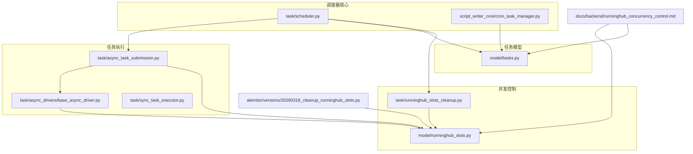
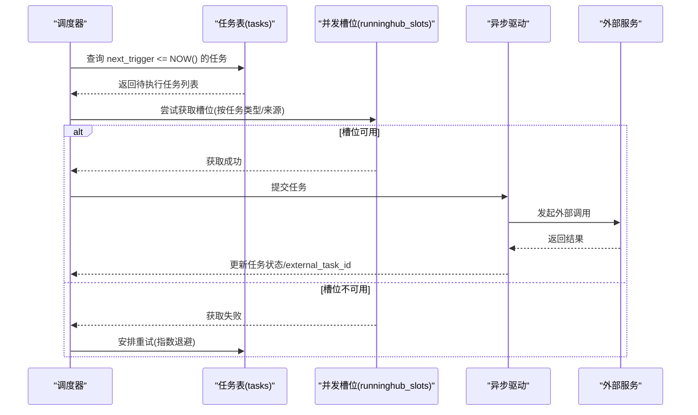
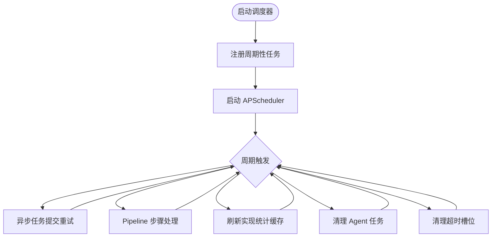
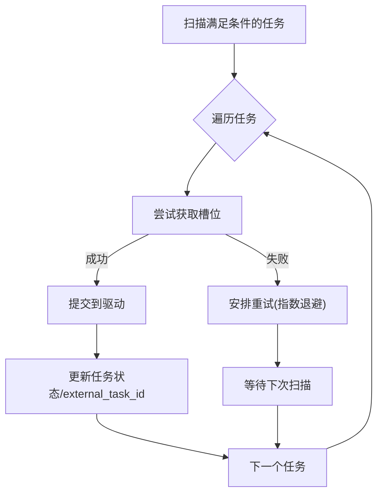
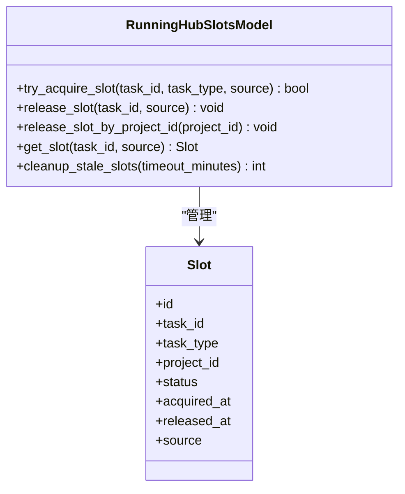
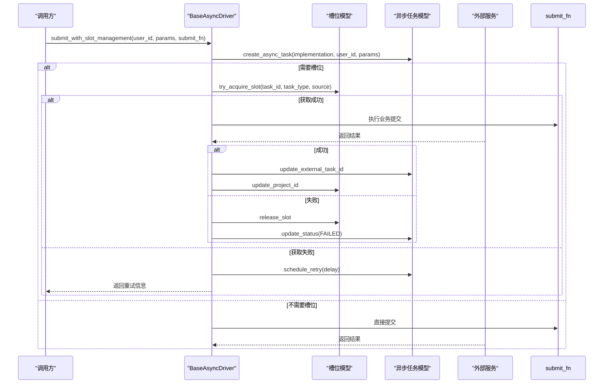
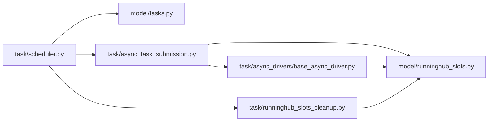

# 调度器系统

<cite>
**本文引用的文件**
- [scheduler.py](file://task/scheduler.py)
- [cron_task_manager.py](file://script_writer_core/cron_task_manager.py)
- [async_task_submission.py](file://task/async_task_submission.py)
- [base_async_driver.py](file://task/async_drivers/base_async_driver.py)
- [runninghub_slots.py](file://model/runninghub_slots.py)
- [runninghub_slots_cleanup.py](file://task/runninghub_slots_cleanup.py)
- [tasks.py](file://model/tasks.py)
- [runninghub_concurrency_control.md](file://docs/backend/runninghub_concurrency_control.md)
- [20260318_cleanup_runninghub_slots.py](file://alembic/versions/20260318_cleanup_runninghub_slots.py)
- [run_scheduler.py](file://scripts/launchers/run_scheduler.py)
</cite>

## 目录
1. [简介](#简介)
2. [项目结构](#项目结构)
3. [核心组件](#核心组件)
4. [架构总览](#架构总览)
5. [详细组件分析](#详细组件分析)
6. [依赖关系分析](#依赖关系分析)
7. [性能考虑](#性能考虑)
8. [故障排除指南](#故障排除指南)
9. [结论](#结论)
10. [附录](#附录)

## 简介
本文件系统性阐述调度器系统的架构与实现，重点覆盖以下方面：
- 定时任务调度机制：任务扫描、执行时机与并发控制
- 调度器启动流程、配置管理与健康检查
- 不同类型任务的调度策略：周期性、一次性与条件触发
- 扩展性设计：任务优先级与负载均衡策略
- 监控指标、性能分析与故障诊断
- 运维指南与故障排除技巧

调度器系统以 APScheduler 为核心，结合数据库驱动的任务表与 RunningHub 并发槽位模型，实现高可靠、可扩展的任务调度与执行。

## 项目结构
调度器相关代码主要分布在以下模块：
- 任务调度核心：task/scheduler.py
- 脚本写作者定时任务管理：script_writer_core/cron_task_manager.py
- 异步任务提交与重试：task/async_task_submission.py、task/async_drivers/base_async_driver.py
- 并发槽位管理与清理：model/runninghub_slots.py、task/runninghub_slots_cleanup.py
- 通用任务模型：model/tasks.py
- 文档与迁移：docs/backend/runninghub_concurrency_control.md、alembic/versions/20260318_cleanup_runninghub_slots.py
- 启动脚本：scripts/launchers/run_scheduler.py

**图表来源**
- [scheduler.py](file://task/scheduler.py)
- [cron_task_manager.py](file://script_writer_core/cron_task_manager.py)
- [async_task_submission.py](file://task/async_task_submission.py)
- [base_async_driver.py](file://task/async_drivers/base_async_driver.py)
- [runninghub_slots.py](file://model/runninghub_slots.py)
- [runninghub_slots_cleanup.py](file://task/runninghub_slots_cleanup.py)
- [tasks.py](file://model/tasks.py)
- [runninghub_concurrency_control.md](file://docs/backend/runninghub_concurrency_control.md)
- [20260318_cleanup_runninghub_slots.py](file://alembic/versions/20260318_cleanup_runninghub_slots.py)

**章节来源**
- [scheduler.py](file://task/scheduler.py)
- [cron_task_manager.py](file://script_writer_core/cron_task_manager.py)
- [runninghub_concurrency_control.md](file://docs/backend/runninghub_concurrency_control.md)

## 核心组件
- 调度器内核：基于 APScheduler 的周期性任务注册与执行，包含异步任务提交重试、Pipeline 步骤处理、统计数据缓存刷新、槽位清理等定时任务。
- 任务模型：tasks 表承载任务元数据（类型、状态、下次触发时间、重试计数等），支持按条件扫描与排序。
- 并发槽位模型：runninghub_slots 表与清理任务，保障对外部资源的并发访问控制与超时恢复。
- 异步任务提交：统一入口封装槽位申请、异常释放与重试逻辑，支持指数退避。
- 脚本写作者定时任务：BackgroundScheduler 实现的轻量级定时任务管理，支持任务锁与全局锁。

**章节来源**
- [scheduler.py](file://task/scheduler.py)
- [tasks.py](file://model/tasks.py)
- [runninghub_slots.py](file://model/runninghub_slots.py)
- [async_task_submission.py](file://task/async_task_submission.py)
- [base_async_driver.py](file://task/async_drivers/base_async_driver.py)
- [cron_task_manager.py](file://script_writer_core/cron_task_manager.py)

## 架构总览
调度器采用“数据库驱动 + 并发槽位控制”的双层架构：
- 数据库驱动层：通过 tasks 表记录任务生命周期，调度器周期扫描满足条件的任务并执行。
- 并发控制层：通过 runninghub_slots 表对外部资源进行统一的并发配额管理，避免超卖与阻塞。

**图表来源**
- [scheduler.py](file://task/scheduler.py)
- [async_task_submission.py](file://task/async_task_submission.py)
- [base_async_driver.py](file://task/async_drivers/base_async_driver.py)
- [runninghub_slots.py](file://model/runninghub_slots.py)

## 详细组件分析

### 调度器内核（APScheduler）
- 启动与关闭：在启动时注册多个周期性任务，并在关闭时优雅停止同步执行器与调度器。
- 任务注册：
  - 异步任务提交重试：每固定间隔扫描待提交任务，自动处理槽位满与重试。
  - Pipeline 步骤处理：定期处理待处理的流水线步骤。
  - 统计缓存刷新：周期性刷新实现统计缓存。
  - Agent 任务清理：定期清理历史任务与消息。
  - RunningHub 槽位清理：定期清理超时槽位。
- 并发与合并：使用 max_instances=1 与 coalesce=True 确保单实例执行与任务合并。

**图表来源**
- [scheduler.py](file://task/scheduler.py)

**章节来源**
- [scheduler.py](file://task/scheduler.py)

### 任务扫描与执行时机
- 扫描条件：按 next_trigger <= NOW() 进行筛选，避免提前执行。
- 排序策略：按 next_trigger 升序，确保最早到期的任务优先。
- 执行策略：逐条尝试获取并发槽位；若不可用，则安排重试（指数退避）；成功后提交至外部驱动。

**图表来源**
- [tasks.py](file://model/tasks.py)
- [async_task_submission.py](file://task/async_task_submission.py)

**章节来源**
- [tasks.py](file://model/tasks.py)
- [async_task_submission.py](file://task/async_task_submission.py)

### 并发控制与槽位管理
- 槽位模型：runninghub_slots 表记录任务与外部项目的映射关系，支持按来源(source)与任务类型(task_type)区分。
- 获取与释放：提交前尝试获取，失败则延迟重试；异常或失败时释放槽位；完成时更新外部任务ID。
- 超时清理：定时任务清理超过阈值（默认2小时）仍处于“处理中”的槽位，避免资源泄漏。
- 迁移修复：历史槽位泄漏通过迁移脚本批量释放。

**图表来源**
- [runninghub_slots.py](file://model/runninghub_slots.py)
- [runninghub_slots_cleanup.py](file://task/runninghub_slots_cleanup.py)
- [20260318_cleanup_runninghub_slots.py](file://alembic/versions/20260318_cleanup_runninghub_slots.py)

**章节来源**
- [runninghub_slots.py](file://model/runninghub_slots.py)
- [runninghub_slots_cleanup.py](file://task/runninghub_slots_cleanup.py)
- [runninghub_concurrency_control.md](file://docs/backend/runninghub_concurrency_control.md)
- [20260318_cleanup_runninghub_slots.py](file://alembic/versions/20260318_cleanup_runninghub_slots.py)

### 异步任务提交与重试
- 统一入口：submit_with_slot_management 自动处理 async_task 创建、槽位申请、异常释放与重试。
- 重试策略：根据重试次数计算延迟（指数退避），避免雪崩效应。
- 参数过滤：仅传递驱动签名允许的参数，增强健壮性。

**图表来源**
- [base_async_driver.py](file://task/async_drivers/base_async_driver.py)
- [async_task_submission.py](file://task/async_task_submission.py)

**章节来源**
- [base_async_driver.py](file://task/async_drivers/base_async_driver.py)
- [async_task_submission.py](file://task/async_task_submission.py)

### 脚本写作者定时任务管理
- 轻量级调度：使用 BackgroundScheduler 管理脚本写作者相关的周期性任务。
- 并发控制：全局锁与任务级锁防止重复执行与竞态。
- 向后兼容：保留历史字段但不再使用，实际并发控制由数据库与槽位模型承担。

**章节来源**
- [cron_task_manager.py](file://script_writer_core/cron_task_manager.py)

## 依赖关系分析
- 调度器依赖任务模型与并发槽位模型，通过数据库驱动任务生命周期。
- 异步任务提交依赖驱动抽象与外部服务接口，统一错误处理与重试。
- 清理任务依赖动态配置与数据库清理能力，保障系统长期稳定运行。

**图表来源**
- [scheduler.py](file://task/scheduler.py)
- [tasks.py](file://model/tasks.py)
- [runninghub_slots_cleanup.py](file://task/runninghub_slots_cleanup.py)
- [async_task_submission.py](file://task/async_task_submission.py)
- [base_async_driver.py](file://task/async_drivers/base_async_driver.py)
- [runninghub_slots.py](file://model/runninghub_slots.py)

**章节来源**
- [scheduler.py](file://task/scheduler.py)
- [tasks.py](file://model/tasks.py)
- [runninghub_slots_cleanup.py](file://task/runninghub_slots_cleanup.py)
- [async_task_submission.py](file://task/async_task_submission.py)
- [base_async_driver.py](file://task/async_drivers/base_async_driver.py)
- [runninghub_slots.py](file://model/runninghub_slots.py)

## 性能考虑
- 扫描效率：通过索引与 LIMIT 限制扫描数量，避免全表扫描。
- 并发控制：单实例执行与任务合并减少竞争与抖动。
- 重试退避：指数退避降低外部服务压力，提升整体稳定性。
- 监控与告警：建议监控任务积压、槽位使用率与失败率，及时扩容或优化。

[本节为通用指导，无需具体文件分析]

## 故障排除指南
- 槽位满导致重试：关注“槽位已满”重试日志，检查外部服务配额与清理任务是否正常。
- 超时槽位泄漏：确认清理任务频率与超时阈值配置，必要时手动执行迁移修复。
- 任务积压：检查 next_trigger 排序与扫描间隔，适当调整任务分片与并发上限。
- 异常释放：确认异常路径是否正确释放槽位并更新任务状态，避免悬挂状态。

**章节来源**
- [runninghub_slots_cleanup.py](file://task/runninghub_slots_cleanup.py)
- [runninghub_concurrency_control.md](file://docs/backend/runninghub_concurrency_control.md)
- [20260318_cleanup_runninghub_slots.py](file://alembic/versions/20260318_cleanup_runninghub_slots.py)

## 结论
该调度器系统通过数据库驱动与并发槽位控制实现了高可靠的任务调度，具备完善的重试、清理与监控机制。通过合理的任务分片、并发上限与退避策略，能够在复杂外部依赖环境下保持稳定运行。建议持续完善监控指标与自动化运维流程，以支撑更大规模的任务处理需求。

[本节为总结，无需具体文件分析]

## 附录

### 启动流程与健康检查
- 启动脚本：scripts/launchers/run_scheduler.py 负责启动调度器进程。
- 健康检查：可通过定时任务状态与关键日志判断调度器健康状况；异常时检查数据库连接与外部服务可用性。

**章节来源**
- [run_scheduler.py](file://scripts/launchers/run_scheduler.py)

### 任务类型与调度策略
- 周期性任务：通过 APScheduler 的 IntervalTrigger 注册，固定间隔执行。
- 一次性任务：通过 next_trigger 设置在未来某个时刻触发。
- 条件触发任务：基于外部事件或状态变化更新 next_trigger 与状态，由调度器扫描执行。

**章节来源**
- [scheduler.py](file://task/scheduler.py)
- [tasks.py](file://model/tasks.py)

### 扩展性设计
- 任务优先级：可通过任务类型与 next_trigger 控制优先级；建议按业务紧急程度分批处理。
- 负载均衡：通过并发槽位模型与清理任务实现资源回收；必要时拆分任务类型与来源以降低热点。

**章节来源**
- [runninghub_slots.py](file://model/runninghub_slots.py)
- [runninghub_slots_cleanup.py](file://task/runninghub_slots_cleanup.py)