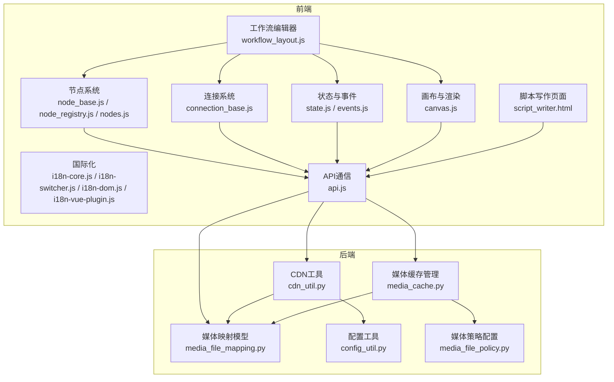
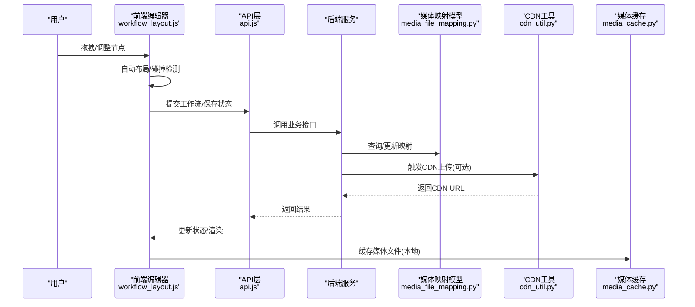
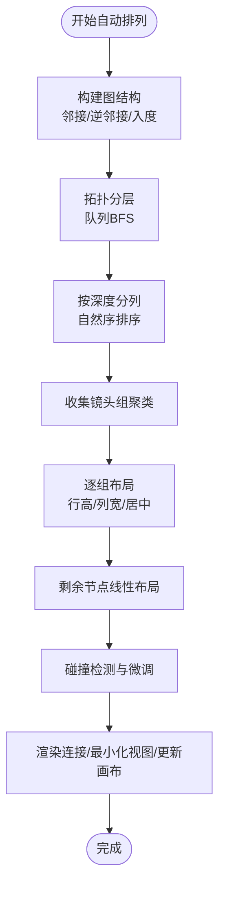
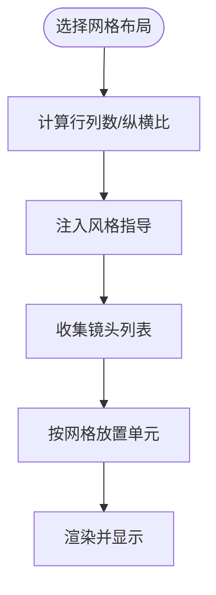
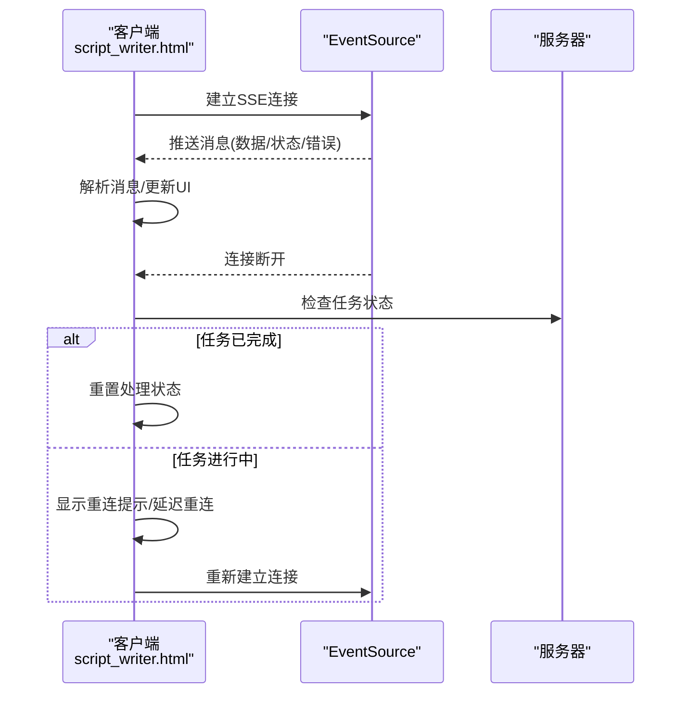
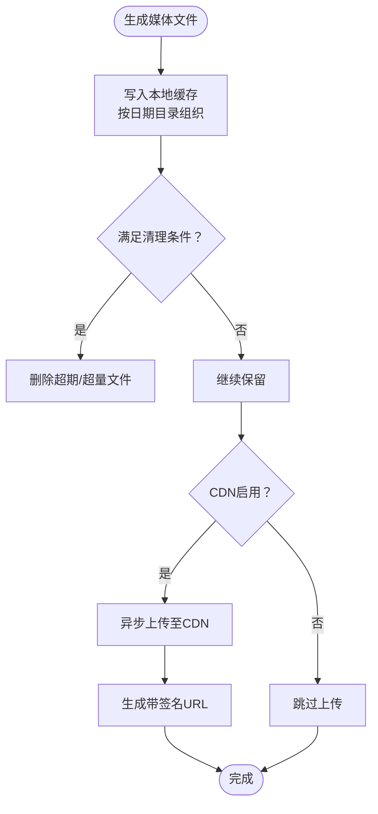
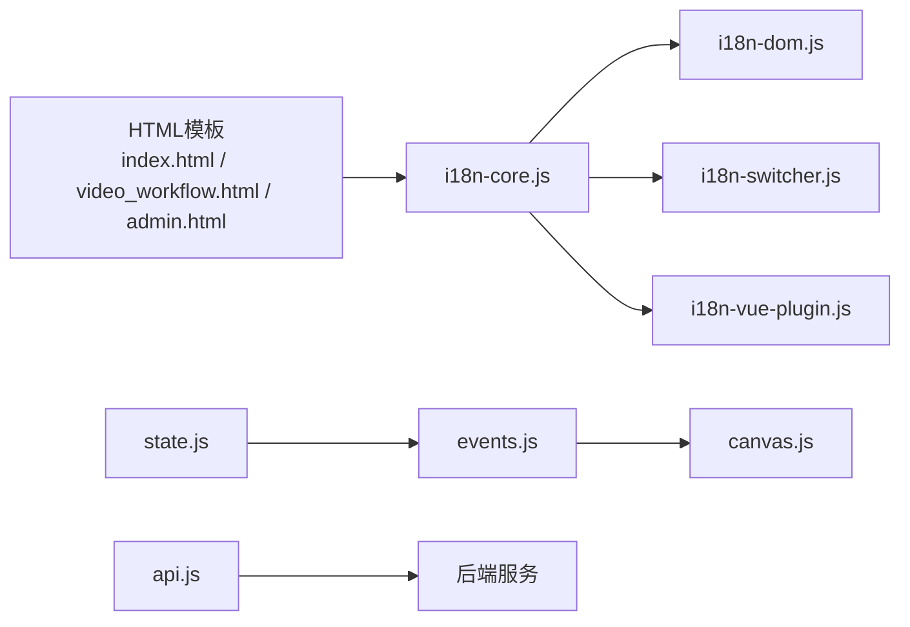
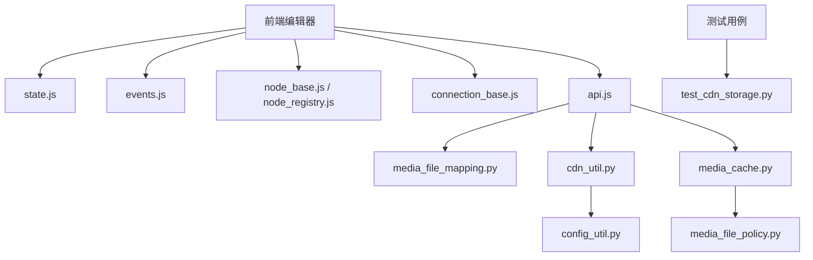

# 内容创作工具

<cite>
**本文引用的文件**
- [workflow_layout.js](file://web/js/workflow_layout.js)
- [README_EN.md](file://README_EN.md)
- [cdn_util.py](file://utils/cdn_util.py)
- [media_cache.py](file://utils/media_cache.py)
- [script_writer.html](file://web/script_writer.html)
- [nodes.js](file://web/js/nodes.js)
- [i18n-core.js](file://web/i18n/i18n-core.js)
- [i18n-switcher.js](file://web/i18n/i18n-switcher.js)
- [i18n-dom.js](file://web/i18n/i18n-dom.js)
- [i18n-vue-plugin.js](file://web/i18n/i18n-vue-plugin.js)
- [api.js](file://web/js/api.js)
- [events.js](file://web/js/events.js)
- [state.js](file://web/js/state.js)
- [canvas.js](file://web/js/canvas.js)
- [node_base.js](file://web/js/node_base.js)
- [connection_base.js](file://web/js/connection_base.js)
- [node_registry.js](file://web/js/node_registry.js)
- [text_node.js](file://web/js/text_node.js)
- [shot_frame_generator.js](file://web/js/shot_frame_generator.js)
- [timeline.js](file://web/js/timeline.js)
- [video_workflow.html](file://web/video_workflow.html)
- [video_workflow_list.html](file://web/video_workflow_list.html)
- [admin.html](file://web/admin.html)
- [marketing_agent.html](file://web/marketing_agent.html)
- [index.html](file://web/index.html)
- [media_file_mapping.py](file://model/media_file_mapping.py)
- [media_file_policy.py](file://config/media_file_policy.py)
- [config_util.py](file://config/config_util.py)
- [test_cdn_storage.py](file://tests/cdn/test_cdn_storage.py)
</cite>

## 目录
1. [引言](#引言)
2. [项目结构](#项目结构)
3. [核心组件](#核心组件)
4. [架构总览](#架构总览)
5. [详细组件分析](#详细组件分析)
6. [依赖关系分析](#依赖关系分析)
7. [性能考虑](#性能考虑)
8. [故障排除指南](#故障排除指南)
9. [结论](#结论)
10. [附录](#附录)

## 引言
本文件面向ZhiJuTong内容创作工具，围绕以下目标展开：无限画布编辑器的节点系统、连接机制与自动布局算法；多面板故事板设计工具的自动布局、一致性保障与本地编辑支持；实时协作的SSE实现、状态同步与并发控制；媒体资产的上传、CDN集成与缓存管理；以及创作工具的UI设计、交互模式与响应式适配。文档同时提供最佳实践、性能优化建议与故障排除指南。

## 项目结构
该项目采用前后端分离架构，前端位于web目录，后端以Python为主，配合数据库模型与工具模块。核心前端模块包括工作流编辑器、节点系统、连接系统、自动布局算法、国际化与API通信等；后端提供媒体资产映射、CDN工具与缓存管理；测试覆盖CDN集成与媒体缓存等关键路径。

**图表来源**
- [workflow_layout.js:60-460](file://web/js/workflow_layout.js#L60-L460)
- [node_base.js](file://web/js/node_base.js)
- [connection_base.js](file://web/js/connection_base.js)
- [state.js](file://web/js/state.js)
- [canvas.js](file://web/js/canvas.js)
- [i18n-core.js](file://web/i18n/i18n-core.js)
- [api.js](file://web/js/api.js)
- [script_writer.html:2444-2607](file://web/script_writer.html#L2444-L2607)
- [media_file_mapping.py](file://model/media_file_mapping.py)
- [cdn_util.py:18-268](file://utils/cdn_util.py#L18-L268)
- [media_cache.py:20-33](file://utils/media_cache.py#L20-L33)
- [config_util.py](file://config/config_util.py)
- [media_file_policy.py](file://config/media_file_policy.py)

**章节来源**
- [README_EN.md:280-298](file://README_EN.md#L280-L298)
- [workflow_layout.js:60-460](file://web/js/workflow_layout.js#L60-L460)

## 核心组件
- 无限画布编辑器：基于节点、连接与自动布局的可视化工作流编辑器，支持拖拽、对齐、碰撞检测与智能排列。
- 多面板故事板设计：自动2x2/3x3布局、一致性约束（角色外观一致）、本地编辑与刷新。
- 实时协作：基于SSE的浏览器事件流，具备断线重连与任务状态校验。
- 媒体资产系统：本地生成完成后自动缓存、CDN上传触发与URL签名管理。
- UI与交互：国际化支持、响应式布局、事件驱动的状态管理与API通信。

**章节来源**
- [README_EN.md:280-298](file://README_EN.md#L280-L298)
- [workflow_layout.js:60-460](file://web/js/workflow_layout.js#L60-L460)
- [cdn_util.py:18-268](file://utils/cdn_util.py#L18-L268)
- [media_cache.py:20-33](file://utils/media_cache.py#L20-L33)

## 架构总览
整体架构由前端编辑器与后端服务组成。前端通过API与后端交互，后端负责媒体映射、CDN与缓存策略。编辑器内部通过状态机与事件系统协调节点、连接与画布渲染。

**图表来源**
- [workflow_layout.js:60-460](file://web/js/workflow_layout.js#L60-L460)
- [api.js](file://web/js/api.js)
- [media_file_mapping.py](file://model/media_file_mapping.py)
- [cdn_util.py:244-268](file://utils/cdn_util.py#L244-L268)
- [media_cache.py:20-33](file://utils/media_cache.py#L20-L33)

## 详细组件分析

### 无限画布编辑器与自动布局
- 节点系统：节点类型注册、基础节点行为、标题排序与调试按钮注入。
- 连接机制：边遍历、邻接表构建、入度统计与拓扑分层。
- 布局算法：按深度分列、按行分层、按组聚类、剩余节点线性布局与最小包围盒更新。
- 碰撞检测：节点间间距与边界约束，避免重叠与越界。
- 渲染与最小化视图：批量定位节点、重绘连接、更新画布尺寸与自动保存提示。

**图表来源**
- [workflow_layout.js:60-460](file://web/js/workflow_layout.js#L60-L460)
- [nodes.js:180-210](file://web/js/nodes.js#L180-L210)

**章节来源**
- [workflow_layout.js:60-460](file://web/js/workflow_layout.js#L60-L460)
- [nodes.js:180-210](file://web/js/nodes.js#L180-L210)

### 多面板故事板设计工具
- 自动布局：根据镜头数量与网格结构生成2x2/3x3布局，确保单元格纵横比与分隔线。
- 一致性保证：同一脚本下的镜头共享风格指导，避免跨脚本风格漂移。
- 本地编辑支持：本地缓存与刷新，降低网络依赖，提升响应速度。

**图表来源**
- [nodes.js:180-195](file://web/js/nodes.js#L180-L195)

**章节来源**
- [nodes.js:180-195](file://web/js/nodes.js#L180-L195)

### 实时协作与SSE
- 客户端：基于EventSource接收服务器推送消息，解析数据类型，处理错误与断线重连。
- 重连策略：检查任务状态，若仍在运行则持续重连，否则安全重置状态并提示。
- 任务状态校验：在异常情况下主动轮询后端任务状态，确保最终一致性。

**图表来源**
- [script_writer.html:2444-2607](file://web/script_writer.html#L2444-L2607)

**章节来源**
- [script_writer.html:2444-2607](file://web/script_writer.html#L2444-L2607)

### 媒体资产管理系统
- 文件上传：生成完成后写入本地缓存目录，按日期组织，支持超时与容量清理。
- CDN集成：按配置启用七牛CDN，生成带签名的下载URL，支持刷新与回退。
- 缓存管理：动态配置缓存目录、保留天数与最大容量，异步上传至云端。

**图表来源**
- [media_cache.py:20-33](file://utils/media_cache.py#L20-L33)
- [cdn_util.py:18-268](file://utils/cdn_util.py#L18-L268)
- [media_file_mapping.py](file://model/media_file_mapping.py)

**章节来源**
- [media_cache.py:20-33](file://utils/media_cache.py#L20-L33)
- [cdn_util.py:18-268](file://utils/cdn_util.py#L18-L268)
- [media_file_mapping.py](file://model/media_file_mapping.py)

### 用户界面设计与交互模式
- 国际化：多语言资源加载与切换，DOM文本替换与Vue插件集成。
- 响应式适配：HTML模板与CSS样式适配不同设备与分辨率。
- 事件驱动：统一事件系统与状态管理，确保节点操作与画布渲染解耦。
- API通信：封装请求与响应处理，统一错误与加载状态。

**图表来源**
- [i18n-core.js](file://web/i18n/i18n-core.js)
- [i18n-switcher.js](file://web/i18n/i18n-switcher.js)
- [i18n-dom.js](file://web/i18n/i18n-dom.js)
- [i18n-vue-plugin.js](file://web/i18n/i18n-vue-plugin.js)
- [state.js](file://web/js/state.js)
- [events.js](file://web/js/events.js)
- [canvas.js](file://web/js/canvas.js)
- [api.js](file://web/js/api.js)
- [index.html](file://web/index.html)
- [video_workflow.html](file://web/video_workflow.html)
- [admin.html](file://web/admin.html)

**章节来源**
- [i18n-core.js](file://web/i18n/i18n-core.js)
- [i18n-switcher.js](file://web/i18n/i18n-switcher.js)
- [i18n-dom.js](file://web/i18n/i18n-dom.js)
- [i18n-vue-plugin.js](file://web/i18n/i18n-vue-plugin.js)
- [state.js](file://web/js/state.js)
- [events.js](file://web/js/events.js)
- [canvas.js](file://web/js/canvas.js)
- [api.js](file://web/js/api.js)
- [index.html](file://web/index.html)
- [video_workflow.html](file://web/video_workflow.html)
- [admin.html](file://web/admin.html)

## 依赖关系分析
- 前端编辑器依赖状态与事件系统，节点与连接模块依赖基础抽象与注册机制。
- 媒体系统依赖配置工具与策略配置，CDN工具依赖媒体映射模型。
- 测试覆盖CDN上传开关、URL获取与配置完整性校验。

**图表来源**
- [state.js](file://web/js/state.js)
- [events.js](file://web/js/events.js)
- [node_base.js](file://web/js/node_base.js)
- [node_registry.js](file://web/js/node_registry.js)
- [connection_base.js](file://web/js/connection_base.js)
- [api.js](file://web/js/api.js)
- [media_file_mapping.py](file://model/media_file_mapping.py)
- [cdn_util.py:18-268](file://utils/cdn_util.py#L18-L268)
- [media_cache.py:20-33](file://utils/media_cache.py#L20-L33)
- [config_util.py](file://config/config_util.py)
- [media_file_policy.py](file://config/media_file_policy.py)
- [test_cdn_storage.py:1-66](file://tests/cdn/test_cdn_storage.py#L1-L66)

**章节来源**
- [test_cdn_storage.py:1-66](file://tests/cdn/test_cdn_storage.py#L1-L66)

## 性能考虑
- 自动布局复杂度：拓扑分层与聚类过程的时间复杂度与节点/边数量相关，建议在大规模场景下限制单次布局范围或采用增量更新。
- 碰撞检测：在节点密集区域可引入四叉树或空间分割以降低O(n^2)比较次数。
- CDN上传：采用异步线程与队列限流，避免阻塞主线程与后端接口。
- 缓存清理：定期扫描与阈值触发相结合，减少I/O压力。
- SSE重连：指数退避与最大重试次数限制，防止风暴效应。

## 故障排除指南
- CDN未启用但触发上传：不会抛出异常，直接标记为活跃状态，检查配置开关与密钥完整性。
- CDN URL为空：当映射记录缺失或cloud_path为空时返回None，检查媒体映射与上传流程。
- 配置不完整：启用CDN但缺少必要参数会抛出异常，需补齐access_key/secret_key/bucket/cdn_domain。
- SSE断线：客户端会检查任务状态并进行重连，若任务已完成则重置状态；若仍在运行则持续重连。

**章节来源**
- [test_cdn_storage.py:18-28](file://tests/cdn/test_cdn_storage.py#L18-L28)
- [test_cdn_storage.py:30-51](file://tests/cdn/test_cdn_storage.py#L30-L51)
- [test_cdn_storage.py:53-66](file://tests/cdn/test_cdn_storage.py#L53-L66)
- [script_writer.html:2444-2607](file://web/script_writer.html#L2444-L2607)

## 结论
本工具通过模块化的前端编辑器、完善的媒体资产体系与稳健的实时协作机制，实现了从脚本到画面的一体化创作流程。自动布局与一致性保障提升了生产效率，CDN与缓存策略兼顾了性能与成本，国际化与响应式设计增强了用户体验。建议在大规模场景下进一步优化布局算法与碰撞检测，并完善并发控制与错误恢复策略。

## 附录
- 最佳实践
  - 使用自动布局前先进行节点分组与命名规范，便于聚类与一致性约束。
  - 启用CDN时确保配置完整与密钥安全，结合缓存策略降低带宽消耗。
  - SSE断线时优先检查任务状态，避免重复提交相同任务。
- 性能优化
  - 对布局算法进行分批处理与增量更新，减少全量重排频率。
  - 在节点密集区域引入空间索引与碰撞预检。
  - CDN上传采用异步队列与限速，避免峰值抖动。
- 故障排查
  - CDN相关问题优先核对配置项与网络权限。
  - 媒体缓存问题检查磁盘配额与清理策略。
  - SSE问题检查后端任务状态与客户端重连日志。