# 图像处理工具集

<cite>
**本文档引用的文件**
- [utils/image_grid_splitter.py](file://utils/image_grid_splitter.py)
- [utils/image_grid_merger.py](file://utils/image_grid_merger.py)
- [utils/image_compressor.py](file://utils/image_compressor.py)
- [utils/image_upload_utils.py](file://utils/image_upload_utils.py)
- [web/js/image_coloring_editor.js](file://web/js/image_coloring_editor.js)
- [script_writer_core/image_grid_splitter.py](file://script_writer_core/image_grid_splitter.py)
- [docs/image/grid_image_generation.md](file://docs/image/grid_image_generation.md)
- [docs/image/grid_image_generation_logic.md](file://docs/image/grid_image_generation_logic.md)
- [tests/utils/test_image_compressor.py](file://tests/utils/test_image_compressor.py)
- [tests/utils/test_image_upload_utils.py](file://tests/utils/test_image_upload_utils.py)
</cite>

## 目录
1. [简介](#简介)
2. [项目结构](#项目结构)
3. [核心组件](#核心组件)
4. [架构概览](#架构概览)
5. [详细组件分析](#详细组件分析)
6. [依赖关系分析](#依赖关系分析)
7. [性能考虑](#性能考虑)
8. [故障排除指南](#故障排除指南)
9. [结论](#结论)
10. [附录](#附录)

## 简介

本项目是一个综合性的图像处理工具集，专注于宫格图像的生成、分割、合并和优化。该工具集提供了完整的图像处理解决方案，包括：

- **图像分割器**：支持4宫格和9宫格图像的精确分割
- **图像合并器**：支持多张图片合并为n×n宫格布局
- **图像压缩工具**：智能压缩算法，支持文件大小和像素限制
- **图像上传工具**：完整的文件验证、预处理和批量处理机制
- **图像着色编辑器**：基于Canvas的实时着色编辑功能

该工具集采用模块化设计，每个组件都有清晰的职责分工，支持异步处理和批量操作，适用于大规模图像处理场景。

## 项目结构

项目采用分层架构设计，主要分为以下几个层次：

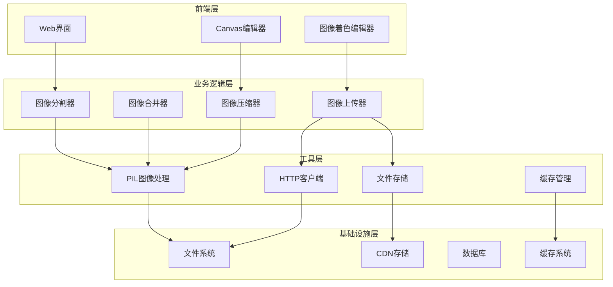

**图表来源**
- [utils/image_grid_splitter.py:1-158](file://utils/image_grid_splitter.py#L1-L158)
- [utils/image_grid_merger.py:1-176](file://utils/image_grid_merger.py#L1-L176)
- [utils/image_compressor.py:1-657](file://utils/image_compressor.py#L1-L657)
- [utils/image_upload_utils.py:1-558](file://utils/image_upload_utils.py#L1-L558)

**章节来源**
- [utils/image_grid_splitter.py:1-158](file://utils/image_grid_splitter.py#L1-L158)
- [utils/image_grid_merger.py:1-176](file://utils/image_grid_merger.py#L1-L176)
- [utils/image_compressor.py:1-657](file://utils/image_compressor.py#L1-L657)
- [utils/image_upload_utils.py:1-558](file://utils/image_upload_utils.py#L1-L558)

## 核心组件

### 图像分割器

图像分割器负责将宫格布局的图像精确分割为独立的子图像。支持2×2（4宫格）和3×3（9宫格）布局，具有以下特性：

- **精确坐标计算**：基于图像总尺寸计算每个子区域的精确坐标
- **灵活命名策略**：支持自定义输出文件名和默认命名规则
- **格式兼容性**：支持多种图像格式输出（PNG、JPEG等）
- **批量处理能力**：支持多个宫格图像的批量分割

### 图像合并器

图像合并器将多张独立图像合并为n×n宫格布局，具有以下核心功能：

- **智能网格计算**：支持4、9、16、25宫格的自动布局
- **尺寸一致性**：自动检测并统一图像尺寸和宽高比
- **本地优先策略**：优先使用本地文件，减少网络传输
- **错误处理机制**：完善的异常处理和重试机制

### 图像压缩工具

提供多层次的图像压缩解决方案：

- **智能质量调整**：根据文件大小自动选择起始质量
- **格式转换优化**：PNG到JPEG的智能转换以获得更好压缩效果
- **像素限制控制**：支持总像素数限制的等比缩放
- **Base64编码支持**：直接生成data URL格式的数据

### 图像上传工具

完整的图像上传和处理管道：

- **URL解析系统**：支持本地文件、局域网URL和外网URL
- **CDN集成**：无缝对接多种CDN存储服务
- **批量处理**：支持多文件的并发上传
- **临时文件管理**：智能的临时文件清理机制

### 图像着色编辑器

基于Canvas的实时图像着色编辑功能：

- **画笔工具**：可调节大小和透明度的画笔
- **颜色管理**：支持自定义颜色和预设颜色
- **历史记录**：20步撤销历史功能
- **移动端适配**：完整的触摸事件支持

**章节来源**
- [utils/image_grid_splitter.py:8-158](file://utils/image_grid_splitter.py#L8-L158)
- [utils/image_grid_merger.py:17-176](file://utils/image_grid_merger.py#L17-L176)
- [utils/image_compressor.py:16-657](file://utils/image_compressor.py#L16-L657)
- [utils/image_upload_utils.py:130-558](file://utils/image_upload_utils.py#L130-L558)
- [web/js/image_coloring_editor.js:1-385](file://web/js/image_coloring_editor.js#L1-L385)

## 架构概览

系统采用分层架构，各组件之间通过明确定义的接口进行交互：

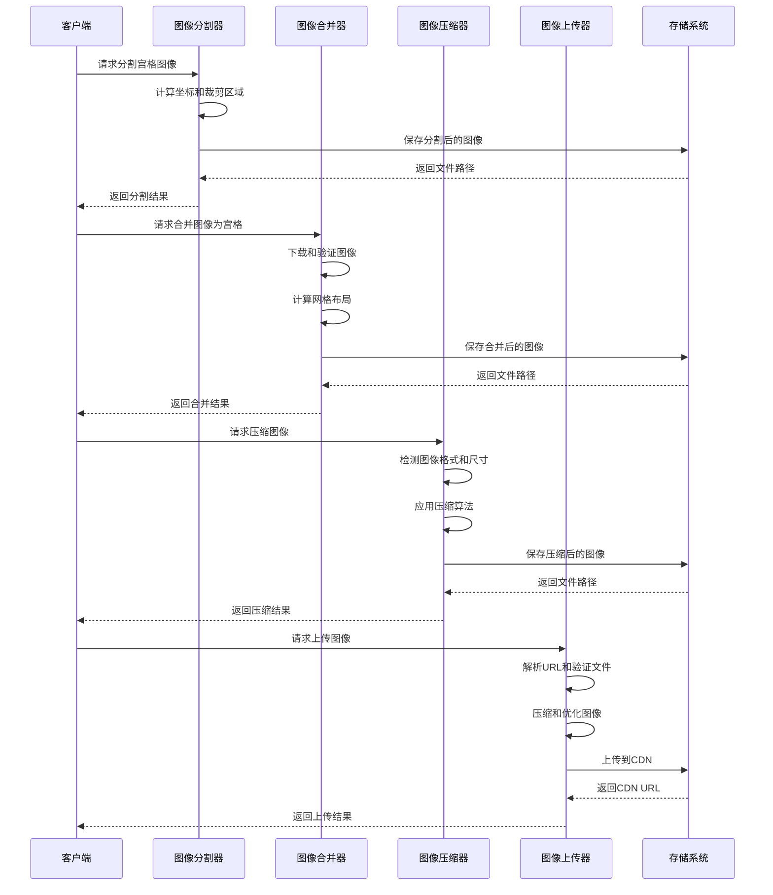

**图表来源**
- [utils/image_grid_splitter.py:15-158](file://utils/image_grid_splitter.py#L15-L158)
- [utils/image_grid_merger.py:64-176](file://utils/image_grid_merger.py#L64-L176)
- [utils/image_compressor.py:16-657](file://utils/image_compressor.py#L16-L657)
- [utils/image_upload_utils.py:364-558](file://utils/image_upload_utils.py#L364-L558)

## 详细组件分析

### 图像分割器实现分析

图像分割器采用面向对象的设计模式，提供了清晰的接口和健壮的错误处理机制：

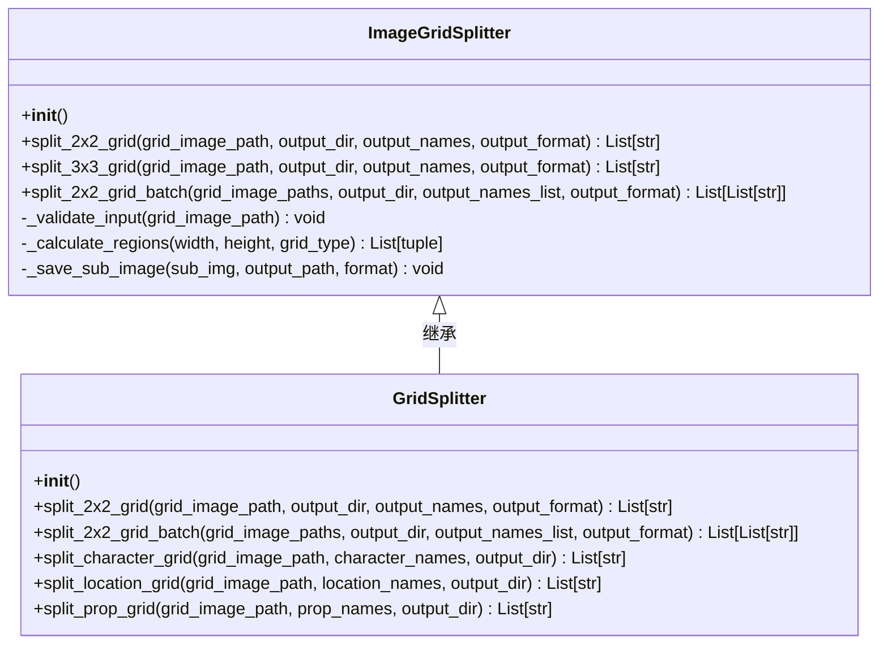

**图表来源**
- [utils/image_grid_splitter.py:8-158](file://utils/image_grid_splitter.py#L8-L158)
- [script_writer_core/image_grid_splitter.py:14-273](file://script_writer_core/image_grid_splitter.py#L14-L273)

#### 2×2宫格分割算法

2×2宫格分割算法的核心逻辑如下：

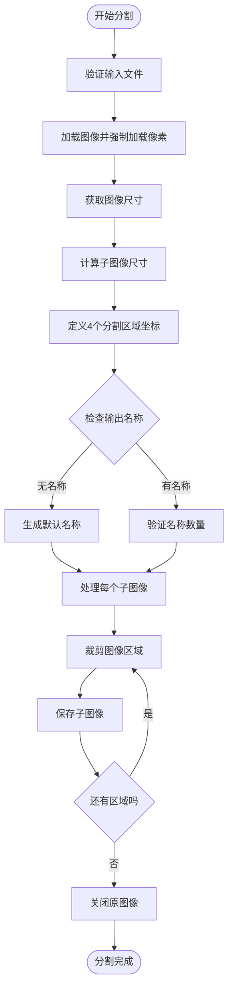

**图表来源**
- [utils/image_grid_splitter.py:15-102](file://utils/image_grid_splitter.py#L15-L102)

#### 3×3宫格分割算法

3×3宫格分割算法采用相同的模式，但需要处理9个子图像：

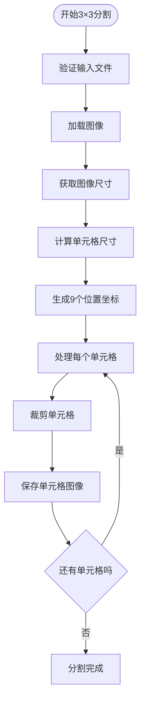

**图表来源**
- [utils/image_grid_splitter.py:99-158](file://utils/image_grid_splitter.py#L99-L158)

**章节来源**
- [utils/image_grid_splitter.py:8-158](file://utils/image_grid_splitter.py#L8-L158)
- [script_writer_core/image_grid_splitter.py:14-273](file://script_writer_core/image_grid_splitter.py#L14-L273)

### 图像合并器实现分析

图像合并器提供了强大的多图像合并功能，支持n×n宫格布局：

**图表来源**
- [utils/image_grid_merger.py:17-176](file://utils/image_grid_merger.py#L17-L176)

#### 合并算法流程

图像合并器的核心算法流程：

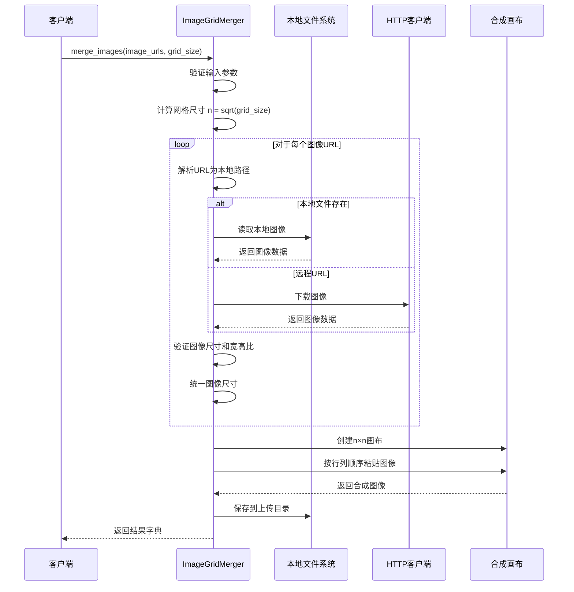

**图表来源**
- [utils/image_grid_merger.py:64-176](file://utils/image_grid_merger.py#L64-L176)

#### 边缘处理机制

图像合并器实现了完善的边缘处理机制：

- **尺寸验证**：确保所有输入图像具有相同的宽高比
- **自动缩放**：将不同尺寸的图像统一缩放到第一张图像的尺寸
- **黑色占位符**：支持特定位置的全黑占位符填充
- **质量保证**：使用Lanczos重采样算法保证缩放质量

**章节来源**
- [utils/image_grid_merger.py:17-176](file://utils/image_grid_merger.py#L17-L176)

### 图像压缩工具实现分析

图像压缩工具提供了多层次的压缩解决方案：

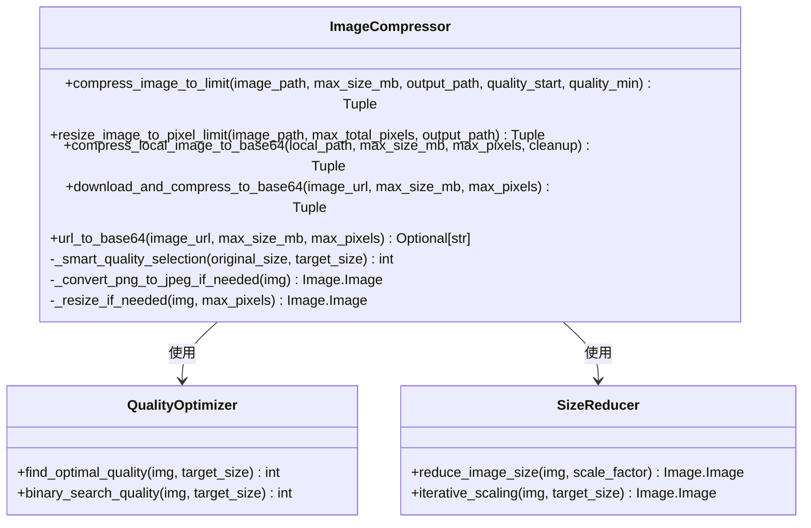

**图表来源**
- [utils/image_compressor.py:16-657](file://utils/image_compressor.py#L16-L657)

#### 智能压缩算法

压缩工具采用了智能的压缩策略：

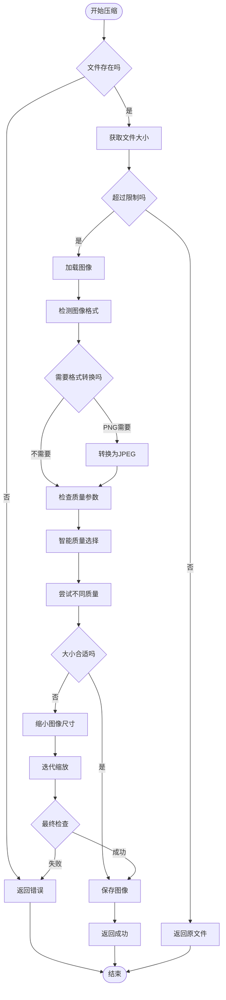

**图表来源**
- [utils/image_compressor.py:16-193](file://utils/image_compressor.py#L16-L193)

#### Base64编码支持

图像压缩工具还提供了完整的Base64编码支持：

- **本地文件处理**：直接从磁盘读取文件进行压缩
- **远程URL处理**：支持HTTP/HTTPS URL的下载和压缩
- **格式自动检测**：根据文件扩展名自动选择MIME类型
- **内存优化**：使用临时文件避免内存溢出

**章节来源**
- [utils/image_compressor.py:16-657](file://utils/image_compressor.py#L16-L657)

### 图像上传工具实现分析

图像上传工具提供了完整的文件处理管道：

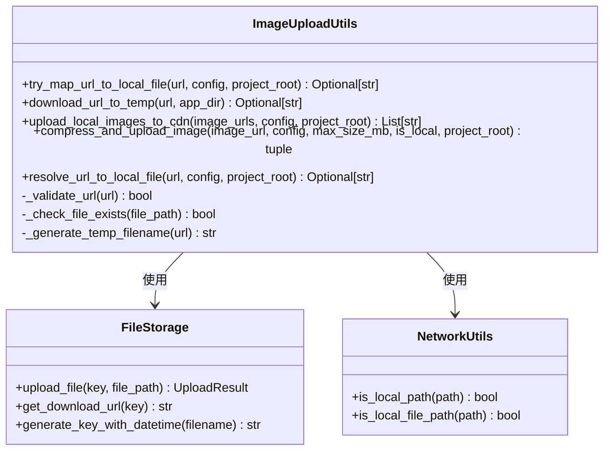

**图表来源**
- [utils/image_upload_utils.py:130-558](file://utils/image_upload_utils.py#L130-L558)

#### URL解析和映射机制

上传工具实现了智能的URL解析和映射：

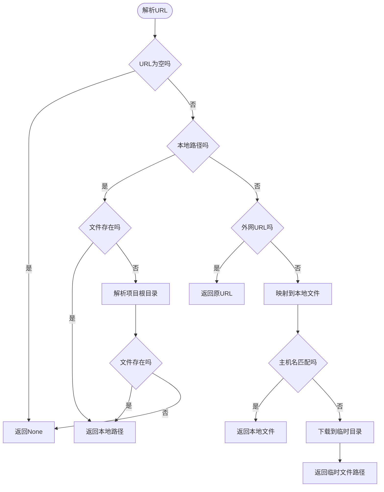

**图表来源**
- [utils/image_upload_utils.py:277-325](file://utils/image_upload_utils.py#L277-L325)

#### 批量上传处理

上传工具支持高效的批量处理：

- **并发处理**：使用异步I/O处理多个文件上传
- **错误隔离**：单个文件失败不影响其他文件处理
- **资源清理**：自动清理临时文件和资源
- **进度跟踪**：提供详细的处理进度和状态信息

**章节来源**
- [utils/image_upload_utils.py:130-558](file://utils/image_upload_utils.py#L130-L558)

### 图像着色编辑器实现分析

图像着色编辑器提供了直观的Canvas绘图界面：

**图表来源**
- [web/js/image_coloring_editor.js:7-385](file://web/js/image_coloring_editor.js#L7-L385)

#### 绘图系统架构

着色编辑器的绘图系统采用了Canvas API：

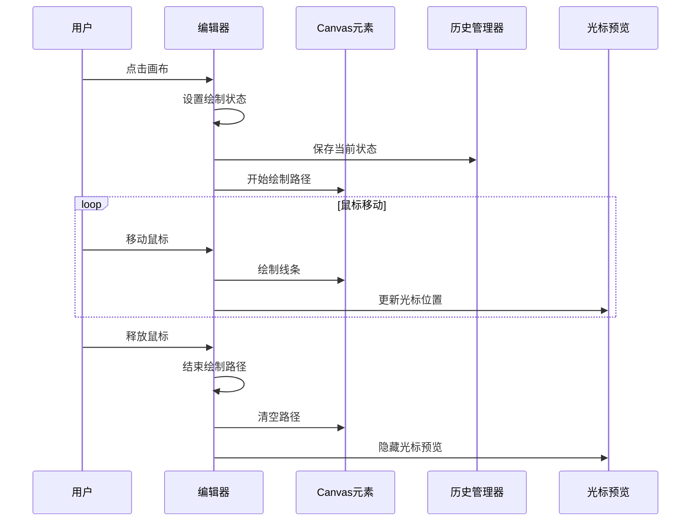

**图表来源**
- [web/js/image_coloring_editor.js:134-194](file://web/js/image_coloring_editor.js#L134-L194)

#### 移动端适配

编辑器提供了完整的移动端支持：

- **触摸事件处理**：支持多点触控和手势识别
- **响应式设计**：自动适应不同屏幕尺寸
- **性能优化**：使用requestAnimationFrame优化动画性能
- **兼容性处理**：处理不同浏览器的Canvas实现差异

**章节来源**
- [web/js/image_coloring_editor.js:1-385](file://web/js/image_coloring_editor.js#L1-L385)

## 依赖关系分析

系统组件之间的依赖关系如下：

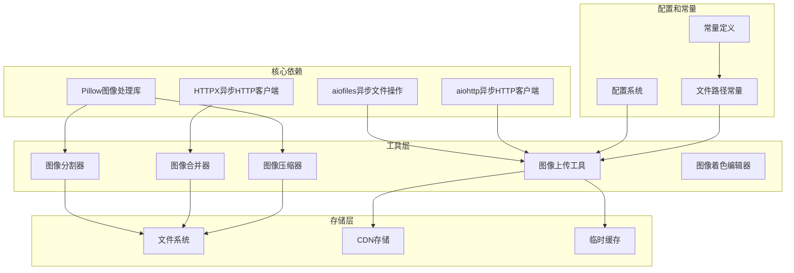

**图表来源**
- [utils/image_grid_splitter.py:2](file://utils/image_grid_splitter.py#L2)
- [utils/image_grid_merger.py:2-3](file://utils/image_grid_merger.py#L2-L3)
- [utils/image_compressor.py:11](file://utils/image_compressor.py#L11)
- [utils/image_upload_utils.py:5-22](file://utils/image_upload_utils.py#L5-L22)

**章节来源**
- [utils/image_grid_splitter.py:1-158](file://utils/image_grid_splitter.py#L1-L158)
- [utils/image_grid_merger.py:1-176](file://utils/image_grid_merger.py#L1-L176)
- [utils/image_compressor.py:1-657](file://utils/image_compressor.py#L1-L657)
- [utils/image_upload_utils.py:1-558](file://utils/image_upload_utils.py#L1-L558)

## 性能考虑

### 内存管理优化

系统在多个层面实现了内存优化：

- **延迟加载**：PIL图像采用延迟加载，避免不必要的内存占用
- **流式处理**：HTTP下载采用流式处理，避免大文件内存溢出
- **临时文件管理**：智能的临时文件生命周期管理
- **对象池**：复用Canvas上下文和其他图形对象

### 并发处理策略

系统采用了多层次的并发处理：

- **异步I/O**：使用async/await模式处理网络请求
- **线程池**：将CPU密集型操作（PIL处理）卸载到线程池
- **批量处理**：支持多文件的并发处理
- **资源限制**：合理的并发数量限制，避免系统过载

### 缓存机制

系统实现了多级缓存策略：

- **文件缓存**：本地文件系统缓存，避免重复处理
- **内存缓存**：小文件的内存缓存，提高访问速度
- **CDN缓存**：远程CDN缓存，减少网络传输
- **智能失效**：基于时间戳和文件变更的智能缓存失效

## 故障排除指南

### 常见问题及解决方案

#### 图像分割失败

**问题现象**：图像分割后得到的子图像不完整或损坏

**可能原因**：
- PIL图像惰性加载导致像素数据不完整
- 文件权限问题
- 磁盘空间不足

**解决方案**：
1. 确保使用`img.load()`强制加载所有像素数据
2. 检查输出目录的写入权限
3. 确认磁盘空间充足

#### 图像合并错误

**问题现象**：图像合并后出现尺寸不匹配或格式错误

**可能原因**：
- 输入图像尺寸不一致
- 宽高比差异过大
- 网络下载失败

**解决方案**：
1. 使用`_validate_inputs`函数验证输入参数
2. 确保所有图像具有相同的宽高比
3. 检查网络连接和CDN服务状态

#### 压缩失败

**问题现象**：图像压缩后文件大小没有变化或质量下降

**可能原因**：
- 压缩参数设置不当
- 图像格式不适合压缩
- 磁盘空间不足

**解决方案**：
1. 调整质量参数范围
2. 考虑图像格式转换（PNG到JPEG）
3. 清理临时文件释放空间

#### 上传失败

**问题现象**：图像上传到CDN失败

**可能原因**：
- CDN配置错误
- 网络连接问题
- 文件权限问题

**解决方案**：
1. 检查CDN配置和认证信息
2. 验证网络连接稳定性
3. 确认文件权限设置正确

**章节来源**
- [utils/image_grid_splitter.py:38-50](file://utils/image_grid_splitter.py#L38-L50)
- [utils/image_grid_merger.py:123-130](file://utils/image_grid_merger.py#L123-L130)
- [utils/image_compressor.py:188-192](file://utils/image_compressor.py#L188-L192)
- [utils/image_upload_utils.py:224-236](file://utils/image_upload_utils.py#L224-L236)

## 结论

本图像处理工具集提供了完整的图像处理解决方案，具有以下优势：

### 技术优势

- **模块化设计**：每个组件职责明确，易于维护和扩展
- **异步处理**：全面采用异步I/O，提高系统吞吐量
- **智能优化**：自动化的质量控制和性能优化
- **错误处理**：完善的异常处理和恢复机制

### 功能完整性

- **多格式支持**：支持主流图像格式的读写和转换
- **批量处理**：高效的大规模图像处理能力
- **实时预览**：Canvas绘图提供实时视觉反馈
- **云端集成**：完整的CDN和云存储支持

### 最佳实践建议

1. **性能优化**：合理设置并发数量，避免系统过载
2. **资源管理**：及时清理临时文件，监控磁盘空间
3. **错误监控**：建立完善的日志和监控体系
4. **安全考虑**：验证用户输入，防止恶意文件上传

该工具集为图像处理应用提供了坚实的技术基础，可以根据具体需求进行定制和扩展。

## 附录

### API接口规范

#### 图像分割接口

| 接口 | 方法 | 参数 | 返回值 |
|------|------|------|--------|
| `split_2x2_grid` | POST | `grid_image_path, output_dir, output_names, output_format` | `List[str]` |
| `split_3x3_grid` | POST | `grid_image_path, output_dir, output_names, output_format` | `List[str]` |
| `split_2x2_grid_batch` | POST | `grid_image_paths, output_dir, output_names_list, output_format` | `List[List[str]]` |

#### 图像合并接口

| 接口 | 方法 | 参数 | 返回值 |
|------|------|------|--------|
| `merge_images` | POST | `image_urls, grid_size, black_indices` | `dict` |

#### 图像压缩接口

| 接口 | 方法 | 参数 | 返回值 |
|------|------|------|--------|
| `compress_image_to_limit` | POST | `image_path, max_size_mb, output_path, quality_start, quality_min` | `Tuple[bool, Optional[str], Optional[str]]` |
| `resize_image_to_pixel_limit` | POST | `image_path, max_total_pixels, output_path` | `Tuple[bool, Optional[str], Optional[str]]` |
| `compress_local_image_to_base64` | POST | `local_path, max_size_mb, max_pixels, cleanup` | `Tuple[bool, Optional[str], Optional[str]]` |

### 配置选项

#### 图像分割配置

| 选项 | 类型 | 默认值 | 描述 |
|------|------|--------|------|
| `output_format` | string | "png" | 输出图像格式 |
| `output_names` | List[string] | 自动生成 | 输出文件名列表 |
| `grid_type` | int | 4 | 宫格类型（4或9） |

#### 图像合并配置

| 选项 | 类型 | 默认值 | 描述 |
|------|------|--------|------|
| `grid_size` | int | 4 | 宫格总数 |
| `black_indices` | List[int] | [] | 黑色占位符位置 |
| `server_host` | string | "" | 服务器主机地址 |

#### 压缩配置

| 选项 | 类型 | 默认值 | 描述 |
|------|------|--------|------|
| `max_size_mb` | float | 10.0 | 最大文件大小（MB） |
| `quality_start` | int | 95 | 起始压缩质量 |
| `quality_min` | int | 60 | 最低压缩质量 |
| `max_pixels` | int | 0 | 最大总像素数 |

### 错误代码

| 错误码 | 描述 | 处理建议 |
|--------|------|----------|
| 400 | 参数错误 | 检查输入参数格式和范围 |
| 401 | 认证失败 | 验证认证信息有效性 |
| 403 | 权限不足 | 检查用户权限和资源访问权限 |
| 404 | 资源不存在 | 确认文件路径和URL有效性 |
| 500 | 服务器内部错误 | 检查服务状态和日志信息 |
| 503 | 服务不可用 | 稍后重试或检查服务状态 |