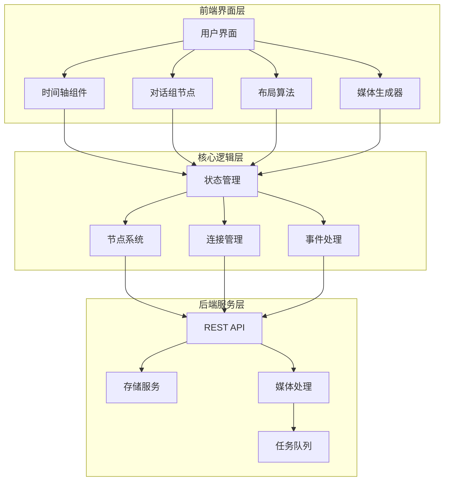
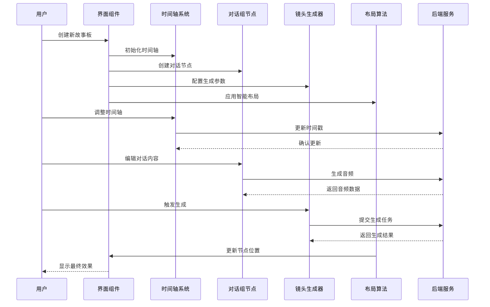
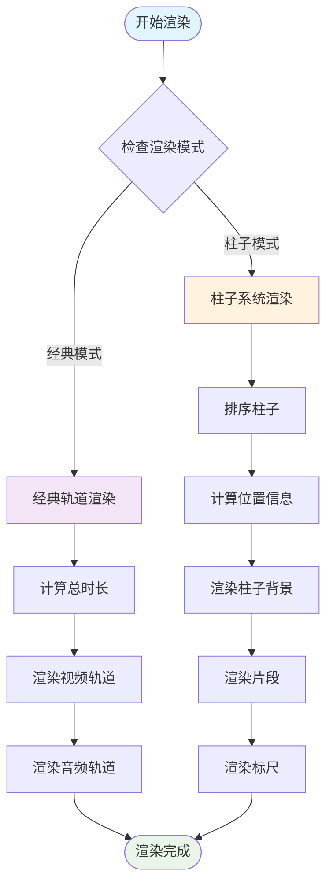
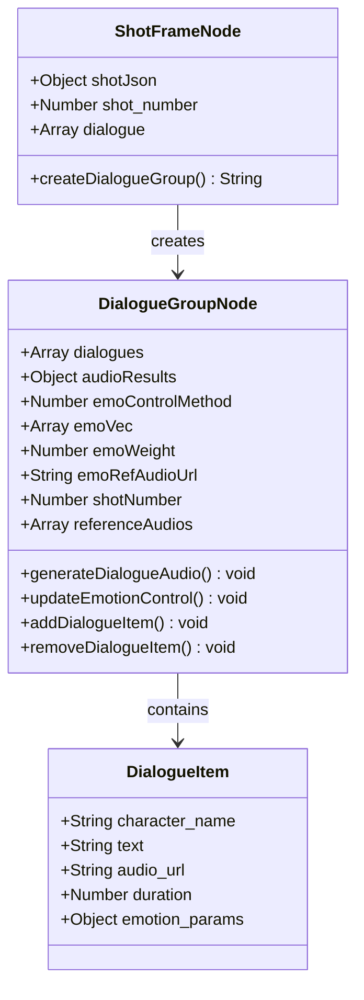
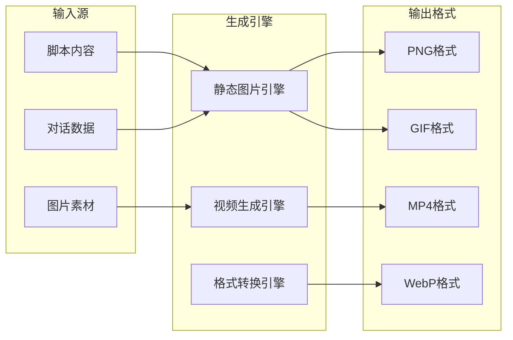
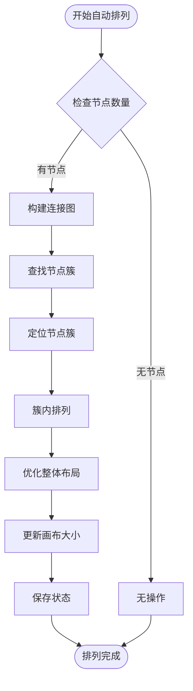
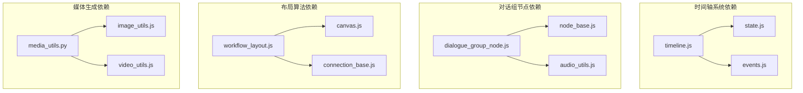

# 多面板故事板设计工具

<cite>
**本文档引用的文件**
- [web/js/timeline.js](file://web/js/timeline.js)
- [auto_test/e2e/test_timeline.py](file://auto_test/e2e/test_timeline.py)
- [web/js/dialogue_group_node.js](file://web/js/dialogue_group_node.js)
- [web/js/nodes.js](file://web/js/nodes.js)
- [web/js/workflow_layout.js](file://web/js/workflow_layout.js)
- [web/marketing_agent.html](file://web/marketing_agent.html)
- [docs/timeline/README.md](file://docs/timeline/README.md)
- [docs/timeline/timeline_pillar_system.md](file://docs/timeline/timeline_pillar_system.md)
- [docs/image/grid_image_generation.md](file://docs/image/grid_image_generation.md)
- [docs/video/shot_frame_video_mode.md](file://docs/video/shot_frame_video_mode.md)
- [docs/video/grid_merge_video_generation.md](file://docs/video/grid_merge_video_generation.md)
- [docs/script/script_auto_split_improvement.md](file://docs/script/script_auto_split_improvement.md)
</cite>

## 目录
1. [简介](#简介)
2. [项目结构](#项目结构)
3. [核心组件](#核心组件)
4. [架构概览](#架构概览)
5. [详细组件分析](#详细组件分析)
6. [依赖关系分析](#依赖关系分析)
7. [性能考虑](#性能考虑)
8. [故障排除指南](#故障排除指南)
9. [结论](#结论)
10. [附录](#附录)

## 简介
本项目是一个基于Web的多面板故事板设计工具，集成了时间轴系统、对话组节点、镜头生成器和智能布局算法。该工具支持从脚本到最终故事板的完整创作流程，提供可视化的时间轴编辑、对话分组管理、多模态媒体生成以及智能布局优化功能。

## 项目结构
项目采用前后端分离架构，前端主要位于web目录下，包含JavaScript核心逻辑、CSS样式和国际化资源。后端通过REST API提供数据服务和媒体处理能力。

**图表来源**
- [web/js/timeline.js:571-936](file://web/js/timeline.js#L571-L936)
- [web/js/dialogue_group_node.js:1-58](file://web/js/dialogue_group_node.js#L1-L58)
- [web/js/workflow_layout.js:362-493](file://web/js/workflow_layout.js#L362-L493)

**章节来源**
- [web/js/timeline.js:571-936](file://web/js/timeline.js#L571-L936)
- [web/js/dialogue_group_node.js:1-58](file://web/js/dialogue_group_node.js#L1-L58)
- [web/js/workflow_layout.js:362-493](file://web/js/workflow_layout.js#L362-L493)

## 核心组件
本工具的核心组件包括时间轴系统、对话组节点、镜头生成器和智能布局算法。这些组件协同工作，为用户提供完整的多面板故事板创作体验。

### 时间轴系统
时间轴系统是故事板编辑的核心交互组件，支持传统轨道模式和基于柱子的现代化模式。它提供了精确的帧定位、播放控制和视觉反馈功能。

### 对话组节点
对话组节点专门用于处理角色对话和音频生成，支持多角色对话管理、情感控制和参考音频集成。该节点能够自动生成对话分组并与其他创作节点建立连接。

### 镜头生成器
镜头生成器提供多种媒体生成模式，包括静态图片生成、视频片段生成和格式转换功能。支持从单一素材到复杂组合的多种输出需求。

### 智能布局算法
智能布局算法负责自动排列和优化节点位置，确保故事板的视觉一致性和编辑效率。该算法考虑节点类型、连接关系和视觉层次。

**章节来源**
- [web/js/timeline.js:571-936](file://web/js/timeline.js#L571-L936)
- [web/js/dialogue_group_node.js:1-58](file://web/js/dialogue_group_node.js#L1-L58)
- [web/js/workflow_layout.js:362-493](file://web/js/workflow_layout.js#L362-L493)

## 架构概览
系统采用模块化设计，各组件通过清晰的接口进行通信。前端使用事件驱动架构，后端提供RESTful API服务。

**图表来源**
- [web/js/timeline.js:571-936](file://web/js/timeline.js#L571-L936)
- [web/js/dialogue_group_node.js:1-58](file://web/js/dialogue_group_node.js#L1-L58)
- [web/js/workflow_layout.js:362-493](file://web/js/workflow_layout.js#L362-L493)

## 详细组件分析

### 时间轴系统设计原理

#### 时间轴渲染机制
时间轴系统支持两种渲染模式：经典轨道模式和基于柱子的现代化模式。经典模式适用于传统的视频编辑工作流，而柱子模式则更适合故事板创作的镜头组织需求。

**图表来源**
- [web/js/timeline.js:589-734](file://web/js/timeline.js#L589-L734)
- [web/js/timeline.js:602-663](file://web/js/timeline.js#L602-L663)

#### 帧定位和播放控制
时间轴系统提供精确的帧定位功能，支持拖拽操作和键盘快捷键。播放控制包括播放、暂停、停止和快进功能，所有操作都与时间轴的视觉表示保持同步。

#### 柱子系统架构
柱子系统是时间轴的现代化扩展，将连续的时间线分割为逻辑镜头组。每个柱子可以包含多个视频片段，并具有独立的时长和视觉标识。

**章节来源**
- [web/js/timeline.js:571-936](file://web/js/timeline.js#L571-L936)
- [auto_test/e2e/test_timeline.py:473-512](file://auto_test/e2e/test_timeline.py#L473-L512)

### 对话组节点实现机制

#### 对话分组功能
对话组节点专门处理多角色对话场景，支持动态添加、删除和重新排序对话项。每个对话项包含角色名称、对话文本和音频元数据。

**图表来源**
- [web/js/dialogue_group_node.js:24-44](file://web/js/dialogue_group_node.js#L24-L44)
- [web/js/nodes.js:10383-10417](file://web/js/nodes.js#L10383-L10417)

#### 标签管理机制
对话组节点支持多种标签管理功能，包括情感标签、角色标签和场景标签。这些标签用于音频生成的参数控制和视觉标识。

#### 样式定制选项
提供丰富的样式定制选项，包括颜色主题、字体设置和布局调整。支持响应式设计，适配不同屏幕尺寸和设备类型。

**章节来源**
- [web/js/dialogue_group_node.js:1-58](file://web/js/dialogue_group_node.js#L1-L58)
- [web/js/nodes.js:10383-10417](file://web/js/nodes.js#L10383-L10417)

### 镜头生成器功能特性

#### 静态图片生成
支持从脚本和对话内容生成静态图片故事板。提供多种图片生成模式，包括单图模式和网格模式。

#### 视频片段生成
集成多种视频生成引擎，支持从单一镜头到复杂序列的视频生成。提供实时预览和质量控制功能。

#### 格式转换能力
支持多种媒体格式的转换和优化，包括分辨率调整、编码格式转换和压缩优化。

**图表来源**
- [web/marketing_agent.html:370-374](file://web/marketing_agent.html#L370-L374)

**章节来源**
- [web/marketing_agent.html:370-374](file://web/marketing_agent.html#L370-L374)

### 故事板布局算法

#### 自动排列策略
智能布局算法根据节点类型和连接关系自动排列节点位置，确保视觉层次清晰和编辑效率最大化。

**图表来源**
- [web/js/workflow_layout.js:390-460](file://web/js/workflow_layout.js#L390-L460)

#### 手动调整功能
提供精确的手动调整功能，允许用户微调节点位置和连接路径。支持拖拽操作和键盘快捷键。

#### 一致性保证机制
通过碰撞检测和间距算法确保节点间的一致性距离，避免重叠和视觉混乱。

**章节来源**
- [web/js/workflow_layout.js:362-493](file://web/js/workflow_layout.js#L362-L493)

## 依赖关系分析

**图表来源**
- [web/js/timeline.js:571-936](file://web/js/timeline.js#L571-L936)
- [web/js/dialogue_group_node.js:1-58](file://web/js/dialogue_group_node.js#L1-L58)
- [web/js/workflow_layout.js:362-493](file://web/js/workflow_layout.js#L362-L493)

**章节来源**
- [web/js/timeline.js:571-936](file://web/js/timeline.js#L571-L936)
- [web/js/dialogue_group_node.js:1-58](file://web/js/dialogue_group_node.js#L1-L58)
- [web/js/workflow_layout.js:362-493](file://web/js/workflow_layout.js#L362-L493)

## 性能考虑
系统在设计时充分考虑了性能优化，包括：

- **虚拟滚动**：时间轴系统使用虚拟滚动技术处理大量片段
- **增量渲染**：只重新渲染受影响的组件区域
- **缓存机制**：音频和图片结果的智能缓存
- **异步处理**：媒体生成任务的异步执行和进度反馈

## 故障排除指南

### 时间轴问题
- **片段重叠**：检查片段的起始时间和持续时间设置
- **渲染异常**：确认浏览器兼容性和JavaScript错误日志
- **性能问题**：减少同时显示的片段数量或启用虚拟滚动

### 对话组问题
- **音频生成失败**：检查网络连接和音频服务状态
- **情感控制无效**：验证情感向量参数的正确性
- **节点连接丢失**：重新建立节点间的连接关系

### 布局问题
- **节点重叠**：使用自动排列功能重新整理布局
- **连接线混乱**：检查连接关系的正确性和节点类型匹配

**章节来源**
- [web/js/timeline.js:571-936](file://web/js/timeline.js#L571-L936)
- [web/js/dialogue_group_node.js:1-58](file://web/js/dialogue_group_node.js#L1-L58)
- [web/js/workflow_layout.js:362-493](file://web/js/workflow_layout.js#L362-L493)

## 结论
本多面板故事板设计工具通过模块化的架构设计和智能化的算法实现，为用户提供了完整的创作体验。时间轴系统的双模式渲染、对话组节点的专业化功能、镜头生成器的多样化输出和智能布局算法的高效性，共同构成了一个功能完备的故事板创作平台。

## 附录

### 最佳实践指南
- **故事板规划**：先创建脚本大纲，再逐步细化到具体镜头
- **对话设计**：保持对话简洁有力，配合适当的视觉表现
- **时间分配**：合理分配每个镜头的时长，确保节奏流畅
- **视觉一致性**：保持色彩、风格和构图的一致性

### 创意指导原则
- **叙事连贯性**：确保镜头间的逻辑关系清晰
- **视觉冲击力**：利用对比和变化增强视觉效果
- **情感表达**：通过镜头语言传达角色情感
- **创新元素**：适当加入创意元素提升作品吸引力

### 质量控制建议
- **定期保存**：使用自动保存功能防止数据丢失
- **版本管理**：对重要修改创建版本备份
- **性能监控**：关注系统性能指标，及时优化
- **用户体验**：收集用户反馈，持续改进功能

**章节来源**
- [docs/timeline/README.md](file://docs/timeline/README.md)
- [docs/timeline/timeline_pillar_system.md](file://docs/timeline/timeline_pillar_system.md)
- [docs/image/grid_image_generation.md](file://docs/image/grid_image_generation.md)
- [docs/video/shot_frame_video_mode.md](file://docs/video/shot_frame_video_mode.md)
- [docs/video/grid_merge_video_generation.md](file://docs/video/grid_merge_video_generation.md)
- [docs/script/script_auto_split_improvement.md](file://docs/script/script_auto_split_improvement.md)