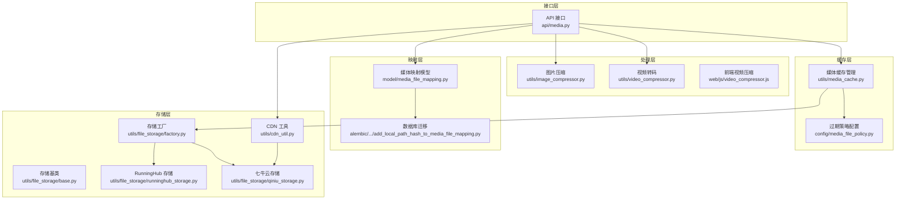
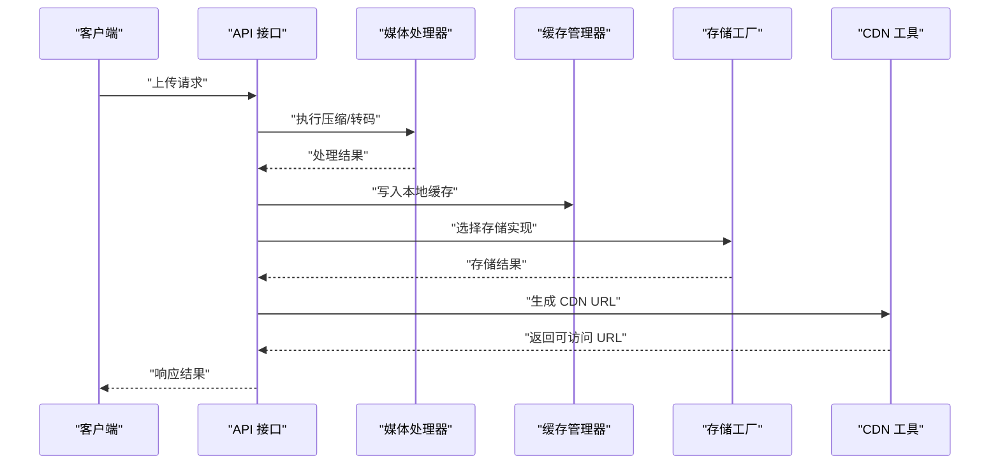
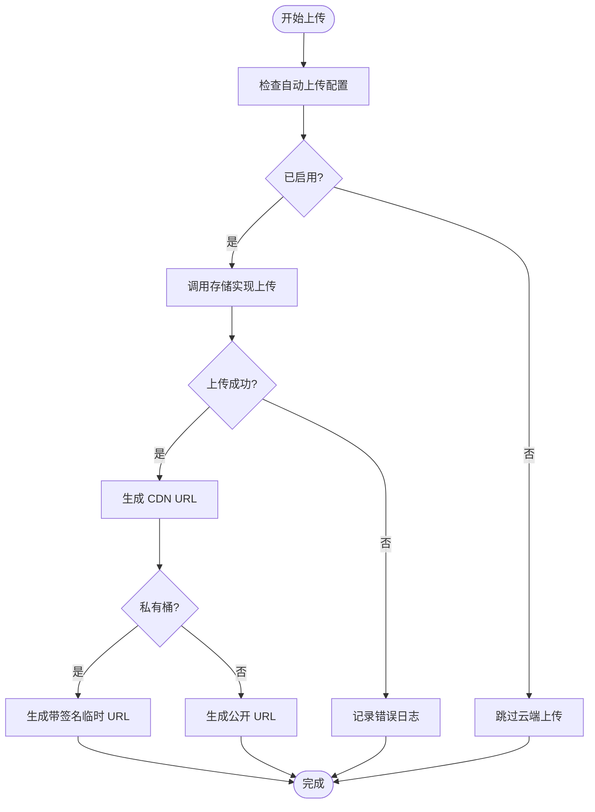
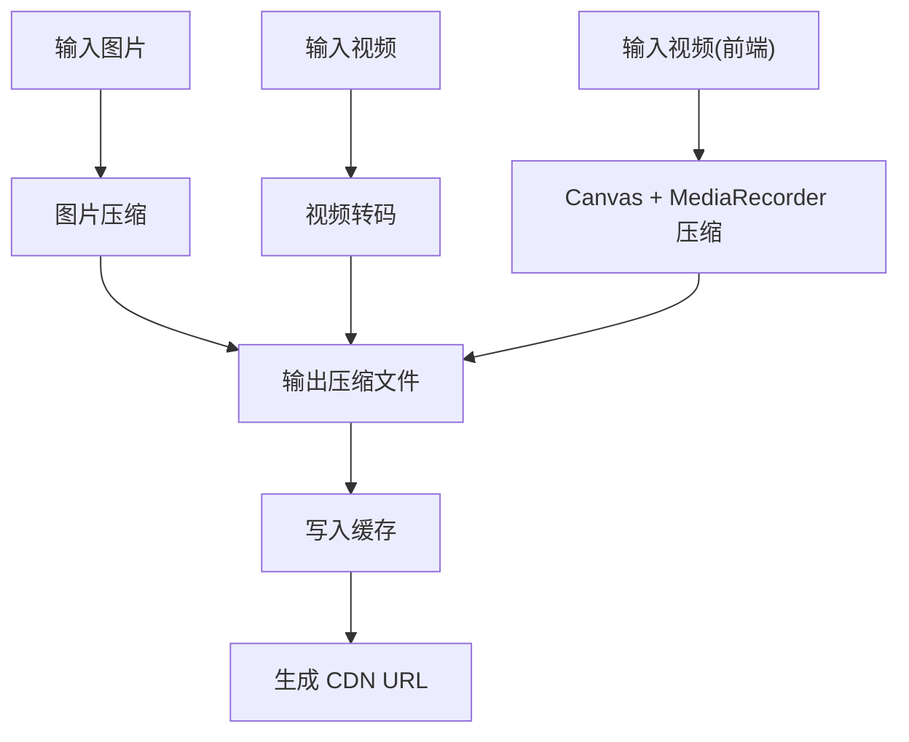
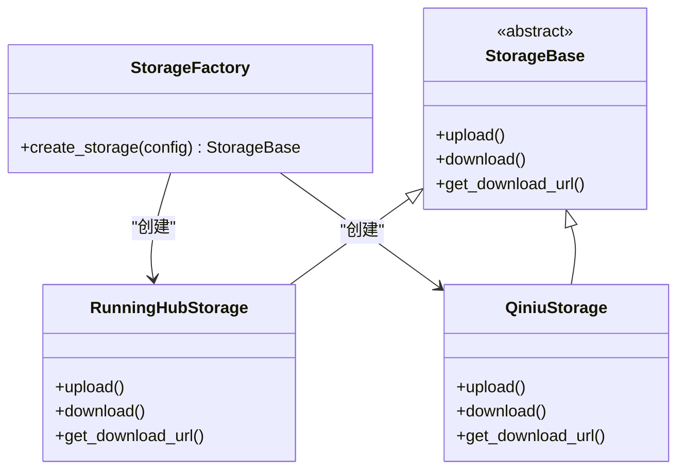
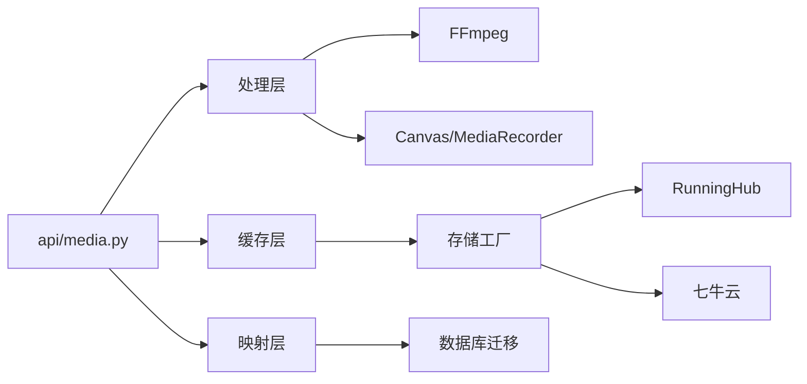

# 媒体资产管理系统

<cite>
**本文引用的文件**
- [cdn_util.py](file://utils/cdn_util.py)
- [media_file_policy.py](file://config/media_file_policy.py)
- [media_cache.py](file://utils/media_cache.py)
- [media_file_mapping.py](file://model/media_file_mapping.py)
- [20260519_add_local_path_hash_to_media_file_mapping.py](file://alembic/versions/20260519_add_local_path_hash_to_media_file_mapping.py)
- [video_compressor.py](file://utils/video_compressor.py)
- [video_compressor.js](file://web/js/video_compressor.js)
- [image_compressor.py](file://utils/image_compressor.py)
- [media_mapping_util.py](file://utils/media_mapping_util.py)
- [media.py](file://api/media.py)
- [runninghub_storage.py](file://utils/file_storage/runninghub_storage.py)
- [qiniu_storage.py](file://utils/file_storage/qiniu_storage.py)
- [base.py](file://utils/file_storage/base.py)
- [factory.py](file://utils/file_storage/factory.py)
- [media_file_mapping_crud.py](file://tests/crud/test_media_file_mapping_crud.py)
- [test_video_compressor.py](file://tests/utils/test_video_compressor.py)
- [test_async_task_config.py](file://tests/config/test_async_task_config.py)
- [test_cdn_storage.py](file://tests/cdn/test_cdn_storage.py)
- [test_ai_tools_cdn_sync.py](file://tests/cdn/test_ai_tools_cdn_sync.py)
- [test_ai_tools_cdn_integration.py](file://tests/cdn/test_ai_tools_cdn_integration.py)
- [媒体文件缓存管理方案.md](file://docs/媒体文件缓存管理方案.md)
</cite>

## 目录
1. [简介](#简介)
2. [项目结构](#项目结构)
3. [核心组件](#核心组件)
4. [架构总览](#架构总览)
5. [详细组件分析](#详细组件分析)
6. [依赖关系分析](#依赖关系分析)
7. [性能考虑](#性能考虑)
8. [故障排除指南](#故障排除指南)
9. [结论](#结论)
10. [附录](#附录)

## 简介
本文件为媒体资产管理系统的技术文档，聚焦于文件存储策略、CDN 同步机制、缓存管理架构、媒体处理工具以及文件映射关系管理。文档基于实际代码库进行分析，涵盖本地存储、分布式存储与 CDN 集成的设计理念与实现细节，帮助开发者与运维人员理解系统的工作方式并提供优化建议。

## 项目结构
系统围绕以下关键模块组织：
- 存储层：本地文件系统、分布式对象存储（七牛云）、企业内部存储（RunningHub）
- 缓存层：本地媒体缓存管理，支持过期与容量清理
- 处理层：图片压缩、视频转码与前端 Canvas/MediaRecorder 压缩
- 映射层：媒体文件映射模型与数据库迁移，支持 CDN 重定向加速
- 接口层：API 提供媒体文件上传、查询与 CDN URL 生成能力

**图表来源**
- [media.py](file://api/media.py)
- [image_compressor.py](file://utils/image_compressor.py)
- [video_compressor.py](file://utils/video_compressor.py)
- [video_compressor.js](file://web/js/video_compressor.js)
- [media_cache.py](file://utils/media_cache.py)
- [media_file_policy.py](file://config/media_file_policy.py)
- [media_file_mapping.py](file://model/media_file_mapping.py)
- [20260519_add_local_path_hash_to_media_file_mapping.py](file://alembic/versions/20260519_add_local_path_hash_to_media_file_mapping.py)
- [base.py](file://utils/file_storage/base.py)
- [factory.py](file://utils/file_storage/factory.py)
- [runninghub_storage.py](file://utils/file_storage/runninghub_storage.py)
- [qiniu_storage.py](file://utils/file_storage/qiniu_storage.py)
- [cdn_util.py](file://utils/cdn_util.py)

**章节来源**
- [media.py](file://api/media.py)
- [media_cache.py](file://utils/media_cache.py)
- [media_file_policy.py](file://config/media_file_policy.py)
- [media_file_mapping.py](file://model/media_file_mapping.py)
- [20260519_add_local_path_hash_to_media_file_mapping.py](file://alembic/versions/20260519_add_local_path_hash_to_media_file_mapping.py)
- [base.py](file://utils/file_storage/base.py)
- [factory.py](file://utils/file_storage/factory.py)
- [runninghub_storage.py](file://utils/file_storage/runninghub_storage.py)
- [qiniu_storage.py](file://utils/file_storage/qiniu_storage.py)
- [cdn_util.py](file://utils/cdn_util.py)

## 核心组件
- 文件存储策略
  - 本地存储：直接写入服务器文件系统，适合小规模或私有部署
  - 分布式存储：通过工厂模式选择具体实现（如 RunningHub、七牛云）
  - CDN 集成：在上传完成后生成可公开访问的 CDN URL，支持私有桶签名下载
- CDN 同步机制
  - 自动上传开关：由配置项控制是否自动上传至 CDN
  - URL 生成：根据云存储类型生成带签名的临时下载链接
  - CDN 重定向：通过本地路径哈希快速定位映射记录，加速 CDN 重定向
- 缓存管理系统
  - 本地缓存：按日期组织，支持按天数与容量上限清理
  - 过期策略：内置"永不过期"与"跟随媒体缓存"策略
  - 清理规则：定期扫描与阈值触发清理
- 媒体处理工具
  - 图片压缩：调整尺寸与质量，降低存储与传输成本
  - 视频转码：FFmpeg 实现，支持 CRF、预设与快启参数
  - 前端压缩：Canvas + MediaRecorder，适配移动端浏览器
- 文件映射关系管理
  - 数据模型：记录本地路径、云端路径、策略、标签等
  - 索引优化：新增 local_path_hash 及索引，提升 CDN 重定向效率
  - 查询机制：按 ID、本地路径、哈希等多维度查询

**章节来源**
- [media_cache.py](file://utils/media_cache.py)
- [media_file_policy.py](file://config/media_file_policy.py)
- [cdn_util.py](file://utils/cdn_util.py)
- [media_file_mapping.py](file://model/media_file_mapping.py)
- [20260519_add_local_path_hash_to_media_file_mapping.py](file://alembic/versions/20260519_add_local_path_hash_to_media_file_mapping.py)
- [video_compressor.py](file://utils/video_compressor.py)
- [video_compressor.js](file://web/js/video_compressor.js)
- [image_compressor.py](file://utils/image_compressor.py)

## 架构总览
系统采用分层架构，接口层负责业务入口，处理层执行媒体转换，缓存层提供本地加速，映射层维护元数据，存储层抽象不同后端实现并通过工厂模式切换。

**图表来源**
- [media.py](file://api/media.py)
- [video_compressor.py](file://utils/video_compressor.py)
- [media_cache.py](file://utils/media_cache.py)
- [factory.py](file://utils/file_storage/factory.py)
- [cdn_util.py](file://utils/cdn_util.py)

## 详细组件分析

### CDN 同步机制
- 自动上传控制：当配置开启时，上传完成后自动调用存储实现进行云端上传
- URL 生成策略：对于私有桶，生成带签名的临时下载链接；对于公有桶，直接返回公开 URL
- 异常处理：上传失败时记录错误日志，不影响主流程继续执行

**图表来源**
- [cdn_util.py](file://utils/cdn_util.py)
- [factory.py](file://utils/file_storage/factory.py)

**章节来源**
- [cdn_util.py](file://utils/cdn_util.py)
- [test_cdn_storage.py](file://tests/cdn/test_cdn_storage.py)
- [test_ai_tools_cdn_sync.py](file://tests/cdn/test_ai_tools_cdn_sync.py)
- [test_ai_tools_cdn_integration.py](file://tests/cdn/test_ai_tools_cdn_integration.py)

### 缓存管理系统
- 配置项：启用开关、缓存目录、最大保留天数、最大容量（GB）、上传至云端前缀
- 清理策略：基于时间（天数）与空间（容量）双重阈值
- 与存储联动：可选将缓存文件自动上传至云端，形成"本地热缓存 + 云端冷存储"的混合架构

**图表来源**
- [media_cache.py](file://utils/media_cache.py)
- [media_file_policy.py](file://config/media_file_policy.py)

**章节来源**
- [media_cache.py](file://utils/media_cache.py)
- [media_file_policy.py](file://config/media_file_policy.py)
- [媒体文件缓存管理方案.md](file://docs/媒体文件缓存管理方案.md)

### 媒体处理工具
- 图片压缩：调整尺寸与质量，减少体积与带宽占用
- 视频转码：基于 FFmpeg，支持 CRF 控制质量、预设优化速度、AAC 音频编码、MP4 快启参数
- 前端压缩：Canvas + MediaRecorder，适配移动端 Safari/Chrome/Firefox，支持截断与音轨合并

**图表来源**
- [image_compressor.py](file://utils/image_compressor.py)
- [video_compressor.py](file://utils/video_compressor.py)
- [video_compressor.js](file://web/js/video_compressor.js)

**章节来源**
- [image_compressor.py](file://utils/image_compressor.py)
- [video_compressor.py](file://utils/video_compressor.py)
- [video_compressor.js](file://web/js/video_compressor.js)
- [test_video_compressor.py](file://tests/utils/test_video_compressor.py)
- [test_async_task_config.py](file://tests/config/test_async_task_config.py)

### 文件映射关系管理
- 数据模型：记录用户 ID、本地路径、云端路径、策略代码、实体类型、源 ID、媒体类型、原始 URL、文件大小、本地路径哈希、标签等
- 索引优化：新增 local_path_hash 字段与索引，用于 CDN 重定向时快速查找
- 查询机制：支持按 ID、本地路径、哈希等多维查询，保障映射准确性与性能

**图表来源**
- [media_file_mapping.py](file://model/media_file_mapping.py)
- [20260519_add_local_path_hash_to_media_file_mapping.py](file://alembic/versions/20260519_add_local_path_hash_to_media_file_mapping.py)

**章节来源**
- [media_file_mapping.py](file://model/media_file_mapping.py)
- [20260519_add_local_path_hash_to_media_file_mapping.py](file://alembic/versions/20260519_add_local_path_hash_to_media_file_mapping.py)
- [media_mapping_util.py](file://utils/media_mapping_util.py)
- [media_file_mapping_crud.py](file://tests/crud/test_media_file_mapping_crud.py)

### 存储抽象与工厂模式
- 存储基类：定义统一接口，屏蔽不同存储实现差异
- 存储工厂：根据配置动态选择具体存储实现（RunningHub、七牛云等）
- 存储实现：针对不同厂商提供适配器，确保上传、下载、URL 生成等操作的一致性

**图表来源**
- [base.py](file://utils/file_storage/base.py)
- [factory.py](file://utils/file_storage/factory.py)
- [runninghub_storage.py](file://utils/file_storage/runninghub_storage.py)
- [qiniu_storage.py](file://utils/file_storage/qiniu_storage.py)

**章节来源**
- [base.py](file://utils/file_storage/base.py)
- [factory.py](file://utils/file_storage/factory.py)
- [runninghub_storage.py](file://utils/file_storage/runninghub_storage.py)
- [qiniu_storage.py](file://utils/file_storage/qiniu_storage.py)

## 依赖关系分析
- 组件耦合
  - API 层依赖处理层、缓存层与存储层，保持业务逻辑清晰
  - 缓存层依赖配置模块与存储工厂，实现策略化管理
  - 映射层依赖数据库迁移脚本，确保索引与字段一致性
- 外部依赖
  - FFmpeg：用于视频转码
  - 浏览器 API：Canvas、MediaRecorder 用于前端压缩
  - 对象存储 SDK：七牛云等厂商 SDK

**图表来源**
- [media.py](file://api/media.py)
- [video_compressor.py](file://utils/video_compressor.py)
- [video_compressor.js](file://web/js/video_compressor.js)
- [media_cache.py](file://utils/media_cache.py)
- [factory.py](file://utils/file_storage/factory.py)
- [media_file_mapping.py](file://model/media_file_mapping.py)

**章节来源**
- [media.py](file://api/media.py)
- [video_compressor.py](file://utils/video_compressor.py)
- [video_compressor.js](file://web/js/video_compressor.js)
- [media_cache.py](file://utils/media_cache.py)
- [factory.py](file://utils/file_storage/factory.py)
- [media_file_mapping.py](file://model/media_file_mapping.py)

## 性能考虑
- 压缩策略
  - 图片压缩：在保证视觉质量前提下降低文件体积，减少存储与网络传输成本
  - 视频转码：合理设置 CRF 与预设，平衡质量与处理速度；使用快启参数提升播放体验
  - 前端压缩：针对移动端场景，优先使用 Canvas + MediaRecorder，避免额外依赖
- 缓存优化
  - 本地缓存按日期组织，定期清理过期与超量文件
  - 结合 CDN 使用，热点内容走 CDN，冷数据回源至云端
- 存储选择
  - 本地存储适合小规模与私有部署；分布式存储适合大规模与跨地域访问
  - CDN 仅在必要时启用，避免不必要的带宽消耗

## 故障排除指南
- CDN URL 生成失败
  - 检查配置项是否完整（密钥、桶名、域名）
  - 查看异常日志，确认存储实现可用性
- 上传失败
  - 确认存储工厂配置正确，网络连通性正常
  - 检查对象存储权限与桶策略
- 缓存清理异常
  - 检查磁盘空间与权限，确认清理阈值配置合理
  - 关注缓存目录路径与权限

**章节来源**
- [cdn_util.py](file://utils/cdn_util.py)
- [media_cache.py](file://utils/media_cache.py)

## 结论
本系统通过分层架构实现了媒体文件的高效存储与分发：本地缓存提供低延迟访问，分布式存储与 CDN 提供高可用与高扩展性，媒体处理工具在保证质量的同时优化体积与传输成本。文件映射关系与索引优化进一步提升了 CDN 重定向与查询效率。建议在生产环境中结合业务特点合理配置缓存策略与存储方案，并持续监控性能指标以优化用户体验。

## 附录
- 上传流程建议
  - 前端先进行轻量压缩（如前端视频压缩），再提交至后端
  - 后端执行二次压缩与转码，写入本地缓存并按需上传至云端
  - 生成 CDN URL 返回给前端，确保资源可被快速访问
- 质量控制
  - 图片压缩设置合理的质量阈值，避免过度压缩导致失真
  - 视频转码使用 CRF 控制质量，结合预设与快启参数提升性能
- 存储优化
  - 启用本地缓存与 CDN 结合的混合策略
  - 定期清理过期与超量文件，释放磁盘空间
  - 对重要文件采用"永不过期"策略，对临时文件采用"跟随媒体缓存"策略