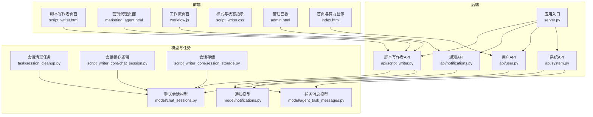
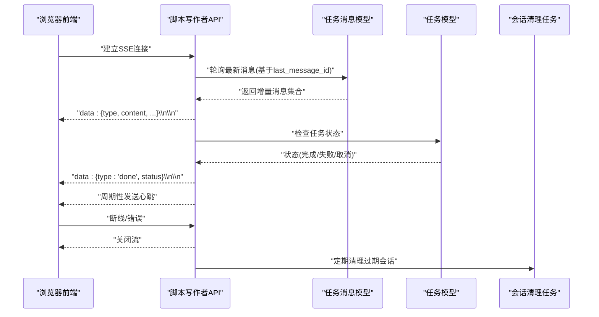
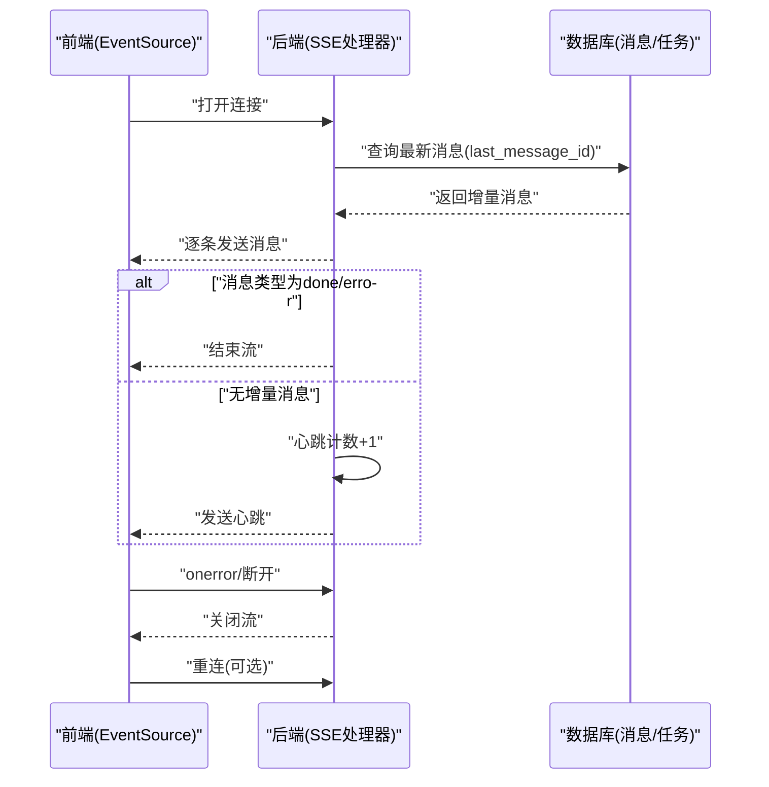
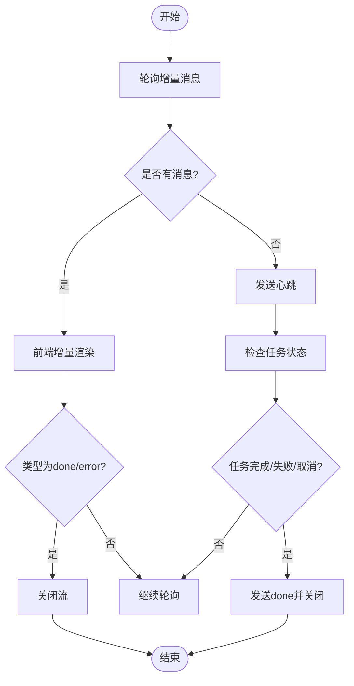
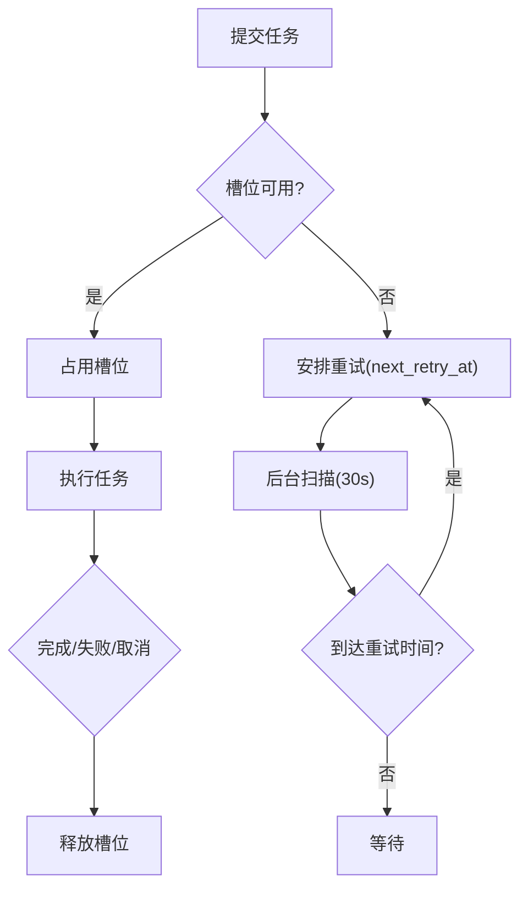
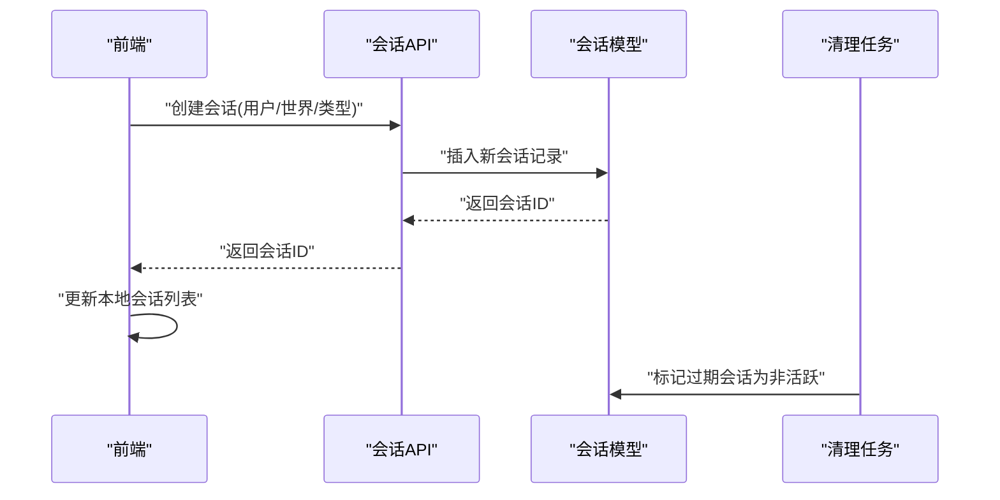
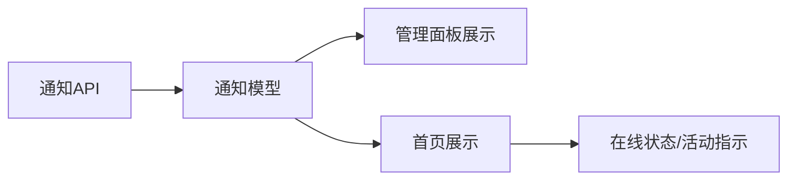
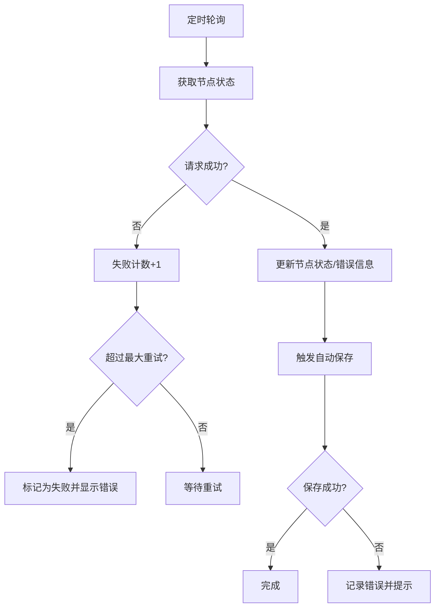
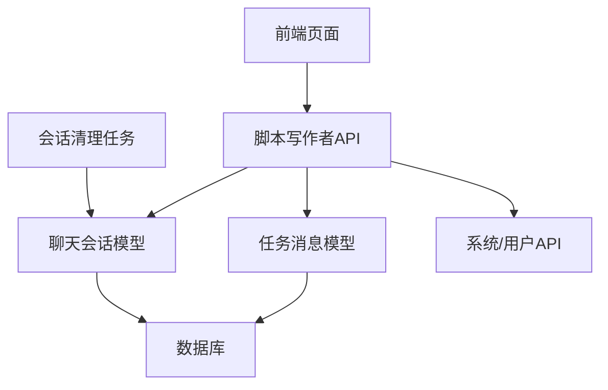

# 实时协作功能

<cite>
**本文引用的文件**
- [server.py](file://server.py)
- [script_writer.py](file://api/script_writer.py)
- [chat_session.py](file://script_writer_core/chat_session.py)
- [session_storage.py](file://script_writer_core/session_storage.py)
- [chat_sessions.py](file://model/chat_sessions.py)
- [agent_task_messages.py](file://model/agent_task_messages.py)
- [notifications.py](file://model/notifications.py)
- [session_cleanup.py](file://task/session_cleanup.py)
- [test_chat_sessions_crud.py](file://tests/crud/test_chat_sessions_crud.py)
- [test_session_storage.py](file://tests/script_writer_core/test_session_storage.py)
- [test_session_cleanup.py](file://tests/utils/test_session_cleanup.py)
- [test_notifications_crud.py](file://tests/crud/test_notifications_crud.py)
- [runninghub_concurrency_control.md](file://docs/backend/runninghub_concurrency_control.md)
- [script_writer.html](file://web/script_writer.html)
- [marketing_agent.html](file://web/marketing_agent.html)
- [workflow.js](file://web/js/workflow.js)
- [script_writer.css](file://web/css/script_writer.css)
- [admin.html](file://web/admin.html)
- [index.html](file://web/index.html)
</cite>

## 目录
1. [引言](#引言)
2. [项目结构](#项目结构)
3. [核心组件](#核心组件)
4. [架构总览](#架构总览)
5. [详细组件分析](#详细组件分析)
6. [依赖关系分析](#依赖关系分析)
7. [性能考虑](#性能考虑)
8. [故障排除指南](#故障排除指南)
9. [结论](#结论)
10. [附录](#附录)

## 引言
本文件围绕实时协作功能进行系统化技术文档整理，重点涵盖以下方面：
- SSE（服务器推送事件）的实现原理：连接建立、事件发送与连接管理
- 状态同步机制：状态变更检测、增量更新与冲突解决
- 并发控制策略：乐观锁、悲观锁与版本管理
- 聊天会话管理：会话创建、成员管理与消息传递
- 实时通知系统、用户在线状态与活动指示
- 协作场景使用指南、最佳实践与性能优化建议

## 项目结构
实时协作能力由后端 API、模型层、前端交互与任务调度共同构成。后端通过 SSE 推送任务状态与消息；前端负责连接管理、事件解析与 UI 更新；模型层负责持久化与一致性保障；任务调度负责清理与重试。

图表来源
- [server.py](file://server.py)
- [script_writer.py](file://api/script_writer.py)
- [chat_sessions.py](file://model/chat_sessions.py)
- [agent_task_messages.py](file://model/agent_task_messages.py)
- [notifications.py](file://model/notifications.py)
- [session_cleanup.py](file://task/session_cleanup.py)
- [chat_session.py](file://script_writer_core/chat_session.py)
- [session_storage.py](file://script_writer_core/session_storage.py)
- [script_writer.html](file://web/script_writer.html)
- [marketing_agent.html](file://web/marketing_agent.html)
- [workflow.js](file://web/js/workflow.js)
- [script_writer.css](file://web/css/script_writer.css)
- [admin.html](file://web/admin.html)
- [index.html](file://web/index.html)

章节来源
- [server.py](file://server.py)
- [script_writer.py](file://api/script_writer.py)

## 核心组件
- SSE 服务器端流：后端以 SSE 形式向客户端推送任务状态、进度与完成信号，同时周期性发送心跳维持连接。
- 任务消息模型：统一记录任务产生的各类消息类型（如 progress、done、error、status、heartbeat 等），用于前端增量渲染。
- 聊天会话模型与核心：负责会话生命周期、历史持久化与过期清理。
- 通知模型与前端展示：统一管理通知的创建、读取状态与前端 UI 呈现。
- 并发控制与重试：通过槽位管理与指数退避策略保障系统稳定性与吞吐。

章节来源
- [script_writer.py](file://api/script_writer.py)
- [agent_task_messages.py](file://model/agent_task_messages.py)
- [chat_sessions.py](file://model/chat_sessions.py)
- [notifications.py](file://model/notifications.py)
- [runninghub_concurrency_control.md](file://docs/backend/runninghub_concurrency_control.md)

## 架构总览
实时协作采用“后端生成事件，前端订阅并增量渲染”的模式。后端以异步方式轮询数据库中的任务消息，按类型输出到 SSE 流；前端通过 EventSource 订阅，解析消息类型并更新 UI。同时，系统通过任务状态检查与心跳机制保证连接健壮性，并通过清理任务与过期会话保障资源回收。

图表来源
- [script_writer.py](file://api/script_writer.py)
- [agent_task_messages.py](file://model/agent_task_messages.py)
- [session_cleanup.py](file://task/session_cleanup.py)

## 详细组件分析

### SSE 实现与连接管理
- 连接建立：前端通过 EventSource 订阅后端 SSE 端点，后端在请求到达时初始化消息游标与心跳计数。
- 事件发送：后端轮询数据库获取增量消息，按类型输出到 SSE 流；当遇到完成/错误类型时主动结束流。
- 连接管理：后端周期性发送心跳；前端在连接错误时检查任务真实状态并进行重连或提示。

图表来源
- [script_writer.py](file://api/script_writer.py)
- [script_writer.html](file://web/script_writer.html)

章节来源
- [script_writer.py](file://api/script_writer.py)
- [script_writer.html](file://web/script_writer.html)

### 状态同步机制
- 状态变更检测：后端基于消息模型的增量查询与任务状态检查，识别完成/失败/取消等终止条件。
- 增量更新：前端按消息类型增量渲染，避免全量刷新；UI 状态指示通过 CSS 动画与状态类名切换。
- 冲突解决：通过消息游标(last_message_id)与任务状态双重校验，确保消息顺序与最终一致性。

图表来源
- [script_writer.py](file://api/script_writer.py)
- [agent_task_messages.py](file://model/agent_task_messages.py)
- [script_writer.css](file://web/css/script_writer.css)

章节来源
- [script_writer.py](file://api/script_writer.py)
- [agent_task_messages.py](file://model/agent_task_messages.py)
- [script_writer.css](file://web/css/script_writer.css)

### 并发控制策略
- 槽位管理：系统通过统一的并发槽位限制不同任务类型的总并发，避免资源争用。
- 指数退避重试：当槽位不可用时，异步任务自动安排重试，延迟呈指数增长，超过上限后标记失败。
- 乐观锁/版本管理：通过消息游标与任务状态检查实现“乐观”一致性；在需要强一致的场景可结合版本号与幂等写入。

图表来源
- [runninghub_concurrency_control.md](file://docs/backend/runninghub_concurrency_control.md)

章节来源
- [runninghub_concurrency_control.md](file://docs/backend/runninghub_concurrency_control.md)

### 聊天会话管理
- 会话创建：前端发起创建请求，后端返回会话 ID 并持久化；前端将新会话加入列表头部。
- 成员管理：会话模型包含用户 ID、世界 ID 等标识，便于按用户/世界维度查询与过滤。
- 历史与过期：会话历史持久化；通过清理任务定期标记过期会话为非活跃，避免资源泄漏。

图表来源
- [marketing_agent.html](file://web/marketing_agent.html)
- [chat_sessions.py](file://model/chat_sessions.py)
- [session_cleanup.py](file://task/session_cleanup.py)

章节来源
- [marketing_agent.html](file://web/marketing_agent.html)
- [chat_sessions.py](file://model/chat_sessions.py)
- [session_cleanup.py](file://task/session_cleanup.py)
- [test_chat_sessions_crud.py](file://tests/crud/test_chat_sessions_crud.py)
- [test_session_storage.py](file://tests/script_writer_core/test_session_storage.py)
- [test_session_cleanup.py](file://tests/utils/test_session_cleanup.py)

### 实时通知系统与在线状态
- 通知创建与展示：后端通过通知模型创建通知，前端在管理面板与首页展示通知列表、标记已读与跳转链接。
- 在线状态与活动指示：前端通过状态类名与动画实现在线/离线、忙碌/空闲等状态指示，提升协作可见性。

图表来源
- [notifications.py](file://model/notifications.py)
- [admin.html](file://web/admin.html)
- [index.html](file://web/index.html)
- [script_writer.css](file://web/css/script_writer.css)

章节来源
- [notifications.py](file://model/notifications.py)
- [admin.html](file://web/admin.html)
- [index.html](file://web/index.html)
- [script_writer.css](file://web/css/script_writer.css)
- [test_notifications_crud.py](file://tests/crud/test_notifications_crud.py)

### 工作流页面的轮询与自动保存
- 页面通过定时轮询检查节点状态，失败达到阈值后标记失败并自动保存工作流，减少人工干预。
- 自动保存触发后，前端继续尝试保存，失败则记录错误并提示用户。

图表来源
- [workflow.js](file://web/js/workflow.js)

章节来源
- [workflow.js](file://web/js/workflow.js)

## 依赖关系分析
- 后端 API 依赖模型层进行数据持久化与一致性保障；前端通过 SSE 与轮询实现低延迟交互。
- 任务消息模型统一了事件类型与内容结构，便于前后端约定与扩展。
- 清理任务与会话模型配合，确保资源回收与长期运行稳定性。

图表来源
- [script_writer.py](file://api/script_writer.py)
- [agent_task_messages.py](file://model/agent_task_messages.py)
- [chat_sessions.py](file://model/chat_sessions.py)
- [session_cleanup.py](file://task/session_cleanup.py)

章节来源
- [script_writer.py](file://api/script_writer.py)
- [agent_task_messages.py](file://model/agent_task_messages.py)
- [chat_sessions.py](file://model/chat_sessions.py)
- [session_cleanup.py](file://task/session_cleanup.py)

## 性能考虑
- SSE 心跳与增量消息：通过心跳维持连接，避免频繁断连；增量消息减少传输与渲染压力。
- 数据库轮询与索引：合理使用游标与索引，降低轮询开销；必要时引入缓存层。
- 并发槽位与重试：通过槽位限制与指数退避，平衡吞吐与稳定性。
- 前端渲染优化：按类型增量渲染，避免全量刷新；使用节流/防抖处理高频事件。
- 资源回收：定期清理过期会话与任务，防止内存与连接泄漏。

## 故障排除指南
- 连接中断：前端应检查任务真实状态，若已完成则安全重置；若仍在运行则进行重连并提示用户。
- 消息丢失：通过数据库轮询与游标机制避免 worker 切换导致的消息丢失。
- 任务卡死：通过任务状态检查与心跳机制及时发现异常并结束流。
- 通知未显示：检查通知模型字段映射与前端展示逻辑，确认已读状态与时间范围。

章节来源
- [script_writer.py](file://api/script_writer.py)
- [script_writer.html](file://web/script_writer.html)
- [test_notifications_crud.py](file://tests/crud/test_notifications_crud.py)

## 结论
该实时协作体系以 SSE 为核心，结合任务消息模型、会话管理与清理机制，实现了稳定、可扩展的协作体验。通过并发槽位与重试策略保障系统韧性，前端通过增量渲染与状态指示提升交互效率。建议在生产环境中持续监控连接质量、消息延迟与资源使用情况，并根据业务场景进一步完善版本管理与冲突解决策略。

## 附录
- 使用指南与最佳实践
  - 建议前端在断线时主动检查任务状态，再决定是否重连。
  - 后端应确保消息类型与内容结构清晰，便于前端增量渲染。
  - 为高并发场景预留缓存与限流策略，避免数据库压力过大。
- 性能优化建议
  - 增量消息批处理与去重，减少重复渲染。
  - 合理设置心跳间隔与超时阈值，平衡保活与带宽消耗。
  - 对热点会话与任务增加缓存，缩短响应时间。