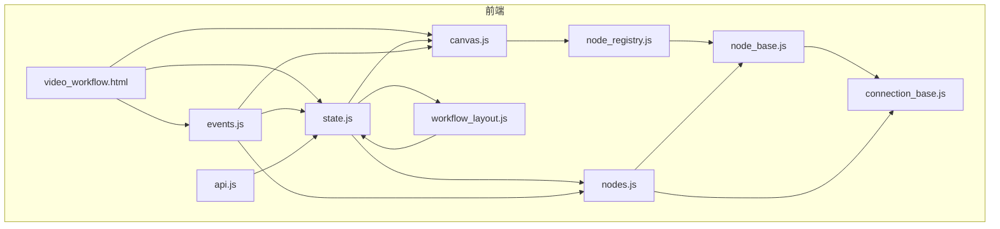
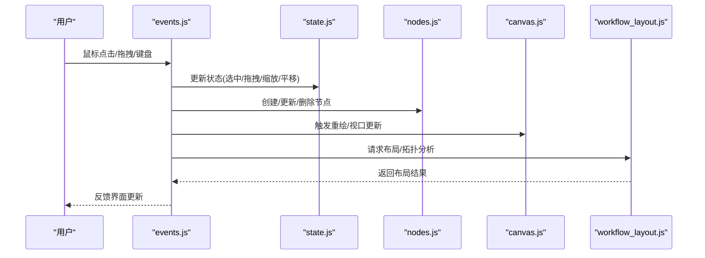
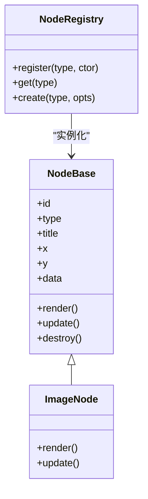
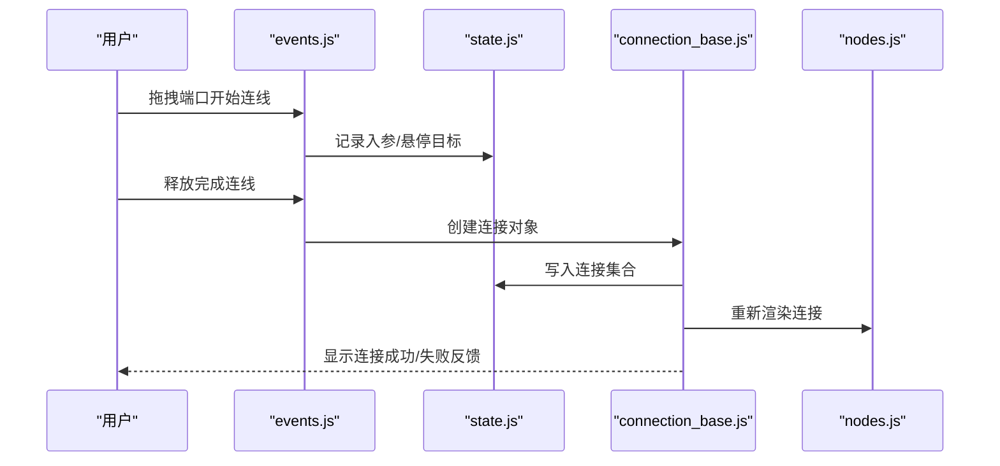
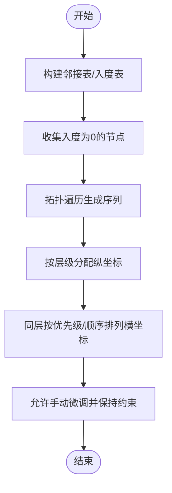
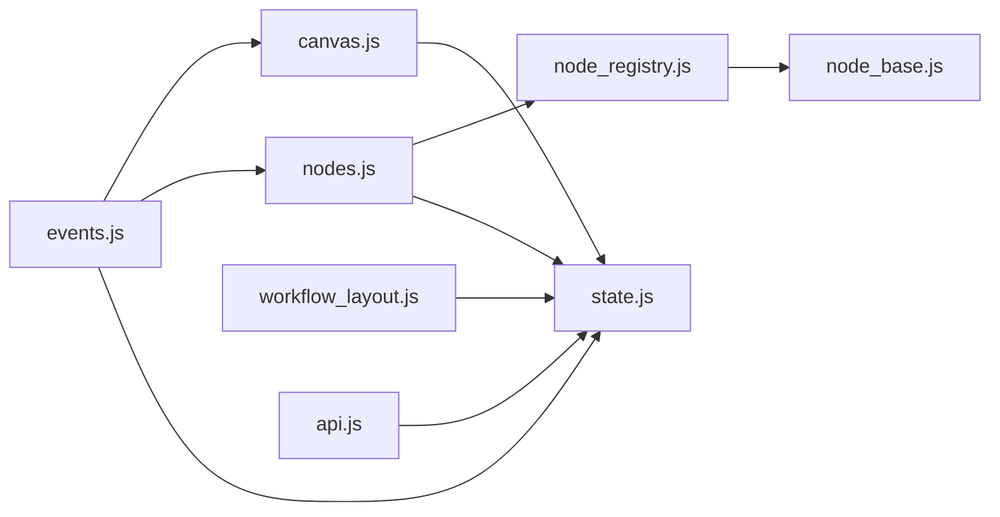

# 无限画布编辑器

<cite>
**本文引用的文件**
- [canvas.js](file://web/js/canvas.js)
- [node_base.js](file://web/js/node_base.js)
- [node_registry.js](file://web/js/node_registry.js)
- [connection_base.js](file://web/js/connection_base.js)
- [nodes.js](file://web/js/nodes.js)
- [workflow_layout.js](file://web/js/workflow_layout.js)
- [events.js](file://web/js/events.js)
- [state.js](file://web/js/state.js)
- [api.js](file://web/js/api.js)
- [workflow.html](file://web/video_workflow.html)
</cite>

## 目录
1. [简介](#简介)
2. [项目结构](#项目结构)
3. [核心组件](#核心组件)
4. [架构总览](#架构总览)
5. [详细组件分析](#详细组件分析)
6. [依赖分析](#依赖分析)
7. [性能考虑](#性能考虑)
8. [故障排除指南](#故障排除指南)
9. [结论](#结论)
10. [附录](#附录)

## 简介
本文件面向“无限画布编辑器”的前端实现，围绕节点系统、连接系统、布局算法、画布交互（缩放、平移、视口）、节点拖拽/选择/删除以及扩展与性能优化进行系统化说明。文档以仓库中的前端 JavaScript 文件为依据，结合实际代码结构与调用关系，提供可操作的架构解读与实践建议。

## 项目结构
编辑器前端位于 web/js 目录，核心模块包括：
- 画布与视口管理：canvas.js
- 节点基类与注册机制：node_base.js、node_registry.js
- 连接线抽象与绘制：connection_base.js
- 节点类型与业务节点实现：nodes.js
- 工作流布局与拓扑：workflow_layout.js
- 事件与交互：events.js
- 全局状态：state.js
- API 通信：api.js
- 页面入口：video_workflow.html

图表来源
- [canvas.js](file://web/js/canvas.js)
- [node_base.js](file://web/js/node_base.js)
- [node_registry.js](file://web/js/node_registry.js)
- [connection_base.js](file://web/js/connection_base.js)
- [nodes.js](file://web/js/nodes.js)
- [workflow_layout.js](file://web/js/workflow_layout.js)
- [events.js](file://web/js/events.js)
- [state.js](file://web/js/state.js)
- [api.js](file://web/js/api.js)
- [workflow.html](file://web/video_workflow.html)

章节来源
- [canvas.js](file://web/js/canvas.js)
- [node_base.js](file://web/js/node_base.js)
- [node_registry.js](file://web/js/node_registry.js)
- [connection_base.js](file://web/js/connection_base.js)
- [nodes.js](file://web/js/nodes.js)
- [workflow_layout.js](file://web/js/workflow_layout.js)
- [events.js](file://web/js/events.js)
- [state.js](file://web/js/state.js)
- [api.js](file://web/js/api.js)
- [workflow.html](file://web/video_workflow.html)

## 核心组件
- 画布与视口管理：负责缩放、平移、视口边界、网格对齐、最小缩放限制等。
- 节点系统：节点基类定义通用属性与行为；注册机制集中管理节点类型；节点类型在 nodes.js 中具体实现。
- 连接系统：抽象连接基类与绘制逻辑，支持多种连接类型（如图像连接、首帧连接）。
- 布局系统：基于拓扑排序构建邻接表、入度表，支持自动布局与手动调整。
- 事件与交互：统一处理鼠标/键盘事件，驱动节点拖拽、连线、选择、删除等。
- 全局状态：集中存储节点、连接、当前选中项、视口参数等。
- API 通信：与后端交互，保存工作流、拉取数据等。

章节来源
- [canvas.js](file://web/js/canvas.js)
- [node_base.js](file://web/js/node_base.js)
- [node_registry.js](file://web/js/node_registry.js)
- [connection_base.js](file://web/js/connection_base.js)
- [nodes.js](file://web/js/nodes.js)
- [workflow_layout.js](file://web/js/workflow_layout.js)
- [events.js](file://web/js/events.js)
- [state.js](file://web/js/state.js)
- [api.js](file://web/js/api.js)

## 架构总览
编辑器采用“页面 + 状态 + 模块化组件”的分层架构：
- 页面层：video_workflow.html 加载资源并初始化应用。
- 状态层：state.js 提供全局状态与持久化能力。
- 交互层：events.js 处理用户输入，协调节点与画布行为。
- 渲染层：canvas.js 管理视口与渲染；nodes.js 负责节点 DOM 与样式；connection_base.js 负责连接绘制。
- 布局层：workflow_layout.js 提供拓扑与自动布局能力。
- 扩展层：node_registry.js 注册节点类型，便于后续扩展。

图表来源
- [events.js](file://web/js/events.js)
- [state.js](file://web/js/state.js)
- [nodes.js](file://web/js/nodes.js)
- [canvas.js](file://web/js/canvas.js)
- [workflow_layout.js](file://web/js/workflow_layout.js)

## 详细组件分析

### 节点系统设计与生命周期
- 节点基类（node_base.js）
  - 定义节点通用属性（id、type、title、x/y、data 等）与方法（渲染、更新、销毁）。
  - 作为所有节点类型的父类，提供一致的生命周期钩子与接口。
- 节点注册机制（node_registry.js）
  - 维护节点类型到构造函数的映射，提供注册、查询、实例化能力。
  - 支持扩展新节点类型，遵循统一的注册规范。
- 节点生命周期管理
  - 创建：注册节点类型后，通过工厂或直接调用创建实例。
  - 渲染：根据节点类型生成 DOM，绑定事件，接入画布容器。
  - 更新：响应状态变化，刷新 UI 与连接。
  - 销毁：清理 DOM、事件监听与引用，避免内存泄漏。

图表来源
- [node_base.js](file://web/js/node_base.js)
- [node_registry.js](file://web/js/node_registry.js)
- [nodes.js](file://web/js/nodes.js)

章节来源
- [node_base.js](file://web/js/node_base.js)
- [node_registry.js](file://web/js/node_registry.js)
- [nodes.js](file://web/js/nodes.js)

### 连接系统实现
- 连接基类（connection_base.js）
  - 抽象连接的起点、终点、样式、渲染与交互。
  - 支持多种连接类型（普通连接、图像连接、首帧连接等），通过状态区分。
- 连接绘制与验证
  - 绘制：根据节点位置与端口计算路径，渲染 SVG 或 Canvas。
  - 验证：检查连接合法性（类型匹配、环路检测、数量限制等）。
  - 断开：支持删除连接、撤销连接、断开端口等操作。
- 状态管理
  - 连接集合与特殊连接集合（如 imageConnections、firstFrameConnections）在状态中维护，便于统一渲染与校验。

图表来源
- [connection_base.js](file://web/js/connection_base.js)
- [events.js](file://web/js/events.js)
- [state.js](file://web/js/state.js)
- [nodes.js](file://web/js/nodes.js)

章节来源
- [connection_base.js](file://web/js/connection_base.js)
- [events.js](file://web/js/events.js)
- [state.js](file://web/js/state.js)
- [nodes.js](file://web/js/nodes.js)

### 布局算法工作机制
- 图构建
  - 基于所有连接（含图像连接、首帧连接）构建邻接表、逆邻接表与入度表。
- 拓扑遍历
  - 使用入度为 0 的节点作为起点，逐层推进，得到拓扑序列。
- 自动布局
  - 根据拓扑层级设置节点纵向位置，横向按层级内节点数与间距分布。
  - 支持手动微调：用户拖拽节点后，保留拓扑方向性与层级约束。
- 约束保持
  - 对于跨层级连接，尽量减少交叉与回绕，维持视觉清晰度。

图表来源
- [workflow_layout.js](file://web/js/workflow_layout.js)
- [state.js](file://web/js/state.js)

章节来源
- [workflow_layout.js](file://web/js/workflow_layout.js)
- [state.js](file://web/js/state.js)

### 画布缩放、平移与视口管理
- 缩放
  - 限制最小缩放比例，防止过度缩小导致不可见。
  - 缩放中心通常为鼠标位置或视口中心，保证交互自然。
- 平移
  - 鼠标拖拽或键盘方向键移动视口，实时更新画布偏移。
- 视口边界
  - 限定可移动范围，避免节点移出可视区域。
- 网格对齐
  - 启用网格时，节点移动与连接绘制对齐网格，提升排版一致性。

章节来源
- [canvas.js](file://web/js/canvas.js)
- [events.js](file://web/js/events.js)
- [state.js](file://web/js/state.js)

### 节点拖拽、选择与删除
- 拖拽
  - 按下节点头部进入拖拽态，记录初始偏移；移动时更新节点 x/y，并触发重绘与连接重算。
- 选择
  - 单击切换选中，Shift/Ctrl 多选；选中节点高亮，支持批量操作。
- 删除
  - 删除节点同时删除其关联连接；删除连接时同步更新两端节点状态。

章节来源
- [events.js](file://web/js/events.js)
- [nodes.js](file://web/js/nodes.js)
- [state.js](file://web/js/state.js)

### 节点类型扩展指南
- 新增节点类型步骤
  - 在 node_registry.js 中注册新类型与构造函数。
  - 在 nodes.js 中实现节点渲染、事件绑定、数据更新逻辑。
  - 如需特殊连接，扩展 connection_base.js 或新增连接类型。
- 开发最佳实践
  - 保持节点数据结构简洁，避免冗余字段。
  - 将 UI 与逻辑分离，便于测试与维护。
  - 提供默认尺寸与端口布局，确保与其他节点兼容。

章节来源
- [node_registry.js](file://web/js/node_registry.js)
- [nodes.js](file://web/js/nodes.js)
- [connection_base.js](file://web/js/connection_base.js)

### 自定义节点开发与性能优化建议
- 自定义节点开发
  - 基于 node_base.js 扩展，复用通用渲染与更新流程。
  - 利用 state.js 的变更通知机制，按需重绘，避免全量刷新。
- 性能优化
  - 虚拟化：仅渲染可见区域内的节点与连接。
  - 批处理：合并多次状态更新，减少重绘次数。
  - 懒加载：节点内容按需加载，降低初始渲染压力。
  - 事件节流：拖拽与缩放事件使用节流/防抖，提升流畅度。

章节来源
- [node_base.js](file://web/js/node_base.js)
- [nodes.js](file://web/js/nodes.js)
- [state.js](file://web/js/state.js)

## 依赖分析
- 模块耦合
  - events.js 与 state.js 强耦合，负责输入与状态同步。
  - nodes.js 依赖 node_base.js 与 node_registry.js，实现具体节点。
  - canvas.js 依赖 state.js 与 nodes.js，负责渲染与视口。
  - workflow_layout.js 依赖 state.js 的节点与连接集合。
- 外部依赖
  - API 通信通过 api.js 封装，与后端交互保存/加载工作流。
- 循环依赖
  - 当前结构未发现循环依赖；若新增连接类型，需避免在 connection_base.js 中反向依赖 nodes.js。

图表来源
- [events.js](file://web/js/events.js)
- [state.js](file://web/js/state.js)
- [nodes.js](file://web/js/nodes.js)
- [canvas.js](file://web/js/canvas.js)
- [node_registry.js](file://web/js/node_registry.js)
- [node_base.js](file://web/js/node_base.js)
- [workflow_layout.js](file://web/js/workflow_layout.js)
- [api.js](file://web/js/api.js)

章节来源
- [events.js](file://web/js/events.js)
- [state.js](file://web/js/state.js)
- [nodes.js](file://web/js/nodes.js)
- [canvas.js](file://web/js/canvas.js)
- [node_registry.js](file://web/js/node_registry.js)
- [node_base.js](file://web/js/node_base.js)
- [workflow_layout.js](file://web/js/workflow_layout.js)
- [api.js](file://web/js/api.js)

## 性能考虑
- 渲染优化
  - 使用 requestAnimationFrame 控制重绘节奏，避免阻塞主线程。
  - 连接绘制采用路径缓存与增量更新，减少重复计算。
- 数据结构优化
  - 使用 Map/Set 存储节点与连接，提升查找与去重效率。
  - 对大图场景启用虚拟滚动与可见性裁剪。
- 交互优化
  - 拖拽与缩放事件节流，降低高频回调开销。
  - 选择与删除批量操作，减少 DOM 操作次数。

## 故障排除指南
- 节点无法拖拽
  - 检查事件绑定是否生效，确认状态中当前选中节点正确。
- 连接不显示或异常
  - 校验连接集合与端口坐标计算，确认渲染顺序与层级。
- 布局错乱
  - 检查拓扑构建是否包含孤立节点或无效连接，必要时重置布局。
- 缩放/平移卡顿
  - 关闭不必要的重绘任务，启用节流与批处理。

章节来源
- [events.js](file://web/js/events.js)
- [state.js](file://web/js/state.js)
- [canvas.js](file://web/js/canvas.js)
- [workflow_layout.js](file://web/js/workflow_layout.js)

## 结论
该编辑器通过清晰的模块划分与状态驱动，实现了节点系统、连接系统、布局算法与画布交互的协同工作。依托注册机制与基类抽象，扩展新节点类型成本低；借助拓扑布局与视口管理，满足复杂工作流的可视化需求。建议在大规模场景下进一步引入虚拟化与增量渲染策略，持续优化交互流畅度与渲染性能。

## 附录
- 页面入口与资源加载
  - video_workflow.html 作为编辑器主页面，加载 JS 资源并初始化应用。
- API 交互
  - api.js 封装后端接口，支持保存、加载、导出等操作。

章节来源
- [workflow.html](file://web/video_workflow.html)
- [api.js](file://web/js/api.js)