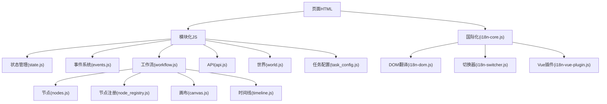
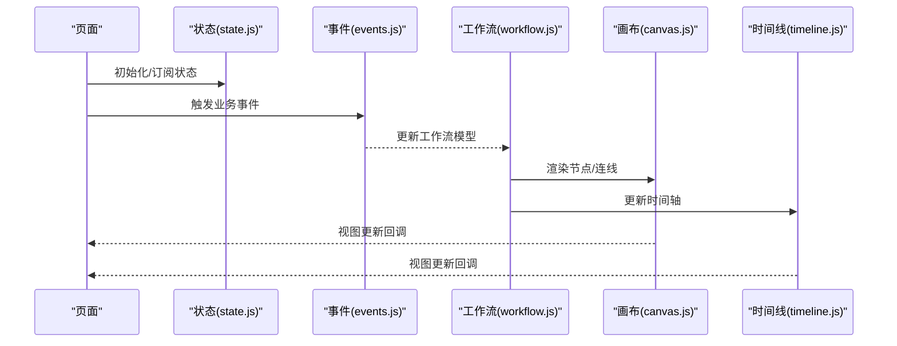
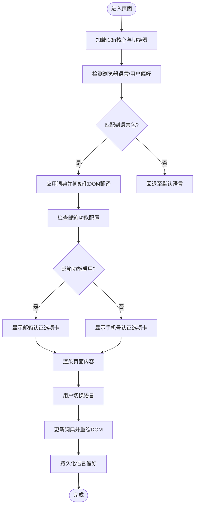
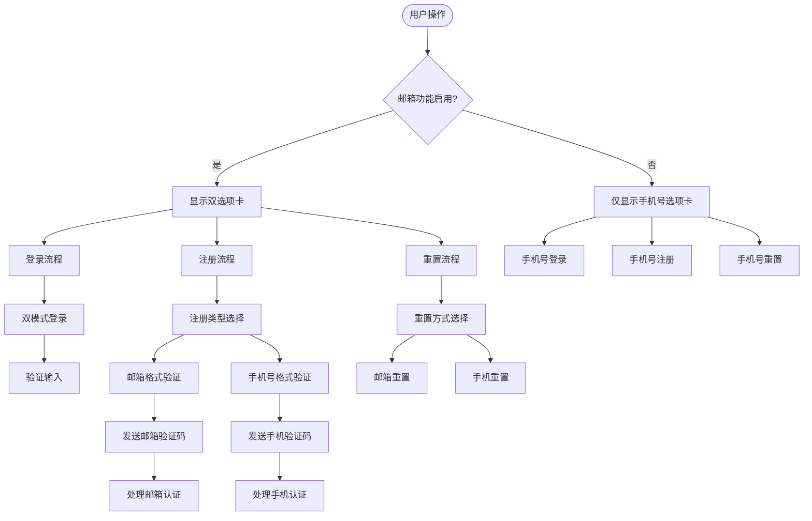
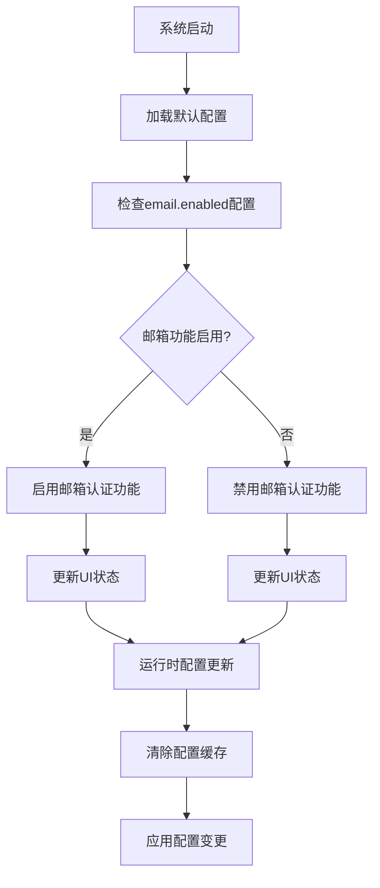
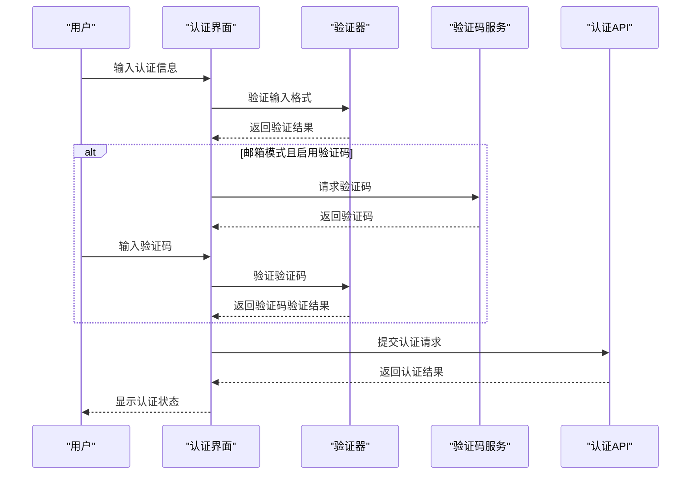
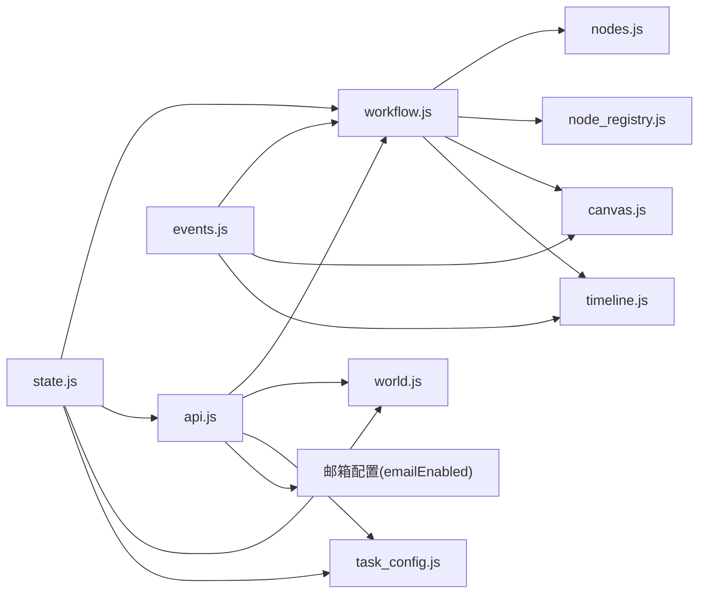

# 前端界面设计

<cite>
**本文引用的文件**
- [index.html](file://web/index.html)
- [admin.html](file://web/admin.html)
- [marketing_agent.html](file://web/marketing_agent.html)
- [script_writer.html](file://web/script_writer.html)
- [video_workflow.html](file://web/video_workflow.html)
- [video_workflow_list.html](file://web/video_workflow_list.html)
- [i18n-core.js](file://web/i18n/i18n-core.js)
- [i18n-dom.js](file://web/i18n/i18n-dom.js)
- [i18n-switcher.js](file://web/i18n/i18n-switcher.js)
- [i18n-switcher.css](file://web/i18n/i18n-switcher.css)
- [i18n-vue-plugin.js](file://web/i18n/i18n-vue-plugin.js)
- [index.css](file://web/css/index.css)
- [admin.css](file://web/css/admin.css)
- [marketing_agent.css](file://web/css/marketing_agent.css)
- [script_writer.css](file://web/css/script_writer.css)
- [video_workflow.css](file://web/css/video_workflow.css)
- [state.js](file://web/js/state.js)
- [events.js](file://web/js/events.js)
- [workflow.js](file://web/js/workflow.js)
- [node_base.js](file://web/js/node_base.js)
- [nodes.js](file://web/js/nodes.js)
- [node_registry.js](file://web/js/node_registry.js)
- [canvas.js](file://web/js/canvas.js)
- [timeline.js](file://web/js/timeline.js)
- [api.js](file://web/js/api.js)
- [world.js](file://web/js/world.js)
- [task_config.js](file://web/js/task_config.js)
- [text_node.js](file://web/js/text_node.js)
- [dialogue_group_node.js](file://web/js/dialogue_group_node.js)
- [extract_frame_node.js](file://web/js/extract_frame_node.js)
- [camera_control_node.js](file://web/js/camera_control_node.js)
- [text_to_speech_node.js](file://web/js/text_to_speech_node.js)
- [shot_frame_generator.js](file://web/js/shot_frame_generator.js)
- [shot_frame_video_generator.js](file://web/js/shot_frame_video_generator.js)
- [video_compressor.js](file://web/js/video_compressor.js)
- [image_coloring_editor.js](file://web/js/image_coloring_editor.js)
- [video_prompt_suffix.js](file://web/js/video_prompt_suffix.js)
- [camera_3d_preview.js](file://web/js/camera_3d_preview.js)
- [workflow_layout.js](file://web/js/workflow_layout.js)
- [admin.js](file://web/js/admin.js)
- [character_card.html](file://web/character_card.html)
- [external_recharge.html](file://web/external_recharge.html)
- [reference_audio_guide.html](file://web/reference_audio_guide.html)
- [image_style_guide.html](file://web/image_style_guide.html)
- [computing_power_logs.html](file://web/computing_power_logs.html)
- [marked.min.js](file://web/js/marked.min.js)
- [default_configs.py](file://config/default_configs.py)
- [server.py](file://server.py)
</cite>

## 更新摘要
**所做更改**
- 新增邮箱认证选项卡功能章节，详细介绍双模式登录/注册/密码重置实现
- 更新页面与导航设计章节，添加邮箱功能启用状态的UI自动适配机制
- 新增邮箱认证配置管理章节，说明系统配置与运行时状态管理
- 更新国际化支持机制章节，添加邮箱相关多语言资源
- 新增邮箱认证安全机制章节，涵盖验证码集成与人机验证

## 目录
1. [引言](#引言)
2. [项目结构](#项目结构)
3. [核心组件](#核心组件)
4. [架构总览](#架构总览)
5. [详细组件分析](#详细组件分析)
6. [邮箱认证选项卡功能](#邮箱认证选项卡功能)
7. [邮箱认证配置管理](#邮箱认证配置管理)
8. [邮箱认证安全机制](#邮箱认证安全机制)
9. [依赖关系分析](#依赖关系分析)
10. [性能考虑](#性能考虑)
11. [故障排除指南](#故障排除指南)
12. [结论](#结论)
13. [附录](#附录)

## 引言
本文件面向ZhiJuTong前端界面设计，系统性梳理页面架构与导航设计、单页应用（SPA）路由与状态管理、组件设计模式（Vue.js、原生JS模块）、国际化支持机制（多语言切换、本地化资源管理、文化适配）、响应式设计策略（移动端适配、触摸交互、性能优化）、前端构建流程与资源优化（压缩与缓存）、UI组件库使用指南与主题切换、实时通信（SSE）前端实现与状态同步机制，以及新增的邮箱认证选项卡功能。文档以仓库中实际存在的HTML、CSS、JS与i18n资源为依据，避免臆测，确保可追溯性。

## 项目结构
前端代码主要位于web目录下，采用"页面+模块化JS+样式+国际化资源"的组织方式：
- 页面：各功能页面对应独立HTML文件，如首页、管理员页、营销代理页、脚本写作页、视频工作流页等。
- 模块化JS：按功能域拆分，如状态管理、事件系统、工作流编辑器、节点系统、画布与时间线、API封装等。
- 样式：每个页面有独立CSS文件，便于按需加载与主题化。
- 国际化：i18n目录包含核心JS、DOM翻译工具、Vue插件及多语言JSON资源。

```mermaid
graph TB
subgraph "页面"
IDX["index.html"]
ADM["admin.html"]
MKT["marketing_agent.html"]
SW["script_writer.html"]
VW["video_workflow.html"]
VWL["video_workflow_list.html"]
end
subgraph "国际化"
I18N_CORE["i18n-core.js"]
I18N_DOM["i18n-dom.js"]
I18N_SW["i18n-switcher.js"]
I18N_CSS["i18n-switcher.css"]
I18N_VUE["i18n-vue-plugin.js"]
LOCALES["locales/zh-CN & en"]
end
subgraph "样式"
CSS_IDX["index.css"]
CSS_ADM["admin.css"]
CSS_MKT["marketing_agent.css"]
CSS_SW["script_writer.css"]
CSS_VW["video_workflow.css"]
end
subgraph "模块化JS"
STATE["state.js"]
EVENTS["events.js"]
WORKFLOW["workflow.js"]
NODES["nodes.js"]
NODE_REG["node_registry.js"]
CANVAS["canvas.js"]
TIMELINE["timeline.js"]
API["api.js"]
WORLD["world.js"]
TASKCFG["task_config.js"]
TEXTNODE["text_node.js"]
DIALOGUE["dialogue_group_node.js"]
EXTRACT["extract_frame_node.js"]
CAMCTRL["camera_control_node.js"]
TTS["text_to_speech_node.js"]
SHOTIMG["shot_frame_generator.js"]
SHOTVID["shot_frame_video_generator.js"]
VIDEOPROC["video_compressor.js"]
IMGEDIT["image_coloring_editor.js"]
PROMPTSFX["video_prompt_suffix.js"]
CAM3D["camera_3d_preview.js"]
LAYOUT["workflow_layout.js"]
ADMINJS["admin.js"]
end
IDX --> STATE
IDX --> EVENTS
IDX --> WORKFLOW
IDX --> NODES
IDX --> CANVAS
IDX --> TIMELINE
IDX --> API
IDX --> WORLD
IDX --> TASKCFG
ADM --> ADMINJS
ADM --> API
MKT --> API
MKT --> STATE
SW --> API
SW --> STATE
VW --> WORKFLOW
VW --> NODES
VW --> CANVAS
VW --> TIMELINE
VW --> API
VWL --> API
I18N_CORE --> I18N_DOM
I18N_CORE --> I18N_SW
I18N_CORE --> I18N_VUE
I18N_SW --> CSS_IDX
I18N_SW --> CSS_ADM
I18N_SW --> CSS_MKT
I18N_SW --> CSS_SW
I18N_SW --> CSS_VW
```

**图表来源**
- [index.html](file://web/index.html)
- [admin.html](file://web/admin.html)
- [marketing_agent.html](file://web/marketing_agent.html)
- [script_writer.html](file://web/script_writer.html)
- [video_workflow.html](file://web/video_workflow.html)
- [video_workflow_list.html](file://web/video_workflow_list.html)
- [i18n-core.js](file://web/i18n/i18n-core.js)
- [i18n-dom.js](file://web/i18n/i18n-dom.js)
- [i18n-switcher.js](file://web/i18n/i18n-switcher.js)
- [i18n-switcher.css](file://web/i18n/i18n-switcher.css)
- [i18n-vue-plugin.js](file://web/i18n/i18n-vue-plugin.js)
- [index.css](file://web/css/index.css)
- [admin.css](file://web/css/admin.css)
- [marketing_agent.css](file://web/css/marketing_agent.css)
- [script_writer.css](file://web/css/script_writer.css)
- [video_workflow.css](file://web/css/video_workflow.css)
- [state.js](file://web/js/state.js)
- [events.js](file://web/js/events.js)
- [workflow.js](file://web/js/workflow.js)
- [nodes.js](file://web/js/nodes.js)
- [node_registry.js](file://web/js/node_registry.js)
- [canvas.js](file://web/js/canvas.js)
- [timeline.js](file://web/js/timeline.js)
- [api.js](file://web/js/api.js)
- [world.js](file://web/js/world.js)
- [task_config.js](file://web/js/task_config.js)
- [text_node.js](file://web/js/text_node.js)
- [dialogue_group_node.js](file://web/js/dialogue_group_node.js)
- [extract_frame_node.js](file://web/js/extract_frame_node.js)
- [camera_control_node.js](file://web/js/camera_control_node.js)
- [text_to_speech_node.js](file://web/js/text_to_speech_node.js)
- [shot_frame_generator.js](file://web/js/shot_frame_generator.js)
- [shot_frame_video_generator.js](file://web/js/shot_frame_video_generator.js)
- [video_compressor.js](file://web/js/video_compressor.js)
- [image_coloring_editor.js](file://web/js/image_coloring_editor.js)
- [video_prompt_suffix.js](file://web/js/video_prompt_suffix.js)
- [camera_3d_preview.js](file://web/js/camera_3d_preview.js)
- [workflow_layout.js](file://web/js/workflow_layout.js)
- [admin.js](file://web/js/admin.js)

**章节来源**
- [index.html](file://web/index.html)
- [admin.html](file://web/admin.html)
- [marketing_agent.html](file://web/marketing_agent.html)
- [script_writer.html](file://web/script_writer.html)
- [video_workflow.html](file://web/video_workflow.html)
- [video_workflow_list.html](file://web/video_workflow_list.html)

## 核心组件
- 页面层：各功能页面作为入口，按需引入对应JS模块与样式。
- 国际化层：i18n-core负责词典与切换逻辑；i18n-dom负责DOM文本替换；i18n-switcher提供切换UI与样式；i18n-vue-plugin用于Vue组件内翻译。
- 状态与事件：state.js集中管理全局状态；events.js提供事件总线机制。
- 工作流编辑器：workflow.js、nodes.js、node_registry.js、canvas.js、timeline.js构成可视化编辑与渲染体系。
- 功能模块：API封装、世界数据、任务配置、各类节点（文本、对话组、提取帧、相机控制、TTS、拍摄生成、视频处理、图像编辑、提示词后缀、3D预览、布局）。
- 页面专用：admin.js等针对特定页面的功能脚本。

**章节来源**
- [state.js](file://web/js/state.js)
- [events.js](file://web/js/events.js)
- [workflow.js](file://web/js/workflow.js)
- [nodes.js](file://web/js/nodes.js)
- [node_registry.js](file://web/js/node_registry.js)
- [canvas.js](file://web/js/canvas.js)
- [timeline.js](file://web/js/timeline.js)
- [api.js](file://web/js/api.js)
- [world.js](file://web/js/world.js)
- [task_config.js](file://web/js/task_config.js)
- [text_node.js](file://web/js/text_node.js)
- [dialogue_group_node.js](file://web/js/dialogue_group_node.js)
- [extract_frame_node.js](file://web/js/extract_frame_node.js)
- [camera_control_node.js](file://web/js/camera_control_node.js)
- [text_to_speech_node.js](file://web/js/text_to_speech_node.js)
- [shot_frame_generator.js](file://web/js/shot_frame_generator.js)
- [shot_frame_video_generator.js](file://web/js/shot_frame_video_generator.js)
- [video_compressor.js](file://web/js/video_compressor.js)
- [image_coloring_editor.js](file://web/js/image_coloring_editor.js)
- [video_prompt_suffix.js](file://web/js/video_prompt_suffix.js)
- [camera_3d_preview.js](file://web/js/camera_3d_preview.js)
- [workflow_layout.js](file://web/js/workflow_layout.js)
- [admin.js](file://web/js/admin.js)

## 架构总览
ZhiJuTong前端采用"页面即SPA入口 + 模块化JS + 国际化插件"的混合架构。页面通过HTML引入对应JS模块，模块间通过事件总线与状态管理解耦；国际化通过核心模块在DOM与Vue组件层面统一注入；工作流编辑器以节点注册表为核心，动态扩展节点类型，统一渲染与交互。

**图表来源**
- [index.html](file://web/index.html)
- [state.js](file://web/js/state.js)
- [events.js](file://web/js/events.js)
- [workflow.js](file://web/js/workflow.js)
- [nodes.js](file://web/js/nodes.js)
- [node_registry.js](file://web/js/node_registry.js)
- [canvas.js](file://web/js/canvas.js)
- [timeline.js](file://web/js/timeline.js)
- [api.js](file://web/js/api.js)
- [world.js](file://web/js/world.js)
- [task_config.js](file://web/js/task_config.js)
- [i18n-core.js](file://web/i18n/i18n-core.js)
- [i18n-dom.js](file://web/i18n/i18n-dom.js)
- [i18n-switcher.js](file://web/i18n/i18n-switcher.js)
- [i18n-vue-plugin.js](file://web/i18n/i18n-vue-plugin.js)

## 详细组件分析

### 页面与导航设计
- 页面入口：index.html、admin.html、marketing_agent.html、script_writer.html、video_workflow.html、video_workflow_list.html等作为独立入口，按需加载对应JS与CSS。
- 导航策略：页面间通过链接跳转实现导航；未发现传统前端路由（如history.pushState或第三方路由库），因此采用"页面即SPA入口"的静态SPA模式。
- 资源加载：各页面仅引入自身所需模块，减少初始负载。
- **邮箱功能适配**：新增emailEnabled状态控制，根据系统配置动态显示邮箱认证相关UI元素，实现邮箱功能启用状态的自动适配。

**章节来源**
- [index.html](file://web/index.html)
- [admin.html](file://web/admin.html)
- [marketing_agent.html](file://web/marketing_agent.html)
- [script_writer.html](file://web/script_writer.html)
- [video_workflow.html](file://web/video_workflow.html)
- [video_workflow_list.html](file://web/video_workflow_list.html)

### 单页应用（SPA）路由与状态管理
- 路由管理：未发现集中式前端路由库；页面通过URL变化进行导航，但无深度监听与参数解析逻辑。
- 状态管理：state.js集中管理全局状态，提供订阅/发布能力；events.js提供跨模块事件通信，降低耦合度。
- 状态同步：工作流编辑器通过事件驱动更新画布与时间线；API模块变更触发状态刷新。

**图表来源**
- [state.js](file://web/js/state.js)
- [events.js](file://web/js/events.js)
- [workflow.js](file://web/js/workflow.js)
- [canvas.js](file://web/js/canvas.js)
- [timeline.js](file://web/js/timeline.js)

**章节来源**
- [state.js](file://web/js/state.js)
- [events.js](file://web/js/events.js)
- [workflow.js](file://web/js/workflow.js)
- [canvas.js](file://web/js/canvas.js)
- [timeline.js](file://web/js/timeline.js)

### 组件设计模式
- Vue.js组件：i18n-vue-plugin.js表明存在Vue集成场景，可在Vue组件中使用翻译指令或过滤器，提升组件内本地化一致性。
- 原生JavaScript模块：nodes.js、node_registry.js、canvas.js、timeline.js等以ES模块形式组织，职责清晰、可复用性强。
- React组件：未在仓库中发现React相关文件或依赖，不涉及React组件设计模式。

**章节来源**
- [i18n-vue-plugin.js](file://web/i18n/i18n-vue-plugin.js)
- [nodes.js](file://web/js/nodes.js)
- [node_registry.js](file://web/js/node_registry.js)
- [canvas.js](file://web/js/canvas.js)
- [timeline.js](file://web/js/timeline.js)

### 国际化支持机制
- 多语言切换：i18n-switcher.js提供切换器UI与逻辑；i18n-switcher.css控制切换器样式；i18n-core.js维护词典与切换函数。
- 本地化资源管理：locales目录包含zh-CN与en两套JSON资源，覆盖common、index、admin、marketing_agent、video_workflow、workflow_list等页面。
- 文化适配：i18n-dom.js负责DOM文本替换；i18n-core.js提供键值映射与回退策略；i18n-vue-plugin.js用于Vue组件内翻译。
- **邮箱认证国际化**：新增邮箱认证相关的多语言资源，包括登录手机号/邮箱提示、邮箱注册/重置选项等。

**图表来源**
- [i18n-core.js](file://web/i18n/i18n-core.js)
- [i18n-dom.js](file://web/i18n/i18n-dom.js)
- [i18n-switcher.js](file://web/i18n/i18n-switcher.js)
- [i18n-switcher.css](file://web/i18n/i18n-switcher.css)
- [locales/zh-CN/common.json](file://web/i18n/locales/zh-CN/common.json)
- [locales/en/common.json](file://web/i18n/locales/en/common.json)

**章节来源**
- [i18n-core.js](file://web/i18n/i18n-core.js)
- [i18n-dom.js](file://web/i18n/i18n-dom.js)
- [i18n-switcher.js](file://web/i18n/i18n-switcher.js)
- [i18n-switcher.css](file://web/i18n/i18n-switcher.css)
- [locales/zh-CN/common.json](file://web/i18n/locales/zh-CN/common.json)
- [locales/en/common.json](file://web/i18n/locales/en/common.json)

### 响应式设计策略
- 移动端适配：页面未见媒体查询或响应式框架使用痕迹，建议在现有CSS基础上增加断点与弹性布局。
- 触摸交互：节点拖拽、画布缩放、时间线滑动等功能需验证触摸兼容性，必要时引入Hammer.js等手势库。
- 性能优化：按需加载JS/CSS；对大列表采用虚拟滚动；图片懒加载；Canvas渲染使用requestAnimationFrame节流。

**章节来源**
- [index.css](file://web/css/index.css)
- [admin.css](file://web/css/admin.css)
- [marketing_agent.css](file://web/css/marketing_agent.css)
- [script_writer.css](file://web/css/script_writer.css)
- [video_workflow.css](file://web/css/video_workflow.css)

### 前端构建流程、资源压缩与缓存策略
- 构建流程：仓库未提供打包配置文件（如webpack、vite、rollup等），无法确定具体构建流程。
- 资源压缩：未发现压缩后的静态资源，建议启用JS/CSS压缩与图片优化。
- 缓存策略：建议设置HTTP缓存头与版本化资源名，结合Service Worker实现离线缓存。

**章节来源**
- [index.html](file://web/index.html)
- [admin.html](file://web/admin.html)
- [marketing_agent.html](file://web/marketing_agent.html)
- [script_writer.html](file://web/script_writer.html)
- [video_workflow.html](file://web/video_workflow.html)
- [video_workflow_list.html](file://web/video_workflow_list.html)

### UI组件库使用指南、样式定制与主题切换
- 组件库：未发现第三方UI组件库依赖，建议引入轻量组件库（如基于原生的组件）以统一风格。
- 样式定制：通过CSS变量与主题类名实现主题切换；为每个页面提供独立CSS以便按需加载。
- 主题切换：结合i18n-switcher的切换逻辑，增加主题偏好存储与自动应用。

**章节来源**
- [index.css](file://web/css/index.css)
- [admin.css](file://web/css/admin.css)
- [marketing_agent.css](file://web/css/marketing_agent.css)
- [script_writer.css](file://web/css/script_writer.css)
- [video_workflow.css](file://web/css/video_workflow.css)
- [i18n-switcher.js](file://web/i18n/i18n-switcher.js)
- [i18n-switcher.css](file://web/i18n/i18n-switcher.css)

### 实时通信与SSE前端实现
- SSE支持：未在仓库中发现SSE相关实现或依赖，若需要实时状态同步，建议引入EventSource并在API层建立SSE通道。
- 状态同步：结合events.js与state.js，将SSE事件转化为内部事件，驱动视图更新。

**章节来源**
- [events.js](file://web/js/events.js)
- [state.js](file://web/js/state.js)
- [api.js](file://web/js/api.js)

## 邮箱认证选项卡功能

### 功能概述
新增邮箱认证选项卡功能，支持手机号和邮箱双模式登录、注册和密码重置。该功能通过emailEnabled状态控制UI显示，实现邮箱功能启用状态的自动适配。

### UI组件设计
- **选项卡切换**：在登录、注册、密码重置三种模式下，根据邮箱功能启用状态动态显示相应的选项卡按钮
- **输入字段适配**：登录时根据emailEnabled状态显示"手机号/邮箱"或"手机号"标签和占位符
- **注册类型切换**：当邮箱功能启用时，注册表单显示"手机号"和"邮箱"两个注册类型的选项卡
- **重置方式切换**：当邮箱功能启用时，密码重置表单显示"手机重置"和"邮箱重置"的选项卡

### 数据验证与处理
- **邮箱格式验证**：注册和重置时对邮箱地址进行正则表达式验证
- **手机号格式验证**：保持原有的手机号格式验证规则
- **动态参数构建**：根据当前注册/重置类型动态构建API请求参数

**图表来源**
- [index.html](file://web/index.html)

### 状态管理
- **emailEnabled状态**：从系统配置中获取邮箱功能启用状态
- **authMode状态**：控制当前显示的认证模式（login/register/reset）
- **registerType状态**：注册时的类型选择（phone/email）
- **resetType状态**：重置时的方式选择（phone/email）

**章节来源**
- [index.html](file://web/index.html)

## 邮箱认证配置管理

### 系统配置
邮箱认证功能通过系统配置进行管理，主要配置项包括：

- **email.enabled**：控制是否启用邮箱注册/登录功能
- **captcha.enabled**：控制是否启用验证码功能
- **captcha.prefix**：验证码前缀标识
- **captcha.scene_id**：验证码场景ID

### 配置初始化
系统默认配置中包含了邮箱认证相关的配置项，确保新部署时具备完整的邮箱认证能力。

### 运行时配置更新
管理员可以通过后台管理系统动态更新邮箱认证相关配置，系统支持配置的热更新和缓存清除。

**图表来源**
- [default_configs.py](file://config/default_configs.py)
- [server.py](file://server.py)

**章节来源**
- [default_configs.py](file://config/default_configs.py)
- [server.py](file://server.py)

## 邮箱认证安全机制

### 验证码集成
- **CAPTCHA集成**：当邮箱模式且验证码功能启用时，注册和重置流程会触发人机验证
- **验证码场景**：支持不同的验证码场景标识，如register_code、reset_code
- **验证码实例管理**：通过captchaInstance管理验证码组件的生命周期

### 安全验证流程
- **邮箱格式验证**：使用正则表达式验证邮箱地址格式
- **手机号格式验证**：保持原有的手机号格式验证规则
- **验证码验证**：在提交注册或重置请求前验证验证码
- **请求参数构建**：根据当前模式动态构建API请求参数

### 错误处理与反馈
- **输入验证错误**：提供详细的错误信息指导用户正确输入
- **验证码错误**：处理验证码过期或错误的情况
- **网络请求错误**：处理API调用失败的情况
- **系统配置错误**：当邮箱功能未启用时提供友好的错误提示

**图表来源**
- [index.html](file://web/index.html)
- [server.py](file://server.py)

**章节来源**
- [index.html](file://web/index.html)
- [server.py](file://server.py)

## 依赖关系分析
- 模块内聚：工作流编辑器内部高度内聚，节点注册表统一管理节点类型，画布与时间线解耦渲染。
- 模块耦合：通过events.js与state.js降低模块间耦合；API模块集中封装网络请求。
- 外部依赖：未发现npm/yarn依赖文件，国际化与组件库需自行引入。
- **邮箱认证依赖**：新增emailEnabled状态依赖于系统配置，影响多个UI组件的显示逻辑。

**图表来源**
- [state.js](file://web/js/state.js)
- [events.js](file://web/js/events.js)
- [workflow.js](file://web/js/workflow.js)
- [nodes.js](file://web/js/nodes.js)
- [node_registry.js](file://web/js/node_registry.js)
- [canvas.js](file://web/js/canvas.js)
- [timeline.js](file://web/js/timeline.js)
- [api.js](file://web/js/api.js)
- [world.js](file://web/js/world.js)
- [task_config.js](file://web/js/task_config.js)

**章节来源**
- [state.js](file://web/js/state.js)
- [events.js](file://web/js/events.js)
- [workflow.js](file://web/js/workflow.js)
- [nodes.js](file://web/js/nodes.js)
- [node_registry.js](file://web/js/node_registry.js)
- [canvas.js](file://web/js/canvas.js)
- [timeline.js](file://web/js/timeline.js)
- [api.js](file://web/js/api.js)
- [world.js](file://web/js/world.js)
- [task_config.js](file://web/js/task_config.js)

## 性能考虑
- 资源加载：按需加载页面JS/CSS，避免一次性加载所有模块。
- 渲染优化：Canvas渲染使用节流与分帧；时间线与节点列表采用虚拟滚动。
- 缓存：启用浏览器缓存与HTTP缓存头；对静态资源进行版本化。
- 图片与媒体：采用懒加载与WebP格式；视频压缩模块已存在，建议在前端链路中启用。
- **邮箱认证性能**：验证码组件按需加载，避免不必要的资源消耗。

**章节来源**
- [canvas.js](file://web/js/canvas.js)
- [timeline.js](file://web/js/timeline.js)
- [video_compressor.js](file://web/js/video_compressor.js)

## 故障排除指南
- 国际化失效：检查i18n-core.js词典是否正确加载，i18n-dom.js是否成功替换DOM文本；确认locales目录语言包完整。
- 工作流渲染异常：检查nodes.js与node_registry.js是否正确注册节点；确认canvas.js与timeline.js事件回调是否触发。
- API调用失败：检查api.js中的请求封装与错误处理；确认后端接口可用性。
- 事件未传播：检查events.js事件派发与订阅是否匹配；确认state.js订阅者是否正确注册。
- **邮箱认证问题**：检查email.enabled配置是否正确；验证验证码服务是否正常；确认邮箱格式验证逻辑。

**章节来源**
- [i18n-core.js](file://web/i18n/i18n-core.js)
- [i18n-dom.js](file://web/i18n/i18n-dom.js)
- [nodes.js](file://web/js/nodes.js)
- [node_registry.js](file://web/js/node_registry.js)
- [canvas.js](file://web/js/canvas.js)
- [timeline.js](file://web/js/timeline.js)
- [api.js](file://web/js/api.js)
- [events.js](file://web/js/events.js)
- [state.js](file://web/js/state.js)
- [index.html](file://web/index.html)

## 结论
ZhiJuTong前端以页面即SPA入口为核心，配合模块化JS与国际化插件，实现了清晰的职责划分与良好的可维护性。工作流编辑器通过节点注册表与事件驱动实现高扩展性。新增的邮箱认证选项卡功能通过emailEnabled状态实现了邮箱功能启用状态的自动适配，支持手机号和邮箱双模式认证，增强了系统的灵活性和用户体验。建议后续完善构建流程、引入UI组件库与主题系统、增强响应式与触摸交互、补充SSE实时通信，并加强性能优化与缓存策略，以进一步提升用户体验与开发效率。

## 附录
- 页面清单与用途
  - index.html：首页入口，工作流编辑器主页面之一，包含邮箱认证选项卡功能。
  - admin.html：管理员页面，引入admin.js与API模块。
  - marketing_agent.html：营销代理页面，引入API与状态模块。
  - script_writer.html：脚本写作页面，引入API与状态模块。
  - video_workflow.html：视频工作流页面，引入工作流编辑器全套模块。
  - video_workflow_list.html：视频工作流列表页面，引入API模块。
  - character_card.html：角色卡片页面。
  - external_recharge.html：外部充值页面。
  - reference_audio_guide.html：参考音频指南页面。
  - image_style_guide.html：图像风格指南页面。
  - computing_power_logs.html：算力日志页面。
- 样式清单
  - index.css、admin.css、marketing_agent.css、script_writer.css、video_workflow.css：各页面独立样式文件。
- 国际化资源
  - locales/zh-CN与locales/en：包含admin.json、common.json、index.json、marketing_agent.json、video_workflow.json、workflow_list.json等页面级资源。
- **邮箱认证相关资源**
  - 邮箱认证选项卡UI组件
  - 邮箱格式验证逻辑
  - 验证码集成与人机验证
  - 邮箱功能配置管理

**章节来源**
- [index.html](file://web/index.html)
- [admin.html](file://web/admin.html)
- [marketing_agent.html](file://web/marketing_agent.html)
- [script_writer.html](file://web/script_writer.html)
- [video_workflow.html](file://web/video_workflow.html)
- [video_workflow_list.html](file://web/video_workflow_list.html)
- [character_card.html](file://web/character_card.html)
- [external_recharge.html](file://web/external_recharge.html)
- [reference_audio_guide.html](file://web/reference_audio_guide.html)
- [image_style_guide.html](file://web/image_style_guide.html)
- [computing_power_logs.html](file://web/computing_power_logs.html)
- [index.css](file://web/css/index.css)
- [admin.css](file://web/css/admin.css)
- [marketing_agent.css](file://web/css/marketing_agent.css)
- [script_writer.css](file://web/css/script_writer.css)
- [video_workflow.css](file://web/css/video_workflow.css)
- [locales/zh-CN/admin.json](file://web/i18n/locales/zh-CN/admin.json)
- [locales/zh-CN/common.json](file://web/i18n/locales/zh-CN/common.json)
- [locales/zh-CN/index.json](file://web/i18n/locales/zh-CN/index.json)
- [locales/zh-CN/marketing_agent.json](file://web/i18n/locales/zh-CN/marketing_agent.json)
- [locales/zh-CN/video_workflow.json](file://web/i18n/locales/zh-CN/video_workflow.json)
- [locales/zh-CN/workflow_list.json](file://web/i18n/locales/zh-CN/workflow_list.json)
- [locales/en/admin.json](file://web/i18n/locales/en/admin.json)
- [locales/en/common.json](file://web/i18n/locales/en/common.json)
- [locales/en/index.json](file://web/i18n/locales/en/index.json)
- [locales/en/marketing_agent.json](file://web/i18n/locales/en/marketing_agent.json)
- [locales/en/video_workflow.json](file://web/i18n/locales/en/video_workflow.json)
- [locales/en/workflow_list.json](file://web/i18n/locales/en/workflow_list.json)