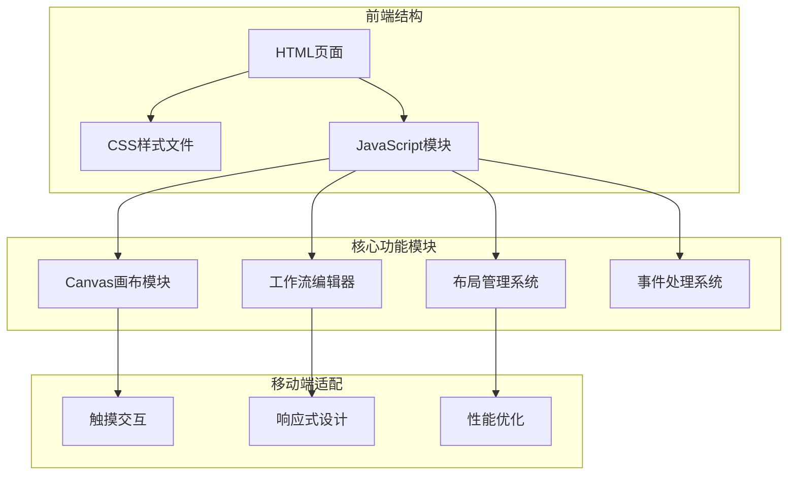
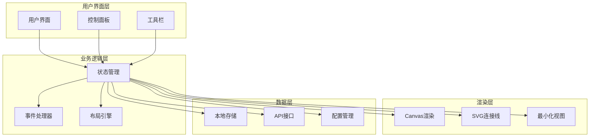
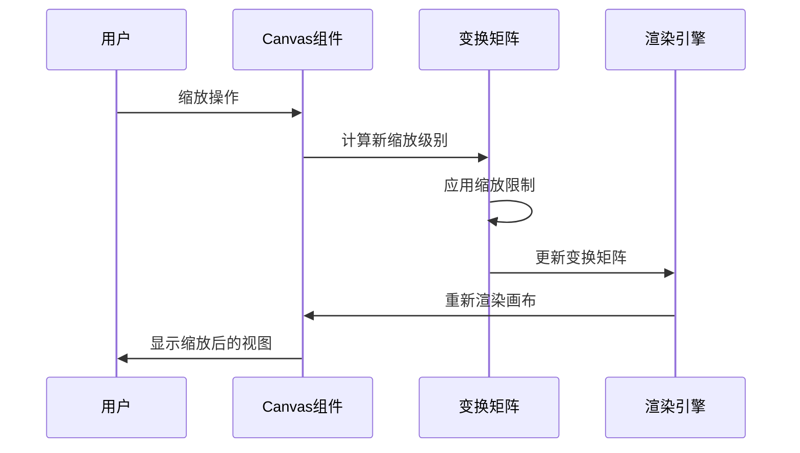
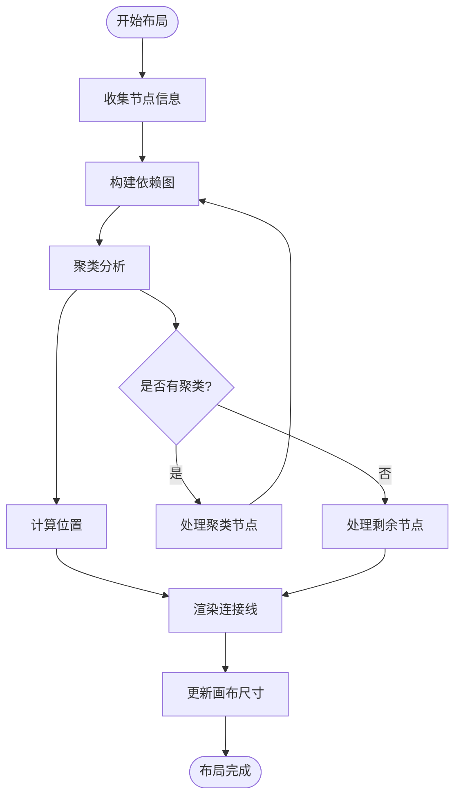
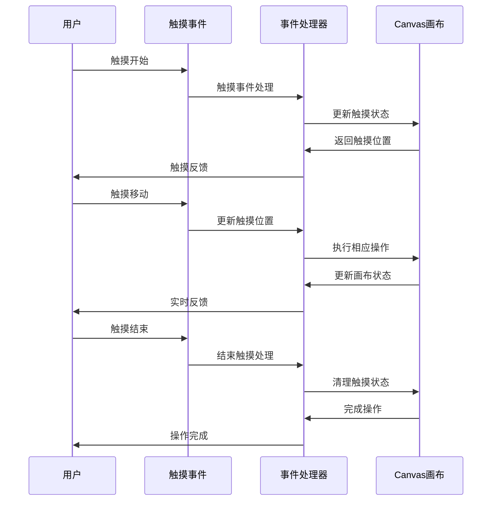
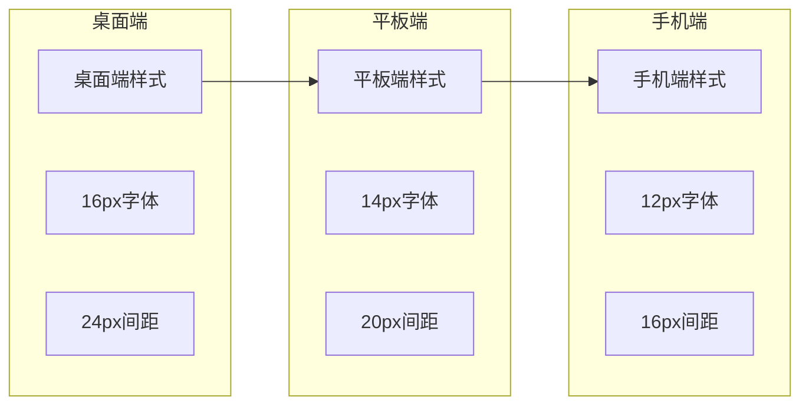
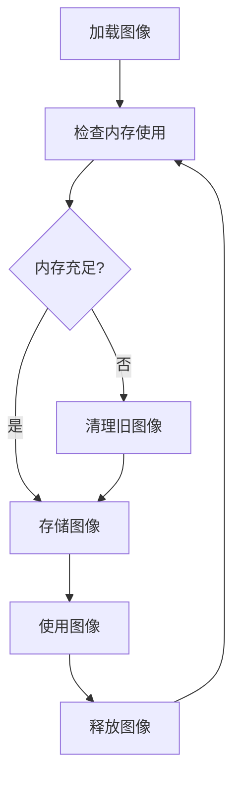
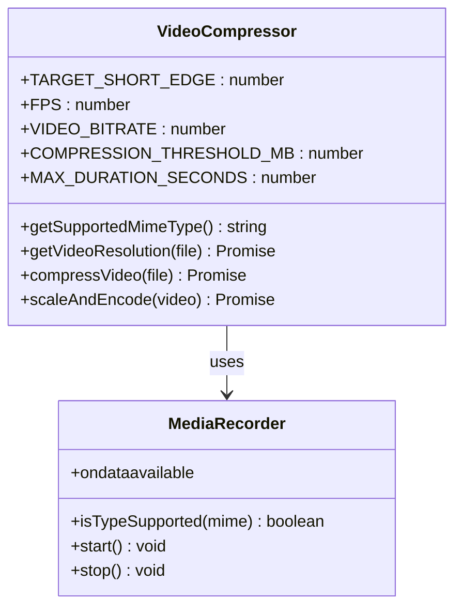
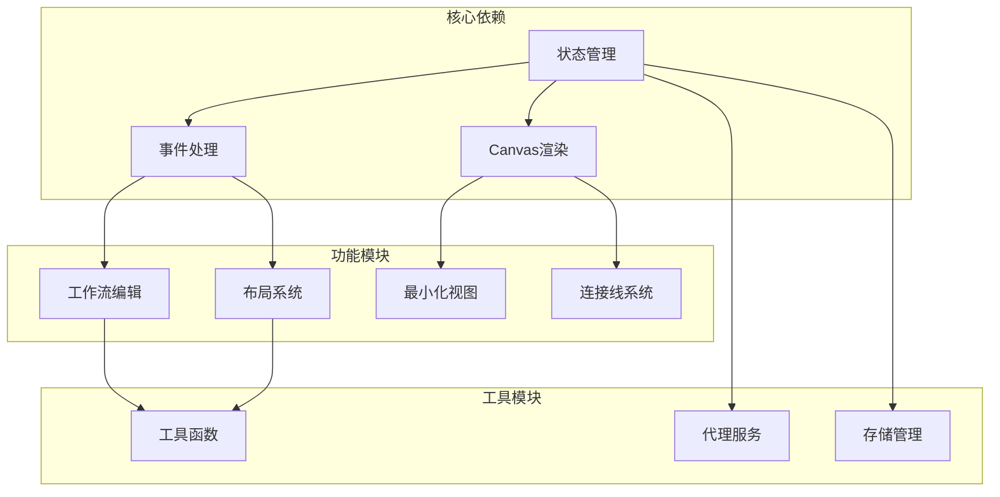

# 响应式设计与移动端适配

<cite>
**本文档引用的文件**
- [index.css](file://web/css/index.css)
- [video_workflow.css](file://web/css/video_workflow.css)
- [canvas.js](file://web/js/canvas.js)
- [workflow.js](file://web/js/workflow.js)
- [workflow_layout.js](file://web/js/workflow_layout.js)
- [events.js](file://web/js/events.js)
- [image_coloring_editor.js](file://web/js/image_coloring_editor.js)
- [video_compressor.js](file://web/js/video_compressor.js)
- [camera_3d_preview.js](file://web/js/camera_3d_preview.js)
- [state.js](file://web/js/state.js)
</cite>

## 目录
1. [引言](#引言)
2. [项目结构](#项目结构)
3. [核心组件](#核心组件)
4. [架构概览](#架构概览)
5. [详细组件分析](#详细组件分析)
6. [依赖关系分析](#依赖关系分析)
7. [性能考虑](#性能考虑)
8. [故障排除指南](#故障排除指南)
9. [结论](#结论)

## 引言

本项目是一个基于Web的工作流编辑器，专注于视频生成和编辑功能。本文档深入分析了项目的响应式设计与移动端适配策略，涵盖了CSS媒体查询使用、断点设计原则、触摸交互实现、Canvas性能优化、工作流布局系统适配以及跨浏览器兼容性等方面。

项目采用现代化的前端技术栈，包括原生JavaScript、Canvas API、SVG矢量图形和响应式CSS设计，为用户提供流畅的桌面端和移动端体验。

## 项目结构

项目采用模块化组织方式，主要分为以下层次：

**图表来源**
- [index.css:1-800](file://web/css/index.css#L1-L800)
- [video_workflow.css:1-800](file://web/css/video_workflow.css#L1-L800)

**章节来源**
- [index.css:1-800](file://web/css/index.css#L1-L800)
- [video_workflow.css:1-800](file://web/css/video_workflow.css#L1-L800)

## 核心组件

### 响应式布局系统

项目实现了多层次的响应式设计，通过CSS变量和Flexbox布局实现自适应界面：

- **桌面端优化**：使用较大的间距和字体尺寸，支持复杂的多列布局
- **平板端适配**：调整间距和字体大小，优化触摸目标尺寸
- **手机端优化**：简化布局结构，增大触摸热区，优化滚动体验

### Canvas画布系统

Canvas画布系统提供了高性能的图形渲染能力，支持：

- 实时缩放和平移操作
- 节点拖拽和连接线绘制
- 最小化视图生成
- 高精度坐标变换

### 触摸交互系统

实现了完整的触摸事件处理机制：

- 支持多点触控手势
- 触摸事件与鼠标事件的无缝转换
- 移动端专用的交互优化

**章节来源**
- [canvas.js:1-498](file://web/js/canvas.js#L1-L498)
- [workflow_layout.js:1-589](file://web/js/workflow_layout.js#L1-L589)

## 架构概览

项目采用模块化架构，各组件之间通过清晰的接口进行通信：

**图表来源**
- [state.js:124-160](file://web/js/state.js#L124-L160)
- [canvas.js:66-93](file://web/js/canvas.js#L66-L93)

## 详细组件分析

### Canvas画布系统

Canvas画布系统是项目的核心渲染组件，实现了高性能的图形处理：

#### 缩放和变换机制

**图表来源**
- [canvas.js:74-93](file://web/js/canvas.js#L74-L93)
- [canvas.js:66-93](file://web/js/canvas.js#L66-L93)

#### 最小化视图实现

最小化视图提供了全局概览功能：

- **动态计算**：实时计算所有节点的位置和尺寸
- **缩放适配**：自动计算合适的缩放比例
- **交互导航**：支持点击快速定位到对应区域

**章节来源**
- [canvas.js:4-64](file://web/js/canvas.js#L4-L64)

### 工作流布局系统

工作流布局系统实现了智能的节点排列和连接管理：

#### 自动布局算法

**图表来源**
- [workflow_layout.js:390-460](file://web/js/workflow_layout.js#L390-L460)

#### 碰撞检测系统

实现了高效的节点放置检测机制：

- **多方向搜索**：支持优先向右和向下扩展
- **迭代优化**：使用螺旋式搜索算法
- **性能优化**：限制最大搜索迭代次数

**章节来源**
- [workflow_layout.js:476-588](file://web/js/workflow_layout.js#L476-L588)

### 触摸交互系统

触摸交互系统提供了完整的移动端支持：

#### 触摸事件处理

**图表来源**
- [image_coloring_editor.js:170-194](file://web/js/image_coloring_editor.js#L170-L194)

#### 触摸优化特性

- **被动事件监听**：使用`{ passive: false }`确保触摸事件可取消
- **坐标转换**：正确处理触摸坐标到Canvas坐标的转换
- **性能优化**：避免不必要的重绘和布局计算

**章节来源**
- [image_coloring_editor.js:75-108](file://web/js/image_coloring_editor.js#L75-L108)

### 响应式设计策略

#### 断点设计原则

项目采用了灵活的断点设计策略：

- **桌面端**：1024px以上，支持复杂的多列布局
- **平板端**：768px-1024px，优化触摸交互体验
- **手机端**：768px以下，简化布局结构

#### 字体和间距适配

**图表来源**
- [index.css:65-75](file://web/css/index.css#L65-L75)
- [video_workflow.css:504-508](file://web/css/video_workflow.css#L504-L508)

**章节来源**
- [index.css:15-30](file://web/css/index.css#L15-L30)
- [video_workflow.css:456-462](file://web/css/video_workflow.css#L456-L462)

### Canvas性能优化

#### 分辨率适配

Canvas性能优化采用了多种策略：

- **动态分辨率**：根据缩放级别调整Canvas分辨率
- **内存管理**：及时释放不需要的图像资源
- **渲染优化**：使用requestAnimationFrame优化渲染频率

#### 内存管理策略

**图表来源**
- [canvas.js:378-496](file://web/js/canvas.js#L378-L496)

**章节来源**
- [canvas.js:298-376](file://web/js/canvas.js#L298-L376)

### 移动端专用UI组件

#### 图像着色编辑器

图像着色编辑器提供了专业的触摸绘画功能：

- **画笔预览**：实时显示画笔大小和颜色
- **触摸优化**：针对移动设备优化的触摸响应
- **撤销重做**：完整的操作历史管理

#### 视频压缩模块

**图表来源**
- [video_compressor.js:1-40](file://web/js/video_compressor.js#L1-L40)

**章节来源**
- [video_compressor.js:1-40](file://web/js/video_compressor.js#L1-L40)

## 依赖关系分析

项目组件之间的依赖关系如下：

**图表来源**
- [state.js:124-160](file://web/js/state.js#L124-L160)
- [canvas.js:157-160](file://web/js/canvas.js#L157-L160)

**章节来源**
- [state.js:124-160](file://web/js/state.js#L124-L160)
- [canvas.js:157-160](file://web/js/canvas.js#L157-L160)

## 性能考虑

### 渲染性能优化

项目采用了多项性能优化策略：

- **虚拟滚动**：对于大量节点的场景，使用虚拟滚动减少DOM节点数量
- **增量更新**：只更新发生变化的部分，避免全量重绘
- **请求动画帧**：使用requestAnimationFrame优化动画性能

### 内存管理

- **图像资源管理**：及时释放不再使用的图像资源
- **事件监听器清理**：在组件销毁时清理事件监听器
- **缓存策略**：合理使用缓存减少重复计算

### 移动端优化

- **触摸事件优化**：使用被动事件监听提高触摸响应速度
- **网络请求优化**：合并请求，减少网络往返
- **电池使用优化**：避免不必要的后台活动

## 故障排除指南

### 常见问题诊断

#### Canvas渲染问题

**症状**：Canvas显示异常或渲染缓慢

**解决方案**：
1. 检查Canvas尺寸设置
2. 验证变换矩阵计算
3. 确认渲染循环状态

#### 触摸事件问题

**症状**：触摸操作无响应或响应延迟

**解决方案**：
1. 验证触摸事件绑定
2. 检查事件冒泡和捕获
3. 确认坐标转换正确性

#### 布局计算问题

**症状**：节点位置计算错误或布局异常

**解决方案**：
1. 检查节点尺寸获取
2. 验证依赖关系图构建
3. 确认碰撞检测逻辑

**章节来源**
- [canvas.js:4-64](file://web/js/canvas.js#L4-L64)
- [events.js:271-276](file://web/js/events.js#L271-L276)

## 结论

本项目在响应式设计和移动端适配上展现了全面的技术实力。通过精心设计的Canvas系统、智能的布局算法和完善的触摸交互机制，为用户提供了优秀的跨平台体验。

关键成就包括：

- **完整的响应式架构**：从桌面到移动端的无缝适配
- **高性能渲染系统**：优化的Canvas和SVG渲染机制
- **智能布局算法**：自动化的节点排列和连接管理
- **移动端专用优化**：针对触摸设备的专门优化
- **跨浏览器兼容**：良好的浏览器兼容性保证

这些技术实践为类似的工作流编辑器项目提供了宝贵的参考和借鉴价值。