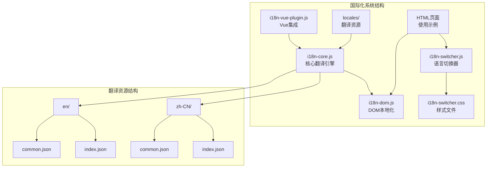
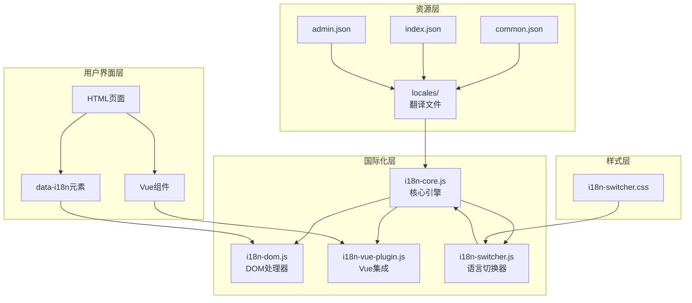
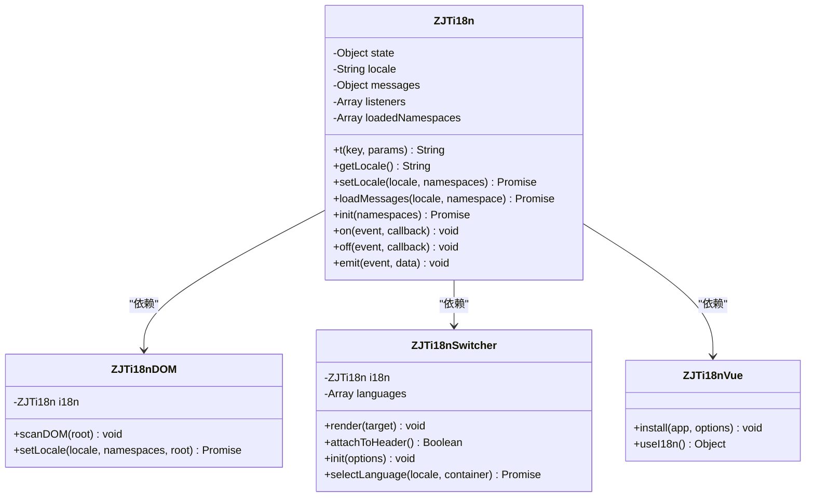
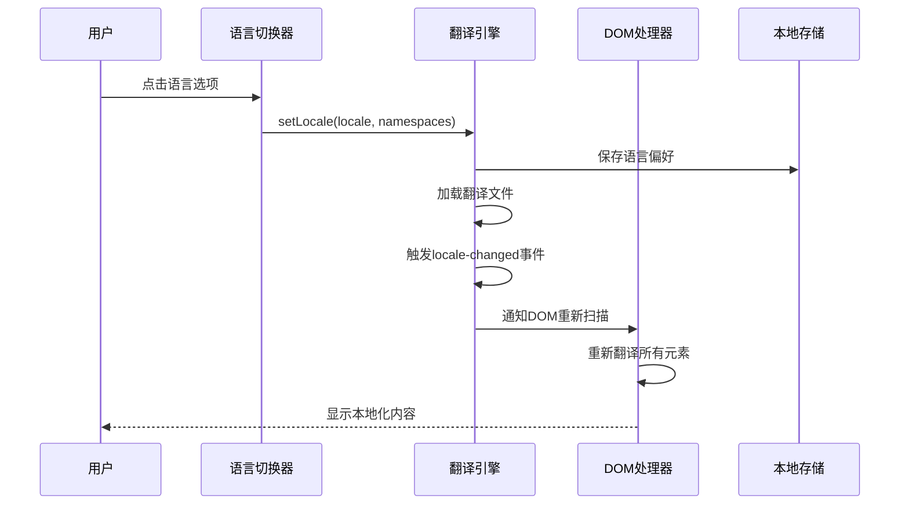
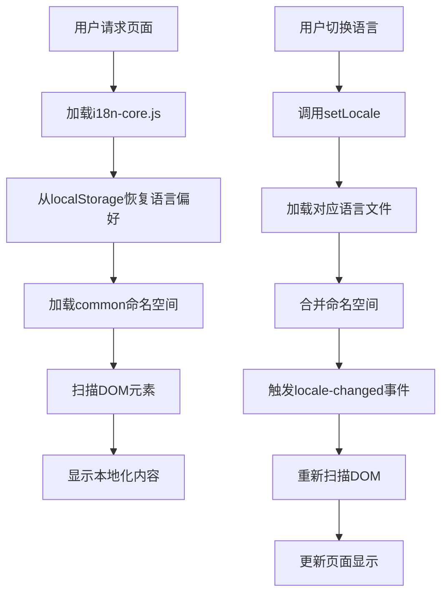
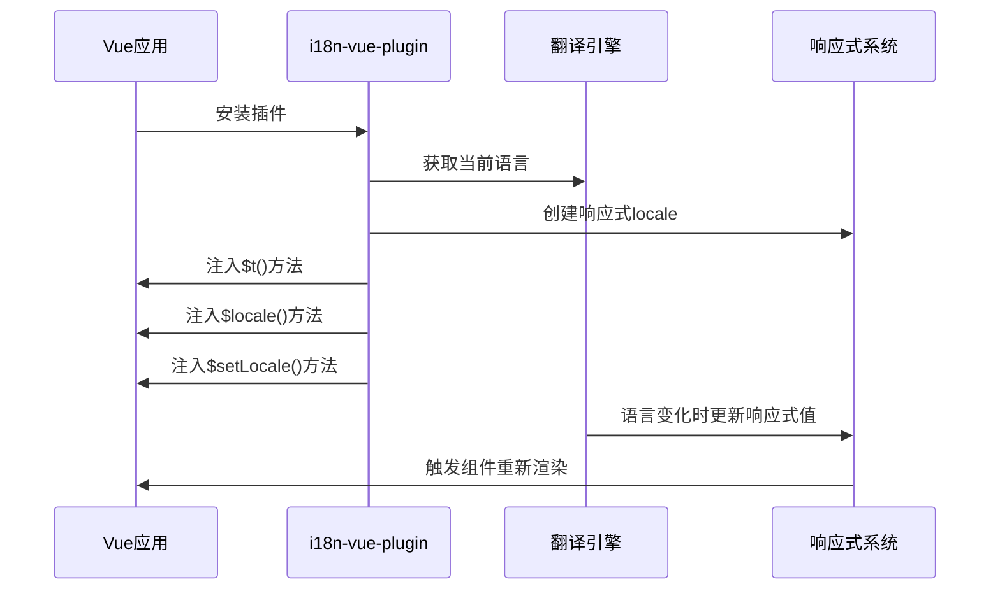
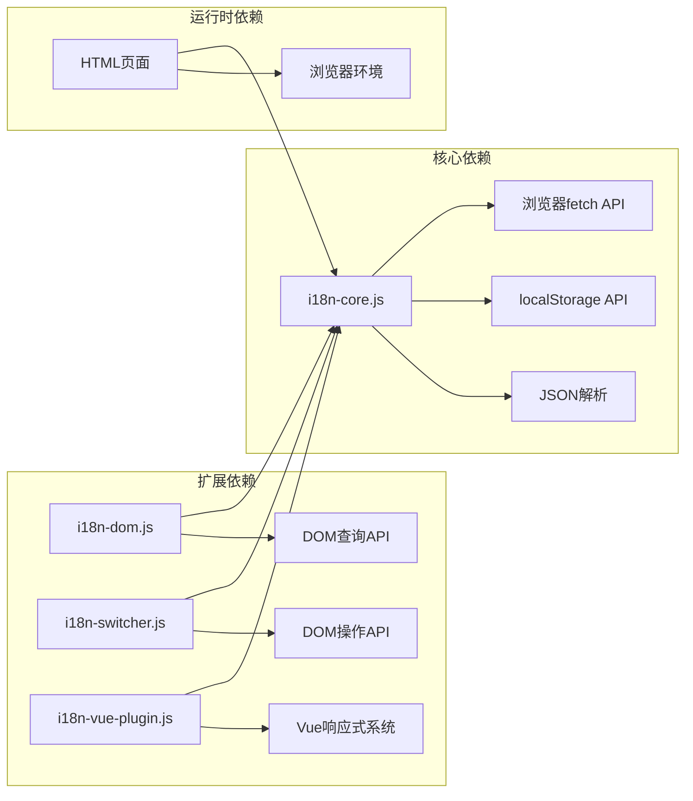

# 国际化支持

<cite>
**本文档引用的文件**
- [i18n-core.js](file://web/i18n/i18n-core.js)
- [i18n-dom.js](file://web/i18n/i18n-dom.js)
- [i18n-switcher.js](file://web/i18n/i18n-switcher.js)
- [i18n-switcher.css](file://web/i18n/i18n-switcher.css)
- [i18n-vue-plugin.js](file://web/i18n/i18n-vue-plugin.js)
- [common.json(en)](file://web/i18n/locales/en/common.json)
- [common.json(zh-CN)](file://web/i18n/locales/zh-CN/common.json)
- [index.json(en)](file://web/i18n/locales/en/index.json)
- [index.json(zh-CN)](file://web/i18n/locales/zh-CN/index.json)
- [index.html](file://web/index.html)
- [marketing_agent.html](file://web/marketing_agent.html)
- [video_workflow_list.html](file://web/video_workflow_list.html)
</cite>

## 目录
1. [简介](#简介)
2. [项目结构](#项目结构)
3. [核心组件](#核心组件)
4. [架构概览](#架构概览)
5. [详细组件分析](#详细组件分析)
6. [依赖关系分析](#依赖关系分析)
7. [性能考虑](#性能考虑)
8. [故障排除指南](#故障排除指南)
9. [结论](#结论)
10. [附录](#附录)

## 简介

这是一个轻量级的前端国际化（i18n）支持系统，专为多语言Web应用设计。系统采用模块化架构，提供了完整的国际化解决方案，包括翻译引擎、DOM本地化、语言切换器和Vue.js集成。

该系统的核心特性包括：
- 轻量级翻译引擎，支持JSON格式的翻译文件
- 自动DOM元素本地化扫描
- 语言切换器UI组件
- Vue.js框架集成
- 命名空间化的翻译资源管理
- 本地存储的语言偏好保存

## 项目结构

国际化系统位于web/i18n目录下，包含以下核心文件：



**图表来源**
- [i18n-core.js:1-180](file://web/i18n/i18n-core.js#L1-L180)
- [i18n-dom.js:1-104](file://web/i18n/i18n-dom.js#L1-L104)
- [i18n-switcher.js:1-178](file://web/i18n/i18n-switcher.js#L1-L178)

**章节来源**
- [i18n-core.js:1-180](file://web/i18n/i18n-core.js#L1-L180)
- [i18n-dom.js:1-104](file://web/i18n/i18n-dom.js#L1-L104)
- [i18n-switcher.js:1-178](file://web/i18n/i18n-switcher.js#L1-L178)

## 核心组件

### 翻译核心引擎 (i18n-core.js)

翻译核心引擎是整个国际化系统的基础，提供了以下核心功能：

- **状态管理**：维护当前语言、翻译消息缓存、事件监听器
- **异步加载**：动态加载JSON翻译文件，支持命名空间隔离
- **翻译解析**：支持嵌套键路径和参数替换
- **事件系统**：提供语言变化通知机制

关键API：
- `t(key, params)` - 主要翻译函数
- `setLocale(locale, namespaces)` - 切换语言
- `loadMessages(locale, namespace)` - 加载翻译文件
- `on(event, callback)` - 事件监听

**章节来源**
- [i18n-core.js:11-176](file://web/i18n/i18n-core.js#L11-L176)

### DOM本地化处理器 (i18n-dom.js)

DOM本地化处理器负责自动扫描和翻译HTML元素：

- **智能扫描**：查找带有`data-i18n`属性的元素
- **多目标支持**：支持text、html、placeholder、title、value等多种属性
- **参数传递**：支持JSON格式的翻译参数
- **自动更新**：监听语言变化事件，自动重新翻译

**章节来源**
- [i18n-dom.js:10-103](file://web/i18n/i18n-dom.js#L10-L103)

### 语言切换器 (i18n-switcher.js)

提供用户友好的语言切换界面：

- **多语言支持**：内置中英文切换
- **自动挂载**：可自动挂载到页面头部
- **状态同步**：与翻译引擎状态保持同步
- **HTML lang属性**：自动更新页面语言属性

**章节来源**
- [i18n-switcher.js:10-177](file://web/i18n/i18n-switcher.js#L10-L177)

### Vue.js集成 (i18n-vue-plugin.js)

为Vue.js应用提供无缝国际化支持：

- **全局方法**：`$t()`、`$locale()`、`$setLocale()`
- **响应式更新**：语言变化时自动重渲染
- **组合式API**：`useI18n()` Hook支持
- **模板集成**：支持在Vue模板中直接使用

**章节来源**
- [i18n-vue-plugin.js:9-64](file://web/i18n/i18n-vue-plugin.js#L9-L64)

## 架构概览

系统采用分层架构设计，各组件职责明确且松耦合：



**图表来源**
- [i18n-core.js:11-176](file://web/i18n/i18n-core.js#L11-L176)
- [i18n-dom.js:10-103](file://web/i18n/i18n-dom.js#L10-L103)
- [i18n-switcher.js:10-177](file://web/i18n/i18n-switcher.js#L10-L177)
- [i18n-vue-plugin.js:9-64](file://web/i18n/i18n-vue-plugin.js#L9-L64)

## 详细组件分析

### 翻译引擎类图



**图表来源**
- [i18n-core.js:11-176](file://web/i18n/i18n-core.js#L11-L176)
- [i18n-dom.js:10-103](file://web/i18n/i18n-dom.js#L10-L103)
- [i18n-switcher.js:10-177](file://web/i18n/i18n-switcher.js#L10-L177)
- [i18n-vue-plugin.js:9-64](file://web/i18n/i18n-vue-plugin.js#L9-L64)

### 语言切换流程



**图表来源**
- [i18n-switcher.js:93-106](file://web/i18n/i18n-switcher.js#L93-L106)
- [i18n-core.js:104-121](file://web/i18n/i18n-core.js#L104-L121)
- [i18n-dom.js:95-97](file://web/i18n/i18n-dom.js#L95-L97)

### 数据流处理



**图表来源**
- [i18n-core.js:158-164](file://web/i18n/i18n-core.js#L158-L164)
- [i18n-dom.js:17-81](file://web/i18n/i18n-dom.js#L17-L81)

**章节来源**
- [i18n-core.js:26-52](file://web/i18n/i18n-core.js#L26-L52)
- [i18n-dom.js:17-81](file://web/i18n/i18n-dom.js#L17-L81)

### Vue.js集成机制



**图表来源**
- [i18n-vue-plugin.js:10-38](file://web/i18n/i18n-vue-plugin.js#L10-L38)

**章节来源**
- [i18n-vue-plugin.js:9-64](file://web/i18n/i18n-vue-plugin.js#L9-L64)

## 依赖关系分析

系统采用松耦合设计，主要依赖关系如下：



**图表来源**
- [i18n-core.js:35-38](file://web/i18n/i18n-core.js#L35-L38)
- [i18n-dom.js:18-19](file://web/i18n/i18n-dom.js#L18-L19)
- [i18n-switcher.js:21-23](file://web/i18n/i18n-switcher.js#L21-L23)

**章节来源**
- [i18n-core.js:11-18](file://web/i18n/i18n-core.js#L11-L18)
- [i18n-dom.js:10-11](file://web/i18n/i18n-dom.js#L10-L11)
- [i18n-switcher.js:10-11](file://web/i18n/i18n-switcher.js#L10-L11)

## 性能考虑

### 缓存策略
- **内存缓存**：翻译消息在内存中缓存，避免重复加载
- **命名空间分离**：按需加载翻译文件，减少初始加载时间
- **懒加载机制**：仅在需要时才加载特定语言的翻译文件

### 优化建议
- **预加载策略**：在应用启动时预加载常用命名空间
- **增量更新**：支持动态添加新的翻译键值对
- **压缩传输**：生产环境中启用JSON文件压缩

## 故障排除指南

### 常见问题及解决方案

**问题1：翻译文件加载失败**
- 检查文件路径是否正确
- 确认服务器能够访问`/i18n/locales/`目录
- 验证JSON文件格式是否正确

**问题2：DOM元素未本地化**
- 确认元素是否包含`data-i18n`属性
- 检查翻译键是否存在
- 验证命名空间是否已加载

**问题3：语言切换无效**
- 检查localStorage是否可用
- 确认目标语言文件是否存在
- 验证事件监听器是否正常工作

**章节来源**
- [i18n-core.js:44-51](file://web/i18n/i18n-core.js#L44-L51)
- [i18n-dom.js:21-23](file://web/i18n/i18n-dom.js#L21-L23)

## 结论

该国际化支持系统提供了完整而轻量的多语言解决方案。其模块化设计使得各组件职责清晰，易于维护和扩展。系统的核心优势包括：

1. **轻量级设计**：最小化依赖，适合各种规模的应用
2. **灵活的命名空间**：支持按模块划分翻译资源
3. **自动本地化**：通过DOM扫描实现零样板代码
4. **框架集成**：提供Vue.js的无缝集成支持
5. **用户友好**：内置语言切换器，提升用户体验

该系统为多语言Web应用提供了一个坚实的基础，可以根据具体需求进行定制和扩展。

## 附录

### 翻译资源组织结构

系统采用按语言和命名空间组织的翻译文件结构：

```
web/i18n/locales/
├── en/
│   ├── common.json      # 通用翻译
│   ├── index.json       # 首页翻译
│   ├── admin.json       # 管理后台翻译
│   ├── marketing_agent.json  # 营销智能体翻译
│   ├── video_workflow.json   # 视频工作流翻译
│   └── workflow_list.json    # 工作流列表翻译
└── zh-CN/
    ├── common.json      # 中文通用翻译
    ├── index.json       # 中文首页翻译
    └── 其他命名空间文件...
```

### 使用示例

在HTML中使用data-i18n属性：
```html
<!-- 基本用法 -->
<h1 data-i18n="page_title">页面标题</h1>

<!-- 指定目标属性 -->
<button data-i18n="login:innerHTML" data-i18n-params='{"count": 5}'>登录</button>

<!-- 多目标属性 -->
<p data-i18n="welcome:text,placeholder" data-i18n-params='{"name": "张三"}'>
  欢迎使用
</p>
```

### 开发最佳实践

1. **命名规范**：使用有意义的翻译键，遵循层级结构
2. **参数化**：所有动态内容都应使用参数化翻译
3. **命名空间**：按功能模块划分翻译文件
4. **回退机制**：确保未翻译的键能够优雅降级
5. **性能优化**：合理使用命名空间，避免过度加载