# 构建流程与资源管理

<cite>
**本文档引用的文件**
- [index.html](file://web/index.html)
- [admin.html](file://web/admin.html)
- [script_writer.html](file://web/script_writer.html)
- [video_workflow.html](file://web/video_workflow.html)
- [video_workflow_list.html](file://web/video_workflow_list.html)
- [marketing_agent.html](file://web/marketing_agent.html)
- [character_card.html](file://web/character_card.html)
- [external_recharge.html](file://web/external_recharge.html)
- [computing_power_logs.html](file://web/computing_power_logs.html)
- [reference_audio_guide.html](file://web/reference_audio_guide.html)
- [image_style_guide.html](file://web/image_style_guide.html)
- [index.css](file://web/css/index.css)
- [admin.css](file://web/css/admin.css)
- [script_writer.css](file://web/css/script_writer.css)
- [video_workflow.css](file://web/css/video_workflow.css)
- [marketing_agent.css](file://web/css/marketing_agent.css)
- [github.min.css](file://web/css/github.min.css)
- [i18n-switcher.css](file://web/i18n/i18n-switcher.css)
- [i18n-core.js](file://web/i18n/i18n-core.js)
- [i18n-dom.js](file://web/i18n/i18n-dom.js)
- [i18n-switcher.js](file://web/i18n/i18n-switcher.js)
- [i18n-vue-plugin.js](file://web/i18n/i18n-vue-plugin.js)
- [marked.min.js](file://web/js/marked.min.js)
- [text_to_speech_node.js](file://web/js/text_to_speech_node.js)
- [video_compressor.js](file://web/js/video_compressor.js)
- [axios.min.js](file://web/js/axios.min.js)
- [run_dev.py](file://scripts/running/run_dev.py)
- [run_prod.py](file://scripts/running/run_prod.py)
- [linux_start_prod.sh](file://scripts/running/linux_start_prod.sh)
- [obfuscate.sh](file://scripts/tools/obfuscate.sh)
- [cdn_util.py](file://utils/cdn_util.py)
- [media_cache.py](file://utils/media_cache.py)
- [image_compressor.py](file://utils/image_compressor.py)
- [video_compressor.py](file://utils/video_compressor.py)
- [media_mapping_util.py](file://utils/media_mapping_util.py)
- [audio_utils.py](file://utils/audio_utils.py)
- [mime_type.py](file://utils/mime_type.py)
- [config_prod.base.yaml](file://config_prod.base.yaml)
- [requirements.txt](file://requirements.txt)
- [pyproject.toml](file://pyproject.toml)
</cite>

## 目录
1. [简介](#简介)
2. [项目结构](#项目结构)
3. [核心组件](#核心组件)
4. [架构概览](#架构概览)
5. [详细组件分析](#详细组件分析)
6. [依赖分析](#依赖分析)
7. [性能考虑](#性能考虑)
8. [故障排除指南](#故障排除指南)
9. [结论](#结论)
10. [附录](#附录)

## 简介

本项目是一个基于Python后端和前端静态资源管理的多媒体内容生成平台。前端构建流程与资源管理是整个系统的重要组成部分，负责处理静态资源的组织、压缩、优化和分发。

该系统的前端资源主要包含HTML模板页面、CSS样式文件、JavaScript模块以及第三方库。所有资源都经过精心组织和优化，以确保在不同环境下都能高效运行。

## 项目结构

前端资源采用按功能模块组织的方式，主要分为以下几个层次：

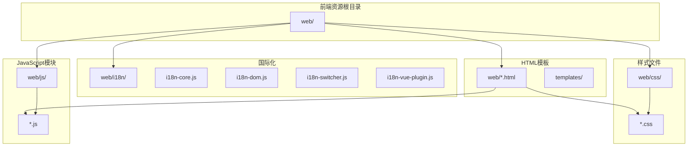

**图表来源**
- [index.html:1-50](file://web/index.html#L1-L50)
- [admin.html:1-50](file://web/admin.html#L1-L50)
- [script_writer.html:1-50](file://web/script_writer.html#L1-L50)
- [video_workflow.html:1-50](file://web/video_workflow.html#L1-L50)

**章节来源**
- [index.html:1-100](file://web/index.html#L1-L100)
- [admin.html:1-100](file://web/admin.html#L1-L100)
- [script_writer.html:1-100](file://web/script_writer.html#L1-L100)
- [video_workflow.html:1-100](file://web/video_workflow.html#L1-L100)

## 核心组件

### HTML模板系统

系统采用多页面应用架构，每个功能模块都有独立的HTML模板：

| 模板名称 | 功能描述 | 主要用途 |
|---------|----------|----------|
| index.html | 主页模板 | 用户登录和基础功能入口 |
| admin.html | 管理后台模板 | 系统管理和配置界面 |
| script_writer.html | 剧本写作模板 | 文本创作和编辑功能 |
| video_workflow.html | 视频工作流模板 | 视频生成和编辑流程 |
| video_workflow_list.html | 视频工作流列表模板 | 工作流任务管理 |
| marketing_agent.html | 营销代理模板 | 营销自动化功能 |
| character_card.html | 角色卡片模板 | 角色信息展示 |
| external_recharge.html | 外部充值模板 | 用户充值功能 |
| computing_power_logs.html | 算力日志模板 | 算力使用记录查看 |
| reference_audio_guide.html | 参考音频指南模板 | 音频参考标准说明 |
| image_style_guide.html | 图像风格指南模板 | 图像风格参考标准 |

### CSS样式架构

样式文件按照功能模块进行组织，采用语义化命名规范：

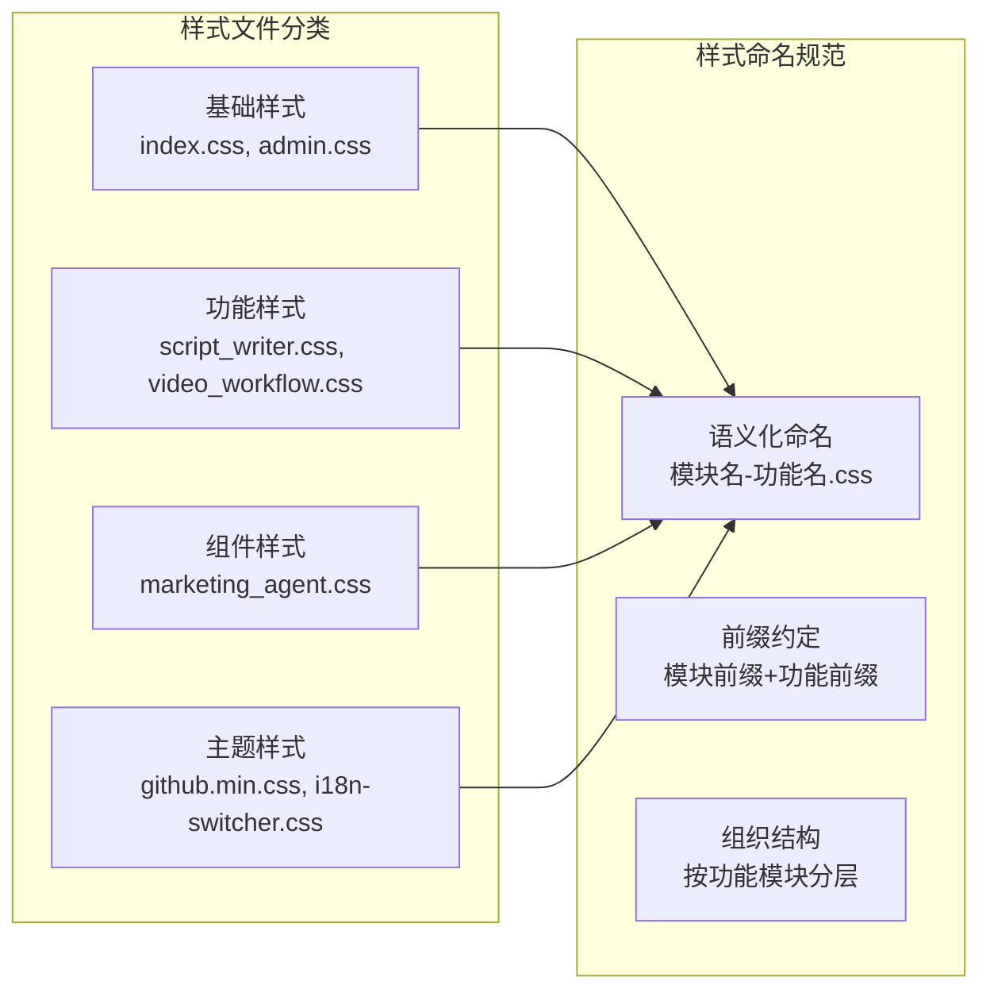

**图表来源**
- [index.css:1-50](file://web/css/index.css#L1-L50)
- [admin.css:1-50](file://web/css/admin.css#L1-L50)
- [script_writer.css:1-50](file://web/css/script_writer.css#L1-L50)
- [video_workflow.css:1-50](file://web/css/video_workflow.css#L1-L50)

**章节来源**
- [index.css:1-200](file://web/css/index.css#L1-L200)
- [admin.css:1-200](file://web/css/admin.css#L1-L200)
- [script_writer.css:1-200](file://web/css/script_writer.css#L1-L200)
- [video_workflow.css:1-200](file://web/css/video_workflow.css#L1-L200)

### JavaScript模块体系

JavaScript模块采用模块化设计，支持按需加载和功能分离：

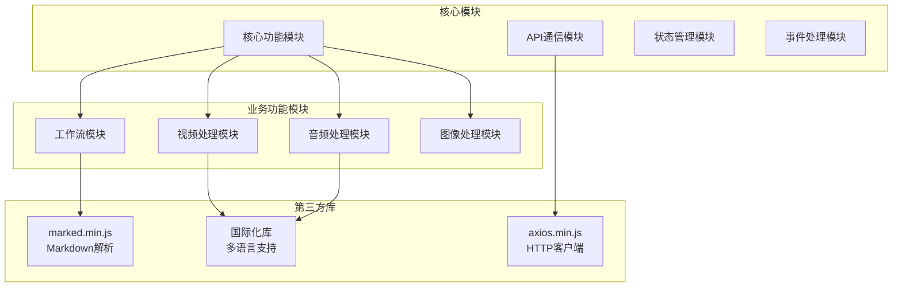

**图表来源**
- [marked.min.js:1-50](file://web/js/marked.min.js#L1-L50)
- [axios.min.js:1-50](file://web/js/axios.min.js#L1-L50)
- [i18n-core.js:1-50](file://web/i18n/i18n-core.js#L1-L50)

**章节来源**
- [marked.min.js:1-100](file://web/js/marked.min.js#L1-L100)
- [text_to_speech_node.js:1-100](file://web/js/text_to_speech_node.js#L1-L100)
- [video_compressor.js:1-100](file://web/js/video_compressor.js#L1-L100)

## 架构概览

前端构建流程采用现代化的模块化架构，支持开发和生产两种环境模式：

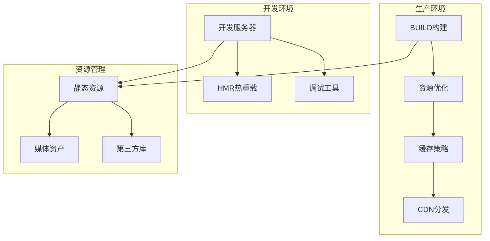

**图表来源**
- [run_dev.py:1-50](file://scripts/running/run_dev.py#L1-L50)
- [run_prod.py:1-50](file://scripts/running/run_prod.py#L1-L50)

## 详细组件分析

### 构建脚本与环境配置

系统提供了完整的构建脚本，支持跨平台部署：

#### 开发环境构建脚本

开发环境脚本专注于快速迭代和调试功能：

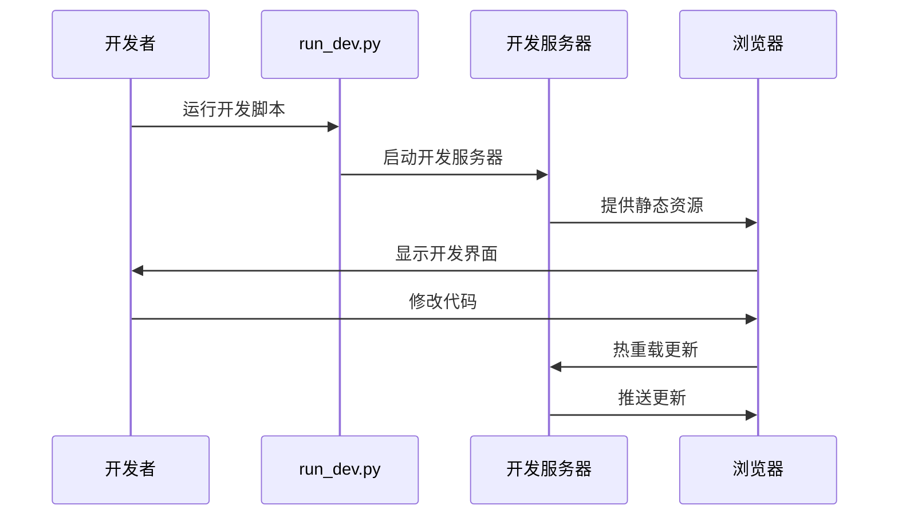

**图表来源**
- [run_dev.py:1-100](file://scripts/running/run_dev.py#L1-L100)

#### 生产环境构建脚本

生产环境脚本专注于性能优化和资源压缩：

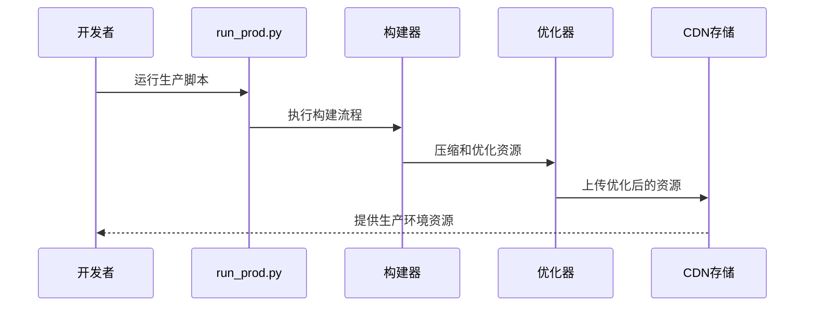

**图表来源**
- [run_prod.py:1-100](file://scripts/running/run_prod.py#L1-L100)
- [linux_start_prod.sh:1-50](file://scripts/running/linux_start_prod.sh#L1-L50)

**章节来源**
- [run_dev.py:1-200](file://scripts/running/run_dev.py#L1-L200)
- [run_prod.py:1-200](file://scripts/running/run_prod.py#L1-L200)
- [linux_start_prod.sh:1-100](file://scripts/running/linux_start_prod.sh#L1-L100)

### 第三方库集成

系统集成了多个重要的第三方库来增强功能：

#### Markdown解析器集成

marked.min.js提供了强大的Markdown解析功能：

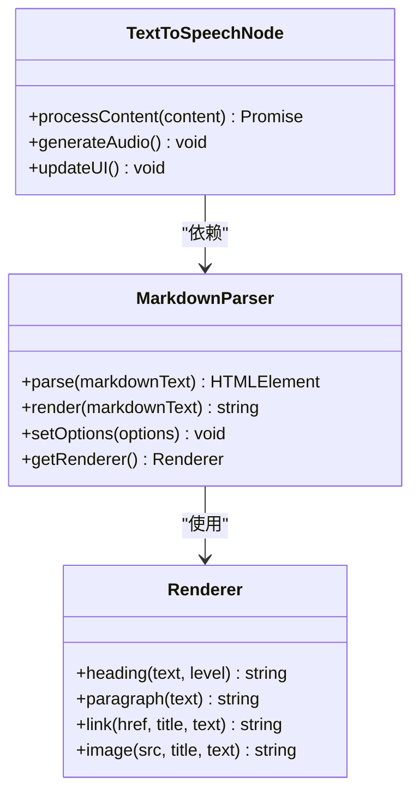

**图表来源**
- [marked.min.js:1-100](file://web/js/marked.min.js#L1-L100)
- [text_to_speech_node.js:1-100](file://web/js/text_to_speech_node.js#L1-L100)

#### HTTP客户端集成

axios.min.js提供了现代化的HTTP通信能力：

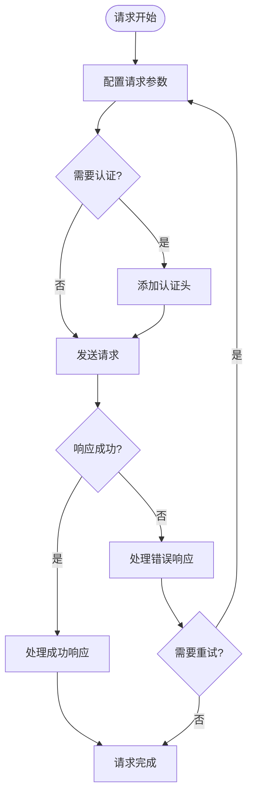

**图表来源**
- [axios.min.js:1-100](file://web/js/axios.min.js#L1-L100)

**章节来源**
- [marked.min.js:1-200](file://web/js/marked.min.js#L1-L200)
- [axios.min.js:1-200](file://web/js/axios.min.js#L1-L200)

### 国际化系统

系统实现了完整的国际化支持，包括Vue插件和DOM操作：

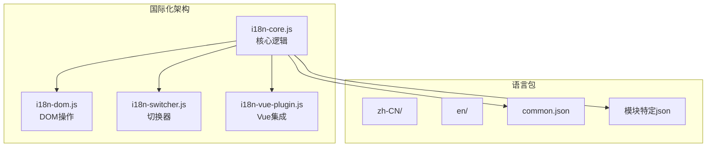

**图表来源**
- [i18n-core.js:1-100](file://web/i18n/i18n-core.js#L1-L100)
- [i18n-dom.js:1-100](file://web/i18n/i18n-dom.js#L1-L100)
- [i18n-switcher.js:1-100](file://web/i18n/i18n-switcher.js#L1-L100)
- [i18n-vue-plugin.js:1-100](file://web/i18n/i18n-vue-plugin.js#L1-L100)

**章节来源**
- [i18n-core.js:1-300](file://web/i18n/i18n-core.js#L1-L300)
- [i18n-dom.js:1-200](file://web/i18n/i18n-dom.js#L1-L200)
- [i18n-switcher.js:1-200](file://web/i18n/i18n-switcher.js#L1-L200)
- [i18n-vue-plugin.js:1-200](file://web/i18n/i18n-vue-plugin.js#L1-L200)

### 资源压缩与优化

系统实现了多层次的资源优化策略：

#### CSS压缩策略

CSS文件采用多种优化技术：

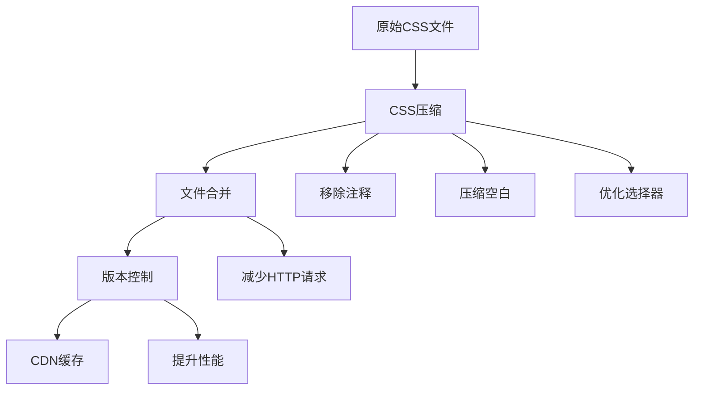

#### JavaScript混淆策略

JavaScript文件采用安全的混淆技术：

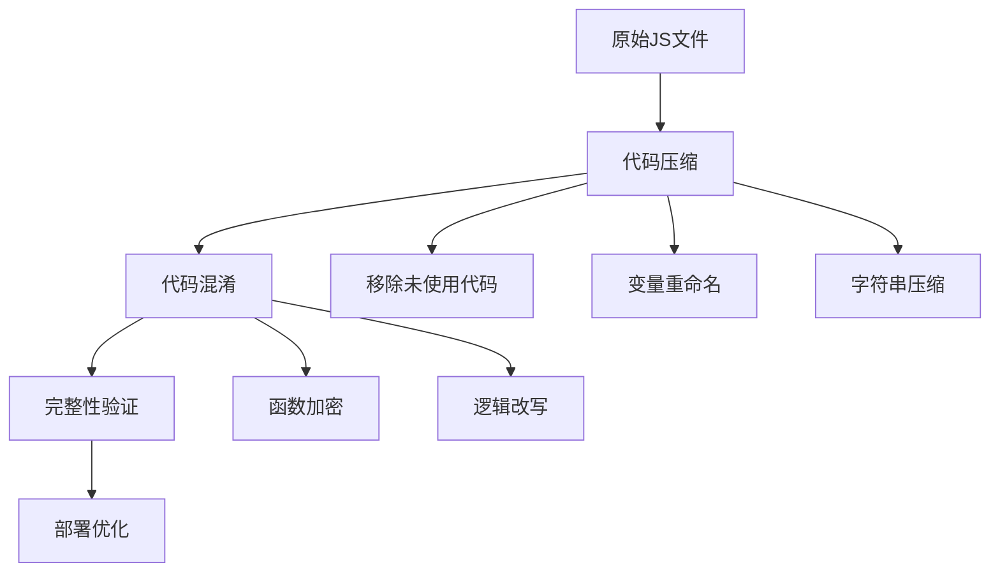

**图表来源**
- [obfuscate.sh:1-100](file://scripts/tools/obfuscate.sh#L1-L100)

**章节来源**
- [obfuscate.sh:1-200](file://scripts/tools/obfuscate.sh#L1-L200)

### 缓存策略与CDN集成

系统实现了智能的缓存策略和CDN集成：

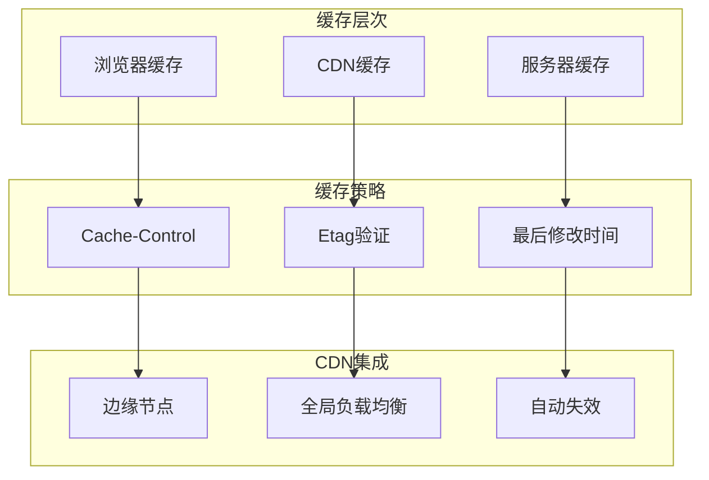

**图表来源**
- [cdn_util.py:1-100](file://utils/cdn_util.py#L1-L100)
- [media_cache.py:1-100](file://utils/media_cache.py#L1-L100)

**章节来源**
- [cdn_util.py:1-300](file://utils/cdn_util.py#L1-L300)
- [media_cache.py:1-300](file://utils/media_cache.py#L1-L300)

## 依赖分析

### 前端依赖关系

系统前端依赖关系清晰明确，采用模块化设计：

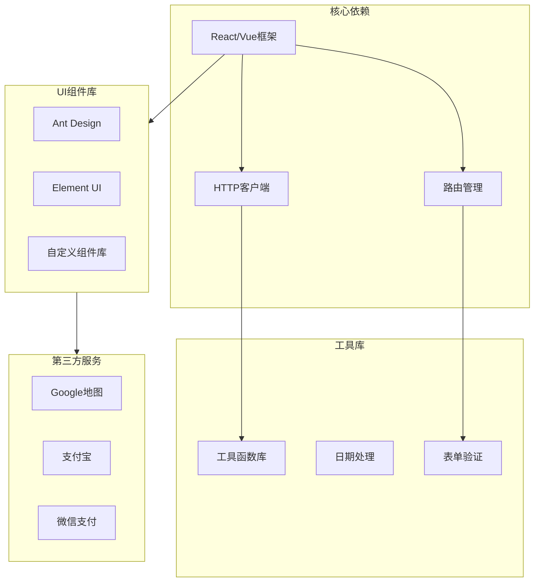

**图表来源**
- [requirements.txt:1-100](file://requirements.txt#L1-L100)
- [pyproject.toml:1-100](file://pyproject.toml#L1-L100)

### 版本控制机制

系统采用多层版本控制确保资源的一致性和可追踪性：

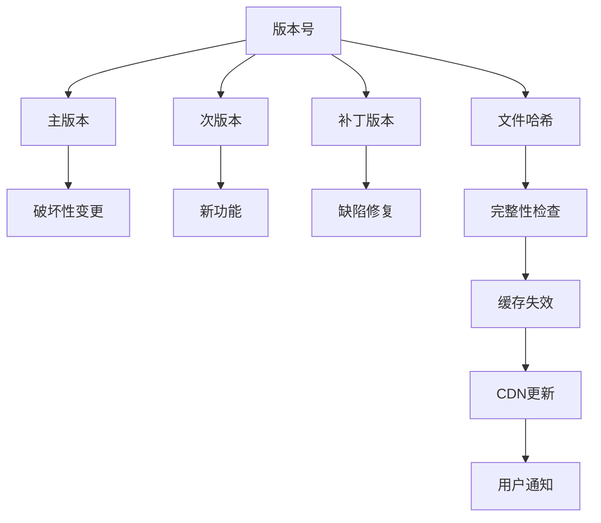

**图表来源**
- [config_prod.base.yaml:1-100](file://config_prod.base.yaml#L1-L100)

**章节来源**
- [requirements.txt:1-200](file://requirements.txt#L1-L200)
- [pyproject.toml:1-200](file://pyproject.toml#L1-L200)
- [config_prod.base.yaml:1-200](file://config_prod.base.yaml#L1-L200)

## 性能考虑

### 资源加载优化

系统采用多种策略优化资源加载性能：

#### 懒加载实现

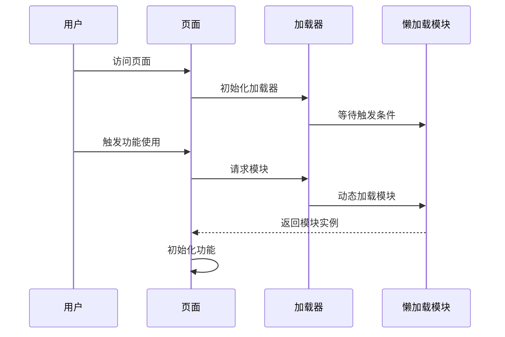

#### 离线缓存策略

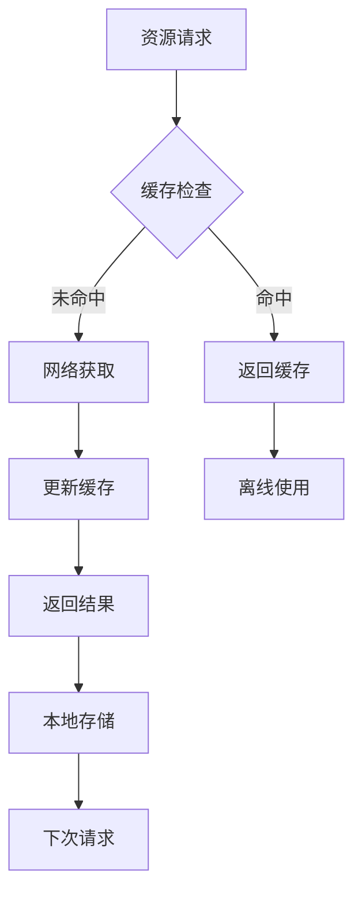

### 性能监控

系统内置性能监控机制，实时跟踪资源加载和使用情况：

| 监控指标 | 目标值 | 阈值 | 处理策略 |
|---------|--------|------|----------|
| 首屏加载时间 | < 3秒 | < 5秒 | 优化资源大小 |
| 资源压缩率 | > 70% | > 60% | 继续优化压缩 |
| CDN命中率 | > 95% | > 90% | 调整缓存策略 |
| 错误率 | < 0.1% | < 0.5% | 分析错误原因 |

## 故障排除指南

### 常见问题诊断

#### 构建失败问题

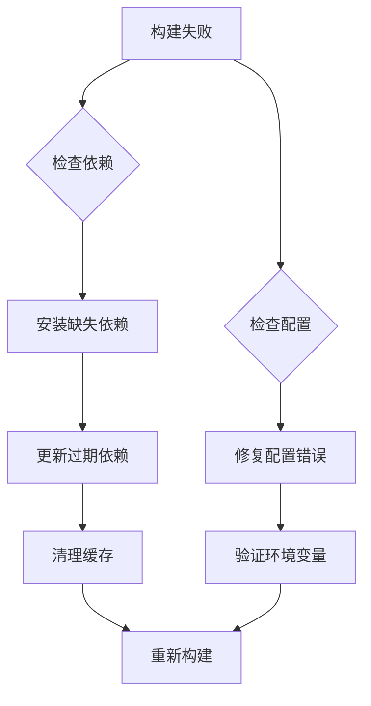

#### 资源加载问题

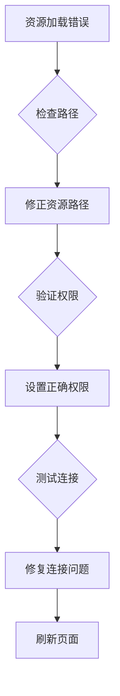

### 调试工具使用

系统提供了完善的调试工具支持：

| 工具类型 | 功能描述 | 使用场景 |
|---------|----------|----------|
| 开发者工具 | 浏览器开发者工具 | 代码调试和性能分析 |
| 日志系统 | 前端日志记录 | 错误追踪和问题诊断 |
| 性能分析器 | 性能数据收集 | 性能瓶颈识别 |
| 网络监控 | 网络请求监控 | 资源加载问题排查 |

**章节来源**
- [run_dev.py:1-300](file://scripts/running/run_dev.py#L1-L300)
- [run_prod.py:1-300](file://scripts/running/run_prod.py#L1-L300)

## 结论

本项目的前端构建流程与资源管理系统展现了现代Web应用的最佳实践。通过模块化的资源组织、智能化的缓存策略和完善的性能优化机制，系统能够在保证功能完整性的同时，提供优秀的用户体验。

关键优势包括：
- 清晰的模块化架构便于维护和扩展
- 多层次的性能优化确保快速加载
- 完善的缓存和CDN集成提升全球访问性能
- 全面的国际化支持满足多语言需求
- 安全的构建流程保障生产环境质量

未来可以进一步优化的方向包括AI驱动的资源优化、更智能的缓存预加载策略以及增强的性能监控能力。

## 附录

### 开发环境配置

开发环境要求：
- Python 3.8+
- Node.js 16+
- Git版本控制

开发工具链：
- VS Code或WebStorm
- Chrome开发者工具
- Postman API测试工具

### 生产环境部署

生产环境配置要点：
- Nginx反向代理配置
- SSL证书配置
- CDN加速设置
- 监控告警配置

### 资源命名规范

| 资源类型 | 命名规则 | 示例 |
|---------|----------|------|
| CSS文件 | 模块名.css | index.css, admin.css |
| JavaScript文件 | 模块名.js | api.js, state.js |
| 图片资源 | 类型-用途.jpg | icon-home.png, bg-pattern.svg |
| 字体文件 | 字体名.ttf | font-awesome.ttf, icon-font.woff |