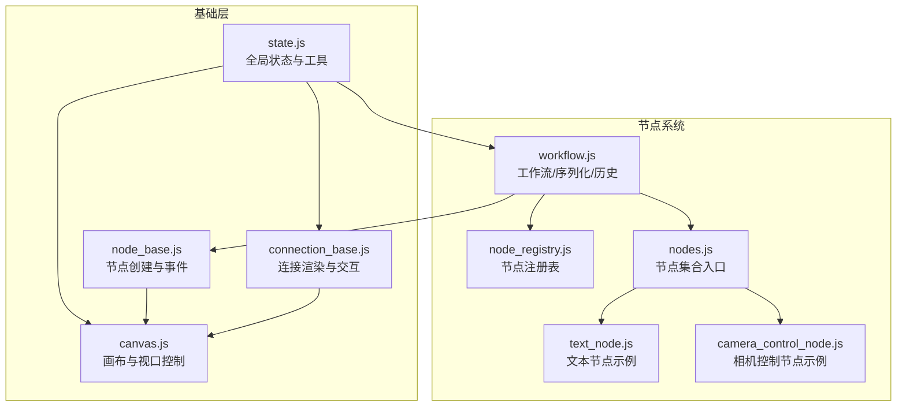
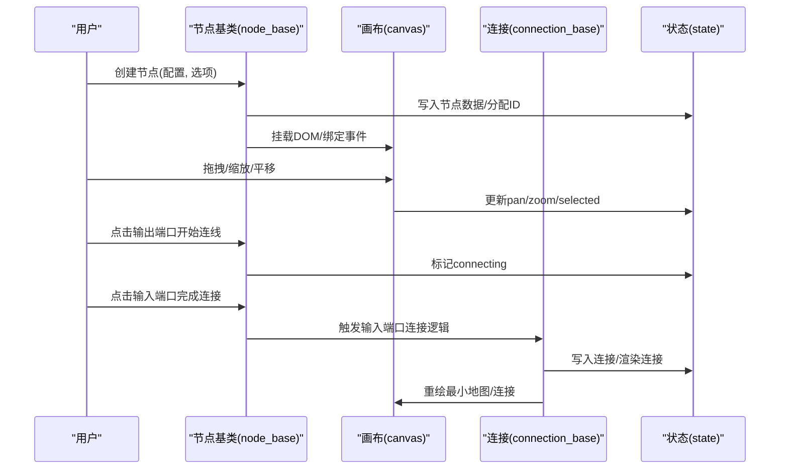
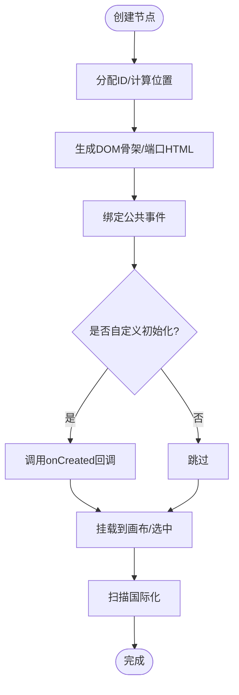
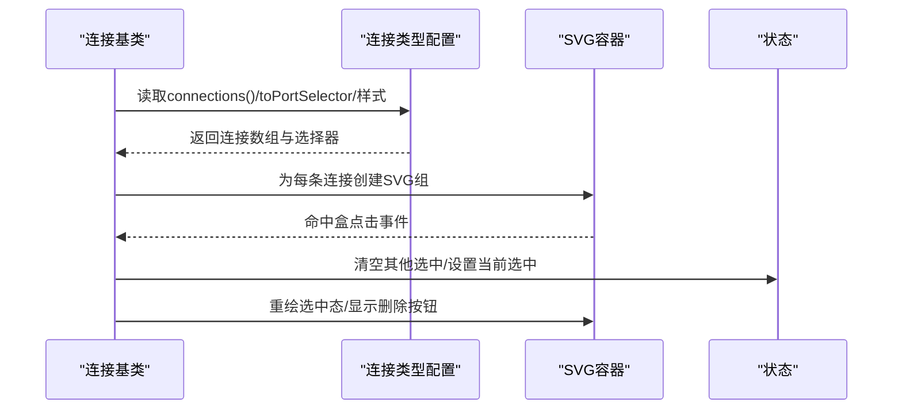
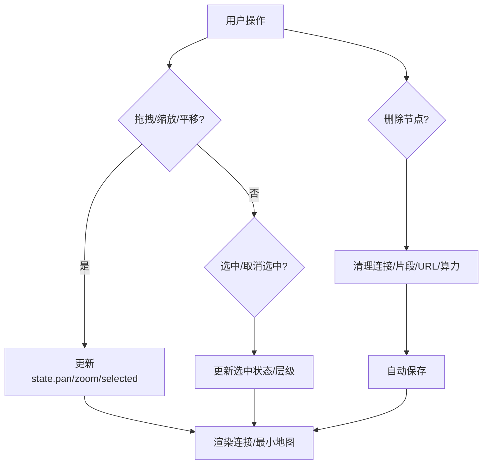
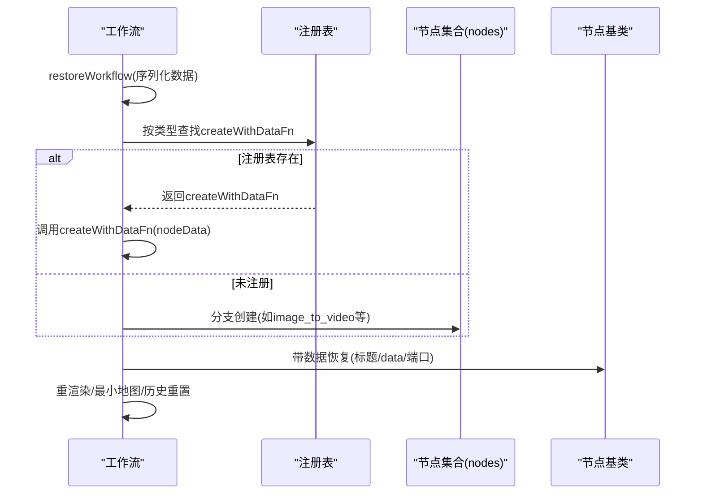
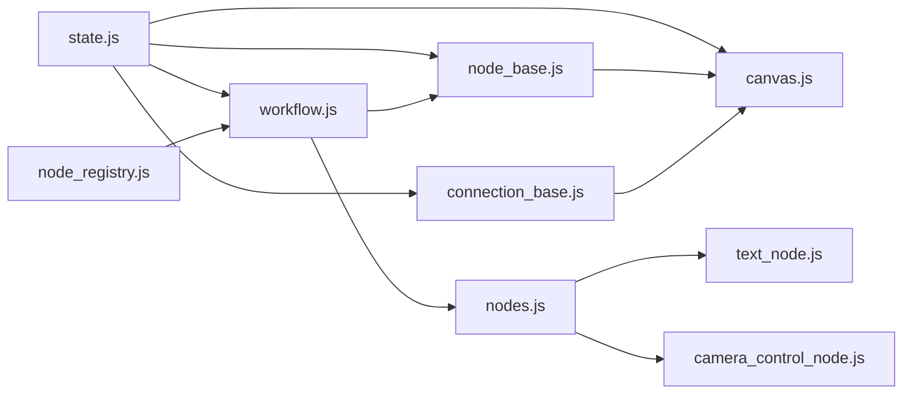

# 组件设计模式

<cite>
**本文档引用的文件**
- [node_base.js](file://web/js/node_base.js)
- [connection_base.js](file://web/js/connection_base.js)
- [canvas.js](file://web/js/canvas.js)
- [node_registry.js](file://web/js/node_registry.js)
- [state.js](file://web/js/state.js)
- [workflow.js](file://web/js/workflow.js)
- [nodes.js](file://web/js/nodes.js)
- [text_node.js](file://web/js/text_node.js)
- [camera_control_node.js](file://web/js/camera_control_node.js)
</cite>

## 目录
1. [引言](#引言)
2. [项目结构](#项目结构)
3. [核心组件](#核心组件)
4. [架构总览](#架构总览)
5. [详细组件分析](#详细组件分析)
6. [依赖关系分析](#依赖关系分析)
7. [性能考量](#性能考量)
8. [故障排查指南](#故障排查指南)
9. [结论](#结论)
10. [附录](#附录)

## 引言
本文件系统性梳理前端组件设计模式，围绕“基于原型的组件继承体系”“工作流节点系统”“Canvas 画布系统”“状态管理模式与事件驱动架构”“组件间通信与生命周期管理”展开，并提供组件复用、插件化扩展与自定义组件开发指南。重点覆盖以下文件：node_base.js（节点基类）、connection_base.js（连接基类）、canvas.js（画布系统）、node_registry.js（节点注册机制）、state.js（全局状态）、workflow.js（工作流与序列化）、nodes.js（节点集合）、text_node.js（示例节点）、camera_control_node.js（示例节点）。

## 项目结构
前端位于 web/js 目录，采用“模块化+注册表”的组织方式：
- 基础能力模块：node_base.js、connection_base.js、state.js、canvas.js
- 节点注册与恢复：node_registry.js、workflow.js
- 节点实现：nodes.js（节点集合入口）、text_node.js、camera_control_node.js 等
- 工作流与持久化：workflow.js（序列化/反序列化、自动保存、历史快照）

图表来源
- [state.js:1-265](file://web/js/state.js#L1-L265)
- [connection_base.js:1-400](file://web/js/connection_base.js#L1-L400)
- [node_base.js:1-366](file://web/js/node_base.js#L1-L366)
- [canvas.js:1-498](file://web/js/canvas.js#L1-L498)
- [node_registry.js:1-36](file://web/js/node_registry.js#L1-L36)
- [workflow.js:1-2712](file://web/js/workflow.js#L1-L2712)
- [nodes.js](file://web/js/nodes.js)
- [text_node.js](file://web/js/text_node.js)
- [camera_control_node.js](file://web/js/camera_control_node.js)

章节来源
- [state.js:1-265](file://web/js/state.js#L1-L265)
- [connection_base.js:1-400](file://web/js/connection_base.js#L1-L400)
- [node_base.js:1-366](file://web/js/node_base.js#L1-L366)
- [canvas.js:1-498](file://web/js/canvas.js#L1-L498)
- [node_registry.js:1-36](file://web/js/node_registry.js#L1-L36)
- [workflow.js:1-2712](file://web/js/workflow.js#L1-L2712)

## 核心组件
- 节点基类与通用逻辑：封装节点创建、端口生成、公共事件绑定、带数据恢复工厂、通用连接校验与渲染辅助。
- 连接基类与统一渲染：封装贝塞尔曲线计算、SVG 组合元素、命中盒、统一渲染配置与删除流程。
- 画布系统：缩放/平移、视口变换、最小地图、节点选中/拖拽、连接渲染联动、节点删除清理。
- 节点注册与恢复：注册表按类型分发创建/恢复，工作流统一序列化/反序列化。
- 全局状态：集中管理节点、连接、视口、时间轴、历史、调试等状态与工具函数。

章节来源
- [node_base.js:33-366](file://web/js/node_base.js#L33-L366)
- [connection_base.js:114-400](file://web/js/connection_base.js#L114-L400)
- [canvas.js:66-498](file://web/js/canvas.js#L66-L498)
- [node_registry.js:11-36](file://web/js/node_registry.js#L11-L36)
- [state.js:5-66](file://web/js/state.js#L5-L66)

## 架构总览
整体采用“状态驱动 + 事件驱动 + 统一渲染”的架构：
- 状态驱动：state.js 统一存储节点、连接、视口、历史等；各模块通过 state 读写状态。
- 事件驱动：节点/连接/画布事件触发状态变更，状态变更驱动渲染与副作用。
- 统一渲染：连接统一渲染函数与画布变换联动，保证渲染一致性与性能。

图表来源
- [node_base.js:135-190](file://web/js/node_base.js#L135-L190)
- [connection_base.js:198-273](file://web/js/connection_base.js#L198-L273)
- [canvas.js:66-114](file://web/js/canvas.js#L66-L114)
- [state.js:5-66](file://web/js/state.js#L5-L66)

## 详细组件分析

### 节点基类与继承体系（node_base.js）
- 节点工厂 createNodeBase：负责 ID 分配、位置与碰撞检测、DOM 骨架生成、端口 HTML 生成、事件绑定、挂载与国际化扫描。
- 事件绑定 bindNodeBaseEvents：统一处理删除、节点选中、头部长按拖拽、输出端口连线起点。
- 输入端口通用连接 bindInputPortEvents：类型校验、去重、连接数组选择、ID 分配、渲染与自动保存。
- 带数据恢复 createNodeWithDataFactory：恢复节点 ID、标题、data，并可自定义 DOM 恢复。
- 通用工具：按钮加载状态切换、视频缩略图设置、状态文本设置、安全自动保存。

图表来源
- [node_base.js:50-127](file://web/js/node_base.js#L50-L127)

章节来源
- [node_base.js:33-366](file://web/js/node_base.js#L33-L366)

### 连接基类与统一渲染（connection_base.js）
- 端口坐标与距离：getPortWorldPos/getPortDistance 计算世界坐标与距离。
- 贝塞尔曲线：calcBezierPath 计算路径，createConnectionSvgGroup 创建命中盒与可见路径。
- 统一渲染 renderConnectionType：按连接类型配置批量渲染，支持选中态、虚线样式、CSS 类。
- 连接类型配置：CONNECTION_TYPES 统一封装图像/首帧/视频/参考/音频连接的渲染规则。
- 删除流程 deleteSelectedConnection：按优先级删除不同连接类型，并执行节点特定副作用（如清除图生视频 URL、更新算力）。

图表来源
- [connection_base.js:130-214](file://web/js/connection_base.js#L130-L214)
- [connection_base.js:219-276](file://web/js/connection_base.js#L219-L276)
- [connection_base.js:295-399](file://web/js/connection_base.js#L295-L399)

章节来源
- [connection_base.js:1-400](file://web/js/connection_base.js#L1-L400)

### 画布系统（canvas.js）
- 视口与变换：applyTransform 实现 pan/zoom 变换；setZoom 限制缩放范围；updateZoomLevel 显示缩放百分比。
- 选中与层级：setSelected/setMultipleSelected/addToSelection/removeSelection；bringNodeToFront 管理 zIndex。
- 节点聚焦：focusOnNode 计算居中与阴影提示。
- 节点拖拽：initNodeDrag 支持单节点与多选拖拽；拖拽过程联动连接重绘与最小地图更新。
- 节点放置与历史：startNodePlacing/finalizeNodePlacing；captureHistorySnapshot。
- 节点删除：removeNode 清理时间轴片段、各类连接、URL 与算力更新，并自动保存。
- 图生视频算力更新：updateImageToVideoComputingPower 支持保存函数与回退计算。

图表来源
- [canvas.js:66-194](file://web/js/canvas.js#L66-L194)
- [canvas.js:196-496](file://web/js/canvas.js#L196-L496)

章节来源
- [canvas.js:1-498](file://web/js/canvas.js#L1-L498)

### 节点注册机制与动态节点创建（node_registry.js, workflow.js）
- 注册表 nodeRegistry：以类型为键，存储 createFn/createWithDataFn。
- 恢复入口 restoreNodeByRegistry：按类型分发到对应 createWithDataFn。
- 工作流恢复 restoreWorkflow：清空/重置状态，恢复视口、比例、默认世界、ID 计数器，逐个节点调用 restoreNode。
- 节点兼容迁移：image_edit → image 的兼容处理。
- 动态节点创建：nodes.js 汇聚各节点类型，workflow.js 通过注册表或分支逻辑创建节点。

图表来源
- [node_registry.js:28-35](file://web/js/node_registry.js#L28-L35)
- [workflow.js:939-1174](file://web/js/workflow.js#L939-L1174)
- [nodes.js](file://web/js/nodes.js)

章节来源
- [node_registry.js:1-36](file://web/js/node_registry.js#L1-L36)
- [workflow.js:939-1174](file://web/js/workflow.js#L939-L1174)

### 状态管理模式与事件驱动
- 全局状态 state：集中存储 nodes/connections、视口、时间轴、历史、选择态、调试开关等。
- 工具函数：normalizeVideoUrl/normalizeImageUrl/proxyImageUrl/proxyDownloadUrl、showToast/showConfirmModal。
- 事件驱动：节点/连接/画布事件 → 状态变更 → 渲染更新；自动保存与历史快照贯穿操作链路。

章节来源
- [state.js:5-265](file://web/js/state.js#L5-L265)
- [workflow.js:408-580](file://web/js/workflow.js#L408-L580)

### 组件间通信、数据绑定与生命周期
- 通信机制：通过 state 作为单一事实源；节点通过 DOM 事件与 state 交互；连接通过统一渲染函数与 state 交互。
- 数据绑定：节点 data 与 DOM 字段双向绑定（示例：提示词、模型、时长、比例等）；工作流序列化时过滤临时数据（如 Blob URL）。
- 生命周期：创建（createNodeBase/createXxxNodeWithData）→ 初始化（onCreated）→ 交互（事件绑定）→ 连接（bindInputPortEvents）→ 删除（removeNode）→ 恢复（restoreWorkflow/restoreNodeByRegistry）。

章节来源
- [node_base.js:50-127](file://web/js/node_base.js#L50-L127)
- [connection_base.js:198-273](file://web/js/connection_base.js#L198-L273)
- [workflow.js:326-500](file://web/js/workflow.js#L326-L500)

### 组件复用策略、插件化扩展与自定义组件开发指南
- 复用策略
  - 基于 node_base 的 createNodeBase 工厂：统一创建流程、端口生成、事件绑定、带数据恢复。
  - 基于 connection_base 的 bindInputPortEvents：统一输入端口连接校验、去重与渲染。
  - 基于 state 的工具函数：URL 规范化、代理下载、Toast 提示、确认弹窗。
- 插件化扩展
  - 通过 node_registry.registerNodeType(type, { createFn, createWithDataFn }) 注册新节点类型，配合 workflow.js 的恢复逻辑实现无缝扩展。
  - 通过 nodes.js 汇聚节点类型，便于集中管理与按需加载。
- 自定义组件开发步骤
  1) 设计节点配置：type、title/bodyHtml/defaultData/ports/cssClass/onCreated 等。
  2) 实现 createXxxNode(opts) 与 createXxxNodeWithData(nodeData)。
  3) 在 onCreated 中绑定节点内部事件、初始化 DOM 子元素。
  4) 在 node_registry 中注册类型，确保恢复可用。
  5) 如涉及连接，使用 bindInputPortEvents 或在节点内自定义连接逻辑。
  6) 在 workflow.js 的序列化/反序列化中处理特殊字段（如 Blob URL 清理）。

章节来源
- [node_base.js:33-127](file://web/js/node_base.js#L33-L127)
- [connection_base.js:198-273](file://web/js/connection_base.js#L198-L273)
- [node_registry.js:20-35](file://web/js/node_registry.js#L20-L35)
- [workflow.js:326-500](file://web/js/workflow.js#L326-L500)

## 依赖关系分析
- 模块耦合
  - node_base 依赖 state（节点数据、选中、连接状态）与 canvas（挂载与国际化扫描）。
  - connection_base 依赖 state（连接数组、选中态）与 canvas（最小地图渲染）。
  - canvas 依赖 state（pan/zoom/selected/history）与 connection_base（统一渲染）。
  - node_registry 与 workflow 协同，前者提供恢复入口，后者提供序列化/历史。
- 外部依赖
  - URL 规范化与代理：proxyImageUrl/proxyDownloadUrl。
  - 时间轴与算力配置：TaskConfig（异步加载与模型选项）。

图表来源
- [state.js:5-66](file://web/js/state.js#L5-L66)
- [node_base.js:50-127](file://web/js/node_base.js#L50-L127)
- [connection_base.js:130-214](file://web/js/connection_base.js#L130-L214)
- [canvas.js:66-114](file://web/js/canvas.js#L66-L114)
- [node_registry.js:28-35](file://web/js/node_registry.js#L28-L35)
- [workflow.js:939-1174](file://web/js/workflow.js#L939-L1174)

章节来源
- [state.js:5-265](file://web/js/state.js#L5-L265)
- [node_base.js:1-366](file://web/js/node_base.js#L1-L366)
- [connection_base.js:1-400](file://web/js/connection_base.js#L1-L400)
- [canvas.js:1-498](file://web/js/canvas.js#L1-L498)
- [node_registry.js:1-36](file://web/js/node_registry.js#L1-L36)
- [workflow.js:1-2712](file://web/js/workflow.js#L1-L2712)

## 性能考量
- 渲染优化
  - 统一连接渲染：renderConnectionType 批量创建 SVG 组，命中盒与可见路径分离，减少重绘成本。
  - 画布变换：一次性 applyTransform，避免逐元素重排。
  - 最小地图：按节点边界计算缩放与视口框，减少 DOM 数量。
- 事件与状态
  - 事件委托与节流：输入端口连接采用一次性状态标记（state.connecting），减少频繁查询。
  - 自动保存与历史：captureHistorySnapshot 避免重复快照，startAutoSave 定时保存降低丢失风险。
- 数据清理
  - 序列化时过滤 Blob URL 与 File 对象，避免内存泄漏与传输冗余。

## 故障排查指南
- 连接不生效
  - 检查输入端口 acceptType 与输出节点类型是否匹配。
  - 确认连接数组中无重复连接（同一目标端口仅允许一条）。
  - 确认 renderAllConnections/renderMinimap 已调用。
- 删除连接后节点状态异常
  - 检查 deleteSelectedConnection 的类型分支与节点特定副作用（如图生视频 URL 清理、算力更新）。
- 节点删除后残留连接
  - 确认 removeNode 清理了相关连接数组与时间轴片段。
- 缩放/平移异常
  - 检查 setZoom 的缩放范围限制与 pan/zoom 的转换计算。
- 工作流恢复失败
  - 检查 restoreWorkflow 的序列化数据结构与兼容迁移逻辑（如 image_edit → image）。

章节来源
- [connection_base.js:198-273](file://web/js/connection_base.js#L198-L273)
- [connection_base.js:295-399](file://web/js/connection_base.js#L295-L399)
- [canvas.js:378-496](file://web/js/canvas.js#L378-L496)
- [workflow.js:939-1174](file://web/js/workflow.js#L939-L1174)

## 结论
该前端组件体系以“状态驱动 + 事件驱动 + 统一渲染”为核心，通过 node_base 与 connection_base 提供可复用的节点与连接基础设施，借助 node_registry 与 workflow.js 实现节点注册与工作流恢复，结合 canvas.js 的画布系统完成高性能的交互体验。整体设计具备良好的扩展性与维护性，适合在复杂工作流场景中持续演进。

## 附录
- 示例节点
  - 文本节点：text_node.js
  - 相机控制节点：camera_control_node.js
- 节点集合入口：nodes.js 汇聚各节点类型，便于集中管理与按需加载。