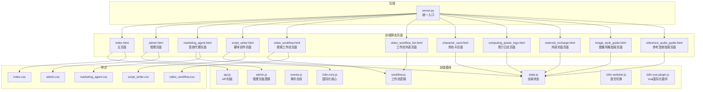
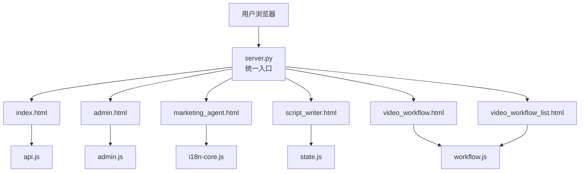
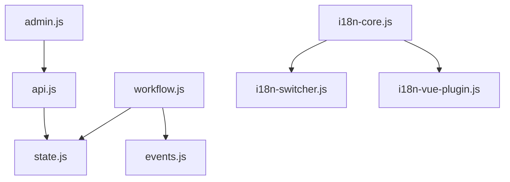

# 页面架构与导航

<cite>
**本文引用的文件**
- [server.py](file://server.py)
- [index.html](file://web/index.html)
- [admin.html](file://web/admin.html)
- [marketing_agent.html](file://web/marketing_agent.html)
- [script_writer.html](file://web/script_writer.html)
- [video_workflow.html](file://web/video_workflow.html)
- [video_workflow_list.html](file://web/video_workflow_list.html)
- [character_card.html](file://web/character_card.html)
- [computing_power_logs.html](file://web/computing_power_logs.html)
- [external_recharge.html](file://web/external_recharge.html)
- [image_style_guide.html](file://web/image_style_guide.html)
- [reference_audio_guide.html](file://web/reference_audio_guide.html)
- [admin.js](file://web/js/admin.js)
- [api.js](file://web/js/api.js)
- [state.js](file://web/js/state.js)
- [events.js](file://web/js/events.js)
- [workflow.js](file://web/js/workflow.js)
- [i18n-core.js](file://web/i18n/i18n-core.js)
- [i18n-switcher.js](file://web/i18n/i18n-switcher.js)
- [i18n-vue-plugin.js](file://web/i18n/i18n-vue-plugin.js)
- [auth_service.py](file://perseids_server/services/auth_service.py)
- [permission.py](file://perseids_server/utils/permission.py)
- [token.py](file://perseids_server/utils/token.py)
- [auth_helper.py](file://script_writer_core/auth_helper.py)
- [checkin_service.py](file://services/checkin_service.py)
- [notification_service.py](file://services/notification_service.py)
- [index.css](file://web/css/index.css)
- [admin.css](file://web/css/admin.css)
- [marketing_agent.css](file://web/css/marketing_agent.css)
- [script_writer.css](file://web/css/script_writer.css)
- [video_workflow.css](file://web/css/video_workflow.css)
</cite>

## 目录
1. [简介](#简介)
2. [项目结构](#项目结构)
3. [核心组件](#核心组件)
4. [架构总览](#架构总览)
5. [详细组件分析](#详细组件分析)
6. [依赖分析](#依赖分析)
7. [性能考虑](#性能考虑)
8. [故障排除指南](#故障排除指南)
9. [结论](#结论)
10. [附录](#附录)

## 简介
本文件系统性梳理该代码库的页面架构与导航体系，聚焦单页应用（SPA）的路由设计、页面组织结构与导航机制，覆盖主页面、管理页面、创作页面与工具页面的架构差异；详解页面间导航、面包屑、状态管理与生命周期；阐述懒加载策略与性能优化；明确权限控制、路由守卫与访问控制；给出布局设计原则、响应式适配与移动端导航优化建议；最后总结页面间数据传递、状态共享与事件通信机制。

## 项目结构
该项目采用“后端服务 + 多页面前端”的混合架构：后端通过统一入口提供静态资源与API；前端以多HTML页面为主，辅以模块化的JS与CSS，形成轻量SPA体验。页面按功能域划分，分别对应不同的业务场景与用户角色。

图表来源
- [server.py](file://server.py)
- [index.html](file://web/index.html)
- [admin.html](file://web/admin.html)
- [marketing_agent.html](file://web/marketing_agent.html)
- [script_writer.html](file://web/script_writer.html)
- [video_workflow.html](file://web/video_workflow.html)
- [video_workflow_list.html](file://web/video_workflow_list.html)
- [character_card.html](file://web/character_card.html)
- [computing_power_logs.html](file://web/computing_power_logs.html)
- [external_recharge.html](file://web/external_recharge.html)
- [image_style_guide.html](file://web/image_style_guide.html)
- [reference_audio_guide.html](file://web/reference_audio_guide.html)
- [api.js](file://web/js/api.js)
- [state.js](file://web/js/state.js)
- [events.js](file://web/js/events.js)
- [workflow.js](file://web/js/workflow.js)
- [admin.js](file://web/js/admin.js)
- [i18n-core.js](file://web/i18n/i18n-core.js)
- [i18n-switcher.js](file://web/i18n/i18n-switcher.js)
- [i18n-vue-plugin.js](file://web/i18n/i18n-vue-plugin.js)
- [index.css](file://web/css/index.css)
- [admin.css](file://web/css/admin.css)
- [marketing_agent.css](file://web/css/marketing_agent.css)
- [script_writer.css](file://web/css/script_writer.css)
- [video_workflow.css](file://web/css/video_workflow.css)

章节来源
- [server.py](file://server.py)
- [index.html](file://web/index.html)
- [admin.html](file://web/admin.html)
- [marketing_agent.html](file://web/marketing_agent.html)
- [script_writer.html](file://web/script_writer.html)
- [video_workflow.html](file://web/video_workflow.html)
- [video_workflow_list.html](file://web/video_workflow_list.html)
- [character_card.html](file://web/character_card.html)
- [computing_power_logs.html](file://web/computing_power_logs.html)
- [external_recharge.html](file://web/external_recharge.html)
- [image_style_guide.html](file://web/image_style_guide.html)
- [reference_audio_guide.html](file://web/reference_audio_guide.html)

## 核心组件
- 后端统一入口：负责静态资源分发与API路由，为各页面提供统一的HTTP服务。
- 页面层：以HTML页面为单位，承载不同业务域的功能与UI。
- 模块化前端：通过独立JS模块实现API封装、状态管理、事件通信与业务逻辑。
- 国际化框架：提供语言切换与多语言资源管理。
- 样式体系：按页面域划分CSS，确保主题一致性与可维护性。

章节来源
- [server.py](file://server.py)
- [api.js](file://web/js/api.js)
- [state.js](file://web/js/state.js)
- [events.js](file://web/js/events.js)
- [i18n-core.js](file://web/i18n/i18n-core.js)
- [i18n-switcher.js](file://web/i18n/i18n-switcher.js)
- [i18n-vue-plugin.js](file://web/i18n/i18n-vue-plugin.js)

## 架构总览
该系统采用“后端统一入口 + 多页面前端”的混合SPA模式。后端通过统一入口提供静态页面与API；前端页面按功能域拆分，每个页面引入必要的JS/CSS模块，实现轻量SPA体验。页面间导航通过URL路径与页面内事件驱动，配合全局状态与事件总线实现跨页面的状态同步与通信。

图表来源
- [server.py](file://server.py)
- [index.html](file://web/index.html)
- [admin.html](file://web/admin.html)
- [marketing_agent.html](file://web/marketing_agent.html)
- [script_writer.html](file://web/script_writer.html)
- [video_workflow.html](file://web/video_workflow.html)
- [video_workflow_list.html](file://web/video_workflow_list.html)
- [api.js](file://web/js/api.js)
- [admin.js](file://web/js/admin.js)
- [i18n-core.js](file://web/i18n/i18n-core.js)
- [state.js](file://web/js/state.js)
- [workflow.js](file://web/js/workflow.js)

## 详细组件分析

### 主页面（index.html）
- 角色定位：门户入口，聚合导航与快捷操作。
- 路由与导航：通过URL路径进入，页面内通过事件驱动进行内部导航。
- 状态管理：依赖全局状态模块进行用户信息与会话状态同步。
- 性能优化：按需加载第三方库，避免阻塞首屏渲染。
- 权限控制：根据用户角色动态展示菜单项与功能按钮。

章节来源
- [index.html](file://web/index.html)
- [state.js](file://web/js/state.js)
- [api.js](file://web/js/api.js)
- [index.css](file://web/css/index.css)

### 管理页面（admin.html）
- 角色定位：后台管理，提供系统配置、用户管理、日志查看等功能。
- 导航机制：页面内菜单栏与面包屑结合，支持层级跳转与返回。
- 权限控制：严格的角色权限校验，未授权访问重定向或隐藏功能。
- 数据展示：表格化数据与分页，支持筛选与排序。
- 交互优化：表单提交采用防重复点击与加载提示。

章节来源
- [admin.html](file://web/admin.html)
- [admin.js](file://web/js/admin.js)
- [admin.css](file://web/css/admin.css)
- [auth_service.py](file://perseids_server/services/auth_service.py)
- [permission.py](file://perseids_server/utils/permission.py)

### 创作页面（script_writer.html）
- 角色定位：内容创作与脚本编辑，强调工作流与协作。
- 工作流引擎：集成工作流模块，支持节点拖拽与连线。
- 状态管理：集中式状态存储，跨组件共享编辑状态与历史记录。
- 事件通信：通过事件总线实现节点状态变更与全局通知。
- 国际化：支持多语言切换，文案与界面随语言变化。

章节来源
- [script_writer.html](file://web/script_writer.html)
- [script_writer.css](file://web/css/script_writer.css)
- [state.js](file://web/js/state.js)
- [events.js](file://web/js/events.js)
- [workflow.js](file://web/js/workflow.js)
- [i18n-core.js](file://web/i18n/i18n-core.js)
- [i18n-switcher.js](file://web/i18n/i18n-switcher.js)
- [i18n-vue-plugin.js](file://web/i18n/i18n-vue-plugin.js)

### 工具页面（video_workflow.html, video_workflow_list.html, character_card.html, computing_power_logs.html, external_recharge.html, image_style_guide.html, reference_audio_guide.html）
- 角色定位：提供专业工具与辅助功能，如视频工作流、角色卡、算力日志、充值与风格指南等。
- 导航与面包屑：页面内提供清晰的面包屑与返回路径，便于用户定位。
- 状态与事件：通过全局状态与事件总线实现跨页面状态同步与通知。
- 性能优化：按需加载工具模块，减少首屏负担；对大数据集进行虚拟滚动或分页加载。
- 移动端适配：采用弹性布局与媒体查询，确保在小屏设备上的可用性。

章节来源
- [video_workflow.html](file://web/video_workflow.html)
- [video_workflow_list.html](file://web/video_workflow_list.html)
- [character_card.html](file://web/character_card.html)
- [computing_power_logs.html](file://web/computing_power_logs.html)
- [external_recharge.html](file://web/external_recharge.html)
- [image_style_guide.html](file://web/image_style_guide.html)
- [reference_audio_guide.html](file://web/reference_audio_guide.html)
- [video_workflow.css](file://web/css/video_workflow.css)
- [state.js](file://web/js/state.js)
- [events.js](file://web/js/events.js)

### 营销代理页面（marketing_agent.html）
- 角色定位：面向营销场景的智能代理，提供内容生成与管理能力。
- 国际化：内置国际化框架，支持中英文切换。
- 导航与状态：页面内导航与全局状态协同，保持用户上下文一致。

章节来源
- [marketing_agent.html](file://web/marketing_agent.html)
- [marketing_agent.css](file://web/css/marketing_agent.css)
- [i18n-core.js](file://web/i18n/i18n-core.js)
- [i18n-switcher.js](file://web/i18n/i18n-switcher.js)

### 路由设计与页面组织
- 路由模型：采用“页面即路由”的轻量SPA模型，通过URL路径区分页面，页面内通过事件与状态驱动内部导航。
- 页面组织：按业务域划分页面，每个页面独立引入所需模块，降低耦合度。
- 导航机制：页面内菜单、面包屑与返回按钮构成多维导航体系；跨页面通过URL跳转或事件触发。

章节来源
- [index.html](file://web/index.html)
- [admin.html](file://web/admin.html)
- [marketing_agent.html](file://web/marketing_agent.html)
- [script_writer.html](file://web/script_writer.html)
- [video_workflow.html](file://web/video_workflow.html)
- [video_workflow_list.html](file://web/video_workflow_list.html)

### 页面生命周期管理
- 加载阶段：页面初始化时加载必要的JS/CSS与国际化资源，设置全局状态与事件监听。
- 运行阶段：处理用户交互、API调用与状态更新，维持UI与数据的一致性。
- 卸载阶段：清理事件监听、定时器与内存占用，避免内存泄漏。

章节来源
- [state.js](file://web/js/state.js)
- [events.js](file://web/js/events.js)
- [api.js](file://web/js/api.js)

### 懒加载策略与性能优化
- 模块懒加载：仅在需要时加载特定模块（如工作流、国际化），减少初始包体积。
- 资源压缩：CSS/JS按页面域拆分，按需加载，避免全量引入。
- 渲染优化：对长列表采用虚拟滚动或分页；图片与媒体资源延迟加载。
- 缓存策略：利用浏览器缓存与CDN加速静态资源；API结果进行合理缓存。

章节来源
- [workflow.js](file://web/js/workflow.js)
- [i18n-core.js](file://web/i18n/i18n-core.js)
- [index.css](file://web/css/index.css)
- [script_writer.css](file://web/css/script_writer.css)

### 权限控制、路由守卫与访问控制
- 认证与令牌：通过认证服务与令牌工具进行登录态校验与刷新。
- 权限校验：基于角色与功能权限进行细粒度控制，未授权访问重定向至登录或无权限页面。
- 路由守卫：在页面加载前执行权限检查，必要时拦截并引导到合适页面。
- 安全策略：敏感操作二次确认、接口鉴权与CORS配置。

章节来源
- [auth_service.py](file://perseids_server/services/auth_service.py)
- [permission.py](file://perseids_server/utils/permission.py)
- [token.py](file://perseids_server/utils/token.py)
- [admin.html](file://web/admin.html)

### 页面布局设计原则与响应式适配
- 设计原则：统一的视觉语言、清晰的信息层次、一致的交互模式。
- 响应式布局：使用弹性布局与媒体查询适配桌面与移动设备；关键区域优先展示。
- 移动端优化：触摸友好的控件尺寸、简化导航层级、减少不必要的滚动与点击成本。

章节来源
- [index.css](file://web/css/index.css)
- [admin.css](file://web/css/admin.css)
- [marketing_agent.css](file://web/css/marketing_agent.css)
- [script_writer.css](file://web/css/script_writer.css)
- [video_workflow.css](file://web/css/video_workflow.css)

### 页面间数据传递、状态共享与事件通信
- 数据传递：通过URL参数、全局状态与本地存储传递简单数据；复杂数据通过API或事件传递。
- 状态共享：集中式状态管理，跨页面共享用户信息、编辑状态与系统配置。
- 事件通信：事件总线实现松耦合通信，支持跨组件与跨页面的通知与广播。

章节来源
- [state.js](file://web/js/state.js)
- [events.js](file://web/js/events.js)
- [api.js](file://web/js/api.js)

## 依赖分析
前端模块之间的依赖关系如下：

图表来源
- [api.js](file://web/js/api.js)
- [state.js](file://web/js/state.js)
- [events.js](file://web/js/events.js)
- [workflow.js](file://web/js/workflow.js)
- [admin.js](file://web/js/admin.js)
- [i18n-core.js](file://web/i18n/i18n-core.js)
- [i18n-switcher.js](file://web/i18n/i18n-switcher.js)
- [i18n-vue-plugin.js](file://web/i18n/i18n-vue-plugin.js)

章节来源
- [api.js](file://web/js/api.js)
- [state.js](file://web/js/state.js)
- [events.js](file://web/js/events.js)
- [workflow.js](file://web/js/workflow.js)
- [admin.js](file://web/js/admin.js)
- [i18n-core.js](file://web/i18n/i18n-core.js)
- [i18n-switcher.js](file://web/i18n/i18n-switcher.js)
- [i18n-vue-plugin.js](file://web/i18n/i18n-vue-plugin.js)

## 性能考虑
- 资源加载：按需加载与异步加载，避免阻塞主线程。
- 内存管理：及时清理事件监听与定时器，防止内存泄漏。
- 网络优化：合并请求、缓存策略与CDN加速。
- 用户体验：骨架屏与占位符提升感知性能，错误降级与重试机制增强稳定性。

## 故障排除指南
- 登录态失效：检查令牌刷新流程与权限守卫逻辑，确保在页面加载前完成校验。
- 权限不足：核对角色与功能权限映射，确认路由守卫是否正确拦截。
- 状态异常：检查全局状态初始化与事件总线订阅，确保状态一致性。
- 国际化问题：验证语言资源加载顺序与切换逻辑，确保UI文本与语言同步。

章节来源
- [auth_service.py](file://perseids_server/services/auth_service.py)
- [permission.py](file://perseids_server/utils/permission.py)
- [token.py](file://perseids_server/utils/token.py)
- [state.js](file://web/js/state.js)
- [events.js](file://web/js/events.js)
- [i18n-core.js](file://web/i18n/i18n-core.js)

## 结论
该页面架构与导航系统通过“后端统一入口 + 多页面前端”的混合模式，实现了清晰的页面域划分与模块化开发。以事件与状态为核心的轻量SPA设计，兼顾了开发效率与用户体验。配合完善的权限控制、国际化与样式体系，满足了从主页面到管理、创作与工具页面的多样化需求。未来可在路由标准化、组件复用与自动化测试方面进一步完善。

## 附录
- 服务端入口：统一提供静态资源与API，确保页面与后端的稳定连接。
- 页面清单：主页面、管理页面、营销代理页面、脚本创作页面、视频工作流页面及其列表、角色卡、算力日志、外部充值、图像风格指南与参考音频指南页面。
- 前端模块：API封装、状态管理、事件通信、工作流引擎、国际化框架与各页面专用模块。

章节来源
- [server.py](file://server.py)
- [index.html](file://web/index.html)
- [admin.html](file://web/admin.html)
- [marketing_agent.html](file://web/marketing_agent.html)
- [script_writer.html](file://web/script_writer.html)
- [video_workflow.html](file://web/video_workflow.html)
- [video_workflow_list.html](file://web/video_workflow_list.html)
- [character_card.html](file://web/character_card.html)
- [computing_power_logs.html](file://web/computing_power_logs.html)
- [external_recharge.html](file://web/external_recharge.html)
- [image_style_guide.html](file://web/image_style_guide.html)
- [reference_audio_guide.html](file://web/reference_audio_guide.html)
- [api.js](file://web/js/api.js)
- [state.js](file://web/js/state.js)
- [events.js](file://web/js/events.js)
- [workflow.js](file://web/js/workflow.js)
- [admin.js](file://web/js/admin.js)
- [i18n-core.js](file://web/i18n/i18n-core.js)
- [i18n-switcher.js](file://web/i18n/i18n-switcher.js)
- [i18n-vue-plugin.js](file://web/i18n/i18n-vue-plugin.js)
- [index.css](file://web/css/index.css)
- [admin.css](file://web/css/admin.css)
- [marketing_agent.css](file://web/css/marketing_agent.css)
- [script_writer.css](file://web/css/script_writer.css)
- [video_workflow.css](file://web/css/video_workflow.css)