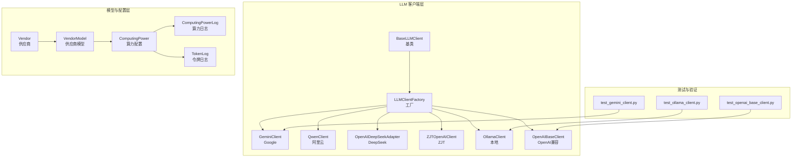
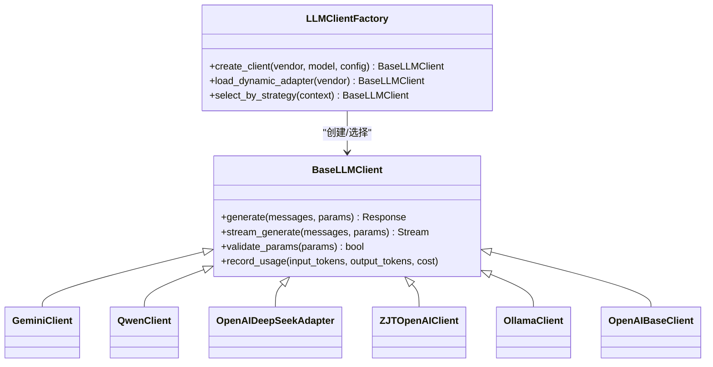
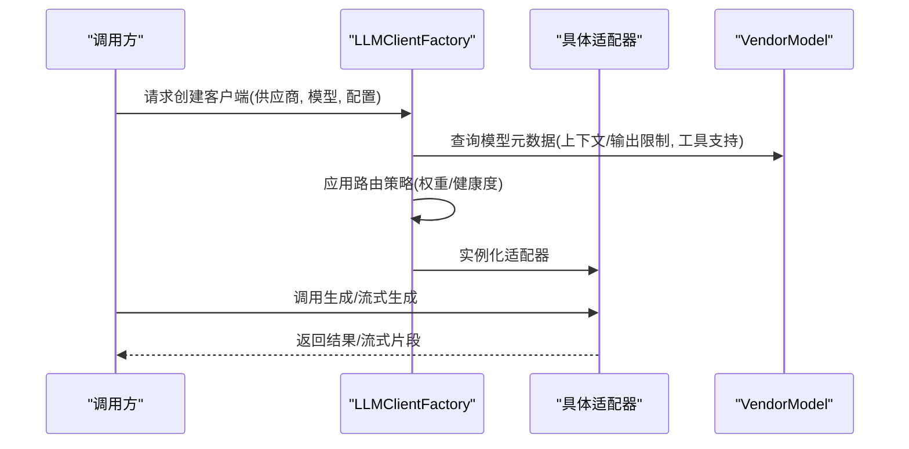
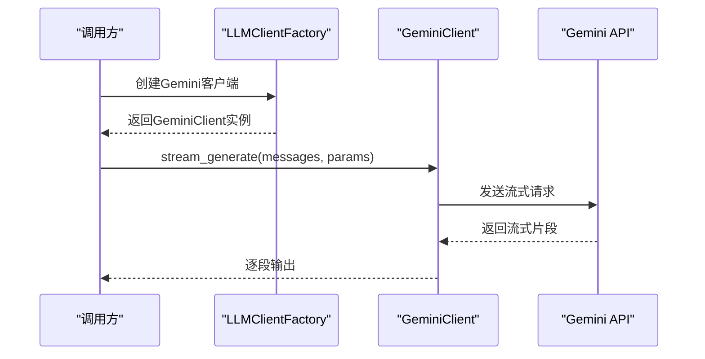
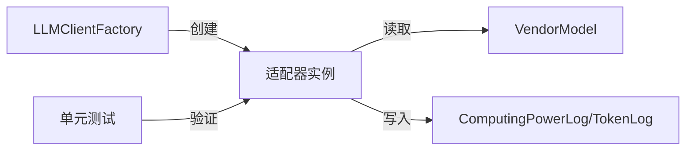

# LLM模型集成

<cite>
**本文引用的文件**
- [llm/base_llm_client.py](file://llm/base_llm_client.py)
- [llm/llm_client_factory.py](file://llm/llm_client_factory.py)
- [llm/gemini_client.py](file://llm/gemini_client.py)
- [llm/qwen.py](file://llm/qwen.py)
- [llm/openai_deepseek.py](file://llm/openai_deepseek.py)
- [llm/zjt_openai_client.py](file://llm/zjt_openai_client.py)
- [llm/ollama_client.py](file://llm/ollama_client.py)
- [llm/openai_base_client.py](file://llm/openai_base_client.py)
- [llm/script_parser.py](file://llm/script_parser.py)
- [tests/llm/test_gemini_client.py](file://tests/llm/test_gemini_client.py)
- [tests/llm/test_ollama_client.py](file://tests/llm/test_ollama_client.py)
- [tests/llm/test_openai_base_client.py](file://tests/llm/test_openai_base_client.py)
- [model/vendor.py](file://model/vendor.py)
- [model/vendor_model.py](file://model/vendor_model.py)
- [model/computing_power.py](file://model/computing_power.py)
- [model/computing_power_log.py](file://model/computing_power_log.py)
- [model/token_log.py](file://model/token_log.py)
- [alembic/versions/20260407_add_llm_qwen_config.py](file://alembic/versions/20260407_add_llm_qwen_config.py)
- [alembic/versions/20260427_add_deepseek_vendor_and_models.py](file://alembic/versions/20260427_add_deepseek_vendor_and_models.py)
- [alembic/versions/20260422_add_zjt_api_vendor_and_models.py](file://alembic/versions/20260422_add_zjt_api_vendor_and_models.py)
- [alembic/versions/20260417_add_ollama_initial_data.py](file://alembic/versions/20260417_add_ollama_initial_data.py)
- [alembic/versions/20260409_qwen_tiered_billing.py](file://alembic/versions/20260409_qwen_tiered_billing.py)
- [alembic/versions/20260409_vendor_model_tiered_billing.py](file://alembic/versions/20260409_vendor_model_tiered_billing.py)
- [alembic/versions/20260401_add_zjt_token_config.py](file://alembic/versions/20260401_add_zjt_token_config.py)
- [alembic/versions/20260401_zjt_expire_field.py](file://alembic/versions/20260401_zjt_expire_field.py)
- [alembic/versions/20260401_zjt_en_field.py](file://alembic/versions/20260401_zjt_en_field.py)
- [alembic/versions/20260407_add_qwen_models.py](file://alembic/versions/20260407_add_qwen_models.py)
- [alembic/versions/20260421_add_claude_haiku_model.py](file://alembic/versions/20260421_add_claude_haiku_model.py)
- [alembic/versions/20260420_add_volcengine_doubao_models.py](file://alembic/versions/20260420_add_volcengine_doubao_models.py)
- [alembic/versions/20260421_add_max_output_tokens_field.py](file://alembic/versions/20260421_add_max_output_tokens_field.py)
- [alembic/versions/20260417_add_context_window_to_model.py](file://alembic/versions/20260417_add_context_window_to_model.py)
- [alembic/versions/20260417_add_supports_tools_to_model.py](file://alembic/versions/20260417_add_supports_tools_to_model.py)
- [alembic/versions/20260420_add_supports_thinking.py](file://alembic/versions/20260420_add_supports_thinking.py)
- [alembic/versions/20260416_add_veo3_common_and_seedance_power.py](file://alembic/versions/20260416_add_veo3_common_and_seedance_power.py)
- [alembic/versions/20260428_add_zjt_api_deepseek_models.py](file://alembic/versions/20260428_add_zjt_api_deepseek_models.py)
- [alembic/versions/20260428_add_zjt_api_gpt55_model.py](file://alembic/versions/20260428_add_zjt_api_gpt55_model.py)
- [alembic/versions/20260420_add_volcengine_doubao_models.py](file://alembic/versions/20260420_add_volcengine_doubao_models.py)
- [alembic/versions/20260421_add_max_output_tokens_field.py](file://alembic/versions/20260421_add_max_output_tokens_field.py)
- [alembic/versions/20260417_add_context_window_to_model.py](file://alembic/versions/20260417_add_context_window_to_model.py)
- [alembic/versions/20260417_add_supports_tools_to_model.py](file://alembic/versions/20260417_add_supports_tools_to_model.py)
- [alembic/versions/20260420_add_supports_thinking.py](file://alembic/versions/20260420_add_supports_thinking.py)
- [alembic/versions/20260416_add_veo3_common_and_seedance_power.py](file://alembic/versions/20260416_add_veo3_common_and_seedance_power.py)
- [alembic/versions/20260428_add_zjt_api_deepseek_models.py](file://alembic/versions/20260428_add_zjt_api_deepseek_models.py)
- [alembic/versions/20260428_add_zjt_api_gpt55_model.py](file://alembic/versions/20260428_add_zjt_api_gpt55_model.py)
</cite>

## 目录
1. [引言](#引言)
2. [项目结构](#项目结构)
3. [核心组件](#核心组件)
4. [架构总览](#架构总览)
5. [详细组件分析](#详细组件分析)
6. [依赖关系分析](#依赖关系分析)
7. [性能考量](#性能考量)
8. [故障排查指南](#故障排查指南)
9. [结论](#结论)
10. [附录](#附录)

## 引言
本文件面向需要在系统中集成与统一管理多种大语言模型（LLM）的工程师与产品人员，系统性梳理了统一LLM客户端架构、适配器实现、工厂创建与动态加载机制、参数配置与请求/响应标准化、模型切换与成本控制策略，并提供新模型接入的开发指南与性能优化建议。内容基于仓库中的LLM相关模块与数据库迁移脚本进行归纳总结，确保可操作性与可追溯性。

## 项目结构
LLM相关能力主要集中在 llm 目录，采用“基类 + 供应商适配器 + 工厂”的分层组织方式；同时配合 model 层的供应商与模型元数据、算力与计费日志，以及 alembic 迁移脚本对供应商与模型配置进行持久化管理。

图表来源
- [llm/base_llm_client.py](file://llm/base_llm_client.py)
- [llm/llm_client_factory.py](file://llm/llm_client_factory.py)
- [llm/gemini_client.py](file://llm/gemini_client.py)
- [llm/qwen.py](file://llm/qwen.py)
- [llm/openai_deepseek.py](file://llm/openai_deepseek.py)
- [llm/zjt_openai_client.py](file://llm/zjt_openai_client.py)
- [llm/ollama_client.py](file://llm/ollama_client.py)
- [llm/openai_base_client.py](file://llm/openai_base_client.py)
- [model/vendor.py](file://model/vendor.py)
- [model/vendor_model.py](file://model/vendor_model.py)
- [model/computing_power.py](file://model/computing_power.py)
- [model/computing_power_log.py](file://model/computing_power_log.py)
- [model/token_log.py](file://model/token_log.py)
- [tests/llm/test_gemini_client.py](file://tests/llm/test_gemini_client.py)
- [tests/llm/test_ollama_client.py](file://tests/llm/test_ollama_client.py)
- [tests/llm/test_openai_base_client.py](file://tests/llm/test_openai_base_client.py)

章节来源
- [llm/base_llm_client.py](file://llm/base_llm_client.py)
- [llm/llm_client_factory.py](file://llm/llm_client_factory.py)
- [model/vendor.py](file://model/vendor.py)
- [model/vendor_model.py](file://model/vendor_model.py)

## 核心组件
- 统一基类：定义通用接口契约（如生成文本、流式输出、参数校验、成本统计等），确保不同供应商适配器的一致行为。
- 适配器实现：针对各供应商（Google Gemini、阿里云Qwen、DeepSeek、ZJT、Ollama、OpenAI兼容）的具体实现，封装HTTP调用、请求格式转换、响应解析与错误处理。
- 工厂与动态加载：根据配置或上下文选择合适的适配器实例，支持按供应商/模型/路由策略动态切换。
- 模型与供应商元数据：通过 Vendor/VendorModel 管理供应商信息、模型列表、上下文窗口、最大输出长度、是否支持工具调用/思考等属性。
- 成本与令牌日志：记录算力消耗与令牌用量，支持阶梯计费与账单追踪。

章节来源
- [llm/base_llm_client.py](file://llm/base_llm_client.py)
- [llm/llm_client_factory.py](file://llm/llm_client_factory.py)
- [model/vendor.py](file://model/vendor.py)
- [model/vendor_model.py](file://model/vendor_model.py)
- [model/computing_power.py](file://model/computing_power.py)
- [model/computing_power_log.py](file://model/computing_power_log.py)
- [model/token_log.py](file://model/token_log.py)

## 架构总览
统一LLM客户端架构以“基类 + 工厂 + 适配器”为核心，辅以模型元数据与成本日志，形成可扩展、可配置、可观测的LLM集成体系。

图表来源
- [llm/base_llm_client.py](file://llm/base_llm_client.py)
- [llm/llm_client_factory.py](file://llm/llm_client_factory.py)
- [llm/gemini_client.py](file://llm/gemini_client.py)
- [llm/qwen.py](file://llm/qwen.py)
- [llm/openai_deepseek.py](file://llm/openai_deepseek.py)
- [llm/zjt_openai_client.py](file://llm/zjt_openai_client.py)
- [llm/ollama_client.py](file://llm/ollama_client.py)
- [llm/openai_base_client.py](file://llm/openai_base_client.py)

## 详细组件分析

### 基类设计与接口规范（BaseLLMClient）
- 职责边界：统一抽象生成接口、流式接口、参数校验、成本与令牌记录。
- 关键方法族：
  - 文本生成：接收消息历史与参数，返回标准响应对象。
  - 流式生成：返回可迭代的流式片段，便于前端实时渲染。
  - 参数校验：对模型参数、上下文长度、输出长度等进行合法性检查。
  - 成本记录：在生成完成后写入算力日志与令牌日志，支持阶梯计费。
- 设计要点：
  - 明确输入/输出的数据结构约定，避免供应商差异导致的解析混乱。
  - 将“供应商特定字段”收敛到适配器内部，保持对外一致的调用形态。

章节来源
- [llm/base_llm_client.py](file://llm/base_llm_client.py)

### 工厂模式与动态加载（LLMClientFactory）
- 动态创建：根据供应商标识与模型标识，动态加载对应适配器实例。
- 策略选择：支持按用户偏好、负载情况、可用性状态进行路由选择。
- 配置驱动：从统一配置系统读取供应商可用性、权重、超时等参数，保障运行期可调。
- 扩展性：新增供应商仅需实现适配器并注册到工厂映射表，无需改动上层调用逻辑。

图表来源
- [llm/llm_client_factory.py](file://llm/llm_client_factory.py)
- [model/vendor_model.py](file://model/vendor_model.py)

章节来源
- [llm/llm_client_factory.py](file://llm/llm_client_factory.py)
- [model/vendor_model.py](file://model/vendor_model.py)

### 供应商适配器实现

#### Google Gemini 适配器（GeminiClient）
- 特点：遵循Google官方API规范，支持多模态（文本/图像）、函数调用、流式输出。
- 关键流程：认证头注入、消息转为Gemini请求体、解析候选内容、流式分片聚合。
- 测试覆盖：单元测试验证请求构造、响应解析与错误码处理。

图表来源
- [llm/gemini_client.py](file://llm/gemini_client.py)
- [tests/llm/test_gemini_client.py](file://tests/llm/test_gemini_client.py)

章节来源
- [llm/gemini_client.py](file://llm/gemini_client.py)
- [tests/llm/test_gemini_client.py](file://tests/llm/test_gemini_client.py)

#### 阿里云Qwen适配器（QwenClient）
- 特点：兼容OpenAI风格请求，支持工具调用、思维链、多模态。
- 集成点：通过OpenAI兼容层或直连DashScope API；支持阶梯计费与多模型配置。
- 数据迁移：包含Qwen供应商与模型初始化、阶梯计费、上下文窗口、工具支持等迁移脚本。

章节来源
- [llm/qwen.py](file://llm/qwen.py)
- [alembic/versions/20260407_add_llm_qwen_config.py](file://alembic/versions/20260407_add_llm_qwen_config.py)
- [alembic/versions/20260407_add_qwen_models.py](file://alembic/versions/20260407_add_qwen_models.py)
- [alembic/versions/20260409_qwen_tiered_billing.py](file://alembic/versions/20260409_qwen_tiered_billing.py)
- [alembic/versions/20260417_add_context_window_to_model.py](file://alembic/versions/20260417_add_context_window_to_model.py)
- [alembic/versions/20260417_add_supports_tools_to_model.py](file://alembic/versions/20260417_add_supports_tools_to_model.py)
- [alembic/versions/20260420_add_supports_thinking.py](file://alembic/versions/20260420_add_supports_thinking.py)

#### DeepSeek 适配器（OpenAIDeepSeekAdapter）
- 特点：基于OpenAI兼容协议，支持多模型与流式输出。
- 集成点：通过OpenAI兼容客户端封装，适配DeepSeek API；迁移脚本包含供应商与模型初始化。

章节来源
- [llm/openai_deepseek.py](file://llm/openai_deepseek.py)
- [alembic/versions/20260427_add_deepseek_vendor_and_models.py](file://alembic/versions/20260427_add_deepseek_vendor_and_models.py)

#### ZJT OpenAI 兼容客户端（ZJTOpenAIClient）
- 特点：OpenAI兼容风格，支持多模型与流式输出。
- 集成点：迁移脚本包含ZJT供应商、模型、阶梯计费、过期时间与启用字段等配置。

章节来源
- [llm/zjt_openai_client.py](file://llm/zjt_openai_client.py)
- [alembic/versions/20260422_add_zjt_api_vendor_and_models.py](file://alembic/versions/20260422_add_zjt_api_vendor_and_models.py)
- [alembic/versions/20260428_add_zjt_api_deepseek_models.py](file://alembic/versions/20260428_add_zjt_api_deepseek_models.py)
- [alembic/versions/20260428_add_zjt_api_gpt55_model.py](file://alembic/versions/20260428_add_zjt_api_gpt55_model.py)
- [alembic/versions/20260401_add_zjt_token_config.py](file://alembic/versions/20260401_add_zjt_token_config.py)
- [alembic/versions/20260401_zjt_expire_field.py](file://alembic/versions/20260401_zjt_expire_field.py)
- [alembic/versions/20260401_zjt_en_field.py](file://alembic/versions/20260401_zjt_en_field.py)

#### Ollama 本地客户端（OllamaClient）
- 特点：本地推理，支持多模型，适合离线与隐私场景。
- 集成点：迁移脚本包含Ollama初始数据与模型配置。

章节来源
- [llm/ollama_client.py](file://llm/ollama_client.py)
- [alembic/versions/20260417_add_ollama_initial_data.py](file://alembic/versions/20260417_add_ollama_initial_data.py)

#### OpenAI 兼容基类（OpenAIBaseClient）
- 特点：统一OpenAI风格请求/响应处理，便于其他OpenAI兼容供应商快速接入。
- 集成点：被DeepSeek、ZJT等适配器复用。

章节来源
- [llm/openai_base_client.py](file://llm/openai_base_client.py)
- [tests/llm/test_openai_base_client.py](file://tests/llm/test_openai_base_client.py)

### 请求格式标准化与响应解析
- 输入标准化：将业务消息统一转换为适配器期望的消息数组（含角色、内容、工具调用等），并在基类中进行参数校验（上下文长度、最大输出长度、工具/思考开关）。
- 输出标准化：将供应商原始响应映射为统一的响应对象，包含文本内容、完成原因、使用统计等；流式输出则逐段透传。
- 错误处理：捕获网络异常、HTTP错误码、速率限制与模型内部错误，统一转化为可识别的错误类型并记录日志。

章节来源
- [llm/base_llm_client.py](file://llm/base_llm_client.py)
- [llm/gemini_client.py](file://llm/gemini_client.py)
- [llm/qwen.py](file://llm/qwen.py)
- [llm/openai_deepseek.py](file://llm/openai_deepseek.py)
- [llm/zjt_openai_client.py](file://llm/zjt_openai_client.py)
- [llm/ollama_client.py](file://llm/ollama_client.py)
- [llm/openai_base_client.py](file://llm/openai_base_client.py)

### 模型切换策略、负载均衡与故障转移
- 切换策略：基于用户偏好、模型能力（工具/思考/多模态）、上下文窗口与输出长度匹配进行优先级排序。
- 负载均衡：按供应商权重轮询或按健康度（成功率/延迟）动态调整流量。
- 故障转移：当某供应商/模型失败时，自动降级到备选供应商或模型；支持熔断阈值与冷却时间。
- 可观测性：结合算力日志与令牌日志，记录每次调用的成本与耗时，支撑策略优化。

章节来源
- [llm/llm_client_factory.py](file://llm/llm_client_factory.py)
- [model/computing_power_log.py](file://model/computing_power_log.py)
- [model/token_log.py](file://model/token_log.py)

### 流式响应处理、令牌计数与成本控制
- 流式处理：适配器将供应商流式输出转换为统一的事件流，前端可实时渲染；基类负责统计输入/输出令牌并触发成本记录。
- 令牌计数：依据模型元数据与实际用量，区分输入/输出/函数调用等不同计费项。
- 成本控制：阶梯计费与预算上限结合，超过阈值时触发告警或阻断；支持按供应商/模型/用户维度的限额管理。

章节来源
- [llm/base_llm_client.py](file://llm/base_llm_client.py)
- [model/computing_power.py](file://model/computing_power.py)
- [model/computing_power_log.py](file://model/computing_power_log.py)
- [model/token_log.py](file://model/token_log.py)
- [alembic/versions/20260409_vendor_model_tiered_billing.py](file://alembic/versions/20260409_vendor_model_tiered_billing.py)

### 新LLM模型集成开发指南
- 步骤清单
  - 在 model/vendor_model 中新增供应商与模型元数据（上下文窗口、最大输出长度、工具/思考支持等）。
  - 在 llm 目录新增适配器类，继承 BaseLLMClient，实现 generate/stream_generate/参数校验/成本记录。
  - 在工厂映射中注册新适配器，或通过动态加载机制支持按配置加载。
  - 编写单元测试，覆盖请求构造、响应解析、错误处理与流式输出。
  - 在 alembic 迁移中添加供应商与模型初始化、计费配置等数据。
- 接口一致性
  - 严格遵守基类接口，避免在适配器内暴露供应商特有字段。
  - 对外统一返回结构，便于上层无感切换。
- 性能与稳定性
  - 合理设置超时与重试；对速率限制与熔断进行处理。
  - 记录详细的日志与指标，便于问题定位与容量规划。

章节来源
- [llm/base_llm_client.py](file://llm/base_llm_client.py)
- [llm/llm_client_factory.py](file://llm/llm_client_factory.py)
- [model/vendor_model.py](file://model/vendor_model.py)
- [alembic/versions/20260427_add_deepseek_vendor_and_models.py](file://alembic/versions/20260427_add_deepseek_vendor_and_models.py)

## 依赖关系分析
- 低耦合高内聚：适配器仅依赖基类接口与模型元数据，不直接依赖其他适配器。
- 配置驱动：工厂与适配器均通过配置系统读取供应商/模型参数，便于灰度与热更新。
- 数据一致性：模型元数据与计费配置由迁移脚本统一管理，保证部署一致性。

图表来源
- [llm/llm_client_factory.py](file://llm/llm_client_factory.py)
- [model/vendor_model.py](file://model/vendor_model.py)
- [model/computing_power_log.py](file://model/computing_power_log.py)
- [model/token_log.py](file://model/token_log.py)
- [tests/llm/test_gemini_client.py](file://tests/llm/test_gemini_client.py)
- [tests/llm/test_ollama_client.py](file://tests/llm/test_ollama_client.py)
- [tests/llm/test_openai_base_client.py](file://tests/llm/test_openai_base_client.py)

章节来源
- [llm/llm_client_factory.py](file://llm/llm_client_factory.py)
- [model/vendor_model.py](file://model/vendor_model.py)
- [model/computing_power_log.py](file://model/computing_power_log.py)
- [model/token_log.py](file://model/token_log.py)
- [tests/llm/test_gemini_client.py](file://tests/llm/test_gemini_client.py)
- [tests/llm/test_ollama_client.py](file://tests/llm/test_ollama_client.py)
- [tests/llm/test_openai_base_client.py](file://tests/llm/test_openai_base_client.py)

## 性能考量
- 连接池与并发：为每个供应商维护连接池，限制并发数并设置合理的超时与重试。
- 流式传输：优先使用流式输出降低首字节延迟，提升用户体验。
- 缓存与预热：对常用模型与供应商进行预热，减少冷启动开销。
- 监控与告警：对延迟、错误率、吞吐量与成本进行监控，及时发现异常并自动降级。

## 故障排查指南
- 常见问题
  - 认证失败：检查供应商密钥与域名配置。
  - 超时/限流：调整超时与重试策略，必要时切换到备用供应商。
  - 上下文过长：缩短历史消息或选择更大上下文窗口的模型。
  - 成本异常：核对阶梯计费与模型单价，检查是否混用了不同计费模型。
- 排查步骤
  - 查看适配器日志与错误码映射。
  - 对比模型元数据与实际用量，确认是否符合预期。
  - 使用单元测试复现问题，缩小范围至请求构造或响应解析环节。

章节来源
- [llm/base_llm_client.py](file://llm/base_llm_client.py)
- [llm/gemini_client.py](file://llm/gemini_client.py)
- [llm/ollama_client.py](file://llm/ollama_client.py)
- [tests/llm/test_gemini_client.py](file://tests/llm/test_gemini_client.py)
- [tests/llm/test_ollama_client.py](file://tests/llm/test_ollama_client.py)
- [tests/llm/test_openai_base_client.py](file://tests/llm/test_openai_base_client.py)

## 结论
该LLM集成体系通过统一基类、工厂与适配器，实现了多供应商、多模型的统一接入与治理。配合完善的模型元数据、成本与令牌日志，以及可扩展的工厂策略，能够满足复杂业务场景下的稳定性、可观测性与可运维性需求。新模型接入遵循既定流程即可快速落地，且具备良好的性能与成本控制能力。

## 附录
- 配置示例（路径参考）
  - 供应商与模型初始化：[20260407_add_llm_qwen_config.py](file://alembic/versions/20260407_add_llm_qwen_config.py)
  - DeepSeek供应商与模型：[20260427_add_deepseek_vendor_and_models.py](file://alembic/versions/20260427_add_deepseek_vendor_and_models.py)
  - ZJT供应商与模型：[20260422_add_zjt_api_vendor_and_models.py](file://alembic/versions/20260422_add_zjt_api_vendor_and_models.py)
  - Ollama初始数据：[20260417_add_ollama_initial_data.py](file://alembic/versions/20260417_add_ollama_initial_data.py)
  - 阶梯计费与模型字段：[20260409_qwen_tiered_billing.py](file://alembic/versions/20260409_qwen_tiered_billing.py), [20260409_vendor_model_tiered_billing.py](file://alembic/versions/20260409_vendor_model_tiered_billing.py)
  - 模型能力字段：上下文窗口、工具支持、思考支持等迁移脚本
    - [20260417_add_context_window_to_model.py](file://alembic/versions/20260417_add_context_window_to_model.py)
    - [20260417_add_supports_tools_to_model.py](file://alembic/versions/20260417_add_supports_tools_to_model.py)
    - [20260420_add_supports_thinking.py](file://alembic/versions/20260420_add_supports_thinking.py)
- 开发与测试
  - 单元测试参考：[test_gemini_client.py](file://tests/llm/test_gemini_client.py), [test_ollama_client.py](file://tests/llm/test_ollama_client.py), [test_openai_base_client.py](file://tests/llm/test_openai_base_client.py)
- 解析与处理
  - 脚本解析器（用于结构化输出解析）：[script_parser.py](file://llm/script_parser.py)