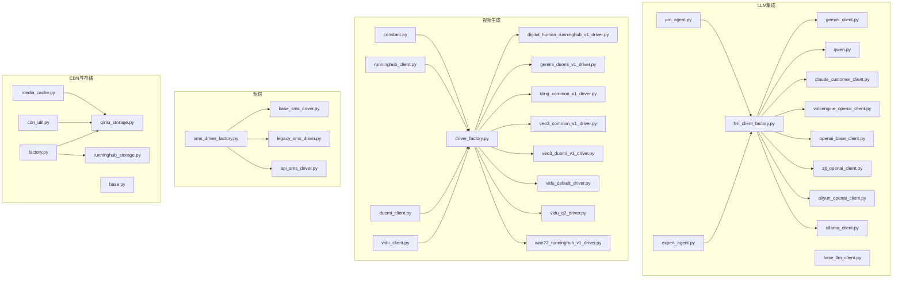
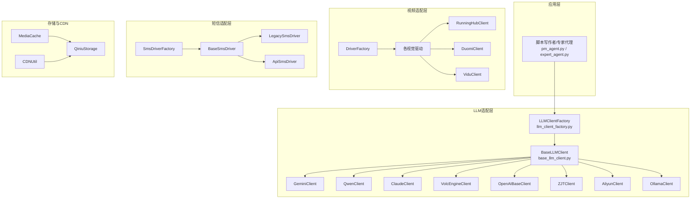
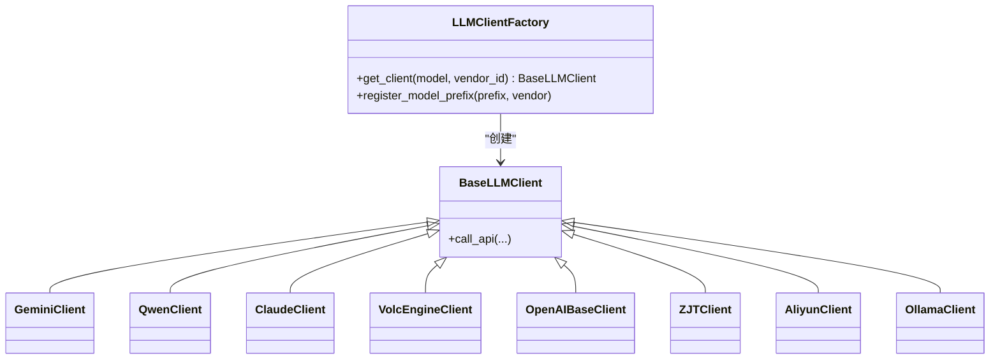
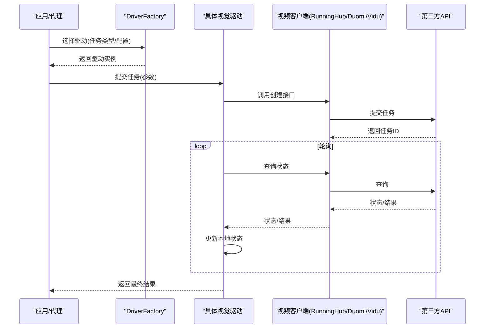
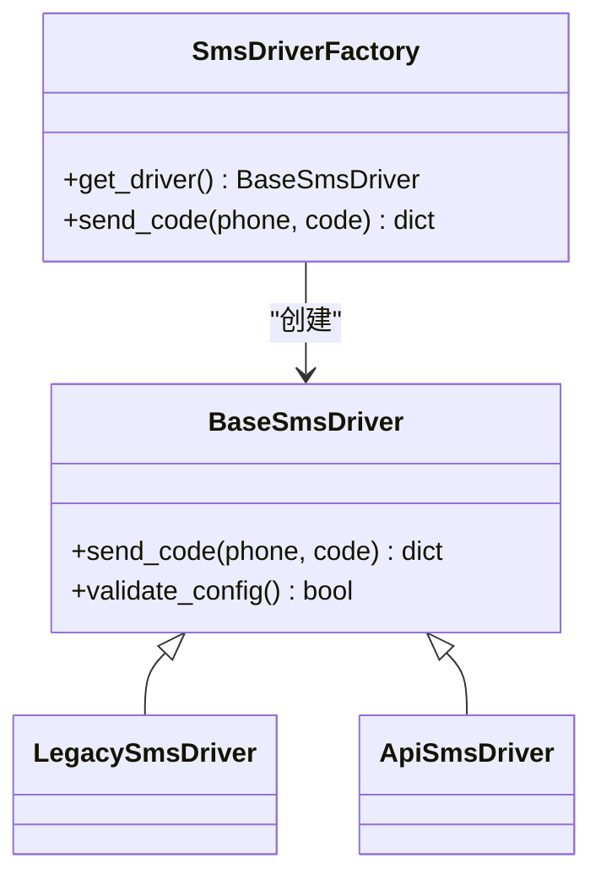
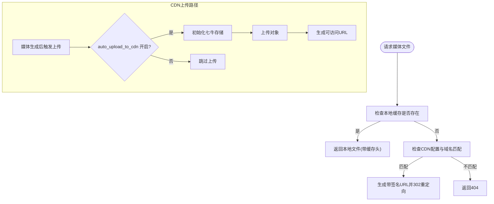
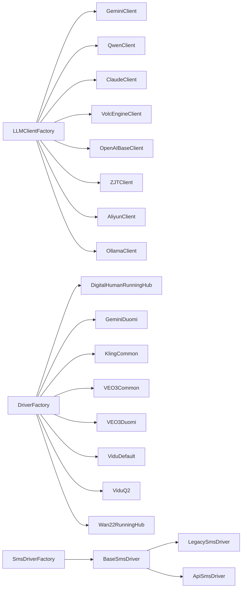

# 外部服务集成

<cite>
**本文引用的文件**
- [llm_client_factory.py](file://llm/llm_client_factory.py)
- [base_llm_client.py](file://llm/base_llm_client.py)
- [gemini_client.py](file://llm/gemini_client.py)
- [qwen.py](file://llm/qwen.py)
- [claude_customer_client.py](file://llm/claude_customer_client.py)
- [volcengine_openai_client.py](file://llm/volcengine_openai_client.py)
- [openai_base_client.py](file://llm/openai_base_client.py)
- [zjt_openai_client.py](file://llm/zjt_openai_client.py)
- [aliyun_openai_client.py](file://llm/aliyun_openai_client.py)
- [ollama_client.py](file://llm/ollama_client.py)
- [pm_agent.py](file://script_writer_core/agents/pm_agent.py)
- [expert_agent.py](file://script_writer_core/agents/expert_agent.py)
- [constant.py](file://config/constant.py)
- [runninghub_client.py](file://api/clients/runninghub_client.py)
- [duomi_client.py](file://api/clients/duomi_client.py)
- [vidu_client.py](file://api/clients/vidu_client.py)
- [__init__.py](file://api/clients/__init__.py)
- [driver_factory.py](file://task/driver_factory.py)
- [base_async_driver.py](file://task/async_drivers/base_async_driver.py)
- [runninghub_audio_driver.py](file://task/async_drivers/runninghub_audio_driver.py)
- [runninghub_face_mask_driver.py](file://task/async_drivers/runninghub_face_mask_driver.py)
- [digital_human_runninghub_v1_driver.py](file://task/visual_drivers/digital_human_runninghub_v1_driver.py)
- [gemini_duomi_v1_driver.py](file://task/visual_drivers/gemini_duomi_v1_driver.py)
- [kling_common_v1_driver.py](file://task/visual_drivers/kling_common_v1_driver.py)
- [veo3_common_v1_driver.py](file://task/visual_drivers/veo3_common_v1_driver.py)
- [veo3_duomi_v1_driver.py](file://task/visual_drivers/veo3_duomi_v1_driver.py)
- [vidu_default_driver.py](file://task/visual_drivers/vidu_default_driver.py)
- [vidu_q2_driver.py](file://task/visual_drivers/vidu_q2_driver.py)
- [wan22_runninghub_v1_driver.py](file://task/visual_drivers/wan22_runninghub_v1_driver.py)
- [exceptions.py](file://task/visual_drivers/exceptions.py)
- [sms_driver_factory.py](file://perseids_server/utils/sms_drivers/sms_driver_factory.py)
- [base_sms_driver.py](file://perseids_server/utils/sms_drivers/base_sms_driver.py)
- [legacy_sms_driver.py](file://perseids_server/utils/sms_drivers/legacy_sms_driver.py)
- [api_sms_driver.py](file://perseids_server/utils/sms_drivers/api_sms_driver.py)
- [__init__.py](file://perseids_server/utils/sms_drivers/__init__.py)
- [cdn_util.py](file://utils/cdn_util.py)
- [media_cache.py](file://utils/media_cache.py)
- [qiniu_storage.py](file://utils/file_storage/qiniu_storage.py)
- [runninghub_storage.py](file://utils/file_storage/runninghub_storage.py)
- [factory.py](file://utils/file_storage/factory.py)
- [base.py](file://utils/file_storage/base.py)
- [server.py](file://server.py)
- [test_cdn_storage.py](file://tests/cdn/test_cdn_storage.py)
- [README_EN.md](file://README_EN.md)
- [admin.js](file://web/js/admin.js)
</cite>

## 目录
1. [引言](#引言)
2. [项目结构](#项目结构)
3. [核心组件](#核心组件)
4. [架构总览](#架构总览)
5. [详细组件分析](#详细组件分析)
6. [依赖关系分析](#依赖关系分析)
7. [性能考虑](#性能考虑)
8. [故障排查指南](#故障排查指南)
9. [结论](#结论)
10. [附录](#附录)

## 引言
本文件面向ZhiJuTong平台的外部服务集成，系统化梳理以下能力与架构：
- LLM模型集成：多厂商适配、客户端工厂、模型前缀路由与供应商直连
- 视频生成API集成：RunningHub、Duomi、Vidu等服务的适配与驱动切换
- 短信服务驱动：抽象与工厂、故障转移与配置选择
- CDN存储与文件上传：URL生成、缓存策略与云存储对接
- 第三方SDK集成最佳实践、错误处理与性能优化
- 新服务接入指南、适配器实现与测试验证
- 可用性监控、降级与灾备策略

## 项目结构
围绕“外部服务集成”的关键目录与文件：
- LLM客户端与工厂：llm/* 与 script_writer_core/agents/*
- 视频生成客户端与驱动：api/clients/* 与 task/visual_drivers/*
- 短信驱动：perseids_server/utils/sms_drivers/*
- CDN与文件存储：utils/cdn_util.py、utils/media_cache.py、utils/file_storage/*
- 服务端入口与前端配置：server.py、web/js/admin.js

图表来源
- [llm_client_factory.py:33-100](file://llm/llm_client_factory.py#L33-L100)
- [base_llm_client.py](file://llm/base_llm_client.py)
- [gemini_client.py](file://llm/gemini_client.py)
- [qwen.py](file://llm/qwen.py)
- [claude_customer_client.py](file://llm/claude_customer_client.py)
- [volcengine_openai_client.py](file://llm/volcengine_openai_client.py)
- [openai_base_client.py](file://llm/openai_base_client.py)
- [zjt_openai_client.py](file://llm/zjt_openai_client.py)
- [aliyun_openai_client.py](file://llm/aliyun_openai_client.py)
- [ollama_client.py](file://llm/ollama_client.py)
- [pm_agent.py:276-299](file://script_writer_core/agents/pm_agent.py#L276-L299)
- [expert_agent.py:198-224](file://script_writer_core/agents/expert_agent.py#L198-L224)
- [constant.py:188-210](file://config/constant.py#L188-L210)
- [runninghub_client.py](file://api/clients/runninghub_client.py)
- [duomi_client.py](file://api/clients/duomi_client.py)
- [vidu_client.py](file://api/clients/vidu_client.py)
- [driver_factory.py](file://task/driver_factory.py)
- [digital_human_runninghub_v1_driver.py](file://task/visual_drivers/digital_human_runninghub_v1_driver.py)
- [gemini_duomi_v1_driver.py](file://task/visual_drivers/gemini_duomi_v1_driver.py)
- [kling_common_v1_driver.py](file://task/visual_drivers/kling_common_v1_driver.py)
- [veo3_common_v1_driver.py](file://task/visual_drivers/veo3_common_v1_driver.py)
- [veo3_duomi_v1_driver.py](file://task/visual_drivers/veo3_duomi_v1_driver.py)
- [vidu_default_driver.py](file://task/visual_drivers/vidu_default_driver.py)
- [vidu_q2_driver.py](file://task/visual_drivers/vidu_q2_driver.py)
- [wan22_runninghub_v1_driver.py](file://task/visual_drivers/wan22_runninghub_v1_driver.py)
- [sms_driver_factory.py:1-101](file://perseids_server/utils/sms_drivers/sms_driver_factory.py#L1-L101)
- [base_sms_driver.py:1-41](file://perseids_server/utils/sms_drivers/base_sms_driver.py#L1-L41)
- [legacy_sms_driver.py](file://perseids_server/utils/sms_drivers/legacy_sms_driver.py)
- [api_sms_driver.py](file://perseids_server/utils/sms_drivers/api_sms_driver.py)
- [cdn_util.py:1-76](file://utils/cdn_util.py#L1-L76)
- [media_cache.py:31-62](file://utils/media_cache.py#L31-L62)
- [qiniu_storage.py](file://utils/file_storage/qiniu_storage.py)
- [runninghub_storage.py](file://utils/file_storage/runninghub_storage.py)
- [factory.py](file://utils/file_storage/factory.py)
- [base.py](file://utils/file_storage/base.py)

章节来源
- [llm_client_factory.py:33-100](file://llm/llm_client_factory.py#L33-L100)
- [constant.py:188-210](file://config/constant.py#L188-L210)
- [sms_driver_factory.py:1-101](file://perseids_server/utils/sms_drivers/sms_driver_factory.py#L1-L101)
- [cdn_util.py:1-76](file://utils/cdn_util.py#L1-L76)

## 核心组件
- LLM客户端工厂：按模型前缀或供应商ID路由至不同厂商客户端，支持动态注册与配置校验
- 视频生成客户端与驱动：统一对外接口，内部按供应商与站点进行适配与切换
- 短信驱动工厂：基于配置选择具体驱动，支持遗留与API两种模式
- CDN与文件存储：统一封装上传、URL生成与缓存策略

章节来源
- [llm_client_factory.py:33-100](file://llm/llm_client_factory.py#L33-L100)
- [constant.py:188-210](file://config/constant.py#L188-L210)
- [sms_driver_factory.py:1-101](file://perseids_server/utils/sms_drivers/sms_driver_factory.py#L1-L101)
- [cdn_util.py:1-76](file://utils/cdn_util.py#L1-L76)

## 架构总览
整体采用“工厂 + 适配器 + 配置驱动”的解耦架构：
- LLM侧：工厂根据模型前缀或供应商ID选择具体客户端；客户端继承统一基类，实现各自协议
- 视频侧：客户端封装第三方API，驱动层负责任务调度与状态轮询，并与客户端协作
- 短信侧：工厂按配置选择驱动，驱动实现具体发送逻辑
- 存储侧：CDN工具与媒体缓存统一管理上传与URL生成

图表来源
- [pm_agent.py:276-299](file://script_writer_core/agents/pm_agent.py#L276-L299)
- [expert_agent.py:198-224](file://script_writer_core/agents/expert_agent.py#L198-L224)
- [llm_client_factory.py:33-100](file://llm/llm_client_factory.py#L33-L100)
- [base_llm_client.py](file://llm/base_llm_client.py)
- [gemini_client.py](file://llm/gemini_client.py)
- [qwen.py](file://llm/qwen.py)
- [claude_customer_client.py](file://llm/claude_customer_client.py)
- [volcengine_openai_client.py](file://llm/volcengine_openai_client.py)
- [openai_base_client.py](file://llm/openai_base_client.py)
- [zjt_openai_client.py](file://llm/zjt_openai_client.py)
- [aliyun_openai_client.py](file://llm/aliyun_openai_client.py)
- [ollama_client.py](file://llm/ollama_client.py)
- [driver_factory.py](file://task/driver_factory.py)
- [runninghub_client.py](file://api/clients/runninghub_client.py)
- [duomi_client.py](file://api/clients/duomi_client.py)
- [vidu_client.py](file://api/clients/vidu_client.py)
- [sms_driver_factory.py:1-101](file://perseids_server/utils/sms_drivers/sms_driver_factory.py#L1-L101)
- [base_sms_driver.py:1-41](file://perseids_server/utils/sms_drivers/base_sms_driver.py#L1-L41)
- [legacy_sms_driver.py](file://perseids_server/utils/sms_drivers/legacy_sms_driver.py)
- [api_sms_driver.py](file://perseids_server/utils/sms_drivers/api_sms_driver.py)
- [cdn_util.py:1-76](file://utils/cdn_util.py#L1-L76)
- [media_cache.py:31-62](file://utils/media_cache.py#L31-L62)
- [qiniu_storage.py](file://utils/file_storage/qiniu_storage.py)

## 详细组件分析

### LLM模型集成架构
- 客户端工厂
  - 支持通过供应商ID直连与模型前缀匹配两种路由方式
  - 内置多厂商映射（Google/Gemini、阿里云Qwen、Claude、火山引擎、ZhiJuTong聚合、DeepSeek、Ollama等）
  - 提供动态注册模型前缀的能力
- 客户端基类与实现
  - 统一的基类定义调用契约，各厂商客户端实现具体协议
  - 支持工具调用、思考模式、最大输出token等扩展能力
- 应用侧调用
  - 代理在调用前可读取模型配置以决定输出上限
  - 通过工厂获取客户端并发起API调用

图表来源
- [llm_client_factory.py:33-100](file://llm/llm_client_factory.py#L33-L100)
- [base_llm_client.py](file://llm/base_llm_client.py)
- [gemini_client.py](file://llm/gemini_client.py)
- [qwen.py](file://llm/qwen.py)
- [claude_customer_client.py](file://llm/claude_customer_client.py)
- [volcengine_openai_client.py](file://llm/volcengine_openai_client.py)
- [openai_base_client.py](file://llm/openai_base_client.py)
- [zjt_openai_client.py](file://llm/zjt_openai_client.py)
- [aliyun_openai_client.py](file://llm/aliyun_openai_client.py)
- [ollama_client.py](file://llm/ollama_client.py)

章节来源
- [llm_client_factory.py:33-100](file://llm/llm_client_factory.py#L33-L100)
- [pm_agent.py:276-299](file://script_writer_core/agents/pm_agent.py#L276-L299)
- [expert_agent.py:198-224](file://script_writer_core/agents/expert_agent.py#L198-L224)

### 视频生成API集成方案
- 客户端层
  - RunningHub、Duomi、Vidu分别提供统一接口封装
  - 暴露任务提交、状态轮询、结果获取等方法
- 驱动层
  - 通过常量与驱动工厂建立“任务类型”到“具体驱动”的映射
  - 各驱动实现与客户端协作，完成参数转换、异步状态同步与结果回填
- 切换机制
  - 基于配置与任务类型选择驱动
  - 支持多站点/多供应商聚合与回退策略

图表来源
- [constant.py:188-210](file://config/constant.py#L188-L210)
- [driver_factory.py](file://task/driver_factory.py)
- [runninghub_client.py](file://api/clients/runninghub_client.py)
- [duomi_client.py](file://api/clients/duomi_client.py)
- [vidu_client.py](file://api/clients/vidu_client.py)

章节来源
- [constant.py:188-210](file://config/constant.py#L188-L210)
- [runninghub_client.py](file://api/clients/runninghub_client.py)
- [duomi_client.py](file://api/clients/duomi_client.py)
- [vidu_client.py](file://api/clients/vidu_client.py)

### 短信服务驱动架构
- 抽象与实现
  - 抽象基类定义统一接口
  - 遗留与API两种驱动实现不同发送通道
- 工厂选择
  - 依据配置选择驱动类型与Agent，创建对应驱动实例
  - 单例缓存已创建实例，避免重复初始化
- 故障转移
  - 配置缺失或驱动不可用时记录日志并返回失败
  - 建议通过配置切换实现故障转移

图表来源
- [base_sms_driver.py:1-41](file://perseids_server/utils/sms_drivers/base_sms_driver.py#L1-L41)
- [legacy_sms_driver.py](file://perseids_server/utils/sms_drivers/legacy_sms_driver.py)
- [api_sms_driver.py](file://perseids_server/utils/sms_drivers/api_sms_driver.py)
- [sms_driver_factory.py:1-101](file://perseids_server/utils/sms_drivers/sms_driver_factory.py#L1-L101)

章节来源
- [sms_driver_factory.py:1-101](file://perseids_server/utils/sms_drivers/sms_driver_factory.py#L1-L101)
- [base_sms_driver.py:1-41](file://perseids_server/utils/sms_drivers/base_sms_driver.py#L1-L41)

### CDN存储、文件上传与缓存策略
- CDN工具
  - 仅在开启自动上传时生效
  - 读取七牛云长期凭证，生成带签名下载URL
  - 未配置完整时抛出异常，避免静默失败
- 媒体缓存
  - 支持本地缓存与云端存储双通道
  - 云端存储按配置初始化，失败不影响本地流程
- 文件服务端路由
  - 支持本地缓存直返与CDN域名匹配重定向
  - 设置强缓存头，提升静态资源加载性能

图表来源
- [cdn_util.py:1-76](file://utils/cdn_util.py#L1-L76)
- [media_cache.py:31-62](file://utils/media_cache.py#L31-L62)
- [server.py:526-556](file://server.py#L526-L556)

章节来源
- [cdn_util.py:1-76](file://utils/cdn_util.py#L1-L76)
- [media_cache.py:31-62](file://utils/media_cache.py#L31-L62)
- [server.py:526-556](file://server.py#L526-L556)

## 依赖关系分析
- LLM侧：工厂对各客户端低耦合，新增厂商只需实现基类并注册映射
- 视频侧：驱动与客户端解耦，通过常量表集中管理映射关系
- 短信侧：工厂对驱动实现解耦，通过配置选择具体实现
- 存储侧：CDN工具与缓存策略独立，可按需启用

图表来源
- [llm_client_factory.py:33-100](file://llm/llm_client_factory.py#L33-L100)
- [constant.py:188-210](file://config/constant.py#L188-L210)
- [sms_driver_factory.py:1-101](file://perseids_server/utils/sms_drivers/sms_driver_factory.py#L1-L101)

章节来源
- [llm_client_factory.py:33-100](file://llm/llm_client_factory.py#L33-L100)
- [constant.py:188-210](file://config/constant.py#L188-L210)
- [sms_driver_factory.py:1-101](file://perseids_server/utils/sms_drivers/sms_driver_factory.py#L1-L101)

## 性能考虑
- LLM调用
  - 优先使用供应商ID直连，减少前缀匹配开销
  - 控制最大输出token，避免超长响应导致延迟与成本上升
- 视频生成
  - 异步轮询间隔合理配置，避免频繁请求
  - 成功后尽快落库并返回，减少重复查询
- 存储
  - CDN签名URL有效期与缓存头配合，降低重复下载
  - 本地缓存目录预热与定期清理，保持磁盘健康

## 故障排查指南
- LLM客户端
  - 若路由失败，检查模型前缀是否注册或供应商ID是否正确
  - 核对各厂商API密钥与可用性配置
- 视频生成
  - 驱动映射缺失会导致无法选择驱动，检查常量表与配置
  - 客户端异常需关注状态轮询与重试策略
- 短信
  - 未配置active_driver或Agent驱动类型不匹配会返回None
  - 配置项缺失时工厂会记录错误并拒绝创建驱动
- CDN
  - auto_upload开启但凭证不完整会抛出异常
  - 本地文件不存在返回404，确认缓存路径与生成流程

章节来源
- [llm_client_factory.py:67-80](file://llm/llm_client_factory.py#L67-L80)
- [constant.py:188-210](file://config/constant.py#L188-L210)
- [sms_driver_factory.py:40-83](file://perseids_server/utils/sms_drivers/sms_driver_factory.py#L40-L83)
- [cdn_util.py:32-50](file://utils/cdn_util.py#L32-L50)
- [test_cdn_storage.py:53-66](file://tests/cdn/test_cdn_storage.py#L53-L66)
- [server.py:552-553](file://server.py#L552-L553)

## 结论
本项目通过工厂与适配器模式实现了对多家外部服务的统一接入与灵活切换：
- LLM侧具备完善的厂商路由与扩展能力
- 视频生成侧以驱动为中心，便于多供应商与多站点协同
- 短信侧以配置为中心，实现即插即用的驱动选择
- 存储侧提供CDN与本地缓存双通道，兼顾性能与可靠性

## 附录

### 新服务集成开发指南
- LLM集成
  - 实现基类接口，注册模型前缀映射或提供供应商ID直连
  - 在可用模型列表中暴露配置键，确保动态开关
- 视频生成集成
  - 编写客户端封装第三方API
  - 在常量表中注册驱动映射，实现驱动类并接入工厂
- 短信集成
  - 实现抽象基类，完成发送逻辑
  - 在工厂中注册驱动类型，提供配置项与Agent映射
- 存储集成
  - 实现存储接口，支持上传与URL生成
  - 在CDN工具中按需启用，完善错误处理

章节来源
- [llm_client_factory.py:89-100](file://llm/llm_client_factory.py#L89-L100)
- [constant.py:188-210](file://config/constant.py#L188-L210)
- [sms_driver_factory.py:17-22](file://perseids_server/utils/sms_drivers/sms_driver_factory.py#L17-L22)
- [cdn_util.py:21-50](file://utils/cdn_util.py#L21-L50)

### 第三方SDK集成最佳实践
- 统一错误处理：捕获网络异常与业务错误，返回标准化结构
- 超时与重试：为第三方请求设置合理超时与指数退避重试
- 参数校验：在进入SDK前完成输入校验，减少无效调用
- 日志与追踪：记录请求ID与关键参数，便于定位问题

### 服务可用性监控、降级与灾备
- 监控指标
  - API成功率、平均/分位延迟、错误码分布、重试次数
- 降级策略
  - 供应商不可用时切换到备用供应商或回退到本地模型
  - CDN不可用时回退到本地直返
- 灾备建议
  - 多区域部署与多CDN节点
  - 本地缓存作为兜底，保证基本可用

### 前端配置参考
- 视频供应商配置字段与展示顺序由前端维护，便于用户快速配置

章节来源
- [admin.js:314-350](file://web/js/admin.js#L314-L350)
- [README_EN.md:336-363](file://README_EN.md#L336-L363)