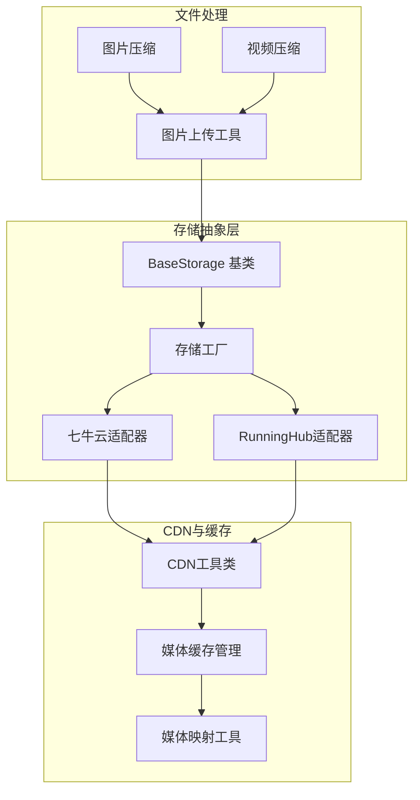
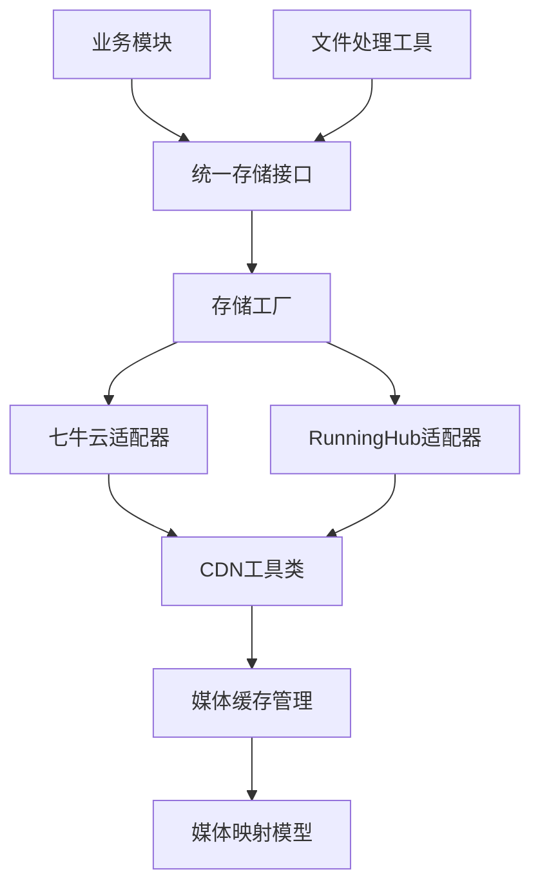
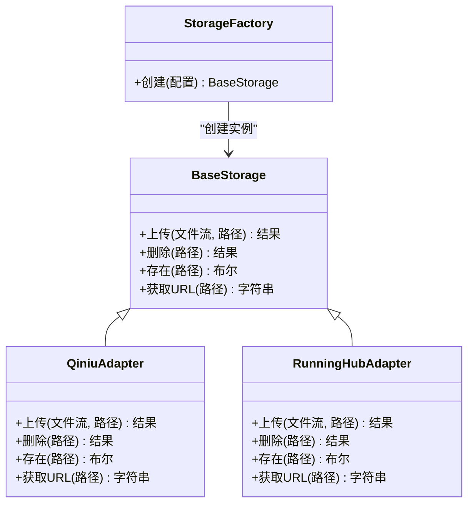
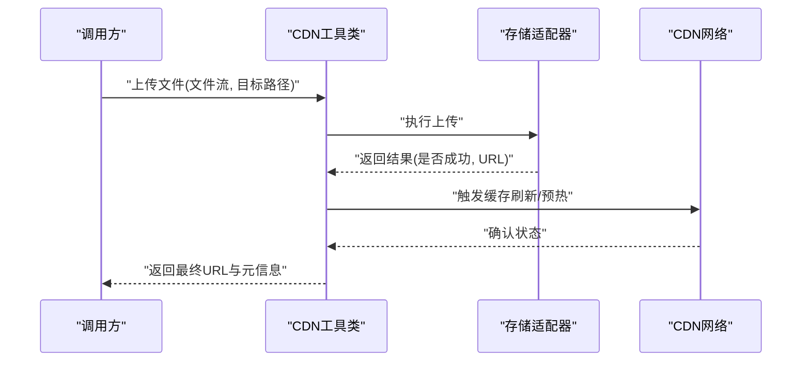
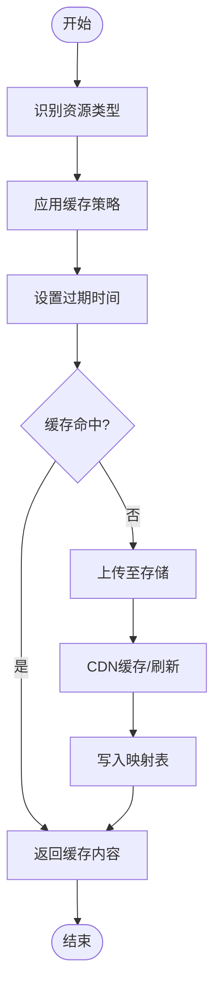
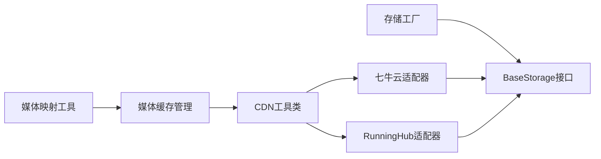

# 存储和CDN集成

<cite>
**本文引用的文件**
- [base.py](file://utils/file_storage/base.py)
- [factory.py](file://utils/file_storage/factory.py)
- [qiniu_storage.py](file://utils/file_storage/qiniu_storage.py)
- [runninghub_storage.py](file://utils/file_storage/runninghub_storage.py)
- [cdn_util.py](file://utils/cdn_util.py)
- [media_cache.py](file://utils/media_cache.py)
- [media_mapping_util.py](file://utils/media_mapping_util.py)
- [image_upload_utils.py](file://utils/image_upload_utils.py)
- [video_compressor.py](file://utils/video_compressor.py)
- [image_compressor.py](file://utils/image_compressor.py)
- [media_file_mapping.py](file://model/media_file_mapping.py)
- [test_cdn_storage.py](file://tests/cdn/test_cdn_storage.py)
- [test_ai_tools_cdn_integration.py](file://tests/cdn/test_ai_tools_cdn_integration.py)
- [test_ai_tools_cdn_sync.py](file://tests/cdn/test_ai_tools_cdn_sync.py)
- [README.md](file://docs/媒体文件缓存管理方案.md)
</cite>

## 目录
1. [简介](#简介)
2. [项目结构](#项目结构)
3. [核心组件](#核心组件)
4. [架构总览](#架构总览)
5. [详细组件分析](#详细组件分析)
6. [依赖关系分析](#依赖关系分析)
7. [性能考虑](#性能考虑)
8. [故障排除指南](#故障排除指南)
9. [结论](#结论)
10. [附录](#附录)

## 简介
本文件面向存储与CDN集成的完整技术文档，聚焦于文件存储抽象架构（BaseStorage基类与统一存储接口）、多家存储提供商适配器（如七牛云存储、RunningHub存储）的集成方案、存储工厂的创建与动态选择机制、CDN工具类的实现（文件上传、URL生成、缓存策略）、媒体缓存管理机制（策略、过期时间、清理规则），以及文件处理流程、压缩优化与安全控制。同时提供新存储服务集成的开发指南、配置示例与性能优化建议，并涵盖存储成本控制、备份策略与灾难恢复机制。

## 项目结构
围绕存储与CDN的相关模块主要分布在以下路径：
- 存储抽象与适配器：utils/file_storage/
- CDN工具：utils/cdn_util.py
- 媒体缓存：utils/media_cache.py
- 媒体映射与模型：utils/media_mapping_util.py、model/media_file_mapping.py
- 文件处理工具：utils/image_upload_utils.py、utils/video_compressor.py、utils/image_compressor.py
- 测试用例：tests/cdn/

**图表来源**
- [base.py](file://utils/file_storage/base.py)
- [factory.py](file://utils/file_storage/factory.py)
- [qiniu_storage.py](file://utils/file_storage/qiniu_storage.py)
- [runninghub_storage.py](file://utils/file_storage/runninghub_storage.py)
- [cdn_util.py](file://utils/cdn_util.py)
- [media_cache.py](file://utils/media_cache.py)
- [media_mapping_util.py](file://utils/media_mapping_util.py)
- [image_upload_utils.py](file://utils/image_upload_utils.py)
- [video_compressor.py](file://utils/video_compressor.py)
- [image_compressor.py](file://utils/image_compressor.py)

**章节来源**
- [base.py](file://utils/file_storage/base.py)
- [factory.py](file://utils/file_storage/factory.py)
- [cdn_util.py](file://utils/cdn_util.py)
- [media_cache.py](file://utils/media_cache.py)
- [media_mapping_util.py](file://utils/media_mapping_util.py)
- [image_upload_utils.py](file://utils/image_upload_utils.py)
- [video_compressor.py](file://utils/video_compressor.py)
- [image_compressor.py](file://utils/image_compressor.py)

## 核心组件
- 存储抽象基类 BaseStorage：定义统一的存储接口规范，确保不同提供商适配器具备一致的上传、删除、获取URL等能力。
- 存储工厂 StorageFactory：根据配置动态选择具体存储提供商，支持扩展新的适配器而无需修改调用方代码。
- 适配器实现：
  - 七牛云存储适配器：封装七牛SDK，实现上传、删除、生成访问URL等功能。
  - RunningHub存储适配器：对接RunningHub平台的存储能力，提供统一接口。
- CDN工具类：负责CDN资源的上传、同步与URL生成，结合缓存策略提升访问效率。
- 媒体缓存管理：基于策略、过期时间与清理规则，对媒体资源进行高效缓存与回收。
- 媒体映射与模型：维护本地路径与远端URL的映射关系，支持查询、更新与一致性校验。
- 文件处理工具：图片上传工具、图片压缩与视频压缩，保障上传质量与体积优化。

**章节来源**
- [base.py](file://utils/file_storage/base.py)
- [factory.py](file://utils/file_storage/factory.py)
- [qiniu_storage.py](file://utils/file_storage/qiniu_storage.py)
- [runninghub_storage.py](file://utils/file_storage/runninghub_storage.py)
- [cdn_util.py](file://utils/cdn_util.py)
- [media_cache.py](file://utils/media_cache.py)
- [media_mapping_util.py](file://utils/media_mapping_util.py)
- [media_file_mapping.py](file://model/media_file_mapping.py)
- [image_upload_utils.py](file://utils/image_upload_utils.py)
- [video_compressor.py](file://utils/video_compressor.py)
- [image_compressor.py](file://utils/image_compressor.py)

## 架构总览
整体架构采用“抽象基类 + 工厂 + 多适配器”的设计模式，通过统一接口屏蔽不同存储提供商的差异；CDN工具类在适配器之上提供URL生成与同步能力；媒体缓存与映射工具贯穿上传、查询与清理流程，形成完整的媒体生命周期管理。

**图表来源**
- [base.py](file://utils/file_storage/base.py)
- [factory.py](file://utils/file_storage/factory.py)
- [qiniu_storage.py](file://utils/file_storage/qiniu_storage.py)
- [runninghub_storage.py](file://utils/file_storage/runninghub_storage.py)
- [cdn_util.py](file://utils/cdn_util.py)
- [media_cache.py](file://utils/media_cache.py)
- [media_file_mapping.py](file://model/media_file_mapping.py)
- [image_upload_utils.py](file://utils/image_upload_utils.py)

## 详细组件分析

### 存储抽象与工厂
- BaseStorage基类：定义标准方法签名（如上传、删除、获取URL、是否存在等），确保所有适配器遵循同一契约，便于替换与扩展。
- 存储工厂：依据配置参数（如提供商类型、密钥、空间名等）创建对应适配器实例，支持运行时切换与热插拔。

**图表来源**
- [base.py](file://utils/file_storage/base.py)
- [factory.py](file://utils/file_storage/factory.py)
- [qiniu_storage.py](file://utils/file_storage/qiniu_storage.py)
- [runninghub_storage.py](file://utils/file_storage/runninghub_storage.py)

**章节来源**
- [base.py](file://utils/file_storage/base.py)
- [factory.py](file://utils/file_storage/factory.py)

### 七牛云存储适配器
- 功能要点：封装七牛SDK，实现上传、删除、存在性判断与URL生成；支持自定义域名与鉴权策略。
- 接口一致性：严格遵循BaseStorage契约，保证与工厂与上层调用的兼容性。
- 安全控制：通过密钥与签名机制限制访问，支持私有空间与公有空间配置。

**章节来源**
- [qiniu_storage.py](file://utils/file_storage/qiniu_storage.py)
- [base.py](file://utils/file_storage/base.py)

### RunningHub存储适配器
- 功能要点：对接RunningHub平台的存储能力，提供与七牛云适配器一致的接口语义。
- 扩展性：便于未来接入更多第三方存储平台，只需实现BaseStorage并注册到工厂。

**章节来源**
- [runninghub_storage.py](file://utils/file_storage/runninghub_storage.py)
- [base.py](file://utils/file_storage/base.py)

### CDN工具类
- 文件上传：在适配器基础上进行批量上传与错误重试，支持断点续传与并发优化。
- URL生成：根据配置生成带有效期或永久性的访问链接，支持防盗链策略。
- 缓存策略：结合HTTP缓存头、CDN缓存规则与本地缓存，减少回源压力。
- 同步机制：与媒体映射保持一致性，避免URL失效或路径不匹配。

**图表来源**
- [cdn_util.py](file://utils/cdn_util.py)
- [qiniu_storage.py](file://utils/file_storage/qiniu_storage.py)
- [runninghub_storage.py](file://utils/file_storage/runninghub_storage.py)

**章节来源**
- [cdn_util.py](file://utils/cdn_util.py)

### 媒体缓存管理机制
- 策略：按资源类型（图片/视频）与访问频率设置缓存层级；热点资源优先缓存至边缘节点。
- 过期时间：基于TTL与LRU策略设定过期时间，支持手动刷新与自动回收。
- 清理规则：定期扫描无效映射与过期缓存，释放存储与带宽资源。
- 与映射协作：通过媒体映射工具与模型，确保缓存命中与一致性。

**图表来源**
- [media_cache.py](file://utils/media_cache.py)
- [media_mapping_util.py](file://utils/media_mapping_util.py)
- [media_file_mapping.py](file://model/media_file_mapping.py)

**章节来源**
- [media_cache.py](file://utils/media_cache.py)
- [media_mapping_util.py](file://utils/media_mapping_util.py)
- [media_file_mapping.py](file://model/media_file_mapping.py)
- [README.md](file://docs/媒体文件缓存管理方案.md)

### 文件处理流程、压缩优化与安全控制
- 文件处理流程：上传前进行格式校验与大小限制，必要时进行压缩与转码，再进入存储与CDN分发。
- 压缩优化：图片压缩与视频压缩工具按目标质量与尺寸阈值进行降噪与编码优化，降低带宽与存储成本。
- 安全控制：访问鉴权、私有空间、HTTPS传输、MIME类型校验与白名单过滤，防止恶意文件注入。

**章节来源**
- [image_upload_utils.py](file://utils/image_upload_utils.py)
- [video_compressor.py](file://utils/video_compressor.py)
- [image_compressor.py](file://utils/image_compressor.py)

## 依赖关系分析
- 组件耦合：存储工厂与适配器之间为松耦合，通过BaseStorage接口交互；CDN工具依赖适配器但不关心具体实现。
- 外部依赖：七牛云适配器依赖七牛SDK；RunningHub适配器依赖平台提供的API；CDN工具依赖CDN网络与缓存策略。
- 潜在循环：当前结构无明显循环依赖，各模块职责清晰。

**图表来源**
- [factory.py](file://utils/file_storage/factory.py)
- [base.py](file://utils/file_storage/base.py)
- [qiniu_storage.py](file://utils/file_storage/qiniu_storage.py)
- [runninghub_storage.py](file://utils/file_storage/runninghub_storage.py)
- [cdn_util.py](file://utils/cdn_util.py)
- [media_cache.py](file://utils/media_cache.py)
- [media_mapping_util.py](file://utils/media_mapping_util.py)

**章节来源**
- [factory.py](file://utils/file_storage/factory.py)
- [base.py](file://utils/file_storage/base.py)
- [qiniu_storage.py](file://utils/file_storage/qiniu_storage.py)
- [runninghub_storage.py](file://utils/file_storage/runninghub_storage.py)
- [cdn_util.py](file://utils/cdn_util.py)
- [media_cache.py](file://utils/media_cache.py)
- [media_mapping_util.py](file://utils/media_mapping_util.py)

## 性能考虑
- 并发上传：CDN工具类支持并发上传与断点续传，减少单文件等待时间。
- 边缘缓存：合理设置TTL与缓存标签，最大化边缘节点命中率，降低回源次数。
- 压缩策略：根据业务场景选择合适的压缩比与质量阈值，在画质与体积间取得平衡。
- 成本优化：优先使用对象存储的低频存储类型存放冷数据，热数据走高性能存储与CDN加速。
- 监控与告警：建立上传成功率、CDN命中率、存储用量与带宽消耗的监控体系。

## 故障排除指南
- 上传失败：检查适配器配置（AK/SK、空间名、域名）、网络连通性与权限；查看CDN工具类的错误日志与重试策略。
- URL不可访问：核对鉴权配置、私有空间权限与CDN缓存状态；确认媒体映射表中的URL与实际存储路径一致。
- 缓存异常：检查缓存策略与过期时间设置，清理无效映射后重新触发缓存刷新。
- 压缩问题：验证输入格式与压缩参数，确保输出符合预期质量与尺寸要求。

**章节来源**
- [test_cdn_storage.py](file://tests/cdn/test_cdn_storage.py)
- [test_ai_tools_cdn_integration.py](file://tests/cdn/test_ai_tools_cdn_integration.py)
- [test_ai_tools_cdn_sync.py](file://tests/cdn/test_ai_tools_cdn_sync.py)

## 结论
该存储与CDN集成方案以BaseStorage为核心抽象，通过工厂模式实现多适配器无缝切换，结合CDN工具与媒体缓存管理，构建了高可用、可扩展且性能友好的媒体资源管理体系。配合文件处理与安全控制，能够满足多样化业务场景下的存储与分发需求。

## 附录

### 新存储服务集成开发指南
- 实现步骤
  - 新建适配器类并继承BaseStorage，实现统一接口方法。
  - 在存储工厂中注册新适配器的创建逻辑，支持通过配置项选择。
  - 编写单元测试与集成测试，覆盖上传、删除、URL生成与错误处理。
  - 在CDN工具类中验证与新适配器的协同工作，确保缓存与同步正常。
- 配置示例
  - 提供配置项：提供商类型、访问密钥、存储空间、域名与鉴权开关。
  - 支持环境变量与配置文件两种方式，便于多环境部署。
- 性能优化建议
  - 使用并发上传与分片策略，结合CDN边缘节点提升分发效率。
  - 对冷数据采用低频存储与预热策略，平衡成本与性能。
  - 建立完善的监控与告警机制，及时发现并处理异常。

### 存储成本控制、备份策略与灾难恢复
- 成本控制
  - 分层存储：热数据走高性能存储与CDN，冷数据迁移至低频存储。
  - 压缩与去重：在上传前进行压缩与重复检测，减少存储与带宽占用。
  - 预算与用量监控：设置阈值告警，避免超支。
- 备份策略
  - 异地多活：至少两套存储与CDN节点，跨区域冗余。
  - 定期快照：对关键数据进行周期性备份，支持快速回滚。
- 灾难恢复
  - 自动切换：当主节点不可用时，自动切流至备用节点。
  - 一致性校验：灾备恢复后，校验媒体映射与缓存一致性，确保业务连续性。