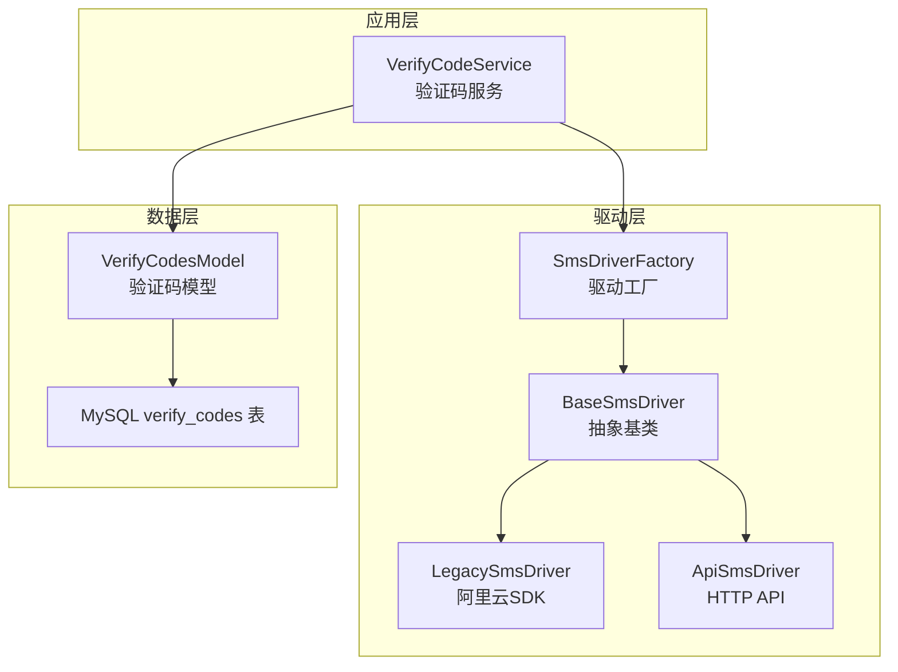
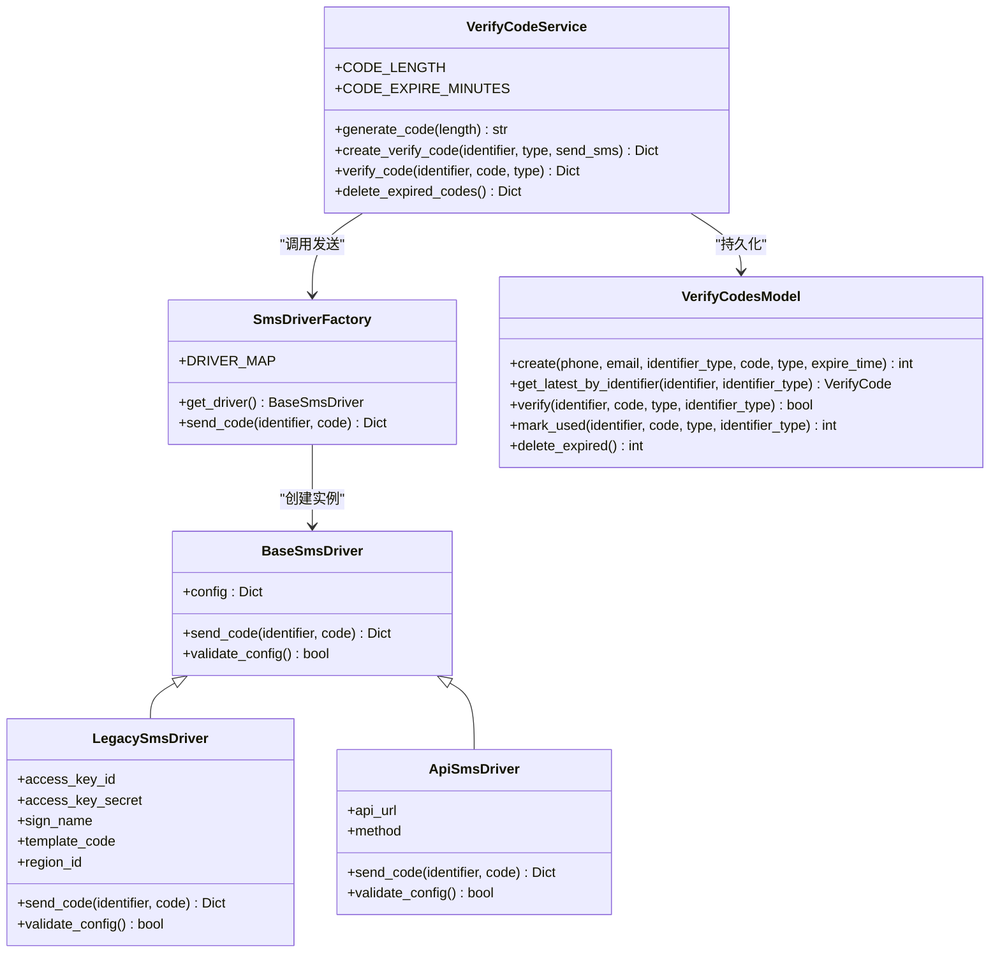
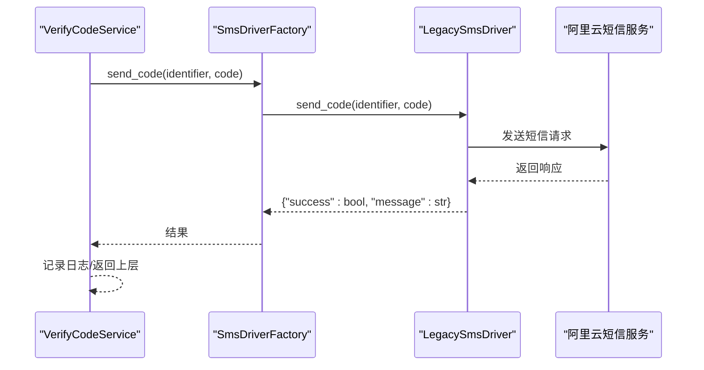
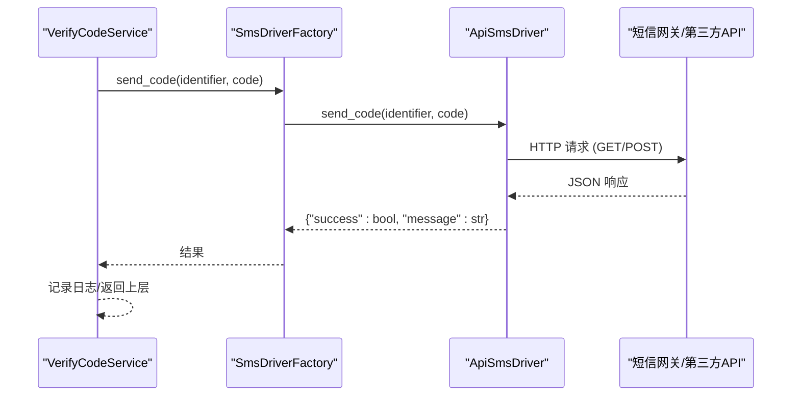
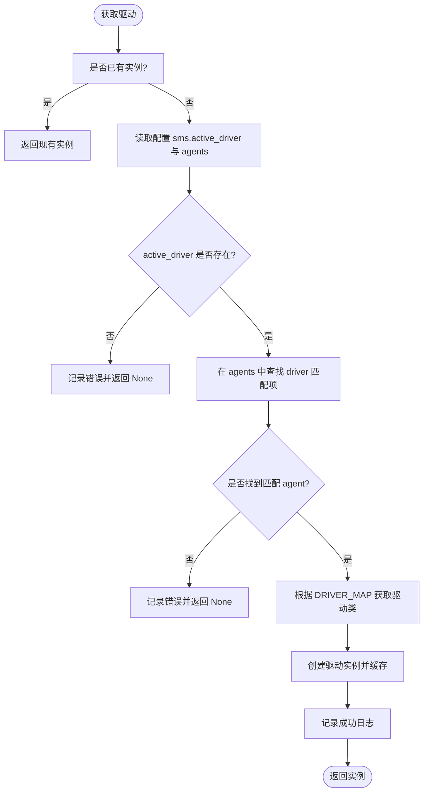
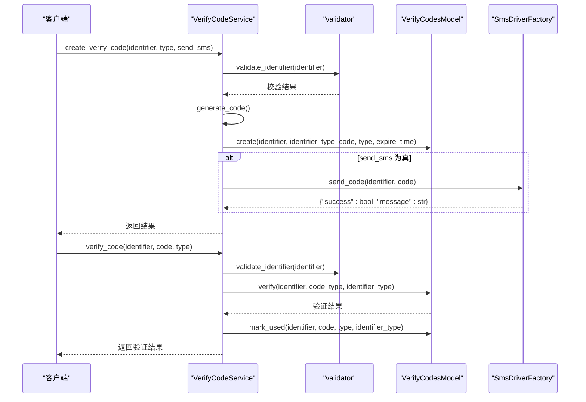
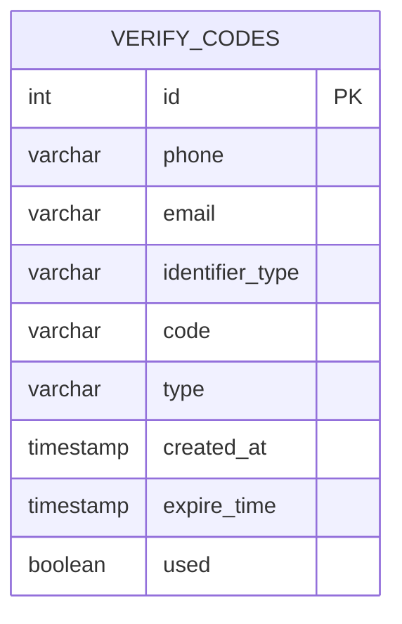
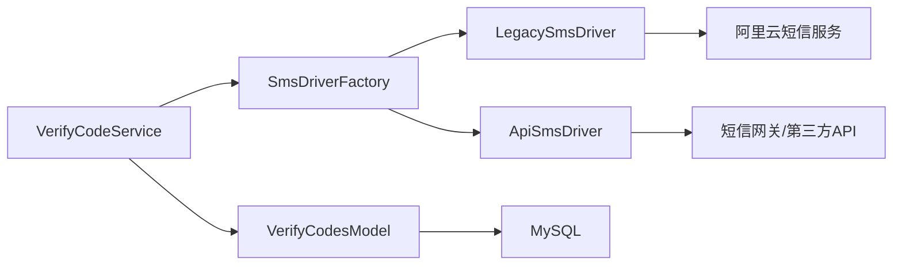

# 短信服务集成

<cite>
**本文档引用的文件**
- [perseids_server/utils/sms_drivers/base_sms_driver.py](file://perseids_server/utils/sms_drivers/base_sms_driver.py)
- [perseids_server/utils/sms_drivers/legacy_sms_driver.py](file://perseids_server/utils/sms_drivers/legacy_sms_driver.py)
- [perseids_server/utils/sms_drivers/api_sms_driver.py](file://perseids_server/utils/sms_drivers/api_sms_driver.py)
- [perseids_server/utils/sms_drivers/sms_driver_factory.py](file://perseids_server/utils/sms_drivers/sms_driver_factory.py)
- [perseids_server/services/verify_code_service.py](file://perseids_server/services/verify_code_service.py)
- [model/verify_codes.py](file://model/verify_codes.py)
- [perseids_server/utils/validator.py](file://perseids_server/utils/validator.py)
- [alembic/versions/20260603_add_email_support.py](file://alembic/versions/20260603_add_email_support.py)
- [model/sql/baseline.sql](file://model/sql/baseline.sql)
- [server.py](file://server.py)
</cite>

## 更新摘要
**所做更改**
- 更新了验证码服务支持手机号和邮箱两种标识符类型的架构描述
- 新增了双模式验证码管理的技术实现细节
- 更新了数据库模型和迁移文件的相关说明
- 增强了邮件认证系统集成的配置和使用指南
- 完善了多标识符类型的安全性和兼容性考虑

## 目录
1. [简介](#简介)
2. [项目结构](#项目结构)
3. [核心组件](#核心组件)
4. [架构总览](#架构总览)
5. [详细组件分析](#详细组件分析)
6. [依赖关系分析](#依赖关系分析)
7. [性能与可靠性](#性能与可靠性)
8. [故障排查指南](#故障排查指南)
9. [结论](#结论)
10. [附录](#附录)

## 简介
本文件面向短信服务集成，系统化梳理短信驱动器架构、适配器实现、工厂创建与动态选择机制、短信发送流程、状态回调与失败重试策略、模板管理与变量替换、国际化支持、费用控制与合规要求，并提供新服务商接入指南、配置示例与测试验证方法。

**重要更新**：验证码服务现已支持手机号和邮箱两种标识符类型，数据库模型新增email和identifier_type字段，实现双模式验证码管理，为邮件认证系统集成提供完整支持。

## 项目结构
短信能力主要由以下层次构成：
- 抽象层：BaseSmsDriver 定义统一接口与基础能力
- 实现层：LegacySmsDriver（阿里云SDK）、ApiSmsDriver（HTTP API）
- 工厂层：SmsDriverFactory 提供单例与动态选择
- 业务层：VerifyCodeService 负责验证码生命周期与发送
- 数据层：VerifyCodesModel 负责验证码持久化，支持双标识符类型
- 校验层：validator 提供手机号等格式校验
- 迁移与表结构：数据库迁移与 baseline 中的 verify_codes 表定义

**图表来源**
- [perseids_server/services/verify_code_service.py:18-225](file://perseids_server/services/verify_code_service.py#L18-L225)
- [perseids_server/utils/sms_drivers/base_sms_driver.py:8-42](file://perseids_server/utils/sms_drivers/base_sms_driver.py#L8-L42)
- [perseids_server/utils/sms_drivers/legacy_sms_driver.py:11-97](file://perseids_server/utils/sms_drivers/legacy_sms_driver.py#L11-L97)
- [perseids_server/utils/sms_drivers/api_sms_driver.py:12-122](file://perseids_server/utils/sms_drivers/api_sms_driver.py#L12-L122)
- [perseids_server/utils/sms_drivers/sms_driver_factory.py:14-101](file://perseids_server/utils/sms_drivers/sms_driver_factory.py#L14-L101)
- [model/verify_codes.py:46-106](file://model/verify_codes.py#L46-L106)
- [model/sql/baseline.sql:540-549](file://model/sql/baseline.sql#L540-L549)

**章节来源**
- [perseids_server/utils/sms_drivers/__init__.py:1-14](file://perseids_server/utils/sms_drivers/__init__.py#L1-L14)
- [perseids_server/utils/sms_drivers/base_sms_driver.py:1-42](file://perseids_server/utils/sms_drivers/base_sms_driver.py#L1-L42)
- [perseids_server/utils/sms_drivers/legacy_sms_driver.py:1-97](file://perseids_server/utils/sms_drivers/legacy_sms_driver.py#L1-L97)
- [perseids_server/utils/sms_drivers/api_sms_driver.py:1-122](file://perseids_server/utils/sms_drivers/api_sms_driver.py#L1-L122)
- [perseids_server/utils/sms_drivers/sms_driver_factory.py:1-101](file://perseids_server/utils/sms_drivers/sms_driver_factory.py#L1-L101)
- [perseids_server/services/verify_code_service.py:1-225](file://perseids_server/services/verify_code_service.py#L1-L225)
- [model/verify_codes.py:1-106](file://model/verify_codes.py#L1-L106)
- [perseids_server/utils/validator.py:1-77](file://perseids_server/utils/validator.py#L1-L77)
- [alembic/versions/20260603_add_email_support.py:104-161](file://alembic/versions/20260603_add_email_support.py#L104-L161)
- [model/sql/baseline.sql:540-549](file://model/sql/baseline.sql#L540-L549)

## 核心组件
- BaseSmsDriver：定义统一接口 send_code 与配置校验 validate_config，作为所有驱动的抽象基类
- LegacySmsDriver：基于阿里云 SDK 的短信驱动，需要 access_key_id、access_key_secret、sign_name、template_code 等配置
- ApiSmsDriver：基于 HTTP API 的短信驱动，支持 GET/POST，通过 api_url 与 method 配置
- SmsDriverFactory：单例工厂，根据配置文件中的 active_driver 与 agents 选择具体驱动实例
- VerifyCodeService：验证码服务，负责生成、存储、发送与验证验证码，支持双标识符类型
- VerifyCodesModel：验证码数据访问层，提供创建、查询、验证、标记使用与清理过期，支持手机号和邮箱
- validator：提供手机号、邮箱、验证码等格式校验
- 数据库迁移与表结构：支持 phone/email/identifier_type 等字段，以及索引优化

**章节来源**
- [perseids_server/utils/sms_drivers/base_sms_driver.py:8-42](file://perseids_server/utils/sms_drivers/base_sms_driver.py#L8-L42)
- [perseids_server/utils/sms_drivers/legacy_sms_driver.py:11-97](file://perseids_server/utils/sms_drivers/legacy_sms_driver.py#L11-L97)
- [perseids_server/utils/sms_drivers/api_sms_driver.py:12-122](file://perseids_server/utils/sms_drivers/api_sms_driver.py#L12-L122)
- [perseids_server/utils/sms_drivers/sms_driver_factory.py:14-101](file://perseids_server/utils/sms_drivers/sms_driver_factory.py#L14-L101)
- [perseids_server/services/verify_code_service.py:18-225](file://perseids_server/services/verify_code_service.py#L18-L225)
- [model/verify_codes.py:46-106](file://model/verify_codes.py#L46-L106)
- [perseids_server/utils/validator.py:1-77](file://perseids_server/utils/validator.py#L1-L77)
- [alembic/versions/20260603_add_email_support.py:104-161](file://alembic/versions/20260603_add_email_support.py#L104-L161)
- [model/sql/baseline.sql:540-549](file://model/sql/baseline.sql#L540-L549)

## 架构总览
短信服务采用"抽象基类 + 多实现 + 工厂 + 业务服务 + 模型"的分层架构，确保：
- 统一接口：所有驱动实现 send_code
- 可插拔：通过工厂按配置动态选择驱动
- 生命周期：验证码服务贯穿生成、存储、发送、验证与清理
- 可扩展：新增驱动只需继承基类并注册到工厂映射
- 双标识符支持：同时支持手机号和邮箱两种认证方式

**图表来源**
- [perseids_server/utils/sms_drivers/base_sms_driver.py:8-42](file://perseids_server/utils/sms_drivers/base_sms_driver.py#L8-L42)
- [perseids_server/utils/sms_drivers/legacy_sms_driver.py:11-97](file://perseids_server/utils/sms_drivers/legacy_sms_driver.py#L11-L97)
- [perseids_server/utils/sms_drivers/api_sms_driver.py:12-122](file://perseids_server/utils/sms_drivers/api_sms_driver.py#L12-L122)
- [perseids_server/utils/sms_drivers/sms_driver_factory.py:14-101](file://perseids_server/utils/sms_drivers/sms_driver_factory.py#L14-L101)
- [perseids_server/services/verify_code_service.py:18-225](file://perseids_server/services/verify_code_service.py#L18-L225)
- [model/verify_codes.py:46-106](file://model/verify_codes.py#L46-L106)

## 详细组件分析

### 基类与接口规范（BaseSmsDriver）
- 设计要点
  - 统一抽象：send_code(identifier, code) 返回 {"success": bool, "message": str}
  - 可扩展校验：validate_config 默认放行，子类可覆盖
  - 配置注入：构造函数接收配置字典
- 复杂度与性能
  - 接口调用 O(1)，实际性能取决于具体驱动实现
- 错误处理
  - 子类需捕获并包装异常，保证返回结构一致

**章节来源**
- [perseids_server/utils/sms_drivers/base_sms_driver.py:8-42](file://perseids_server/utils/sms_drivers/base_sms_driver.py#L8-L42)

### 传统短信驱动（LegacySmsDriver）
- 适用场景
  - 使用阿里云短信服务的存量系统
  - 需要稳定、成熟的 SDK 支持
- 关键配置
  - access_key_id、access_key_secret、sign_name、template_code、region_id
- 发送流程
  - 校验配置 → 动态导入 SDK → 构造请求 → 发送 → 解析响应 → 记录日志
- 错误处理
  - SDK 缺失、网络异常、业务错误均转换为统一返回结构

**图表来源**
- [perseids_server/services/verify_code_service.py:64-73](file://perseids_server/services/verify_code_service.py#L64-L73)
- [perseids_server/utils/sms_drivers/sms_driver_factory.py:85-101](file://perseids_server/utils/sms_drivers/sms_driver_factory.py#L85-L101)
- [perseids_server/utils/sms_drivers/legacy_sms_driver.py:38-97](file://perseids_server/utils/sms_drivers/legacy_sms_driver.py#L38-L97)

**章节来源**
- [perseids_server/utils/sms_drivers/legacy_sms_driver.py:11-97](file://perseids_server/utils/sms_drivers/legacy_sms_driver.py#L11-L97)

### API 短信驱动（ApiSmsDriver）
- 适用场景
  - 自建短信网关或第三方 HTTP API
  - 需要灵活的请求方式与参数定制
- 关键配置
  - api_url、method（默认 POST），支持 GET/POST
- 发送流程
  - 校验配置 → 构造参数 → 发起 HTTP 请求 → 解析 JSON → 按状态码分类处理 → 记录日志
- 错误处理
  - 超时、格式错误、限流（429）、服务端错误（500）等均有明确分支

**图表来源**
- [perseids_server/services/verify_code_service.py:64-73](file://perseids_server/services/verify_code_service.py#L64-L73)
- [perseids_server/utils/sms_drivers/sms_driver_factory.py:85-101](file://perseids_server/utils/sms_drivers/sms_driver_factory.py#L85-L101)
- [perseids_server/utils/sms_drivers/api_sms_driver.py:32-122](file://perseids_server/utils/sms_drivers/api_sms_driver.py#L32-L122)

**章节来源**
- [perseids_server/utils/sms_drivers/api_sms_driver.py:12-122](file://perseids_server/utils/sms_drivers/api_sms_driver.py#L12-L122)

### 驱动工厂（SmsDriverFactory）
- 单例模式：首次获取时创建，后续复用
- 动态选择：读取配置 sms.active_driver 与 agents 下的 driver 字段匹配
- 日志与容错：对缺失配置、不支持类型、找不到 agent 等进行日志记录与短路返回

**图表来源**
- [perseids_server/utils/sms_drivers/sms_driver_factory.py:26-83](file://perseids_server/utils/sms_drivers/sms_driver_factory.py#L26-L83)

**章节来源**
- [perseids_server/utils/sms_drivers/sms_driver_factory.py:14-101](file://perseids_server/utils/sms_drivers/sms_driver_factory.py#L14-L101)

### 验证码服务（VerifyCodeService）
- 职责边界
  - 生成验证码（默认 6 位）
  - 校验手机号格式
  - 写入数据库（VerifyCodesModel）
  - 通过 SmsDriverFactory 发送短信
  - 验证与标记使用
  - 清理过期验证码
- 关键常量
  - CODE_LENGTH（默认 6）
  - CODE_EXPIRE_MINUTES（默认 5 分钟）
  - VALID_TYPES（register/login/reset_password/get_serial/update_serial）

**图表来源**
- [perseids_server/services/verify_code_service.py:32-117](file://perseids_server/services/verify_code_service.py#L32-L117)
- [perseids_server/utils/validator.py:7-21](file://perseids_server/utils/validator.py#L7-L21)
- [model/verify_codes.py:50-106](file://model/verify_codes.py#L50-L106)
- [perseids_server/utils/sms_drivers/sms_driver_factory.py:85-101](file://perseids_server/utils/sms_drivers/sms_driver_factory.py#L85-L101)

**章节来源**
- [perseids_server/services/verify_code_service.py:18-225](file://perseids_server/services/verify_code_service.py#L18-L225)
- [perseids_server/utils/validator.py:1-77](file://perseids_server/utils/validator.py#L1-L77)
- [model/verify_codes.py:46-106](file://model/verify_codes.py#L46-L106)

### 数据模型（VerifyCodesModel）
- 表结构要点
  - id、phone、email、identifier_type、code、type、created_at、expire_time、used
  - 迁移新增 email、identifier_type 字段，以及 email+type 索引
- 核心方法
  - create：插入验证码记录
  - get_latest_by_identifier：获取最新验证码
  - verify：校验未过期且未使用的验证码
  - mark_used：标记已使用
  - delete_expired：清理过期记录

**图表来源**
- [model/sql/baseline.sql:540-549](file://model/sql/baseline.sql#L540-L549)
- [alembic/versions/20260603_add_email_support.py:104-161](file://alembic/versions/20260603_add_email_support.py#L104-L161)
- [model/verify_codes.py:46-106](file://model/verify_codes.py#L46-L106)

**章节来源**
- [model/verify_codes.py:46-106](file://model/verify_codes.py#L46-L106)
- [alembic/versions/20260603_add_email_support.py:104-161](file://alembic/versions/20260603_add_email_support.py#L104-L161)
- [model/sql/baseline.sql:540-549](file://model/sql/baseline.sql#L540-L549)

### 双标识符类型支持
- 标识符类型
  - phone：手机号标识符，默认类型
  - email：邮箱标识符，新增支持
- 数据库字段
  - email：存储邮箱地址
  - identifier_type：标识符类型，'phone' 或 'email'
- 查询优化
  - 新增 idx_email_type 索引，优化邮箱查询性能
  - 兼容原有 phone 索引，保持向后兼容

**章节来源**
- [model/verify_codes.py:13-26](file://model/verify_codes.py#L13-L26)
- [model/verify_codes.py:138-148](file://model/verify_codes.py#L138-L148)
- [model/verify_codes.py:151-166](file://model/verify_codes.py#L151-L166)
- [alembic/versions/20260603_add_email_support.py:132-137](file://alembic/versions/20260603_add_email_support.py#L132-L137)

## 依赖关系分析
- 组件耦合
  - VerifyCodeService 依赖 SmsDriverFactory 与 VerifyCodesModel
  - SmsDriverFactory 依赖具体驱动类与配置读取
  - LegacySmsDriver 依赖阿里云 SDK（运行时导入）
  - ApiSmsDriver 依赖 httpx 与目标网关
- 外部依赖
  - 阿里云 SDK（仅 LegacySmsDriver）
  - httpx（仅 ApiSmsDriver）
  - MySQL（VerifyCodesModel）

**图表来源**
- [perseids_server/services/verify_code_service.py:11-13](file://perseids_server/services/verify_code_service.py#L11-L13)
- [perseids_server/utils/sms_drivers/sms_driver_factory.py:6-9](file://perseids_server/utils/sms_drivers/sms_driver_factory.py#L6-L9)
- [perseids_server/utils/sms_drivers/legacy_sms_driver.py:54-67](file://perseids_server/utils/sms_drivers/legacy_sms_driver.py#L54-L67)
- [perseids_server/utils/sms_drivers/api_sms_driver.py:5-6](file://perseids_server/utils/sms_drivers/api_sms_driver.py#L5-L6)
- [model/verify_codes.py](file://model/verify_codes.py#L7)

**章节来源**
- [perseids_server/services/verify_code_service.py:1-225](file://perseids_server/services/verify_code_service.py#L1-L225)
- [perseids_server/utils/sms_drivers/sms_driver_factory.py:1-101](file://perseids_server/utils/sms_drivers/sms_driver_factory.py#L1-L101)
- [perseids_server/utils/sms_drivers/legacy_sms_driver.py:1-97](file://perseids_server/utils/sms_drivers/legacy_sms_driver.py#L1-L97)
- [perseids_server/utils/sms_drivers/api_sms_driver.py:1-122](file://perseids_server/utils/sms_drivers/api_sms_driver.py#L1-L122)
- [model/verify_codes.py:1-106](file://model/verify_codes.py#L1-L106)

## 性能与可靠性
- 性能特性
  - 接口调用为 O(1)，实际耗时取决于外部服务（SDK 或 HTTP API）
  - ApiSmsDriver 使用 httpx 客户端，显式禁用 HTTP/2 以规避特定平台问题
  - 新增邮箱索引提升邮箱查询性能
- 可靠性
  - 统一返回结构便于上层处理
  - 工厂单例避免重复初始化
  - 验证码过期时间短（默认 5 分钟），降低泄露风险
  - 双标识符类型支持增强系统灵活性
- 重试策略
  - 当前未内置自动重试；建议在上层业务或网关侧实现指数退避重试

## 故障排查指南
- 常见问题定位
  - 未配置 active_driver：工厂返回 None 并记录错误
  - 不支持的驱动类型：记录错误并返回 None
  - 未找到匹配 agent：记录错误并返回 None
  - LegacySmsDriver 未安装 SDK：捕获 ImportError 并返回"短信服务未配置"
  - ApiSmsDriver 配置缺失（如 api_url）：返回"短信配置不完整"
  - HTTP API 响应非 JSON：记录"API响应格式错误"
  - HTTP 429：请求过于频繁，提示稍后再试
  - 邮箱格式错误：validator 返回验证失败
  - 双标识符冲突：identifier_type 与标识符类型不匹配
- 建议排查步骤
  - 检查配置文件中 sms.active_driver 与 agents.driver 是否一致
  - 校验短信网关连通性与鉴权参数
  - 查看服务日志中的错误堆栈与状态码
  - 验证手机号/邮箱格式与验证码类型是否在允许范围内
  - 检查 identifier_type 字段值是否正确

**章节来源**
- [perseids_server/utils/sms_drivers/sms_driver_factory.py:40-83](file://perseids_server/utils/sms_drivers/sms_driver_factory.py#L40-L83)
- [perseids_server/utils/sms_drivers/legacy_sms_driver.py:91-96](file://perseids_server/utils/sms_drivers/legacy_sms_driver.py#L91-L96)
- [perseids_server/utils/sms_drivers/api_sms_driver.py:44-114](file://perseids_server/utils/sms_drivers/api_sms_driver.py#L44-L114)
- [perseids_server/services/verify_code_service.py:48-73](file://perseids_server/services/verify_code_service.py#L48-L73)
- [perseids_server/utils/validator.py:7-21](file://perseids_server/utils/validator.py#L7-L21)

## 结论
短信服务集成通过"抽象 + 工厂 + 业务服务 + 模型"的清晰分层，实现了对不同短信提供商的统一接入与灵活切换。Legacy 与 API 两类驱动分别满足传统 SDK 与自建/第三方网关场景。配合验证码服务与数据库模型，形成完整的验证码生命周期管理。

**重要更新**：双标识符类型支持使系统能够同时处理手机号和邮箱两种认证方式，为邮件认证系统集成提供了完整的技术基础。新增的 email 和 identifier_type 字段以及相应的索引优化，确保了系统的扩展性和性能表现。

建议在生产环境中结合网关限流、超时与重试策略，确保稳定性与合规性。

## 附录

### 短信发送流程与状态回调
- 发送流程
  - 业务层调用 VerifyCodeService.create_verify_code
  - 服务层生成验证码并写入数据库
  - 通过 SmsDriverFactory.send_code 调用具体驱动
  - 驱动返回统一结构，服务层记录日志并返回上层
- 状态回调
  - 当前代码未实现短信发送后的状态回调处理
  - 如需回调，可在 ApiSmsDriver 中扩展对回调端点的处理逻辑，并在 VerifyCodesModel 中增加状态字段与更新逻辑

**章节来源**
- [perseids_server/services/verify_code_service.py:32-81](file://perseids_server/services/verify_code_service.py#L32-L81)
- [perseids_server/utils/sms_drivers/sms_driver_factory.py:85-101](file://perseids_server/utils/sms_drivers/sms_driver_factory.py#L85-L101)
- [perseids_server/utils/sms_drivers/api_sms_driver.py:32-122](file://perseids_server/utils/sms_drivers/api_sms_driver.py#L32-L122)

### 模板管理、变量替换与国际化
- 模板与变量
  - LegacySmsDriver 通过模板参数传入验证码变量
  - ApiSmsDriver 通过请求体/查询参数传入验证码变量
- 国际化
  - 当前未实现多语言模板与变量替换
  - 建议在驱动层增加语言参数与模板选择逻辑，并在 VerifyCodesModel 中扩展语言字段

**章节来源**
- [perseids_server/utils/sms_drivers/legacy_sms_driver.py:72-77](file://perseids_server/utils/sms_drivers/legacy_sms_driver.py#L72-L77)
- [perseids_server/utils/sms_drivers/api_sms_driver.py:48-66](file://perseids_server/utils/sms_drivers/api_sms_driver.py#L48-L66)

### 费用控制、发送限制与合规
- 费用控制
  - 通过短信网关侧的限额与计费策略控制成本
  - 在 ApiSmsDriver 中可根据返回的费用字段进行统计与告警
- 发送限制
  - 防刷：限制同一手机号/邮箱单位时间内的发送次数
  - 限速：在网关或服务层实现滑动窗口/令牌桶限流
- 合规要求
  - 严格校验手机号与邮箱格式
  - 保护验证码有效期与使用状态
  - 记录审计日志，满足监管要求

**章节来源**
- [perseids_server/utils/validator.py:7-21](file://perseids_server/utils/validator.py#L7-L21)
- [perseids_server/utils/sms_drivers/api_sms_driver.py:98-102](file://perseids_server/utils/sms_drivers/api_sms_driver.py#L98-L102)

### 新短信服务商集成指南
- 步骤
  - 新建驱动类继承 BaseSmsDriver，实现 send_code 与 validate_config
  - 在 SmsDriverFactory.DRIVER_MAP 注册新驱动别名
  - 在配置文件中设置 sms.active_driver 与 agents.driver
  - 编写单元测试，覆盖成功、失败、超时、限流等场景
- 配置示例
  - Legacy：提供 access_key_id、access_key_secret、sign_name、template_code、region_id
  - API：提供 api_url、method（GET/POST）
- 测试验证
  - 使用 VerifyCodeService.create_verify_code 验证发送链路
  - 使用 VerifyCodeService.verify_code 验证验证链路
  - 使用 VerifyCodesModel.delete_expired 验证清理逻辑

**章节来源**
- [perseids_server/utils/sms_drivers/base_sms_driver.py:8-42](file://perseids_server/utils/sms_drivers/base_sms_driver.py#L8-L42)
- [perseids_server/utils/sms_drivers/sms_driver_factory.py:17-21](file://perseids_server/utils/sms_drivers/sms_driver_factory.py#L17-L21)
- [perseids_server/services/verify_code_service.py:32-117](file://perseids_server/services/verify_code_service.py#L32-L117)
- [model/verify_codes.py:50-106](file://model/verify_codes.py#L50-L106)

### 配置文件关键项
- sms.active_driver：当前启用的驱动类型（如 legacy/perseids）
- agents.*.driver：各代理的驱动类型匹配
- Legacy 驱动配置：access_key_id、access_key_secret、sign_name、template_code、region_id
- API 驱动配置：api_url、method

**章节来源**
- [perseids_server/utils/sms_drivers/sms_driver_factory.py:42-79](file://perseids_server/utils/sms_drivers/sms_driver_factory.py#L42-L79)
- [perseids_server/utils/sms_drivers/legacy_sms_driver.py:14-31](file://perseids_server/utils/sms_drivers/legacy_sms_driver.py#L14-L31)
- [perseids_server/utils/sms_drivers/api_sms_driver.py:15-26](file://perseids_server/utils/sms_drivers/api_sms_driver.py#L15-L26)

### 与前端/网关的对接参考
- 前端调用示例（路径参考）
  - 发送手机验证码：server.py 中的验证码发送路由
  - 发送邮箱验证码：同路由中邮箱分支
- 注意事项
  - 校验手机号/邮箱格式与验证码类型
  - 将 agent 参数传递给后端
  - 确保 identifier_type 字段正确设置

**章节来源**
- [server.py:2549-2604](file://server.py#L2549-L2604)

### 邮件认证系统集成指南
- 集成要点
  - 使用 identifier_type = 'email' 标识邮箱认证
  - 邮箱验证码发送通过 send_email_verify_code 端点
  - 支持与手机号验证码的混合使用场景
- 数据库迁移
  - 确保 verify_codes 表包含 email 和 identifier_type 字段
  - 验证 idx_email_type 索引存在以优化查询性能
- 安全考虑
  - 邮箱格式验证与手机号格式验证并行
  - 双标识符类型下的防刷策略
  - 审计日志记录双认证方式的使用情况

**章节来源**
- [alembic/versions/20260603_add_email_support.py:104-161](file://alembic/versions/20260603_add_email_support.py#L104-L161)
- [model/verify_codes.py:13-26](file://model/verify_codes.py#L13-L26)
- [server.py:2549-2604](file://server.py#L2549-L2604)