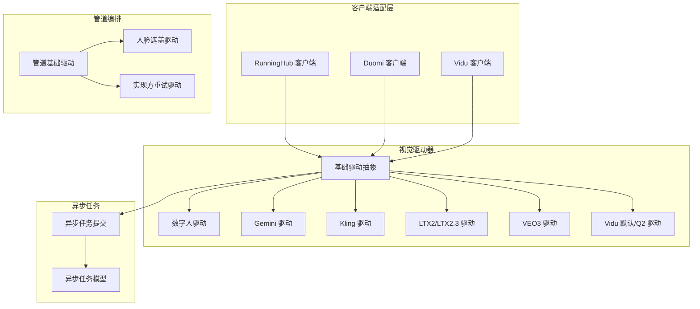
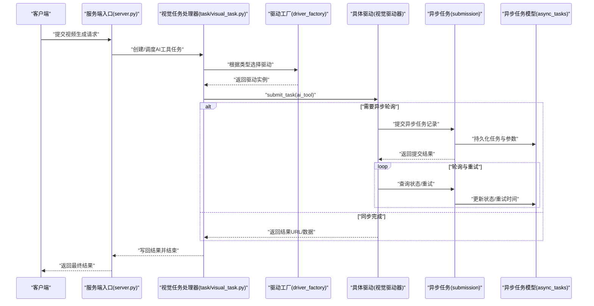
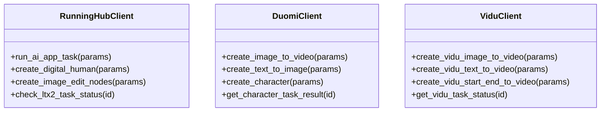
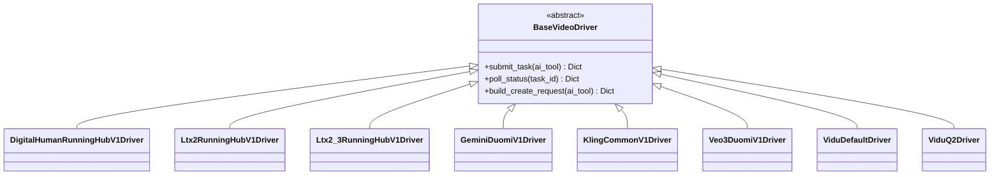
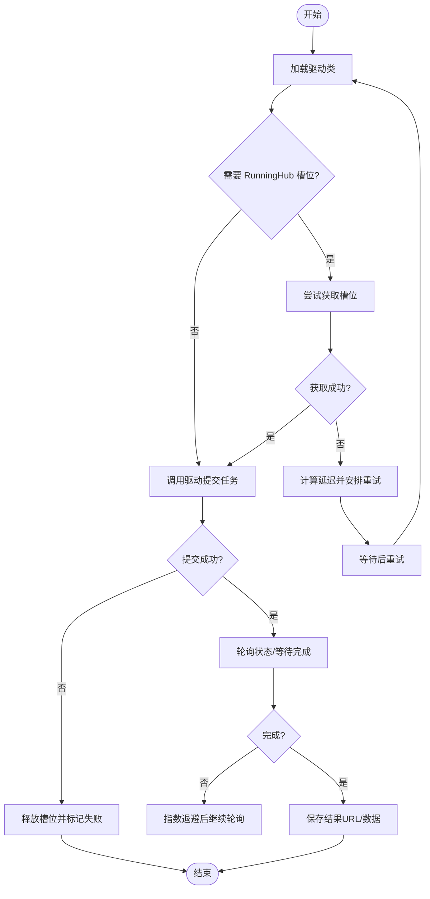
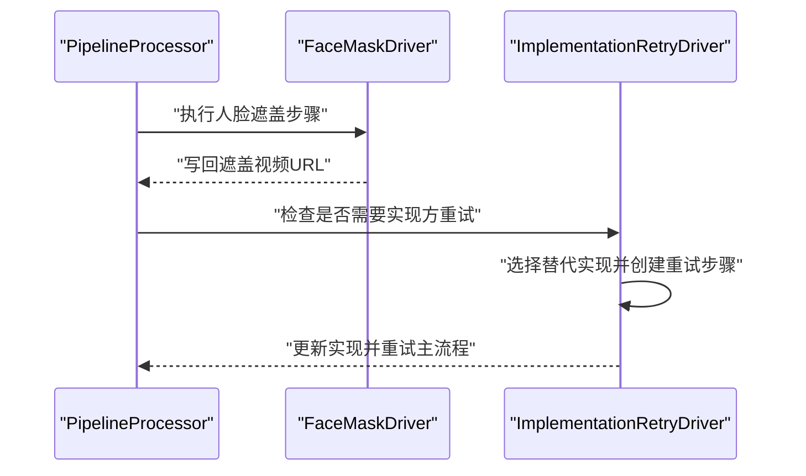
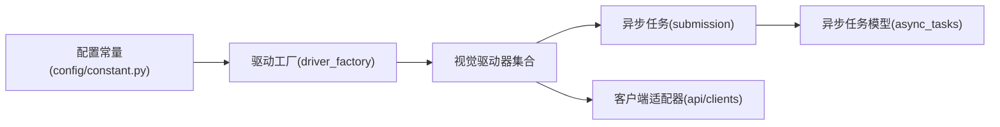

# 视频生成API集成

<cite>
**本文引用的文件**
- [api/clients/__init__.py](file://api/clients/__init__.py)
- [api/clients/duomi_client.py](file://api/clients/duomi_client.py)
- [api/clients/runninghub_client.py](file://api/clients/runninghub_client.py)
- [api/clients/vidu_client.py](file://api/clients/vidu_client.py)
- [task/visual_drivers/__init__.py](file://task/visual_drivers/__init__.py)
- [task/visual_drivers/base_video_driver.py](file://task/visual_drivers/base_video_driver.py)
- [task/visual_drivers/driver_factory.py](file://task/visual_drivers/driver_factory.py)
- [task/visual_drivers/digital_human_runninghub_v1_driver.py](file://task/visual_drivers/digital_human_runninghub_v1_driver.py)
- [task/visual_drivers/gemini_duomi_v1_driver.py](file://task/visual_drivers/gemini_duomi_v1_driver.py)
- [task/visual_drivers/kling_common_v1_driver.py](file://task/visual_drivers/kling_common_v1_driver.py)
- [task/visual_drivers/ltx2_runninghub_v1_driver.py](file://task/visual_drivers/ltx2_runninghub_v1_driver.py)
- [task/visual_drivers/ltx2_3_runninghub_v1_driver.py](file://task/visual_drivers/ltx2_3_runninghub_v1_driver.py)
- [task/visual_drivers/veo3_duomi_v1_driver.py](file://task/visual_drivers/veo3_duomi_v1_driver.py)
- [task/visual_drivers/vidu_default_driver.py](file://task/visual_drivers/vidu_default_driver.py)
- [task/visual_drivers/vidu_q2_driver.py](file://task/visual_drivers/vidu_q2_driver.py)
- [task/pipeline_drivers/base_pipeline_driver.py](file://task/pipeline_drivers/base_pipeline_driver.py)
- [task/pipeline_drivers/face_mask_driver.py](file://task/pipeline_drivers/face_mask_driver.py)
- [task/pipeline_drivers/implementation_retry_driver.py](file://task/pipeline_drivers/implementation_retry_driver.py)
- [task/async_drivers/base_async_driver.py](file://task/async_drivers/base_async_driver.py)
- [task/async_drivers/runninghub_audio_driver.py](file://task/async_drivers/runninghub_audio_driver.py)
- [task/async_drivers/runninghub_face_mask_driver.py](file://task/async_drivers/runninghub_face_mask_driver.py)
- [task/async_task_submission.py](file://task/async_task_submission.py)
- [task/visual_task.py](file://task/visual_task.py)
- [model/async_tasks.py](file://model/async_tasks.py)
- [config/constant.py](file://config/constant.py)
- [docs/backend/pipeline_steps.md](file://docs/backend/pipeline_steps.md)
- [tests/driver_integration/test_vidu_driver_with_db.py](file://tests/driver_integration/test_vidu_driver_with_db.py)
- [tests/driver_integration/test_vidu_q2_driver_with_db.py](file://tests/driver_integration/test_vidu_q2_driver_with_db.py)
- [tests/drivers/test_driver_factory.py](file://tests/drivers/test_driver_factory.py)
- [server.py](file://server.py)
</cite>

## 目录
1. [简介](#简介)
2. [项目结构](#项目结构)
3. [核心组件](#核心组件)
4. [架构总览](#架构总览)
5. [详细组件分析](#详细组件分析)
6. [依赖关系分析](#依赖关系分析)
7. [性能考虑](#性能考虑)
8. [故障排查指南](#故障排查指南)
9. [结论](#结论)
10. [附录](#附录)

## 简介
本文件面向视频生成API集成，系统化梳理统一适配器设计、视觉驱动器模式、异步任务驱动器、管道驱动器组合与重试机制，并给出参数配置、质量控制与成本优化策略，以及新服务集成的开发指南、测试验证与性能监控方案。

## 项目结构
视频生成能力围绕“客户端适配层 + 视觉驱动器 + 异步任务 + 管道编排”展开：
- 客户端适配层：封装 RunningHub、Duomi、Vidu 等第三方服务的API差异，暴露统一接口。
- 视觉驱动器：按服务与任务类型实现具体驱动，负责参数构建、提交与轮询。
- 异步任务：统一调度与重试，支持槽位管理与指数退避。
- 管道驱动器：组合执行、供应商重试与阶段化处理。

**图表来源**
- [api/clients/__init__.py:6-36](file://api/clients/__init__.py#L6-L36)
- [task/visual_drivers/__init__.py:1-20](file://task/visual_drivers/__init__.py#L1-L20)
- [task/async_task_submission.py:60-114](file://task/async_task_submission.py#L60-L114)
- [task/pipeline_drivers/base_pipeline_driver.py](file://task/pipeline_drivers/base_pipeline_driver.py)

**章节来源**
- [api/clients/__init__.py:1-36](file://api/clients/__init__.py#L1-L36)
- [task/visual_drivers/__init__.py:1-20](file://task/visual_drivers/__init__.py#L1-L20)

## 核心组件
- 客户端适配器
  - RunningHub：提供任务提交、状态查询、节点创建等能力，覆盖数字人、LTX2、LTX2.3、Wan22等场景。
  - Duomi：提供图像到视频、文本到视频、字符创建、任务状态查询等能力。
  - Vidu：提供图像到视频、文本到视频、起止帧到视频、任务状态查询等能力。
- 视觉驱动器
  - 统一抽象：定义驱动生命周期、参数构建、提交与轮询等接口。
  - 具体实现：按服务与任务类型细分，如 RunningHub 数字人、LTX2/LTX2.3、Duomi Gemini/Kling/VEO3、Vidu 默认/Q2 等。
- 异步任务驱动器
  - 统一提交、重试、槽位管理与指数退避；支持运行中任务的状态轮询与结果获取。
- 管道驱动器
  - 组合执行、阶段化处理、实现方重试与失败转移。

**章节来源**
- [api/clients/runninghub_client.py](file://api/clients/runninghub_client.py)
- [api/clients/duomi_client.py](file://api/clients/duomi_client.py)
- [api/clients/vidu_client.py](file://api/clients/vidu_client.py)
- [task/visual_drivers/base_video_driver.py](file://task/visual_drivers/base_video_driver.py)
- [task/visual_drivers/digital_human_runninghub_v1_driver.py](file://task/visual_drivers/digital_human_runninghub_v1_driver.py)
- [task/visual_drivers/ltx2_runninghub_v1_driver.py](file://task/visual_drivers/ltx2_runninghub_v1_driver.py)
- [task/visual_drivers/ltx2_3_runninghub_v1_driver.py](file://task/visual_drivers/ltx2_3_runninghub_v1_driver.py)
- [task/visual_drivers/gemini_duomi_v1_driver.py](file://task/visual_drivers/gemini_duomi_v1_driver.py)
- [task/visual_drivers/kling_common_v1_driver.py](file://task/visual_drivers/kling_common_v1_driver.py)
- [task/visual_drivers/veo3_duomi_v1_driver.py](file://task/visual_drivers/veo3_duomi_v1_driver.py)
- [task/visual_drivers/vidu_default_driver.py](file://task/visual_drivers/vidu_default_driver.py)
- [task/visual_drivers/vidu_q2_driver.py](file://task/visual_drivers/vidu_q2_driver.py)
- [task/async_drivers/base_async_driver.py](file://task/async_drivers/base_async_driver.py)
- [task/async_drivers/runninghub_face_mask_driver.py](file://task/async_drivers/runninghub_face_mask_driver.py)
- [task/async_drivers/runninghub_audio_driver.py](file://task/async_drivers/runninghub_audio_driver.py)
- [task/async_task_submission.py:60-114](file://task/async_task_submission.py#L60-L114)
- [task/pipeline_drivers/face_mask_driver.py](file://task/pipeline_drivers/face_mask_driver.py)
- [task/pipeline_drivers/implementation_retry_driver.py](file://task/pipeline_drivers/implementation_retry_driver.py)

## 架构总览
视频生成从HTTP入口进入，经由任务编排与驱动选择，统一委派至各服务客户端，再由对应驱动完成参数构建、提交与轮询，最终写回结果或触发管道后续步骤。

**图表来源**
- [server.py:1642-3733](file://server.py#L1642-L3733)
- [task/visual_task.py:245-274](file://task/visual_task.py#L245-L274)
- [task/visual_drivers/driver_factory.py](file://task/visual_drivers/driver_factory.py)
- [task/async_task_submission.py:60-114](file://task/async_task_submission.py#L60-L114)
- [model/async_tasks.py:64-96](file://model/async_tasks.py#L64-L96)

## 详细组件分析

### 客户端适配器设计
- RunningHub 客户端
  - 职责：封装任务提交、节点创建、状态查询、数字人/视频模型创建等。
  - 关键点：对不同模型（LTX2/LTX2.3/Wan22/数字人）提供统一调用入口，屏蔽底层差异。
- Duomi 客户端
  - 职责：图像到视频、文本到视频、字符创建、任务状态查询等。
  - 关键点：支持多模型与多站点聚合，便于实现方切换与重试。
- Vidu 客户端
  - 职责：图像/文本到视频、起止帧到视频、任务状态查询。
  - 关键点：提供默认与Q2两种模式，满足不同参考图策略。

**图表来源**
- [api/clients/runninghub_client.py](file://api/clients/runninghub_client.py)
- [api/clients/duomi_client.py](file://api/clients/duomi_client.py)
- [api/clients/vidu_client.py](file://api/clients/vidu_client.py)

**章节来源**
- [api/clients/runninghub_client.py](file://api/clients/runninghub_client.py)
- [api/clients/duomi_client.py](file://api/clients/duomi_client.py)
- [api/clients/vidu_client.py](file://api/clients/vidu_client.py)

### 视觉驱动器模式
- 统一抽象
  - 基类定义生命周期钩子、参数构建、提交与轮询等接口，确保不同服务实现的一致性。
- 实现与切换
  - 工厂根据任务类型与实现偏好选择具体驱动；同一任务类型可映射到多个实现，支持失败后切换。
- 切换机制
  - 通过配置与常量映射，将任务键映射到实现清单或单一实现，便于灰度与降级。

**图表来源**
- [task/visual_drivers/base_video_driver.py](file://task/visual_drivers/base_video_driver.py)
- [task/visual_drivers/digital_human_runninghub_v1_driver.py](file://task/visual_drivers/digital_human_runninghub_v1_driver.py)
- [task/visual_drivers/ltx2_runninghub_v1_driver.py](file://task/visual_drivers/ltx2_runninghub_v1_driver.py)
- [task/visual_drivers/ltx2_3_runninghub_v1_driver.py](file://task/visual_drivers/ltx2_3_runninghub_v1_driver.py)
- [task/visual_drivers/gemini_duomi_v1_driver.py](file://task/visual_drivers/gemini_duomi_v1_driver.py)
- [task/visual_drivers/kling_common_v1_driver.py](file://task/visual_drivers/kling_common_v1_driver.py)
- [task/visual_drivers/veo3_duomi_v1_driver.py](file://task/visual_drivers/veo3_duomi_v1_driver.py)
- [task/visual_drivers/vidu_default_driver.py](file://task/visual_drivers/vidu_default_driver.py)
- [task/visual_drivers/vidu_q2_driver.py](file://task/visual_drivers/vidu_q2_driver.py)

**章节来源**
- [task/visual_drivers/base_video_driver.py](file://task/visual_drivers/base_video_driver.py)
- [task/visual_drivers/driver_factory.py](file://task/visual_drivers/driver_factory.py)
- [config/constant.py:188-210](file://config/constant.py#L188-L210)

### 异步任务驱动器架构
- 任务提交
  - 根据实现类型动态加载驱动类，构造参数并调用 submit_task；若需要 RunningHub 槽位，先尝试获取，否则安排重试。
- 重试机制
  - 指数退避延迟（30s → 60s → 120s → 300s），避免雪崩；达到最大重试后标记失败。
- 状态轮询与结果获取
  - 通过异步任务模型持久化参数与状态，后台进程定期轮询并更新结果URL或数据。

**图表来源**
- [task/async_task_submission.py:60-114](file://task/async_task_submission.py#L60-L114)
- [model/async_tasks.py:64-96](file://model/async_tasks.py#L64-L96)

**章节来源**
- [task/async_task_submission.py:60-114](file://task/async_task_submission.py#L60-L114)
- [model/async_tasks.py:64-96](file://model/async_tasks.py#L64-L96)

### 管道驱动器组合与重试
- 组合模式
  - 管道驱动器按步骤顺序执行，支持前置参数准备、中间处理与完成后收尾。
- 供应商重试
  - 在 before_finish 阶段，若主任务失败且存在替代实现，自动切换供应商并重试，直至成功或穷尽替代实现。

**图表来源**
- [docs/backend/pipeline_steps.md:97-132](file://docs/backend/pipeline_steps.md#L97-L132)
- [task/pipeline_drivers/face_mask_driver.py](file://task/pipeline_drivers/face_mask_driver.py)
- [task/pipeline_drivers/implementation_retry_driver.py](file://task/pipeline_drivers/implementation_retry_driver.py)

**章节来源**
- [docs/backend/pipeline_steps.md:97-132](file://docs/backend/pipeline_steps.md#L97-L132)

### 参数配置、质量控制与成本优化
- 参数配置
  - 通过统一配置系统与动态配置函数注入，驱动按需构建请求参数，支持本地图片上传、参考图策略等。
- 质量控制
  - 通过驱动内部校验与状态轮询，确保输出符合预期；失败时触发实现方重试。
- 成本优化
  - 通过算力校验与批量任务控制，避免超支；异步任务的指数退避减少无效请求；槽位管理限制并发峰值。

**章节来源**
- [tests/driver_integration/test_vidu_driver_with_db.py:1-34](file://tests/driver_integration/test_vidu_driver_with_db.py#L1-L34)
- [tests/driver_integration/test_vidu_q2_driver_with_db.py:1-35](file://tests/driver_integration/test_vidu_q2_driver_with_db.py#L1-L35)
- [server.py:1642-3733](file://server.py#L1642-L3733)

## 依赖关系分析
- 低耦合高内聚
  - 驱动仅依赖抽象基类与配置接口，与具体服务解耦；客户端适配器封装第三方差异。
- 动态加载与工厂
  - 通过工厂与实现映射，实现运行时选择与切换，便于灰度与降级。
- 并发与资源
  - 异步任务与槽位管理共同保障并发安全与资源占用上限。

**图表来源**
- [config/constant.py:188-210](file://config/constant.py#L188-L210)
- [task/visual_drivers/driver_factory.py](file://task/visual_drivers/driver_factory.py)
- [task/async_task_submission.py:60-114](file://task/async_task_submission.py#L60-L114)
- [model/async_tasks.py:64-96](file://model/async_tasks.py#L64-L96)
- [api/clients/__init__.py:6-36](file://api/clients/__init__.py#L6-L36)

**章节来源**
- [config/constant.py:188-210](file://config/constant.py#L188-L210)
- [task/visual_drivers/driver_factory.py](file://task/visual_drivers/driver_factory.py)
- [task/async_task_submission.py:60-114](file://task/async_task_submission.py#L60-L114)
- [model/async_tasks.py:64-96](file://model/async_tasks.py#L64-L96)

## 性能考虑
- 指数退避与重试上限：避免频繁重试造成下游压力，同时保证失败恢复。
- 槽位并发控制：限制RunningHub任务并发，防止资源争用导致整体延迟上升。
- 本地图片上传：在本地环境自动上传至图床，减少跨域与网络抖动影响。
- 算力校验：在入口处进行算力校验，避免无效任务提交。

[本节为通用指导，无需列出章节来源]

## 故障排查指南
- 提交失败
  - 检查实现映射与驱动类加载；确认参数签名与必填字段；查看错误类型与详情。
- 槽位满
  - 查看异步任务重试调度日志；确认退避延迟是否合理；必要时调整并发阈值。
- 状态轮询异常
  - 核对异步任务模型状态更新；检查轮询间隔与超时设置；关注过期任务清理。
- 管道重试未生效
  - 确认实现方重试驱动是否启用；检查替代实现清单与可用性。

**章节来源**
- [task/async_task_submission.py:60-114](file://task/async_task_submission.py#L60-L114)
- [task/visual_task.py:245-274](file://task/visual_task.py#L245-L274)
- [docs/backend/pipeline_steps.md:97-132](file://docs/backend/pipeline_steps.md#L97-L132)

## 结论
该视频生成API集成以“客户端适配器 + 视觉驱动器 + 异步任务 + 管道编排”为核心，实现了多服务统一接入、灵活切换与稳健运行。通过参数化配置、质量控制与成本优化策略，可在保证稳定性的同时提升吞吐与性价比。

## 附录

### 新视频服务集成开发指南
- 驱动开发
  - 继承基础驱动抽象，实现参数构建、提交与轮询方法；在工厂中注册并映射到任务键。
- 客户端适配
  - 在客户端模块新增服务适配器，提供统一的请求与响应封装。
- 测试验证
  - 编写单元测试与数据库集成测试，覆盖初始化、参数构建、提交与轮询流程。
- 性能监控
  - 记录提交耗时、轮询次数、重试延迟与成功率；结合日志与指标进行观测。

**章节来源**
- [task/visual_drivers/base_video_driver.py](file://task/visual_drivers/base_video_driver.py)
- [task/visual_drivers/driver_factory.py](file://task/visual_drivers/driver_factory.py)
- [tests/driver_integration/test_vidu_driver_with_db.py:1-34](file://tests/driver_integration/test_vidu_driver_with_db.py#L1-L34)
- [tests/driver_integration/test_vidu_q2_driver_with_db.py:1-35](file://tests/driver_integration/test_vidu_q2_driver_with_db.py#L1-L35)
- [tests/drivers/test_driver_factory.py](file://tests/drivers/test_driver_factory.py)