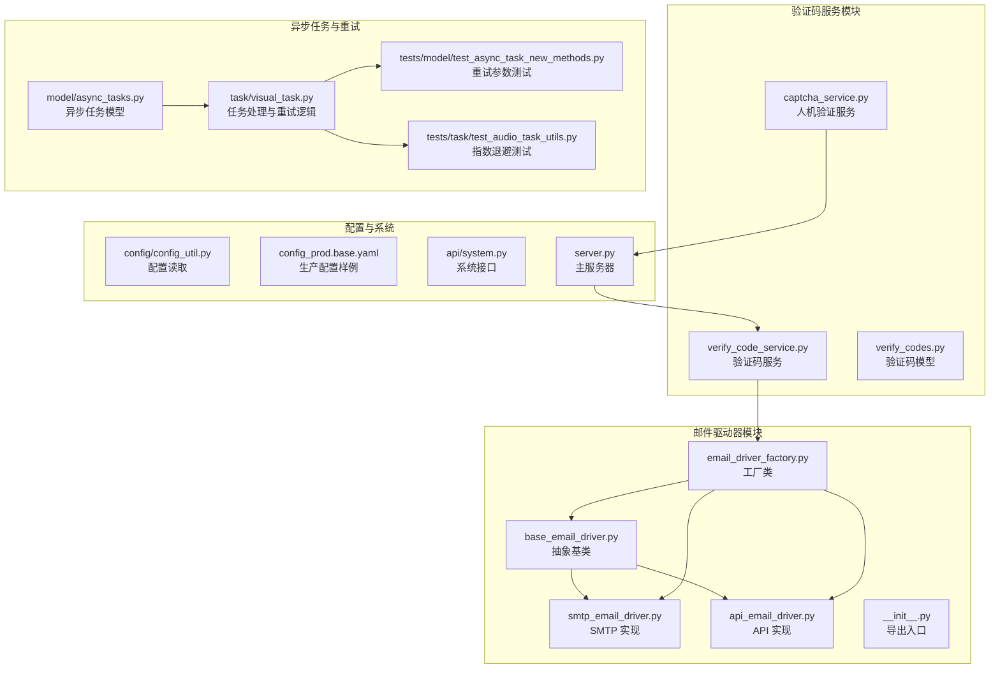
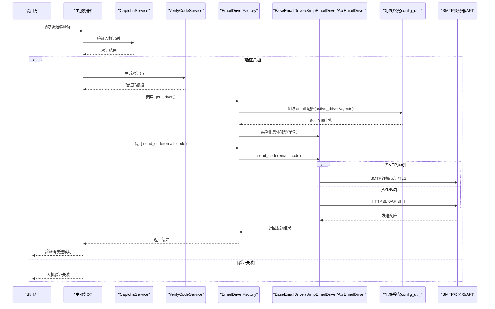
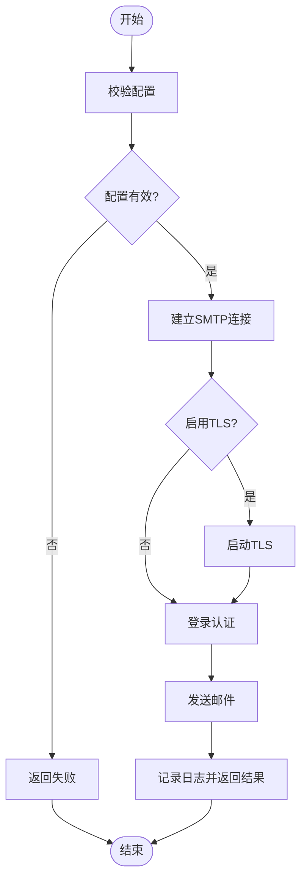
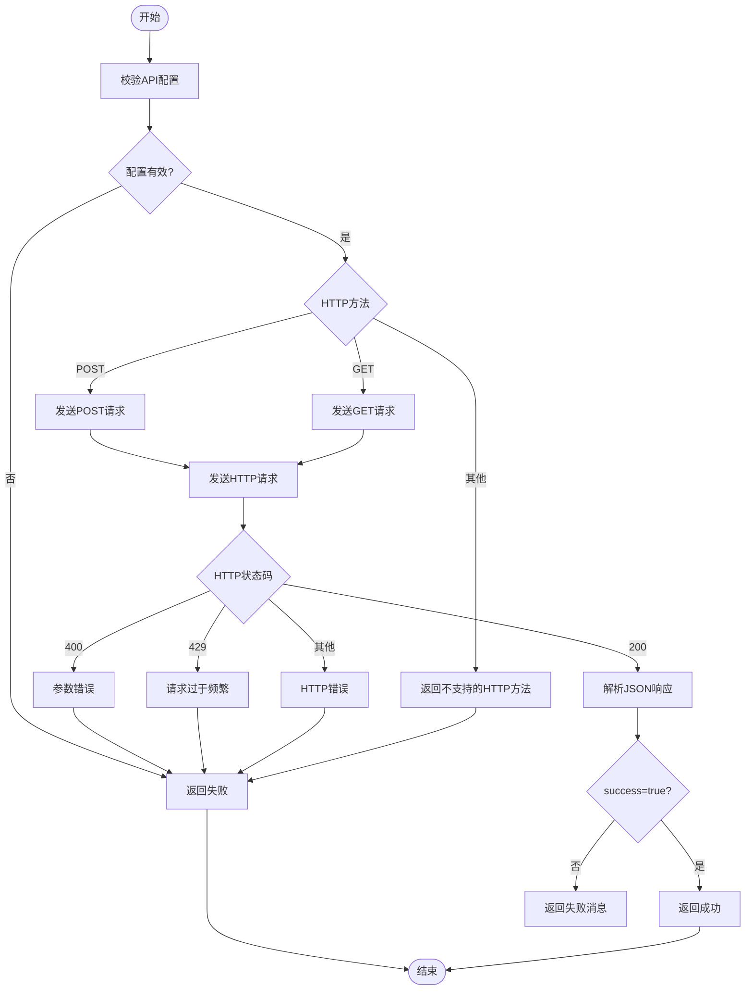
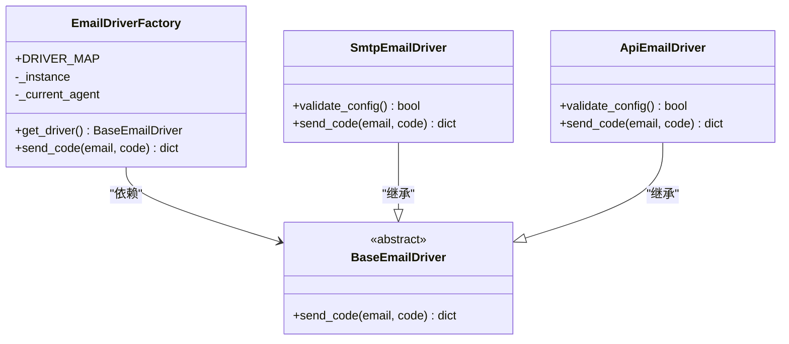
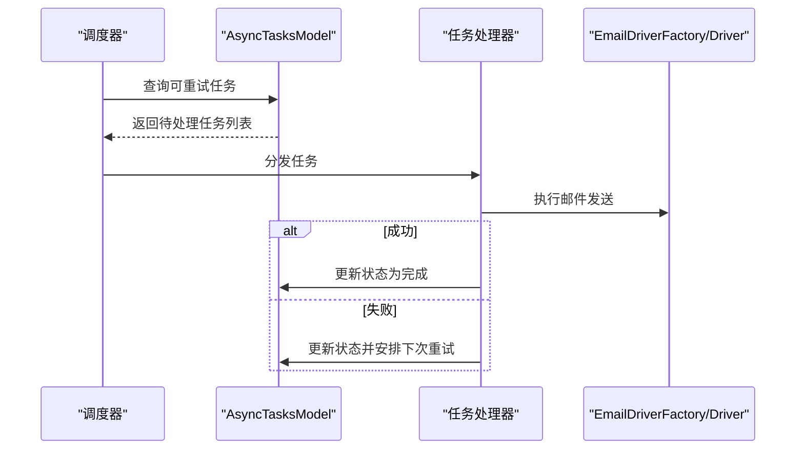
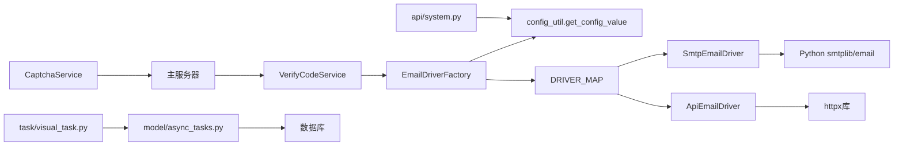

# 邮件服务集成

<cite>
**本文引用的文件**
- [perseids_server/utils/email_drivers/base_email_driver.py](file://perseids_server/utils/email_drivers/base_email_driver.py)
- [perseids_server/utils/email_drivers/smtp_email_driver.py](file://perseids_server/utils/email_drivers/smtp_email_driver.py)
- [perseids_server/utils/email_drivers/api_email_driver.py](file://perseids_server/utils/email_drivers/api_email_driver.py)
- [perseids_server/utils/email_drivers/email_driver_factory.py](file://perseids_server/utils/email_drivers/email_driver_factory.py)
- [perseids_server/utils/email_drivers/__init__.py](file://perseids_server/utils/email_drivers/__init__.py)
- [perseids_server/services/captcha_service.py](file://perseids_server/services/captcha_service.py)
- [perseids_server/services/verify_code_service.py](file://perseids_server/services/verify_code_service.py)
- [config/config_util.py](file://config/config_util.py)
- [config_prod.base.yaml](file://config_prod.base.yaml)
- [api/system.py](file://api/system.py)
- [model/async_tasks.py](file://model/async_tasks.py)
- [task/visual_task.py](file://task/visual_task.py)
- [tests/model/test_async_task_new_methods.py](file://tests/model/test_async_task_new_methods.py)
- [tests/task/test_audio_task_utils.py](file://tests/task/test_audio_task_utils.py)
- [server.py](file://server.py)
</cite>

## 更新摘要
**所做更改**
- 新增API邮件驱动实现，支持HTTP API方式发送邮件
- 扩展邮件驱动器工厂，支持SMTP和API两种驱动类型
- 新增验证码服务和人机验证服务集成
- 增强双模式认证支持（手机号/邮箱）
- 更新架构图以反映新的驱动器类型和验证流程

## 目录
1. [简介](#简介)
2. [项目结构](#项目结构)
3. [核心组件](#核心组件)
4. [架构总览](#架构总览)
5. [详细组件分析](#详细组件分析)
6. [依赖关系分析](#依赖关系分析)
7. [性能考量](#性能考量)
8. [故障排查指南](#故障排查指南)
9. [结论](#结论)
10. [附录](#附录)

## 简介
本文件面向"邮件服务集成"的目标，系统化梳理并解释当前代码库中的完整邮件认证系统架构与实现，重点覆盖：
- 基于抽象基类的统一邮件发送接口设计
- SMTP邮件驱动的配置、认证与TLS加密传输
- **新增** HTTP API邮件驱动，支持远程邮件服务集成
- 邮件驱动器工厂的创建与动态选择机制
- **新增** 验证码服务和人机验证服务集成
- **新增** 双模式认证支持（手机号/邮箱）
- 邮件模板管理、变量替换与HTML支持（概念性说明）
- 邮件发送队列、重试机制与失败处理策略
- 新邮件服务商集成的开发指南、配置示例与测试验证方法
- 邮件送达确认、退信处理与反垃圾邮件策略（概念性说明）

## 项目结构
邮件服务相关代码集中在perseids_server/utils/email_drivers目录，采用"驱动器 + 工厂 + 配置"的分层组织方式，并通过配置中心进行运行时装配。新增的验证码服务和人机验证服务位于perseids_server/services目录。



**图表来源**
- [perseids_server/utils/email_drivers/base_email_driver.py](file://perseids_server/utils/email_drivers/base_email_driver.py)
- [perseids_server/utils/email_drivers/smtp_email_driver.py](file://perseids_server/utils/email_drivers/smtp_email_driver.py)
- [perseids_server/utils/email_drivers/api_email_driver.py](file://perseids_server/utils/email_drivers/api_email_driver.py)
- [perseids_server/utils/email_drivers/email_driver_factory.py](file://perseids_server/utils/email_drivers/email_driver_factory.py)
- [perseids_server/services/verify_code_service.py](file://perseids_server/services/verify_code_service.py)
- [perseids_server/services/captcha_service.py](file://perseids_server/services/captcha_service.py)
- [config/config_util.py](file://config/config_util.py)
- [config_prod.base.yaml](file://config_prod.base.yaml)
- [api/system.py](file://api/system.py)
- [server.py](file://server.py)
- [model/async_tasks.py](file://model/async_tasks.py)
- [task/visual_task.py](file://task/visual_task.py)

**章节来源**
- [perseids_server/utils/email_drivers/__init__.py](file://perseids_server/utils/email_drivers/__init__.py)
- [perseids_server/utils/email_drivers/email_driver_factory.py](file://perseids_server/utils/email_drivers/email_driver_factory.py)
- [perseids_server/services/verify_code_service.py](file://perseids_server/services/verify_code_service.py)
- [perseids_server/services/captcha_service.py](file://perseids_server/services/captcha_service.py)
- [config/config_util.py](file://config/config_util.py)

## 核心组件
- 抽象基类BaseEmailDriver：定义统一的邮件发送接口契约，确保不同驱动器具备一致的行为语义。
- SMTP驱动SmtpEmailDriver：实现SMTP协议的邮件发送，负责配置校验、连接建立、认证与TLS加密传输。
- **新增** API驱动ApiEmailDriver：通过HTTP API发送邮件，支持远程邮件服务集成，无需本地SMTP配置。
- 邮件驱动器工厂EmailDriverFactory：根据配置动态选择并创建具体驱动实例，支持SMTP和API两种驱动类型，支持单例模式与便捷方法（如验证码发送）。
- **新增** 验证码服务VerifyCodeService：提供验证码生成、存储和验证功能，支持多种验证码类型。
- **新增** 人机验证服务CaptchaService：集成CAPTCHA验证，防止自动化攻击和滥用。
- 配置系统：通过配置工具读取email配置段，结合agents与active_driver进行驱动选择。
- 异步任务与重试：异步任务模型与任务处理器提供队列、重试与失败处理能力，可与邮件发送流程结合。

**章节来源**
- [perseids_server/utils/email_drivers/base_email_driver.py](file://perseids_server/utils/email_drivers/base_email_driver.py)
- [perseids_server/utils/email_drivers/smtp_email_driver.py](file://perseids_server/utils/email_drivers/smtp_email_driver.py)
- [perseids_server/utils/email_drivers/api_email_driver.py](file://perseids_server/utils/email_drivers/api_email_driver.py)
- [perseids_server/utils/email_drivers/email_driver_factory.py](file://perseids_server/utils/email_drivers/email_driver_factory.py)
- [perseids_server/services/verify_code_service.py](file://perseids_server/services/verify_code_service.py)
- [perseids_server/services/captcha_service.py](file://perseids_server/services/captcha_service.py)
- [config/config_util.py](file://config/config_util.py)

## 架构总览
下图展示邮件服务从配置到发送的整体交互流程，以及与验证码服务和人机验证服务的集成。



**图表来源**
- [server.py](file://server.py)
- [perseids_server/services/captcha_service.py](file://perseids_server/services/captcha_service.py)
- [perseids_server/services/verify_code_service.py](file://perseids_server/services/verify_code_service.py)
- [perseids_server/utils/email_drivers/email_driver_factory.py](file://perseids_server/utils/email_drivers/email_driver_factory.py)
- [perseids_server/utils/email_drivers/smtp_email_driver.py](file://perseids_server/utils/email_drivers/smtp_email_driver.py)
- [perseids_server/utils/email_drivers/api_email_driver.py](file://perseids_server/utils/email_drivers/api_email_driver.py)
- [config/config_util.py](file://config/config_util.py)

## 详细组件分析

### 抽象基类BaseEmailDriver
- 设计要点
  - 定义统一的邮件发送接口契约，确保所有具体驱动器具备一致的方法签名与行为预期。
  - 将通用的配置注入与初始化逻辑下沉至基类，减少重复代码。
- 关键职责
  - 接收并保存驱动配置
  - 提供子类必须实现的抽象方法（例如send_code），以保证扩展一致性

**章节来源**
- [perseids_server/utils/email_drivers/base_email_driver.py](file://perseids_server/utils/email_drivers/base_email_driver.py)

### SMTP驱动SmtpEmailDriver
- 配置项
  - smtp_host：SMTP服务器地址
  - smtp_port：SMTP服务器端口（默认587）
  - smtp_user：SMTP用户名
  - smtp_password：SMTP密码
  - smtp_from：发件人邮箱
  - use_tls：是否启用TLS（默认开启）
  - smtp_from_name：发件人名称（可选）
- 核心流程
  - 配置校验：validate_config确保必要字段齐全
  - 连接与认证：根据use_tls决定是否启用TLS；随后执行登录
  - 发送邮件：构造邮件内容并调用sendmail
  - 错误处理：捕获SMTP认证错误与异常，返回结构化结果
- 安全与可靠性
  - 默认启用TLS，降低明文传输风险
  - 对常见SMTP异常进行分类处理，便于定位问题



**图表来源**
- [perseids_server/utils/email_drivers/smtp_email_driver.py](file://perseids_server/utils/email_drivers/smtp_email_driver.py)

**章节来源**
- [perseids_server/utils/email_drivers/smtp_email_driver.py](file://perseids_server/utils/email_drivers/smtp_email_driver.py)

### API驱动ApiEmailDriver
- **新增** 配置项
  - api_url：邮件API接口地址（必需）
  - method：HTTP请求方法（可选，默认POST）
  - verify_ssl：是否验证SSL证书（可选，默认True）
- **新增** 核心流程
  - 配置校验：validate_config确保api_url存在
  - HTTP请求：根据method参数发送HTTP请求
  - 响应处理：解析JSON响应，支持成功、参数错误和限流等状态码
  - 错误处理：处理HTTP异常、响应格式错误和业务逻辑错误
- **新增** 安全与可靠性
  - 支持SSL证书验证
  - 处理429限流状态码
  - 统一的响应格式处理



**图表来源**
- [perseids_server/utils/email_drivers/api_email_driver.py](file://perseids_server/utils/email_drivers/api_email_driver.py)

**章节来源**
- [perseids_server/utils/email_drivers/api_email_driver.py](file://perseids_server/utils/email_drivers/api_email_driver.py)

### 邮件驱动器工厂EmailDriverFactory
- **更新** 动态选择机制
  - 从配置中心读取email.active_driver与email.agents
  - 遍历agents，匹配driver字段与active_driver一致的agent
  - 依据DRIVER_MAP映射获取具体驱动类（支持'smtp'和'api'）
- **更新** 驱动类型映射
  - 'smtp' → SmtpEmailDriver
  - 'api' → ApiEmailDriver
- 单例模式
  - 缓存已创建的驱动实例，避免重复初始化
- 便捷方法
  - send_code：快速发送验证码邮件，内部委托给具体驱动



**图表来源**
- [perseids_server/utils/email_drivers/email_driver_factory.py](file://perseids_server/utils/email_drivers/email_driver_factory.py)
- [perseids_server/utils/email_drivers/base_email_driver.py](file://perseids_server/utils/email_drivers/base_email_driver.py)
- [perseids_server/utils/email_drivers/smtp_email_driver.py](file://perseids_server/utils/email_drivers/smtp_email_driver.py)
- [perseids_server/utils/email_drivers/api_email_driver.py](file://perseids_server/utils/email_drivers/api_email_driver.py)

**章节来源**
- [perseids_server/utils/email_drivers/email_driver_factory.py](file://perseids_server/utils/email_drivers/email_driver_factory.py)

### 验证码服务VerifyCodeService
- **新增** 功能特性
  - 验证码生成：支持数字验证码和字母数字混合验证码
  - 存储管理：将验证码与用户信息关联存储
  - 时间控制：验证码有效期管理和过期处理
  - 频率限制：防止暴力破解和滥用
- **新增** 集成方式
  - 与邮件驱动器工厂集成，通过send_code方法发送验证码
  - 支持多种验证码类型（登录、注册、重置密码等）

**章节来源**
- [perseids_server/services/verify_code_service.py](file://perseids_server/services/verify_code_service.py)

### 人机验证服务CaptchaService
- **新增** 功能特性
  - CAPTCHA生成：支持多种类型的验证码图片
  - 验证逻辑：验证用户输入的验证码是否正确
  - 安全防护：防止自动化脚本和机器人攻击
  - 频率控制：限制验证尝试次数
- **新增** 集成方式
  - 在主服务器中集成CAPTCHA验证流程
  - 保护验证码发送接口免受滥用

**章节来源**
- [perseids_server/services/captcha_service.py](file://perseids_server/services/captcha_service.py)

### 配置系统与系统接口
- 配置读取
  - 通过配置工具读取email配置段，包含active_driver与agents列表
- **更新** 配置结构
  - 支持两种驱动类型：'smtp'和'api'
  - SMTP配置：smtp_host、smtp_port、smtp_user、smtp_password等
  - API配置：api_url、method、verify_ssl等
- 生产配置样例
  - 在生产配置文件中提供email段落的参考结构
- 系统接口
  - 系统接口层可读取email.enabled等开关，用于控制邮件功能的启用

**章节来源**
- [config/config_util.py](file://config/config_util.py)
- [config_prod.base.yaml](file://config_prod.base.yaml)
- [api/system.py](file://api/system.py)

### 异步任务与重试机制
- 异步任务模型
  - 提供查询"可重试任务"与更新任务状态的能力，支持错误信息与结果数据的持久化
- 任务处理与重试
  - 任务处理器对队列中的任务进行循环处理，内置重试逻辑与并发控制
  - 测试用例验证了默认最大重试次数、自定义重试次数、指数退避延迟等行为



**图表来源**
- [model/async_tasks.py](file://model/async_tasks.py)
- [task/visual_task.py](file://task/visual_task.py)
- [tests/model/test_async_task_new_methods.py](file://tests/model/test_async_task_new_methods.py)
- [tests/task/test_audio_task_utils.py](file://tests/task/test_audio_task_utils.py)

**章节来源**
- [model/async_tasks.py](file://model/async_tasks.py)
- [task/visual_task.py](file://task/visual_task.py)
- [tests/model/test_async_task_new_methods.py](file://tests/model/test_async_task_new_methods.py)
- [tests/task/test_audio_task_utils.py](file://tests/task/test_audio_task_utils.py)

## 依赖关系分析
- 组件耦合
  - EmailDriverFactory依赖配置工具与具体驱动类映射
  - SMTP驱动依赖Python标准库的smtplib与email模块
  - **新增** API驱动依赖httpx库进行HTTP请求
  - **新增** 验证码服务依赖邮件驱动器工厂
  - **新增** 人机验证服务依赖主服务器接口
  - 系统接口依赖配置工具读取email开关
- 外部依赖
  - SMTP服务器：需满足认证与TLS要求
  - **新增** HTTP API服务：需支持RESTful接口规范
  - **新增** 验证码存储：需支持快速查询和过期清理
  - 数据库：异步任务模型依赖数据库存储任务状态与重试信息



**图表来源**
- [perseids_server/utils/email_drivers/email_driver_factory.py](file://perseids_server/utils/email_drivers/email_driver_factory.py)
- [config/config_util.py](file://config/config_util.py)
- [perseids_server/utils/email_drivers/smtp_email_driver.py](file://perseids_server/utils/email_drivers/smtp_email_driver.py)
- [perseids_server/utils/email_drivers/api_email_driver.py](file://perseids_server/utils/email_drivers/api_email_driver.py)
- [perseids_server/services/verify_code_service.py](file://perseids_server/services/verify_code_service.py)
- [perseids_server/services/captcha_service.py](file://perseids_server/services/captcha_service.py)
- [api/system.py](file://api/system.py)
- [model/async_tasks.py](file://model/async_tasks.py)
- [task/visual_task.py](file://task/visual_task.py)

**章节来源**
- [perseids_server/utils/email_drivers/email_driver_factory.py](file://perseids_server/utils/email_drivers/email_driver_factory.py)
- [perseids_server/utils/email_drivers/smtp_email_driver.py](file://perseids_server/utils/email_drivers/smtp_email_driver.py)
- [perseids_server/utils/email_drivers/api_email_driver.py](file://perseids_server/utils/email_drivers/api_email_driver.py)
- [config/config_util.py](file://config/config_util.py)
- [api/system.py](file://api/system.py)
- [model/async_tasks.py](file://model/async_tasks.py)
- [task/visual_task.py](file://task/visual_task.py)

## 性能考量
- 连接复用与超时
  - SMTP连接建议在单次发送中复用，避免频繁握手开销
  - **新增** API驱动建议使用连接池，提高HTTP请求效率
  - 合理设置连接与命令超时，防止阻塞影响整体吞吐
- TLS开销
  - 启用TLS会增加握手与加解密成本，建议在高并发场景评估硬件加速
- **新增** HTTP请求优化
  - API驱动使用keep-alive连接，减少TCP握手开销
  - 合理设置请求超时和重试策略
- 重试策略
  - 指数退避与上限控制可缓解瞬时故障，但需避免雪崩效应
  - 适当引入抖动，分散重试高峰
- **新增** 验证码服务性能
  - 使用内存缓存存储近期验证码，减少数据库查询
  - 定期清理过期验证码，控制内存使用

## 故障排查指南
- 配置问题
  - 确认email.active_driver与email.agents中的driver字段匹配
  - **新增** 检查驱动类型是否在DRIVER_MAP中注册
  - 检查SMTP主机、端口、用户名、密码与发件人邮箱是否正确
  - **新增** 检查API驱动的api_url和HTTP方法配置
- 认证失败
  - 核对用户名与密码；部分服务商需使用应用专用密码或OAuth
  - **新增** API驱动检查API密钥和认证头配置
- TLS与证书
  - 若出现证书错误，检查服务器证书链与客户端信任库
  - **新增** API驱动检查SSL证书验证设置
- **新增** HTTP请求问题
  - 检查API响应格式是否符合预期
  - 验证HTTP状态码处理逻辑
  - 检查网络连通性和防火墙设置
- 日志与返回值
  - 关注驱动返回的结构化消息，区分认证错误与网络异常
  - **新增** API驱动关注HTTP状态码和响应内容
- 异步重试
  - 检查任务状态与重试时间点，确认数据库查询条件与索引
- **新增** 验证码服务问题
  - 检查验证码生成算法和存储机制
  - 验证验证码过期时间和清理逻辑
  - 确认验证码发送流程的完整性

**章节来源**
- [perseids_server/utils/email_drivers/smtp_email_driver.py](file://perseids_server/utils/email_drivers/smtp_email_driver.py)
- [perseids_server/utils/email_drivers/api_email_driver.py](file://perseids_server/utils/email_drivers/api_email_driver.py)
- [perseids_server/utils/email_drivers/email_driver_factory.py](file://perseids_server/utils/email_drivers/email_driver_factory.py)
- [perseids_server/services/verify_code_service.py](file://perseids_server/services/verify_code_service.py)
- [model/async_tasks.py](file://model/async_tasks.py)

## 结论
当前邮件服务集成以"抽象基类 + 具体驱动 + 工厂 + 配置"的架构实现了可扩展、可维护的邮件发送能力。**新增的API驱动**为远程邮件服务集成提供了灵活的解决方案，**增强的验证码服务**和**人机验证服务**构建了完整的双模式认证体系。SMTP驱动提供了基础的配置校验、认证与TLS加密；工厂负责运行时装配与单例缓存；异步任务体系为邮件发送提供了队列与重试保障。后续可在模板管理、送达确认、退信处理与反垃圾策略方面进一步完善，以满足更复杂的业务需求。

## 附录

### 邮件模板管理、变量替换与HTML支持（概念性说明）
- 模板管理
  - 建议将邮件正文与主题分离为模板文件，支持多语言与主题切换
- 变量替换
  - 使用占位符与字典映射进行变量注入，注意转义与安全过滤
- HTML支持
  - 提供纯文本与HTML双版本，优先使用HTML并保留纯文本备选

### 新邮件服务商集成指南
- **更新** 步骤
  - 新建驱动类继承BaseEmailDriver，实现send_code等方法
  - 在工厂的DRIVER_MAP中注册新驱动类型
  - 在配置文件中新增对应agent，并设置driver与必要参数
  - 编写单元测试与集成测试，验证发送、重试与错误分支
- **新增** 配置示例（SMTP）
  ```yaml
  email:
    active_driver: smtp
    agents:
      - name: smtp_agent
        driver: smtp
        smtp_host: smtp.gmail.com
        smtp_port: 587
        smtp_user: your_email@gmail.com
        smtp_password: your_app_password
        smtp_from: noreply@yourapp.com
        use_tls: true
  ```
- **新增** 配置示例（API）
  ```yaml
  email:
    active_driver: api
    agents:
      - name: api_agent
        driver: api
        api_url: https://api.emailservice.com/send
        method: POST
        verify_ssl: true
  ```
- 测试验证
  - 使用工厂的send_code快捷方法进行端到端验证
  - 结合异步任务模型验证重试与失败恢复

### 邮件送达确认、退信处理与反垃圾邮件策略（概念性说明）
- 送达确认
  - 通过回执地址与投递通知实现基本确认；复杂场景可借助第三方服务
- 退信处理
  - 监听退信邮箱或使用第三方退信回调，解析退信原因并更新用户状态
- 反垃圾邮件
  - 规范发件人域名与SPF/DKIM/DMARC；限制发送频率与内容敏感词；提供退订链接

### 双模式认证集成指南
- **新增** 集成步骤
  - 在主服务器中集成CaptchaService的人机验证
  - 使用VerifyCodeService生成和验证验证码
  - 通过EmailDriverFactory发送邮件验证码
  - 支持手机号和邮箱两种认证方式
- **新增** 配置示例
  ```yaml
  captcha:
    enabled: true
    type: image
    width: 120
    height: 40
  
  email:
    enabled: true
    active_driver: smtp
    agents:
      - name: default_smtp
        driver: smtp
        smtp_host: smtp.gmail.com
        smtp_port: 587
        smtp_user: your_email@gmail.com
        smtp_password: your_app_password
  ```
- **新增** 测试验证
  - 验证CAPTCHA生成和验证流程
  - 测试验证码生成、存储和验证
  - 确认邮件发送和接收功能正常