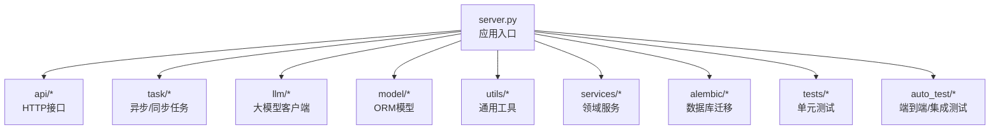
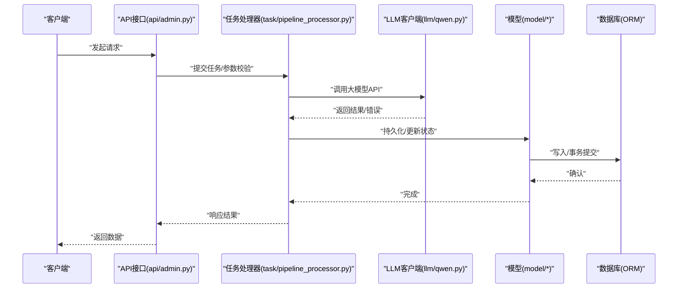
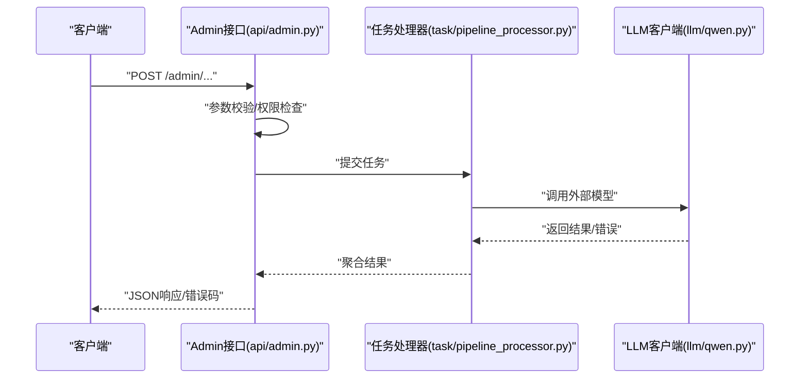
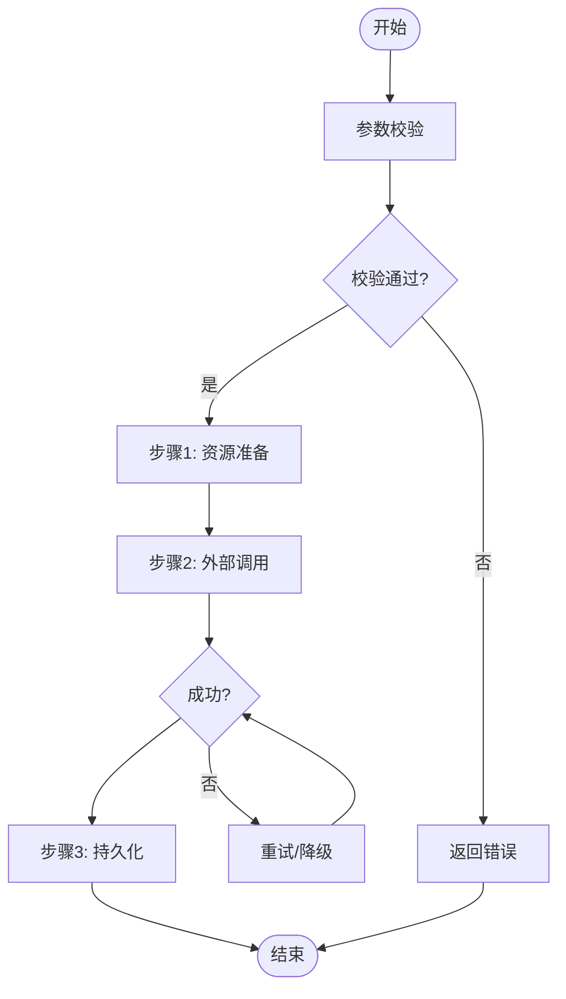
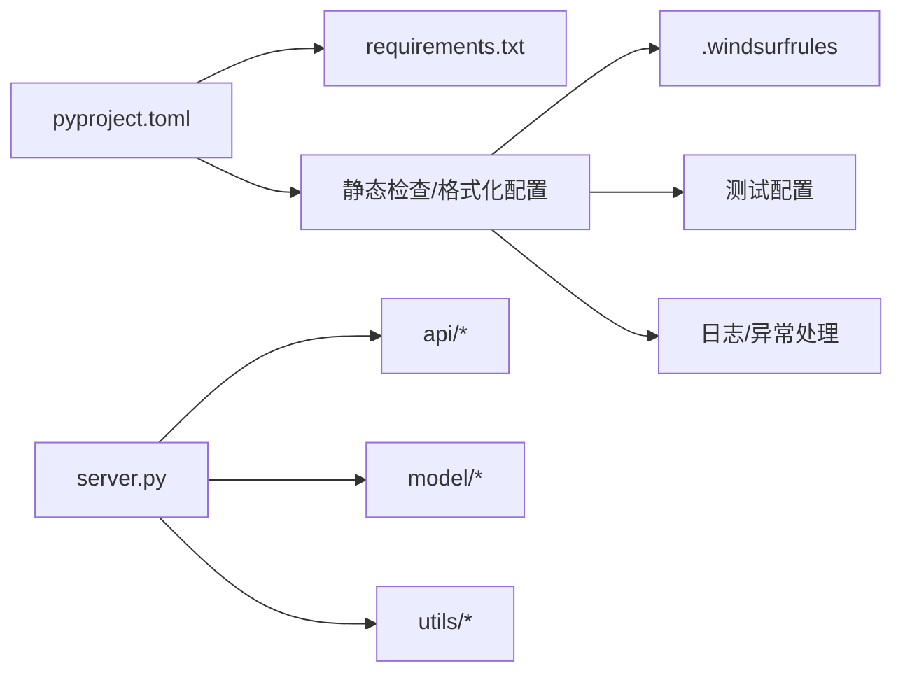

# 代码规范与最佳实践

<cite>
**本文引用的文件**
- [server.py](file://server.py)
- [pyproject.toml](file://pyproject.toml)
- [requirements.txt](file://requirements.txt)
- [README_EN.md](file://README_EN.md)
- [perseids_server/utils/email_drivers/base_email_driver.py](file://perseids_server/utils/email_drivers/base_email_driver.py)
- [.windsurfrules](file://.windsurfrules)
- [script_writer_core/constant.py](file://script_writer_core/constant.py)
- [model/system_config.py](file://model/system_config.py)
- [utils/computing_power.py](file://utils/computing_power.py)
- [task/pipeline_processor.py](file://task/pipeline_processor.py)
- [api/admin.py](file://api/admin.py)
- [llm/qwen.py](file://llm/qwen.py)
- [config/constant.py](file://config/constant.py)
- [alembic/env.py](file://alembic/env.py)
- [tests/test_db_connection.py](file://tests/test_db_connection.py)
- [auto_test/setup_test_env.py](file://auto_test/setup_test_env.py)
- [scripts/testing/run_unit_tests.py](file://scripts/testing/run_unit_tests.py)
</cite>

## 目录
1. [引言](#引言)
2. [项目结构](#项目结构)
3. [核心组件](#核心组件)
4. [架构总览](#架构总览)
5. [详细组件分析](#详细组件分析)
6. [依赖分析](#依赖分析)
7. [性能考虑](#性能考虑)
8. [故障排查指南](#故障排查指南)
9. [结论](#结论)
10. [附录](#附录)

## 引言
本文件面向ZhiJuTong后端团队，提供一套统一的Python代码规范与最佳实践，覆盖PEP8与项目特定约定、命名与格式、模块组织、注释与文档、代码审查清单、IDE配置与自动格式化工具等。目标是提升代码一致性、可读性、可维护性与安全性，并降低协作成本。

## 项目结构
项目采用分层+功能域混合的组织方式：
- 核心入口：server.py
- 配置与常量：config/、model/constant.py、script_writer_core/constant.py
- 业务域：api/、llm/、model/、task/、services/、utils/
- 迁移与数据库：alembic/
- 测试与自动化测试：tests/、auto_test/、scripts/testing/
- 文档与脚本：docs/、scripts/、files/、templates/



图表来源
- [server.py](file://server.py)
- [api/admin.py](file://api/admin.py)
- [task/pipeline_processor.py](file://task/pipeline_processor.py)
- [llm/qwen.py](file://llm/qwen.py)
- [model/system_config.py](file://model/system_config.py)
- [utils/computing_power.py](file://utils/computing_power.py)
- [services/__init__.py](file://services/__init__.py)
- [alembic/env.py](file://alembic/env.py)
- [tests/test_db_connection.py](file://tests/test_db_connection.py)
- [auto_test/setup_test_env.py](file://auto_test/setup_test_env.py)

章节来源
- [server.py](file://server.py)
- [README_EN.md](file://README_EN.md)

## 核心组件
- 应用入口与路由：server.py负责初始化应用、注册蓝图与中间件，确保全局异常处理与日志配置一致。
- 配置与常量：config/constant.py与script_writer_core/constant.py集中定义系统常量与默认值，避免魔法数与硬编码。
- 数据库与迁移：alembic/env.py提供迁移上下文，版本化迁移文件按时间戳有序增长，确保演进可追踪。
- LLM客户端：llm/qwen.py等模块封装不同供应商的API调用，统一返回结构与错误处理。
- 任务编排：task/pipeline_processor.py协调多阶段任务执行，保证幂等与重试策略。
- 工具与服务：utils/computing_power.py等提供跨领域复用能力；services/*提供业务服务层。
- 测试体系：tests/与auto_test/分别覆盖单元测试与端到端测试，配合scripts/testing/run_unit_tests.py进行批量执行。

章节来源
- [server.py](file://server.py)
- [config/constant.py](file://config/constant.py)
- [script_writer_core/constant.py](file://script_writer_core/constant.py)
- [alembic/env.py](file://alembic/env.py)
- [llm/qwen.py](file://llm/qwen.py)
- [task/pipeline_processor.py](file://task/pipeline_processor.py)
- [utils/computing_power.py](file://utils/computing_power.py)
- [services/__init__.py](file://services/__init__.py)
- [tests/test_db_connection.py](file://tests/test_db_connection.py)
- [auto_test/setup_test_env.py](file://auto_test/setup_test_env.py)
- [scripts/testing/run_unit_tests.py](file://scripts/testing/run_unit_tests.py)

## 架构总览
下图展示请求从HTTP接口进入，经由任务编排与LLM客户端，最终写入数据库或触发异步任务的整体流程。



图表来源
- [api/admin.py](file://api/admin.py)
- [task/pipeline_processor.py](file://task/pipeline_processor.py)
- [llm/qwen.py](file://llm/qwen.py)
- [model/system_config.py](file://model/system_config.py)

## 详细组件分析

### 组件A：抽象驱动与文档字符串规范
- 规范要点
  - 抽象基类需提供清晰的文档字符串，描述职责、构造参数与返回结构。
  - 方法应标注参数类型与返回类型，便于静态分析与IDE提示。
  - 抽象方法必须在子类中实现，保持接口一致性。
- 示例参考
  - 抽象基类与方法签名、参数与返回说明参见：[perseids_server/utils/email_drivers/base_email_driver.py](file://perseids_server/utils/email_drivers/base_email_driver.py)

```mermaid
classDiagram
class BaseEmailDriver {
"+config : Dict"
"+__init__(config : Dict)"
"+send_code(email : str, code : str) Dict[str, any]"
"+validate_config() bool"
}
```

图表来源
- [perseids_server/utils/email_drivers/base_email_driver.py](file://perseids_server/utils/email_drivers/base_email_driver.py)

章节来源
- [perseids_server/utils/email_drivers/base_email_driver.py](file://perseids_server/utils/email_drivers/base_email_driver.py)

### 组件B：API工作流与错误处理
- 规范要点
  - API层统一异常捕获与错误响应格式，避免泄露内部细节。
  - 对外部依赖（如LLM）调用进行超时与重试控制，记录关键指标。
  - 参数校验前置，尽早失败，减少无效调用。
- 示例参考
  - 接口定义与错误处理模式参见：[api/admin.py](file://api/admin.py)
  - 单元测试中的断言与边界条件参见：[tests/test_db_connection.py](file://tests/test_db_connection.py)



图表来源
- [api/admin.py](file://api/admin.py)
- [task/pipeline_processor.py](file://task/pipeline_processor.py)
- [llm/qwen.py](file://llm/qwen.py)

章节来源
- [api/admin.py](file://api/admin.py)
- [task/pipeline_processor.py](file://task/pipeline_processor.py)
- [llm/qwen.py](file://llm/qwen.py)
- [tests/test_db_connection.py](file://tests/test_db_connection.py)

### 组件C：复杂逻辑流程（任务编排）
- 规范要点
  - 将长流程拆分为明确的步骤，每个步骤有清晰的输入输出与错误分支。
  - 使用状态机或流程图辅助设计，确保幂等与可回滚。
  - 记录关键节点的日志与指标，便于定位问题。
- 示例参考
  - 任务编排与重试策略参见：[task/pipeline_processor.py](file://task/pipeline_processor.py)



图表来源
- [task/pipeline_processor.py](file://task/pipeline_processor.py)

章节来源
- [task/pipeline_processor.py](file://task/pipeline_processor.py)

## 依赖分析
- 语言与包管理
  - Python版本与依赖声明参见：[pyproject.toml](file://pyproject.toml)、[requirements.txt](file://requirements.txt)
- 静态检查与格式化
  - 风格规则与工具配置参见：[pyproject.toml](file://pyproject.toml)、[.windsurfrules](file://.windsurfrules)
- 入口与运行
  - 应用入口参见：[server.py](file://server.py)
- 文档与国际化
  - 文档入口参见：[README_EN.md](file://README_EN.md)



图表来源
- [pyproject.toml](file://pyproject.toml)
- [.windsurfrules](file://.windsurfrules)
- [requirements.txt](file://requirements.txt)
- [server.py](file://server.py)

章节来源
- [pyproject.toml](file://pyproject.toml)
- [.windsurfrules](file://.windsurfrules)
- [requirements.txt](file://requirements.txt)
- [server.py](file://server.py)
- [README_EN.md](file://README_EN.md)

## 性能考虑
- I/O密集优化
  - 合理设置HTTP与外部API的超时与并发限制，避免阻塞主线程。
  - 使用连接池与重用会话，减少握手开销。
- 缓存与索引
  - 对热点查询添加索引，避免全表扫描；对频繁读取的数据使用缓存。
- 日志与监控
  - 关键路径埋点，记录耗时与错误率，结合指标平台进行告警。
- 任务调度
  - 异步任务拆分与限速，避免瞬时峰值导致资源争用。

## 故障排查指南
- 常见问题定位
  - 数据库连接失败：检查连接串与凭据，查看连接池状态与超时配置。
  - LLM调用异常：核对鉴权头与模型参数，关注速率限制与网络波动。
  - 任务堆积：检查队列深度与消费者数量，确认幂等与补偿机制。
- 测试与验证
  - 单元测试：优先覆盖边界条件与异常分支，确保快速反馈。
  - 端到端测试：模拟真实场景，验证集成链路的稳定性。
- 参考示例
  - 单元测试断言与环境初始化参见：[tests/test_db_connection.py](file://tests/test_db_connection.py)、[auto_test/setup_test_env.py](file://auto_test/setup_test_env.py)、[scripts/testing/run_unit_tests.py](file://scripts/testing/run_unit_tests.py)

章节来源
- [tests/test_db_connection.py](file://tests/test_db_connection.py)
- [auto_test/setup_test_env.py](file://auto_test/setup_test_env.py)
- [scripts/testing/run_unit_tests.py](file://scripts/testing/run_unit_tests.py)

## 结论
通过统一的代码规范与最佳实践，ZhiJuTong能够在多人协作与长期演进中保持高质量与高效率。建议团队在日常开发中严格遵循本文规范，并结合自动化工具与代码审查流程持续改进。

## 附录

### A. Python编码标准与PEP8
- 命名约定
  - 类名：采用“帕斯卡命名法”，如 BaseEmailDriver
  - 函数/方法：采用“下划线命名法”，如 validate_config
  - 变量：采用“下划线命名法”，如 config、email
  - 常量：采用“全大写下划线”，如 MAX_RETRY
- 缩进与格式
  - 统一使用4空格缩进，避免混用制表符
  - 行宽不超过100字符，必要时使用反斜杠或括号换行
- 导入顺序
  - 标准库 → 第三方库 → 项目内模块（按层级分组）
- 字符编码
  - 默认UTF-8，避免非ASCII字符误用

### B. 注释与文档规范
- 模块级文档字符串：简述模块职责与关键导出项
- 类与抽象方法：详述构造参数、行为约束与返回结构
- 复杂函数：说明输入输出、异常分支与性能特征
- 行内注释：仅用于解释“为什么”而非“是什么”

### C. 代码审查清单
- 可读性
  - 变量命名是否语义明确；函数是否单一职责；注释是否充分
- 性能
  - 是否存在不必要的循环/重复I/O；是否使用高效数据结构
- 安全性
  - 输入校验是否完备；敏感信息是否脱敏；鉴权与授权是否到位
- 可维护性
  - 错误处理是否一致；日志是否可观测；是否有回归测试覆盖

### D. IDE配置与自动格式化
- 推荐工具
  - 格式化：black
  - 类型检查：mypy
  - 导入排序：isort
  - 静态检查：flake8/ruff
- 配置位置
  - 在pyproject.toml中集中管理上述工具的配置项
- 提交前钩子
  - 使用pre-commit集成上述工具，确保每次提交前自动检查与修复

### E. 项目特定约定
- 常量集中管理：config/constant.py与script_writer_core/constant.py
- 数据库迁移：按时间戳命名版本文件，变更需配套迁移脚本
- LLM客户端：统一返回结构与错误映射，便于上层聚合
- 任务编排：明确步骤边界与重试策略，保障幂等性

章节来源
- [config/constant.py](file://config/constant.py)
- [script_writer_core/constant.py](file://script_writer_core/constant.py)
- [alembic/env.py](file://alembic/env.py)
- [llm/qwen.py](file://llm/qwen.py)
- [task/pipeline_processor.py](file://task/pipeline_processor.py)
- [pyproject.toml](file://pyproject.toml)
- [.windsurfrules](file://.windsurfrules)