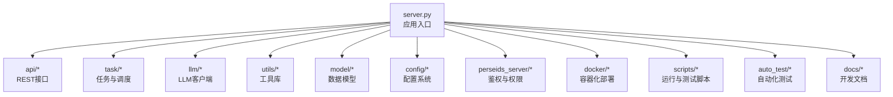
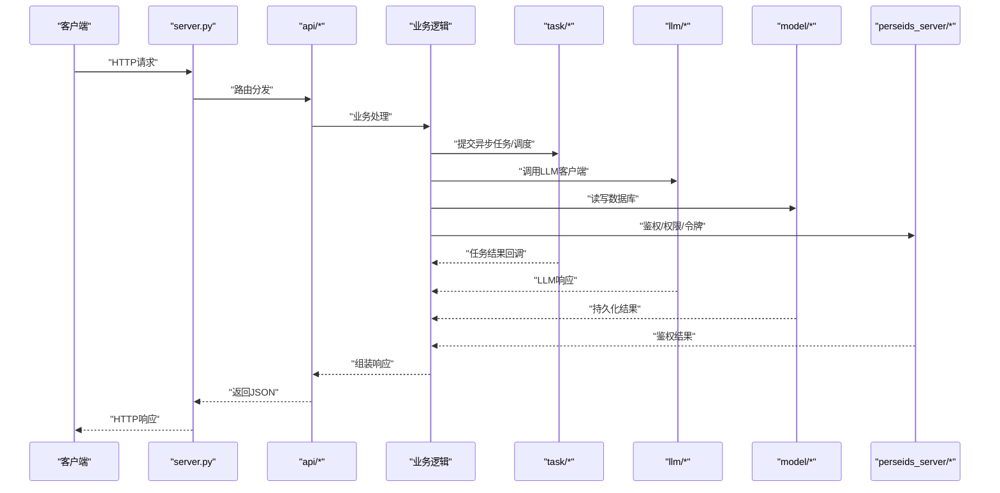
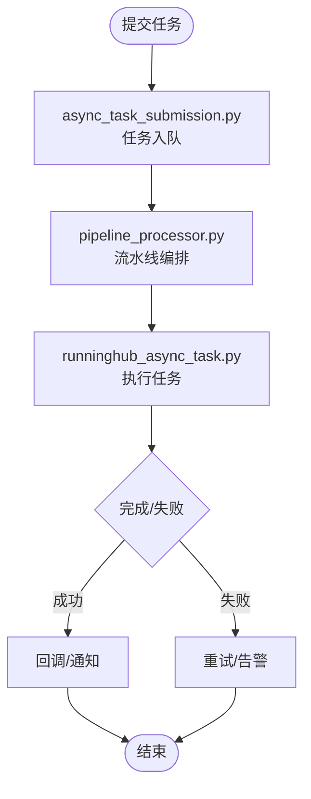
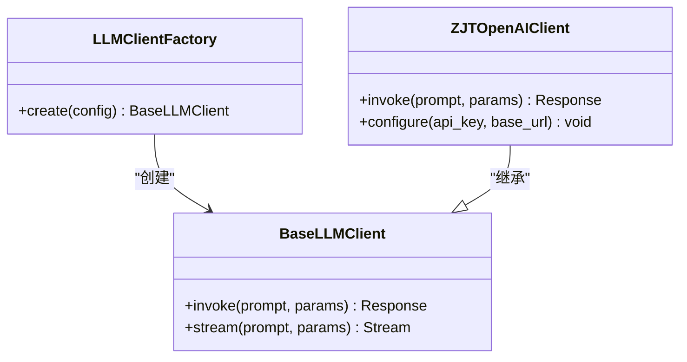
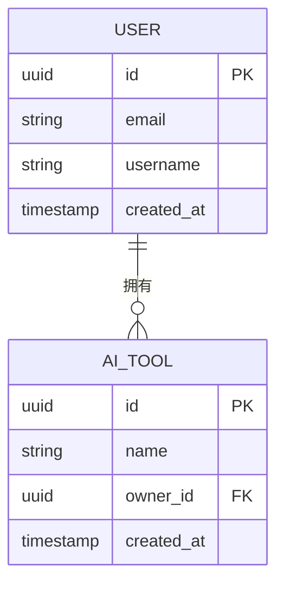
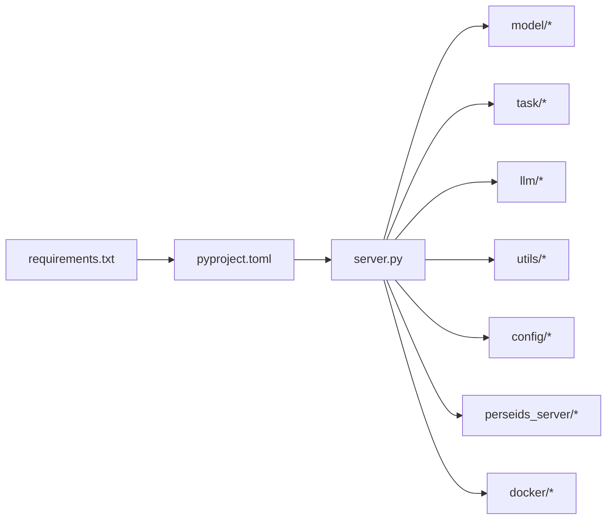

# 开发指南

<cite>
**本文引用的文件**
- [server.py](file://server.py)
- [requirements.txt](file://requirements.txt)
- [pyproject.toml](file://pyproject.toml)
- [README_EN.md](file://README_EN.md)
- [scripts/running/run_dev.py](file://scripts/running/run_dev.py)
- [scripts/testing/run_tests.sh](file://scripts/testing/run_tests.sh)
- [scripts/testing/run_unit_tests.py](file://scripts/testing/run_unit_tests.py)
- [scripts/migration/change_media_path.py](file://scripts/migration/change_media_path.py)
- [alembic/env.py](file://alembic/env.py)
- [.github/workflows/guard-enterprise.yml](file://.github/workflows/guard-enterprise.yml)
- [.github/workflows/sync-gitee.yml](file://.github/workflows/sync-gitee.yml)
- [.gitlab-ci.yml](file://.gitlab-ci.yml)
- [auto_test/SETUP.md](file://auto_test/SETUP.md)
- [docs/dev_debug_guide.md](file://docs/dev_debug_guide.md)
- [docs/e2e_testing.md](file://docs/e2e_testing.md)
- [docs/database_migration.md](file://docs/database_migration.md)
- [docs/backend/unified_config_system.md](file://docs/backend/unified_config_system.md)
- [docs/backend/runninghub_concurrency_control.md](file://docs/backend/runninghub_concurrency_control.md)
- [docs/image/grid_image_generation.md](file://docs/image/grid_image_generation.md)
- [docs/video/grid_merge_video_generation.md](file://docs/video/grid_merge_video_generation.md)
- [docs/timeline/timeline_pillar_system.md](file://docs/timeline/timeline_pillar_system.md)
- [docs/权限系统/权限系统设计.md](file://docs/权限系统/权限系统设计.md)
- [docs/权限系统/权限装饰器使用说明.md](file://docs/权限系统/权限装饰器使用说明.md)
- [perseids_server/services/auth_service.py](file://perseids_server/services/auth_service.py)
- [perseids_server/utils/token.py](file://perseids_server/utils/token.py)
- [perseids_server/utils/permission.py](file://perseids_server/utils/permission.py)
- [model/database.py](file://model/database.py)
- [model/system_config.py](file://model/system_config.py)
- [model/computing_power.py](file://model/computing_power.py)
- [model/computing_power_log.py](file://model/computing_power_log.py)
- [task/pipeline_processor.py](file://task/pipeline_processor.py)
- [task/async_task_submission.py](file://task/async_task_submission.py)
- [task/runninghub_async_task.py](file://task/runninghub_async_task.py)
- [task/scheduler.py](file://task/scheduler.py)
- [utils/logger_config.py](file://utils/logger_config.py)
- [utils/computing_power.py](file://utils/computing_power.py)
- [utils/media_cache.py](file://utils/media_cache.py)
- [utils/cdn_util.py](file://utils/cdn_util.py)
- [utils/file_storage/factory.py](file://utils/file_storage/factory.py)
- [utils/file_storage/qiniu_storage.py](file://utils/file_storage/qiniu_storage.py)
- [utils/file_storage/runninghub_storage.py](file://utils/file_storage/runninghub_storage.py)
- [llm/llm_client_factory.py](file://llm/llm_client_factory.py)
- [llm/base_llm_client.py](file://llm/base_llm_client.py)
- [llm/zjt_openai_client.py](file://llm/zjt_openai_client.py)
- [api/admin.py](file://api/admin.py)
- [api/user.py](file://api/user.py)
- [api/media.py](file://api/media.py)
- [api/notifications.py](file://api/notifications.py)
- [script_writer_core/agents/base_agent.py](file://script_writer_core/agents/base_agent.py)
- [script_writer_core/agents/expert_agent.py](file://script_writer_core/agents/expert_agent.py)
- [script_writer_core/agents/marketing_pm_agent.py](file://script_writer_core/agents/marketing_pm_agent.py)
- [script_writer_core/skill_loader.py](file://script_writer_core/skill_loader.py)
- [agents/skill_loader.py](file://agents/skill_loader.py)
- [services/checkin_service.py](file://services/checkin_service.py)
- [services/notification_service.py](file://services/notification_service.py)
- [docker/docker-compose.yml](file://docker/docker-compose.yml)
- [docker/Dockerfile](file://docker/Dockerfile)
- [config/unified_config.py](file://config/unified_config.py)
- [config/default_configs.py](file://config/default_configs.py)
- [config/strategy/edition_strategy.py](file://config/strategy/edition_strategy.py)
- [config/required_binaries.yml](file://config/required_binaries.yml)
- [config/constant.py](file://config/constant.py)
- [config/version.py](file://config/version.py)
- [tests/test_db_connection.py](file://tests/test_db_connection.py)
- [tests/crud/test_ai_tools_crud.py](file://tests/crud/test_ai_tools_crud.py)
- [tests/drivers/test_driver_factory.py](file://tests/drivers/test_driver_factory.py)
- [tests/llm/test_openai_base_client.py](file://tests/llm/test_openai_base_client.py)
- [auto_test/e2e/test_admin.py](file://auto_test/e2e/test_admin.py)
- [auto_test/e2e/test_auth.py](file://auto_test/e2e/test_auth.py)
- [auto_test/e2e/test_workflow.py](file://auto_test/e2e/test_workflow.py)
</cite>

## 目录
1. [简介](#简介)
2. [项目结构](#项目结构)
3. [核心组件](#核心组件)
4. [架构总览](#架构总览)
5. [详细组件分析](#详细组件分析)
6. [依赖关系分析](#依赖关系分析)
7. [性能考虑](#性能考虑)
8. [故障排除指南](#故障排除指南)
9. [结论](#结论)
10. [附录](#附录)

## 简介
本开发指南面向ZhiJuTong（智能工具与内容创作平台）的后端与脚本开发者，目标是帮助团队建立统一的开发规范、调试流程、性能优化策略与持续集成实践。文档基于仓库中的实际代码与文档文件进行梳理，涵盖Python编码标准、命名约定、注释规范、调试与工具使用、开发环境搭建、性能优化、故障排除、代码审查与CI/CD实践，以及扩展开发与第三方集成方法。

## 项目结构
项目采用分层与功能域结合的组织方式：
- 后端服务入口与路由：server.py
- API层：api/（管理员、用户、媒体、通知等）
- 模型层：model/（数据库模型与迁移）
- 任务与调度：task/（异步任务、流水线处理器、调度器）
- LLM客户端：llm/（多厂商适配与工厂）
- 工具与基础设施：utils/（日志、缓存、CDN、存储工厂等）
- 配置系统：config/（统一配置、版本、常量、策略）
- 脚本与运维：scripts/（运行、测试、升级、打包）
- 自动化测试：auto_test/（E2E与模块测试）
- 文档：docs/（开发调试、数据库迁移、功能设计文档）
- Docker部署：docker/
- 第三方服务集成：perseids_server/（鉴权、权限、令牌）

图表来源
- [server.py](file://server.py)
- [api/admin.py](file://api/admin.py)
- [task/pipeline_processor.py](file://task/pipeline_processor.py)
- [llm/llm_client_factory.py](file://llm/llm_client_factory.py)
- [utils/logger_config.py](file://utils/logger_config.py)
- [model/database.py](file://model/database.py)
- [config/unified_config.py](file://config/unified_config.py)
- [perseids_server/services/auth_service.py](file://perseids_server/services/auth_service.py)
- [docker/docker-compose.yml](file://docker/docker-compose.yml)
- [scripts/running/run_dev.py](file://scripts/running/run_dev.py)
- [auto_test/SETUP.md](file://auto_test/SETUP.md)
- [docs/dev_debug_guide.md](file://docs/dev_debug_guide.md)

章节来源
- [server.py](file://server.py)
- [README_EN.md](file://README_EN.md)

## 核心组件
- 应用入口与路由：server.py负责启动与路由注册，通常在此处加载配置、初始化数据库连接与注册API蓝图。
- API层：按领域拆分，如管理员、用户、媒体、通知等，职责清晰，便于维护与测试。
- 任务与调度：task/包含异步任务提交、流水线处理器、调度器等，支撑高并发与后台任务。
- LLM客户端：llm/通过工厂模式适配多家大模型供应商，支持统一调用与切换。
- 工具库：utils/提供日志、缓存、CDN、存储工厂等通用能力。
- 配置系统：config/提供统一配置、版本号、常量与策略模块，确保跨模块一致性。
- 模型层：model/定义ORM模型与数据库迁移，配合alembic进行版本化管理。
- 鉴权与权限：perseids_server/提供鉴权服务、权限校验与令牌管理。
- Docker与脚本：docker/与scripts/提供一键部署与运行脚本。

章节来源
- [server.py](file://server.py)
- [api/admin.py](file://api/admin.py)
- [api/user.py](file://api/user.py)
- [task/pipeline_processor.py](file://task/pipeline_processor.py)
- [task/async_task_submission.py](file://task/async_task_submission.py)
- [llm/llm_client_factory.py](file://llm/llm_client_factory.py)
- [utils/logger_config.py](file://utils/logger_config.py)
- [model/database.py](file://model/database.py)
- [config/unified_config.py](file://config/unified_config.py)
- [perseids_server/services/auth_service.py](file://perseids_server/services/auth_service.py)

## 架构总览
下图展示从HTTP请求到业务处理、任务执行与外部服务调用的整体流程。

图表来源
- [server.py](file://server.py)
- [api/admin.py](file://api/admin.py)
- [api/user.py](file://api/user.py)
- [task/pipeline_processor.py](file://task/pipeline_processor.py)
- [task/async_task_submission.py](file://task/async_task_submission.py)
- [llm/llm_client_factory.py](file://llm/llm_client_factory.py)
- [model/database.py](file://model/database.py)
- [perseids_server/services/auth_service.py](file://perseids_server/services/auth_service.py)

## 详细组件分析

### 应用入口与开发服务器
- 入口文件：server.py作为应用启动点，负责初始化应用、注册蓝图与中间件。
- 开发运行：scripts/running/run_dev.py提供本地开发启动脚本，便于热更新与调试。
- 生产运行：run_prod.py与Linux启动脚本位于scripts/running/目录，用于生产部署。

章节来源
- [server.py](file://server.py)
- [scripts/running/run_dev.py](file://scripts/running/run_dev.py)

### API层设计
- 分层清晰：admin.py、user.py、media.py、notifications.py分别对应不同业务域。
- 统一响应：建议在各API中遵循统一的响应结构与状态码约定，便于前端对接与监控。
- 权限控制：结合perseids_server的权限模块，在API层进行鉴权与权限校验。

章节来源
- [api/admin.py](file://api/admin.py)
- [api/user.py](file://api/user.py)
- [api/media.py](file://api/media.py)
- [api/notifications.py](file://api/notifications.py)
- [perseids_server/utils/permission.py](file://perseids_server/utils/permission.py)

### 任务与调度系统
- 异步任务：async_task_submission.py负责任务提交；runninghub_async_task.py封装异步任务执行细节。
- 流水线处理器：pipeline_processor.py协调多步骤任务的执行顺序与错误处理。
- 调度器：scheduler.py定时触发周期性任务，如清理、统计与缓存刷新。

图表来源
- [task/async_task_submission.py](file://task/async_task_submission.py)
- [task/pipeline_processor.py](file://task/pipeline_processor.py)
- [task/runninghub_async_task.py](file://task/runninghub_async_task.py)

章节来源
- [task/async_task_submission.py](file://task/async_task_submission.py)
- [task/pipeline_processor.py](file://task/pipeline_processor.py)
- [task/runninghub_async_task.py](file://task/runninghub_async_task.py)
- [task/scheduler.py](file://task/scheduler.py)

### LLM客户端与多厂商适配
- 工厂模式：llm_client_factory.py根据配置选择具体客户端实现。
- 基类抽象：base_llm_client.py定义统一接口，便于新增厂商或切换模型。
- ZhiJuTong适配：zjt_openai_client.py提供特定参数与行为定制。

图表来源
- [llm/llm_client_factory.py](file://llm/llm_client_factory.py)
- [llm/base_llm_client.py](file://llm/base_llm_client.py)
- [llm/zjt_openai_client.py](file://llm/zjt_openai_client.py)

章节来源
- [llm/llm_client_factory.py](file://llm/llm_client_factory.py)
- [llm/base_llm_client.py](file://llm/base_llm_client.py)
- [llm/zjt_openai_client.py](file://llm/zjt_openai_client.py)

### 数据模型与数据库迁移
- ORM模型：model/database.py集中管理数据库连接与会话；各业务模型在model/子模块中定义。
- 迁移系统：alembic/versions下的多个版本文件记录数据库演进；env.py配置迁移上下文。
- 配置驱动：docs/backend/database_migration.md提供迁移设计与最佳实践。

图表来源
- [model/database.py](file://model/database.py)
- [alembic/env.py](file://alembic/env.py)

章节来源
- [model/database.py](file://model/database.py)
- [alembic/env.py](file://alembic/env.py)
- [docs/database_migration.md](file://docs/database_migration.md)

### 配置系统与统一配置
- 统一配置：config/unified_config.py提供全局配置读取与合并机制。
- 默认配置：default_configs.py定义默认值，避免空配置导致的异常。
- 版本与常量：version.py与constant.py提供版本号与常量定义，便于发布与兼容性管理。
- 策略模块：strategy/edition_strategy.py按版本/等级提供差异化配置。

章节来源
- [config/unified_config.py](file://config/unified_config.py)
- [config/default_configs.py](file://config/default_configs.py)
- [config/version.py](file://config/version.py)
- [config/constant.py](file://config/constant.py)
- [config/strategy/edition_strategy.py](file://config/strategy/edition_strategy.py)
- [docs/backend/unified_config_system.md](file://docs/backend/unified_config_system.md)

### 鉴权、权限与令牌
- 鉴权服务：perseids_server/services/auth_service.py提供登录、登出与会话管理。
- 权限工具：perseids_server/utils/permission.py定义权限检查与装饰器使用。
- 令牌管理：perseids_server/utils/token.py提供令牌生成、验证与刷新。

章节来源
- [perseids_server/services/auth_service.py](file://perseids_server/services/auth_service.py)
- [perseids_server/utils/permission.py](file://perseids_server/utils/permission.py)
- [perseids_server/utils/token.py](file://perseids_server/utils/token.py)
- [docs/权限系统/权限系统设计.md](file://docs/权限系统/权限系统设计.md)
- [docs/权限系统/权限装饰器使用说明.md](file://docs/权限系统/权限装饰器使用说明.md)

### 工具库与基础设施
- 日志：utils/logger_config.py集中配置日志格式与级别。
- 计算力：utils/computing_power.py提供算力计算与扣费逻辑。
- 媒体缓存：utils/media_cache.py管理媒体文件缓存策略。
- CDN与存储：utils/cdn_util.py与utils/file_storage/*提供CDN与多种存储后端（如七牛、RunningHub）。

章节来源
- [utils/logger_config.py](file://utils/logger_config.py)
- [utils/computing_power.py](file://utils/computing_power.py)
- [utils/media_cache.py](file://utils/media_cache.py)
- [utils/cdn_util.py](file://utils/cdn_util.py)
- [utils/file_storage/factory.py](file://utils/file_storage/factory.py)
- [utils/file_storage/qiniu_storage.py](file://utils/file_storage/qiniu_storage.py)
- [utils/file_storage/runninghub_storage.py](file://utils/file_storage/runninghub_storage.py)

### 脚本与自动化测试
- 单元测试：scripts/testing/run_unit_tests.py与run_tests.sh提供测试入口。
- E2E测试：auto_test/e2e/包含完整的端到端测试套件，覆盖管理员、认证、工作流等场景。
- 自动化测试环境：auto_test/SETUP.md提供测试环境准备与配置说明。
- 文档：docs/e2e_testing.md提供E2E测试设计与执行指南。

章节来源
- [scripts/testing/run_unit_tests.py](file://scripts/testing/run_unit_tests.py)
- [scripts/testing/run_tests.sh](file://scripts/testing/run_tests.sh)
- [auto_test/e2e/test_admin.py](file://auto_test/e2e/test_admin.py)
- [auto_test/e2e/test_auth.py](file://auto_test/e2e/test_auth.py)
- [auto_test/e2e/test_workflow.py](file://auto_test/e2e/test_workflow.py)
- [auto_test/SETUP.md](file://auto_test/SETUP.md)
- [docs/e2e_testing.md](file://docs/e2e_testing.md)

### 开发调试与工具使用
- 调试指南：docs/dev_debug_guide.md提供IDE配置、断点调试与性能分析建议。
- 开发服务器：scripts/running/run_dev.py支持热更新与快速迭代。
- Docker：docker/docker-compose.yml与Dockerfile提供容器化开发与部署环境。

章节来源
- [docs/dev_debug_guide.md](file://docs/dev_debug_guide.md)
- [scripts/running/run_dev.py](file://scripts/running/run_dev.py)
- [docker/docker-compose.yml](file://docker/docker-compose.yml)
- [docker/Dockerfile](file://docker/Dockerfile)

### 扩展开发与第三方集成
- 新功能开发：参考script_writer_core/agents/*与agents/skill_loader.py的Agent与技能加载机制，新增Agent或技能时遵循统一接口与配置。
- API扩展：在api/下新增模块，遵循现有路由与权限校验模式。
- 第三方集成：perseids_server提供鉴权与权限接入；llm/提供多厂商适配；utils/file_storage/*提供存储后端扩展。

章节来源
- [script_writer_core/agents/base_agent.py](file://script_writer_core/agents/base_agent.py)
- [script_writer_core/agents/expert_agent.py](file://script_writer_core/agents/expert_agent.py)
- [script_writer_core/agents/marketing_pm_agent.py](file://script_writer_core/agents/marketing_pm_agent.py)
- [script_writer_core/skill_loader.py](file://script_writer_core/skill_loader.py)
- [agents/skill_loader.py](file://agents/skill_loader.py)
- [perseids_server/services/auth_service.py](file://perseids_server/services/auth_service.py)
- [llm/llm_client_factory.py](file://llm/llm_client_factory.py)
- [utils/file_storage/factory.py](file://utils/file_storage/factory.py)

## 依赖关系分析
- Python依赖：requirements.txt与pyproject.toml共同管理依赖，建议优先使用pyproject.toml进行现代Python项目管理。
- 数据库依赖：alembic与model/database.py协同管理数据库版本与连接。
- 外部服务：perseids_server提供鉴权与权限；LLM客户端适配多家供应商；CDN与存储后端可替换。

图表来源
- [requirements.txt](file://requirements.txt)
- [pyproject.toml](file://pyproject.toml)
- [server.py](file://server.py)
- [model/database.py](file://model/database.py)
- [task/pipeline_processor.py](file://task/pipeline_processor.py)
- [llm/llm_client_factory.py](file://llm/llm_client_factory.py)
- [utils/logger_config.py](file://utils/logger_config.py)
- [config/unified_config.py](file://config/unified_config.py)
- [perseids_server/services/auth_service.py](file://perseids_server/services/auth_service.py)
- [docker/docker-compose.yml](file://docker/docker-compose.yml)

章节来源
- [requirements.txt](file://requirements.txt)
- [pyproject.toml](file://pyproject.toml)

## 性能考虑
- 并发控制：docs/backend/runninghub_concurrency_control.md提供并发槽位与限流策略，避免资源争用。
- 缓存策略：utils/media_cache.py与utils/cdn_util.py结合使用，减少重复计算与网络开销。
- 数据库优化：合理索引与查询计划，避免N+1查询；使用批量操作与事务包裹。
- LLM调用：通过llm_client_factory.py统一管理客户端，避免频繁创建连接；对长文本分片与流式输出进行节流。
- 任务调度：task/scheduler.py与task/runninghub_async_task.py配合，合理设置任务优先级与重试策略。

章节来源
- [docs/backend/runninghub_concurrency_control.md](file://docs/backend/runninghub_concurrency_control.md)
- [utils/media_cache.py](file://utils/media_cache.py)
- [utils/cdn_util.py](file://utils/cdn_util.py)
- [task/scheduler.py](file://task/scheduler.py)
- [task/runninghub_async_task.py](file://task/runninghub_async_task.py)
- [llm/llm_client_factory.py](file://llm/llm_client_factory.py)

## 故障排除指南
- 常见错误分析：结合auto_test/e2e/test_*与tests/下的单元测试，定位API、数据库与任务执行中的异常。
- 日志分析：utils/logger_config.py集中配置日志，建议在关键路径增加结构化日志字段，便于检索。
- 问题定位：使用docs/dev_debug_guide.md中的调试技巧，结合断点与性能分析工具定位瓶颈。
- 数据库问题：参考docs/database_migration.md与alembic/versions，确认迁移是否完整、索引是否正确。

章节来源
- [auto_test/e2e/test_admin.py](file://auto_test/e2e/test_admin.py)
- [auto_test/e2e/test_auth.py](file://auto_test/e2e/test_auth.py)
- [auto_test/e2e/test_workflow.py](file://auto_test/e2e/test_workflow.py)
- [utils/logger_config.py](file://utils/logger_config.py)
- [docs/dev_debug_guide.md](file://docs/dev_debug_guide.md)
- [docs/database_migration.md](file://docs/database_migration.md)
- [alembic/env.py](file://alembic/env.py)

## 结论
本指南基于仓库中的实际代码与文档，总结了ZhiJuTong的开发规范、调试流程、性能优化与CI/CD实践。建议团队在日常开发中严格遵循统一的配置与日志规范，利用工厂模式与抽象基类提升可扩展性，并通过完善的测试与文档保障交付质量。

## 附录
- 开发环境搭建
  - 虚拟环境：使用Python 3.9+，创建虚拟环境并安装依赖。
  - 依赖管理：优先使用pyproject.toml进行依赖声明与锁定。
  - IDE推荐：启用Pylance/PyCharm的类型检查与自动格式化；配置断点与调试器。
  - Docker：使用docker/docker-compose.yml快速启动数据库与服务依赖。
- 代码规范与最佳实践
  - 命名约定：模块与类使用PascalCase，函数与变量使用snake_case；常量使用UPPER_CASE。
  - 注释规范：公共接口与复杂逻辑需提供清晰注释；错误处理分支需有注释说明。
  - 提交规范：遵循仓库中的提交信息风格，配合CI/CD自动检测。
- 代码审查与质量保证
  - 代码审查：使用.github/workflows/guard-enterprise.yml与.gitlab-ci.yml进行自动化检查。
  - 持续集成：run_tests.sh与run_unit_tests.py作为CI阶段的测试入口。
- 扩展开发指南
  - 新功能：参考script_writer_core/agents/*与agents/skill_loader.py的Agent与技能加载机制。
  - API扩展：在api/下新增模块，遵循现有路由与权限校验模式。
  - 第三方集成：perseids_server提供鉴权与权限接入；llm/提供多厂商适配；utils/file_storage/*提供存储后端扩展。

章节来源
- [requirements.txt](file://requirements.txt)
- [pyproject.toml](file://pyproject.toml)
- [.github/workflows/guard-enterprise.yml](file://.github/workflows/guard-enterprise.yml)
- [.github/workflows/sync-gitee.yml](file://.github/workflows/sync-gitee.yml)
- [.gitlab-ci.yml](file://.gitlab-ci.yml)
- [scripts/testing/run_tests.sh](file://scripts/testing/run_tests.sh)
- [scripts/testing/run_unit_tests.py](file://scripts/testing/run_unit_tests.py)
- [docker/docker-compose.yml](file://docker/docker-compose.yml)
- [docker/Dockerfile](file://docker/Dockerfile)
- [script_writer_core/agents/base_agent.py](file://script_writer_core/agents/base_agent.py)
- [agents/skill_loader.py](file://agents/skill_loader.py)
- [perseids_server/services/auth_service.py](file://perseids_server/services/auth_service.py)
- [llm/llm_client_factory.py](file://llm/llm_client_factory.py)
- [utils/file_storage/factory.py](file://utils/file_storage/factory.py)