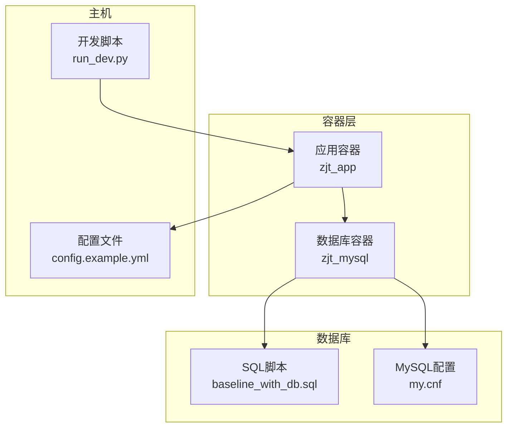
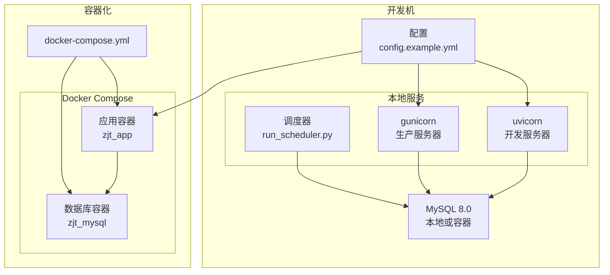
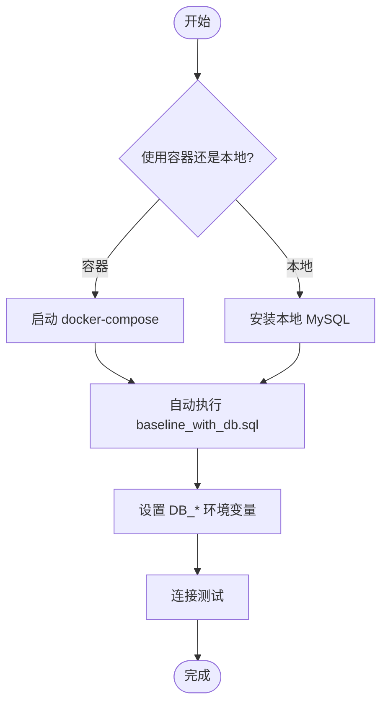
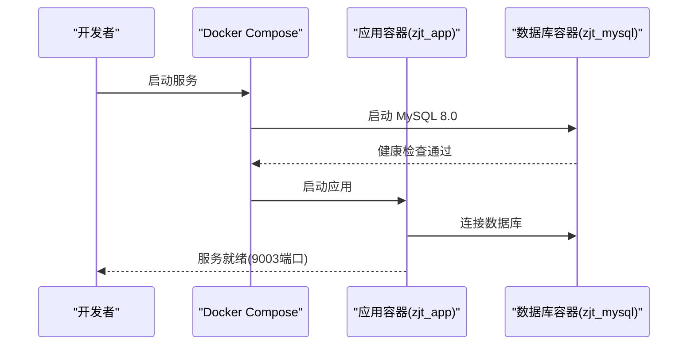
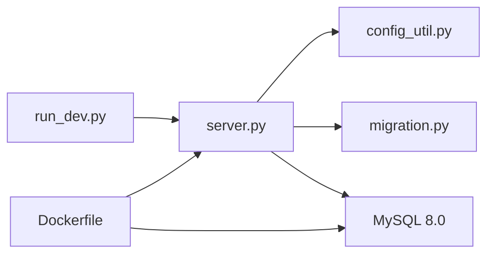

# 开发环境搭建

<cite>
**本文档引用的文件**
- [requirements.txt](file://requirements.txt)
- [pyproject.toml](file://pyproject.toml)
- [docker-compose.yml](file://docker/docker-compose.yml)
- [Dockerfile](file://docker/Dockerfile)
- [run_dev.py](file://scripts/running/run_dev.py)
- [server.py](file://server.py)
- [Mac安装说明.md](file://Mac安装说明.md)
- [Windows启动文件说明.txt](file://Windows启动文件说明.txt)
- [首始安装-Mac.command](file://首次安装-Mac.command)
- [start.bat](file://start.bat)
- [stop.bat](file://stop.bat)
- [start.command](file://start.command)
- [stop.command](file://stop.command)
- [baseline_with_db.sql](file://model/sql/baseline_with_db.sql)
- [my.cnf](file://docker/mysql/my.cnf)
- [docker-entrypoint.sh](file://docker/docker-entrypoint.sh)
- [config.example.yml](file://config.example.yml)
- [config_unit.base.yml](file://config_unit.base.yml)
- [config_prod.base.yaml](file://config_prod.base.yaml)
- [config_util.py](file://config/config_util.py)
- [migration.py](file://model/migration.py)
- [alembic.ini](file://alembic.ini)
- [.gitignore](file://.gitignore)
- [.gitattributes](file://.gitattributes)
- [.gitlab-ci.yml](file://.gitlab-ci.yml)
- [README.md](file://README.md)
- [README_EN.md](file://README_EN.md)
</cite>

## 目录
1. [简介](#简介)
2. [项目结构](#项目结构)
3. [核心组件](#核心组件)
4. [架构总览](#架构总览)
5. [详细组件分析](#详细组件分析)
6. [依赖关系分析](#依赖关系分析)
7. [性能考虑](#性能考虑)
8. [故障排除指南](#故障排除指南)
9. [结论](#结论)
10. [附录](#附录)

## 简介
本指南面向 ZhiJuTong（ComfyUI Server2）项目的开发者，提供从零搭建开发环境的完整流程，涵盖：
- Python 版本与虚拟环境
- 依赖安装与配置
- 数据库环境（MySQL）安装、初始化与连接
- Docker 容器化编排与服务启动
- IDE 推荐设置（VS Code）
- 版本控制（Git）配置与分支/提交规范
- 跨平台开发注意事项（Windows/macOS/Linux）
- 环境验证与常见问题排查

## 项目结构
该项目采用“后端服务 + 数据库 + 容器化”一体化架构，核心目录职责如下：
- docker：Dockerfile、docker-compose.yml、MySQL 配置与入口脚本
- model/sql：数据库基线与迁移脚本
- scripts/running：开发/生产启动脚本与调度器
- config：统一配置系统与常量
- server.py：FastAPI 应用入口，包含路由、中间件与启动事件
- requirements.txt/pyproject.toml：Python 依赖与版本约束
- docs：开发文档与说明
- auto_test：自动化测试与端到端测试框架

图表来源
- [docker-compose.yml:1-88](file://docker/docker-compose.yml#L1-L88)
- [Dockerfile:1-81](file://docker/Dockerfile#L1-L81)
- [run_dev.py:1-150](file://scripts/running/run_dev.py#L1-L150)
- [baseline_with_db.sql](file://model/sql/baseline_with_db.sql)
- [my.cnf](file://docker/mysql/my.cnf)

章节来源
- [docker-compose.yml:1-88](file://docker/docker-compose.yml#L1-L88)
- [Dockerfile:1-81](file://docker/Dockerfile#L1-L81)
- [run_dev.py:1-150](file://scripts/running/run_dev.py#L1-L150)

## 核心组件
- Python 运行时与包管理
  - Python 版本：严格使用 3.10.x（详见 pyproject.toml）
  - 包管理：pip（requirements.txt）与 uv（索引镜像）
- Web 服务
  - FastAPI 应用入口 server.py
  - 开发模式使用 uvicorn；生产模式使用 gunicorn + uvicorn workers
- 数据库
  - MySQL 8.0，容器内初始化基线 SQL，健康检查与端口映射
- 配置系统
  - YAML 配置文件与统一配置读取工具
- 迁移系统
  - Alembic 迁移与自动迁移开关

章节来源
- [pyproject.toml:1-9](file://pyproject.toml#L1-L9)
- [requirements.txt:1-36](file://requirements.txt#L1-L36)
- [server.py:1-8617](file://server.py#L1-L8617)
- [docker-compose.yml:1-88](file://docker/docker-compose.yml#L1-L88)
- [config_util.py](file://config/config_util.py)

## 架构总览
下图展示开发与容器两种运行方式的总体架构：

图表来源
- [run_dev.py:1-150](file://scripts/running/run_dev.py#L1-L150)
- [server.py:1-8617](file://server.py#L1-L8617)
- [docker-compose.yml:1-88](file://docker/docker-compose.yml#L1-L88)

## 详细组件分析

### Python 环境与虚拟环境
- Python 版本要求
  - 必须使用 Python 3.10.x（pyproject.toml 中明确指定）
- 虚拟环境建议
  - 使用 venv 创建隔离环境，避免系统 Python 干扰
  - 在虚拟环境中安装依赖（见下一节）
- 包管理与镜像
  - pip 默认使用阿里云镜像源（Dockerfile 中已配置）
  - 本地开发可按需切换至国内镜像以提升安装速度

章节来源
- [pyproject.toml:1-9](file://pyproject.toml#L1-L9)
- [Dockerfile:62-68](file://docker/Dockerfile#L62-L68)

### 依赖安装与配置
- 安装命令（推荐在虚拟环境中执行）
  - pip install -r requirements.txt
- 关键依赖说明
  - Web 框架：FastAPI、uvicorn、gunicorn
  - 数据库：PyMySQL、SQLAlchemy、Alembic
  - 工具：OpenAI SDK、Anthropic、Pillow、opencv-python 等
- 配置文件
  - config.example.yml：基础配置模板
  - config_unit.base.yml / config_prod.base.yaml：单元测试与生产基础配置
  - config_util.py：统一读取配置与路径解析

章节来源
- [requirements.txt:1-36](file://requirements.txt#L1-L36)
- [config.example.yml](file://config.example.yml)
- [config_unit.base.yml](file://config_unit.base.yml)
- [config_prod.base.yaml](file://config_prod.base.yaml)
- [config_util.py](file://config/config_util.py)

### 数据库环境配置（MySQL）
- 本地安装与初始化
  - 方式一：使用容器（推荐）
    - docker-compose.yml 提供 MySQL 8.0 服务，端口映射 3307:3306
    - 首次启动自动执行 model/sql/baseline_with_db.sql
    - 自定义配置位于 docker/mysql/my.cnf
  - 方式二：本地 MySQL
    - 安装 MySQL 8.0，创建数据库 zjt，字符集 utf8mb4
    - 手动执行 baseline_with_db.sql 初始化
- 连接参数
  - 主机：localhost（容器内为 mysql）
  - 端口：3307（容器）或 3306（本地）
  - 用户：root
  - 密码：3bTgThWP2xeX（容器默认）
  - 数据库：zjt
- 健康检查
  - docker-compose.yml 中包含 MySQL 健康检查与启动等待

图表来源
- [docker-compose.yml:1-88](file://docker/docker-compose.yml#L1-L88)
- [baseline_with_db.sql](file://model/sql/baseline_with_db.sql)
- [my.cnf](file://docker/mysql/my.cnf)

章节来源
- [docker-compose.yml:1-88](file://docker/docker-compose.yml#L1-L88)
- [my.cnf](file://docker/mysql/my.cnf)
- [baseline_with_db.sql](file://model/sql/baseline_with_db.sql)

### Docker 环境搭建
- 构建与启动
  - 在项目根目录执行：docker compose -f docker/docker-compose.yml up -d
  - 应用容器暴露端口 9003，可通过 http://localhost:9003 访问
- 容器编排要点
  - 应用容器依赖数据库容器健康状态
  - 数据卷挂载：data、logs、upload、files
  - ffmpeg 二进制挂载：bin/ffmpeg
- 入口脚本
  - docker-entrypoint.sh 负责容器启动时的初始化流程（如迁移）

图表来源
- [docker-compose.yml:1-88](file://docker/docker-compose.yml#L1-L88)
- [Dockerfile:1-81](file://docker/Dockerfile#L1-L81)
- [docker-entrypoint.sh](file://docker/docker-entrypoint.sh)

章节来源
- [docker-compose.yml:1-88](file://docker/docker-compose.yml#L1-L88)
- [Dockerfile:1-81](file://docker/Dockerfile#L1-L81)

### IDE 推荐设置（VS Code）
- 插件推荐
  - Python（官方扩展）、Pylance、Black、isort、YAML、EditorConfig、GitLens
- 工作区设置
  - 使用 .vscode/settings.json 指定 Python 解释器为虚拟环境中的 Python 3.10
  - 设置编码为 UTF-8，行尾符为 LF
- 调试配置
  - 使用 Python 启动脚本调试 server.py 或 run_dev.py
  - 配置环境变量（如 PORT、DB_HOST 等）以匹配本地配置

章节来源
- [server.py:1-8617](file://server.py#L1-L8617)
- [run_dev.py:1-150](file://scripts/running/run_dev.py#L1-L150)

### 版本控制配置（Git）
- 分支策略
  - 主分支：main（发布稳定版本）
  - 开发分支：dev 或 feature/*（功能开发）
  - 热修复：hotfix/*
- 提交规范
  - 类型：feat/fix/docs/style/refactor/test/build/ci/chore
  - 示例：feat(api): 添加用户认证接口
- Git 钩子与 CI
  - .gitignore/.gitattributes：忽略构建产物与敏感文件
  - .gitlab-ci.yml：CI 流水线配置（可参考）

章节来源
- [.gitignore](file://.gitignore)
- [.gitattributes](file://.gitattributes)
- [.gitlab-ci.yml](file://.gitlab-ci.yml)

### 跨平台开发注意事项
- Windows
  - 使用 start.bat/stop.bat 启停服务
  - 注意路径分隔符与换行符差异
- macOS
  - 首次安装可使用首次安装脚本
  - 启动脚本：start.command/stop.command
  - 如使用 gunicorn，需注意 fork 安全性（run_dev.py 已内置规避）
- Linux
  - 生产环境使用 gunicorn（run_dev.py 已自动选择）
  - ffmpeg 与系统依赖需提前安装

章节来源
- [Windows启动文件说明.txt](file://Windows启动文件说明.txt)
- [Mac安装说明.md](file://Mac安装说明.md)
- [首次安装-Mac.command](file://首次安装-Mac.command)
- [start.bat](file://start.bat)
- [stop.bat](file://stop.bat)
- [start.command](file://start.command)
- [stop.command](file://stop.command)
- [run_dev.py:1-150](file://scripts/running/run_dev.py#L1-L150)

### 环境验证步骤
- 启动顺序
  - 数据库：容器或本地 MySQL
  - 应用：run_dev.py（开发）或 docker-compose（容器）
- 健康检查
  - docker-compose.yml 中包含应用与数据库健康检查
  - 可通过 curl http://localhost:9003/api/system/status 验证应用状态
- 数据库迁移
  - run_dev.py 会在启动前自动执行数据库迁移
  - 可单独执行迁移脚本进行验证

章节来源
- [docker-compose.yml:30-75](file://docker/docker-compose.yml#L30-L75)
- [run_dev.py:67-78](file://scripts/running/run_dev.py#L67-L78)
- [server.py:1-8617](file://server.py#L1-L8617)

## 依赖关系分析
- 组件耦合
  - server.py 依赖配置系统与模型层，通过 config_util 读取配置
  - run_dev.py 负责启动调度器与 Web 服务，并处理跨平台差异
  - Dockerfile 将项目文件与依赖打包，ENTRYPOINT 调用入口脚本
- 外部依赖
  - MySQL 8.0、ffmpeg、系统网络工具
  - Python 包：FastAPI、SQLAlchemy、Alembic、OpenAI、Pillow 等

图表来源
- [run_dev.py:1-150](file://scripts/running/run_dev.py#L1-L150)
- [server.py:1-8617](file://server.py#L1-L8617)
- [config_util.py](file://config/config_util.py)
- [migration.py](file://model/migration.py)
- [Dockerfile:1-81](file://docker/Dockerfile#L1-L81)

章节来源
- [run_dev.py:1-150](file://scripts/running/run_dev.py#L1-L150)
- [server.py:1-8617](file://server.py#L1-L8617)
- [Dockerfile:1-81](file://docker/Dockerfile#L1-L81)

## 性能考虑
- 开发模式
  - 使用 uvicorn + reload，便于快速迭代
- 生产模式
  - 使用 gunicorn + uvicorn workers，提升并发与稳定性
- 数据库
  - 合理设置连接池与查询超时
  - 使用索引与分区优化高频查询
- 文件处理
  - 上传与转码使用流式处理，避免内存峰值过高

## 故障排除指南
- 数据库连接失败
  - 检查 DB_HOST/DB_PORT/DB_USER/DB_PASSWORD 是否正确
  - 确认数据库已初始化 baseline_with_db.sql
- 容器启动失败
  - 查看 docker-compose 健康检查日志
  - 确认端口未被占用（3307/9003）
- 迁移失败
  - run_dev.py 会在迁移失败时终止启动，查看日志定位问题
- macOS fork 崩溃
  - run_dev.py 已设置 OBJC_DISABLE_INITIALIZE_FORK_SAFETY= YES
- Windows 启动异常
  - 使用 start.bat/stop.bat，确认 Python 3.10 虚拟环境激活

章节来源
- [docker-compose.yml:1-88](file://docker/docker-compose.yml#L1-L88)
- [run_dev.py:28-40](file://scripts/running/run_dev.py#L28-L40)
- [baseline_with_db.sql](file://model/sql/baseline_with_db.sql)

## 结论
通过以上步骤，开发者可在 Windows、macOS、Linux 上快速搭建 ZhiJuTong 的开发与运行环境。推荐优先使用 Docker 容器化方式，确保环境一致性；开发阶段使用 run_dev.py 与 uvicorn，生产阶段使用 gunicorn。配合统一配置系统与 Alembic 迁移，可实现稳定的版本演进与部署。

## 附录
- 快速启动清单
  - 安装 Python 3.10.x，创建并激活虚拟环境
  - 安装依赖：pip install -r requirements.txt
  - 启动数据库（容器或本地）
  - 执行 run_dev.py 或 docker-compose
  - 访问 http://localhost:9003/api/system/status 验证服务
- 参考文档
  - README.md / README_EN.md：项目整体说明
  - docs：各模块技术文档与设计说明

章节来源
- [README.md](file://README.md)
- [README_EN.md](file://README_EN.md)