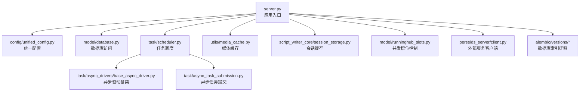
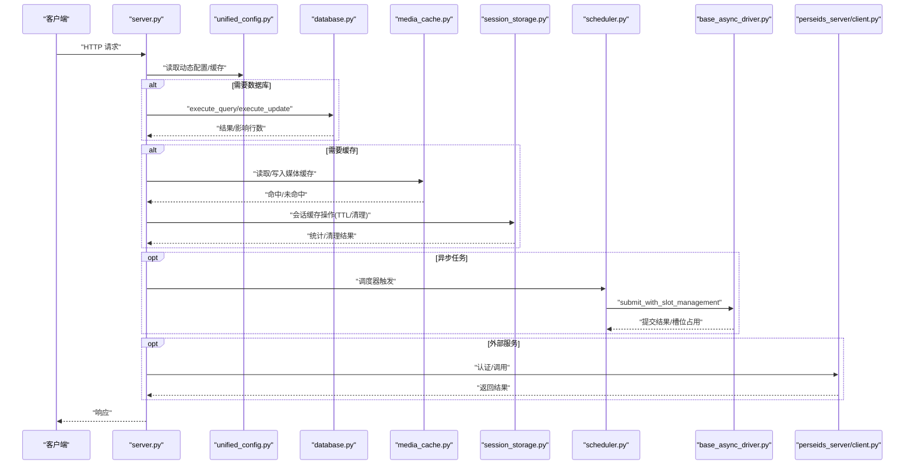
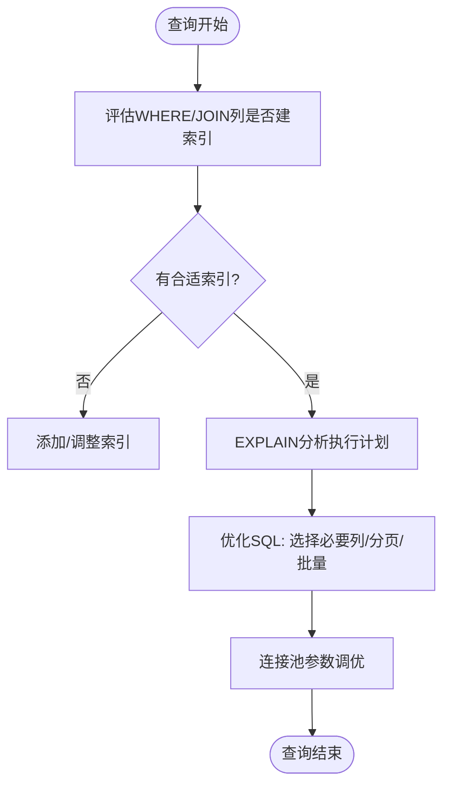
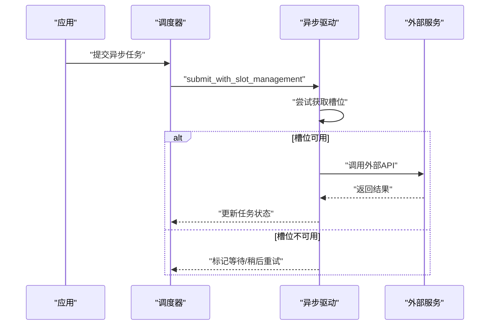
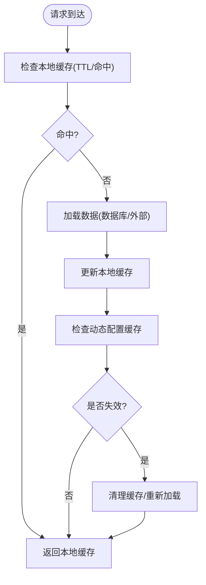
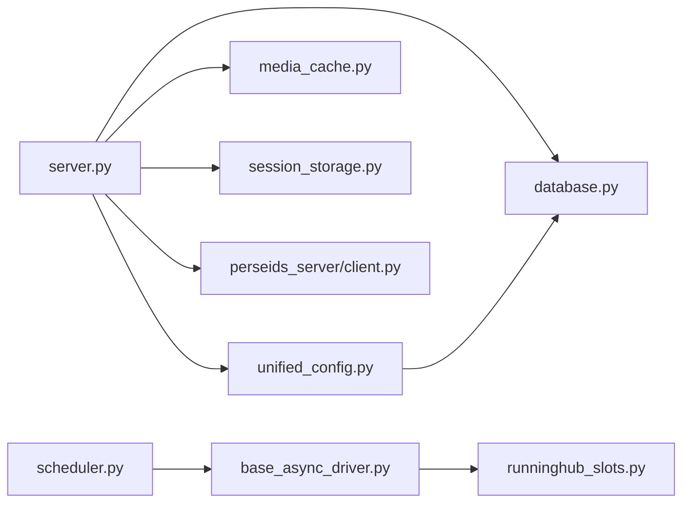

# 性能优化指南

<cite>
**本文档引用的文件**
- [server.py](file://server.py)
- [unified_config.py](file://config/unified_config.py)
- [database.py](file://model/database.py)
- [scheduler.py](file://task/scheduler.py)
- [media_cache.py](file://utils/media_cache.py)
- [runninghub_slots.py](file://model/runninghub_slots.py)
- [base_async_driver.py](file://task/async_drivers/base_async_driver.py)
- [async_task_submission.py](file://task/async_task_submission.py)
- [config_util.py](file://config/config_util.py)
- [20260323_change_impl_power_unique_key.py](file://alembic/versions/20260323_change_impl_power_unique_key.py)
- [session_storage.py](file://script_writer_core/session_storage.py)
- [client.py](file://perseids_server/client.py)
- [test_implementation_config.py](file://tests/config/test_implementation_config.py)
</cite>

## 目录
1. [简介](#简介)
2. [项目结构](#项目结构)
3. [核心组件](#核心组件)
4. [架构总览](#架构总览)
5. [详细组件分析](#详细组件分析)
6. [依赖关系分析](#依赖关系分析)
7. [性能考虑](#性能考虑)
8. [故障排查指南](#故障排查指南)
9. [结论](#结论)
10. [附录](#附录)

## 简介
本指南面向ZhiJuTong项目的性能优化实践，围绕Python运行时性能、数据库访问、异步并发、缓存策略、API响应与前端体验等维度，结合仓库中的实际实现进行系统化梳理与优化建议。内容涵盖内存管理、垃圾回收与对象池使用、数据库索引与连接池配置、并发与异步I/O优化、Redis与本地缓存策略、API批处理与压缩、前端资源优化以及性能监控与瓶颈定位。

## 项目结构
项目采用分层+功能域划分的组织方式：
- 后端服务入口与路由：server.py
- 配置与统一配置系统：config/unified_config.py、config/config_util.py
- 数据库访问与连接管理：model/database.py
- 任务调度与异步执行：task/scheduler.py、task/async_drivers/*、task/async_task_submission.py
- 缓存与媒体缓存：utils/media_cache.py、script_writer_core/session_storage.py
- 并发槽位控制：model/runninghub_slots.py
- 外部服务客户端：perseids_server/client.py
- 数据库迁移与索引：alembic/versions/*（含实现幂率配置索引变更）

图表来源
- [server.py](file://server.py)
- [unified_config.py](file://config/unified_config.py)
- [database.py](file://model/database.py)
- [scheduler.py](file://task/scheduler.py)
- [base_async_driver.py](file://task/async_drivers/base_async_driver.py)
- [async_task_submission.py](file://task/async_task_submission.py)
- [media_cache.py](file://utils/media_cache.py)
- [session_storage.py](file://script_writer_core/session_storage.py)
- [runninghub_slots.py](file://model/runninghub_slots.py)
- [client.py](file://perseids_server/client.py)
- [20260323_change_impl_power_unique_key.py](file://alembic/versions/20260323_change_impl_power_unique_key.py)

章节来源
- [server.py](file://server.py)
- [unified_config.py](file://config/unified_config.py)
- [database.py](file://model/database.py)
- [scheduler.py](file://task/scheduler.py)
- [media_cache.py](file://utils/media_cache.py)
- [session_storage.py](file://script_writer_core/session_storage.py)
- [runninghub_slots.py](file://model/runninghub_slots.py)
- [client.py](file://perseids_server/client.py)
- [20260323_change_impl_power_unique_key.py](file://alembic/versions/20260323_change_impl_power_unique_key.py)

## 核心组件
- 应用入口与路由：负责接收请求、路由到控制器、集成中间件与性能相关插件。
- 统一配置系统：集中管理动态配置与缓存失效，支持按环境隔离与热更新。
- 数据库访问层：封装连接获取、查询执行、更新与事务控制，提供连接复用与异常处理。
- 任务调度与异步驱动：通过调度器周期性处理待提交任务，异步驱动封装外部API调用与槽位管理。
- 缓存体系：本地会话缓存与媒体缓存，支持TTL、清理与统计。
- 并发槽位控制：限制同时执行的任务数量，避免资源争用与超卖。
- 外部服务客户端：封装认证、调用与结果处理，便于统一监控与降级。

章节来源
- [server.py](file://server.py)
- [unified_config.py](file://config/unified_config.py)
- [database.py](file://model/database.py)
- [scheduler.py](file://task/scheduler.py)
- [base_async_driver.py](file://task/async_drivers/base_async_driver.py)
- [async_task_submission.py](file://task/async_task_submission.py)
- [media_cache.py](file://utils/media_cache.py)
- [session_storage.py](file://script_writer_core/session_storage.py)
- [runninghub_slots.py](file://model/runninghub_slots.py)
- [client.py](file://perseids_server/client.py)

## 架构总览
下图展示请求从入口到数据库、缓存与外部服务的关键路径，以及异步任务的提交与并发控制流程。

图表来源
- [server.py](file://server.py)
- [unified_config.py](file://config/unified_config.py)
- [database.py](file://model/database.py)
- [media_cache.py](file://utils/media_cache.py)
- [session_storage.py](file://script_writer_core/session_storage.py)
- [scheduler.py](file://task/scheduler.py)
- [base_async_driver.py](file://task/async_drivers/base_async_driver.py)
- [client.py](file://perseids_server/client.py)

## 详细组件分析

### Python运行时性能优化
- 内存管理与垃圾回收
  - 使用上下文管理器与with语句确保资源及时释放，降低泄漏风险。
  - 在高频循环中避免临时对象堆积，优先复用容器与字符串拼接方式。
  - 利用弱引用避免循环引用导致的GC延迟。
- 对象池与连接复用
  - 数据库连接池：通过连接池减少连接建立开销，配合超时与健康检查。
  - HTTP客户端连接池：对外部服务调用启用连接复用，设置合理的keep-alive与并发上限。
- 字节码与解释器优化
  - 使用JIT或编译器（如PyPy/Pyjion）提升CPU密集型计算性能（视部署环境而定）。
  - 减少全局查找次数，局部变量访问更快；避免频繁的模块导入。

### 数据库性能优化
- 索引设计
  - 实现幂率配置表引入复合唯一索引以加速联合查询与去重，减少全表扫描。
  - 为常用过滤字段建立合适索引，避免过度索引导致写入成本上升。
- 查询优化
  - 使用参数化查询防止SQL注入，避免SELECT *，仅选择必要列。
  - 批量插入/更新，减少往返次数；对大结果集分页处理。
- 连接池配置
  - 控制最大连接数、空闲连接数与超时时间，避免连接泄露。
  - 事务边界明确，及时commit/rollback，避免长事务锁表。

图表来源
- [20260323_change_impl_power_unique_key.py](file://alembic/versions/20260323_change_impl_power_unique_key.py)
- [database.py](file://model/database.py)

章节来源
- [20260323_change_impl_power_unique_key.py](file://alembic/versions/20260323_change_impl_power_unique_key.py)
- [database.py](file://model/database.py)

### 异步编程优化
- 并发处理
  - 通过调度器周期性处理待提交的异步任务，避免主线程阻塞。
  - 使用信号量或队列限制并发度，防止外部服务过载。
- 线程池配置
  - IO密集型任务使用高并发线程池；CPU密集型任务拆分为独立进程池。
  - 动态调整线程池大小，结合监控指标自适应扩容缩容。
- 异步I/O优化
  - 异步驱动封装外部API调用，统一提交入口与异常释放逻辑。
  - 槽位管理确保并发上限，避免资源争用与超卖。

图表来源
- [scheduler.py](file://task/scheduler.py)
- [base_async_driver.py](file://task/async_drivers/base_async_driver.py)
- [async_task_submission.py](file://task/async_task_submission.py)
- [runninghub_slots.py](file://model/runninghub_slots.py)

章节来源
- [scheduler.py](file://task/scheduler.py)
- [base_async_driver.py](file://task/async_drivers/base_async_driver.py)
- [async_task_submission.py](file://task/async_task_submission.py)
- [runninghub_slots.py](file://model/runninghub_slots.py)

### 缓存策略
- 本地缓存
  - 会话缓存：支持TTL、清理过期项与统计信息，避免重复计算。
  - 媒体缓存：对静态资源进行缓存与失效控制，减少IO与网络开销。
- 动态配置缓存
  - 统一配置系统提供缓存与失效接口，按环境隔离，支持全量或单键清理。
- Redis（建议）
  - 作为分布式缓存承载热点数据与会话存储，结合持久化与过期策略。
  - 使用连接池与序列化优化，避免序列化开销过大。

图表来源
- [session_storage.py](file://script_writer_core/session_storage.py)
- [media_cache.py](file://utils/media_cache.py)
- [config_util.py](file://config/config_util.py)

章节来源
- [session_storage.py](file://script_writer_core/session_storage.py)
- [media_cache.py](file://utils/media_cache.py)
- [config_util.py](file://config/config_util.py)

### API性能优化
- 响应时间优化
  - 合理使用缓存与预计算，减少实时计算压力。
  - 分页与懒加载，避免一次性返回大量数据。
- 批量处理
  - 对写入密集型操作进行批量提交，降低往返次数。
- 压缩传输
  - 开启Gzip/Deflate压缩，减少带宽占用。
- 错误与超时处理
  - 设置合理超时与重试策略，避免请求堆积。

章节来源
- [server.py](file://server.py)
- [client.py](file://perseids_server/client.py)

### 前端性能优化
- 资源压缩
  - 启用JS/CSS压缩与Tree Shaking，移除无用代码。
- 懒加载
  - 图片与组件懒加载，首屏只加载必要资源。
- CDN配置
  - 静态资源走CDN，设置合适的缓存头与回源策略。

章节来源
- [server.py](file://server.py)

## 依赖关系分析
- 组件耦合
  - 服务入口依赖配置、数据库、缓存与外部客户端模块。
  - 调度器与异步驱动之间通过统一实现ID解耦，便于扩展新驱动。
- 外部依赖
  - 数据库驱动、HTTP客户端库、缓存客户端（Redis/本地）。
- 循环依赖
  - 通过模块导入与延迟初始化避免循环依赖问题。

图表来源
- [server.py](file://server.py)
- [unified_config.py](file://config/unified_config.py)
- [database.py](file://model/database.py)
- [media_cache.py](file://utils/media_cache.py)
- [session_storage.py](file://script_writer_core/session_storage.py)
- [scheduler.py](file://task/scheduler.py)
- [base_async_driver.py](file://task/async_drivers/base_async_driver.py)
- [runninghub_slots.py](file://model/runninghub_slots.py)
- [client.py](file://perseids_server/client.py)

章节来源
- [server.py](file://server.py)
- [unified_config.py](file://config/unified_config.py)
- [database.py](file://model/database.py)
- [media_cache.py](file://utils/media_cache.py)
- [session_storage.py](file://script_writer_core/session_storage.py)
- [scheduler.py](file://task/scheduler.py)
- [base_async_driver.py](file://task/async_drivers/base_async_driver.py)
- [runninghub_slots.py](file://model/runninghub_slots.py)
- [client.py](file://perseids_server/client.py)

## 性能考虑
- Python运行时
  - 使用上下文管理器与with语句确保资源及时释放，降低泄漏风险。
  - 在高频循环中避免临时对象堆积，优先复用容器与字符串拼接方式。
  - 利用弱引用避免循环引用导致的GC延迟。
- 数据库
  - 索引与查询优化、连接池参数调优、事务边界明确。
- 异步与并发
  - 调度器与异步驱动统一入口，槽位控制避免资源争用。
- 缓存
  - 本地缓存与动态配置缓存配合，支持TTL与失效控制。
- API与前端
  - 批量处理、压缩传输、CDN与懒加载。

[本节为通用指导，不直接分析具体文件]

## 故障排查指南
- 数据库连接与查询
  - 检查连接池配置与超时设置，确认慢查询日志与执行计划。
  - 关注索引使用情况，避免全表扫描。
- 异步任务与并发
  - 查看调度器日志与任务状态，确认槽位占用与释放。
  - 核对驱动实现与外部服务响应时间。
- 缓存问题
  - 检查缓存命中率与TTL设置，清理过期项与异常缓存。
  - 动态配置缓存失效后是否及时重建。
- 外部服务
  - 校验认证与超时设置，关注错误码与重试策略。

章节来源
- [database.py](file://model/database.py)
- [scheduler.py](file://task/scheduler.py)
- [base_async_driver.py](file://task/async_drivers/base_async_driver.py)
- [runninghub_slots.py](file://model/runninghub_slots.py)
- [session_storage.py](file://script_writer_core/session_storage.py)
- [config_util.py](file://config/config_util.py)
- [client.py](file://perseids_server/client.py)

## 结论
通过在Python运行时、数据库、异步并发、缓存与API/前端等层面的系统化优化，ZhiJuTong项目可在保证稳定性的同时显著提升整体性能。建议持续监控关键指标，结合实际业务负载迭代优化策略，并在生产环境中逐步引入更高级的性能工具与自动化调优机制。

[本节为总结，不直接分析具体文件]

## 附录
- 性能监控与分析工具
  - APM工具：接入性能监控平台，采集关键指标（RPS、P95/P99、错误率、数据库慢查询）。
  - 指标收集：Prometheus/Grafana或云厂商监控，设置告警阈值。
  - 瓶颈识别：火焰图、追踪链路与数据库执行计划分析。
- 测试与验证
  - 单元测试与集成测试覆盖关键路径，基准测试对比优化前后差异。
  - 端到端测试验证缓存、异步任务与外部服务调用的稳定性。

[本节为通用指导，不直接分析具体文件]