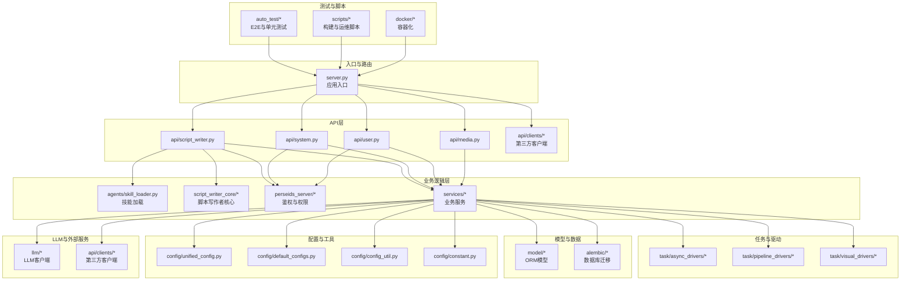
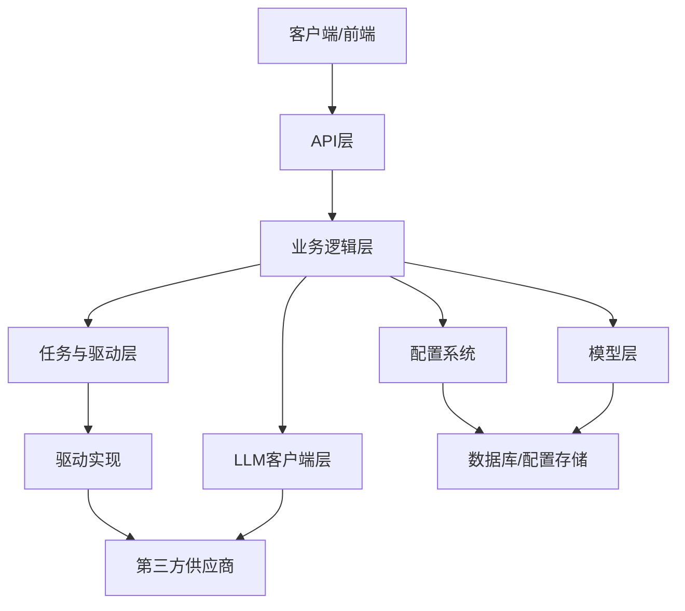
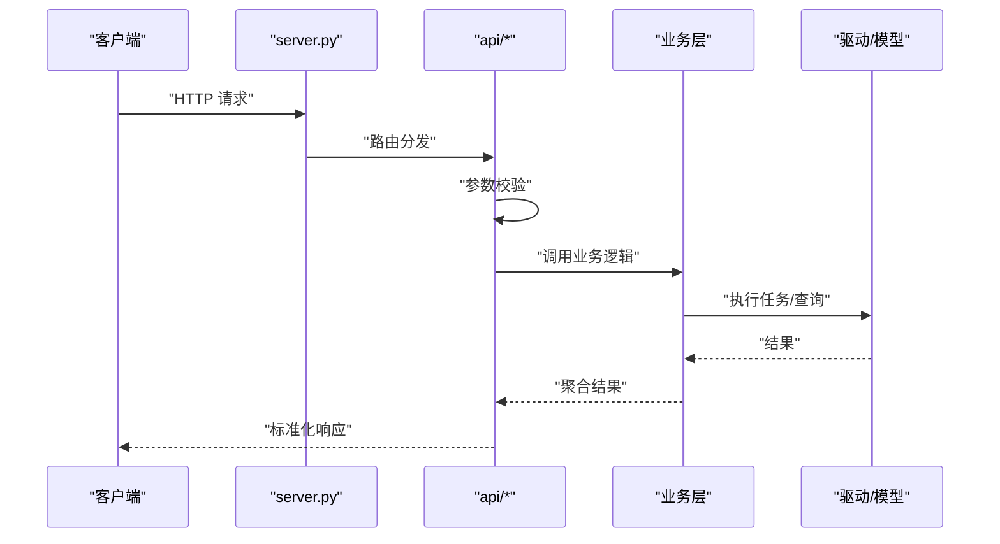
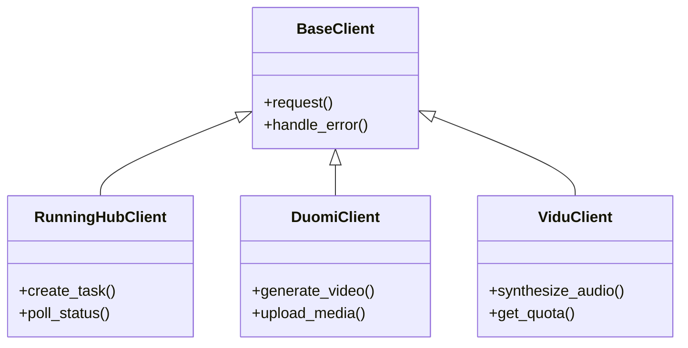
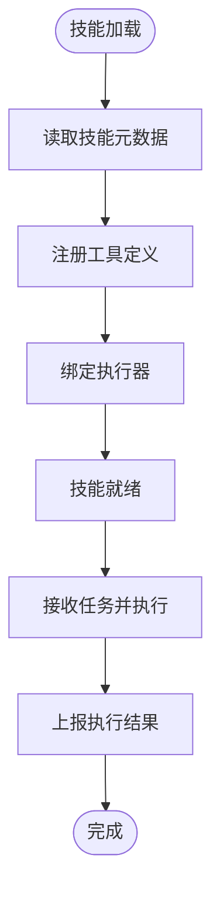
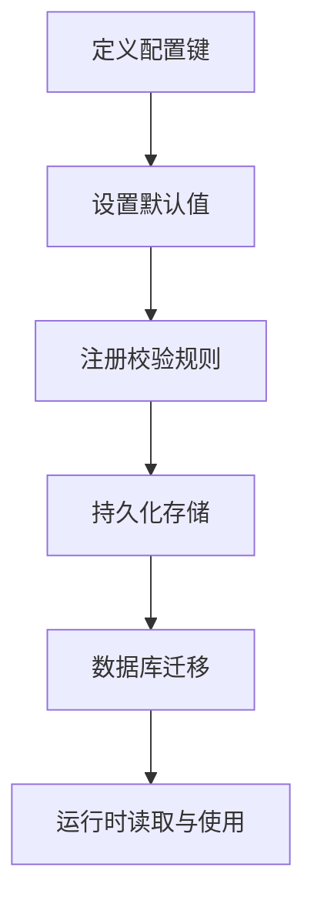
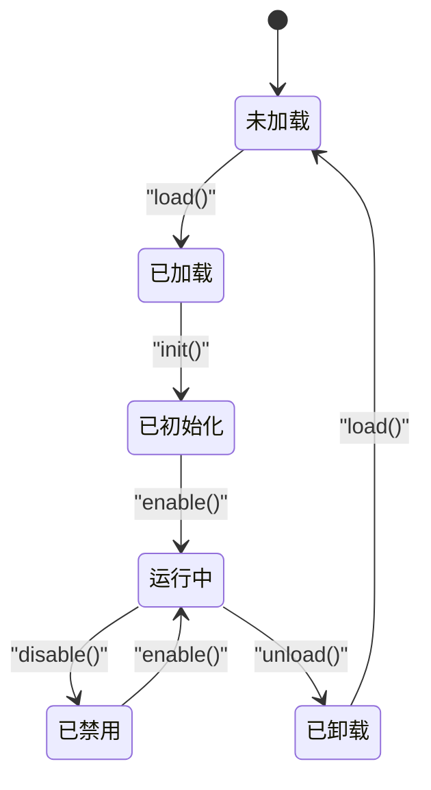
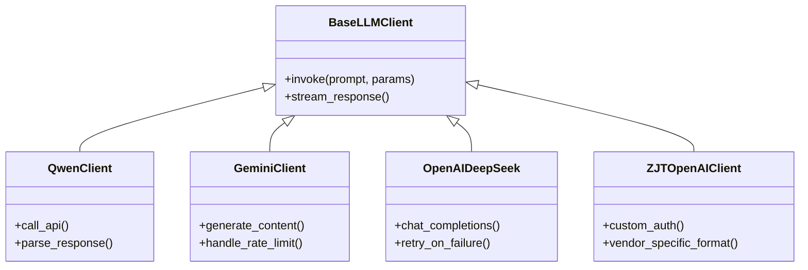
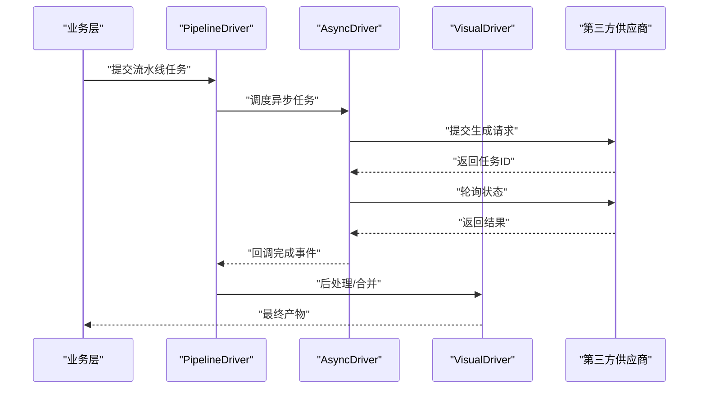
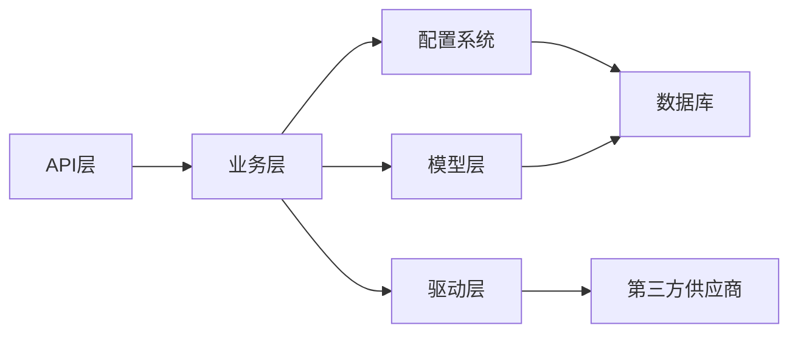

# 扩展开发指南

<cite>
**本文档引用的文件**
- [server.py](file://server.py)
- [skill_loader.py](file://agents/skill_loader.py)
- [script_writer.py](file://api/script_writer.py)
- [system.py](file://api/system.py)
- [user.py](file://api/user.py)
- [media.py](file://api/media.py)
- [unified_config.py](file://config/unified_config.py)
- [default_configs.py](file://config/default_configs.py)
- [constant.py](file://config/constant.py)
- [config_util.py](file://config/config_util.py)
- [20260504_create_skill_definitions.py](file://alembic/versions/20260504_create_skill_definitions.py)
- [20260401_add_zjt_token_config.py](file://alembic/versions/20260401_add_zjt_token_config.py)
- [20260407_add_llm_qwen_config.py](file://alembic/versions/20260407_add_llm_qwen_config.py)
- [20260407_add_qwen_models.py](file://alembic/versions/20260407_add_qwen_models.py)
- [20260408_add_retry_count_to_location_multi_angle_tasks.py](file://alembic/versions/20260408_add_retry_count_to_location_multi_angle_tasks.py)
- [20260409_create_uncalculated_power.py](file://alembic/versions/20260409_create_uncalculated_power.py)
- [20260417_add_context_window_to_model.py](file://alembic/versions/20260417_add_context_window_to_model.py)
- [20260420_add_supports_thinking.py](file://alembic/versions/20260420_add_supports_thinking.py)
- [20260421_add_claude_haiku_model.py](file://alembic/versions/20260421_add_claude_haiku_model.py)
- [20260421_add_max_output_tokens_field.py](file://alembic/versions/20260421_add_max_output_tokens_field.py)
- [20260421_add_qwen_plus_model.py](file://alembic/versions/20260421_add_qwen_plus_model.py)
- [20260421_add_site0_api_aggregator_config.py](file://alembic/versions/20260421_add_site0_api_aggregator_config.py)
- [20260421_add_site0_implementation_power_config.py](file://alembic/versions/20260421_add_site0_implementation_power_config.py)
- [20260421_add_thinking_fields_to_agent_tasks.py](file://alembic/versions/20260421_add_thinking_fields_to_agent_tasks.py)
- [20260422_add_zjt_api_vendor_and_models.py](file://alembic/versions/20260422_add_zjt_api_vendor_and_models.py)
- [20260423_add_gpt_image_2_power_config.py](file://alembic/versions/20260423_add_gpt_image_2_power_config.py)
- [20260423_add_kling_and_veo3_duomi_power_config.py](file://alembic/versions/20260423_add_kling_and_veo3_duomi_power_config.py)
- [20260424_cleanup_qwen_stale_single_tier_billing.py](file://alembic/versions/20260424_cleanup_qwen_stale_single_tier_billing.py)
- [20260427_add_deepseek_vendor_and_models.py](file://alembic/versions/20260427_add_deepseek_vendor_and_models.py)
- [20260427_add_workflow_ratio_field.py](file://alembic/versions/20260427_add_workflow_ratio_field.py)
- [20260427_create_agent_verifications.py](file://alembic/versions/20260427_create_agent_verifications.py)
- [20260428_add_zjt_api_deepseek_models.py](file://alembic/versions/20260428_add_zjt_api_deepseek_models.py)
- [20260428_add_zjt_api_gpt55_model.py](file://alembic/versions/20260428_add_zjt_api_gpt55_model.py)
- [20260429_add_audio_video_path_to_ai_tools.py](file://alembic/versions/20260429_add_audio_video_path_to_ai_tools.py)
- [20260504_create_skill_definitions.py](file://alembic/versions/20260504_create_skill_definitions.py)
- [20260508_create_notifications.py](file://alembic/versions/20260508_create_notifications.py)
- [20260509_opt_ai_tools_idx.py](file://alembic/versions/20260509_opt_ai_tools_idx.py)
- [20260511_add_session_type_to_chat_sessions.py](file://alembic/versions/20260511_add_session_type_to_chat_sessions.py)
- [20260511_add_supports_vl_to_model.py](file://alembic/versions/20260511_add_supports_vl_to_model.py)
- [20260512_add_image_urls_to_agent_tasks.py](file://alembic/versions/20260512_add_image_urls_to_agent_tasks.py)
- [20260513_add_title_to_chat_sessions.py](file://alembic/versions/20260513_add_title_to_chat_sessions.py)
- [20260515_create_user_preferences.py](file://alembic/versions/20260515_create_user_preferences.py)
- [20260519_add_edition_shared_space_config.py](file://alembic/versions/20260519_add_edition_shared_space_config.py)
- [20260519_add_local_path_hash_to_media_file_mapping.py](file://alembic/versions/20260519_add_local_path_hash_to_media_file_mapping.py)
- [20260520_add_zjt_api_doubao_models.py](file://alembic/versions/20260520_add_zjt_api_doubao_models.py)
- [20260521_create_runninghub_async_tasks.py](file://alembic/versions/20260521_create_runninghub_async_tasks.py)
- [20260522_add_label_to_media_file_mapping.py](file://alembic/versions/20260522_add_label_to_media_file_mapping.py)
- [20260524_deepseek_v4_pro_price_cut.py](file://alembic/versions/20260524_deepseek_v4_pro_price_cut.py)
- [20260526_add_upload_max_video_size_config.py](file://alembic/versions/20260526_add_upload_max_video_size_config.py)
- [20260526_async_slot_support.py](file://alembic/versions/20260526_async_slot_support.py)
- [20260527_001_merge_pipeline_steps.py](file://alembic/versions/20260527_001_merge_pipeline_steps.py)
- [20260528_add_video_audio_urls_to_agent_tasks.py](file://alembic/versions/20260528_add_video_audio_urls_to_agent_tasks.py)
- [20260530_add_language_to_agent_tasks.py](file://alembic/versions/20260530_add_language_to_agent_tasks.py)
- [base_llm_client.py](file://llm/base_llm_client.py)
- [qwen.py](file://llm/qwen.py)
- [gemini_client.py](file://llm/gemini_client.py)
- [openai_deepseek.py](file://llm/openai_deepseek.py)
- [llm_client_factory.py](file://llm/llm_client_factory.py)
- [zjt_openai_client.py](file://llm/zjt_openai_client.py)
- [runninghub_client.py](file://api/clients/runninghub_client.py)
- [duomi_client.py](file://api/clients/duomi_client.py)
- [vidu_client.py](file://api/clients/vidu_client.py)
- [base_async_driver.py](file://task/async_drivers/base_async_driver.py)
- [base_pipeline_driver.py](file://task/pipeline_drivers/base_pipeline_driver.py)
- [driver_factory.py](file://task/visual_drivers/driver_factory.py)
- [base_video_driver.py](file://task/visual_drivers/base_video_driver.py)
- [test_marketing_agent.py](file://auto_test/e2e/test_marketing_agent.py)
- [test_marketing_agent_api.py](file://auto_test/e2e/test_marketing_agent_api.py)
- [test_script_writer.py](file://auto_test/e2e/test_script_writer.py)
- [test_script_writer_api.py](file://auto_test/e2e/test_script_writer_api.py)
- [test_config.example.json](file://auto_test/test_config.example.json)
- [context_config.json](file://auto_test/context_config.json)
- [setup_test_env.py](file://auto_test/setup_test_env.py)
- [generate_report.py](file://auto_test/generate_report.py)
- [merge_test_cases.py](file://auto_test/merge_test_cases.py)
- [check_duplicate_ids.py](file://auto_test/check_duplicate_ids.py)
- [run_tests.sh](file://scripts/testing/run_tests.sh)
- [run_unit_tests.py](file://scripts/testing/run_unit_tests.py)
- [run_docker_tests.sh](file://scripts/testing/run_docker_tests.sh)
- [run_migrations.sh](file://scripts/migration/run_migrations.sh)
- [package.py](file://scripts/package.py)
- [launch_mac.py](file://scripts/launchers/launcher_mac.py)
- [start_mac.py](file://scripts/launchers/start_mac.py)
- [stop_by_pid.py](file://scripts/launchers/stop_by_pid.py)
- [docker-compose.yml](file://docker/docker-compose.yml)
- [Dockerfile](file://docker/Dockerfile)
- [mysql/my.cnf](file://docker/mysql/my.cnf)
- [admin_panels.md](file://docs/admin_panels.md)
- [unified_config_system.md](file://docs/backend/unified_config_system.md)
- [e2e_testing.md](file://docs/e2e_testing.md)
- [Windows启动开发说明.md](file://docs/Windows启动开发说明.md)
- [database_migration.md](file://docs/database_migration.md)
- [dev_debug_guide.md](file://docs/dev_debug_guide.md)
- [notification_system.md](file://docs/notification_system.md)
- [权限系统设计.md](file://docs/权限系统/权限系统设计.md)
- [function-permission-codes.md](file://docs/权限系统/function-permission-codes.md)
- [权限装饰器使用说明.md](file://docs/权限系统/权限装饰器使用说明.md)
</cite>

## 目录
1. [简介](#简介)
2. [项目结构](#项目结构)
3. [核心组件](#核心组件)
4. [架构总览](#架构总览)
5. [详细组件分析](#详细组件分析)
6. [依赖关系分析](#依赖关系分析)
7. [性能考虑](#性能考虑)
8. [故障排除指南](#故障排除指南)
9. [结论](#结论)
10. [附录](#附录)

## 简介
本指南面向希望在ZhiJuTong（智聚通）平台上进行扩展开发的工程师与产品人员。文档覆盖从需求分析到部署上线的完整流程，重点包括：
- 新功能开发流程：需求分析、架构设计、模块划分、接口定义
- API扩展方法：新增端点、参数校验、响应格式设计
- 第三方集成：外部服务接入、SDK使用、适配器模式应用
- 智能体技能开发：技能定义、工具集成、执行器实现
- 配置系统扩展：新增配置项、默认值与校验规则
- 插件系统开发：接口设计、生命周期管理、动态加载
- 测试与部署：扩展测试方法与部署注意事项

## 项目结构
ZhiJuTong采用分层清晰的后端架构，前端通过Web页面与API交互，后端以Flask应用为核心，围绕模型层、服务层、任务层、LLM客户端层、API层、配置层、脚本与自动化测试等模块协同工作。

**图表来源**
- [server.py](file://server.py)
- [script_writer.py](file://api/script_writer.py)
- [system.py](file://api/system.py)
- [user.py](file://api/user.py)
- [media.py](file://api/media.py)
- [skill_loader.py](file://agents/skill_loader.py)
- [unified_config.py](file://config/unified_config.py)
- [default_configs.py](file://config/default_configs.py)
- [config_util.py](file://config/config_util.py)
- [constant.py](file://config/constant.py)
- [base_async_driver.py](file://task/async_drivers/base_async_driver.py)
- [base_pipeline_driver.py](file://task/pipeline_drivers/base_pipeline_driver.py)
- [driver_factory.py](file://task/visual_drivers/driver_factory.py)
- [base_video_driver.py](file://task/visual_drivers/base_video_driver.py)
- [base_llm_client.py](file://llm/base_llm_client.py)
- [runninghub_client.py](file://api/clients/runninghub_client.py)
- [docker-compose.yml](file://docker/docker-compose.yml)
- [Dockerfile](file://docker/Dockerfile)

**章节来源**
- [server.py](file://server.py)
- [docker-compose.yml](file://docker/docker-compose.yml)
- [Dockerfile](file://docker/Dockerfile)

## 核心组件
- 应用入口与路由：server.py负责注册蓝图、中间件与静态资源，统一处理请求与响应。
- API层：提供脚本写作者、系统管理、用户管理、媒体处理等REST接口。
- 业务逻辑层：智能体技能加载、脚本写作者核心、鉴权与权限服务、通用业务服务。
- 任务与驱动：异步任务驱动、流水线驱动、视觉生成驱动，支持多种供应商与模型。
- 配置系统：统一配置管理、默认配置、配置工具与常量定义。
- LLM与第三方：多厂商LLM客户端、第三方SDK封装与适配器。
- 测试与脚本：E2E与单元测试框架、自动化测试脚本、数据库迁移脚本、打包与部署脚本。

**章节来源**
- [server.py](file://server.py)
- [script_writer.py](file://api/script_writer.py)
- [system.py](file://api/system.py)
- [user.py](file://api/user.py)
- [media.py](file://api/media.py)
- [skill_loader.py](file://agents/skill_loader.py)
- [unified_config.py](file://config/unified_config.py)
- [default_configs.py](file://config/default_configs.py)
- [config_util.py](file://config/config_util.py)
- [constant.py](file://config/constant.py)

## 架构总览
系统采用“API层-业务层-任务层-模型层”的分层架构，配合配置中心与LLM适配器，形成可扩展的插件式能力体系。第三方服务通过客户端适配器统一接入，任务通过驱动层解耦具体实现。

**图表来源**
- [server.py](file://server.py)
- [script_writer.py](file://api/script_writer.py)
- [skill_loader.py](file://agents/skill_loader.py)
- [unified_config.py](file://config/unified_config.py)
- [base_async_driver.py](file://task/async_drivers/base_async_driver.py)
- [base_pipeline_driver.py](file://task/pipeline_drivers/base_pipeline_driver.py)
- [base_llm_client.py](file://llm/base_llm_client.py)

## 详细组件分析

### API扩展方法
新增API端点的推荐流程：
1. 在对应API模块中定义路由与视图函数，遵循现有命名与目录组织。
2. 参数校验：使用请求解析与Schema校验，确保输入安全与一致性。
3. 响应格式：统一返回结构，包含状态码、消息与数据体，便于前端消费。
4. 权限控制：通过权限装饰器或中间件限制访问范围。
5. 文档与测试：补充接口文档与单元/E2E测试。

**图表来源**
- [server.py](file://server.py)
- [script_writer.py](file://api/script_writer.py)
- [system.py](file://api/system.py)
- [user.py](file://api/user.py)
- [media.py](file://api/media.py)

**章节来源**
- [script_writer.py](file://api/script_writer.py)
- [system.py](file://api/system.py)
- [user.py](file://api/user.py)
- [media.py](file://api/media.py)

### 第三方集成指南
- 外部服务接入：在api/clients目录下新增客户端类，封装SDK调用与错误处理。
- SDK使用：遵循适配器模式，统一方法签名与异常转换。
- 适配器模式：抽象接口与具体实现分离，便于替换与扩展。

**图表来源**
- [runninghub_client.py](file://api/clients/runninghub_client.py)
- [duomi_client.py](file://api/clients/duomi_client.py)
- [vidu_client.py](file://api/clients/vidu_client.py)

**章节来源**
- [runninghub_client.py](file://api/clients/runninghub_client.py)
- [duomi_client.py](file://api/clients/duomi_client.py)
- [vidu_client.py](file://api/clients/vidu_client.py)

### 智能体技能开发
- 技能定义：在agents/skills目录下创建技能包，提供技能元信息与执行入口。
- 工具集成：通过工具定义与执行器实现具体动作。
- 执行器实现：遵循统一接口，支持参数校验、并发控制与结果回传。

**图表来源**
- [skill_loader.py](file://agents/skill_loader.py)

**章节来源**
- [skill_loader.py](file://agents/skill_loader.py)

### 配置系统扩展
- 新增配置项：在配置模块中定义键名、默认值与类型，并在配置工具中注册校验规则。
- 默认值设置：集中于default_configs.py，保证初始化一致性。
- 验证规则：通过config_util.py中的校验器对输入进行约束。
- 数据库迁移：通过alembic版本化迁移添加新表或字段。

**图表来源**
- [unified_config.py](file://config/unified_config.py)
- [default_configs.py](file://config/default_configs.py)
- [config_util.py](file://config/config_util.py)
- [constant.py](file://config/constant.py)

**章节来源**
- [unified_config.py](file://config/unified_config.py)
- [default_configs.py](file://config/default_configs.py)
- [config_util.py](file://config/config_util.py)
- [constant.py](file://config/constant.py)
- [20260401_add_zjt_token_config.py](file://alembic/versions/20260401_add_zjt_token_config.py)
- [20260407_add_llm_qwen_config.py](file://alembic/versions/20260407_add_llm_qwen_config.py)
- [20260504_create_skill_definitions.py](file://alembic/versions/20260504_create_skill_definitions.py)

### 插件系统开发
- 接口设计：定义插件基类与生命周期钩子，确保统一行为。
- 生命周期管理：支持加载、初始化、启用、禁用与卸载。
- 动态加载：通过工厂或注册表机制按需加载插件。

**图表来源**
- [skill_loader.py](file://agents/skill_loader.py)

**章节来源**
- [skill_loader.py](file://agents/skill_loader.py)

### LLM客户端与适配器
- 客户端工厂：根据供应商与模型选择合适的客户端实现。
- 适配器模式：统一请求格式与响应解析，屏蔽底层差异。
- 多厂商支持：Qwen、Gemini、DeepSeek、Claude等。

**图表来源**
- [base_llm_client.py](file://llm/base_llm_client.py)
- [qwen.py](file://llm/qwen.py)
- [gemini_client.py](file://llm/gemini_client.py)
- [openai_deepseek.py](file://llm/openai_deepseek.py)
- [zjt_openai_client.py](file://llm/zjt_openai_client.py)
- [llm_client_factory.py](file://llm/llm_client_factory.py)

**章节来源**
- [base_llm_client.py](file://llm/base_llm_client.py)
- [qwen.py](file://llm/qwen.py)
- [gemini_client.py](file://llm/gemini_client.py)
- [openai_deepseek.py](file://llm/openai_deepseek.py)
- [zjt_openai_client.py](file://llm/zjt_openai_client.py)
- [llm_client_factory.py](file://llm/llm_client_factory.py)

### 任务与驱动系统
- 异步任务驱动：处理长时间运行的任务，支持重试与状态轮询。
- 流水线驱动：编排多个步骤，确保顺序与依赖满足。
- 视觉生成驱动：对接不同供应商的视频/图像生成能力。

**图表来源**
- [base_pipeline_driver.py](file://task/pipeline_drivers/base_pipeline_driver.py)
- [base_async_driver.py](file://task/async_drivers/base_async_driver.py)
- [driver_factory.py](file://task/visual_drivers/driver_factory.py)
- [base_video_driver.py](file://task/visual_drivers/base_video_driver.py)

**章节来源**
- [base_pipeline_driver.py](file://task/pipeline_drivers/base_pipeline_driver.py)
- [base_async_driver.py](file://task/async_drivers/base_async_driver.py)
- [driver_factory.py](file://task/visual_drivers/driver_factory.py)
- [base_video_driver.py](file://task/visual_drivers/base_video_driver.py)

## 依赖关系分析
- 组件耦合：API层依赖业务层；业务层依赖配置、模型与驱动；驱动依赖供应商SDK。
- 外部依赖：数据库、第三方API、容器环境。
- 可能的循环依赖：避免在API与业务之间直接互相导入，通过服务层解耦。

**图表来源**
- [server.py](file://server.py)
- [unified_config.py](file://config/unified_config.py)
- [base_async_driver.py](file://task/async_drivers/base_async_driver.py)
- [runninghub_client.py](file://api/clients/runninghub_client.py)

**章节来源**
- [server.py](file://server.py)
- [unified_config.py](file://config/unified_config.py)
- [base_async_driver.py](file://task/async_drivers/base_async_driver.py)
- [runninghub_client.py](file://api/clients/runninghub_client.py)

## 性能考虑
- 缓存策略：利用配置系统与统计缓存减少重复计算与查询。
- 并发控制：在任务驱动层合理设置并发度与重试策略。
- 资源复用：LLM客户端与第三方SDK连接池化，降低握手成本。
- 监控与告警：结合日志与指标，及时发现性能瓶颈。

## 故障排除指南
- 配置问题：检查配置项是否正确加载，校验规则是否生效。
- API错误：查看统一响应结构中的错误码与消息，定位具体模块。
- 任务失败：检查异步任务状态轮询与重试逻辑。
- 第三方异常：捕获SDK异常并转换为统一错误格式。

**章节来源**
- [config_util.py](file://config/config_util.py)
- [base_async_driver.py](file://task/async_drivers/base_async_driver.py)
- [runninghub_client.py](file://api/clients/runninghub_client.py)

## 结论
通过本指南，开发者可以系统性地在ZhiJuTong平台上进行扩展开发。建议严格遵循模块划分、接口定义与测试规范，确保扩展的稳定性与可维护性。

## 附录

### 扩展开发流程清单
- 需求分析：明确目标、边界与验收标准
- 架构设计：确定模块边界与接口契约
- 模块划分：按职责拆分，避免过度耦合
- 接口定义：统一参数与响应格式
- 实现与测试：编写单元与E2E测试
- 部署与监控：容器化与CI/CD集成

### API扩展最佳实践
- 使用现有蓝图与中间件，保持一致的认证与权限控制
- 参数校验前置，拒绝非法输入
- 响应结构标准化，便于前端消费
- 错误处理统一，提供有意义的错误信息

### 第三方集成最佳实践
- 封装SDK为适配器，隐藏供应商差异
- 统一异常处理与重试策略
- 记录调用日志与指标，便于追踪与优化

### 智能体技能开发最佳实践
- 抽象技能接口，统一工具注册与执行
- 支持参数校验与并发控制
- 提供可观测性与可调试性

### 配置系统扩展最佳实践
- 明确配置键、默认值与校验规则
- 通过迁移脚本安全变更数据库结构
- 分离运行时配置与静态配置

### 插件系统开发最佳实践
- 定义清晰的生命周期钩子
- 支持动态加载与热插拔
- 提供插件间通信与隔离机制

### 测试与部署注意事项
- 单元测试：覆盖核心逻辑与边界条件
- E2E测试：模拟真实用户场景
- 自动化测试：集成到CI/CD流水线
- 容器化：使用Docker与Compose简化部署
- 数据库迁移：确保向后兼容与回滚策略

**章节来源**
- [test_marketing_agent.py](file://auto_test/e2e/test_marketing_agent.py)
- [test_marketing_agent_api.py](file://auto_test/e2e/test_marketing_agent_api.py)
- [test_script_writer.py](file://auto_test/e2e/test_script_writer.py)
- [test_script_writer_api.py](file://auto_test/e2e/test_script_writer_api.py)
- [run_tests.sh](file://scripts/testing/run_tests.sh)
- [run_unit_tests.py](file://scripts/testing/run_unit_tests.py)
- [run_docker_tests.sh](file://scripts/testing/run_docker_tests.sh)
- [run_migrations.sh](file://scripts/migration/run_migrations.sh)
- [docker-compose.yml](file://docker/docker-compose.yml)
- [Dockerfile](file://docker/Dockerfile)
- [package.py](file://scripts/package.py)