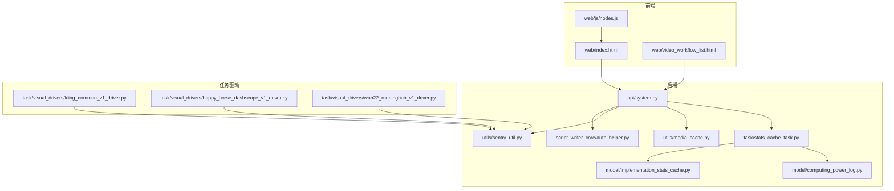
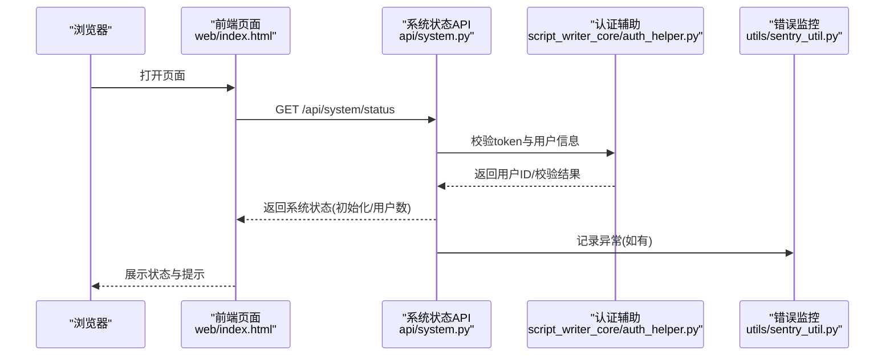
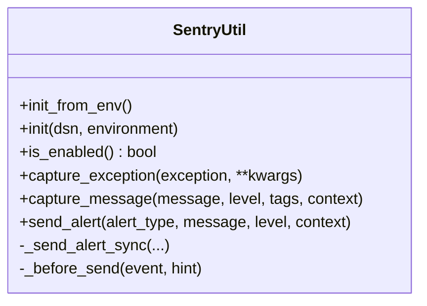
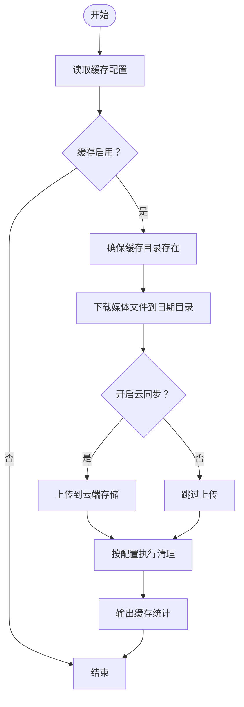
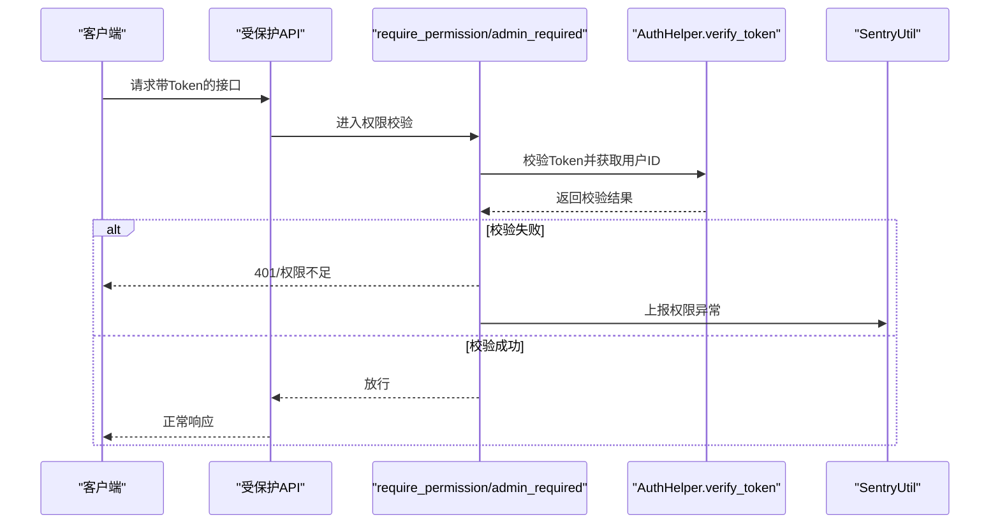
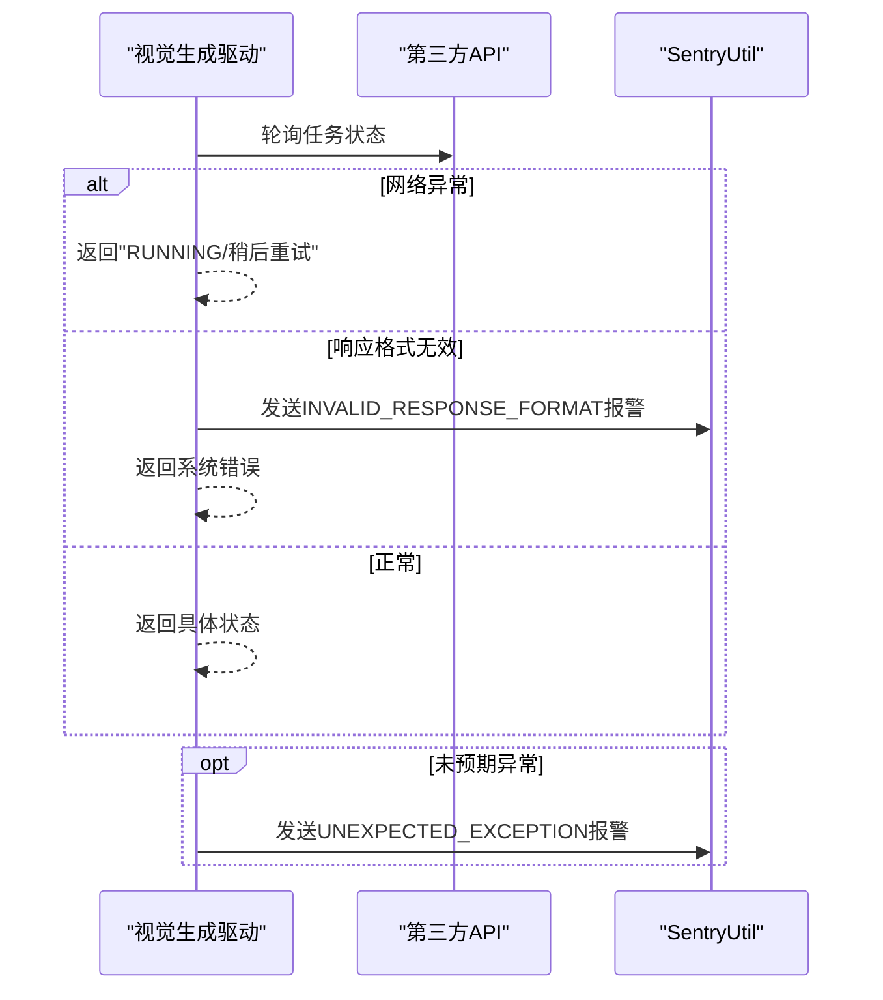
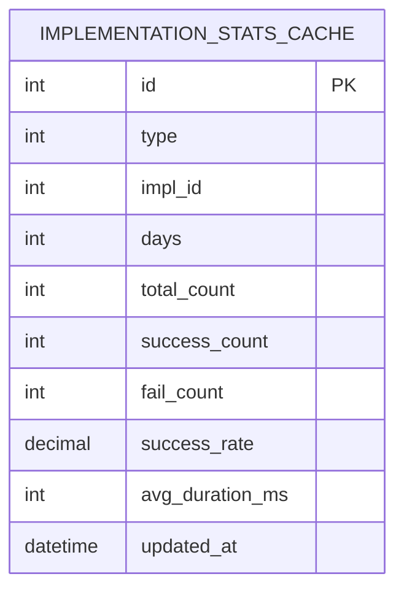
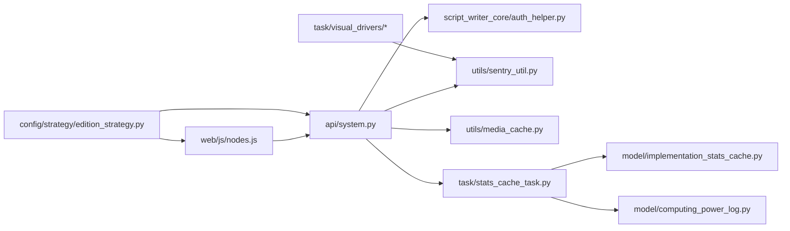

# 故障排除指南

<cite>
**本文引用的文件**
- [sentry_util.py](file://utils/sentry_util.py)
- [nodes.js](file://web/js/nodes.js)
- [media_cache.py](file://utils/media_cache.py)
- [权限装饰器使用说明.md](file://docs/权限系统/权限装饰器使用说明.md)
- [auth_helper.py](file://script_writer_core/auth_helper.py)
- [system.py](file://api/system.py)
- [kling_common_v1_driver.py](file://task/visual_drivers/kling_common_v1_driver.py)
- [happy_horse_dashscope_v1_driver.py](file://task/visual_drivers/happy_horse_dashscope_v1_driver.py)
- [wan22_runninghub_v1_driver.py](file://task/visual_drivers/wan22_runninghub_v1_driver.py)
- [stats_cache_task.py](file://task/stats_cache_task.py)
- [computing_power_log.py](file://model/computing_power_log.py)
- [implementation_stats_cache.py](file://model/implementation_stats_cache.py)
- [媒体文件缓存管理方案.md](file://docs/媒体文件缓存管理方案.md)
- [edition_strategy.py](file://config/strategy/edition_strategy.py)
- [video_workflow_list.html](file://web/video_workflow_list.html)
- [index.html](file://web/index.html)
</cite>

## 目录
1. [简介](#简介)
2. [项目结构](#项目结构)
3. [核心组件](#核心组件)
4. [架构总览](#架构总览)
5. [详细组件分析](#详细组件分析)
6. [依赖关系分析](#依赖关系分析)
7. [性能与资源问题排查](#性能与资源问题排查)
8. [日志与监控](#日志与监控)
9. [常见问题分类与诊断流程](#常见问题分类与诊断流程)
10. [应急处理流程](#应急处理流程)
11. [问题报告模板与社区求助](#问题报告模板与社区求助)
12. [结论](#结论)

## 简介
本指南面向ZhiJuTong项目的运维与开发人员，提供系统化的问题分类、日志分析方法、常见错误诊断流程、监控告警使用以及应急处理步骤。覆盖数据库连接问题、API调用失败、文件上传异常、权限验证错误等场景，并结合现有Sentry错误监控、任务状态检查与缓存策略，帮助快速定位与恢复。

## 项目结构
围绕故障排除的关键模块与文件：
- 错误监控与告警：utils/sentry_util.py
- 前端错误展示与截断：web/js/nodes.js
- 媒体缓存与上传策略：utils/media_cache.py、docs/媒体文件缓存管理方案.md
- 权限与认证：docs/权限系统/权限装饰器使用说明.md、script_writer_core/auth_helper.py
- 系统状态与健康检查：api/system.py
- 视频生成任务驱动与状态检查：task/visual_drivers/*.py
- 统计与缓存：task/stats_cache_task.py、model/implementation_stats_cache.py、model/computing_power_log.py
- 版本与社区版标识：config/strategy/edition_strategy.py
- 前端页面与交互：web/index.html、web/video_workflow_list.html

图表来源
- [system.py:1-49](file://api/system.py#L1-L49)
- [auth_helper.py:1-40](file://script_writer_core/auth_helper.py#L1-L40)
- [sentry_util.py:1-235](file://utils/sentry_util.py#L1-L235)
- [media_cache.py:1-62](file://utils/media_cache.py#L1-L62)
- [stats_cache_task.py:40-51](file://task/stats_cache_task.py#L40-L51)
- [implementation_stats_cache.py:124-141](file://model/implementation_stats_cache.py#L124-L141)
- [computing_power_log.py:205-236](file://model/computing_power_log.py#L205-L236)
- [kling_common_v1_driver.py:353-382](file://task/visual_drivers/kling_common_v1_driver.py#L353-L382)
- [happy_horse_dashscope_v1_driver.py:650-777](file://task/visual_drivers/happy_horse_dashscope_v1_driver.py#L650-L777)
- [wan22_runninghub_v1_driver.py:495-527](file://task/visual_drivers/wan22_runninghub_v1_driver.py#L495-L527)

章节来源
- [system.py:1-49](file://api/system.py#L1-L49)
- [media_cache.py:1-62](file://utils/media_cache.py#L1-L62)
- [sentry_util.py:1-235](file://utils/sentry_util.py#L1-L235)

## 核心组件
- 错误监控与告警：SentryUtil封装了初始化、异常捕获、消息上报与报警发送，支持异步线程发送避免阻塞。
- 媒体缓存与上传：MediaCacheManager负责下载、缓存、清理与云端同步，支持按天数与容量限制清理。
- 权限与认证：权限装饰器文档描述了使用方式与后续实现计划；认证辅助类提供token校验与用户ID解析。
- 任务驱动与状态检查：多个视觉生成驱动对网络异常与响应格式进行处理，并在异常时发送Sentry报警。
- 统计与缓存：统计缓存任务定期刷新实现成功率与耗时，数据库模型定义统计缓存表结构。
- 健康检查：系统状态API返回初始化状态与用户总数，便于快速判断系统可用性。

章节来源
- [sentry_util.py:1-235](file://utils/sentry_util.py#L1-L235)
- [media_cache.py:1-62](file://utils/media_cache.py#L1-L62)
- [权限装饰器使用说明.md:1-222](file://docs/权限系统/权限装饰器使用说明.md#L1-L222)
- [auth_helper.py:1-40](file://script_writer_core/auth_helper.py#L1-L40)
- [kling_common_v1_driver.py:353-382](file://task/visual_drivers/kling_common_v1_driver.py#L353-L382)
- [happy_horse_dashscope_v1_driver.py:650-777](file://task/visual_drivers/happy_horse_dashscope_v1_driver.py#L650-L777)
- [wan22_runninghub_v1_driver.py:495-527](file://task/visual_drivers/wan22_runninghub_v1_driver.py#L495-L527)
- [stats_cache_task.py:40-51](file://task/stats_cache_task.py#L40-L51)
- [implementation_stats_cache.py:124-141](file://model/implementation_stats_cache.py#L124-L141)
- [computing_power_log.py:205-236](file://model/computing_power_log.py#L205-L236)
- [system.py:1-49](file://api/system.py#L1-L49)

## 架构总览
系统采用前后端分离，后端通过FastAPI提供REST接口，前端通过JavaScript与后端交互。错误监控贯穿API层与任务驱动层，媒体缓存策略在生成完成后落地本地并可选上传至云存储。权限与认证在API入口处进行校验，系统状态接口用于健康检查。

图表来源
- [system.py:1-49](file://api/system.py#L1-L49)
- [auth_helper.py:1-40](file://script_writer_core/auth_helper.py#L1-L40)
- [sentry_util.py:1-235](file://utils/sentry_util.py#L1-L235)
- [index.html:8053-8088](file://web/index.html#L8053-L8088)

## 详细组件分析

### 错误监控与告警（SentryUtil）
- 初始化：支持从动态配置或环境变量加载DSN，设置环境名，禁用自动集成，自定义发送前过滤。
- 异常捕获：capture_exception支持附加上下文，便于定位问题。
- 消息上报：capture_message支持标签与上下文，便于分类与检索。
- 报警发送：send_alert使用后台线程发送，避免因Sentry不可达导致主线程阻塞。
- 关键点：is_enabled用于运行时开关；_before_send用于敏感信息过滤。

图表来源
- [sentry_util.py:1-235](file://utils/sentry_util.py#L1-L235)

章节来源
- [sentry_util.py:1-235](file://utils/sentry_util.py#L1-L235)

### 媒体缓存与上传策略（MediaCacheManager）
- 配置项：启用开关、缓存目录、保留天数、最大容量、启动时清理、清理周期等。
- 功能：下载媒体文件到按日期组织的缓存目录，支持云端存储同步。
- 清理策略：按天数清理过期文件；按容量删除最早文件；启动时可执行清理。
- 依赖：配置读取、文件存储工厂、CDN同步。

图表来源
- [media_cache.py:1-62](file://utils/media_cache.py#L1-L62)
- [媒体文件缓存管理方案.md:1-53](file://docs/媒体文件缓存管理方案.md#L1-L53)

章节来源
- [media_cache.py:1-62](file://utils/media_cache.py#L1-L62)
- [媒体文件缓存管理方案.md:1-53](file://docs/媒体文件缓存管理方案.md#L1-L53)

### 权限与认证（装饰器与辅助）
- 权限装饰器：require_permission与admin_required用于API权限控制，支持“任一”或“全部”权限模式。
- 认证辅助：AuthHelper.verify_token通过外部服务校验token并获取用户ID，支持可选的用户ID与世界ID一致性校验。
- 注意：权限装饰器当前为占位实现，后续需接入认证系统与权限查询。

图表来源
- [权限装饰器使用说明.md:1-222](file://docs/权限系统/权限装饰器使用说明.md#L1-L222)
- [auth_helper.py:1-40](file://script_writer_core/auth_helper.py#L1-L40)
- [sentry_util.py:1-235](file://utils/sentry_util.py#L1-L235)

章节来源
- [权限装饰器使用说明.md:1-222](file://docs/权限系统/权限装饰器使用说明.md#L1-L222)
- [auth_helper.py:1-40](file://script_writer_core/auth_helper.py#L1-L40)

### 任务驱动与状态检查（视觉生成驱动）
- 网络异常处理：对ConnectionError/TimeoutError返回“运行中/稍后重试”，避免直接失败。
- 响应格式校验：若响应格式无效，发送“INVALID_RESPONSE_FORMAT”报警并返回系统错误。
- 未预期异常：记录错误与堆栈，发送“UNEXPECTED_EXCEPTION”报警并返回系统错误。
- 典型驱动：Kling、Happy Horse、Wan22等。

图表来源
- [kling_common_v1_driver.py:353-382](file://task/visual_drivers/kling_common_v1_driver.py#L353-L382)
- [happy_horse_dashscope_v1_driver.py:650-777](file://task/visual_drivers/happy_horse_dashscope_v1_driver.py#L650-L777)
- [wan22_runninghub_v1_driver.py:495-527](file://task/visual_drivers/wan22_runninghub_v1_driver.py#L495-L527)
- [sentry_util.py:1-235](file://utils/sentry_util.py#L1-L235)

章节来源
- [kling_common_v1_driver.py:353-382](file://task/visual_drivers/kling_common_v1_driver.py#L353-L382)
- [happy_horse_dashscope_v1_driver.py:650-777](file://task/visual_drivers/happy_horse_dashscope_v1_driver.py#L650-L777)
- [wan22_runninghub_v1_driver.py:495-527](file://task/visual_drivers/wan22_runninghub_v1_driver.py#L495-L527)

### 统计与缓存（实现成功率与耗时）
- 统计缓存任务：定时刷新指定天数的实现统计（成功/失败次数、成功率、平均耗时）。
- 数据库表：implementation_stats_cache，唯一索引(type, impl_id, days)，包含更新时间字段。
- 计费日志：computing_power_log记录扣减/增加行为与时间跨度，用于活跃用户统计等。

图表来源
- [implementation_stats_cache.py:124-141](file://model/implementation_stats_cache.py#L124-L141)

章节来源
- [stats_cache_task.py:40-51](file://task/stats_cache_task.py#L40-L51)
- [implementation_stats_cache.py:124-141](file://model/implementation_stats_cache.py#L124-L141)
- [computing_power_log.py:205-236](file://model/computing_power_log.py#L205-L236)

## 依赖关系分析
- 前端依赖后端API与Sentry（通过错误上报），并使用nodes.js对错误信息进行截断与关键字段提取。
- 后端API依赖认证辅助与Sentry；任务驱动依赖Sentry进行报警；统计任务依赖数据库表结构。
- 社区版标识影响前端展示与统计呈现逻辑。

图表来源
- [nodes.js:1-37](file://web/js/nodes.js#L1-L37)
- [system.py:1-49](file://api/system.py#L1-L49)
- [auth_helper.py:1-40](file://script_writer_core/auth_helper.py#L1-L40)
- [sentry_util.py:1-235](file://utils/sentry_util.py#L1-L235)
- [media_cache.py:1-62](file://utils/media_cache.py#L1-L62)
- [stats_cache_task.py:40-51](file://task/stats_cache_task.py#L40-L51)
- [implementation_stats_cache.py:124-141](file://model/implementation_stats_cache.py#L124-L141)
- [computing_power_log.py:205-236](file://model/computing_power_log.py#L205-L236)
- [edition_strategy.py:48-60](file://config/strategy/edition_strategy.py#L48-L60)

章节来源
- [nodes.js:1-37](file://web/js/nodes.js#L1-L37)
- [system.py:1-49](file://api/system.py#L1-L49)
- [edition_strategy.py:48-60](file://config/strategy/edition_strategy.py#L48-L60)

## 性能与资源问题排查
- 网络超时：任务驱动对ConnectionError/TimeoutError进行降级处理，返回“运行中/稍后重试”。建议检查第三方API可用性、网络连通性与超时阈值。
- 内存不足：关注任务驱动与统计任务的日志，确认是否存在大量并发任务导致峰值内存升高；必要时降低并发或扩容。
- 磁盘空间：媒体缓存清理策略按天数与容量限制执行；若磁盘持续告急，缩短max_days或增大max_size_gb，或人工触发清理。
- 进程冲突：检查任务调度与锁机制（如文件锁、数据库锁），避免重复执行；观察统计任务与缓存刷新的执行频率。

章节来源
- [kling_common_v1_driver.py:353-382](file://task/visual_drivers/kling_common_v1_driver.py#L353-L382)
- [happy_horse_dashscope_v1_driver.py:650-777](file://task/visual_drivers/happy_horse_dashscope_v1_driver.py#L650-L777)
- [wan22_runninghub_v1_driver.py:495-527](file://task/visual_drivers/wan22_runninghub_v1_driver.py#L495-L527)
- [media_cache.py:1-62](file://utils/media_cache.py#L1-L62)
- [stats_cache_task.py:40-51](file://task/stats_cache_task.py#L40-L51)

## 日志与监控
- 日志级别与解读
  - DEBUG/INFO：常规流程与统计信息。
  - WARNING：网络异常、格式校验失败、权限不足等可恢复问题。
  - ERROR：数据库连接失败、任务执行异常、Sentry初始化失败等严重问题。
- 关键错误信息识别
  - 响应格式错误：INVALID_RESPONSE_FORMAT报警，包含API名称与响应体上下文。
  - 未预期异常：UNEXPECTED_EXCEPTION报警，包含异常与堆栈。
  - 前端错误截断：nodes.js对过长错误信息进行截断，并尝试提取JSON中的message/failureReasons。
- 错误堆栈分析
  - 任务驱动在捕获异常时记录堆栈，便于定位具体调用链。
  - SentryUtil在send_alert中使用后台线程，避免阻塞主流程。
- 监控告警
  - Sentry：通过send_alert与capture_exception/capture_message上报，支持标签与上下文。
  - 社区版标识：edition_strategy控制前端展示差异，影响统计与成功率呈现。

章节来源
- [kling_common_v1_driver.py:353-382](file://task/visual_drivers/kling_common_v1_driver.py#L353-L382)
- [happy_horse_dashscope_v1_driver.py:650-777](file://task/visual_drivers/happy_horse_dashscope_v1_driver.py#L650-L777)
- [wan22_runninghub_v1_driver.py:495-527](file://task/visual_drivers/wan22_runninghub_v1_driver.py#L495-L527)
- [sentry_util.py:1-235](file://utils/sentry_util.py#L1-L235)
- [nodes.js:1-37](file://web/js/nodes.js#L1-L37)
- [edition_strategy.py:48-60](file://config/strategy/edition_strategy.py#L48-L60)

## 常见问题分类与诊断流程

### 数据库连接问题
- 现象：系统状态查询失败、统计任务刷新失败。
- 诊断步骤
  - 检查数据库连接参数与网络连通性。
  - 查看系统状态API的异常日志与Sentry报警。
  - 确认统计任务执行日志与数据库表结构。
- 临时措施：重启数据库连接池或服务实例；检查防火墙与端口。

章节来源
- [system.py:1-49](file://api/system.py#L1-L49)
- [stats_cache_task.py:40-51](file://task/stats_cache_task.py#L40-L51)
- [implementation_stats_cache.py:124-141](file://model/implementation_stats_cache.py#L124-L141)

### API调用失败
- 现象：第三方视觉生成API返回格式异常或超时。
- 诊断步骤
  - 检查任务驱动对网络异常与响应格式的处理逻辑。
  - 查看INVALID_RESPONSE_FORMAT与UNEXPECTED_EXCEPTION报警。
  - 对比实际响应与期望格式，定位字段缺失或类型不匹配。
- 临时措施：提高超时阈值、降低并发、切换备用站点。

章节来源
- [kling_common_v1_driver.py:353-382](file://task/visual_drivers/kling_common_v1_driver.py#L353-L382)
- [happy_horse_dashscope_v1_driver.py:650-777](file://task/visual_drivers/happy_horse_dashscope_v1_driver.py#L650-L777)
- [wan22_runninghub_v1_driver.py:495-527](file://task/visual_drivers/wan22_runninghub_v1_driver.py#L495-L527)

### 文件上传异常
- 现象：媒体文件无法缓存或上传至云端。
- 诊断步骤
  - 检查媒体缓存配置（启用、目录、容量、天数）。
  - 查看下载与上传日志，确认网络与权限。
  - 若启用云同步，检查云存储凭证与桶域名。
- 临时措施：关闭云同步、扩大缓存目录权限、清理过期文件释放空间。

章节来源
- [media_cache.py:1-62](file://utils/media_cache.py#L1-L62)
- [媒体文件缓存管理方案.md:1-53](file://docs/媒体文件缓存管理方案.md#L1-L53)

### 权限验证错误
- 现象：接口返回401或权限不足。
- 诊断步骤
  - 检查权限装饰器使用与check_mode配置。
  - 验证AuthHelper.verify_token返回的用户ID与一致性校验。
  - 查看Sentry中权限相关报警。
- 临时措施：临时放宽权限或修复认证服务；清理权限缓存后重试。

章节来源
- [权限装饰器使用说明.md:1-222](file://docs/权限系统/权限装饰器使用说明.md#L1-L222)
- [auth_helper.py:1-40](file://script_writer_core/auth_helper.py#L1-L40)
- [sentry_util.py:1-235](file://utils/sentry_util.py#L1-L235)

## 应急处理流程
- 快速定位
  - 通过系统状态API确认系统可用性。
  - 查看Sentry中最近报警类型（INVALID_RESPONSE_FORMAT、UNEXPECTED_EXCEPTION、权限相关）。
  - 检查任务驱动日志与统计任务执行情况。
- 临时解决方案
  - 对网络异常：降低并发、提高超时、切换站点。
  - 对响应格式异常：补充字段或兼容处理，记录上下文。
  - 对权限问题：绕过装饰器进行紧急验证（仅限临时）、修复认证服务。
  - 对缓存问题：关闭云同步、清理缓存、调整容量与天数。
- 系统恢复
  - 修复后重新初始化Sentry与数据库连接。
  - 验证统计任务与缓存刷新正常。
  - 回归测试关键API与任务驱动。

章节来源
- [system.py:1-49](file://api/system.py#L1-L49)
- [sentry_util.py:1-235](file://utils/sentry_util.py#L1-L235)
- [stats_cache_task.py:40-51](file://task/stats_cache_task.py#L40-L51)

## 问题报告模板与社区求助
- 问题报告模板
  - 环境信息：操作系统、Python版本、部署方式、社区版/商业版标识。
  - 复现步骤：最小可复现操作序列。
  - 预期结果与实际结果。
  - 日志片段：关键ERROR/WARNING与Sentry报警上下文。
  - 配置信息：媒体缓存、Sentry、认证相关配置节选。
  - 附件：截图、错误堆栈、相关日志文件。
- 社区求助
  - 提供清晰标题与简要描述。
  - 附上Sentry报警链接与关键上下文。
  - 说明已尝试的临时方案与效果。

[本节为通用指导，无需列出章节来源]

## 结论
通过Sentry统一告警、任务驱动的异常处理与响应格式校验、媒体缓存策略与系统健康检查接口，ZhiJuTong具备了较为完善的故障排除基础。建议在生产环境中完善权限装饰器实现、强化网络与资源监控告警，并定期审查统计缓存与缓存清理策略，以提升稳定性与可维护性。