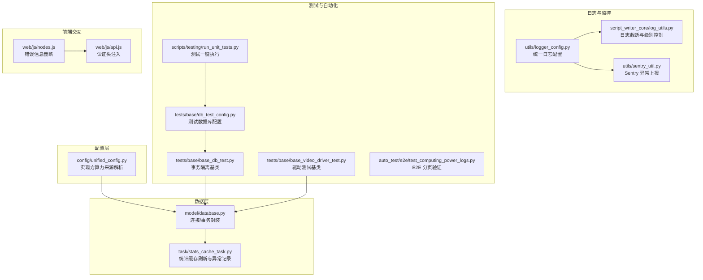
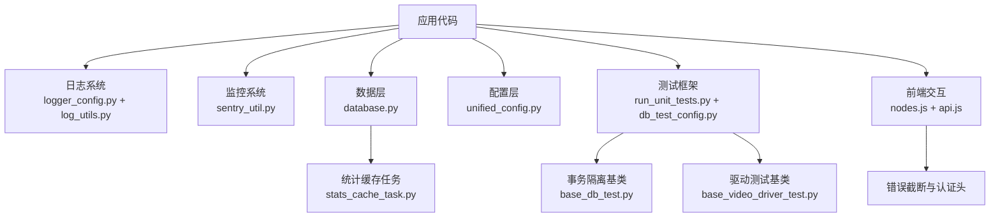
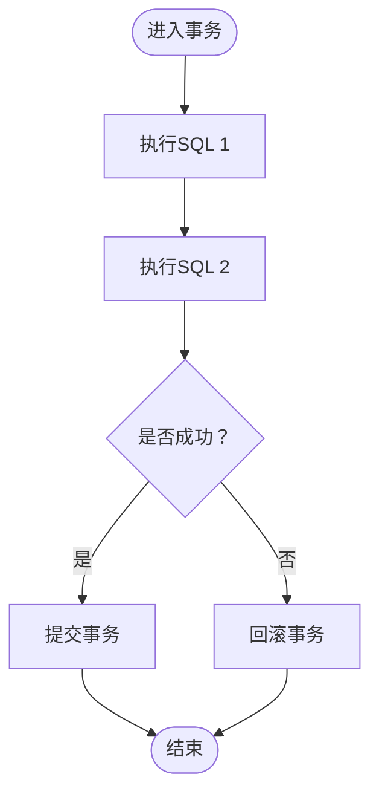
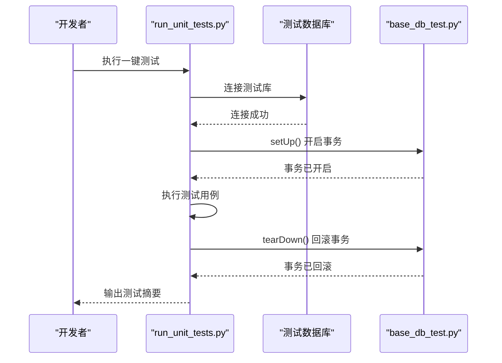
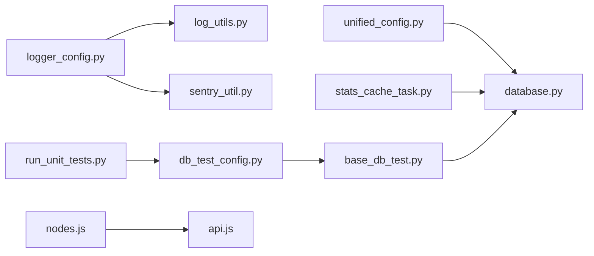

# 调试技巧与工具

<cite>
**本文引用的文件**
- [logger_config.py](file://utils/logger_config.py)
- [log_utils.py](file://script_writer_core/log_utils.py)
- [sentry_util.py](file://utils/sentry_util.py)
- [database.py](file://model/database.py)
- [stats_cache_task.py](file://task/stats_cache_task.py)
- [unified_config.py](file://config/unified_config.py)
- [nodes.js](file://web/js/nodes.js)
- [api.js](file://web/js/api.js)
- [run_unit_tests.py](file://scripts/testing/run_unit_tests.py)
- [db_test_config.py](file://tests/base/db_test_config.py)
- [base_db_test.py](file://tests/base/base_db_test.py)
- [base_video_driver_test.py](file://tests/base/base_video_driver_test.py)
- [test_computing_power_logs.py](file://auto_test/e2e/test_computing_power_logs.py)
- [sop-video-generation.md](file://agents/skills/marketing-video/SKILL.md)
- [sop-image-generation.md](file://agents/skills/marketing-pm/sops/sop-image-generation.md)
</cite>

## 目录
1. [简介](#简介)
2. [项目结构](#项目结构)
3. [核心组件](#核心组件)
4. [架构总览](#架构总览)
5. [详细组件分析](#详细组件分析)
6. [依赖关系分析](#依赖关系分析)
7. [性能考量](#性能考量)
8. [故障排查指南](#故障排查指南)
9. [结论](#结论)
10. [附录](#附录)

## 简介
本指南面向 ZhiJuTong 项目的开发者与测试工程师，系统讲解调试与诊断方法，涵盖：
- Python 调试器（pdb）的断点、单步、变量查看与异常捕获
- IDE 调试配置（VS Code、PyCharm）与常用快捷键
- 日志调试（级别、结构化、关键路径追踪）
- 性能分析工具（cProfile、memory_profiler、line_profiler）
- 网络请求调试（API 调用追踪、响应分析、超时处理）
- 数据库查询调试（慢查询、事务调试）
- 常见问题的调试流程与解决方案

## 项目结构
围绕调试主题，本项目的关键位置与职责如下：
- 日志与监控：统一日志配置、前端错误截断、Sentry 异常上报
- 数据层：数据库连接、事务封装、统计缓存任务
- 配置层：统一配置与实现方算力来源解析
- 测试与自动化：单元测试一键执行、数据库测试配置、E2E 测试
- 前端交互：驱动状态检查、错误信息截断、API 认证头注入

**图表来源**
- [logger_config.py:1-116](file://utils/logger_config.py#L1-L116)
- [log_utils.py:1-118](file://script_writer_core/log_utils.py#L1-L118)
- [sentry_util.py:52-235](file://utils/sentry_util.py#L52-L235)
- [database.py:87-176](file://model/database.py#L87-L176)
- [stats_cache_task.py:40-51](file://task/stats_cache_task.py#L40-L51)
- [unified_config.py:160-193](file://config/unified_config.py#L160-L193)
- [run_unit_tests.py:686-983](file://scripts/testing/run_unit_tests.py#L686-L983)
- [db_test_config.py:113-163](file://tests/base/db_test_config.py#L113-L163)
- [base_db_test.py:297-337](file://tests/base/base_db_test.py#L297-L337)
- [base_video_driver_test.py:37-69](file://tests/base/base_video_driver_test.py#L37-L69)
- [test_computing_power_logs.py:139-172](file://auto_test/e2e/test_computing_power_logs.py#L139-L172)
- [nodes.js:1-37](file://web/js/nodes.js#L1-L37)
- [api.js:327-356](file://web/js/api.js#L327-L356)

**章节来源**
- [logger_config.py:1-116](file://utils/logger_config.py#L1-L116)
- [log_utils.py:1-118](file://script_writer_core/log_utils.py#L1-L118)
- [sentry_util.py:52-235](file://utils/sentry_util.py#L52-L235)
- [database.py:87-176](file://model/database.py#L87-L176)
- [stats_cache_task.py:40-51](file://task/stats_cache_task.py#L40-L51)
- [unified_config.py:160-193](file://config/unified_config.py#L160-L193)
- [run_unit_tests.py:686-983](file://scripts/testing/run_unit_tests.py#L686-L983)
- [db_test_config.py:113-163](file://tests/base/db_test_config.py#L113-L163)
- [base_db_test.py:297-337](file://tests/base/base_db_test.py#L297-L337)
- [base_video_driver_test.py:37-69](file://tests/base/base_video_driver_test.py#L37-L69)
- [test_computing_power_logs.py:139-172](file://auto_test/e2e/test_computing_power_logs.py#L139-L172)
- [nodes.js:1-37](file://web/js/nodes.js#L1-L37)
- [api.js:327-356](file://web/js/api.js#L327-L356)

## 核心组件
- 统一日志配置与文件轮转：按天切割，避免 Windows 文件锁定；支持 API 请求单独日志文件。
- 日志截断与级别控制：生产环境自动截断长日志，控制 DEBUG/INFO 输出。
- Sentry 异常上报：可选启用，异步发送，避免阻塞主流程。
- 数据库连接与事务：统一连接、事务上下文管理器，异常自动回滚。
- 统计缓存任务：定时刷新统计缓存，异常记录与堆栈追踪。
- 统一配置与实现方算力来源：优先数据库，回退代码默认值。
- 测试框架：一键执行、数据库安全校验、事务隔离、Mock 机制。
- 前端错误截断与认证头注入：提升用户体验与接口一致性。

**章节来源**
- [logger_config.py:1-116](file://utils/logger_config.py#L1-L116)
- [log_utils.py:1-118](file://script_writer_core/log_utils.py#L1-L118)
- [sentry_util.py:52-235](file://utils/sentry_util.py#L52-L235)
- [database.py:87-176](file://model/database.py#L87-L176)
- [stats_cache_task.py:40-51](file://task/stats_cache_task.py#L40-L51)
- [unified_config.py:160-193](file://config/unified_config.py#L160-L193)
- [run_unit_tests.py:686-983](file://scripts/testing/run_unit_tests.py#L686-L983)
- [db_test_config.py:113-163](file://tests/base/db_test_config.py#L113-L163)
- [base_db_test.py:297-337](file://tests/base/base_db_test.py#L297-L337)
- [base_video_driver_test.py:37-69](file://tests/base/base_video_driver_test.py#L37-L69)
- [nodes.js:1-37](file://web/js/nodes.js#L1-L37)
- [api.js:327-356](file://web/js/api.js#L327-L356)

## 架构总览
调试相关能力在系统中形成“日志-监控-数据-配置-测试-前端”的闭环，便于定位问题、快速修复与回归验证。

**图表来源**
- [logger_config.py:70-116](file://utils/logger_config.py#L70-L116)
- [log_utils.py:9-118](file://script_writer_core/log_utils.py#L9-L118)
- [sentry_util.py:52-235](file://utils/sentry_util.py#L52-L235)
- [database.py:122-144](file://model/database.py#L122-L144)
- [stats_cache_task.py:40-51](file://task/stats_cache_task.py#L40-L51)
- [unified_config.py:160-193](file://config/unified_config.py#L160-L193)
- [run_unit_tests.py:686-983](file://scripts/testing/run_unit_tests.py#L686-L983)
- [db_test_config.py:113-163](file://tests/base/db_test_config.py#L113-L163)
- [base_db_test.py:297-337](file://tests/base/base_db_test.py#L297-L337)
- [base_video_driver_test.py:37-69](file://tests/base/base_video_driver_test.py#L37-L69)
- [nodes.js:1-37](file://web/js/nodes.js#L1-L37)
- [api.js:327-356](file://web/js/api.js#L327-L356)

## 详细组件分析

### 日志系统与调试
- 日志级别与输出：INFO/DEBUG/WARNING/ERROR 分级，控制台与按日切割文件输出。
- API 请求日志：独立文件，便于追踪外部接口调用。
- 生产环境截断：对长消息与 JSON 内容进行截断，避免日志膨胀。
- 建议实践：
  - 开发阶段开启 DEBUG，生产阶段仅 WARNING+。
  - 对关键路径增加结构化日志，包含上下文键（如任务ID、用户ID）。
  - 使用统一 logger 获取器，避免重复配置。

**章节来源**
- [logger_config.py:70-116](file://utils/logger_config.py#L70-L116)
- [log_utils.py:9-118](file://script_writer_core/log_utils.py#L9-L118)

### Sentry 异常上报与调试
- 可选启用：通过环境变量控制，初始化失败会记录警告。
- 异步发送：避免阻塞主流程，降低对外部服务不稳定的影响。
- 上下文与标签：支持附加上下文与标签，便于聚合与检索。
- 建议实践：
  - 对关键异常调用捕获并附带上下文。
  - 对高频异常设置采样率或去重策略。

**章节来源**
- [sentry_util.py:52-235](file://utils/sentry_util.py#L52-L235)

### 数据库连接与事务调试
- 连接与事务：统一连接池与上下文管理器，异常自动回滚。
- 事务隔离：测试基类在每个用例前后自动回滚，保证数据一致性。
- 建议实践：
  - 将多步写操作放入同一事务，减少中间态。
  - 对慢查询使用 EXPLAIN 分析，必要时加索引或拆分查询。
  - 在日志中记录关键 SQL 与耗时。

**图表来源**
- [database.py:122-144](file://model/database.py#L122-L144)
- [base_db_test.py:297-337](file://tests/base/base_db_test.py#L297-L337)

**章节来源**
- [database.py:87-176](file://model/database.py#L87-L176)
- [base_db_test.py:297-337](file://tests/base/base_db_test.py#L297-L337)

### 统计缓存任务与异常追踪
- 定时刷新：统计缓存任务在异常时记录错误与堆栈，便于定位问题。
- 建议实践：
  - 对缓存刷新过程增加进度日志。
  - 对异常场景补充重试与告警。

**章节来源**
- [stats_cache_task.py:40-51](file://task/stats_cache_task.py#L40-L51)

### 统一配置与实现方算力来源
- 来源优先级：数据库 > 代码默认值，兼容旧调用。
- 建议实践：
  - 在配置变更时，先在测试环境验证，再灰度发布。
  - 对未命中数据库的回退路径增加日志提示。

**章节来源**
- [unified_config.py:160-193](file://config/unified_config.py#L160-L193)

### 测试框架与调试
- 一键执行：支持 CRUD/驱动两类测试分类执行，失败即停。
- 数据库安全：强制测试库名后缀规则，防止误操作生产库。
- 事务隔离：每个测试用例结束后回滚，确保测试独立性。
- 建议实践：
  - 新增测试用例时，优先覆盖关键路径与异常分支。
  - 使用 Mock 替代外部依赖，提高稳定性与速度。

**图表来源**
- [run_unit_tests.py:686-983](file://scripts/testing/run_unit_tests.py#L686-L983)
- [db_test_config.py:113-163](file://tests/base/db_test_config.py#L113-L163)
- [base_db_test.py:297-337](file://tests/base/base_db_test.py#L297-L337)

**章节来源**
- [run_unit_tests.py:686-983](file://scripts/testing/run_unit_tests.py#L686-L983)
- [db_test_config.py:113-163](file://tests/base/db_test_config.py#L113-L163)
- [base_db_test.py:297-337](file://tests/base/base_db_test.py#L297-L337)
- [base_video_driver_test.py:37-69](file://tests/base/base_video_driver_test.py#L37-L69)

### 前端交互与调试
- 错误信息截断：前端对长错误信息进行截断，并尝试提取 JSON 中的关键字段。
- 认证头注入：统一注入 Authorization 与 X-User-Id，减少接口调用差异。
- 建议实践：
  - 在前端日志中包含请求ID与关键上下文。
  - 对网络错误进行分类提示（超时/鉴权失败/服务异常）。

**章节来源**
- [nodes.js:1-37](file://web/js/nodes.js#L1-L37)
- [api.js:327-356](file://web/js/api.js#L327-L356)

## 依赖关系分析
- 日志与监控依赖于统一日志配置与环境变量。
- 数据层依赖数据库连接与事务封装。
- 配置层依赖模型层的实现方算力查询。
- 测试框架依赖数据库配置与事务基类。
- 前端交互依赖 API 层的认证头注入。

**图表来源**
- [logger_config.py:70-116](file://utils/logger_config.py#L70-L116)
- [log_utils.py:9-118](file://script_writer_core/log_utils.py#L9-L118)
- [sentry_util.py:52-235](file://utils/sentry_util.py#L52-L235)
- [unified_config.py:160-193](file://config/unified_config.py#L160-L193)
- [database.py:87-176](file://model/database.py#L87-L176)
- [stats_cache_task.py:40-51](file://task/stats_cache_task.py#L40-L51)
- [run_unit_tests.py:686-983](file://scripts/testing/run_unit_tests.py#L686-L983)
- [db_test_config.py:113-163](file://tests/base/db_test_config.py#L113-L163)
- [base_db_test.py:297-337](file://tests/base/base_db_test.py#L297-L337)
- [nodes.js:1-37](file://web/js/nodes.js#L1-L37)
- [api.js:327-356](file://web/js/api.js#L327-L356)

**章节来源**
- [logger_config.py:70-116](file://utils/logger_config.py#L70-L116)
- [log_utils.py:9-118](file://script_writer_core/log_utils.py#L9-L118)
- [sentry_util.py:52-235](file://utils/sentry_util.py#L52-L235)
- [unified_config.py:160-193](file://config/unified_config.py#L160-L193)
- [database.py:87-176](file://model/database.py#L87-L176)
- [stats_cache_task.py:40-51](file://task/stats_cache_task.py#L40-L51)
- [run_unit_tests.py:686-983](file://scripts/testing/run_unit_tests.py#L686-L983)
- [db_test_config.py:113-163](file://tests/base/db_test_config.py#L113-L163)
- [base_db_test.py:297-337](file://tests/base/base_db_test.py#L297-L337)
- [nodes.js:1-37](file://web/js/nodes.js#L1-L37)
- [api.js:327-356](file://web/js/api.js#L327-L356)

## 性能考量
- cProfile：对关键函数或模块进行 CPU 时间剖析，识别热点函数。
- memory_profiler：跟踪内存分配与泄漏，结合对象生命周期分析。
- line_profiler：逐行分析热点代码，定位具体语句开销。
- 建议实践：
  - 在本地开发环境启用性能分析，生产环境谨慎开启。
  - 对高频路径（如任务调度、图像生成）定期做性能回归对比。
  - 结合日志与指标（耗时、内存峰值）进行综合评估。

[本节为通用指导，无需列出具体文件来源]

## 故障排查指南
- Python 调试器（pdb）
  - 断点设置：在疑似问题处插入断点，逐步执行观察变量变化。
  - 单步执行：逐行/逐函数执行，关注异常抛出点。
  - 变量查看：检查局部/全局变量与对象属性。
  - 异常捕获：在异常发生处打印堆栈，结合日志定位上下文。
- IDE 调试配置
  - VS Code：使用 Python 调试器，配置启动参数与环境变量，设置断点。
  - PyCharm：创建 Python Debug Server，远程调试或本地调试，使用断点与变量窗口。
- 日志调试
  - 级别设置：开发阶段 DEBUG，生产阶段 WARNING+。
  - 结构化日志：在关键路径记录上下文键（如任务ID、用户ID、时间戳）。
  - 关键路径追踪：围绕请求入口、数据库事务、外部 API 调用建立日志链路。
- 性能分析
  - 使用 cProfile/line_profiler 定位热点，memory_profiler 检测内存增长。
  - 对慢查询使用 EXPLAIN，优化索引与 SQL 结构。
- 网络请求调试
  - API 调用追踪：在前端与后端分别记录请求ID与参数，核对响应状态与错误信息。
  - 响应分析：关注状态码、响应体结构、超时与重试策略。
  - 超时处理：设置合理超时与指数退避重试，避免雪崩效应。
- 数据库查询调试
  - 慢查询分析：使用 EXPLAIN 分析执行计划，必要时加索引或拆分查询。
  - 事务调试：确认事务边界，异常时自动回滚，避免脏读。
- 常见问题流程
  - 任务失败：检查日志与 Sentry，定位异常点；回滚事务；重试或降级。
  - 接口报错：核对认证头、超时与重试；前端截断错误信息，提取关键字段。
  - 配置异常：核对统一配置来源优先级，检查数据库与代码默认值。

**章节来源**
- [logger_config.py:70-116](file://utils/logger_config.py#L70-L116)
- [log_utils.py:9-118](file://script_writer_core/log_utils.py#L9-L118)
- [sentry_util.py:52-235](file://utils/sentry_util.py#L52-L235)
- [database.py:87-176](file://model/database.py#L87-L176)
- [stats_cache_task.py:40-51](file://task/stats_cache_task.py#L40-L51)
- [unified_config.py:160-193](file://config/unified_config.py#L160-L193)
- [run_unit_tests.py:686-983](file://scripts/testing/run_unit_tests.py#L686-L983)
- [db_test_config.py:113-163](file://tests/base/db_test_config.py#L113-L163)
- [base_db_test.py:297-337](file://tests/base/base_db_test.py#L297-L337)
- [base_video_driver_test.py:37-69](file://tests/base/base_video_driver_test.py#L37-L69)
- [nodes.js:1-37](file://web/js/nodes.js#L1-L37)
- [api.js:327-356](file://web/js/api.js#L327-L356)

## 结论
通过统一的日志与监控、严谨的数据库事务、完善的测试框架与前端交互优化，ZhiJuTong 形成了高效的调试与诊断体系。建议在日常开发中坚持：
- 关键路径结构化日志与上下文记录
- 事务边界清晰、异常自动回滚
- 测试用例覆盖与事务隔离
- 前端错误截断与一致的认证头注入
- 性能分析常态化与慢查询治理

[本节为总结性内容，无需列出具体文件来源]

## 附录
- 相关技能与 SOP 文档可用于理解业务流程与调试要点：
  - 视频生成技能文档
  - 图像生成技能文档

**章节来源**
- [sop-video-generation.md](file://agents/skills/marketing-video/SKILL.md)
- [sop-image-generation.md](file://agents/skills/marketing-pm/sops/sop-image-generation.md)