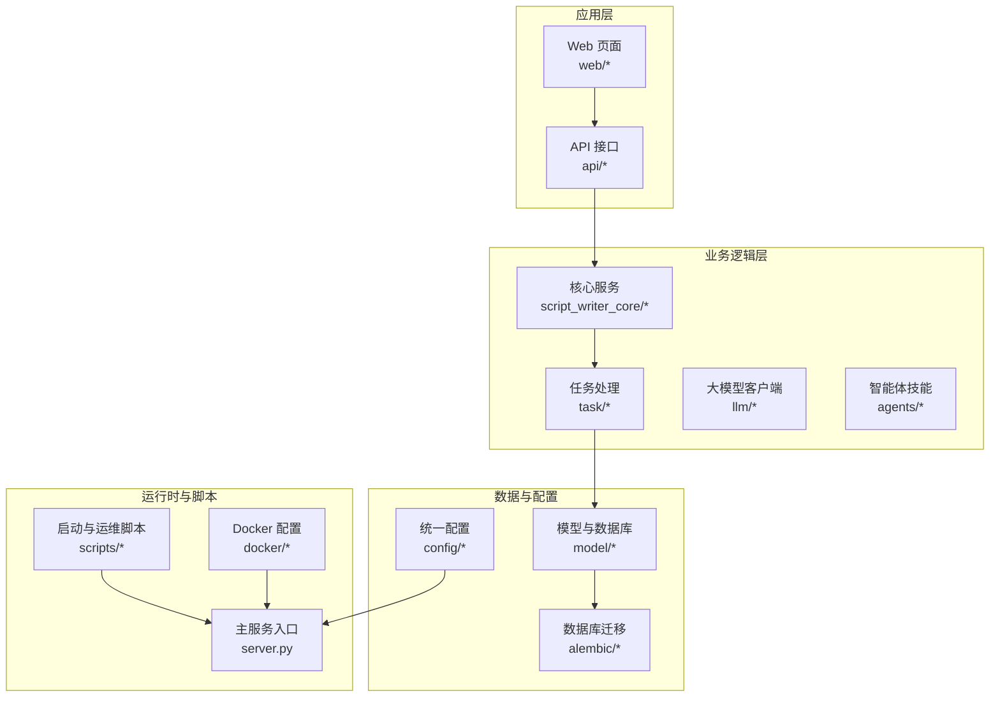
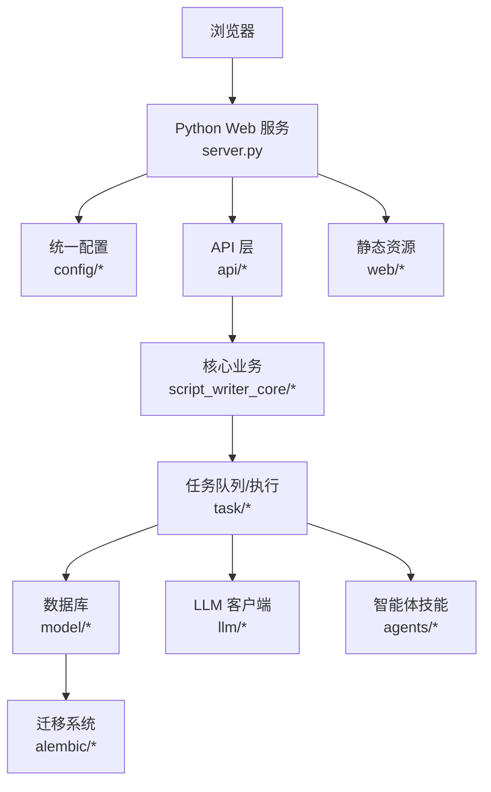
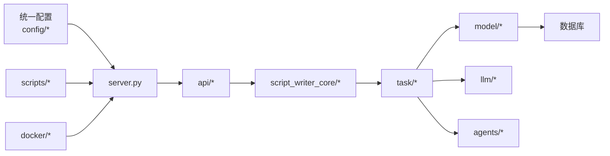

# 快速开始

<cite>
**本文引用的文件**
- [server.py](file://server.py)
- [requirements.txt](file://requirements.txt)
- [pyproject.toml](file://pyproject.toml)
- [start.bat](file://start.bat)
- [stop.bat](file://stop.bat)
- [start.command](file://start.command)
- [stop.command](file://stop.command)
- [首次安装-Mac.command](file://首次安装-Mac.command)
- [linux_start_prod.sh](file://scripts/running/linux_start_prod.sh)
- [run_dev.py](file://scripts/running/run_dev.py)
- [run_prod.py](file://scripts/running/run_prod.py)
- [run_scheduler.py](file://scripts/running/run_scheduler.py)
- [Dockerfile](file://docker/Dockerfile)
- [docker-compose.yml](file://docker/docker-compose.yml)
- [docker-entrypoint.sh](file://docker/docker-entrypoint.sh)
- [mysql/my.cnf](file://docker/mysql/my.cnf)
- [Windows启动文件说明.txt](file://Windows启动文件说明.txt)
- [Windows启动开发说明.md](file://docs/Windows启动开发说明.md)
- [alembic/env.py](file://alembic/env.py)
- [alembic/script.py.mako](file://alembic/script.py.mako)
- [config_prod.base.yaml](file://config_prod.base.yaml)
- [config/default_configs.py](file://config/default_configs.py)
- [config/unified_config.py](file://config/unified_config.py)
- [model/database.py](file://model/database.py)
- [model/migration.py](file://model/migration.py)
- [scripts/testing/run_docker_tests.sh](file://scripts/testing/run_docker_tests.sh)
- [scripts/testing/run_docker_tests.bat](file://scripts/testing/run_docker_tests.bat)
- [scripts/tools/create_shortcuts.vbs](file://scripts/tools/create_shortcuts.vbs)
- [scripts/tools/start_silent.vbs](file://scripts/tools/start_silent.vbs)
</cite>

## 目录
1. [简介](#简介)
2. [项目结构](#项目结构)
3. [核心组件](#核心组件)
4. [架构总览](#架构总览)
5. [详细组件分析](#详细组件分析)
6. [依赖分析](#依赖分析)
7. [性能考虑](#性能考虑)
8. [故障排除指南](#故障排除指南)
9. [结论](#结论)
10. [附录](#附录)

## 简介
本指南面向首次接触 ZhiJuTong 平台的新用户与开发者，帮助你在最短时间内完成安装与启动，并体验核心功能。文档覆盖以下部署方式：
- Windows 一键启动
- macOS 启动脚本使用
- Linux 环境配置与生产脚本
- Docker 容器化部署
同时提供开发环境搭建、数据库配置、依赖安装步骤，以及常见问题的排查方法。

## 项目结构
该仓库采用“后端服务 + 前端页面 + 数据库迁移 + 配置与脚本”的分层组织方式。核心入口为 Python Web 服务器，配合 Alembic 进行数据库迁移，Docker 提供容器化部署能力，脚本目录提供跨平台启动与测试工具。

图表来源
- [server.py](file://server.py)
- [scripts/running/linux_start_prod.sh](file://scripts/running/linux_start_prod.sh)
- [docker/docker-compose.yml](file://docker/docker-compose.yml)

章节来源
- [server.py](file://server.py)
- [scripts/running/linux_start_prod.sh](file://scripts/running/linux_start_prod.sh)
- [docker/docker-compose.yml](file://docker/docker-compose.yml)

## 核心组件
- 主服务入口：提供 HTTP API 与静态资源服务，负责路由与业务编排。
- 数据库与迁移：基于 Alembic 的版本化迁移，支持本地与容器化数据库。
- 统一配置系统：集中管理运行参数与环境变量，支持多环境配置。
- 跨平台启动脚本：Windows 批处理与 macOS Shell 脚本，简化开发与生产启动流程。
- Docker 化：通过 Dockerfile 与 docker-compose.yml 实现一键部署。

章节来源
- [server.py](file://server.py)
- [alembic/env.py](file://alembic/env.py)
- [config/unified_config.py](file://config/unified_config.py)
- [config_prod.base.yaml](file://config_prod.base.yaml)

## 架构总览
下图展示从浏览器到后端服务、数据库与外部算力服务的整体交互路径。

图表来源
- [server.py](file://server.py)
- [api/admin.py](file://api/admin.py)
- [script_writer_core/skill_loader.py](file://script_writer_core/skill_loader.py)
- [task/pipeline_processor.py](file://task/pipeline_processor.py)
- [model/database.py](file://model/database.py)
- [alembic/env.py](file://alembic/env.py)
- [llm/llm_client_factory.py](file://llm/llm_client_factory.py)
- [agents/skill_loader.py](file://agents/skill_loader.py)
- [web/index.html](file://web/index.html)

## 详细组件分析

### Windows 一键启动
- 适用场景：Windows 开发者快速验证功能；无需额外依赖安装。
- 优点：一键启动，操作简单；适合本地调试。
- 缺点：对系统环境要求较低，但需确保端口未被占用。
- 操作步骤（概述）：
  1) 双击启动批处理脚本以启动服务。
  2) 在浏览器中访问默认地址查看首页。
  3) 如需停止，双击停止脚本。
- 注意事项：
  - 若端口冲突，请在配置中调整端口或释放端口。
  - 首次启动可能需要等待依赖安装完成。

章节来源
- [start.bat](file://start.bat)
- [stop.bat](file://stop.bat)
- [Windows启动文件说明.txt](file://Windows启动文件说明.txt)
- [Windows启动开发说明.md](file://docs/Windows启动开发说明.md)

### macOS 启动脚本使用
- 适用场景：macOS 开发与测试环境。
- 优点：脚本封装了启动命令，便于复用。
- 缺点：首次运行可能需要授予脚本执行权限。
- 操作步骤（概述）：
  1) 使用启动脚本启动服务。
  2) 浏览器访问默认地址。
  3) 使用停止脚本优雅关闭服务。
- 建议：
  - 首次可使用“首次安装”脚本进行一次性初始化。

章节来源
- [start.command](file://start.command)
- [stop.command](file://stop.command)
- [首次安装-Mac.command](file://首次安装-Mac.command)

### Linux 环境配置与生产脚本
- 适用场景：Linux 生产环境或服务器部署。
- 优点：脚本化部署，便于自动化与持续集成。
- 缺点：需要具备 Linux 系统基础与权限。
- 操作步骤（概述）：
  1) 使用生产启动脚本启动服务。
  2) 配置反向代理与防火墙策略。
  3) 通过日志监控服务状态。

章节来源
- [linux_start_prod.sh](file://scripts/running/linux_start_prod.sh)

### Docker 容器化部署
- 适用场景：跨平台一致性部署、微服务化扩展、CI/CD 集成。
- 优点：隔离性好、依赖统一、易于横向扩展。
- 缺点：需要 Docker 环境与网络规划。
- 操作步骤（概述）：
  1) 构建镜像或拉取官方镜像。
  2) 使用 compose 文件启动服务与数据库。
  3) 访问服务并检查日志。
- 关键文件：
  - Dockerfile：定义镜像构建过程。
  - docker-compose.yml：编排服务与数据库。
  - docker-entrypoint.sh：容器启动入口脚本。
  - MySQL 配置：容器内数据库初始化参数。

章节来源
- [Dockerfile](file://docker/Dockerfile)
- [docker-compose.yml](file://docker/docker-compose.yml)
- [docker-entrypoint.sh](file://docker/docker-entrypoint.sh)
- [mysql/my.cnf](file://docker/mysql/my.cnf)

### 开发环境搭建
- Python 环境：
  - 使用项目提供的依赖清单安装所需包。
  - 建议在虚拟环境中运行，避免全局污染。
- 启动方式：
  - 开发模式：使用开发脚本启动。
  - 生产模式：使用生产脚本启动。
  - 调度任务：单独启动定时任务进程。
- 配置文件：
  - 统一配置系统支持多环境参数注入。
  - 生产配置基线文件用于覆盖默认值。

章节来源
- [requirements.txt](file://requirements.txt)
- [pyproject.toml](file://pyproject.toml)
- [run_dev.py](file://scripts/running/run_dev.py)
- [run_prod.py](file://scripts/running/run_prod.py)
- [run_scheduler.py](file://scripts/running/run_scheduler.py)
- [config/default_configs.py](file://config/default_configs.py)
- [config/unified_config.py](file://config/unified_config.py)
- [config_prod.base.yaml](file://config_prod.base.yaml)

### 数据库配置与迁移
- 初始化数据库：
  - 使用 Alembic 迁移脚本创建/更新表结构。
  - 支持本地数据库与容器化数据库两种方式。
- 运行迁移：
  - 通过迁移脚本或命令行工具执行版本升级。
- 配置要点：
  - 数据库连接参数在统一配置中管理。
  - 不同环境使用不同配置文件。

章节来源
- [alembic/env.py](file://alembic/env.py)
- [alembic/script.py.mako](file://alembic/script.py.mako)
- [model/database.py](file://model/database.py)
- [model/migration.py](file://model/migration.py)

### 依赖安装
- Python 依赖：通过依赖清单安装后端所需模块。
- 二进制依赖：部分功能依赖外部二进制工具，可通过配置文件声明。
- 建议：
  - 使用虚拟环境隔离依赖。
  - 在容器内安装以减少宿主机差异。

章节来源
- [requirements.txt](file://requirements.txt)
- [pyproject.toml](file://pyproject.toml)
- [config/required_binaries.yml](file://config/required_binaries.yml)

### 启动后的基本操作与浏览器访问
- 默认访问地址：浏览器打开后进入首页，可进行登录与功能体验。
- 常见页面：
  - 首页与国际化资源。
  - 管理后台与工作流编辑器等。
- 建议：
  - 首次登录后完善个人偏好设置。
  - 查看通知与系统提示了解当前状态。

章节来源
- [web/index.html](file://web/index.html)
- [web/i18n/](file://web/i18n/)
- [web/admin.html](file://web/admin.html)
- [web/video_workflow.html](file://web/video_workflow.html)

## 依赖分析
- 组件耦合：
  - API 层依赖核心业务与任务处理模块。
  - 任务处理模块依赖数据库与 LLM 客户端。
  - 统一配置贯穿各层，降低硬编码风险。
- 外部依赖：
  - 数据库驱动与迁移工具。
  - Docker 引擎与 Compose。
  - LLM 供应商 SDK 或网关。
- 循环依赖：
  - 通过清晰的模块边界与工厂模式避免循环导入。

图表来源
- [config/unified_config.py](file://config/unified_config.py)
- [server.py](file://server.py)
- [api/admin.py](file://api/admin.py)
- [script_writer_core/skill_loader.py](file://script_writer_core/skill_loader.py)
- [task/pipeline_processor.py](file://task/pipeline_processor.py)
- [model/database.py](file://model/database.py)
- [llm/llm_client_factory.py](file://llm/llm_client_factory.py)
- [agents/skill_loader.py](file://agents/skill_loader.py)
- [scripts/running/run_dev.py](file://scripts/running/run_dev.py)
- [docker/docker-compose.yml](file://docker/docker-compose.yml)

## 性能考虑
- 资源隔离：容器化部署可限制 CPU/内存使用，便于弹性扩缩容。
- 并发控制：任务调度与异步执行模块支持并发与重试策略。
- 缓存与 CDN：媒体文件缓存与 CDN 同步提升加载速度。
- 日志与监控：建议接入日志收集与指标监控，及时发现瓶颈。

## 故障排除指南
- 端口占用
  - 现象：启动失败或服务无法访问。
  - 处理：修改配置中的端口或释放占用端口。
- 数据库连接失败
  - 现象：迁移或启动时报数据库错误。
  - 处理：检查数据库连接参数与网络连通性；确认数据库已启动。
- 权限问题（macOS/Linux）
  - 现象：脚本无法执行。
  - 处理：赋予脚本执行权限；确认用户对相关目录有写入权限。
- Docker 相关
  - 现象：镜像构建失败或容器启动异常。
  - 处理：检查 Dockerfile 与 compose 配置；清理构建缓存后重试。
- Windows 启动异常
  - 现象：批处理无响应或报错。
  - 处理：查看批处理日志；确认 Python 环境与依赖完整。
- 测试脚本
  - 可使用 Docker 测试脚本在容器内运行测试，定位问题范围。

章节来源
- [scripts/testing/run_docker_tests.sh](file://scripts/testing/run_docker_tests.sh)
- [scripts/testing/run_docker_tests.bat](file://scripts/testing/run_docker_tests.bat)
- [docker/docker-compose.yml](file://docker/docker-compose.yml)
- [docker/Dockerfile](file://docker/Dockerfile)

## 结论
通过本指南，你可以在 Windows、macOS、Linux 与 Docker 环境中快速完成 ZhiJuTong 平台的安装与启动。建议优先使用 Docker 进行生产部署，使用脚本在开发环境快速迭代。遇到问题时，结合日志与测试脚本定位根因，按章节来源中的指引逐步排查。

## 附录
- 快速检查清单
  - 已安装 Python 与依赖。
  - 数据库已启动且可连接。
  - 配置文件已按环境正确设置。
  - 服务已成功启动并可在浏览器访问。
- 常用入口
  - 主服务入口：[server.py](file://server.py)
  - 开发启动脚本：[run_dev.py](file://scripts/running/run_dev.py)
  - 生产启动脚本：[run_prod.py](file://scripts/running/run_prod.py)
  - Docker 编排：[docker-compose.yml](file://docker/docker-compose.yml)
  - 数据库迁移：[alembic/env.py](file://alembic/env.py)