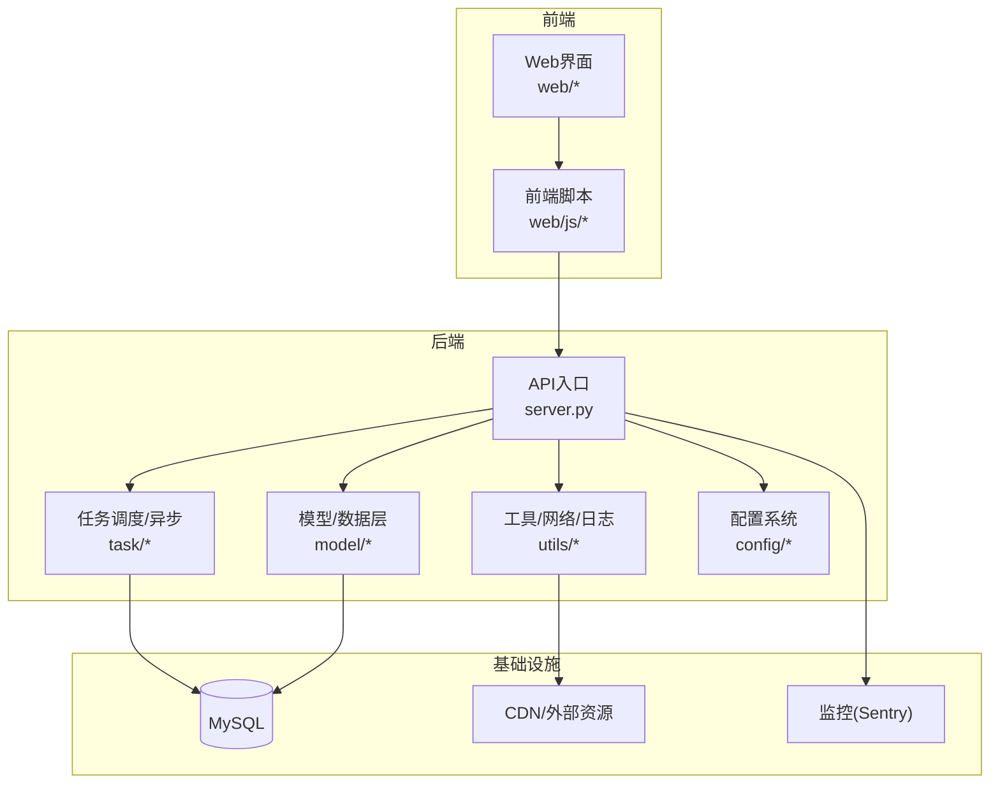
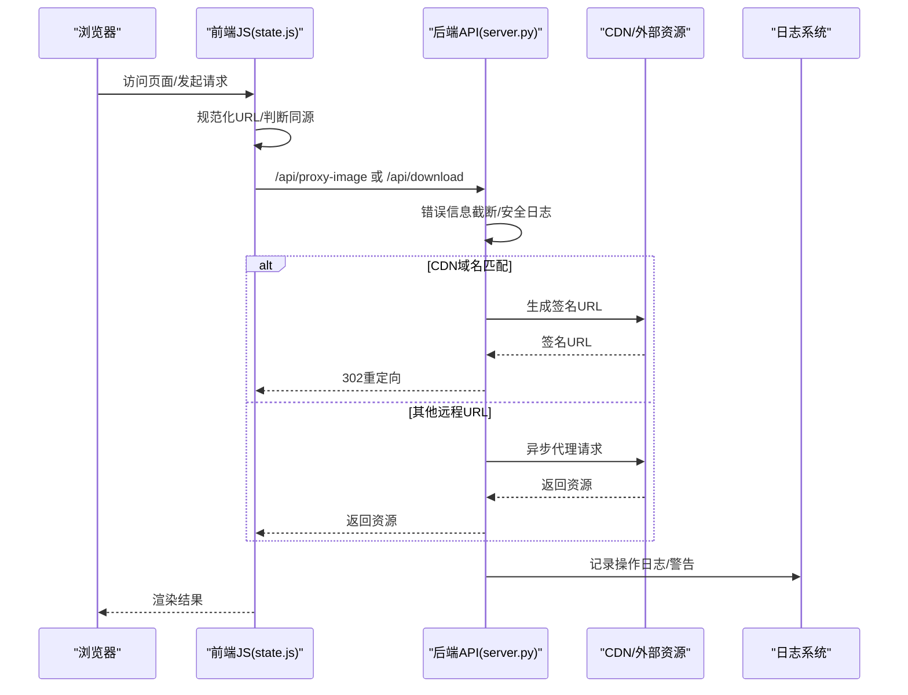
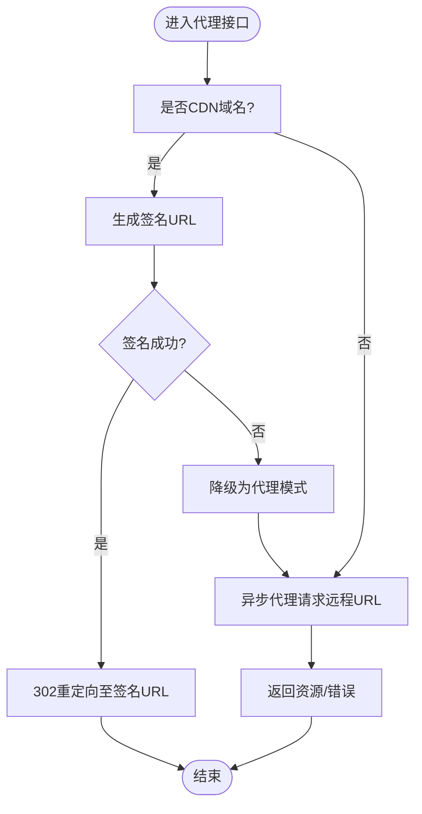
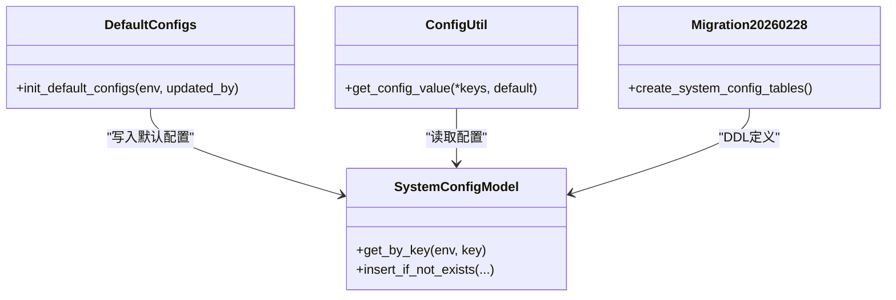
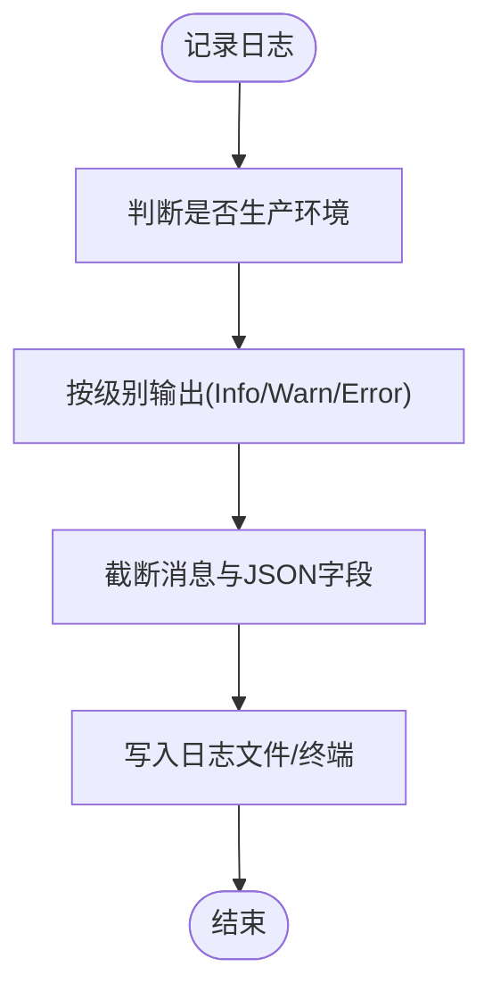
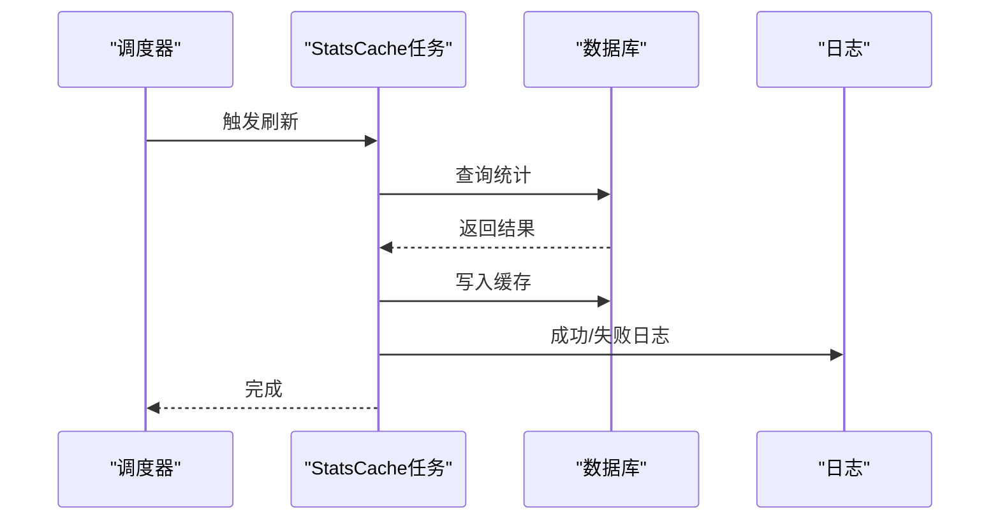
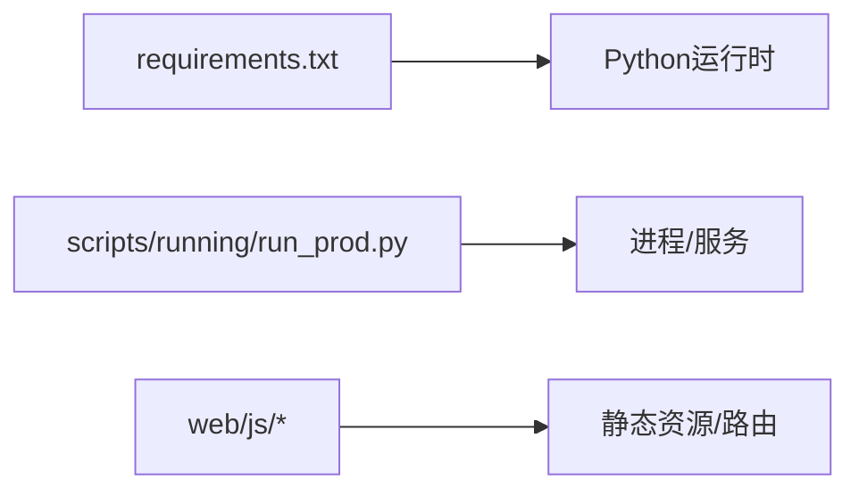

# 故障排除与常见问题

<cite>
**本文引用的文件**
- [server.py](file://server.py)
- [logger_config.py](file://utils/logger_config.py)
- [log_utils.py](file://script_writer_core/log_utils.py)
- [nodes.js](file://web/js/nodes.js)
- [state.js](file://web/js/state.js)
- [config_util.py](file://config/config_util.py)
- [default_configs.py](file://config/default_configs.py)
- [20260228_create_system_config_tables.py](file://alembic/versions/20260228_create_system_config_tables.py)
- [computing_power_log.py](file://model/computing_power_log.py)
- [stats_cache_task.py](file://task/stats_cache_task.py)
- [requirements.txt](file://requirements.txt)
- [run_prod.py](file://scripts/running/run_prod.py)
- [sentry_util.py](file://utils/sentry_util.py)
- [network_utils.py](file://utils/network_utils.py)
- [.gitignore](file://.gitignore)
- [README_EN.md](file://README_EN.md)
</cite>

## 目录
1. [简介](#简介)
2. [项目结构](#项目结构)
3. [核心组件](#核心组件)
4. [架构总览](#架构总览)
5. [详细组件分析](#详细组件分析)
6. [依赖分析](#依赖分析)
7. [性能考虑](#性能考虑)
8. [故障排除指南](#故障排除指南)
9. [结论](#结论)
10. [附录](#附录)

## 简介
本文件面向ZhiJuTong系统的运维与开发者，提供从安装到运行、从性能到网络的全链路故障排除与常见问题解答。内容覆盖依赖冲突、端口占用、权限问题、运行时错误诊断、性能瓶颈定位、网络连接异常、API调用失败原因分析、系统监控与告警配置，以及社区支持与紧急预案。

## 项目结构
ZhiJuTong采用前后端分离与后端服务化架构，核心入口为后端服务，前端通过API交互；配置与系统参数通过统一配置系统持久化；任务调度与异步执行由任务模块负责；日志与监控通过日志配置与Sentry集成实现。

图表来源
- [server.py](file://server.py)
- [tasks](file://task)
- [models](file://model)
- [utils](file://utils)
- [config](file://config)

章节来源
- [server.py](file://server.py)
- [requirements.txt](file://requirements.txt)

## 核心组件
- 日志系统：统一日志配置与安全日志输出，避免敏感信息泄露。
- 配置系统：集中化配置与历史审计，支持敏感配置脱敏。
- 任务与统计：定时统计缓存刷新与异常日志，辅助性能分析。
- 图像代理与下载：跨域资源代理与签名重定向，解决CDN访问问题。
- 错误信息截断：前端与后端均对错误信息进行截断与关键字段提取，便于排障。

章节来源
- [logger_config.py](file://utils/logger_config.py)
- [log_utils.py](file://script_writer_core/log_utils.py)
- [default_configs.py](file://config/default_configs.py)
- [20260228_create_system_config_tables.py](file://alembic/versions/20260228_create_system_config_tables.py)
- [stats_cache_task.py](file://task/stats_cache_task.py)
- [server.py](file://server.py)
- [nodes.js](file://web/js/nodes.js)

## 架构总览
下图展示典型API调用与资源代理流程，包括错误信息截断、CDN签名重定向与代理回源。

图表来源
- [state.js](file://web/js/state.js)
- [server.py](file://server.py)
- [logger_config.py](file://utils/logger_config.py)

## 详细组件分析

### 组件A：图像代理与下载（跨域/CDN）
- 功能要点
  - 同源检测与URL规范化。
  - CDN域名识别与签名URL生成，失败时降级代理。
  - 远程URL代理请求，带超时控制。
  - 错误信息截断与日志记录。
- 关键路径
  - URL规范化与代理决策：[state.js](file://web/js/state.js)
  - 代理接口与CDN重定向：[server.py](file://server.py)
  - 错误信息截断与日志：[nodes.js](file://web/js/nodes.js)、[logger_config.py](file://utils/logger_config.py)

图表来源
- [server.py](file://server.py)
- [state.js](file://web/js/state.js)

章节来源
- [state.js](file://web/js/state.js)
- [server.py](file://server.py)
- [nodes.js](file://web/js/nodes.js)
- [logger_config.py](file://utils/logger_config.py)

### 组件B：配置系统与敏感信息保护
- 功能要点
  - 默认配置初始化与去重插入。
  - 配置表与历史表结构，支持敏感配置脱敏存储。
  - 通过工具函数读取配置值，避免硬编码。
- 关键路径
  - 初始化默认配置：[default_configs.py](file://config/default_configs.py)
  - 数据库迁移定义：[20260228_create_system_config_tables.py](file://alembic/versions/20260228_create_system_config_tables.py)
  - 配置读取工具：[config_util.py](file://config/config_util.py)

图表来源
- [default_configs.py](file://config/default_configs.py)
- [20260228_create_system_config_tables.py](file://alembic/versions/20260228_create_system_config_tables.py)
- [config_util.py](file://config/config_util.py)

章节来源
- [default_configs.py](file://config/default_configs.py)
- [20260228_create_system_config_tables.py](file://alembic/versions/20260228_create_system_config_tables.py)
- [config_util.py](file://config/config_util.py)

### 组件C：日志系统与安全日志
- 功能要点
  - 统一日志配置，区分生产与开发环境日志级别。
  - 对日志消息与JSON数据进行截断，防止敏感信息泄露。
  - 提供安全日志输出工具函数。
- 关键路径
  - 日志配置与开关：[logger_config.py](file://utils/logger_config.py)
  - 日志截断与安全输出：[log_utils.py](file://script_writer_core/log_utils.py)

图表来源
- [logger_config.py](file://utils/logger_config.py)
- [log_utils.py](file://script_writer_core/log_utils.py)

章节来源
- [logger_config.py](file://utils/logger_config.py)
- [log_utils.py](file://script_writer_core/log_utils.py)

### 组件D：任务统计与异常监控
- 功能要点
  - 定时刷新实现统计缓存，异常时记录错误堆栈。
  - 计算功率日志用于计费与用量追踪。
- 关键路径
  - 统计缓存刷新与异常日志：[stats_cache_task.py](file://task/stats_cache_task.py)
  - 计算功率日志表结构：[computing_power_log.py](file://model/computing_power_log.py)

图表来源
- [stats_cache_task.py](file://task/stats_cache_task.py)
- [computing_power_log.py](file://model/computing_power_log.py)

章节来源
- [stats_cache_task.py](file://task/stats_cache_task.py)
- [computing_power_log.py](file://model/computing_power_log.py)

## 依赖分析
- Python依赖与版本约束：通过requirements.txt统一管理，建议在虚拟环境中安装，避免全局污染。
- 运行脚本：生产运行脚本位于scripts/running，建议结合系统服务或容器编排部署。
- 前端构建与静态资源：前端脚本位于web/js，需确保打包产物与后端路由一致。

图表来源
- [requirements.txt](file://requirements.txt)
- [run_prod.py](file://scripts/running/run_prod.py)

章节来源
- [requirements.txt](file://requirements.txt)
- [run_prod.py](file://scripts/running/run_prod.py)

## 性能考虑
- CPU使用率高
  - 检查任务队列积压与并发度配置，关注统计缓存刷新频率与异常日志。
  - 关注图像代理与CDN重定向逻辑，避免不必要的重定向与重复请求。
- 内存泄漏
  - 使用日志与Sentry监控异常堆栈，定位长时间运行任务中的内存增长点。
  - 对大对象进行及时释放，避免闭包持有导致的泄漏。
- 数据库连接池问题
  - 结合统计缓存任务与计算功率日志查询，观察慢查询与连接数峰值。
  - 优化查询索引与批量操作，减少锁竞争。

章节来源
- [stats_cache_task.py](file://task/stats_cache_task.py)
- [server.py](file://server.py)
- [sentry_util.py](file://utils/sentry_util.py)

## 故障排除指南

### 安装与环境问题
- 依赖冲突
  - 使用隔离的虚拟环境安装依赖，避免与系统Python冲突。
  - 若出现编译错误，优先检查系统可执行程序路径与C/C++编译工具链。
- 端口占用
  - 启动前检查端口占用情况，必要时修改监听端口或释放占用进程。
- 权限问题
  - 确保运行用户对日志目录、上传目录与数据库有读写权限。
  - 在容器或Linux服务场景下，检查SELinux/AppArmor策略。

章节来源
- [requirements.txt](file://requirements.txt)
- [run_prod.py](file://scripts/running/run_prod.py)
- [logger_config.py](file://utils/logger_config.py)

### 运行时错误诊断
- 日志分析
  - 开发环境默认开启更详细日志；生产环境可通过环境变量调整日志级别。
  - 使用安全日志工具输出，避免敏感信息泄露。
- 错误代码与信息截断
  - 前端与后端均对错误信息进行截断与关键字段提取，便于快速定位。
  - 对于JSON响应，优先提取message与failureReasons等关键字段。
- 修复步骤
  - 根据日志级别与上下文定位模块，缩小问题范围。
  - 对于配置类问题，检查配置系统与历史表，确认敏感配置是否正确脱敏。

章节来源
- [logger_config.py](file://utils/logger_config.py)
- [log_utils.py](file://script_writer_core/log_utils.py)
- [nodes.js](file://web/js/nodes.js)
- [default_configs.py](file://config/default_configs.py)
- [20260228_create_system_config_tables.py](file://alembic/versions/20260228_create_system_config_tables.py)

### 性能问题排查
- CPU使用率高
  - 检查任务调度与统计缓存刷新频率，避免高频查询与重复计算。
  - 关注图像代理与CDN重定向逻辑，减少不必要的网络往返。
- 内存泄漏
  - 结合Sentry与日志，定位长时间运行任务中的异常堆栈。
  - 对大对象与闭包进行及时释放。
- 数据库连接池问题
  - 观察慢查询与连接数峰值，优化索引与批量操作。
  - 检查统计缓存任务与计算功率日志查询的执行计划。

章节来源
- [stats_cache_task.py](file://task/stats_cache_task.py)
- [server.py](file://server.py)
- [sentry_util.py](file://utils/sentry_util.py)
- [computing_power_log.py](file://model/computing_power_log.py)

### 网络连接问题
- 代理配置
  - 确认系统代理与应用内HTTP客户端代理设置一致。
  - 对于CDN域名，优先使用签名URL重定向，失败时再降级代理。
- 防火墙设置
  - 放通后端服务端口与数据库端口，确保出站访问CDN域名。
- DNS解析问题
  - 使用nslookup/dig验证CDN域名解析，必要时更换DNS服务器。
  - 对于非CDN资源，检查代理超时与重试策略。

章节来源
- [server.py](file://server.py)
- [state.js](file://web/js/state.js)
- [network_utils.py](file://utils/network_utils.py)

### API调用失败
- 常见原因
  - URL非同源且未走代理，或CDN签名失败。
  - 远程资源不可达或超时。
  - 前端错误信息被截断，需查看后端日志与Sentry。
- 处理方法
  - 使用代理接口统一处理跨域资源，优先签名重定向。
  - 打开更详细的日志级别，收集请求ID与时间戳，便于追踪。
  - 对于频繁失败的资源，增加重试与熔断策略。

章节来源
- [state.js](file://web/js/state.js)
- [server.py](file://server.py)
- [logger_config.py](file://utils/logger_config.py)
- [sentry_util.py](file://utils/sentry_util.py)

### 系统监控与告警
- 日志与Sentry
  - 统一日志配置，生产环境默认记录警告及以上级别。
  - 使用Sentry捕获异常堆栈，建立告警规则（错误率、P95延迟）。
- 告警配置建议
  - 服务可用性：进程存活、端口监听、健康检查。
  - 性能指标：CPU使用率、内存占用、数据库连接数、慢查询。
  - 业务指标：任务积压、成功率、CDN失败率。

章节来源
- [logger_config.py](file://utils/logger_config.py)
- [sentry_util.py](file://utils/sentry_util.py)

### 社区支持与问题报告
- 社区渠道
  - GitHub Issues：提交Bug与功能请求，附带环境信息、日志与复现步骤。
  - 文档与FAQ：参考README与各模块文档，定位常见问题。
- 问题报告流程
  - 环境信息：操作系统、Python版本、依赖版本、数据库版本。
  - 日志与截图：关键错误日志、Sentry错误详情、复现截图。
  - 最小复现：提供最小可复现步骤与配置。
- 紧急预案
  - 快速降级：停止高负载任务，切换到最小化配置。
  - 回滚策略：基于版本标签与数据库迁移回滚。
  - 应急联系：指定维护窗口与值班联系方式。

章节来源
- [README_EN.md](file://README_EN.md)
- [.gitignore](file://.gitignore)

## 结论
通过统一的日志与配置系统、完善的任务与统计机制、以及跨域资源代理能力，ZhiJuTong具备了较强的可观测性与可维护性。建议在生产环境中启用Sentry与日志分级，并结合数据库与网络层面的监控告警，形成闭环的故障排除体系。

## 附录
- 快速检查清单
  - 依赖安装与虚拟环境：[requirements.txt](file://requirements.txt)
  - 进程与端口：[run_prod.py](file://scripts/running/run_prod.py)
  - 日志与敏感信息保护：[logger_config.py](file://utils/logger_config.py)、[log_utils.py](file://script_writer_core/log_utils.py)
  - 配置系统与历史表：[default_configs.py](file://config/default_configs.py)、[20260228_create_system_config_tables.py](file://alembic/versions/20260228_create_system_config_tables.py)
  - 图像代理与下载：[server.py](file://server.py)、[state.js](file://web/js/state.js)
  - 性能与统计：[stats_cache_task.py](file://task/stats_cache_task.py)、[computing_power_log.py](file://model/computing_power_log.py)
  - 网络与代理：[network_utils.py](file://utils/network_utils.py)
  - 社区与文档：[README_EN.md](file://README_EN.md)