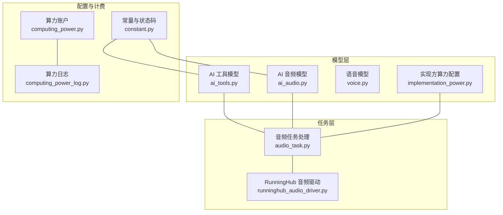
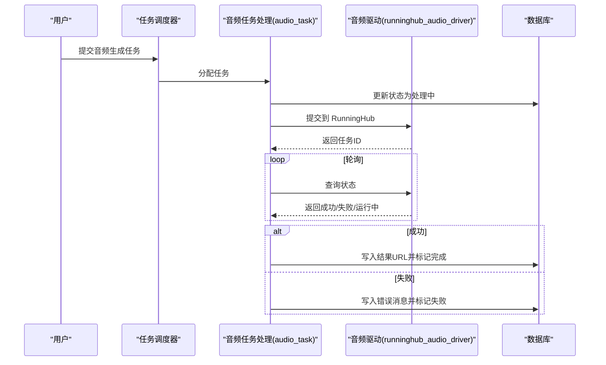
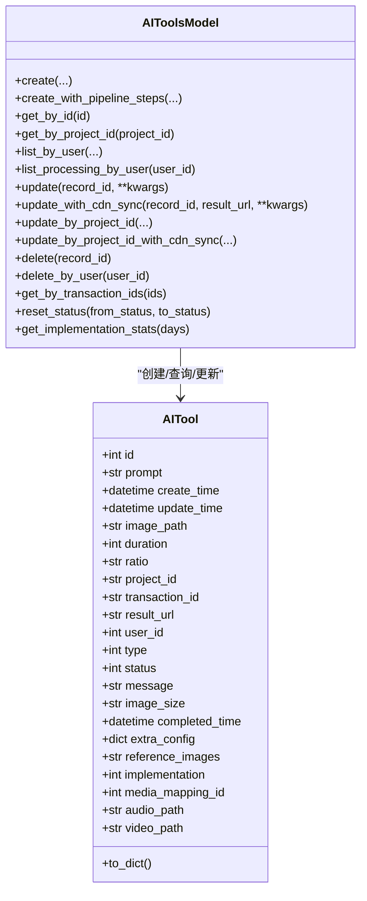
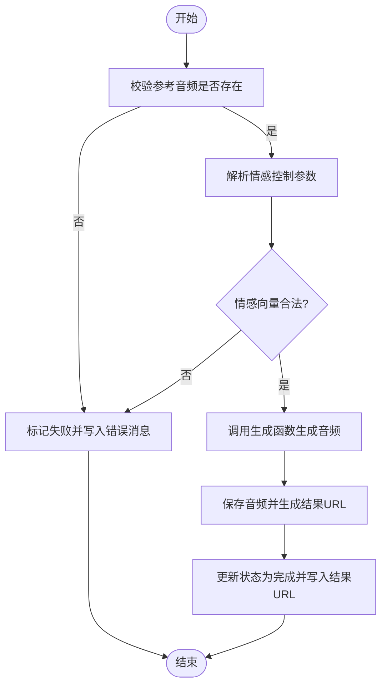
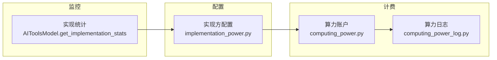
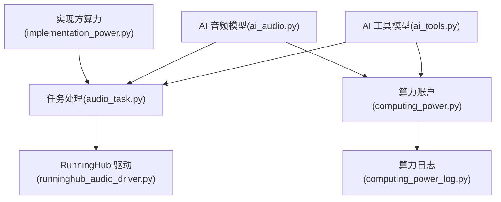

# AI工具模型

<cite>
**本文引用的文件**
- [ai_tools.py](file://model/ai_tools.py)
- [ai_audio.py](file://model/ai_audio.py)
- [voice.py](file://model/voice.py)
- [audio_task.py](file://task/audio_task.py)
- [runninghub_audio_driver.py](file://task/async_drivers/runninghub_audio_driver.py)
- [computing_power.py](file://model/computing_power.py)
- [computing_power_log.py](file://model/computing_power_log.py)
- [implementation_power.py](file://model/implementation_power.py)
- [implementation_power_config.py](file://model/implementation_power_config.py)
- [constant.py](file://config/constant.py)
</cite>

## 目录
1. [简介](#简介)
2. [项目结构](#项目结构)
3. [核心组件](#核心组件)
4. [架构总览](#架构总览)
5. [详细组件分析](#详细组件分析)
6. [依赖分析](#依赖分析)
7. [性能考虑](#性能考虑)
8. [故障排查指南](#故障排查指南)
9. [结论](#结论)
10. [附录](#附录)

## 简介
本文件面向“AI工具模型”的设计与实现，围绕以下目标展开：
- 解释 AI_Tool 实体的设计：工具类型、配置参数、价格设置与状态管理
- 详解 AI_Audio 音频生成模型的字段定义与音频处理流程
- 阐述 Voice 语音模型的声音配置与音频质量参数
- 提供工具调用计费、使用统计与性能监控的实现机制
- 说明工具配置的动态更新与版本管理策略

## 项目结构
本项目的 AI 工具链涉及三层：
- 模型层：负责数据持久化与基础 CRUD
- 任务层：负责异步任务调度、重试、过期控制与状态推进
- 配置层：负责实现方算力配置、动态开关与版本策略

图表来源
- [ai_tools.py:18-77](file://model/ai_tools.py#L18-L77)
- [ai_audio.py:14-52](file://model/ai_audio.py#L14-L52)
- [voice.py:13-43](file://model/voice.py#L13-L43)
- [audio_task.py:1-503](file://task/audio_task.py#L1-L503)
- [runninghub_audio_driver.py:1-265](file://task/async_drivers/runninghub_audio_driver.py#L1-L265)
- [computing_power.py:14-35](file://model/computing_power.py#L14-L35)
- [computing_power_log.py:12-41](file://model/computing_power_log.py#L12-L41)
- [implementation_power.py:15-46](file://model/implementation_power.py#L15-L46)
- [constant.py:303-368](file://config/constant.py#L303-L368)

章节来源
- [ai_tools.py:1-851](file://model/ai_tools.py#L1-L851)
- [ai_audio.py:1-304](file://model/ai_audio.py#L1-L304)
- [voice.py:1-273](file://model/voice.py#L1-L273)
- [audio_task.py:1-503](file://task/audio_task.py#L1-L503)
- [runninghub_audio_driver.py:1-265](file://task/async_drivers/runninghub_audio_driver.py#L1-L265)
- [computing_power.py:1-197](file://model/computing_power.py#L1-L197)
- [computing_power_log.py:1-246](file://model/computing_power_log.py#L1-L246)
- [implementation_power.py:1-730](file://model/implementation_power.py#L1-L730)
- [implementation_power_config.py:1-228](file://model/implementation_power_config.py#L1-L228)
- [constant.py:1-651](file://config/constant.py#L1-L651)

## 核心组件
- AI 工具实体（AI_Tool）
  - 字段覆盖提示词、输入素材、视频参数、状态、消息、额外配置、实现方、媒体映射等
  - 支持按 ID/项目 ID 查询、分页列表、批量事务创建、CDN 同步更新、状态重置等
- AI 音频实体（AI_Audio）
  - 字段覆盖文本、参考音频、情感控制参数、状态、消息等
  - 支持按 ID/用户分页查询、按状态批量查询、更新与删除
- 语音实体（Voice）
  - 字段覆盖音色名称、描述、音频 URL、性别、语言、排序、激活状态等
  - 支持分页过滤查询、更新与删除
- 任务与驱动
  - 音频任务处理：状态机推进、重试与过期控制、结果回写
  - RunningHub 音频驱动：异步提交、状态轮询、结果提取
- 计费与统计
  - 算力账户与日志：余额、过期时间、增减记录、幂等校验
  - 实现方算力配置：按实现方+驱动键的动态配置、热更新、修饰符、启用/禁用
  - 常量与状态码：统一的状态枚举与向后兼容映射

章节来源
- [ai_tools.py:18-77](file://model/ai_tools.py#L18-L77)
- [ai_audio.py:14-52](file://model/ai_audio.py#L14-L52)
- [voice.py:13-43](file://model/voice.py#L13-L43)
- [audio_task.py:209-321](file://task/audio_task.py#L209-L321)
- [runninghub_audio_driver.py:28-137](file://task/async_drivers/runninghub_audio_driver.py#L28-L137)
- [computing_power.py:14-35](file://model/computing_power.py#L14-L35)
- [computing_power_log.py:12-41](file://model/computing_power_log.py#L12-L41)
- [implementation_power.py:15-46](file://model/implementation_power.py#L15-L46)
- [constant.py:303-368](file://config/constant.py#L303-L368)

## 架构总览
AI 工具链以“模型-任务-配置-计费”为主线，形成如下闭环：
- 模型层负责数据持久化与查询
- 任务层负责异步执行与状态推进，包含重试、过期、幂等控制
- 配置层负责实现方算力与开关的动态管理
- 计费层负责算力账户与日志，支撑用量统计与风控

图表来源
- [audio_task.py:209-321](file://task/audio_task.py#L209-L321)
- [runninghub_audio_driver.py:185-255](file://task/async_drivers/runninghub_audio_driver.py#L185-L255)
- [ai_audio.py:110-131](file://model/ai_audio.py#L110-L131)

## 详细组件分析

### AI 工具实体（AI_Tool）设计
- 字段与职责
  - 标识与时间：id、create_time、update_time、completed_time
  - 输入与参数：prompt、image_path、duration、ratio、image_size、reference_images、extra_config
  - 关联与结果：project_id、transaction_id、result_url、media_mapping_id、audio_path、video_path
  - 控制与状态：user_id、type、implementation、status、message
- 状态管理
  - 支持未处理、处理中、等待参数预处理、等待结束前处理、完成、失败等状态
  - 提供批量重置状态的能力，便于服务重启后的任务恢复
- 配置与实现
  - implementation 字段与实现方绑定，配合实现方算力配置进行计费
  - to_dict 输出包含实现方名称与模型名称，便于前端展示
- CDN 同步
  - 提供带 CDN 触发的更新接口，自动创建媒体映射并触发异步上传

图表来源
- [ai_tools.py:18-77](file://model/ai_tools.py#L18-L77)
- [ai_tools.py:80-800](file://model/ai_tools.py#L80-L800)

章节来源
- [ai_tools.py:18-800](file://model/ai_tools.py#L18-L800)
- [constant.py:303-368](file://config/constant.py#L303-L368)

### AI_Audio 音频生成模型
- 字段定义
  - 文本与参考：text、ref_path、emo_ref_path
  - 情感控制：emo_text、emo_weight、emo_vec、emo_control_method
  - 状态与消息：status、message
  - 结果与关联：result_url、user_id、transaction_id
- 处理流程
  - 任务提交：校验参考音频、解析情感控制参数、生成音频文件、回写结果 URL
  - 状态推进：Pending -> Processing -> Completed/Failed
  - 重试与过期：基于 try_count 与过期天数的指数退避重试
- 错误处理
  - 缺少参考音频、情感向量解析失败、生成失败等均写入 message 并标记失败

图表来源
- [audio_task.py:45-150](file://task/audio_task.py#L45-L150)
- [audio_task.py:168-207](file://task/audio_task.py#L168-L207)
- [audio_task.py:209-231](file://task/audio_task.py#L209-L231)

章节来源
- [ai_audio.py:14-304](file://model/ai_audio.py#L14-L304)
- [audio_task.py:1-503](file://task/audio_task.py#L1-L503)

### Voice 语音模型
- 字段定义
  - 基本信息：name、description、audio_url
  - 属性：gender、language、sort_order、is_active
  - 时间：create_time、update_time
- 用途
  - 支持公共音色与用户私有音色（user_id=0 为公共）
  - 支持按性别、语言、关键词过滤与排序
- 与音频生成的关系
  - AI_Audio 的 ref_path 即可指向 Voice 中的音频 URL
  - 可通过 LLM 分析角色发声能力并生成样本文本与风格提示词

章节来源
- [voice.py:13-273](file://model/voice.py#L13-L273)
- [audio_task.py:327-503](file://task/audio_task.py#L327-L503)

### 计费、统计与性能监控
- 算力账户与日志
  - ComputingPower：用户算力余额、过期时间、创建/更新时间
  - ComputingPowerLog：行为（增加/扣减）、来源值/去向值、消息、备注、交易号
  - 支持管理员调整、幂等性检查、月活用户统计等
- 实现方算力配置
  - 支持固定算力与按时长分级算力
  - 支持修饰符（如图像模式、首尾帧等）与启用/禁用
  - 支持热更新，无需重启服务
- 性能监控
  - AI 工具实现统计：按 type/implementation 统计成功/失败数量、平均耗时
  - 任务过期与重试：动态配置最大重试次数与过期天数

图表来源
- [computing_power.py:14-197](file://model/computing_power.py#L14-L197)
- [computing_power_log.py:12-246](file://model/computing_power_log.py#L12-L246)
- [implementation_power.py:82-200](file://model/implementation_power.py#L82-L200)
- [ai_tools.py:744-800](file://model/ai_tools.py#L744-L800)

章节来源
- [computing_power.py:1-197](file://model/computing_power.py#L1-L197)
- [computing_power_log.py:1-246](file://model/computing_power_log.py#L1-L246)
- [implementation_power.py:1-730](file://model/implementation_power.py#L1-L730)
- [ai_tools.py:744-800](file://model/ai_tools.py#L744-L800)

### 工具配置的动态更新与版本管理
- 动态更新
  - 实现方算力配置支持热更新：set_power/delete_power/get_power_with_source
  - 启用/禁用与排序：set_config/is_enabled/get_all_configs
  - 智能显示名称：get_display_name
- 版本管理策略
  - Edition 模式：社区版/商业版，影响功能可用性与空间隔离
  - 统一配置系统：TaskTypeRegistry/UnifiedConfigRegistry 提供向后兼容常量与新 API
  - 常量与状态码：向后兼容映射，逐步迁移至新系统

章节来源
- [implementation_power.py:201-394](file://model/implementation_power.py#L201-L394)
- [implementation_power_config.py:71-228](file://model/implementation_power_config.py#L71-L228)
- [constant.py:78-121](file://config/constant.py#L78-L121)
- [constant.py:26-69](file://config/constant.py#L26-L69)

## 依赖分析
- 模块耦合
  - AI 工具与 AI 音频模型相互独立，通过任务层解耦
  - 任务层依赖驱动层与配置层，驱动层依赖外部 API 客户端
  - 计费层与配置层松耦合，通过实现方算力配置间接影响计费
- 外部依赖
  - RunningHub OpenAPI v2：异步任务提交与状态查询
  - 文件存储与 CDN：通过媒体映射与上传策略实现
- 循环依赖规避
  - 模型层延迟导入统一配置，避免循环依赖

图表来源
- [ai_tools.py:1-851](file://model/ai_tools.py#L1-L851)
- [ai_audio.py:1-304](file://model/ai_audio.py#L1-L304)
- [audio_task.py:1-503](file://task/audio_task.py#L1-L503)
- [runninghub_audio_driver.py:1-265](file://task/async_drivers/runninghub_audio_driver.py#L1-L265)
- [implementation_power.py:1-730](file://model/implementation_power.py#L1-L730)
- [computing_power.py:1-197](file://model/computing_power.py#L1-L197)
- [computing_power_log.py:1-246](file://model/computing_power_log.py#L1-L246)

章节来源
- [ai_tools.py:1-851](file://model/ai_tools.py#L1-L851)
- [ai_audio.py:1-304](file://model/ai_audio.py#L1-L304)
- [audio_task.py:1-503](file://task/audio_task.py#L1-L503)
- [runninghub_audio_driver.py:1-265](file://task/async_drivers/runninghub_audio_driver.py#L1-L265)
- [implementation_power.py:1-730](file://model/implementation_power.py#L1-L730)
- [computing_power.py:1-197](file://model/computing_power.py#L1-L197)
- [computing_power_log.py:1-246](file://model/computing_power_log.py#L1-L246)

## 性能考虑
- 任务重试与退避
  - 指数退避延迟，上限保护，避免雪崩效应
- 过期控制
  - 可配置过期天数，到期后标记失败，释放资源
- 统计与监控
  - 按实现方统计成功率与平均耗时，辅助容量规划
- CDN 与媒体映射
  - 异步上传，减少主流程阻塞；支持幂等与失败重试

## 故障排查指南
- 常见问题
  - 缺少参考音频：AI_Audio 任务失败，message 中会提示
  - 情感向量非法：解析失败，需检查向量格式与维度
  - 任务过期：超过配置的过期天数，需重新提交
  - 算力不足：余额不足或被冻结，需充值或调整配置
- 排查步骤
  - 查看任务状态与 message
  - 检查实现方算力配置与启用状态
  - 核对 CDN 上传与媒体映射状态
  - 审视日志与重试次数

章节来源
- [audio_task.py:168-207](file://task/audio_task.py#L168-L207)
- [audio_task.py:209-231](file://task/audio_task.py#L209-L231)
- [implementation_power.py:492-524](file://model/implementation_power.py#L492-L524)
- [computing_power_log.py:176-184](file://model/computing_power_log.py#L176-L184)

## 结论
本设计以“模型-任务-配置-计费”为核心，实现了 AI 工具链的高内聚、低耦合与可扩展性：
- AI_Tool/AI_Audio/Voice 提供清晰的数据模型与状态机
- 任务层通过重试、过期与幂等控制保障可靠性
- 配置层支持动态更新与版本策略，满足运营与业务变化
- 计费与统计体系支撑成本控制与性能优化

## 附录
- 状态码与常量
  - AI 工具状态：未处理、处理中、等待参数预处理、等待结束前处理、完成、失败
  - 任务状态：队列中、处理中、同步队列、完成、失败、等待参数预处理、等待结束前处理
  - AI 音频状态：未处理、处理中、失败、完成
- 版本模式
  - 社区版/商业版，影响功能可用性与空间隔离策略

章节来源
- [constant.py:303-368](file://config/constant.py#L303-L368)
- [constant.py:78-121](file://config/constant.py#L78-L121)