# ORM模型设计

<cite>
**本文档引用的文件**
- [model.py](file://model/model.py)
- [database.py](file://model/database.py)
- [users.py](file://model/users.py)
- [ai_tools.py](file://model/ai_tools.py)
- [world.py](file://model/world.py)
- [agent_tasks.py](file://model/agent_tasks.py)
- [character.py](file://model/character.py)
- [location.py](file://model/location.py)
- [props.py](file://model/props.py)
- [vendor.py](file://model/vendor.py)
- [vendor_model.py](file://model/vendor_model.py)
- [notifications.py](file://model/notifications.py)
- [system_config.py](file://model/system_config.py)
- [chat_sessions.py](file://model/chat_sessions.py)
</cite>

## 目录
1. [简介](#简介)
2. [项目结构](#项目结构)
3. [核心组件](#核心组件)
4. [架构概览](#架构概览)
5. [详细组件分析](#详细组件分析)
6. [依赖分析](#依赖分析)
7. [性能考虑](#性能考虑)
8. [故障排除指南](#故障排除指南)
9. [结论](#结论)

## 简介

ZhiJuTong平台采用自研ORM模型设计，基于Python的轻量级数据库访问层构建。该系统通过统一的数据库连接管理和标准化的CRUD操作，实现了对多个业务实体的高效数据持久化。

本ORM模型设计具有以下特点：
- **统一的数据访问层**：通过database.py提供统一的数据库连接和事务管理
- **标准化的实体模型**：每个业务实体都有对应的Model类和DAO类
- **灵活的序列化机制**：支持JSON字段的自动序列化和反序列化
- **完善的索引策略**：针对高频查询场景设计了优化的索引结构
- **可扩展的架构**：支持新业务实体的快速集成和扩展

## 项目结构

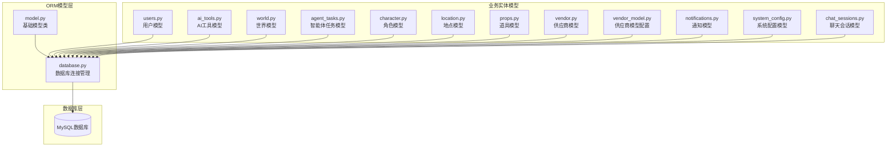

**图表来源**
- [model.py:12-127](file://model/model.py#L12-L127)
- [database.py:1-177](file://model/database.py#L1-L177)

**章节来源**
- [model.py:1-127](file://model/model.py#L1-L127)
- [database.py:1-177](file://model/database.py#L1-L177)

## 核心组件

### 基础模型架构

ORM系统采用双层架构设计：

1. **实体类（Model类）**：负责数据封装和序列化
2. **数据访问类（DAO类）**：负责数据库操作和业务逻辑

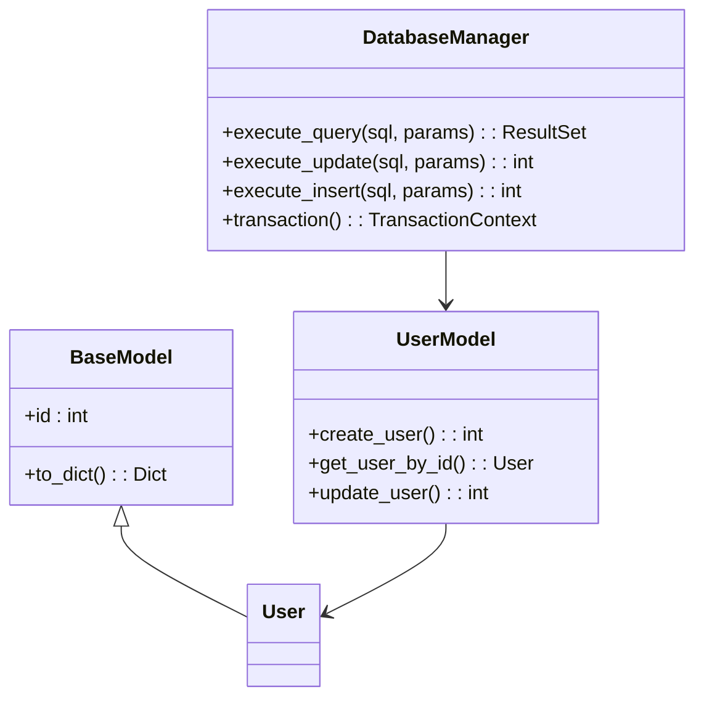

**图表来源**
- [model.py:12-38](file://model/model.py#L12-L38)
- [database.py:62-177](file://model/database.py#L62-L177)

### 数据库连接管理

系统通过统一的数据库连接管理器提供以下功能：
- **连接池管理**：基于pymysql的连接管理
- **事务支持**：提供完整的事务控制机制
- **参数化查询**：防止SQL注入攻击
- **错误处理**：统一的异常处理和日志记录

**章节来源**
- [database.py:31-177](file://model/database.py#L31-L177)

## 架构概览

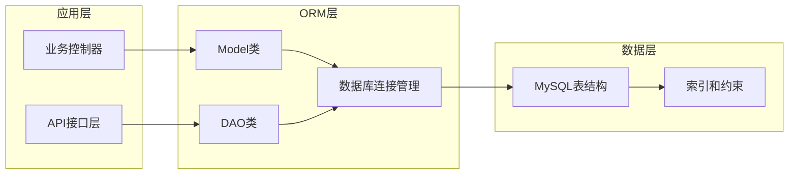

**图表来源**
- [model.py:12-127](file://model/model.py#L12-L127)
- [database.py:1-177](file://model/database.py#L1-L177)

## 详细组件分析

### 用户模型（Users）

用户模型是系统的核心实体，负责用户身份认证和权限管理。

#### 核心字段设计

| 字段名 | 类型 | 约束 | 描述 |
|--------|------|------|------|
| id | int | 主键, 自增 | 用户唯一标识 |
| phone | varchar(20) | 唯一索引 | 手机号码 |
| email | varchar(255) | 唯一索引 | 邮箱地址 |
| password_hash | varchar(500) | 必填 | 密码哈希值 |
| status | tinyint | 默认1 | 用户状态（1-正常, 0-禁用） |
| role | varchar(50) | 默认'user' | 用户角色 |
| terms_agreed | tinyint | 默认0 | 是否同意条款 |
| invite_code | varchar(20) | 唯一索引 | 邀请码 |
| implementation_preferences | json | 可选 | 实现方偏好配置 |

#### 关键方法

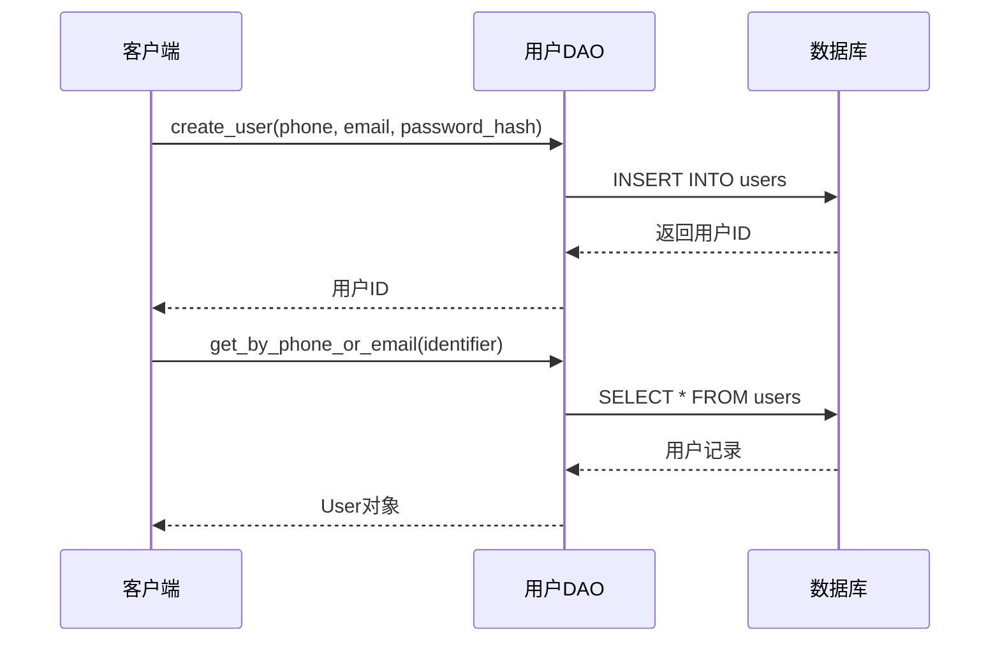

**图表来源**
- [users.py:148-169](file://model/users.py#L148-L169)
- [users.py:107-121](file://model/users.py#L107-L121)

**章节来源**
- [users.py:15-786](file://model/users.py#L15-L786)

### AI工具模型（AI Tools）

AI工具模型用于管理各种AI生成任务的状态和结果。

#### 任务类型定义

| 类型ID | 类型名称 | 描述 |
|--------|----------|------|
| 1 | 图片编辑 | 基于图像的编辑任务 |
| 2 | AI视频生成 | 自动生成视频内容 |
| 3 | 图片生成视频 | 从静态图片生成视频 |
| 4 | 图片高清 | 图像超分辨率处理 |

#### 核心字段设计

| 字段名 | 类型 | 约束 | 描述 |
|--------|------|------|------|
| id | int | 主键, 自增 | 任务唯一标识 |
| user_id | int | 外键 | 创建用户ID |
| type | int | 必填 | 任务类型 |
| status | int | 默认0 | 任务状态 |
| prompt | text | 可选 | 用户提示词 |
| result_url | varchar(500) | 可选 | 结果文件URL |
| media_mapping_id | int | 可选 | 媒体文件映射ID |
| implementation | int | 默认0 | 实现方ID |

#### 状态管理流程

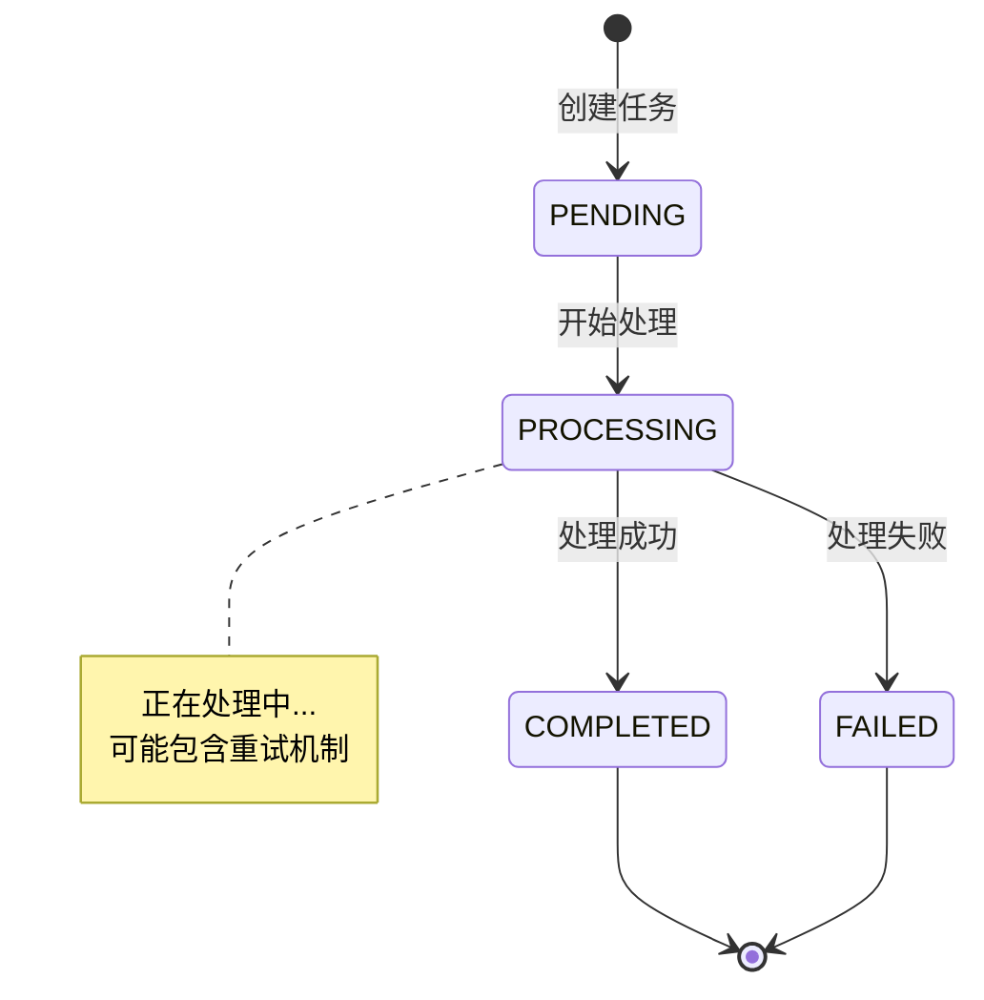

**图表来源**
- [ai_tools.py:83-144](file://model/ai_tools.py#L83-L144)

**章节来源**
- [ai_tools.py:18-800](file://model/ai_tools.py#L18-L800)

### 世界模型（World）

世界模型用于组织和管理虚拟世界的结构化内容。

#### 核心字段设计

| 字段名 | 类型 | 约束 | 描述 |
|--------|------|------|------|
| id | int | 主键, 自增 | 世界唯一标识 |
| name | varchar(255) | 必填 | 世界名称 |
| description | text | 可选 | 世界描述 |
| user_id | int | 必填 | 创建者用户ID |
| story_outline | text | 可选 | 故事大纲 |
| visual_style | text | 可选 | 画面风格 |
| era_environment | text | 可选 | 时代环境 |
| color_language | text | 可选 | 色彩语言 |
| composition_preference | text | 可选 | 构图倾向 |

#### 世界内容层次结构

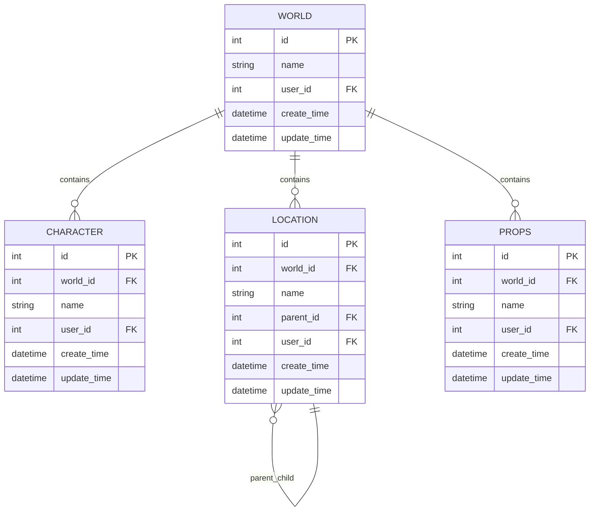

**图表来源**
- [world.py:12-43](file://model/world.py#L12-L43)
- [character.py:13-70](file://model/character.py#L13-L70)
- [location.py:13-50](file://model/location.py#L13-L50)
- [props.py:8-35](file://model/props.py#L8-L35)

**章节来源**
- [world.py:12-286](file://model/world.py#L12-L286)
- [character.py:13-484](file://model/character.py#L13-L484)
- [location.py:13-529](file://model/location.py#L13-L529)
- [props.py:8-365](file://model/props.py#L8-L365)

### 智能体任务模型（Agent Tasks）

智能体任务模型用于跨进程共享任务状态，支持gunicorn多worker模式。

#### 任务状态流转

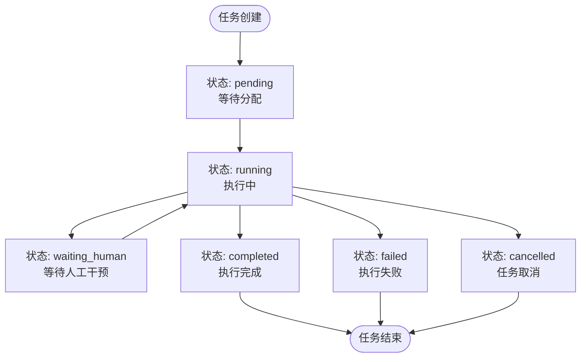

**图表来源**
- [agent_tasks.py:190-237](file://model/agent_tasks.py#L190-L237)

#### 核心字段设计

| 字段名 | 类型 | 约束 | 描述 |
|--------|------|------|------|
| id | int | 主键, 自增 | 任务唯一标识 |
| task_id | varchar(64) | 唯一索引 | UUID任务标识符 |
| session_id | varchar(64) | 索引 | 关联会话ID |
| user_id | varchar(64) | 必填 | 用户ID |
| world_id | varchar(64) | 必填 | 世界ID |
| status | varchar(32) | 默认'pending' | 任务状态 |
| progress | float | 默认0.0 | 任务进度 |
| result | longtext | 可选 | 任务结果 |
| error | text | 可选 | 错误信息 |

**章节来源**
- [agent_tasks.py:15-358](file://model/agent_tasks.py#L15-L358)

### 供应商模型（Vendor & VendorModel）

供应商模型用于管理AI服务提供商及其定价配置。

#### 供应商模型配置

| 字段名 | 类型 | 约束 | 描述 |
|--------|------|------|------|
| id | int | 主键, 自增 | 配置唯一标识 |
| vendor_id | int | 外键 | 供应商ID |
| model_id | int | 外键 | 模型ID |
| input_token_threshold | int | 可选 | 输入token计费率 |
| output_token_threshold | int | 可选 | 输出token计费率 |
| cache_read_threshold | int | 可选 | 缓存读取计费率 |
| raw_token_threshold | int | 可选 | 分段边界 |

#### 分段计费策略

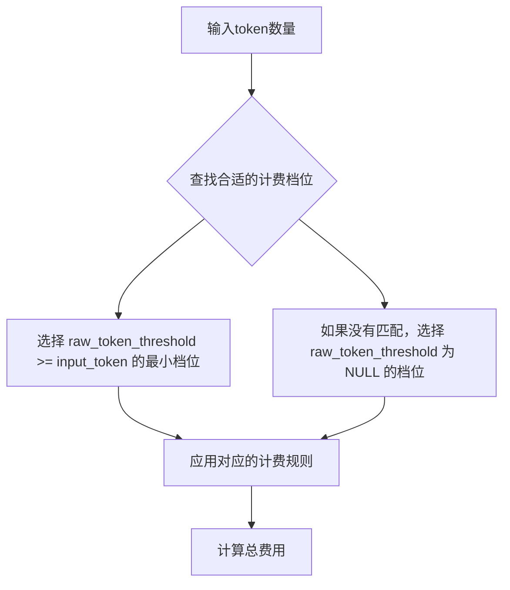

**图表来源**
- [vendor_model.py:136-173](file://model/vendor_model.py#L136-L173)

**章节来源**
- [vendor.py:12-164](file://model/vendor.py#L12-L164)
- [vendor_model.py:13-236](file://model/vendor_model.py#L13-L236)

### 系统配置模型（System Config）

系统配置模型支持动态配置热更新，提供安全的配置管理机制。

#### 配置类型支持

| 类型 | 描述 | 示例 |
|------|------|------|
| string | 字符串类型 | "production" |
| int | 整数类型 | 100 |
| float | 浮点类型 | 3.14 |
| bool | 布尔类型 | true/false |
| json | JSON类型 | {"key": "value"} |

#### 敏感配置保护

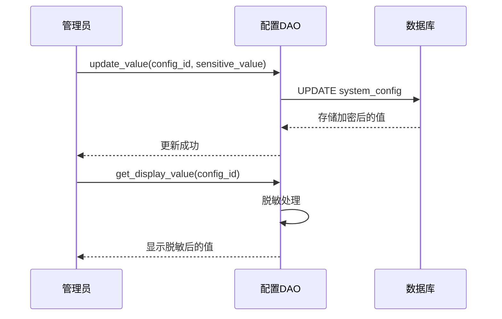

**图表来源**
- [system_config.py:77-88](file://model/system_config.py#L77-L88)

**章节来源**
- [system_config.py:14-308](file://model/system_config.py#L14-L308)

### 聊天会话模型（Chat Sessions）

聊天会话模型用于管理AI对话会话的状态和历史记录。

#### 会话类型定义

| 类型ID | 类型名称 | 描述 |
|--------|----------|------|
| 1 | 剧本智能体 | 剧本创作辅助 |
| 2 | 营销智能体 | 营销内容生成 |

#### 令牌统计机制

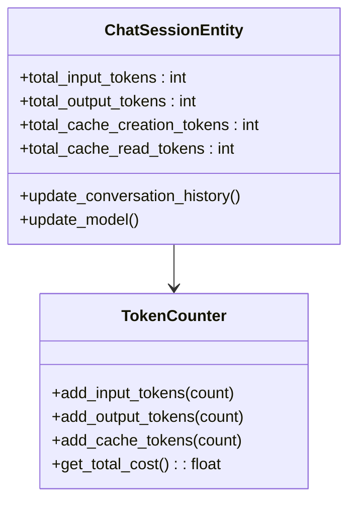

**图表来源**
- [chat_sessions.py:227-312](file://model/chat_sessions.py#L227-L312)

**章节来源**
- [chat_sessions.py:14-598](file://model/chat_sessions.py#L14-L598)

## 依赖分析

### 数据库表关系

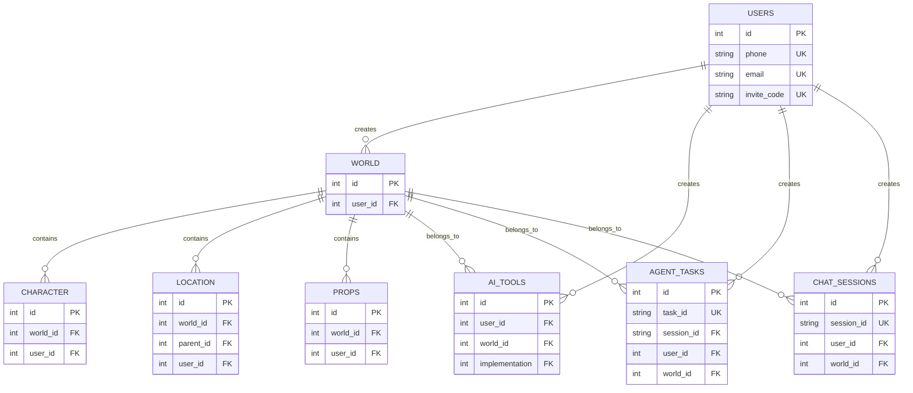

**图表来源**
- [users.py:756-785](file://model/users.py#L756-L785)
- [world.py:266-285](file://model/world.py#L266-L285)
- [character.py:456-483](file://model/character.py#L456-L483)
- [location.py:506-529](file://model/location.py#L506-L529)
- [props.py:345-365](file://model/props.py#L345-L365)
- [ai_tools.py:1-851](file://model/ai_tools.py#L1-L851)
- [agent_tasks.py:329-358](file://model/agent_tasks.py#L329-L358)
- [chat_sessions.py:571-598](file://model/chat_sessions.py#L571-L598)

### 外键约束设计

系统采用严格的外键约束确保数据完整性：

1. **级联删除**：子实体删除时自动清理相关记录
2. **引用完整性**：防止悬挂引用的产生
3. **唯一约束**：确保关键字段的唯一性
4. **索引优化**：为高频查询字段建立适当索引

**章节来源**
- [character.py:481-481](file://model/character.py#L481-L481)
- [location.py:525-526](file://model/location.py#L525-L526)
- [props.py:362-362](file://model/props.py#L362-L362)

## 性能考虑

### 查询优化策略

1. **索引设计**
   - 主键索引：所有表的主键自动建立索引
   - 唯一索引：确保数据唯一性的字段
   - 复合索引：常用查询条件的组合索引
   - 全文索引：文本搜索需求的字段

2. **查询优化**
   - 分页查询：大数据量时使用LIMIT和OFFSET
   - 条件过滤：合理使用WHERE子句减少扫描
   - 连接优化：避免N+1查询问题
   - 缓存策略：热点数据的内存缓存

3. **事务管理**
   - 批量操作：使用事务批量提交提高性能
   - 锁粒度：最小化锁的持有时间
   - 死锁预防：合理的操作顺序和超时设置

### 序列化机制

系统采用智能的序列化机制处理复杂数据类型：

1. **JSON字段处理**
   - 自动序列化：Python对象自动转换为JSON字符串
   - 反序列化：JSON字符串自动转换为Python对象
   - 错误处理：序列化失败时的降级处理

2. **日期时间处理**
   - 格式统一：ISO 8601标准格式
   - 时区处理：UTC时间存储，本地化显示
   - 空值处理：None值的安全处理

3. **数据类型转换**
   - 动态类型：根据value_type自动转换数据类型
   - 类型验证：转换前的类型检查
   - 默认值：缺失字段的默认值处理

## 故障排除指南

### 常见问题诊断

1. **数据库连接问题**
   - 检查数据库配置参数
   - 验证网络连通性
   - 查看连接池状态
   - 监控连接超时情况

2. **事务回滚问题**
   - 检查异常处理逻辑
   - 验证事务边界
   - 查看死锁日志
   - 监控长时间运行的事务

3. **性能问题**
   - 分析慢查询日志
   - 检查索引使用情况
   - 监控数据库负载
   - 优化查询语句

### 错误处理机制

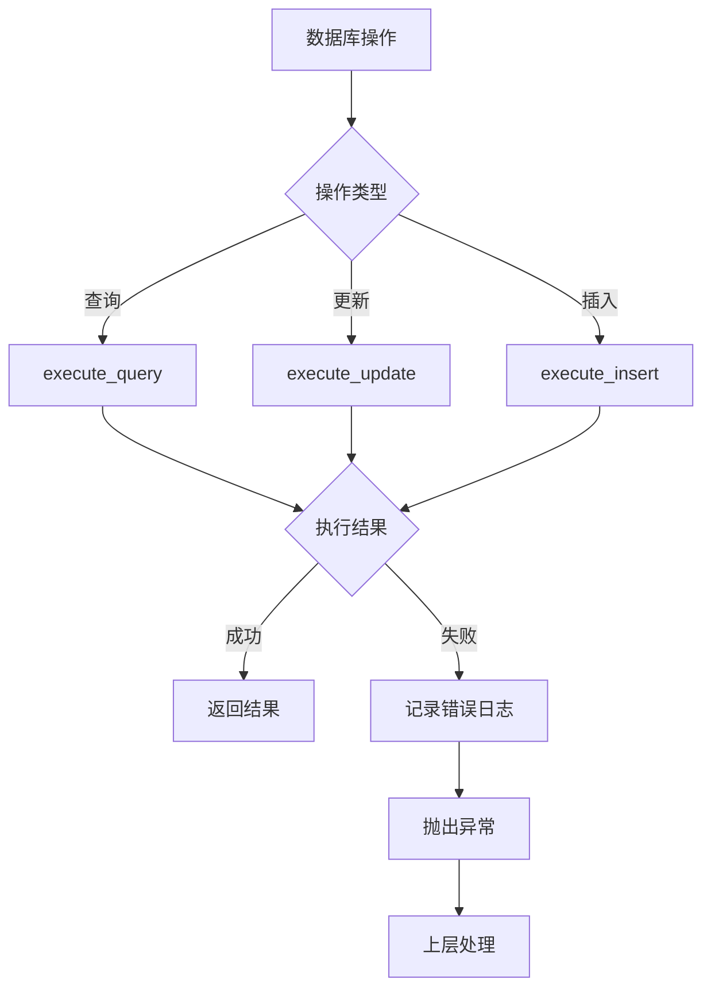

**图表来源**
- [database.py:62-177](file://model/database.py#L62-L177)

**章节来源**
- [database.py:62-177](file://model/database.py#L62-L177)

## 结论

ZhiJuTong平台的ORM模型设计体现了现代Web应用的最佳实践：

1. **架构清晰**：双层架构设计使得代码职责明确，易于维护
2. **扩展性强**：标准化的模型设计支持新业务实体的快速集成
3. **性能优化**：合理的索引设计和查询优化策略确保系统性能
4. **安全性高**：参数化查询和输入验证有效防止SQL注入
5. **可维护性好**：统一的错误处理和日志记录便于问题排查

该ORM模型为ZhiJuTong平台提供了稳定可靠的数据持久化基础，支持平台的持续发展和功能扩展。通过合理的架构设计和优化策略，系统能够在高并发场景下保持良好的性能表现。