# 世界内容模型

<cite>
**本文档引用的文件**
- [model/world.py](file://model/world.py)
- [model/character.py](file://model/character.py)
- [model/location.py](file://model/location.py)
- [model/props.py](file://model/props.py)
- [web/i18n/i18n-core.js](file://web/i18n/i18n-core.js)
- [web/js/world.js](file://web/js/world.js)
- [auto_test/e2e/test_world.py](file://auto_test/e2e/test_world.py)
- [auto_test/e2e/test_character.py](file://auto_test/e2e/test_character.py)
- [auto_test/e2e/test_location.py](file://auto_test/e2e/test_location.py)
- [tests/crud/test_world_crud.py](file://tests/crud/test_world_crud.py)
- [tests/utils/test_file_manager_export.py](file://tests/utils/test_file_manager_export.py)
</cite>

## 目录
1. [简介](#简介)
2. [项目结构](#项目结构)
3. [核心组件](#核心组件)
4. [架构概览](#架构概览)
5. [详细组件分析](#详细组件分析)
6. [依赖关系分析](#依赖关系分析)
7. [性能考虑](#性能考虑)
8. [故障排除指南](#故障排除指南)
9. [结论](#结论)
10. [附录](#附录)

## 简介

世界内容模型是本项目的核心数据架构，负责管理虚拟世界中的所有内容元素。该模型体系包含四个主要实体：World（世界）、Character（角色）、Location（地点）和Props（道具），以及完整的国际化支持系统。

该系统采用分层架构设计，通过数据库模型层提供持久化能力，通过前端JavaScript实现用户交互，通过国际化引擎支持多语言内容管理。每个实体都有完整的CRUD操作接口，支持复杂的数据查询和业务逻辑处理。

## 项目结构

项目采用模块化组织方式，核心内容模型位于`model/`目录下，前端界面位于`web/`目录，国际化资源位于`web/i18n/`目录，测试用例分布在`auto_test/`和`tests/`目录中。

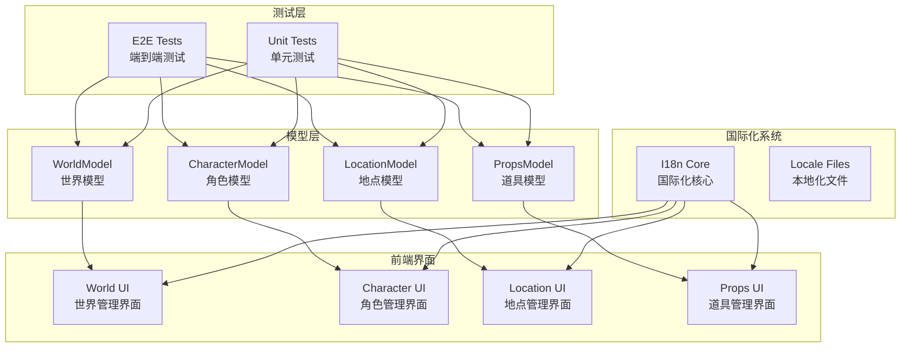

**图表来源**
- [model/world.py:45-286](file://model/world.py#L45-L286)
- [model/character.py:72-484](file://model/character.py#L72-L484)
- [model/location.py:51-529](file://model/location.py#L51-L529)
- [model/props.py:37-365](file://model/props.py#L37-L365)
- [web/i18n/i18n-core.js:11-180](file://web/i18n/i18n-core.js#L11-L180)

**章节来源**
- [model/world.py:1-286](file://model/world.py#L1-L286)
- [model/character.py:1-484](file://model/character.py#L1-L484)
- [model/location.py:1-529](file://model/location.py#L1-L529)
- [model/props.py:1-365](file://model/props.py#L1-L365)

## 核心组件

### 世界模型（World）

世界模型是整个内容体系的核心，负责管理虚拟世界的设定和场景配置。每个世界包含以下关键属性：

- **基础信息**：名称、描述、创建时间、更新时间
- **故事背景**：故事大纲（story_outline）
- **视觉风格**：画面风格（visual_style）、色彩语言（color_language）
- **环境设定**：时代环境（era_environment）、构图倾向（composition_preference）
- **用户关联**：创建者用户ID（user_id）

世界模型提供了完整的数据库操作接口，包括创建、查询、更新、删除等标准CRUD操作，同时支持分页查询、关键字搜索、排序等功能。

### 角色模型（Character）

角色模型用于管理世界中的所有角色实体，包含丰富的角色属性配置：

- **基本信息**：姓名、年龄、身份/职业
- **外观配置**：外貌描述（appearance）、参考图片
- **性格特征**：性格特征（personality）、行为习惯（behavior）
- **声音配置**：默认声音文件、情感声音映射
- **关联信息**：所属世界ID、其他信息

角色模型支持单个角色创建、批量创建、唯一性约束（世界+姓名组合唯一）、多参考图片支持等高级功能。

### 地点模型（Location）

地点模型管理世界中的场景位置信息，支持层级化的地点结构：

- **层级关系**：父子关系（parent_id）、树形结构
- **视觉资料**：参考图片、多图片支持
- **描述信息**：地点描述、名称
- **关联关系**：所属世界ID、用户ID

地点模型特别支持地点树形结构的构建和查询，可以按层级关系组织复杂的场景布局。

### 道具模型（Props）

道具模型管理世界中的物品实体，提供简洁而实用的属性配置：

- **基础属性**：名称、描述内容
- **视觉资料**：参考图片
- **关联信息**：所属世界ID、用户ID
- **唯一性**：世界+名称唯一约束

道具模型设计简洁，专注于物品的基本属性管理，便于扩展和定制。

**章节来源**
- [model/world.py:12-42](file://model/world.py#L12-L42)
- [model/character.py:13-69](file://model/character.py#L13-L69)
- [model/location.py:13-48](file://model/location.py#L13-L48)
- [model/props.py:8-34](file://model/props.py#L8-L34)

## 架构概览

系统采用分层架构设计，确保各层职责清晰、耦合度低、可维护性强。

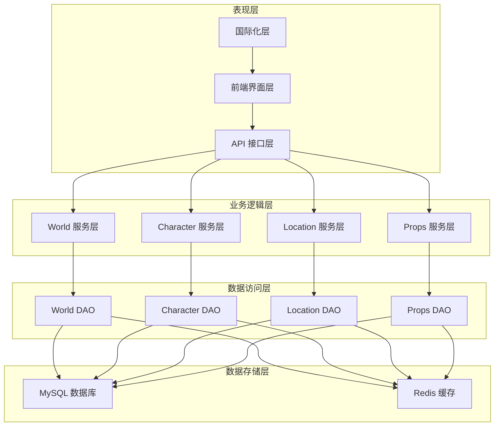

**图表来源**
- [model/world.py:45-286](file://model/world.py#L45-L286)
- [model/character.py:72-484](file://model/character.py#L72-L484)
- [model/location.py:51-529](file://model/location.py#L51-L529)
- [model/props.py:37-365](file://model/props.py#L37-L365)

### 数据流分析

系统的核心数据流遵循标准的MVC模式：

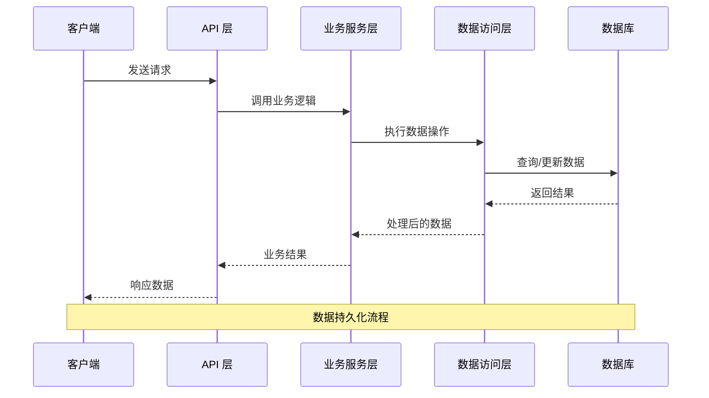

**图表来源**
- [model/world.py:75-88](file://model/world.py#L75-L88)
- [model/character.py:127-144](file://model/character.py#L127-L144)
- [model/location.py:93-106](file://model/location.py#L93-L106)
- [model/props.py:63-76](file://model/props.py#L63-L76)

## 详细组件分析

### 世界模型详细分析

#### 类结构设计

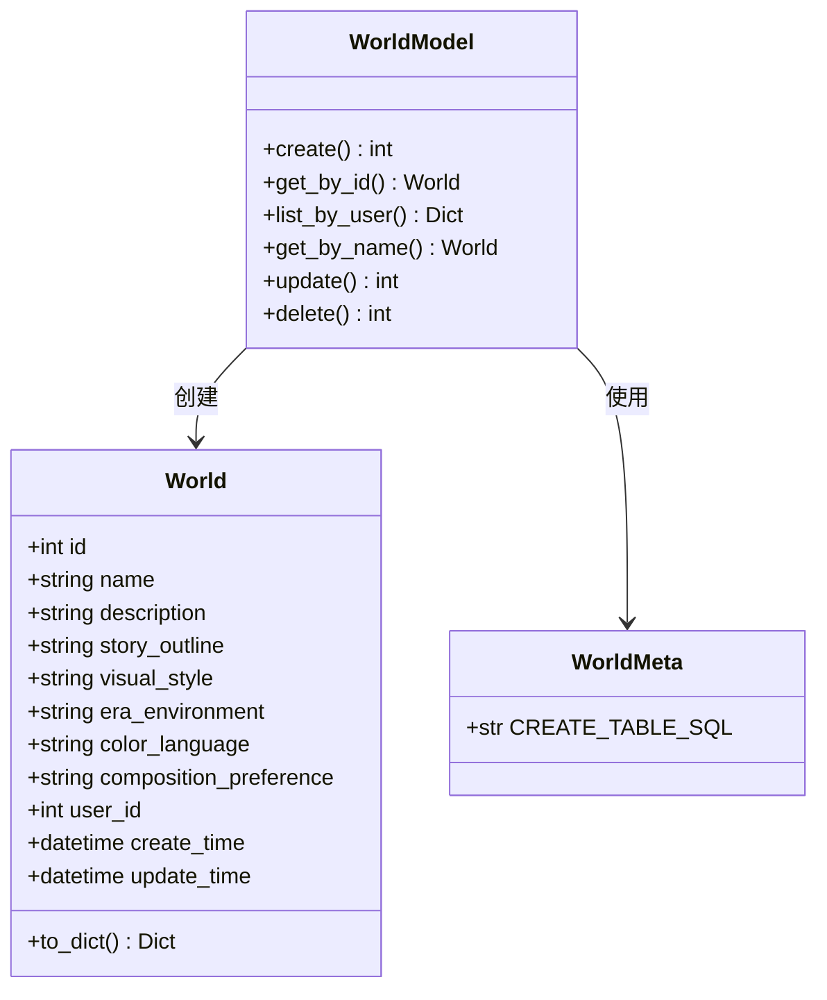

**图表来源**
- [model/world.py:12-42](file://model/world.py#L12-L42)
- [model/world.py:45-286](file://model/world.py#L45-L286)

#### 核心功能实现

世界模型的核心功能包括：

1. **创建操作**：支持完整的字段创建，包含故事背景、视觉风格、环境设定等
2. **查询操作**：支持按ID、名称精确查询，支持用户维度分页查询
3. **更新操作**：支持部分字段更新，包含故事大纲、视觉风格等
4. **删除操作**：级联删除，确保数据完整性

#### 分页查询算法

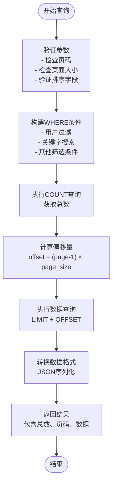

**图表来源**
- [model/world.py:120-183](file://model/world.py#L120-L183)

**章节来源**
- [model/world.py:45-286](file://model/world.py#L45-L286)

### 角色模型详细分析

#### 复杂数据结构

角色模型采用了多种复杂的数据结构来支持丰富的配置需求：

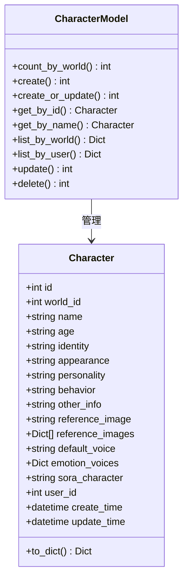

**图表来源**
- [model/character.py:13-69](file://model/character.py#L13-L69)
- [model/character.py:72-484](file://model/character.py#L72-L484)

#### JSON数据处理机制

角色模型实现了智能的JSON数据处理机制：

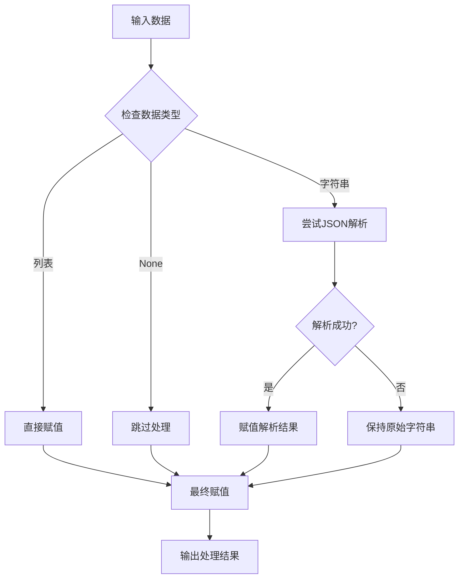

**图表来源**
- [model/character.py:37-49](file://model/character.py#L37-L49)

#### 唯一性约束策略

角色模型采用了创新的唯一性约束策略：

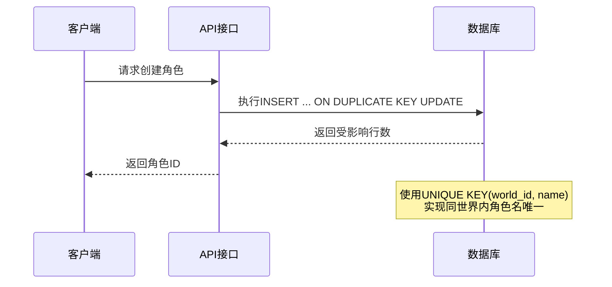

**图表来源**
- [model/character.py:172-190](file://model/character.py#L172-L190)

**章节来源**
- [model/character.py:72-484](file://model/character.py#L72-L484)

### 地点模型详细分析

#### 层级结构管理

地点模型实现了复杂的层级结构管理：

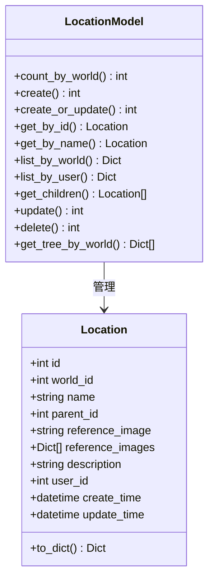

**图表来源**
- [model/location.py:13-48](file://model/location.py#L13-L48)
- [model/location.py:51-529](file://model/location.py#L51-L529)

#### 树形结构构建算法

地点模型实现了高效的树形结构构建算法：

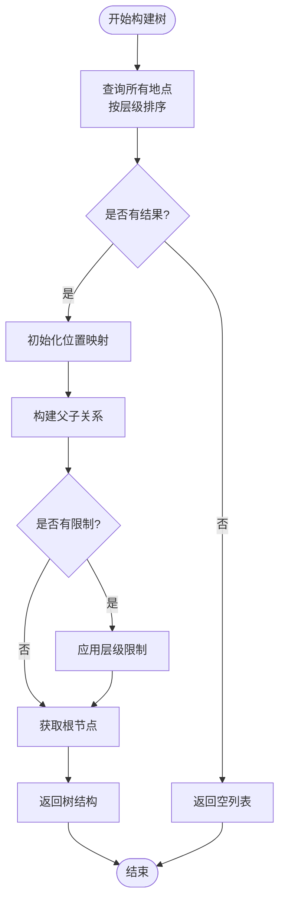

**图表来源**
- [model/location.py:423-503](file://model/location.py#L423-L503)

**章节来源**
- [model/location.py:51-529](file://model/location.py#L51-L529)

### 道具模型详细分析

#### 简洁设计原则

道具模型体现了简洁设计原则：

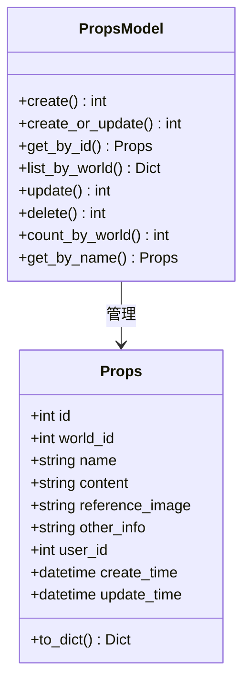

**图表来源**
- [model/props.py:8-34](file://model/props.py#L8-L34)
- [model/props.py:37-365](file://model/props.py#L37-L365)

#### 搜索优化策略

道具模型采用了高效的搜索优化策略：

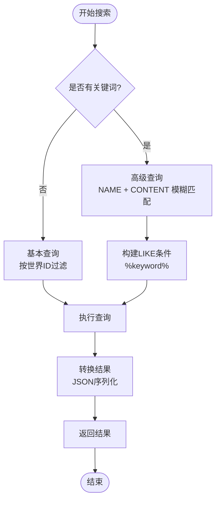

**图表来源**
- [model/props.py:158-216](file://model/props.py#L158-L216)

**章节来源**
- [model/props.py:37-365](file://model/props.py#L37-L365)

### 国际化系统分析

#### 多语言支持架构

国际化系统采用了轻量级的设计理念：

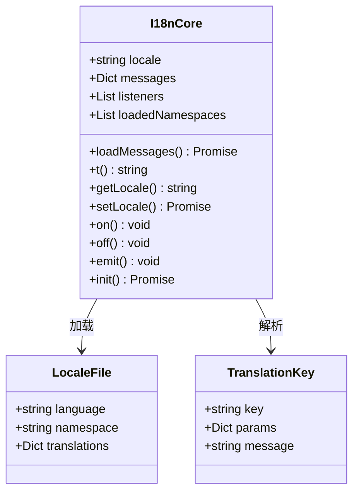

**图表来源**
- [web/i18n/i18n-core.js:11-180](file://web/i18n/i18n-core.js#L11-L180)

#### 语言切换机制

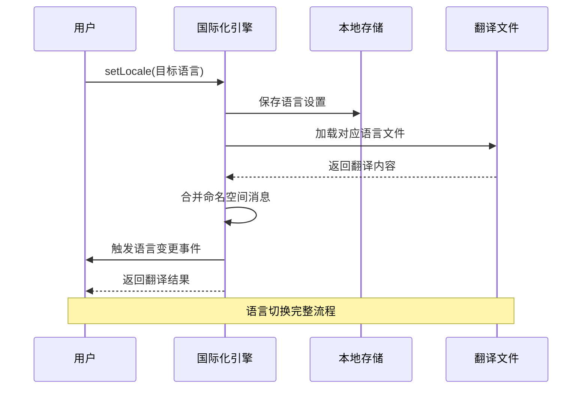

**图表来源**
- [web/i18n/i18n-core.js:104-121](file://web/i18n/i18n-core.js#L104-L121)

**章节来源**
- [web/i18n/i18n-core.js:1-180](file://web/i18n/i18n-core.js#L1-L180)

## 依赖关系分析

系统采用松耦合的设计，各组件之间的依赖关系清晰明确：

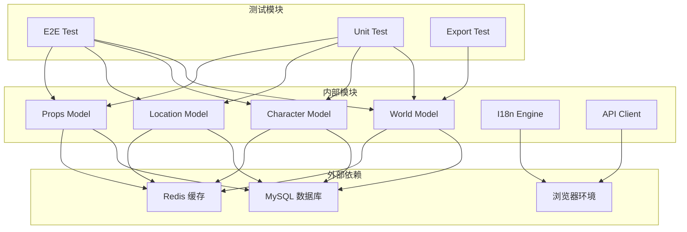

**图表来源**
- [model/world.py:4-8](file://model/world.py#L4-L8)
- [model/character.py:4-8](file://model/character.py#L4-L8)
- [model/location.py:4-8](file://model/location.py#L4-L8)
- [model/props.py:1-5](file://model/props.py#L1-L5)

### 数据库关系图

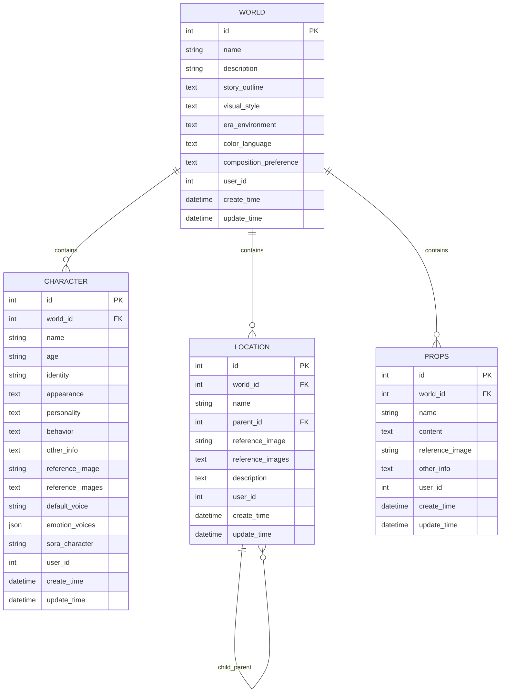

**图表来源**
- [model/world.py:266-285](file://model/world.py#L266-L285)
- [model/character.py:456-483](file://model/character.py#L456-L483)
- [model/location.py:506-528](file://model/location.py#L506-L528)
- [model/props.py:345-364](file://model/props.py#L345-L364)

**章节来源**
- [model/world.py:266-285](file://model/world.py#L266-L285)
- [model/character.py:456-483](file://model/character.py#L456-L483)
- [model/location.py:506-528](file://model/location.py#L506-L528)
- [model/props.py:345-364](file://model/props.py#L345-L364)

## 性能考虑

### 查询优化策略

系统在多个层面实施了性能优化：

1. **索引优化**：为常用查询字段建立合适的索引
2. **分页查询**：避免一次性加载大量数据
3. **缓存策略**：对热点数据实施缓存
4. **批量操作**：支持批量数据处理

### 内存管理

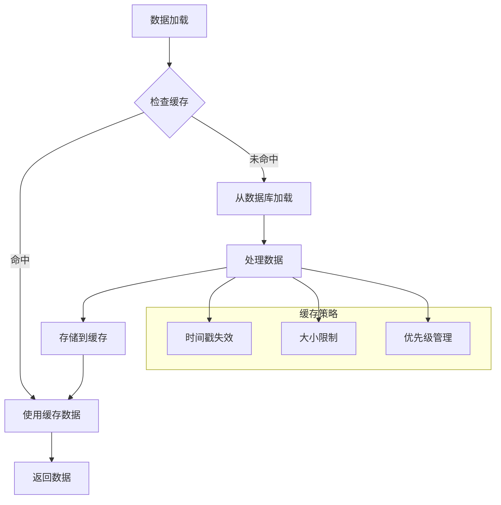

### 并发控制

系统采用了多种并发控制机制：

- **数据库事务**：确保数据一致性
- **锁机制**：防止竞态条件
- **重试策略**：提高系统可靠性

## 故障排除指南

### 常见问题诊断

#### 数据库连接问题

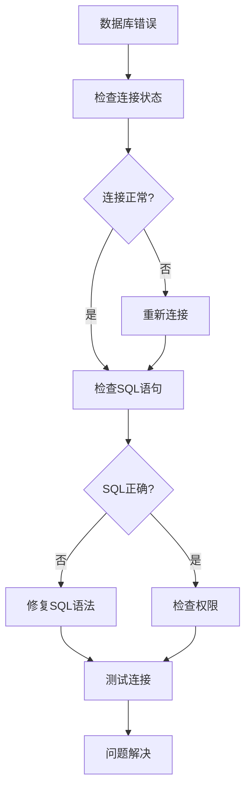

#### 数据一致性问题

当遇到数据不一致问题时，建议按照以下步骤排查：

1. **检查外键约束**：确认关联数据的完整性
2. **验证唯一性约束**：确保唯一性字段的正确性
3. **检查事务处理**：确认事务的原子性和一致性
4. **验证数据类型**：确保字段类型匹配

**章节来源**
- [auto_test/e2e/test_world.py:19-136](file://auto_test/e2e/test_world.py#L19-L136)
- [auto_test/e2e/test_character.py:15-111](file://auto_test/e2e/test_character.py#L15-L111)
- [auto_test/e2e/test_location.py:15-119](file://auto_test/e2e/test_location.py#L15-L119)

## 结论

世界内容模型是一个设计精良、功能完备的内容管理系统。通过合理的分层架构、清晰的模块划分、完善的国际化支持，该系统能够有效管理复杂的虚拟世界内容。

### 主要优势

1. **架构清晰**：分层设计使得系统易于维护和扩展
2. **功能完整**：涵盖世界、角色、地点、道具四大核心实体
3. **性能优化**：多层缓存和索引优化确保系统高效运行
4. **国际化支持**：完整的多语言解决方案
5. **测试完善**：全面的测试覆盖确保系统稳定性

### 改进建议

1. **监控系统**：增加系统性能监控和日志分析
2. **备份策略**：完善数据备份和恢复机制
3. **安全增强**：加强数据安全和访问控制
4. **API文档**：完善API接口文档和示例

## 附录

### 测试用例概览

系统提供了全面的测试覆盖：

- **E2E测试**：端到端功能测试，覆盖主要业务流程
- **单元测试**：模型层单元测试，确保核心逻辑正确性
- **导出测试**：数据导入导出功能测试
- **集成测试**：模块间集成测试

### 开发规范

- **代码风格**：统一的代码风格和命名规范
- **文档标准**：完整的API文档和使用说明
- **版本管理**：严格的版本控制和发布流程
- **质量保证**：持续集成和自动化测试