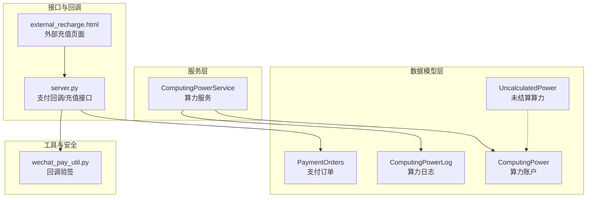
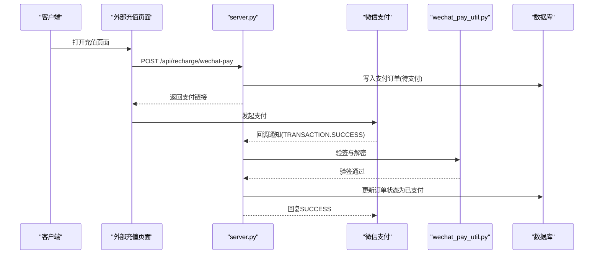
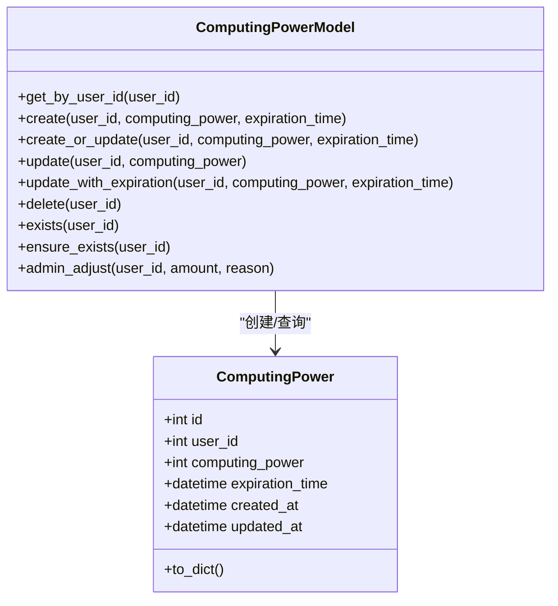
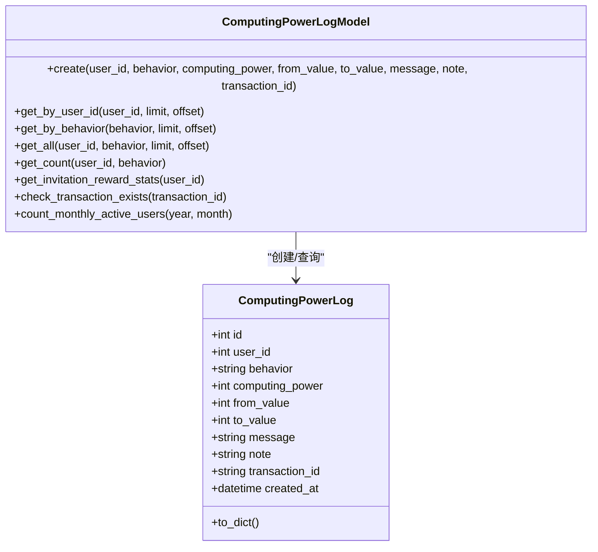
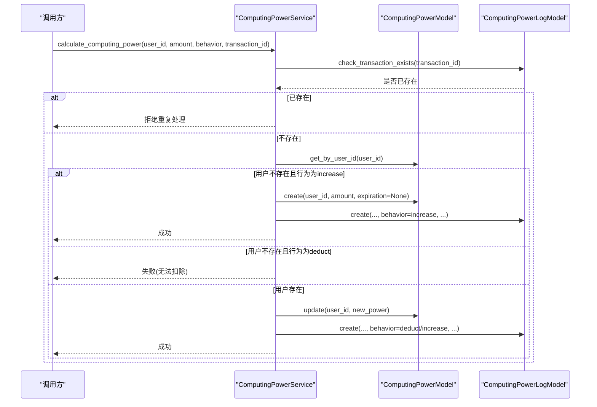
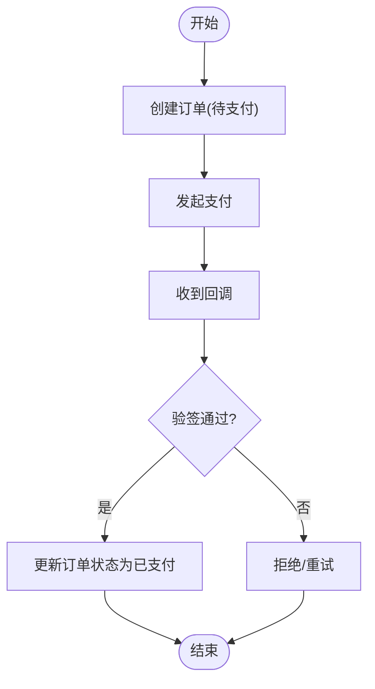
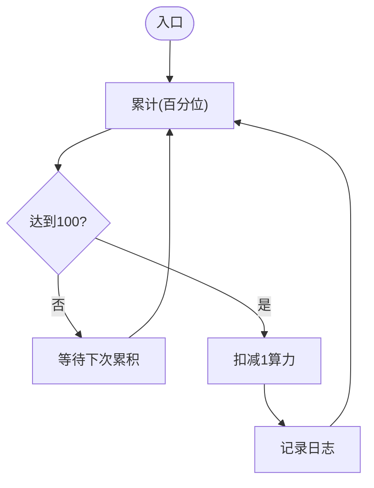
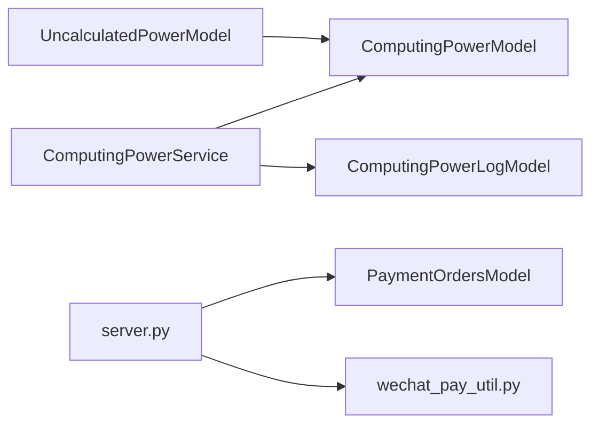

# 业务交易模型

<cite>
**本文引用的文件**
- [model/computing_power.py](file://model/computing_power.py)
- [model/computing_power_log.py](file://model/computing_power_log.py)
- [perseids_server/services/computing_power_service.py](file://perseids_server/services/computing_power_service.py)
- [model/payment_orders.py](file://model/payment_orders.py)
- [model/uncalculated_power.py](file://model/uncalculated_power.py)
- [alembic/versions/20260409_create_uncalculated_power.py](file://alembic/versions/20260409_create_uncalculated_power.py)
- [server.py](file://server.py)
- [utils/wechat_pay_util.py](file://utils/wechat_pay_util.py)
- [tests/utils/test_refund_with_modifiers.py](file://tests/utils/test_refund_with_modifiers.py)
- [tests/crud/test_payment_orders_crud.py](file://tests/crud/test_payment_orders_crud.py)
- [web/external_recharge.html](file://web/external_recharge.html)
</cite>

## 目录
1. [引言](#引言)
2. [项目结构](#项目结构)
3. [核心组件](#核心组件)
4. [架构总览](#架构总览)
5. [详细组件分析](#详细组件分析)
6. [依赖分析](#依赖分析)
7. [性能考虑](#性能考虑)
8. [故障排查指南](#故障排查指南)
9. [结论](#结论)
10. [附录](#附录)

## 引言
本文件围绕业务交易模型，系统化梳理“算力账户”“算力消费日志”“支付订单”“未结算算力”等关键模块的设计与实现，重点解释以下内容：
- ComputingPower 算力账户的余额管理、充值机制与消费规则
- ComputingPowerLog 算力消费日志的记录格式、统计维度与审计要求
- PaymentOrders 支付订单的状态流转、回调处理与对账机制
- UncalculatedPower 未结算算力的数据清理与补偿策略
- 交易安全、防重复与异常处理的实现方案

## 项目结构
围绕业务交易模型的相关代码主要分布在以下位置：
- 数据模型层：model/computing_power.py、model/computing_power_log.py、model/payment_orders.py、model/uncalculated_power.py
- 服务层：perseids_server/services/computing_power_service.py
- 接口与回调：server.py（支付回调）、web/external_recharge.html（外部充值页面）
- 工具与安全：utils/wechat_pay_util.py（回调验签）
- 迁移脚本：alembic/versions/20260409_create_uncalculated_power.py（未结算算力建表）
- 测试：tests/utils/test_refund_with_modifiers.py（退款一致性）、tests/crud/test_payment_orders_crud.py（支付订单CRUD）

**图表来源**
- [model/computing_power.py:14-197](file://model/computing_power.py#L14-L197)
- [model/computing_power_log.py:12-246](file://model/computing_power_log.py#L12-L246)
- [perseids_server/services/computing_power_service.py:13-243](file://perseids_server/services/computing_power_service.py#L13-L243)
- [model/payment_orders.py:11-307](file://model/payment_orders.py#L11-L307)
- [model/uncalculated_power.py:13-78](file://model/uncalculated_power.py#L13-L78)
- [server.py:4490-4551](file://server.py#L4490-L4551)
- [utils/wechat_pay_util.py:492-520](file://utils/wechat_pay_util.py#L492-L520)
- [web/external_recharge.html:219-272](file://web/external_recharge.html#L219-L272)

**章节来源**
- [model/computing_power.py:14-197](file://model/computing_power.py#L14-L197)
- [model/computing_power_log.py:12-246](file://model/computing_power_log.py#L12-L246)
- [perseids_server/services/computing_power_service.py:13-243](file://perseids_server/services/computing_power_service.py#L13-L243)
- [model/payment_orders.py:11-307](file://model/payment_orders.py#L11-L307)
- [model/uncalculated_power.py:13-78](file://model/uncalculated_power.py#L13-L78)
- [alembic/versions/20260409_create_uncalculated_power.py:20-39](file://alembic/versions/20260409_create_uncalculated_power.py#L20-L39)
- [server.py:4490-4551](file://server.py#L4490-L4551)
- [utils/wechat_pay_util.py:492-520](file://utils/wechat_pay_util.py#L492-L520)
- [web/external_recharge.html:219-272](file://web/external_recharge.html#L219-L272)

## 核心组件
- ComputingPower 算力账户：提供按用户维度的算力余额、过期时间管理，支持创建、更新、删除、存在性检查与管理员调整。
- ComputingPowerLog 算力日志：记录每次算力变动的明细，包含行为类型、消息、备注、交易号、前后值等字段，并提供统计与审计能力。
- ComputingPowerService 算力服务：封装算力查询、增减、日志查询、邀请奖励统计与幂等性控制。
- PaymentOrders 支付订单：管理充值订单的生命周期，包括创建、状态更新、支付完成标记、取消与退款等。
- UncalculatedPower 未结算算力：以百分位精度累积算力，满100（即1算力）时进行实际扣减，支持UPSERT。
- 支付回调与安全：微信支付回调解析、验签与对账；外部充值页面发起支付。

**章节来源**
- [model/computing_power.py:37-183](file://model/computing_power.py#L37-L183)
- [model/computing_power_log.py:43-225](file://model/computing_power_log.py#L43-L225)
- [perseids_server/services/computing_power_service.py:13-243](file://perseids_server/services/computing_power_service.py#L13-L243)
- [model/payment_orders.py:52-307](file://model/payment_orders.py#L52-L307)
- [model/uncalculated_power.py:31-78](file://model/uncalculated_power.py#L31-L78)
- [server.py:4490-4551](file://server.py#L4490-L4551)
- [utils/wechat_pay_util.py:492-520](file://utils/wechat_pay_util.py#L492-L520)
- [web/external_recharge.html:219-272](file://web/external_recharge.html#L219-L272)

## 架构总览
业务交易模型采用“服务层-数据模型层-接口与工具”的分层设计：
- 服务层负责业务编排与幂等性控制（如算力增减、日志记录、邀请奖励统计）
- 数据模型层提供数据库访问与索引优化（如日志表的复合索引）
- 接口与工具层处理外部交互（支付回调、验签、充值页面）

**图表来源**
- [server.py:4490-4551](file://server.py#L4490-L4551)
- [utils/wechat_pay_util.py:492-520](file://utils/wechat_pay_util.py#L492-L520)
- [web/external_recharge.html:219-272](file://web/external_recharge.html#L219-L272)
- [model/payment_orders.py:52-307](file://model/payment_orders.py#L52-L307)

## 详细组件分析

### ComputingPower 算力账户
- 余额管理
  - 提供按用户ID查询、创建、更新、删除与存在性检查
  - 支持设置过期时间，便于周期性清零与续费
- 充值机制
  - 通过服务层的“算力增加”接口实现，幂等性由交易号保障
  - 管理员可通过调整接口进行加减操作，并生成相应日志
- 消费规则
  - 扣除前校验余额，避免透支
  - 交易号重复直接拒绝，防止重复扣减

**图表来源**
- [model/computing_power.py:14-183](file://model/computing_power.py#L14-L183)

**章节来源**
- [model/computing_power.py:37-183](file://model/computing_power.py#L37-L183)

### ComputingPowerLog 算力日志
- 记录格式
  - 关键字段：用户ID、行为类型(increase/deduct)、算力变动值、消息、备注、交易号、前后值、创建时间
- 统计维度
  - 支持按用户、行为类型筛选与计数
  - 提供邀请奖励统计（满足特定备注模式的增加类记录）
  - 提供月活跃用户统计（基于日志时间跨度与次数）
- 审计要求
  - 交易号唯一性检查，保障幂等性
  - 复合索引优化查询与统计性能

**图表来源**
- [model/computing_power_log.py:12-225](file://model/computing_power_log.py#L12-L225)

**章节来源**
- [model/computing_power_log.py:43-225](file://model/computing_power_log.py#L43-L225)

### ComputingPowerService 算力服务
- 查询与保证
  - 查询用户算力，若不存在则自动创建初始记录
  - 提供“确保用户有算力”的便捷方法
- 幂等性与风控
  - 交易号重复直接拒绝
  - 扣除前校验余额，避免透支
- 日志与统计
  - 统一记录日志，支持查询与邀请奖励统计

**图表来源**
- [perseids_server/services/computing_power_service.py:61-173](file://perseids_server/services/computing_power_service.py#L61-L173)
- [model/computing_power.py:87-110](file://model/computing_power.py#L87-L110)
- [model/computing_power_log.py:47-69](file://model/computing_power_log.py#L47-L69)

**章节来源**
- [perseids_server/services/computing_power_service.py:13-243](file://perseids_server/services/computing_power_service.py#L13-L243)

### PaymentOrders 支付订单
- 状态流转
  - 0-待支付 → 1-已支付（或2-已取消/3-已退款）
  - 支付完成后写入交易号与支付时间
- 回调处理
  - 接收微信回调，验签与解密后更新订单状态
- 对账机制
  - 通过订单号与交易号进行核对，确保一致性

**图表来源**
- [model/payment_orders.py:52-307](file://model/payment_orders.py#L52-L307)
- [server.py:4490-4551](file://server.py#L4490-L4551)
- [utils/wechat_pay_util.py:492-520](file://utils/wechat_pay_util.py#L492-L520)

**章节来源**
- [model/payment_orders.py:52-307](file://model/payment_orders.py#L52-L307)
- [server.py:4490-4551](file://server.py#L4490-L4551)
- [utils/wechat_pay_util.py:492-520](file://utils/wechat_pay_util.py#L492-L520)

### UncalculatedPower 未结算算力
- 设计目标
  - 以百分位（100=1算力）累积，降低高频小额度扣减的数据库压力
- 数据清理与补偿
  - 通过定时任务或业务逻辑将累计值达到阈值的部分转换为实际扣减
  - 与 ComputingPower 账户保持一致的幂等性与审计要求

**图表来源**
- [model/uncalculated_power.py:31-65](file://model/uncalculated_power.py#L31-L65)
- [alembic/versions/20260409_create_uncalculated_power.py:20-39](file://alembic/versions/20260409_create_uncalculated_power.py#L20-L39)

**章节来源**
- [model/uncalculated_power.py:31-78](file://model/uncalculated_power.py#L31-L78)
- [alembic/versions/20260409_create_uncalculated_power.py:20-39](file://alembic/versions/20260409_create_uncalculated_power.py#L20-L39)

### 外部充值与退款一致性
- 外部充值页面
  - 通过 /api/recharge/wechat-pay 创建订单并拉起支付
- 退款一致性
  - 任务执行失败时按相同规则计算并退还算力，确保扣除与退还不一致的问题

**章节来源**
- [web/external_recharge.html:219-272](file://web/external_recharge.html#L219-L272)
- [tests/utils/test_refund_with_modifiers.py:101-136](file://tests/utils/test_refund_with_modifiers.py#L101-L136)

## 依赖分析
- 服务层依赖数据模型层提供的查询与写入能力
- 支付回调依赖工具层的验签与解密能力
- 未结算算力作为独立表，与算力账户形成互补的扣减策略

**图表来源**
- [perseids_server/services/computing_power_service.py:13-243](file://perseids_server/services/computing_power_service.py#L13-L243)
- [model/computing_power.py:37-183](file://model/computing_power.py#L37-L183)
- [model/computing_power_log.py:43-225](file://model/computing_power_log.py#L43-L225)
- [model/payment_orders.py:52-307](file://model/payment_orders.py#L52-L307)
- [model/uncalculated_power.py:31-78](file://model/uncalculated_power.py#L31-L78)
- [server.py:4490-4551](file://server.py#L4490-L4551)
- [utils/wechat_pay_util.py:492-520](file://utils/wechat_pay_util.py#L492-L520)

**章节来源**
- [perseids_server/services/computing_power_service.py:13-243](file://perseids_server/services/computing_power_service.py#L13-L243)
- [model/computing_power.py:37-183](file://model/computing_power.py#L37-L183)
- [model/computing_power_log.py:43-225](file://model/computing_power_log.py#L43-L225)
- [model/payment_orders.py:52-307](file://model/payment_orders.py#L52-L307)
- [model/uncalculated_power.py:31-78](file://model/uncalculated_power.py#L31-L78)
- [server.py:4490-4551](file://server.py#L4490-L4551)
- [utils/wechat_pay_util.py:492-520](file://utils/wechat_pay_util.py#L492-L520)

## 性能考虑
- 索引优化
  - 算力日志表针对用户+时间、行为+时间、用户+行为+备注建立索引，提升查询与统计效率
- 幂等性
  - 交易号唯一性检查避免重复处理，减少无效写入
- 未结算算力
  - 百分位累积降低频繁写入频率，提高吞吐

**章节来源**
- [model/computing_power_log.py:227-244](file://model/computing_power_log.py#L227-L244)
- [model/uncalculated_power.py:67-78](file://model/uncalculated_power.py#L67-L78)

## 故障排查指南
- 支付回调验签失败
  - 检查回调头中的时间戳、随机串、签名与证书序列号
  - 确认解密参数（密文、附加数据、随机串）完整
- 重复交易号
  - 服务层会直接拒绝已存在的交易号，需检查上游幂等策略
- 余额不足
  - 扣除前会校验余额，失败时返回具体提示与当前余额
- 日志统计异常
  - 检查索引是否存在以及查询条件是否命中索引

**章节来源**
- [server.py:4500-4551](file://server.py#L4500-L4551)
- [utils/wechat_pay_util.py:492-520](file://utils/wechat_pay_util.py#L492-L520)
- [perseids_server/services/computing_power_service.py:84-144](file://perseids_server/services/computing_power_service.py#L84-L144)
- [model/computing_power_log.py:176-184](file://model/computing_power_log.py#L176-L184)

## 结论
业务交易模型通过“算力账户+日志+服务层+支付回调+未结算算力”的协同，实现了：
- 明确的余额管理与消费规则
- 可审计的日志统计与幂等性保障
- 安全可靠的支付回调与对账
- 高效的未结算算力累积与补偿策略

建议持续关注索引维护、回调验签与幂等性策略的稳定性，确保在高并发场景下的可靠性与一致性。

## 附录
- 外部充值页面URL参数与流程参考：[web/external_recharge.html:219-272](file://web/external_recharge.html#L219-L272)
- 支付订单CRUD测试参考：[tests/crud/test_payment_orders_crud.py:187-214](file://tests/crud/test_payment_orders_crud.py#L187-L214)