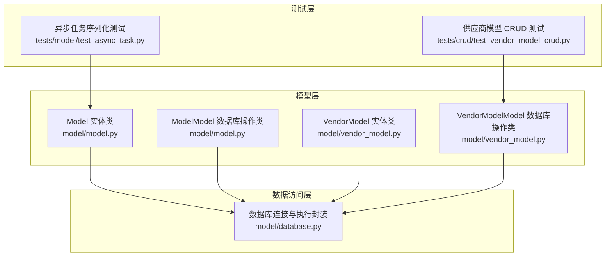
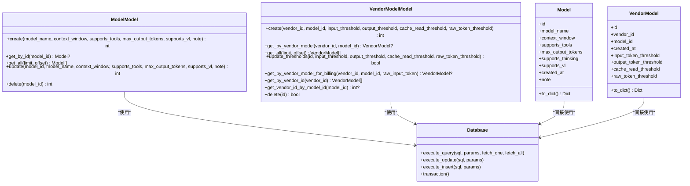
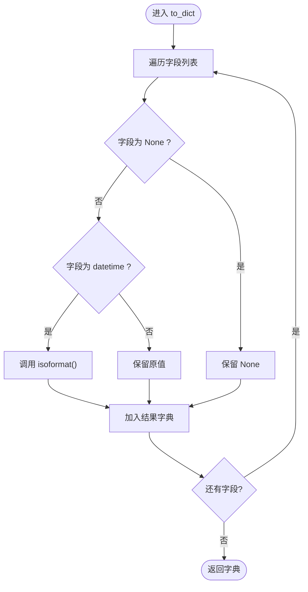
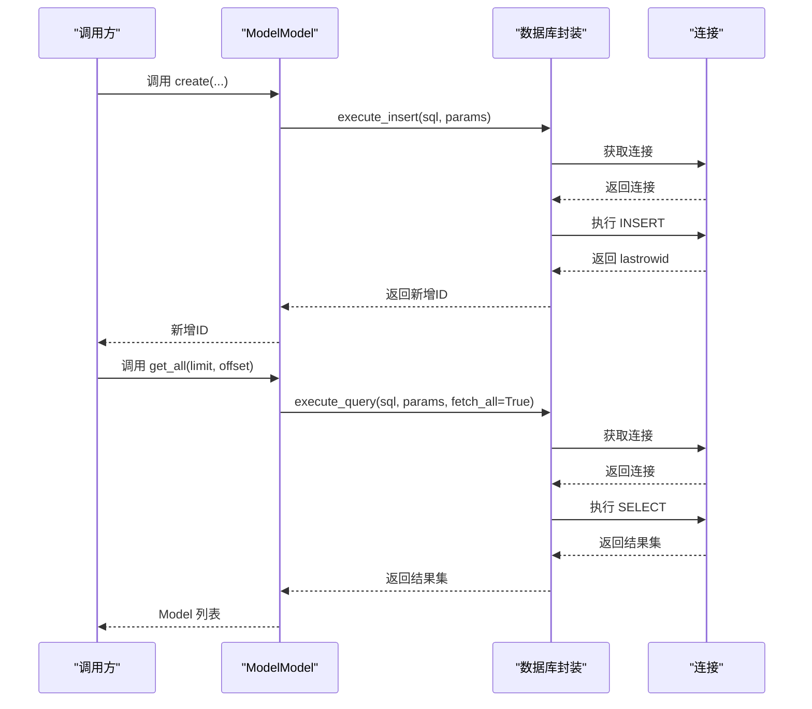
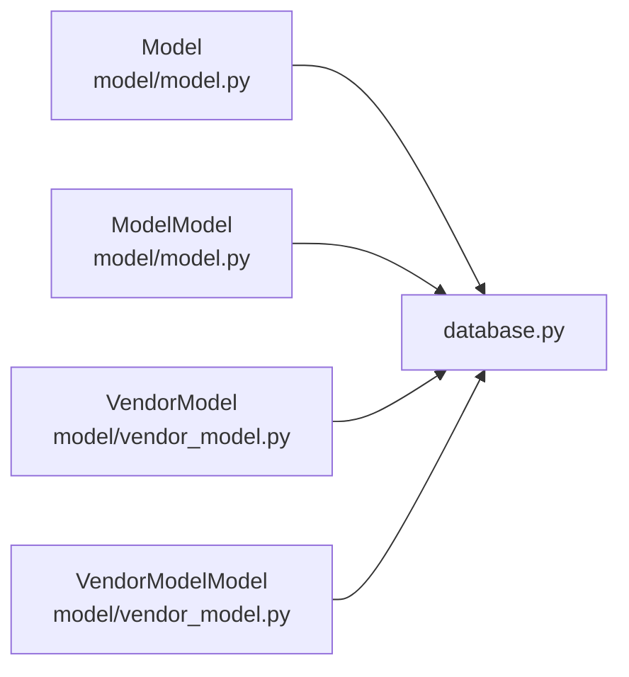
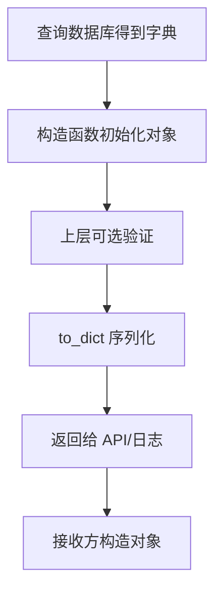

# 基础模型类

<cite>
**本文引用的文件**
- [model/model.py](file://model/model.py)
- [model/database.py](file://model/database.py)
- [model/vendor_model.py](file://model/vendor_model.py)
- [tests/crud/test_vendor_model_crud.py](file://tests/crud/test_vendor_model_crud.py)
- [tests/model/test_async_task.py](file://tests/model/test_async_task.py)
</cite>

## 目录
1. [简介](#简介)
2. [项目结构](#项目结构)
3. [核心组件](#核心组件)
4. [架构总览](#架构总览)
5. [详细组件分析](#详细组件分析)
6. [依赖关系分析](#依赖关系分析)
7. [性能考虑](#性能考虑)
8. [故障排查指南](#故障排查指南)
9. [结论](#结论)
10. [附录](#附录)

## 简介
本文件围绕“基础模型类”展开，重点解释两类内容：
- Model 基类：面向单条记录的数据容器与序列化能力，涵盖构造函数参数处理与数据类型转换（如日期时间转字符串）。
- ModelModel 数据库操作类：提供标准 CRUD 操作（create、get_by_id、get_all、update、delete），包含 SQL 构建、参数绑定、异常处理与日志记录。

同时，本文以 VendorModel/VendorModelModel 作为另一个典型模型实现进行对比参考，帮助理解一致性的设计模式与最佳实践。

## 项目结构
与“基础模型类”相关的核心文件组织如下：
- model/model.py：定义 Model 实体类与 ModelModel 数据库操作类，以及表结构定义常量。
- model/database.py：数据库连接、事务与 SQL 执行封装（execute_query、execute_update、execute_insert、transaction 等）。
- model/vendor_model.py：另一个模型实现示例（VendorModel/VendorModelModel），展示相同模式下的不同字段与业务逻辑。
- tests/crud/test_vendor_model_crud.py：供应商模型的 CRUD 测试样例，体现调用方式与断言策略。
- tests/model/test_async_task.py：异步任务模型的序列化测试，展示 to_dict 中日期字段的处理方式。

**图表来源**
- [model/model.py:12-127](file://model/model.py#L12-L127)
- [model/database.py:31-177](file://model/database.py#L31-L177)
- [model/vendor_model.py:13-236](file://model/vendor_model.py#L13-L236)
- [tests/crud/test_vendor_model_crud.py](file://tests/crud/test_vendor_model_crud.py)
- [tests/model/test_async_task.py:108-141](file://tests/model/test_async_task.py#L108-L141)

**章节来源**
- [model/model.py:1-127](file://model/model.py#L1-L127)
- [model/database.py:1-177](file://model/database.py#L1-L177)
- [model/vendor_model.py:1-236](file://model/vendor_model.py#L1-L236)
- [tests/crud/test_vendor_model_crud.py](file://tests/crud/test_vendor_model_crud.py)
- [tests/model/test_async_task.py:108-141](file://tests/model/test_async_task.py#L108-L141)

## 核心组件
- Model 实体类
  - 负责将数据库查询结果映射为对象属性，并提供 to_dict 序列化方法。
  - 支持可选字段与默认值，确保构造健壮性。
- ModelModel 数据库操作类
  - 提供静态方法完成 CRUD 操作，内部通过数据库封装执行 SQL。
  - 统一的日志记录与异常抛出策略，便于上层捕获与处理。
- 数据库封装
  - 提供连接池式上下文管理、事务控制、查询/插入/更新执行器。
  - 明确的参数绑定与返回值约定，保证 SQL 安全与一致性。

**章节来源**
- [model/model.py:12-127](file://model/model.py#L12-L127)
- [model/database.py:31-177](file://model/database.py#L31-L177)

## 架构总览
下面的类图展示了“基础模型类”的核心结构与关系：

**图表来源**
- [model/model.py:12-127](file://model/model.py#L12-L127)
- [model/vendor_model.py:13-236](file://model/vendor_model.py#L13-L236)
- [model/database.py:62-177](file://model/database.py#L62-L177)

## 详细组件分析

### Model 实体类与序列化
- 设计理念
  - 将数据库行映射为 Python 对象，统一字段命名与可空性处理。
  - to_dict 提供标准化序列化，便于 API 响应与日志输出。
- 关键点
  - 可选字段与默认值：如 supports_tools 默认 1、max_output_tokens 默认 64000、supports_thinking/suppress_vl 默认 0。
  - 数据类型转换：日期时间字段在序列化时转为 ISO 字符串；None 保持不变。
  - 参数处理：构造函数接受任意关键字参数，通过 get 提取，避免字段缺失导致异常。
- 典型用法
  - 查询后将字典结果传入构造函数，再调用 to_dict 输出。
  - 与数据库封装配合，实现 ORM 风格的对象化访问。

**图表来源**
- [model/model.py:26-38](file://model/model.py#L26-L38)

**章节来源**
- [model/model.py:12-38](file://model/model.py#L12-L38)
- [tests/model/test_async_task.py:108-141](file://tests/model/test_async_task.py#L108-L141)

### ModelModel 数据库操作类
- 设计理念
  - 面向单一表的 CRUD 操作，方法名与职责清晰，参数与返回值约定明确。
  - 使用参数化 SQL，避免拼接风险；通过数据库封装统一执行。
- 方法详解
  - create：插入新记录，返回新增 ID。
  - get_by_id：按主键查询单条记录，不存在返回 None。
  - get_all：分页查询，支持 limit/offset。
  - update：按主键更新，返回受影响行数。
  - delete：按主键删除，返回受影响行数。
- SQL 构建与参数绑定
  - 使用占位符 %s 绑定参数，确保安全与可读性。
  - 分页逻辑动态拼接 LIMIT/OFFSET，仅在需要时追加。
- 异常处理与日志
  - 每个方法均包裹 try/except，捕获异常后记录错误日志并重新抛出，便于上层统一处理。
- 事务与批量操作
  - 若需跨多步原子性操作，建议使用数据库封装提供的 transaction 上下文管理器。

**图表来源**
- [model/model.py:44-110](file://model/model.py#L44-L110)
- [model/database.py:62-119](file://model/database.py#L62-L119)

**章节来源**
- [model/model.py:41-110](file://model/model.py#L41-L110)
- [model/database.py:62-119](file://model/database.py#L62-L119)

### VendorModel 与 VendorModelModel（对比参考）
- 设计对比
  - 字段更丰富，包含计费相关阈值字段，适合复杂定价策略。
  - 提供按输入 token 数分段计费的查询方法，体现业务复杂度。
- 与 Model/ModelModel 的一致性
  - 同样采用 to_dict 序列化与参数化 SQL。
  - 统一的日志记录与异常抛出策略。
- 测试参考
  - CRUD 测试覆盖 create、get_by_id、get_all、update、delete 等场景，可作为编写同类模型测试的模板。

**章节来源**
- [model/vendor_model.py:13-236](file://model/vendor_model.py#L13-L236)
- [tests/crud/test_vendor_model_crud.py](file://tests/crud/test_vendor_model_crud.py)

## 依赖关系分析
- Model 与 ModelModel 依赖数据库封装（execute_query、execute_update、execute_insert）。
- VendorModel 与 VendorModelModel 同理，但引入了更复杂的查询条件与阈值逻辑。
- 日志记录贯穿各层，统一使用 Python logging 模块，便于集中配置与排查。

**图表来源**
- [model/model.py:5-6](file://model/model.py#L5-L6)
- [model/vendor_model.py](file://model/vendor_model.py#L7)
- [model/database.py:13-15](file://model/database.py#L13-L15)

**章节来源**
- [model/model.py:5-6](file://model/model.py#L5-L6)
- [model/vendor_model.py](file://model/vendor_model.py#L7)
- [model/database.py:13-15](file://model/database.py#L13-L15)

## 性能考虑
- SQL 参数化
  - 使用占位符绑定参数，避免重复解析与注入风险，提升执行效率与安全性。
- 分页查询
  - get_all 动态拼接 LIMIT/OFFSET，建议结合索引优化与合理分页大小。
- 事务批处理
  - 对于多步写操作，使用 transaction 上下文减少往返与提升一致性。
- 序列化开销
  - to_dict 中对 datetime 的 isoformat 转换成本较低，但在大量对象序列化时仍需关注整体响应时间。

[本节为通用指导，无需特定文件来源]

## 故障排查指南
- 连接失败
  - 检查数据库配置加载与环境变量覆盖是否正确。
  - 查看连接阶段日志，确认主机、端口、账号、密码与字符集设置。
- SQL 执行异常
  - 捕获异常后查看日志中的错误信息，核对参数数量与类型。
  - 确认表结构与字段名是否与 SQL 一致。
- 事务未提交
  - 确保在事务上下文中正确 commit/rollback，避免资源泄漏。
- 序列化问题
  - 若发现日期字段为空，检查构造函数传入的字典是否包含该字段。
  - 若需要统一格式，可在 to_dict 中增加字段转换逻辑。

**章节来源**
- [model/database.py:31-60](file://model/database.py#L31-L60)
- [model/model.py:48-54](file://model/model.py#L48-L54)
- [model/vendor_model.py:53-57](file://model/vendor_model.py#L53-L57)

## 结论
- Model/ModelModel 提供了简洁、一致且安全的模型层抽象，适用于大多数单表 CRUD 场景。
- 通过 to_dict 统一序列化与日志/异常处理，提升了可观测性与可维护性。
- VendorModel/VendorModelModel 展示了在复杂业务下的扩展方式，可作为参考模板。

[本节为总结，无需特定文件来源]

## 附录

### 模型实例化、数据验证与序列化/反序列化流程
- 实例化
  - 从数据库查询得到字典结果 → 传入实体类构造函数 → 生成对象。
- 数据验证
  - 构造函数使用 get 提取字段，避免 KeyError；必要时可在上层对关键字段进行显式校验。
- 序列化
  - 调用 to_dict → 自动处理可空与日期转换 → 输出字典供 API 响应或日志使用。
- 反序列化
  - 从请求体或外部数据源得到字典 → 传入构造函数 → 生成对象（注意字段映射与类型转换）。

[本图为概念流程图，无需图表来源]

### 最佳实践清单
- 使用参数化 SQL，避免字符串拼接。
- 统一使用日志记录关键操作与异常。
- 对日期时间字段在序列化时做格式化处理。
- 在批量写入时使用事务上下文。
- 为复杂查询提供专门方法（如 VendorModelModel 的分段计费查询）。

[本节为通用指导，无需特定文件来源]